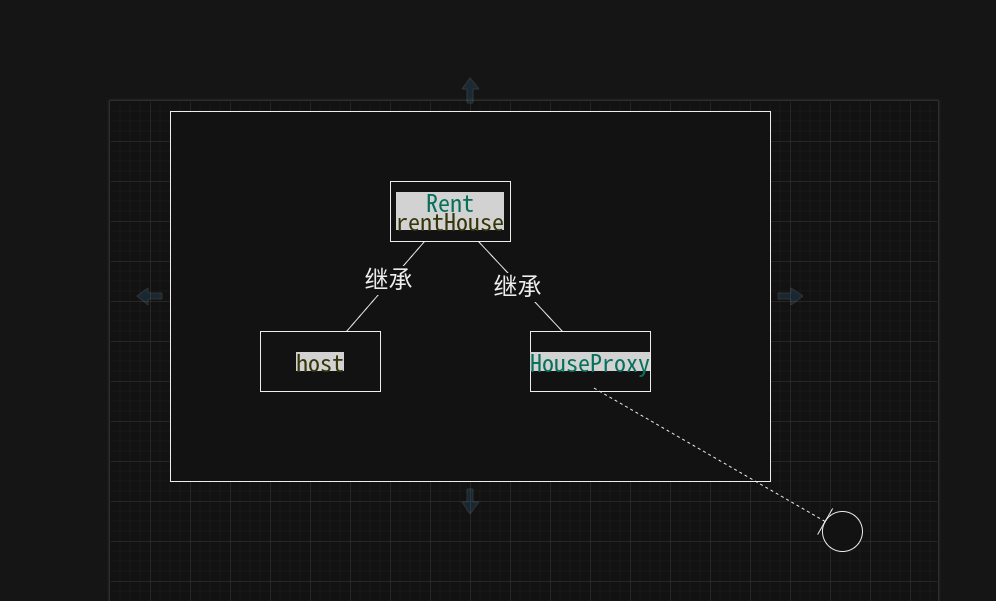
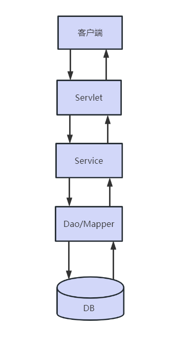
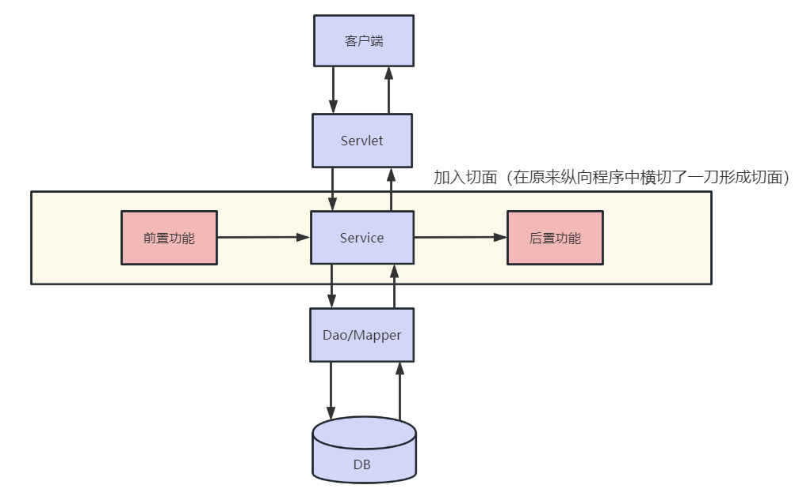

## spring
单纯使用Mybatis框架，业务层代码复杂，需要用大量的代码自行解析mybatis.xml配置文件，压力都给到了业务层代码，如下代码：
```java
public class Test2 {
    public static void main(String[] args) throws IOException {
        //指定核心配置文件的路径：
        String resource = "mybatis.xml";
        //获取加载配置文件的输入流：
        InputStream inputStream = Resources.getResourceAsStream(resource);
        //加载配置文件，创建工厂类
        SqlSessionFactory sqlSessionFactory = new SqlSessionFactoryBuilder().build(inputStream);
        //通过工厂类获取一个会话：
        SqlSession sqlSession = sqlSessionFactory.openSession();
        //代理
        BookMapper mapper = sqlSession.getMapper(BookMapper.class);
        //Book book = mapper.selectOneBook("项目驱动零起点学Java", "马士兵、赵珊珊");
        Book b = new Book();
        b.setName("项目驱动零起点学Java");
        b.setAuthor("马士兵、赵珊珊");
        //Book book = mapper.selectOneBook2(b);
        Book book = mapper.selectOneBook3("项目驱动零起点学Java", b);
        System.out.println(book.getName());
        //关闭资源：
        sqlSession.close();
    }
}
```
学习了spring以后，mybaits的使用会更加简单，会简化业务层处理的代码。

层与层之间的耦合性太高了。比如在分层思想中，controller层调用service层，service层调用mapper层（dao层），controller层中调用service层的对象的时候，需要构建service层对象，此时如果service改变，那么controller层中所有new service层对象的位置全部需要改变。学了spring以后，你看不到new对象了，创建对象交由spring来完成，就是我们要学习的ioc/di部分。
mybatis中处理事务的方式与传统JDBC是一样的，事务管理不够方便，现在可以交由Spring来管理。就是我们要学习的tx部分。
目前的项目没有扩展性而言。比如我们写好的项目部署的话，需要把项目的war包发到服务器上，但是war包中都是class文件，没有办法修改，你想要对某个功能进行扩展是做不到的，学了spring以后，就可以在不改变原有代码的情况下，在它基础上做扩展，就是我们要学习的aop部分。
spring可以整合各种优秀的框架。spring也叫框架的框架，如整合springmvc，mybatis，就是我们常用的SSM框架

SSM
Spring + Spring MVC + Mybatis


Spring项目的最基本依赖包含：
* spring-context.jar。spring上下文依赖，它依赖了下面的四个jar。
* spring-core.jar。Spring 核心jar包。它依赖了spring-jcl.jar
* spring-aop.jar。Spring AOP面向切面编程的基本支持。
* spring-expression.jar。Spring的表达式语言支持。
* spring-beans.jar。Spring容器的bean管理，创建对象非常重要的包。
* spring-jcl.jar。内置的日志包，Spring 4版本时使用的还是common-logging.jar呢，但是从5开始Spring自己对日志进行了封装。


## IoC/DI 
IoC(Inversion of Control)中文名称：控制反转，也被称为DI(dependency injection )：依赖注入，属于同一件事情的两个名称。（一定注意，是一个事，不是两个事）
IoC/DI是指一个过程：创建对象的权利，或者是控制的位置，由JAVA代码转移到spring容器，由spring的容器控制对象的创建，就是控制反转，spring创建对象时，会读取配置文件中的信息，然后使用反射给我们创建好对象之后在容器（其实就是一个map集合）中存储起来，当我们需要某个对象时，通过id获取对象即可，不需要我们自己去new。

一句话：创建对象交给容器去做


容器（Container）
spring容器，放置所有管理对象的对象。
其本质是在容器对象里面有一个全局Map对象，map对象中放置所有被管理的对象。
Spring中容器是指 ApplicationContext 接口及子接口或实现类。

bean
容器中所有被管理的对象称为beans，如果单说其中一个对象可称为bean。

PeopleMapper、PeopleServiceImpl这些不同层中普通都可以交给Spring容器进行管理。放入到容器中的对象可以相互直接依赖。
但是Servlet只能被Tomcat管理（由Tomcat帮助实例化创建的），所以Spring容器是无法管理Servlet的。但是Servlet可以从Spring容器中取出对象。
```xml
<project xmlns="http://maven.apache.org/POM/4.0.0" xmlns:xsi="http://www.w3.org/2001/XMLSchema-instance"
         xsi:schemaLocation="http://maven.apache.org/POM/4.0.0 http://maven.apache.org/xsd/maven-4.0.0.xsd">
    <modelVersion>4.0.0</modelVersion>
    <parent>
        <groupId>com.msb</groupId>
        <artifactId>Spring6</artifactId>
        <version>1.0-SNAPSHOT</version>
    </parent>
    <artifactId>Spring6Demo01</artifactId>
    <packaging>jar</packaging>
    <name>Spring6Demo01</name>
    <url>http://maven.apache.org</url>
    <properties>
        <project.build.sourceEncoding>UTF-8</project.build.sourceEncoding>
    </properties>
    <dependencies>
        <!--添加spring-context依赖-->
        <dependency>
            <groupId>org.springframework</groupId>
            <artifactId>spring-context</artifactId>
            <version>6.0.5</version>
        </dependency>

        <dependency>
            <groupId>junit</groupId>
            <artifactId>junit</artifactId>
            <version>3.8.1</version>
            <scope>test</scope>
        </dependency>
    </dependencies>
</project>
```
随意创建一个类：创建Person类
```java
public class Person {
    // 属性
    private int age;
    private String name;
    private double height;
   //getter setter toString
}
```

添加Spring 配置文件
在 src\main\下新建resources 目录。
在 src\main\resources 目录下新建 applicationContext.xml 文件，并拷贝官网文档提供的模板内容到 xml 中。
文件名称没有强制要求。官方示例中配置文件名称叫做applicationContext.xml，所以我们也把Spring配置文件叫做applicationContext.xml
```xml
<?xml version="1.0" encoding="UTF-8"?>
<beans xmlns="http://www.springframework.org/schema/beans"
    xmlns:xsi="http://www.w3.org/2001/XMLSchema-instance"
    xsi:schemaLocation="http://www.springframework.org/schema/beans
        https://www.springframework.org/schema/beans/spring-beans.xsd">
    <!--
            id：bean对象的id，唯一标识。一般是Bean对象的名称的首字母小写
            class：bean对象的类路径
    -->
    <bean id="p" class="com.zss.pojo.Person"></bean>
</beans>
```
加载配置文件，获取实例化对象
```java
public class App {
    public static void main(String[] args) {
        // Spring通过加载配置文件，创建Spring容器。
        ApplicationContext ac = new ClassPathXmlApplicationContext("applicationContext.xml");
        // 从容器中取出叫做p的bean
        // 第二个参数设置取出Bean的类型。如果没有第二个参数，返回值类型为Object
        Person p = ac.getBean("p", Person.class);//这种方式不需要强转
        Person p2 = (Person)ac.getBean("p");//这种方式需要强转
        System.out.println(p == p2);//这个结果为true，证明从容器中获取的对象是同一个对象
        System.out.println(p);
        System.out.println(p2);
    }
}
```


Bean对象实例化方式
在Spring中实例化Bean有三种方式：
* 通过**构造方法**进行实例化。默认使用无参构造。这种方式和以前new的方式是等效的。上面的入门Spring项目其实就是这种，只需要在XML中通过`<bean>`的class属性指定类的全限定路径，然后就可以实例化对象。
* 通过**工厂**进行实例化。其中包含两种，可以通过**静态工厂**和**实例工厂**进行实例化。这种方式完全是根据设计模式中工厂模式的思想而研发出的。Spring考虑到如果需要频繁实例化某个类的对象，工厂模式无疑是一个好选择。


### 方式1：通过构造方法进行实例化

注：**通过默认构造器创建 空构造方法必须存在 否则创建失败**

创建项目、导入依赖过程省略，关键代码：

1. 设置配置文件 applicationContext.xml

   ```xml
   <?xml version="1.0" encoding="UTF-8"?>
   <beans xmlns="http://www.springframework.org/schema/beans"
          xmlns:xsi="http://www.w3.org/2001/XMLSchema-instance"
          xsi:schemaLocation="http://www.springframework.org/schema/beans
           https://www.springframework.org/schema/beans/spring-beans.xsd">
   
       <bean id="person" class="com.msb.pojo.Person"></bean>
   
   </beans>
   ```

2. 创建测试类，获取实例化对象

   ```java
   package com.msb;
   
   import com.msb.pojo.Person;
   import org.springframework.context.ApplicationContext;
   import org.springframework.context.support.ClassPathXmlApplicationContext;
   
   /**
    * Hello world!
    *
    */
   public class App 
   {
       public static void main( String[] args )
       {
           //  解析xml:
           ApplicationContext ac = new ClassPathXmlApplicationContext("applicationContext.xml");
           // 获取对象：
           Person person = ac.getBean("person", Person.class);
           person.eat();
       }
   }
   
   ```


### 工厂模式介绍

通常我们构建对象的时候都是随处new对象使用，使用工厂模式它提供了一种创建对象的最佳方式，工厂模式（Factory Pattern）是 Java 中最常用的设计模式之一。创建对象这事，交由工厂去做，你需要某个对象，从工厂中取即可。

在工厂模式中，创建对象不会对客户端暴露创建逻辑，并且是通过使用一个共同的接口来指向新创建的对象。

**使用工厂模式的好处**

（1）解耦
通过工厂模式可以把对象的创建和使用过程分割开来。比如说 Class A 想调用 Class B的方法，那么我们无需关心B是如何创建的，直接去工厂获取就行。

（2）减少代码量，易于维护
如果我们直接new一个对象时，如果需要的对象构造方法比较复杂，那么可能需要一连串的代码去创建对象，如果在别的类中又需要创建该对象，那么代码的重复度肯定不小。通过工厂模式的话，我们把对象创建的具体逻辑给隐藏起来了，交给工厂统一管理，这样不仅减少了代码量，以后如果想改代码的话，只需要改一处即可，也方便我们日常的维护。

**工厂模式使用的场景**

对象实例创建的过程比较复杂，并且需要准备很多参数的时候。
类具有很多子类，并且这些类的创建过程在业务中容易发生改变，如果没有工厂，需要在创建对象处一一修改，有了工厂以后只要在工厂中修改即可。


**案例：宠物店买宠物**

接口：

```java
package com.msb.factory;

/**
 * @Author: zhaoss
 */
public interface Animal {
}

```

实现类：

```java
package com.msb.factory;

/**
 * @Author: zhaoss
 */
public class Dog implements Animal {

}
```

```java
package com.msb.factory;

/**
 * @Author: zhaoss
 */
public class Cat implements Animal{
}
```

工厂：

```java
package com.msb.factory;

/**
 * @Author: zhaoss
 * 宠物店，需要动物的话就去宠物店购买：
 */
public class PetStore {//工厂类
    public Animal getAnimal(String petName){
        if ("猫".equals(petName)){
            return new Cat();
        }else if ("狗".equals(petName)){
            return new Dog();
        }else{
            return null;
        }
    }

    // static
    public static Animal getAnimal2(String petName){
        if ("猫".equals(petName)){
            return new Cat();
        }else if ("狗".equals(petName)){
            return new Dog();
        }else{
            return null;
        }
    }
}
```

测试：

```java
package com.msb.factory;

/**
 * @Author: zhaoss
 */
public class Test {
    public static void main(String[] args) {
        // 从工厂中获取动物：
        PetStore ps = new PetStore();
        // 调用工厂中普通方法：
        Animal an = ps.getAnimal("猫");
        Animal an2 = ps.getAnimal("狗");

        // 调用工厂中静态方法：不需要构建工厂对象
        Animal an3 = PetStore.getAnimal2("猫");
    }
}
```


### 工厂实例化介绍

Spring也提供了对工厂实例化的简化，但是你一定要明确简化的是什么。它并不是把工厂代替了，工厂还是原来的工厂，对工厂没有影响的，只是把调用工厂的过程简化了。

当我们指定Spring使用工厂方法来创建Bean实例时，Spring将先解析配置文件，并根据配置文件指定的信息，通过反射调用工厂类的工厂方法，并将该工厂方法的返回值作为Bean实例，在这个过程中，**Spring不再负责创建Bean实例，Bean实例是由用户提供的工厂方法提供的。**

### 方式2：实例化工厂实例化

实例化工厂实例化：

- 工厂方法为非静态方法
- 需要配置工厂bean，并在业务bean中配置factory-bean，factory-method属性

1. 工厂类

使用工厂模式中的工厂即可 

2. 设置配置文件applicationContext.xml

```xml
<?xml version="1.0" encoding="UTF-8"?>
<beans xmlns="http://www.springframework.org/schema/beans"
       xmlns:xsi="http://www.w3.org/2001/XMLSchema-instance"
       xsi:schemaLocation="http://www.springframework.org/schema/beans
        https://www.springframework.org/schema/beans/spring-beans.xsd">

    <!--
		实例化工厂
			1.定义实例化工厂bean
    		 2.业务bean中引用工厂bean，指定工厂创建方法(方法为非静态)
	-->
    <!--帮助我们完成PetStore的实例化：替代PetStore ps = new PetStore()-->
    <bean id="factory" class="com.msb.factory.PetStore"></bean>
    <!--替代： Animal an = ps.getAnimal("猫"); -->
    <bean id="a" factory-bean="factory" factory-method="getAnimal">
    	<constructor-arg name="petName" value="猫"></constructor-arg>
    </bean>

</beans>
```

3. 获取实例化对象

```java
ApplicationContext ac = new ClassPathXmlApplicationContext("applicationContext.xml");
Animal an = (Animal) ac.getBean("a");  
```


PS：可能你觉得这个配置比我们自己去使用工厂麻烦，那是因为当前工厂是你自己写的，实际用的工厂都是别人提供的，spring提供了调用工厂的这种配置。


### 方式3：静态工厂实例化

静态工厂实例化

- 要有该工厂类及工厂方法  
- 工厂方法为静态的


1. 工厂类

   使用工厂模式中的工厂即可 

2. 设置配置文件 spring.xml

   ```xml
   <?xml version="1.0" encoding="UTF-8"?>
   <beans xmlns="http://www.springframework.org/schema/beans"
          xmlns:xsi="http://www.w3.org/2001/XMLSchema-instance"
          xsi:schemaLocation="http://www.springframework.org/schema/beans
           https://www.springframework.org/schema/beans/spring-beans.xsd">
   
       <!--静态工厂替代：Animal an3 = PetStore.getAnimal2("猫");-->
       <bean id="a2" class="com.msb.factory.PetStore" factory-method="getAnimal2">
       	<constructor-arg name="petName" value="猫"></constructor-arg>
       </bean>
   
   </beans>
   ```

3. 获取实例化对象

   ```java
   ApplicationContext ac = new ClassPathXmlApplicationContext("applicationContext.xml");
   Animal an = (Animal) ac.getBean("a2");  
   ```


**项目开发基本采用第一种方式实例化bean，交给Spring托管，使用时直接拿来使用即可。另外两种了解**


## Spring IoC/DI -  属性注入

Bean对象实例化讲解的是如何实例化Bean，下面讲解的是如果给Bean对象的属性进行赋值。

Spring中给Bean对象属性赋值也称为注入，有两种方式：

* 构造注入（Constructor-based Dependency Injection）：通过构造方法给bean的属性赋值。所以要求bean的类中必须提供对应参数的构造方法。相当于以前创建对象时new Person(18,"丽丽");
* 设值注入，又称setter注入（Setter-based Dependency Injection）：通过Bean的setter方法赋值。所以要求Bean中属性必须提供setter方法。相当于以前的：Person p  = new Person(); p.setAge(18); p.setName("丽丽");


### 构造注入


#### 定义Bean类和有参构造方法

班级类：

```java
package com.msb.pojo;

/**
 * @Author: zhaoss
 * 班级类
 */
public class Clazz {
    // 属性：
    private int cid;
    private String cname;
    /* 在本次案例中，省去setter、getter方法，因为我们练习的是构造注入，需要有参构造器
    * 但是为了防止代码出错，一般会加入setter、getter方法*/

    public Clazz(int cid, String cname) {
        System.out.println("Clazz的有参构造器1");
        this.cid = cid;
        this.cname = cname;
    }

    /*当前构造注入的时候，不需要使用空构造器，但是为了防止代码出错，一般我们会加入空构造器*/
    public Clazz() {
    }

    @Override
    public String toString() {
        return "Clazz{" +
                "cid=" + cid +
                ", cname='" + cname + '\'' +
                '}';
    }
}

```

学生类：

```java
package com.msb.pojo;

/**
 * @Author: zhaoss
 */
public class Student {
    private int age;
    private String name;
    private Clazz clazz;
    
	/* 在本次案例中，省去setter、getter方法，因为我们练习的是构造注入，需要有参构造器
    * 但是为了防止代码出错，一般会加入setter、getter方法*/
    
    
    public Student(int age, String name, Clazz clazz) {
        this.age = age;
        this.name = name;
        this.clazz = clazz;
    }


    @Override
    public String toString() {
        return "Student{" +
                "age=" + age +
                ", name='" + name + '\'' +
                ", clazz=" + clazz +
                '}';
    }
}

```


####  配置bean

在配置文件applicationContext.xml中可以通过`<bean>`的子标签`<constructor-arg>`设置构造方法中一个参数的值。

> 解释说明：
>
> constructor-arg 里面有5个属性，这5个属性分为2类。
>
> （1）用来确定给哪个属性进行赋值
>
> ​	name：参数名称
>
> ​	index：参数索引。从0开始算起。
>
> ​	type：参数类型。8大基本数据类型可以直接写关键字。其他类型需要写类型的全限定路径。
>
> 这三个属性如果只需要用到一个就能精确的告诉Spring，要设置的构造方法参数是哪个，就可以使用一个。如果无法精确到某个构造方法参数，可以多个一起结合使用。
>
> （2）设置属性的值
>
> ​	value：简单数据类型（String、基本数据类型）直接设置。Spring会自动进行类型转换。
>
> ​	ref：需要引用另一个bean的id。也就是说这个参数是一个类类型，且这个类的对象也被Spring容器管理。


```xml
<?xml version="1.0" encoding="UTF-8"?>
<beans xmlns="http://www.springframework.org/schema/beans"
       xmlns:xsi="http://www.w3.org/2001/XMLSchema-instance"
       xsi:schemaLocation="http://www.springframework.org/schema/beans
        https://www.springframework.org/schema/beans/spring-beans.xsd">

    <!--利用这种方式，底层会去寻找空构造器-->
    <bean id="c1" class="com.msb.pojo.Clazz"></bean>
    <!--利用构造注入的方式，对属性进行初始化操作-->
    <!--通过name属性，通过参数的名字进行赋值-->
    <bean id="c2" class="com.msb.pojo.Clazz">
        <constructor-arg name="cid" value="1"></constructor-arg>
        <constructor-arg name="cname" value="java506班"></constructor-arg>
    </bean>
    <!--通过index属性，通过参数的索引进行赋值-->
    <bean id="c3" class="com.msb.pojo.Clazz">
        <constructor-arg index="0" value="2"></constructor-arg>
        <constructor-arg index="1" value="java302班"></constructor-arg>
    </bean>
    <!--通过type属性，通过参数的类型进行赋值-->
    <bean id="c4" class="com.msb.pojo.Clazz">
        <constructor-arg type="int" value="3"></constructor-arg>
        <constructor-arg type="java.lang.String" value="java816班"></constructor-arg>
    </bean>
    <!--name属性用的最多，index、type用的少-->
    <!--name\type\index属性可以单独使用，也可以配合使用-->
    <bean id="c5" class="com.msb.pojo.Clazz">
        <constructor-arg type="int" index="0" name="cid" value="4"></constructor-arg>
        <constructor-arg type="java.lang.String" index="1" name="cname" value="java999班"></constructor-arg>
    </bean>

    <!--构建Student对象
	ref：需要引用另一个bean的id。也就是说这个参数是一个类类型，且这个类的对象也被Spring容器管理。
	-->
    
    <bean id="stu" class="com.msb.pojo.Student">
        <constructor-arg name="age" value="18"></constructor-arg>
        <constructor-arg name="name" value="露露"></constructor-arg>
        <constructor-arg name="clazz" ref="c5"></constructor-arg>
    </bean>
</beans>
```


#### 编写测试类并观察控制台运行结果

```java
package com.msb;

import com.msb.pojo.Clazz;
import com.msb.pojo.Student;
import org.springframework.context.ApplicationContext;
import org.springframework.context.support.ClassPathXmlApplicationContext;

/**
 * Hello world!
 *
 */
public class App 
{
    public static void main( String[] args )
    {
        // 解析xml
        ApplicationContext ac = new ClassPathXmlApplicationContext("applicationContext.xml");
        // 获取对象：
        Clazz c1 = ac.getBean("c1", Clazz.class);
        System.out.println(c1);
        Clazz c2 = ac.getBean("c2", Clazz.class);
        System.out.println(c2);
        Clazz c3 = ac.getBean("c3", Clazz.class);
        System.out.println(c3);
        Clazz c4 = ac.getBean("c4", Clazz.class);
        System.out.println(c4);

        Student stu = ac.getBean("stu", Student.class);
        System.out.println(stu);
    }
}

```


### 设值注入（setter注入）


#### 定义Bean类和Setter方法

班级类：

```java
package com.msb.pojo;

/**
 * @Author: zhaoss
 */
public class Clazz {
    private int cid;
    private String cname;
    /*当前案例，是设置注入，与构造器无关，所以不加入构造*/
    /*当前案例，是设置注入，所以我们只增加setter方法*/

    public void setCid(int cid) {
        this.cid = cid;
    }

    public void setCname(String cname) {
        this.cname = cname;
    }

    @Override
    public String toString() {
        return "Clazz{" +
                "cid=" + cid +
                ", cname='" + cname + '\'' +
                '}';
    }
}

```

学生类：

```java
package com.msb.pojo;

/**
 * @Author: zhaoss
 */
public class Student {
    private int age;
    private String name;
    private Clazz clazz;

    public void setAge(int age) {
        this.age = age;
    }

    public void setName(String name) {
        this.name = name;
    }

    public void setClazz(Clazz clazz) {
        this.clazz = clazz;
    }

    @Override
    public String toString() {
        return "Student{" +
                "age=" + age +
                ", name='" + name + '\'' +
                ", clazz=" + clazz +
                '}';
    }
}

```


#### 配置Bean

在配置文件applicationContext.xml中可以通过`<bean>`的子标签`<property>`标签调用类的setter方法。

* name：属性名称。**name值如果是a，那么就会去找setA方法，一定要注意，name的值不是和属性对应，是和set方法名字对应。**
* value：属性值。
* ref：引用另一个bean标签的id属性。

```xml
<?xml version="1.0" encoding="UTF-8"?>
<beans xmlns="http://www.springframework.org/schema/beans"
       xmlns:xsi="http://www.w3.org/2001/XMLSchema-instance"
       xsi:schemaLocation="http://www.springframework.org/schema/beans
        https://www.springframework.org/schema/beans/spring-beans.xsd">
    <!--创建班级对象-->
    <bean id="c" class="com.msb.pojo.Clazz">
        <property name="cid" value="1"></property>
        <property name="cname" value="java302班"></property>
    </bean>
    <!--创建学生对象-->
    <bean id="stu" class="com.msb.pojo.Student">
        <!--name属性的值与set方法的名字有关，与类的属性名字无关-->
        <property name="age" value="18"></property>
        <property name="name" value="露露"></property>
        <property name="clazz" ref="c"></property>
    </bean>
</beans>
```


####  编写测试类并观察控制台结果

在测试类中获取bean对象，并输出到控制台，查看是否包含设置的值。

```java
package com.msb;

import com.msb.pojo.Student;
import org.springframework.context.ApplicationContext;
import org.springframework.context.support.ClassPathXmlApplicationContext;

/**
 * Hello world!
 *
 */
public class App 
{
    public static void main( String[] args )
    {
        // 解析xml：
        ApplicationContext ac = new ClassPathXmlApplicationContext("applicationContext.xml");
        // 获取对象：
        Student s = ac.getBean("stu", Student.class);
        System.out.println(s);
    }
}

```


结果：


**注意：以后用设值注入方式多，更灵活。构造注入方式不够灵活，构造器的参数需要制定，你调用构造器的时候需要去匹配。**


#### 注入方式的选择

​**开发项目中set方式注入首选**

​   使用构造注入可以在构建对象的同时一并完成依赖关系的建立，对象一建立则所有的一切也就准备好了，但如果要建立的对象关系很多，使用构造器注入会在构建函数上留下一长串的参数,且不易记忆,这时使用Set注入会是个不错的选择。

    使用Set注入可以有明确的名称，可以了解注入的对象会是什么，像setXXX()这样的名称，会比记忆Constructor上某个参数的位置代表某个对象更好。


#### p名称空间的使用

​	spring2.5以后，为了简化setter方法属性注入，引用p名称空间的概念，可以将<property> 子元素，简化为<bean>元素属性配置。

​	在配置文件 spring.xml 引入 p 名称空间

```xml
xmlns:p="http://www.springframework.org/schema/p"
```

```xml
<?xml version="1.0" encoding="UTF-8"?>
<beans xmlns="http://www.springframework.org/schema/beans"
       xmlns:xsi="http://www.w3.org/2001/XMLSchema-instance"
       xmlns:p="http://www.springframework.org/schema/p"
       xsi:schemaLocation="http://www.springframework.org/schema/beans
        https://www.springframework.org/schema/beans/spring-beans.xsd">
    <!--
		p:属性名:="xxx"		引入简单类型属性值
		p:属性名-ref:="xxx"	引入其他Bean对象的id属性值
	-->
    
    <!--创建班级对象-->
    <bean id="c" class="com.msb.pojo.Clazz" p:cid="1" p:cname="java302班" >
    </bean>
    <!--创建学生对象-->
    
    <bean id="stu" class="com.msb.pojo.Student" p:age="18" p:name="露露"  p:clazz-ref="c" / >
  
</beans>
```


### 不同属性类型注入对应的写法

无论是构造注入还是设值注入都提供了value和ref进行设置值，这两个属性只能给属性赋予简单数据类型或其他bean的引用。如果类的属性是数组、集合等类型需要通过下面方式进行设置。

这些标签都是`<property>`或`<constructor-args>`的子标签。

一旦使用了下面子标签方式，就不能对`<property>`或`<constructor-args>`设置value属性或ref属性。且需要在People类中提供对应名称，对应类型的属性。

案例：People类提供对应类型，对应名称属性的代码。

#### 定义People类和setter方法

```java
package com.msb.pojo;

import java.util.Arrays;
import java.util.List;
import java.util.Map;
import java.util.Set;

/**
 * @Author: zhaoss
 */
public class Person {
    // 属性：
    private String[] arr;
    private List<String> list;
    private Set<String> set;
    private Map<Integer,String> map;

    public void setArr(String[] arr) {
        this.arr = arr;
    }

    public void setList(List<String> list) {
        this.list = list;
    }

    public void setSet(Set<String> set) {
        this.set = set;
    }

    public void setMap(Map<Integer, String> map) {
        this.map = map;
    }

    @Override
    public String toString() {
        return "Person{" +
                "arr=" + Arrays.toString(arr) +
                ", list=" + list +
                ", set=" + set +
                ", map=" + map +
                '}';
    }
}

```


#### 配置bean

 Array类型\List类型\Set类型\Map类型\ Null值类型

```java
<?xml version="1.0" encoding="UTF-8"?>
<beans xmlns="http://www.springframework.org/schema/beans"
       xmlns:xsi="http://www.w3.org/2001/XMLSchema-instance"
       xsi:schemaLocation="http://www.springframework.org/schema/beans
        https://www.springframework.org/schema/beans/spring-beans.xsd">
    <!--构建Person对象，对不同类型的属性进行赋值，进行属性注入，利用设置注入的方式-->
    <bean id="p" class="com.msb.pojo.Person">
        <!--可以利用设置注入，也可以利用构造注入，只是我当前的案例是利用设置注入-->
        <!--对数组类型进行注入-->
        <property name="arr" >
            <array>
                <value>aaa</value>
                <value>bbb</value>
                <value>ccc</value>
            </array>
        </property>

        <!--对List集合赋值：-->
        <property name="list">
            <list>
                <value>aaa</value>
                <value>bbb</value>
                <value>ccc</value>
            </list>
        </property>
        <!--对Set集合赋值：-->
        <property name="set">
            <set>
                <value>aaa</value>
                <value>bbb</value>
                <value>ccc</value>
            </set>
        </property>
        <!--对Map集合赋值：-->
        <!--<property name="map">
            <map>
                <entry>
                    &lt;!&ndash;key标签中不可以直接加入属性值，而是必须再套用value标签&ndash;&gt;
                    <key><value>18</value></key>
                    <value>露露</value>
                </entry>
                <entry>
                    &lt;!&ndash;key标签中不可以直接加入属性值，而是必须再套用value标签&ndash;&gt;
                    <key><value>21</value></key>
                    <value>菲菲</value>
                </entry>
                &lt;!&ndash;也可以利用entry的属性赋值&ndash;&gt;
                <entry key="22" value="小明" ></entry>
            </map>
        </property>-->

        <!--对Map集合赋空值-->
        <property name="map">
            <null></null>
        </property>
    </bean>

</beans>
```

#### 测试

```java
public class App2 {
    public static void main(String[] args) {
        ApplicationContext ac = new ClassPathXmlApplicationContext("applicationContext02.xml");
        Person p = ac.getBean("p", Person.class);
        System.out.println(p);
    }
}
```

运行结果：


### 循环依赖

有时会遇到如下场景：


**代码：**

**A类：**

```java
package com.msb.pojo;

/**
 * @Author: zhaoss
 */
public class A {
    // 属性：
    private B b;
    // 构造器：

    public A(B b) {
        this.b = b;
    }
   
}

```

**B类：**

```java
package com.msb.pojo;

/**
 * @Author: zhaoss
 */
public class B {
    // 属性:
    private A a;
    // 构造器：

    public B(A a) {
        this.a = a;
    }

    
}
```

**配置bean:**

```xml
<?xml version="1.0" encoding="UTF-8"?>
<beans xmlns="http://www.springframework.org/schema/beans"
       xmlns:xsi="http://www.w3.org/2001/XMLSchema-instance"
       xsi:schemaLocation="http://www.springframework.org/schema/beans
        https://www.springframework.org/schema/beans/spring-beans.xsd">
    <!--创建A对象-->
    <bean id="a" class="com.msb.pojo.A" scope="singleton">
        <constructor-arg name="b" ref="b"></constructor-arg>
    </bean>
    <!--创建B对象-->
    <bean id="b" class="com.msb.pojo.B">
        <constructor-arg name="a" ref="a"></constructor-arg>
    </bean>
</beans>
```

**测试：**

```java
public class App3 {
    public static void main(String[] args) {
        ApplicationContext ac = new ClassPathXmlApplicationContext("applicationContext03.xml");
    }
}
```

**运行结果报错：**


**出错原因：**

循环依赖问题，当两个类都是用构造注入时，没有等当前类实例化完成就需要注入另一个类，而另一个类没有实例化完整还需要注入当前类，所以这种情况是无法解决循环注入问题的的。会出现BeanCurrentlyInCreationException异常。


**解决方式：**

使用setter方式注入,并且bean标签默认有个属性省略不写了：scope="singleton" ,singleton:默认值,意味着bean是单例的，每次获取Bean都是同一个对象。因为单例默认下有三级缓存(DefaultSingletonBeanRegistry)，可以暂时缓存没有被实例化完成的Bean。三级缓存只有在setter方式下才有，因为构造注入的话没有需要缓存的对象，所以不需要使用三级缓存。

三级缓存：暂存没有创建好的对象，比如在当前案例中，A中想要注入b，b没创建好呢，将b放入缓存中，等b创建好了再从缓存中把b拿出来注入A即可。


**代码：**

**A类：**

```java
package com.msb.pojo;

/**
 * @Author: zhaoss
 */
public class A {
    // 属性：
    private B b;
    // 构造器：

    public A(B b) {
        this.b = b;
    }

    // 加入setter方法：

    public void setB(B b) {
        this.b = b;
    }

    // 加入空构造器：

    public A() {
    }
}
```

**B类：**

```java
package com.msb.pojo;

/**
 * @Author: zhaoss
 */
public class B {
    // 属性:
    private A a;
    // 构造器：

    public B(A a) {
        this.a = a;
    }

    // 加入setter方法：

    public void setA(A a) {
        this.a = a;
    }

    // 加入空构造器：

    public B() {
    }
}
```

**配置bean:**

```xml
<?xml version="1.0" encoding="UTF-8"?>
<beans xmlns="http://www.springframework.org/schema/beans"
       xmlns:xsi="http://www.w3.org/2001/XMLSchema-instance"
       xsi:schemaLocation="http://www.springframework.org/schema/beans
        https://www.springframework.org/schema/beans/spring-beans.xsd">
    <!--创建A对象-->
    <bean id="a" class="com.msb.pojo.A" scope="singleton">
        <!--<constructor-arg name="b" ref="b"></constructor-arg>-->
        <property name="b" ref="b"></property>
    </bean>
    <!--创建B对象-->
    <bean id="b" class="com.msb.pojo.B">
        <!--<constructor-arg name="a" ref="a"></constructor-arg>-->
        <property name="a" ref="a"></property>
    </bean>
</beans>
```

**测试：**

```java
public class App3 {
    public static void main(String[] args) {
        ApplicationContext ac = new ClassPathXmlApplicationContext("applicationContext03.xml");
        A a = ac.getBean("a", A.class);
        B b = ac.getBean("b", B.class);

    }
}
```


### 自动注入

在Spring中，允许Bean的自动注入。有两种方式进行配置：default-autowire和autowire,底层也是基于构造注入或者设置注入的。

* 在根标签`<bean>`中配置autowire属性，此标签代表整个Spring中自动注入的策略。autowire属性取值有5个。

  default:默认值。不自动注入。

  no：不自动注入。

  byName:通过名称自动注入。会自动寻找容器中id的名字 与当前属性同名的bean进行注入。（底层调用的是setter方法）

  byType：通过类型自动注入。会自动寻找容器中bean的类型  与当前bean类型匹配的bean进行注入。如果有多个相同类型的bean注入会出现异常。（底层调用的是setter方法）

  constructor:通过构造方法进行注入。寻找bean的构造方法中是否有合适的构造器。如果有自动注入进去。类型先byType后byName，如果没找到不注入。注：构造方法类型和其他Bean的类型相同。（底层调用的是构造器）


**byName案例：**

```xml
<?xml version="1.0" encoding="UTF-8"?>
<beans xmlns="http://www.springframework.org/schema/beans"
       xmlns:xsi="http://www.w3.org/2001/XMLSchema-instance"
       xsi:schemaLocation="http://www.springframework.org/schema/beans
        https://www.springframework.org/schema/beans/spring-beans.xsd"
       
    <bean id="s" class="com.msbt.pojo.Student" autowire="byName" ></bean>
</beans>
```

```java
package com.msb.pojo;

/**
 * @Author: zhaoss
 */
public class Clazz {
    private String cname;

    public String getCname() {
        return cname;
    }

    public void setCname(String cname) {
        this.cname = cname;
    }

    public Clazz(String cname) {
        this.cname = cname;
    }

    public Clazz() {
    }

    @Override
    public String toString() {
        return "Clazz{" +
                "cname='" + cname + '\'' +
                '}';
    }
}

```

```java
package com.msb.pojo;

/**
 * @Author: zhaoss
 */
public class Student {
    private Clazz clazz;

    public Clazz getClazz() {
        return clazz;
    }

    public void setClazz(Clazz clazz) {
        this.clazz = clazz;
    }

    public Student() {
    }

    public Student(Clazz clazz) {
        this.clazz = clazz;
    }

    @Override
    public String toString() {
        return "Student{" +
                "clazz=" + clazz +
                '}';
    }
}
```


测试：

```java
public class App 
{
    public static void main( String[] args )
    {
        ApplicationContext ac = new ClassPathXmlApplicationContext("applicationContext.xml");
        Student s = ac.getBean("s", Student.class);
        System.out.println(s);
    }
}
```


**byType案例：**

```xml
<?xml version="1.0" encoding="UTF-8"?>
<beans xmlns="http://www.springframework.org/schema/beans"
       xmlns:xsi="http://www.w3.org/2001/XMLSchema-instance"
       xsi:schemaLocation="http://www.springframework.org/schema/beans
        https://www.springframework.org/schema/beans/spring-beans.xsd">
    <bean id="s" class="com.msbt.pojo.Student" autowire="byType" ></bean>
</beans>
```


**constructor案例：**

```xml
<?xml version="1.0" encoding="UTF-8"?>
<beans xmlns="http://www.springframework.org/schema/beans"
       xmlns:xsi="http://www.w3.org/2001/XMLSchema-instance"
       xsi:schemaLocation="http://www.springframework.org/schema/beans
        https://www.springframework.org/schema/beans/spring-beans.xsd">
    <bean id="s" class="com.msbt.pojo.Student" autowire="constructor" ></bean>
</beans>
```


* 在`<beans>`标签中配置default-autowire属性。和autowire取值相同。唯一注意default表示全局default-autowire的值。如果autowire和default-autowire同时存在，autowire生效。

```xml
<bean id="s" class="com.msbt.pojo.Student" autowire="byType"></bean>
<?xml version="1.0" encoding="UTF-8"?>
<beans xmlns="http://www.springframework.org/schema/beans"
       xmlns:xsi="http://www.w3.org/2001/XMLSchema-instance"
       xsi:schemaLocation="http://www.springframework.org/schema/beans
        https://www.springframework.org/schema/beans/spring-beans.xsd"
       default-autowire="byType">
    <bean id="s" class="com.msbt.pojo.Student" ></bean>
</beans>
```


## bean cope属性

Spring中`<bean>`的scope控制的是Bean的有效范围。

一共有6个可取值

```
singleton
prototype
request
session
application
websocket
```


里面的singleton和prototype在Spring最基本的环境中就可以使用，不需要web环境。

但是里面的request、session、application、websocket都只有在web环境才能使用。

此处我们的案例都是普通java项目，所以我们重点讲解singleton和prototype，request、session、application、websocket配置方式和singleton和prototype相同，只是必须要有web环境支持，并配置相应的容器监听器或拦截器从而能应用这些作用域，目前先熟悉概念，后续集成web时讲解具体使用，大家只需要知道有这些作用域就可以了。


**案例：**

```java
package com.msb.pojo;

/**
 * @Author: zhaoss
 */
public class Person {
    private String name;

    public Person() {
        System.out.println("这是一个Person的空构造器");
    }
}
```

```xml
<?xml version="1.0" encoding="UTF-8"?>
<beans xmlns="http://www.springframework.org/schema/beans"
       xmlns:xsi="http://www.w3.org/2001/XMLSchema-instance"
       xsi:schemaLocation="http://www.springframework.org/schema/beans
        https://www.springframework.org/schema/beans/spring-beans.xsd"
>

    <!--构建Person对象：
    lazy-init="true" 懒加载：改变创建对象的时机 ，如果没有设置为true那么解析xml的时候就会构建bean对象
    但是现在设置了懒加载，就会在第一次getBean的时候进行桂香的构建。

    scope="singleton" 单例  构建对象的时候，对象只会创建一次，每次取出都是同一个对象
    scope="prototype" 多例  每次向Spring容器请求获取Bean都返回一个全新的Bean,每次getBean的时候都会帮我们构建对象，每次取出的都是不同的对象。
    -->
    <!--<bean id="p" class="com.msb.pojo.Person" scope="singleton" lazy-init="true">
    </bean>-->
    <bean id="p" class="com.msb.pojo.Person" scope="prototype" lazy-init="true">
    </bean>

</beans>
```

```java
public class App02
{
    public static void main( String[] args )
    {
        ApplicationContext ac = new ClassPathXmlApplicationContext("applicationContext02.xml");
        Person s1 = ac.getBean("p", Person.class);
        Person s2 = ac.getBean("p", Person.class);
        System.out.println(s1 == s2);
    }
}
```


细节补充：

 **（1）lazy-init属性（懒加载）**
 	如果为false，则在IOC容器启动时会实例化bean对象，默认false
​	如果为true，则IOC容器启动时不会实例化Bean对象，在使用bean对象时才会实例化

**（2）lazy-init设置为false有什么好处？**
	1）可以提前发现潜在的配置问题
	2）Bean 对象存在于缓存中，使用时不用再去实例化bean，加快程序运行效率

**（3）Spring 中 Bean是否是线程安全的**？

​	如果bean的scope是单例的，bean不是线程安全的。

​	如果bean的scope是prototype，bean是线程安全的。

**（4）什么对象适合作为单例对象？**
	一般来说对于无状态或状态不可改变的对象适合使用单例模式。（不存在会改变对象状态的成员变量）
	比如：controller层、service层、dao层

**（5）什么是无状态或状态不可改变的对象？**     

​	实际上对象状态的变化往往均是由于属性值得变化而引起的，比如user类 姓名属性会有变化，属性姓名的变化一般会引起user对象状态的变化。对于我们的程序来说，无状态对象没有实例变量的存在，保证了线程的安全性，service 层业务对象即是无状态对象。线程安全的。

## Bean的生命周期

​	Spring容器管理的bean也存在生命周期的概念，在Spring中，Bean的生命周期包括Bean的定义、初始化、使用和销毁4个阶段。

### Bean 的初始化

​	默认在IOC容器加载时，实例化对象。

Spring bean 初始化有两种方式：

​	**方式一：**在配置文档中通过指定 init-method 属性来完成。

```java
public class Person {
    // 定义初始化时需要被调用的方法
    public void init() {
        System.out.println("Person init...");
    }
}
```

```xml
<!-- 通过init-method属性指定方法 -->
<bean id="p" class="com.msb.pojo.Person" init-method="init"></bean>
```

​	**方式二：** 实现 org.springframework.beans.factory.InitializingBean 接口。

```java
public class Person implements InitializingBean {

    @Override
    public void afterPropertiesSet() throws Exception {
        System.out.println("Person init...");
    }
}
```

```xml
<bean id="p" class="com.msb.pojo.Person" ></bean>
```

​	Bean对象实例化过程是在Spring容器初始化时被实例化的，但也不是不可改变的，可以通过  lazy-init="true" 属性延迟bean对象的初始化操作，此时再调用getBean 方法时才会进行bean的初始化操作

### Bean 的使用

```java
// 得到Spring的上下文环境
BeanFactory factory = new ClassPathXmlApplicationContext("spring.xml");
Person p = (Person) factory.getBean("Person");
```


### Bean 的销毁

​	实现销毁方式(Spring容器会维护bean对象的管理，可以指定bean对象的销毁所要执行的方法)。

​	定义销毁方法：

```java
public class Person {

    public void destroy() {
        System.out.println("Person destroy...");
    }
}
```

​	实现销毁方式(Spring容器会维护bean对象的管理，可以指定bean对象的销毁所要执行的方法)              

```xml
<bean id="roleService" class="com.yjxxt.service.RoleService" destroy-method="destroy"></bean>
```

​		通过 AbstractApplicationContext 对象，调用其close方法实现bean的销毁过程

```java
AbstractApplicationContext ctx=new ClassPathXmlApplicationContext("spring.xml");
ctx.close();
```


## Spring整合MyBatis

案例：Spring整合MyBatis完成登录功能。

重点：学会整合。


1. 数据库创建表

创建User表，定义字段username，password

2. 构建web项目

有页面，需要用servlet，需要建立web项目。


3.  添加依赖坐标、插件

【1】mybatis的依赖

【2】连接mysql的依赖

【3】log4j的依赖

【4】servlet的依赖

【5】spring的依赖

【6】springjdbc依赖：利用这个依赖管理数据库

【7】spring整合mybatis的依赖：需要用3.0+版本：https://mybatis.org/spring/index.html

【8】添加tomcat插件

【9】添加资源拷贝插件

```xml
<project xmlns="http://maven.apache.org/POM/4.0.0" xmlns:xsi="http://www.w3.org/2001/XMLSchema-instance"
         xsi:schemaLocation="http://maven.apache.org/POM/4.0.0 http://maven.apache.org/maven-v4_0_0.xsd">
    <modelVersion>4.0.0</modelVersion>
    <parent>
        <groupId>com.msb</groupId>
        <artifactId>Spring6</artifactId>
        <version>1.0-SNAPSHOT</version>
    </parent>
    <artifactId>SMDemo</artifactId>
    <packaging>war</packaging>
    <name>SMDemo Maven Webapp</name>
    <url>http://maven.apache.org</url>
    <dependencies>
        <dependency>
            <groupId>junit</groupId>
            <artifactId>junit</artifactId>
            <version>3.8.1</version>
            <scope>test</scope>
        </dependency>
        <!--  【1】mybatis的依赖  -->
        <dependency>
            <groupId>org.mybatis</groupId>
            <artifactId>mybatis</artifactId>
            <version>3.5.9</version>
        </dependency>
        <!--  【2】连接mysql的依赖  -->
        <dependency>
            <groupId>mysql</groupId>
            <artifactId>mysql-connector-java</artifactId>
            <version>8.0.28</version>
        </dependency>
        <!--  【3】log4j的依赖  -->
        <dependency>
            <groupId>log4j</groupId>
            <artifactId>log4j</artifactId>
            <version>1.2.17</version>
        </dependency>
        <!--  【4】servlet的依赖  -->
        <dependency>
            <groupId>javax.servlet</groupId>
            <artifactId>javax.servlet-api</artifactId>
            <version>4.0.1</version>
            <scope>provided</scope>
        </dependency>
        <!--  【5】spring的依赖  -->
        <dependency>
            <groupId>org.springframework</groupId>
            <artifactId>spring-context</artifactId>
            <version>6.0.5</version>
        </dependency>
        <!--  【6】springjdbc依赖-->
        <dependency>
            <groupId>org.springframework</groupId>
            <artifactId>spring-jdbc</artifactId>
            <version>6.0.5</version>
        </dependency>
        <!--  【7】spring整合mybatis的依赖  -->
        <dependency>
            <groupId>org.mybatis</groupId>
            <artifactId>mybatis-spring</artifactId>
            <version>3.0.1</version>
        </dependency>
    </dependencies>
    <build>
        <finalName>SMDemo</finalName>
        <plugins>
            <!-- tomcat7插件 -->
            <plugin>
                <groupId>org.apache.tomcat.maven</groupId>
                <artifactId>tomcat7-maven-plugin</artifactId>
                <version>2.2</version>
                <configuration>
                    <path>/testssm</path>
                    <port>8888</port>
                </configuration>
            </plugin>
        </plugins>
        <!-- 加入资源拷贝插件 -->
        <resources>
            <resource>
                <directory>src/main/java</directory>
                <includes>
                    <include>**/*.xml</include>
                </includes>
            </resource>
            <resource>
                <directory>src/main/resources</directory>
                <includes>
                    <include>**/*.txt</include>
                    <include>**/*.xml</include>
                    <include>**/*.properties</include>
                </includes>
            </resource>
        </resources>
    </build>
</project>

```

4.  补全java目录并添加包结构


5. 创建User实体类

在com.msb.pojo包下构建实体类：

```java
package com.msb.pojo;

/**
 * @Author: zhaoss
 */
public class User {
    private int id;
    private String username;
    private String password;

    public int getId() {
        return id;
    }

    public void setId(int id) {
        this.id = id;
    }

    public String getUsername() {
        return username;
    }

    public void setUsername(String username) {
        this.username = username;
    }

    public String getPassword() {
        return password;
    }

    public void setPassword(String password) {
        this.password = password;
    }

    public User() {
    }

    public User(int id, String username, String password) {
        this.id = id;
        this.username = username;
        this.password = password;
    }

    @Override
    public String toString() {
        return "User{" +
                "id=" + id +
                ", username='" + username + '\'' +
                ", password='" + password + '\'' +
                '}';
    }
}

```

6.  mapper层处理

构建UserMapper接口：

```java
package com.msb.mapper;

import com.msb.pojo.User;

/**
 * @Author: zhaoss
 */
public interface UserMapper {
    public abstract User selectOneUser(String uname, String pwd);
}
```

创建映射文件  UserMapper.xml:

```xml
<?xml version="1.0" encoding="UTF-8" ?>
<!DOCTYPE mapper
        PUBLIC "-//mybatis.org//DTD Mapper 3.0//EN"
        "https://mybatis.org/dtd/mybatis-3-mapper.dtd">
<mapper namespace="com.msb.mapper.UserMapper">
    <select id="selectOneUser" resultType="user">
        select * from t_user where username=#{param1} and password=#{param2}
    </select>
</mapper>
```

7. 整合mybatis的处理

以前使用mybatis的时候需要在resources目录下添加mybatis的配置文件：mybatis.xml

```xml
<?xml version="1.0" encoding="UTF-8" ?>
<!DOCTYPE configuration
        PUBLIC "-//mybatis.org//DTD Config 3.0//EN"
        "https://mybatis.org/dtd/mybatis-3-config.dtd">
<configuration>
	<!-- 别名处理 -->
    <typeAliases>
        <!-- 指定包 -->
        <package name="com.msb.pojo"/>
    </typeAliases>

    <environments default="mysql">
        <environment id="mysql">
            <!--配置事务管理器 -->
            <transactionManager type="JDBC"></transactionManager>
            <!-- 配置数据源-->
            <dataSource type="POOLED">
                <property name="driver" value="com.mysql.cj.jdbc.Driver"/>
                <property name="url" value="jdbc:mysql://localhost:3306/springmybatis?useUnicode=true&amp;characterEncoding=utf-8&amp;useSSL=false&amp;serverTimezone=GMT%2B8&amp;allowPublicKeyRetrieval=true"/>
                <property name="username" value="root"/>
                <property name="password" value="root"/>
            </dataSource>
        </environment>
    </environments>
    <!-- 解析UserMapper.xml  -->
    <mappers>
        <mapper resource="mapper/UserMapper.xml"/>
    </mappers>
</configuration>
```

spring整合mybatis以后这个文件就会发生翻天覆地的变化。现在交由spring来管理，这套配置就改变了。但即使再变，以前的几部分也是存在的。

以前数据库连接部分测试类：

```java
package com.msb.test;

import com.msb.mapper.BookMapper;
import org.apache.ibatis.io.Resources;
import org.apache.ibatis.session.SqlSession;
import org.apache.ibatis.session.SqlSessionFactory;
import org.apache.ibatis.session.SqlSessionFactoryBuilder;

import java.io.IOException;
import java.io.InputStream;
import java.util.List;

public class Test {
    public static void main(String[] args) throws IOException {
        String resource = "mybatis.xml";
        InputStream inputStream = Resources.getResourceAsStream(resource);
        SqlSessionFactory sqlSessionFactory = new SqlSessionFactoryBuilder().build(inputStream);
        SqlSession sqlSession = sqlSessionFactory.openSession();

        /*
         getMapper方法采用了动态代理模式，根据你传入的接口，动态产生实现类，
         那么你想：要想产生实现类肯定是匹配到了对应的映射文件了。这些Mybatis框架都自动帮我们做了，
         而我们要做的就是要将底层该配置的配置好，否则mybatis找不到东西也完成不了效果了。
         这里其实就相当于以前的：BookMapper b = new BookMapperImpl(); --》多态

         */
        UserMapper mapper = sqlSession.getMapper(UserMapper.class);
        //看上去用接口在调用selectAllBooks，实际走的肯定是实现类的selectAllBooks，也就是映射文件中对应的方法。
        User user = mapper.selectOneUser("lili","123123");


        sqlSession.close();

    }
}

```

现在怎么做呢？

在resources目录下添加spring的配置文件 applicationContext.xml:

```xml
<?xml version="1.0" encoding="UTF-8"?>
<beans xmlns="http://www.springframework.org/schema/beans"
       xmlns:xsi="http://www.w3.org/2001/XMLSchema-instance"
       xsi:schemaLocation="http://www.springframework.org/schema/beans
        https://www.springframework.org/schema/beans/spring-beans.xsd">
    <!--【1】通过配置bean对象，给对象属性注入值来配置连接数据库数据源
    DriverManagerDataSource属于spring-jdbc包-->
    <bean id="dataSource" class="org.springframework.jdbc.datasource.DriverManagerDataSource">
        <!--这个name属性都可以在DriverManagerDataSource中找到对应的setter方法-->
        <property name="driverClassName" value="com.mysql.cj.jdbc.Driver"/>
        <property name="url"
                  value="jdbc:mysql://localhost:3306/springmybatis?useUnicode=true&amp;characterEncoding=utf-8&amp;useSSL=false&amp;serverTimezone=GMT%2B8&amp;allowPublicKeyRetrieval=true"/>
        <property name="username" value="root"/>
        <property name="password" value="root"/>
    </bean>


    <!--【2】配置SqlSessionFactory对象
    SqlSessionFactoryBean属于mybatis-spring包-->
    <bean id="factory" class="org.mybatis.spring.SqlSessionFactoryBean">
        <!--工厂依赖数据源，需要注入数据源对应的对象-->
        <property name="dataSource" ref="dataSource"/>
        <property name="typeAliasesPackage" value="com.msb.pojo"></property>
    </bean>

    <!--【3】扫描UserMapper文件-->
    <bean class="org.mybatis.spring.mapper.MapperScannerConfigurer">
        <!--需要注入工厂，因为以前都是：sqlSession.getMapper()-->
        <property name="sqlSessionFactoryBeanName" value="factory"></property>
        <!--扫描的文件-->
        <property name="basePackage" value="com.msb.mapper"></property>
    </bean>
</beans>
```

8.  业务层实现


接口层：

```java
public interface UserService {
    public abstract User selectOneUser(String uname, String pwd);
}
```

实现类：

```java
package com.msb.service.impl;

import com.msb.mapper.UserMapper;
import com.msb.pojo.User;
import com.msb.service.UserService;
import org.springframework.context.ApplicationContext;
import org.springframework.context.support.ClassPathXmlApplicationContext;

/**
 * @Author: zhaoss
 */
public class UserServiceImpl implements UserService {
    @Override
    public User selectOneUser(String uname, String pwd) {
        ApplicationContext ac = new ClassPathXmlApplicationContext("applicationContext.xml");
        UserMapper userMapper = (UserMapper)ac.getBean("userMapper");
        return userMapper.selectOneUser(uname,pwd);
    }

    /**
     * 创建测试方法，看看spring到底帮我们构建多少对象：
     * @param args
     */
    public static void main(String[] args) {
   
        ApplicationContext ac = new ClassPathXmlApplicationContext("applicationContext.xml");
        //
        String[] beanDefinitionNames = ac.getBeanDefinitionNames();
        for (String name : beanDefinitionNames) {
            System.out.println(name);
        }
    }
}

```

main方法结果：

我们在 applicationContext.xml中配置了 

```
<property name="basePackage" value="com.msb.mapper"></property>
```

扫描这个包以后，那么spring就会帮我们去自动构建这个包下的接口对应的实现类对象：userMapper对象，这样你在业务层就可以直接使用userMappr了。（对象名是接口名称首字母小写）


8.  控制层实现

```java
package com.msb.controller;

import com.msb.pojo.User;
import com.msb.service.UserService;
import com.msb.service.impl.UserServiceImpl;

import javax.servlet.ServletException;
import javax.servlet.annotation.WebServlet;
import javax.servlet.http.HttpServlet;
import javax.servlet.http.HttpServletRequest;
import javax.servlet.http.HttpServletResponse;
import java.io.IOException;

/**
 * @Author: zhaoss
 */
@WebServlet("/loginServlet")
public class UserServlet extends HttpServlet {
    UserService userService = new UserServiceImpl();
    @Override
    protected void service(HttpServletRequest req, HttpServletResponse resp) throws ServletException, IOException {
        // 解决乱码问题：
        // 设置请求信息的解码格式：
        req.setCharacterEncoding("UTF-8");
        // 设置响应信息的编码格式：
        resp.setCharacterEncoding("UTF-8");
        // 设置浏览器的编码格式：
        resp.setContentType("text/html;charset=UTF-8");
        // 获取前台参数：
        String uname = req.getParameter("uname");
        String pwd = req.getParameter("pwd");
        User user = userService.selectOneUser(uname, pwd);
        // 对参数处理：
        if (user != null){
            req.getRequestDispatcher("index.jsp").forward(req,resp);
        }else{
            resp.getWriter().write("登录失败");
        }
    }
}

```


9.  index.jsp

```jsp
<%@ page contentType="text/html;charset=UTF-8" language="java" %>
<html>
<body>
<h2>Hello World!项目首页</h2>
</body>
</html>

```


10.  login.jsp

```jsp
<%--
  Created by IntelliJ IDEA.
  User: zhaoss-msb
  Date: 2023/3/2
  Time: 21:28
  To change this template use File | Settings | File Templates.
--%>
<%@ page contentType="text/html;charset=UTF-8" language="java" %>
<html>
<head>
    <title>Title</title>
</head>
<body>
  <%--定义表单--%>
  <form action="loginServlet" method="post">
    用户名：<input type="text" name="uname"> <br>
    密码：<input type="password" name="pwd"> <br>
    <input type="submit" value="登录">
  </form>
</body>
</html>

```

访问：http://localhost:8888/testssm/login.jsp


11.  解决项目缺陷

目前业务层中：

```java
public class UserServiceImpl implements UserService {
    @Override
    public User selectOneUser(String uname, String pwd) {
        ApplicationContext ac = new ClassPathXmlApplicationContext("applicationContext.xml");
        UserMapper userMapper = (UserMapper)ac.getBean("userMapper");
        return userMapper.selectOneUser(uname,pwd);
    }
}

```

难道业务层每个方法都要解析xml然后getBean吗？那也太麻烦了，咱们学spring可以帮我们管理对象啊！

解决：

修改业务层：

```java
package com.msb.service.impl;

import com.msb.mapper.UserMapper;
import com.msb.pojo.User;
import com.msb.service.UserService;
import org.springframework.context.ApplicationContext;
import org.springframework.context.support.ClassPathXmlApplicationContext;

/**
 * @Author: zhaoss
 */
public class UserServiceImpl implements UserService {
    private UserMapper userMapper;

    public void setUserMapper(UserMapper userMapper) {
        this.userMapper = userMapper;
    }

    @Override
    public User selectOneUser(String uname, String pwd) {
        return userMapper.selectOneUser(uname,pwd);
    } 
}

```

userMappr利用spring创建UserServiceImpl对象，然后利用setter注入将userMapper对象注入进来，在applicationContext.xml中增加：

```xml
<?xml version="1.0" encoding="UTF-8"?>
<beans xmlns="http://www.springframework.org/schema/beans"
       xmlns:xsi="http://www.w3.org/2001/XMLSchema-instance"
       xsi:schemaLocation="http://www.springframework.org/schema/beans
        https://www.springframework.org/schema/beans/spring-beans.xsd">

    <bean id="dataSource" class="org.springframework.jdbc.datasource.DriverManagerDataSource" >
        <property name="driverClassName" value="com.mysql.cj.jdbc.Driver"></property>
        <property name="url" value="jdbc:mysql://localhost:3306/sm?useUnicode=true&amp;characterEncoding=utf-8&amp;useSSL=false&amp;serverTimezone=GMT%2B8&amp;allowPublicKeyRetrieval=true"></property>
        <property name="username" value="root"></property>
        <property name="password" value="root"></property>
    </bean>


    <bean id="factory" class="org.mybatis.spring.SqlSessionFactoryBean">
        <property name="dataSource" ref="dataSource"></property>
        <property name="typeAliasesPackage" value="com.msb.pojo"></property>
    </bean>


    <bean class="org.mybatis.spring.mapper.MapperScannerConfigurer">
        <property name="sqlSessionFactoryBeanName" value="factory"></property>
        <property name="basePackage" value="com.msb.mapper"></property>
    </bean>

    <!--加入UserServiceImpl构建对象-->
    <bean id="userServiceImpl" class="com.msb.service.impl.UserServiceImpl" >
        <property name="userMapper" ref="userMapper"></property>
    </bean>
</beans>
```

既然构建了UserServiceImpl对象，那么控制层也可以简化为：

```java
package com.msb.controller;

import com.msb.pojo.User;
import com.msb.service.UserService;
import com.msb.service.impl.UserServiceImpl;
import org.springframework.context.ApplicationContext;
import org.springframework.context.support.ClassPathXmlApplicationContext;

import javax.servlet.ServletException;
import javax.servlet.annotation.WebServlet;
import javax.servlet.http.HttpServlet;
import javax.servlet.http.HttpServletRequest;
import javax.servlet.http.HttpServletResponse;
import java.io.IOException;

/**
 * @Author: zhaoss
 */
@WebServlet("/loginServlet")
public class UserServlet extends HttpServlet {
    private UserService us;

    @Override
    public void init() throws ServletException {
        // 解析applicationContext.xml：
        ApplicationContext ac = new ClassPathXmlApplicationContext("applicationContext.xml");
        // 获取UserServiceImpl对象：
        us = (UserServiceImpl)ac.getBean("userServiceImpl");
    }

    @Override
    protected void service(HttpServletRequest req, HttpServletResponse resp) throws ServletException, IOException {
        // 处理乱码：
        req.setCharacterEncoding("utf-8");
        resp.setCharacterEncoding("utf-8");
        resp.setContentType("text/html;charset=utf-8");
        // 接收前台参数：
        String uname = req.getParameter("uname");
        String pwd = req.getParameter("pwd");
        System.out.println(uname);
        System.out.println(pwd);
        // 调用service层
        User user = us.selectOneUser(uname, pwd);
        // 对user判断：
        if (user != null){// 数据查询到了
            // 跳转到首页：
            req.getRequestDispatcher("index.jsp").forward(req,resp);
        }else{
            resp.getWriter().write("登录失败！");
        }
    }
}

```

### 日志处理

12.  日志处理

目前项目并没有日志输出，所以需要加入日志的处理，有两种方式

#### 方式1：保留mybatis.xml

（1）在resources目录下加入log4j.properties

```properties
# log4j中定义的级别：fatal(致命错误) > error(错误) >warn(警告) >info(普通信息) >debug(调试信息)>trace(跟踪信息)
log4j.rootLogger = DEBUG , console , D 

### console ###
log4j.appender.console = org.apache.log4j.ConsoleAppender
log4j.appender.console.Target = System.out
log4j.appender.console.layout = org.apache.log4j.PatternLayout
log4j.appender.console.layout.ConversionPattern = [%p] [%-d{yyyy-MM-dd HH\:mm\:ss}] %C.%M(%L) | %m%n
```

（2）在resources目录下创建Mybatis配置文件mybatis.xml，文件里面编写启用日志。

```xml
<?xml version="1.0" encoding="UTF-8" ?>
<!DOCTYPE configuration
        PUBLIC "-//mybatis.org//DTD Config 3.0//EN"
        "http://mybatis.org/dtd/mybatis-3-config.dtd">
<configuration>
    <settings>
        <setting name="logImpl" value="LOG4J"/>
    </settings>
</configuration>
```


```xml
<?xml version="1.0" encoding="UTF-8"?>
<beans xmlns="http://www.springframework.org/schema/beans"
       xmlns:xsi="http://www.w3.org/2001/XMLSchema-instance"
       xsi:schemaLocation="http://www.springframework.org/schema/beans
        https://www.springframework.org/schema/beans/spring-beans.xsd">

    <bean id="dataSource" class="org.springframework.jdbc.datasource.DriverManagerDataSource" >
        <property name="driverClassName" value="com.mysql.cj.jdbc.Driver"></property>
        <property name="url" value="jdbc:mysql://localhost:3306/sm?useUnicode=true&amp;characterEncoding=utf-8&amp;useSSL=false&amp;serverTimezone=GMT%2B8&amp;allowPublicKeyRetrieval=true"></property>
        <property name="username" value="root"></property>
        <property name="password" value="root"></property>
    </bean>


    <bean id="factory" class="org.mybatis.spring.SqlSessionFactoryBean">
        <property name="dataSource" ref="dataSource"></property>
        <property name="typeAliasesPackage" value="com.msb.pojo"></property>
        <!--加入配置，解析mybatis.xml-->
        <property name="configLocation" value="classpath:mybatis.xml"></property>
    </bean>


    <bean class="org.mybatis.spring.mapper.MapperScannerConfigurer">
        <property name="sqlSessionFactoryBeanName" value="factory"></property>
        <property name="basePackage" value="com.msb.mapper"></property>
    </bean>

    <bean id="userServiceImpl" class="com.msb.service.impl.UserServiceImpl" >
        <property name="userMapper" ref="userMapper"></property>
    </bean>
</beans>
```

这种方式的好处：mybatis二级缓存、驼峰转化都需要在mybatis.xml中配置，spring中没有提供，所以这种可以保留mybatix.xml文件。

#### 方式2：修改日志类型换为slf4j

此时就不需要mybatis.xml文件了，升级日志类型为slf4j

增加两个依赖：slf4j和slf4j-log4j

```xml
<dependency>
<groupId>org.slf4j</groupId>
<artifactId>slf4j-api</artifactId>
<version>1.6.1</version>
</dependency>

<dependency>
<groupId>org.slf4j</groupId>
<artifactId>slf4j-log4j12</artifactId>
<version>1.7.2</version>
</dependency>
```


## 注解的支持

注解的作用简化xml的配置。

### Spring现有代码问题分析和解决方法

之前整合的代码中，如果分层的话，为了创建UserServiceImpl对象，需要在applicationContext.xml中配置bean标签：

```xml
	<!--加入UserServiceImpl构建对象-->
    <bean id="userServiceImpl" class="com.msb.service.impl.UserServiceImpl" >
        <property name="userMapper" ref="userMapper"></property>
    </bean>
```

对于上面这种写法，完全可以使用注解@Component进行简化。
利用之前整合的案例，修改：
现在要构建UserServiceImpl对象，在UserServiceImpl类中加入@Component注解：
@Component注解及子注解使用时，如果没有明确指定bean的名称，默认名称都是类名首字母变小写

```java
/**
 * @Author: zhaoss
 * @Component注解的作用：简化了applicationContext.xml中对这个创建对象的配置 ，而创建对象这件事还是spring来管理。
 * 帮我们构建对象，默认的名字就是类名的首字母小写： UserServiceImpl  ---》 userServiceImpl
 * 我们也可以指定对象的名字：通过传入参数的形式：@Component("usi")
 */
@Component
public class UserServiceImpl implements UserService {
    private UserMapper userMapper;

    public void setUserMapper(UserMapper userMapper) {
        this.userMapper = userMapper;
    }

    @Override
    public User selectOneUser(String uname, String pwd) {
        return userMapper.selectOneUser(uname,pwd);
    }

}

```

加入@Component之后，就**无需在applicationContext.xml中指定bean标签**了，就可以帮我们构建对象了，帮我们构建的对象的名字是：**类名首字母变小写**，当然如果想要自己指定名字为usi也可以啊：

```java

@Component("usi")
public class UserServiceImpl implements UserService {
    private UserMapper userMapper;

    public void setUserMapper(UserMapper userMapper) {
        this.userMapper = userMapper;
    }

    @Override
    public User selectOneUser(String uname, String pwd) {
        return userMapper.selectOneUser(uname,pwd);
    }

}
```

需要注意的是，任何注解想要生效，必须对这个注解进行扫描：

注解在哪个包下？要想找到这些注解，需要将注解所在的包进行扫描：设置需要扫描的包，如果需要扫描多个包，包路径之间使用逗号分隔。并且需要在applicationContext.xml中添加context命名空间（每个命名空间需要添加三行）。顺序不能乱，中间不能间隔。context命名空间去spring文档中找，随便粘贴一个过来改一改就行


```xml
<?xml version="1.0" encoding="UTF-8"?>
<beans xmlns="http://www.springframework.org/schema/beans"
    xmlns:xsi="http://www.w3.org/2001/XMLSchema-instance"
    xmlns:context="http://www.springframework.org/schema/context"
    xsi:schemaLocation="http://www.springframework.org/schema/beans
        https://www.springframework.org/schema/beans/spring-beans.xsd
        http://www.springframework.org/schema/context
        https://www.springframework.org/schema/context/spring-context.xsd">

    <!-- 多个包使用逗号分隔，下面也可以只写com.msb -->
    <context:component-scan base-package="com.msb.service,com.msb.mapper"></context:component-scan>

</beans>
```


### @Component注解的子注解

下面@Repository、@Service、@Controller、@Configuration都是@Component注解的子注解，作用相同：创建对象。主要的区别是语义上的区别，不同的注解放在不同层的类中。但是不按照语义去做，非把@Service用在持久层，也是有效果的。但是这样却是不规范的。

| 注解名称       | 解释                                                         |
| -------------- | ------------------------------------------------------------ |
| @Component     | 实例化Bean，默认名称为类名收字母变小写。支持自定义名称       |
| @Repository    | @Component子标签。作用和@Component一样。用在持久层           |
| @Service       | @Component子标签。作用和@Component一样。用在业务层           |
| @Controller    | @Component子标签。作用和@Component一样。用在控制器层         |
| @Configuration | @Component子标签。作用和@Component一样。用在配置类上，以后结合SpringBoot使用。 |

在我们spring整合mybatis的案例中，我们可以使用哪个注解呢？

mapper层 不需要我们构建对象，spring来管理，所以这层**暂时**不需要注解@Repository。 以后springboot会用到

controller层 我们使用的是servlet，tomcat管理，所以这层**暂时**不需要注解@Controller。 以后springboot会用到

目前业务层可以把@Component替换为@Service即可。

```java

@Service
public class UserServiceImpl implements UserService {
    private UserMapper userMapper;

    public void setUserMapper(UserMapper userMapper) {
        this.userMapper = userMapper;
    }

    @Override
    public User selectOneUser(String uname, String pwd) {
        return userMapper.selectOneUser(uname,pwd);
    }

}

```


### 属性注入相关的注解

上节课我们已经用@Component注解简化了xml中的配置，再次使用mybatis和spring整合的案例，启动服务器测试登录效果：


发现点击登录按钮请求后台报错：


发现userMapper对象是空的，意味着我们刚才创建UserMapperImpl对象但是属性并没有注入，意味着@Component注解只是简化了创建对象的xml配置，但是属性注入的配置没有帮我们做，此时需要使用属性注入相关的注解：

| 注解名称   | 解释                                                         |
| ---------- | ------------------------------------------------------------ |
| @Autowired | 自动注入。默认byType，如果多个同类型bean，使用byName。spring的注解。 |
| @Resource  | 非Spring注解。默认byName，如果没找到，使用byType。JDK中javax包的注解，一般不用，用spring的注解 |
| @Value     | 给普通数据类型（八种基本数据类型+String）属性赋值。spring的注解。 |

重点：@Autowired 。

@Autowired注解：会根据类型到容器中去寻找对应的对象，默认byType，如果多个同类型bean，使用byName，找到后给当前属性赋值，**并且不需要依赖set方法**，属性类型可以是接口,会自动匹配对应的实现类对象，比如你写：private UserMapper userMapper;使用接口也没有问题的。


那么问题来了，如果容器中有多个 UserMapper接口的实现类怎么办呢？也就是说按照类型匹配到了多个实现类对象，比如有两个实现类： UserMapperImplA， UserMapperImplB，那么此时就需要搭配另一个注解@Qualifier(value="bean名称")，执行需要注入的Bean名称：这样就会按照名字来找容器中的对象了：value=可以省略不写。

```java
package com.msb.service.impl;

import com.msb.mapper.UserMapper;
import com.msb.pojo.User;
import com.msb.service.UserService;
import org.springframework.beans.factory.annotation.Autowired;
import org.springframework.beans.factory.annotation.Qualifier;
import org.springframework.context.ApplicationContext;
import org.springframework.context.support.ClassPathXmlApplicationContext;
import org.springframework.stereotype.Component;
import org.springframework.stereotype.Service;

@Service("usi")
public class UserServiceImpl implements UserService {
    /*
    * 加入@Autowired注解的作用：帮我们在创建对象以后完成属性的注入，此时我们不需要提供setter方法
    * 注入形式：先按照类型从spring容器中去找匹配的对象注入进来。
    * 如果容器中存在多个相同类型的对象，那么就按照名字去找。
    * 比如容器中UserMapper实现类对象1 ：um1   还有UserMapper实现类对象2：um2
    * 此时就需要搭配另一个注解：@Qualifier("um1")  来指定你需要的那个对象
    * 使用了 @Qualifier("um1")注解后@Autowired是不能省略的，因为@Autowired帮我们完成属性注入，
    * @Qualifier只是定位到你需要注入的对象，必须搭配使用
    * */
    @Autowired
    /*@Qualifier("um1")*/
    private UserMapper userMapper;
    /*加入@Autowired注解以后，底层会自动帮我们定义setter方法，无需我们自己创建这个方法*/
    /*public void setUserMapper(UserMapper userMapper) {
        this.userMapper = userMapper;
    }*/

    @Override
    public User selectOneUser(String uname, String pwd) {
        return userMapper.selectOneUser(uname,pwd);
    }

}

```


###  普通数据类型的属性的赋值 @Value注解

上面11.3节中是给类对象进行属性注入，那么普通类型的属性如何注入赋值呢？

定义类：使用@Component和 @Value

```java
package com.msb.test;

import org.springframework.beans.factory.annotation.Value;
import org.springframework.stereotype.Component;

/**
 * @Author: zhaoss
 */
@Component
public class Person {
    @Value("18")
    private int age;
    @Value("lili")
    private String name;

    @Override
    public String toString() {
        return "Person{" +
                "age=" + age +
                ", name='" + name + '\'' +
                '}';
    }
}
```

在applicationContext.xml中配置扫描注解所在的包：

```xml
<?xml version="1.0" encoding="UTF-8"?>
<beans xmlns="http://www.springframework.org/schema/beans"
       xmlns:xsi="http://www.w3.org/2001/XMLSchema-instance"
       xmlns:context="http://www.springframework.org/schema/context"
       xsi:schemaLocation="http://www.springframework.org/schema/beans
        https://www.springframework.org/schema/beans/spring-beans.xsd
        http://www.springframework.org/schema/context
        https://www.springframework.org/schema/context/spring-context.xsd" >

    <!--加入扫描注解所在的包：多个包用逗号分隔开-->
    <context:component-scan base-package="com.msb.test"></context:component-scan>
    
</beans>
```

测试：

```java
public class Test {
    public static void main(String[] args) {
        ApplicationContext ac = new ClassPathXmlApplicationContext("applicationContext.xml");
        Person person = ac.getBean("person", Person.class);
        System.out.println(person);
    }
}

```

但是上面的写法，将属性值写死了，我们一般不这样用，我们都是配合属性文件来使用，`@Value`最大的作用就是读取配置文件，后续配合配置中心（如Nacos）来使用，现在先学习用法即可。

在resources目录下定义a.properties属性文件：

```
age=19
name=feifei
```

扫描属性文件，在applicationContext.xml中加入扫描properties的配置：

```xml
<?xml version="1.0" encoding="UTF-8"?>
<beans xmlns="http://www.springframework.org/schema/beans"
       xmlns:xsi="http://www.w3.org/2001/XMLSchema-instance"
       xmlns:context="http://www.springframework.org/schema/context"
       xsi:schemaLocation="http://www.springframework.org/schema/beans
        https://www.springframework.org/schema/beans/spring-beans.xsd
        http://www.springframework.org/schema/context
        https://www.springframework.org/schema/context/spring-context.xsd" >
   

    <!--加入扫描注解所在的包：多个包用逗号分隔开-->
    <context:component-scan base-package="com.msb.service,com.msb.mapper,com.msb.test"></context:component-scan>
    <!--加入properties文件的扫描，扫描以后，spring容器中就会有一处专门存放a.properties中的键值对-->
    <context:property-placeholder location="classpath:a.properties"></context:property-placeholder>
</beans>
```

这样容器扫描的时候，a.properties中内容就会被读取，容器中就会专门有一处来放a.properties的键值对，键值对怎么赋值给属性中呢？可以使用${}这种表达式获取系统的变量值 或者是.properties属性配置文件中的值

```java
package com.msb.test;

import org.springframework.beans.factory.annotation.Value;
import org.springframework.stereotype.Component;

/**
 * @Author: zhaoss
 */
@Component
public class Person {
    @Value("${age}")
    private int age;
    @Value("${name}")
    private String name;

    @Override
    public String toString() {
        return "Person{" +
                "age=" + age +
                ", name='" + name + '\'' +
                '}';
    }
}

```


## 代理模式

代理模式是Java常见的设计模式之一，包含：静态代理和动态代理。

### 静态代理

**通过案例感受静态代理：租房子问题。**

房东需要将房子出租，如果都亲力亲为太麻烦了：房东要自己出去贴广告，带租客看房，讨价还价，签合同，收租金，定期检查房子，定期保洁。

这时候就需要中介代理了，房东就是要租房拿钱，额外的功能：签合同，讨价还价，定期检查房子 ，定期保洁都由中介代理去做，所以 代理  简化了 业主的功能,同时对房东的功能做了一个扩展。


**找中介的好处：**

（1）保护真实对象  （房东）
（2）真实对象只需要专注主要的业务逻辑（收租），额外事情代理完成


**代理模式中涉及的角色：**
（1）标准 （接口）   ---》租房子规范 ，房东，代理  都要遵循这套规范，提前定义好，保证真实对象和代理有同样的标准
（2）目标（真实对象，被代理者）---》房东
（3）代理---》中介  （在里面要调用真实对象的方法，因为真正租房的还是房东，同时可以提供辅助额外功能）
（4）客户---》租客  找谁？找中介  不找房东！ 
当然中介其实也算是为客户服务了，因为如果直接找房东的话，那么房东好多东西可能都不专业 都不负责，但是找中介  更加的服务好，更安全啊  有法律保证的合同。




都实现 同一个类，是为了使用同一个方法

接口：

```java
package com.msb.proxydemo;

/**
 * @Author: zhaoss
 * 定义接口：房屋的出租标注
 */
public interface Rent {
    public abstract Object rentHouse(double money);
}
```

被代理者：

```java
package com.msb.proxydemo;

/**
 * @Author: zhaoss
 * 定义房东类，实现租房的接口：
 */
public class Host implements Rent{
    @Override
    public Object rentHouse(double money) {
        System.out.println("房东的房子被出租了，租金是：" + money + "/月" );
        return new Object();
    }
}
```

代理：

```java
package com.msb.proxydemo;

/**
 * @Author: zhaoss
 * 代理实现租房接口：
 */
public class HouseProxy implements Rent{
    // 定义被代理的对象---》房东：
    private Host host;
    // 定义构造器：

    public HouseProxy(Host host) {
        this.host = host;
    }

    @Override
    public Object rentHouse(double money) {
        // 代理要为被代理者（真实对象-房东）提供额外的补充功能：
        // 看房子：
        kanfang();
        // 议价：
        yijia();
        // 赚差价：
        chajia(money);

        // 客户给钱，你提供房子（房东的房子） ---》 本质：调用房东的租房的方法：
        Object house = host.rentHouse(money * 0.8);
        // 定期保洁：
        baojie();

        return house;
    }

    private void baojie() {
        System.out.println("售后服务：对房子提供保洁服务");
    }

    private void chajia(double money) {
        System.out.println("中间商赚差价" + money * 0.2);
    }


    private void yijia() {
        System.out.println("和客户讨价还价，保障客户的权益，保障房东的权益");
    }

    private void kanfang() {
        System.out.println("带客户看房子");
    }


}
```

租户：

```java
package com.msb.proxydemo;

/**
 * @Author: zhaoss
 * 租客，来租房，找中介：
 *
 */
public class Customer {
    public static void main(String[] args) {
        // 找中介  租房：
        HouseProxy proxy = new HouseProxy(new Host());
        // 租客对接中介：
        Object o = proxy.rentHouse(5000);
        System.out.println(o);
    }
}
```

缺点：代理需要自己构建。


### 动态代理

动态代理的功能与静态代理一致，都是为了简化真实对象的操作，本质是调用真实对象，但是在真实对象提供的方法基础上可以做额外功能扩展。

动态代理不用程序员自己提供代理对象了，由程序动态生成代理对象。

但是程序员需要提供：生成代理对象的模板 --》代理帮助完成什么操作你需要告诉，程序帮你生成代理对象，但是代理对象需要做什么你需要指定好。

动态代理包括JDK动态代理和Cglib动态代理：

JDK动态代理是基于接口来实现的，代理对象和真实对象需要实现相同的接口，首先我们需要创建接口。

Cglib动态代理是第三方提供的技术，需要导入jar包，并且是基于继承的。


#### JDK动态代理

基于JDK自己的技术实现，无需导入额外jar包。

代码实现：

（1）定义接口Rent

（2）定义房东Host

（3）定义调用处理者Emp

动态代理由程序动态生成代理对象，但是代理对象需要做什么你需要指定好，即标准、模板

员工是调用处理者（中介公司的员工），需要实现InvocationHandler去创建标准、模板，让JDK参照这套标准去生成一个动态代理对象。

其中invoke方法，以后代理对象去调用租房的方法的时候，就会走入invoke。

（4）定义租客：Customer

```java
package com.msb.proxydemo02;

/**
 * 【1】无论是代理还是房东都要遵照标准、规则，那就是接口，定义Rent接口
 */
public interface Rent {
    // 【2】定义抽象方法：租房
    public abstract Object rent(double money);
}
```

```java

package com.msb.proxydemo02;
/**
 * 【3】定义房东，房东也是需要实现接口的，遵照规则
 */
public class Host implements Rent {
    // 【4】房东重写Rent接口中提供的rentHouse方法

    @Override
    public Object rent(double money) {
        // 【5】房东实现业务逻辑
        System.out.println("房东房子租出去了，租金：" + money);
        return new Object();
    }
}
```


```java
package com.msb.proxydemo02;
import java.lang.reflect.Proxy;
/**
 * 【6】定义租客来租房
 */
public class Customer {
    public static void main(String[] args) {
        // 【19】准备中介员工：
        Emp emp = new Emp();
        emp.setHost(new Host());
        /*
        【7】租客租房找中介、代理（不是房东） ，得到代理：通过Proxy.newProxyInstance方法
        【8】代理对象利用Rent  proxy做接收
        【9】newProxyInstance方法有三个参数：
        ClassLoader loader---》类加载器，给哪个类做代理需要通过反射去找，反射需要用到类加载器
        Class<?>[] interfaces---》代理类实现的接口
        InvocationHandler---》代理对象真正需要做的事，必须自己指定  -->【10】

        【20】将准备好的emp传入newProxyInstance的第三个参数：
         */
        Rent proxy = (Rent)Proxy.newProxyInstance(Customer.class.getClassLoader(),new Class[]{Rent.class},emp);
        // 【15】代理租房
        proxy.rent(5000); // 这个rent在调用的时候就会去执行 【12】的invoke了

    }
}
```

```java
package com.msb.proxydemo02;

import java.lang.reflect.InvocationHandler;
import java.lang.reflect.Method;

/**
 * @Author: zhaoss
 * 【10】定义员工类，代理的事实际是由员工完成的。员工必须实现模板--》实现InvocationHandler接口
 */
public class Emp implements InvocationHandler {
    // 【17】创建租户：
    private Host host;
    // 【18】给host设置值：可以通过构造器，也可以通过setter方法
    public void setHost(Host host) {
        this.host = host;
    }

    /*
    【11】一旦实现InvocationHandler接口，就重写invoke方法
    【12】invoke方法有三个参数：
    proxy   代理对象
    method 真实对象的方法 ---》当前案例中  ：房东里面的rent方法
    args 指的就是【15】中方法的参数 调用代理对象的时候传入的方法的参数
       @param proxy 调用该方法的代理实例
     * @param method  目标对象的方法
     * @param args  目标对象的方法形参
     */

    @Override
    public Object invoke(Object proxy, Method method, Object[] args) throws Throwable {
        // 【14】在真实对象的方法外可以补充功能：
        System.out.println("看房子");
        System.out.println("签合同");
        // 【13】 调用真实对象的方法：
        // 【16】invoke参数传递：第一个参数：    第二个参数：args参数
        Object o = method.invoke(host, args);
        System.out.println("售后服务");
        return o;
    }
}
```

**整体流程总结：**

（1）首先肯定要提供租房的标准和规范：Rent接口

（2）房东要租房必须实现Rent接口。

（3）JDK动态代理生成代理对象的逻辑：

调用Proxy.newProxyInstance来生成代理对象，传入参数：

​		a.  类加载器，因为底层用反射，反射需要类加载器，给哪个类做代理需要通过反射去找。

​		b.  生成的代理类应该实现的接口，因为代理也要遵照Rent接口啊。    

​		c. 真正要做的事：通过员工实现具体的模板 -----其实在这里就是指定了代理真正要做的事。

（4）生成代理对象以后，调用对象的租房方法，到哪里去找租房方法？当你调用proxy.rent方法的时候，方法体的内容是没有的，这时候就告诉你要参照模板了：

​		真正要做的事，办事的员工的模板不能随便写，反射就找InvocationHandler的实现类里面的invoke方法，invoke方法中就是代理真正要做的事情。方法的参数三个：

​		a. proxy代理对象

​		b. method  真实对象的方法

​		c. args 调用代理对象的时候传入的方法的参数


#### CGLIB 动态代理

​	JDK的动态代理中的代理和真实对象是基于同一个接口的，代理是需要实现这个接口的，如果没有实现这个接口，该类是不能用JDK动态代理操作的，代理对象无法生成，此时可以考虑Cglib动态代理。

​	Cglib动态代理是第三方提供的技术，需要导入jar包，并且是基于继承的。

​	产生的代理对象和真实对象之间的关系：父类与子类的关系，代理对象是真实对象的子对象。

​	导入依赖：

```xml
<dependencies>
        <dependency>
            <groupId>cglib</groupId>
            <artifactId>cglib</artifactId>
            <version>3.3.0</version>
        </dependency>
    </dependencies>
```


如果你jdk的版本过高（高于8），执行的时候就会报错： java.lang.ExceptionInInitializerError 


#### JDK代理与CGLIB代理的区别

- JDK动态代理实现接口，Cglib动态代理继承思想
- JDK动态代理（目标对象存在接口时）执行效率高于Cglib
- 如果目标对象有接口实现，选择JDK代理，如果没有接口实现选择Cglib代理


## Spring AOP

​		之前学习了动态代理，明白了代理就是对房东代码的增强、扩展、增加额外辅助功能，这就是动态代理的好处。

### 当前项目存在问题和解决

​		在学习了SpringIOC之后,我们可以使用IOC的知识将代码中层与层之间的耦合性进行解耦,便于后期维护.但是在实际生产环境中,我们发现随着公司业务的增长,我们会对现有的功能方法进行功能升级，就是保留原有功能的基础上增加新的逻辑，那么大家最容易想到的方案就是找到要升级的功能方法直接修改，但是如果我们调用的是第三方的功能代码，就没有源码，那么没有办法直接修改了，怎么办？而且就算我们有源码，源码也可能是其他人写的，这时候去修改源码，就需要花费大量的时间去阅读源码的逻辑，非常麻烦，效率又低，怎么办？

​		解决方式：利用动态代理，对原有功能进行增强。但是代理模式也要我们自己写一堆代码，那么SpringAOP就很好的解决了这个问题，SpringAOP就是对动态代理进行的封装。


### Spring AOP的介绍

​		Aspect Oriented Programing （AOP）—— 面向切面编程，相比较 oop  面向对象编程来说，Aop关注的不再是程序代码中某个类，某些方法，而aop考虑的更多的是一种面到面的切入，即层与层之间的一种切入，所以称之为切面。那么aop是怎么做到拦截整个面的功能呢？

​		画图讲解：

​		在没有AOP技术之前，代码的执行流程是纵向的，方法的执行顺序是由调用顺序决定的，按照如下图方式调用：





​   如果现在需要在某个代码的基础上进行功能的扩展，怎么做？可以直接动手修改代码，这种方式太不友好了。现在我们要使用spring aop来处理。

​   一般情况下，controller层代码不需要改、mapper层代码不需要改，我们修改的往往都是service层的内容。那么以前的办法就是在service层直接修改，现在我们要使用spring aop来处理。

    ​使用AOP之后，AOP就是对动态代理的封装，作用：通过动态代理对原有功能进行增强/扩展。		





​Service就像是房东的真实方法，要租房

​前置功能：代理帮着弄的签合同、讨价还价...

​后置功能：代理帮着弄的售后处理....

​整体在原来纵向程序中横切了一刀形成切面，**切面其实本质就是代理对象**。


### AOP基本概念

**连接点（Joinpoint）**

​		项目中任何一个方法都可以看成一个连接点

**Pointcut（切点）**

​		就是我们平时说的目标方法，或说对哪个方法做扩展，做增强。比如上图中service层中的方法。

**Advice（通知）**

​  要加入的扩展功能/额外功能

1. 前置通知 — 在切点方法前加入的功能  
2. 后置通知 — 在切点方法后加入的功能 
3. 异常通知 —在切点方法发生异常后加入的功能 
4. 环绕通知 — 前置通知 + 后置通知 + 异常通知 

**Aspect（切面）**

​	切点 + 通知 = 切面 （即：代理对象）

**Weave（织入）**

​	将通知加入到切点的这个过程即为织入 （即：创建代理对象的过程）


### 实现AOP的两种方式

在Spring中提供了两种方式实现AOP：

* Schema-based:所有的通知都需要实现特定类型的接口。
* AspectJ：可以使用普通Java类结合特定的配置标签实现通知。


## Schema-based方式

Schema-based:所有的通知都需要实现特定类型的接口

1. 前置通知 — 在切点方法前加入的功能  — 通知需要实现MethodBeforeAdvice接口
2. 后置通知 — 在切点方法后加入的功能 — 通知需要实现AfterReturningAdvice接口
3. 异常通知 —在切点方法发生异常后加入的功能 — 通知需要实现ThrowsAdvice接口。
4. 环绕通知 — 前置通知 + 后置通知 + 异常通知 — 通知需要实现MethodInterceptor接口


### 前置通知 - 入门案例

【1】创建普通Maven项目

【2】添加依赖：spring-context

```xml
<!--spring的依赖-->
<dependency>
    <groupId>org.springframework</groupId>
    <artifactId>spring-context</artifactId>
    <version>6.0.5</version>
</dependency>
<!--上面spring的依赖中包含aop了，但是还需要额外导入命名空间的依赖，运行时生效的-->
<dependency>
    <groupId>org.aspectj</groupId>
    <artifactId>aspectjweaver</artifactId>
    <version>1.9.9.1</version>
    <scope>runtime</scope>
</dependency>
```

【3】构建Service层即可：

接口部分：

```java
package com.msb.service;

/**
 */
public interface UserService {
    public abstract void a();
    public abstract void b(int num);
}

```

实现类部分，**加入@Service注解用于构建UserServiceImpl的对象**

```java
package com.msb.service.impl;

import com.msb.service.UserService;
import org.springframework.stereotype.Service;

/**
 * 构建UserServiceImpl的对象，可以在spring的配置文件中进行bean标签的配置
 * 也可以使用注解@Service的方式配置
 */
@Service
public class UserServiceImpl implements UserService {

    @Override
    public void a() {
        System.out.println("业务层：UserServiceImpl.a");
    }

    @Override
    public void b(int num) {
        System.out.println("业务层：UserServiceImpl.b-----》" + num);
    }
}

```

【4】定义spring配置文件，扫描@Service注解所在的包：

```xml
<?xml version="1.0" encoding="UTF-8"?>
<beans xmlns="http://www.springframework.org/schema/beans"
       xmlns:xsi="http://www.w3.org/2001/XMLSchema-instance"
       xmlns:context="http://www.springframework.org/schema/context"
       xsi:schemaLocation="http://www.springframework.org/schema/beans
        https://www.springframework.org/schema/beans/spring-beans.xsd
        http://www.springframework.org/schema/context
        https://www.springframework.org/schema/context/spring-context.xsd" >

    <!--加入扫描注解所在的包：多个包用逗号分隔开-->
    <context:component-scan base-package="com.msb.service"></context:component-scan>
 
</beans>
```


【5】构建测试类：

```java
public class Test {
    public static void main(String[] args) {
        ApplicationContext ac = new ClassPathXmlApplicationContext("applicationContext.xml");
        UserService us = (UserService)ac.getBean("userServiceImpl");
       	us.a();
        us.b(18);
    }
}
```


【6】加入切面，对b方法进行扩展：

service层不动，测试类不动，不修改源码，只修改配置文件即可，把你要扩展的事加入到通知中即可。

加入前置通知 。

新建com.msb.advice包，创建新的类  MyBefore ， Schema-based这种方式是需要实现接口的，实现MethodBeforeAdvice接口，重写before方法。

```java
package com.msb.advice;

import org.springframework.aop.MethodBeforeAdvice;

import java.lang.reflect.Method;

/**
 * @Author: zhaoss
 */

public class MyBeforeAdvice implements MethodBeforeAdvice {

    @Override
    public void before(Method method, Object[] args, Object target) throws Throwable {
        System.out.println("--------前置通知--------");
    }
}

```


【7】目前前置通知与我们的代码还没有关系，我们要给b方法加入代码的增强，b方法就是切点 ，增加配置：

```xml
<?xml version="1.0" encoding="UTF-8"?>
<beans xmlns="http://www.springframework.org/schema/beans"
       xmlns:xsi="http://www.w3.org/2001/XMLSchema-instance"
       xmlns:context="http://www.springframework.org/schema/context"
       xmlns:aop="http://www.springframework.org/schema/aop"
       xsi:schemaLocation="http://www.springframework.org/schema/beans
        https://www.springframework.org/schema/beans/spring-beans.xsd
        http://www.springframework.org/schema/context
        https://www.springframework.org/schema/context/spring-context.xsd
http://www.springframework.org/schema/aop
        https://www.springframework.org/schema/aop/spring-aop.xsd">

    <!--配置注解所在的包 对这个包进行扫描-->
    <context:component-scan base-package="com.msb.service" ></context:component-scan>


    <!--构建前置通知对象：
    构建对象的形式可以在applicationContext.xml中配置bean标签  （我在这里用这种）
    也可以在MyBeforeAdvice类前加入@Component注解  -->
    <bean id="before" class="com.msb.advice.MyBeforeAdvice"></bean>

    <!--织入切面 ： 需要导入aop的命名空间，从官网中去复制粘贴即可（3行）-->
    <aop:config>
        <!--定义切点
        id属性就是切点的名字
        expression 切点表达式  作用：定位到切点  切点在哪个类中  类中的哪个方法 返回值  参数
        execution(返回值类型 方法的定位(参数))
        -->
        <aop:pointcut id="p1" expression="execution(void com.msb.service.impl.UserServiceImpl.b(int))"/>
        <!--给切点加入前置通知：
         pointcut-ref  给哪个切点加入通知
         advice-ref 给切点加入什么通知
         -->
        <aop:advisor advice-ref="before" pointcut-ref="p1"></aop:advisor>
    </aop:config>

</beans>
```


### 思考

思考：加入切面后，测试类中调用的b方法是哪个？

答案：可以自己做测试，将织入切面的代码和通知的代码删除，只留下原始的纵向调用的程序，测试：

```java

public class App 
{
    public static void main( String[] args )
    {
        // 解析xml：
        ApplicationContext ac = new ClassPathXmlApplicationContext("applicationContext.xml");
        // 获取service实现类对象：
        UserServiceImpl us = (UserServiceImpl)ac.getBean("userServiceImpl");
        // 调用业务层方法：
        us.a();
        us.b(18);

        System.out.println(us.getClass().getName());

    }
}

```


此时可以看到：

简单的输出对象

再次将通知和切面加回去，再测试：

输出了jdk代理对象

因为我们程序中是存在接口UserService的，所以默认使用JDK动态代理，基于接口的，那何时使用cglib动态代理呢？可以测试，将UserService接口删除，UserServiceImpl类不再实现UserService接口

输出了cglib代理对象


### 后置通知

后置通知是在切入点之后执行的增强。

新建com.msb.advice.MyAfterAdvice，实现AfterReturningAdvice接口，必须重写afterReturning方法：

```java
package com.msb.advice;

import org.springframework.aop.AfterReturningAdvice;

import java.lang.reflect.Method;

/**
 * @Author: zhaoss
 * 并不是说类名叫后置通知就是后置通知，（MyAfterAdvice）
 * 必须实现接口才是后置通知
 */
public class MyAfterAdvice implements AfterReturningAdvice {
    @Override
    public void afterReturning(Object returnValue, Method method, Object[] args, Object target) throws Throwable {
        System.out.println("-------后置通知-------");
    }
}

```


在applicationContext.xml中配置切面：

```xml
<?xml version="1.0" encoding="UTF-8"?>
<beans xmlns="http://www.springframework.org/schema/beans"
       xmlns:xsi="http://www.w3.org/2001/XMLSchema-instance"
       xmlns:context="http://www.springframework.org/schema/context"
       xmlns:aop="http://www.springframework.org/schema/aop"
       xsi:schemaLocation="http://www.springframework.org/schema/beans
        https://www.springframework.org/schema/beans/spring-beans.xsd
        http://www.springframework.org/schema/context
        https://www.springframework.org/schema/context/spring-context.xsd
http://www.springframework.org/schema/aop
        https://www.springframework.org/schema/aop/spring-aop.xsd">


    <context:component-scan base-package="com.msb.service" ></context:component-scan>

    <bean id="before" class="com.msb.advice.MyBeforeAdvice"></bean>
    <!--构建后置通知对象-->
    <bean id="after" class="com.msb.advice.MyAfterAdvice"></bean>

    <aop:config>
        <aop:pointcut id="p1" expression="execution(void com.msb.service.impl.UserServiceImpl.b(int))"/>
        <aop:advisor advice-ref="before" pointcut-ref="p1"></aop:advisor>
        <!--给切点加入后置通知：-->
        <aop:advisor advice-ref="after" pointcut-ref="p1"></aop:advisor>
    </aop:config>


</beans>
```


### 异常通知

异常通知只有在切入点出现异常时才会被触发。如果方法没有异常，异常通知是不会执行的。

新建com.msb.advice.MyThrowAdvice

MethodInterceptor接口没有方法，但是我们必须严格提供一个下面的方法：public void afterThrowing(Exception e)

* public void afterThrowing:必须相同
* 必须有Exception参数

```javascript
package com.msb.advice;

import org.springframework.aop.ThrowsAdvice;

/**
 * @Author: zhaoss
 */
public class MyThrowAdvice implements ThrowsAdvice {
    /**
     * 虽然implements ThrowsAdvice后没有要求我们重写方法
     * 但是我们定义的方法也不能随便写，必须是：public void afterThrowing(Exception ex)
      */
    public void afterThrowing(Exception ex){
        System.out.println("-----异常通知-------");
    }


}
```


在applicationContext.xml中配置切面：

```xml
<?xml version="1.0" encoding="UTF-8"?>
<beans xmlns="http://www.springframework.org/schema/beans"
       xmlns:xsi="http://www.w3.org/2001/XMLSchema-instance"
       xmlns:context="http://www.springframework.org/schema/context"
       xmlns:aop="http://www.springframework.org/schema/aop"
       xsi:schemaLocation="http://www.springframework.org/schema/beans
        https://www.springframework.org/schema/beans/spring-beans.xsd
        http://www.springframework.org/schema/context
        https://www.springframework.org/schema/context/spring-context.xsd
http://www.springframework.org/schema/aop
        https://www.springframework.org/schema/aop/spring-aop.xsd">

    <context:component-scan base-package="com.msb.service" ></context:component-scan>

    <bean id="before" class="com.msb.advice.MyBeforeAdvice"></bean>
    <bean id="after" class="com.msb.advice.MyAfterAdvice"></bean>
    <!--构建异常通知对象-->
    <bean id="throw" class="com.msb.advice.MyThrowAdvice"></bean>

    <aop:config>
        <aop:pointcut id="p1" expression="execution(void com.msb.service.impl.UserServiceImpl.b(int))"/>
        <aop:advisor advice-ref="before" pointcut-ref="p1"></aop:advisor>
        <aop:advisor advice-ref="after" pointcut-ref="p1"></aop:advisor>
        <!--给切点加入异常通知-->
        <aop:advisor advice-ref="throw" pointcut-ref="p1"></aop:advisor>
    </aop:config>

</beans>
```


在切入点中写个异常:

```java

@Service
public class UserServiceImpl implements UserService {

    @Override
    public void a() {
        System.out.println("业务层：UserServiceImpl.a");
    }

    @Override
    public void b(int num) {
        System.out.println("业务层：UserServiceImpl.b-----》" + num);
        // 加入异常
        int age = 10 / 0;
    }
}

```


### 环绕通知

环绕通知可以实现前置通知、后置通知、异常通知。可以对这三种通知一起进行配置。

新建com.msb.advice.MyAroundAdvice，实现MethodInterceptor接口，必须重写invoke方法。方法中参数：

* invocation：方法调用器。通过invocation的proceed()方法调用执行点。

```java
package com.msb.advice;

import org.aopalliance.intercept.MethodInterceptor;
import org.aopalliance.intercept.MethodInvocation;

/**
 * @Author: zhaoss
 */
public class MyAroundAdvice implements MethodInterceptor{
    // implements MethodInterceptor接口以后，重写invoke方法，前置通知的逻辑、后置通知的逻辑、异常通知的逻辑都可以在这个方法中一起写出
    // invocation参数就是一个方法调用器，为了调用切点方法，通过proceed方法进行调用
    @Override
    public Object invoke(MethodInvocation invocation) throws Throwable {
        Object obj = null;
        try{
            // 前置通知：
            System.out.println("------前置通知------");
            // 调用切点方法：
            obj = invocation.proceed();
            // 后置通知：
            System.out.println("------后置通知------");
        }catch (Exception ex){
            System.out.println("--------异常通知-------出现异常的类型为：" + ex.getClass().getName());
        }
        return obj;
    }
}
```

在applicationContext.xml中配置切面：

```xml
<?xml version="1.0" encoding="UTF-8"?>
<beans xmlns="http://www.springframework.org/schema/beans"
       xmlns:xsi="http://www.w3.org/2001/XMLSchema-instance"
       xmlns:context="http://www.springframework.org/schema/context"
       xmlns:aop="http://www.springframework.org/schema/aop"
       xsi:schemaLocation="http://www.springframework.org/schema/beans
        https://www.springframework.org/schema/beans/spring-beans.xsd
        http://www.springframework.org/schema/context
        https://www.springframework.org/schema/context/spring-context.xsd
http://www.springframework.org/schema/aop
        https://www.springframework.org/schema/aop/spring-aop.xsd">
    <context:component-scan base-package="com.msb.service" ></context:component-scan>

    <!--构建环绕通知对象：-->
    <bean id="around" class="com.msb.advice.MyAroundAdvice"></bean>

    <aop:config>
        <aop:pointcut id="p1" expression="execution(void com.msb.service.impl.UserServiceImpl.b(int))"/>
        <!--给切点加入环绕通知：-->
        <aop:advisor advice-ref="around" pointcut-ref="p1"></aop:advisor>
    </aop:config>

</beans>
```


### 通知方法中的各种参数

你的通知就是为切点对象服务的，所以切点的各种信息要传入重写的方法中，以便你能在通知中操作切点。

各种参数就是为了切点的各种信息。

returnValue：切点方法的返回值

method:切点的方法

args:切点方法中的参数

target：切点对象，真实对象

invocation：整个切点的方法、切点对象


在各种通知中加入参数的打印：

```java

public class MyBeforeAdvice implements MethodBeforeAdvice {

    @Override
    public void before(Method method, Object[] args, Object target) throws Throwable {
        System.out.println("--------前置通知--------");

        System.out.println("--------前置通知--------method---" + method);
        for (Object arg:args){
            System.out.println("--------前置通知--------args---" + arg);
        }
        System.out.println("--------前置通知--------target----" + target);
    }
}
```

```java

public class MyAfterAdvice implements AfterReturningAdvice {
    @Override
    public void afterReturning(Object returnValue, Method method, Object[] args, Object target) throws Throwable {
        System.out.println("-------后置通知-------");
        System.out.println("-------后置通知-------returnValue-----" + returnValue);
        System.out.println("-------后置通知-------method-------" + method);
        for (Object arg:args){
            System.out.println("--------前置通知--------args---" + arg);
        }
        System.out.println("-------后置通知-------target-----" + target);
    }
}
```


```java

public class MyThrowAdvice implements ThrowsAdvice {
    /**
     * 虽然implements ThrowsAdvice后没有要求我们重写方法
     * 但是我们定义的方法也不能随便写，必须是：public void afterThrowing(Exception ex)
      */
    public void afterThrowing(Exception ex){
        System.out.println("-----异常通知-------ex----- " + ex);
    }


}
```

```java

public class MyAroundAdvice implements MethodInterceptor{
    // implements MethodInterceptor接口以后，重写invoke方法，前置通知的逻辑、后置通知的逻辑、异常通知的逻辑都可以在这个方法中一起写出
    // invocation参数就是一个方法调用器，为了调用切点方法，通过proceed方法进行调用
    @Override
    public Object invoke(MethodInvocation invocation) throws Throwable {
        Object obj = null;
        try{
            // 前置通知：
            System.out.println("------环绕通知---前置通知------");
            System.out.println("------环绕通知---前置通知------ invocation" + invocation);
            // 调用切点方法：
            obj = invocation.proceed();
            // 后置通知：
            System.out.println("------环绕通知---后置通知------");
        }catch (Exception ex){
            System.out.println("--------环绕通知---异常通知-------出现异常的类型为：" + ex.getClass().getName());
        }
        return obj;
    }
}
```

```xml
<?xml version="1.0" encoding="UTF-8"?>
<beans xmlns="http://www.springframework.org/schema/beans"
       xmlns:xsi="http://www.w3.org/2001/XMLSchema-instance"
       xmlns:context="http://www.springframework.org/schema/context"
       xmlns:aop="http://www.springframework.org/schema/aop"
       xsi:schemaLocation="http://www.springframework.org/schema/beans
        https://www.springframework.org/schema/beans/spring-beans.xsd
        http://www.springframework.org/schema/context
        https://www.springframework.org/schema/context/spring-context.xsd
http://www.springframework.org/schema/aop
        https://www.springframework.org/schema/aop/spring-aop.xsd">

    <!--配置注解所在的包 对这个包进行扫描-->
    <context:component-scan base-package="com.msb.service" ></context:component-scan>


    <!--构建前置通知对象：
    构建对象的形式可以在applicationContext.xml中配置bean标签  （我在这里用这种）
    也可以在MyBeforeAdvice类前加入@Component注解  -->
    <bean id="before" class="com.msb.advice.MyBeforeAdvice"></bean>
    <!--构建后置通知对象-->
    <bean id="after" class="com.msb.advice.MyAfterAdvice"></bean>
    <!--构建异常通知对象-->
    <bean id="throw" class="com.msb.advice.MyThrowAdvice"></bean>
    <!--构建环绕通知对象：-->
    <bean id="around" class="com.msb.advice.MyAroundAdvice"></bean>

    <!--织入切面 ： 需要导入aop的命名空间，从官网中去复制粘贴即可（3行）-->
    <aop:config>
        <!--定义切点
        id属性就是切点的名字
        expression 切点表达式  作用：定位到切点  切点在哪个类中  类中的哪个方法 返回值  参数
        execution(返回值类型 方法的定位(参数))
        -->
        <aop:pointcut id="p1" expression="execution(void com.msb.service.impl.UserServiceImpl.b(int))"/>
        <!--给切点加入前置通知：
         pointcut-ref  给哪个切点加入通知
         advice-ref 给切点加入什么通知
         -->
        <aop:advisor advice-ref="before" pointcut-ref="p1"></aop:advisor>
        <!--给切点加入后置通知：-->
        <aop:advisor advice-ref="after" pointcut-ref="p1"></aop:advisor>
        <!--给切点加入异常通知-->
        <aop:advisor advice-ref="throw" pointcut-ref="p1"></aop:advisor>
        <!--给切点加入环绕通知：-->
        <aop:advisor advice-ref="around" pointcut-ref="p1"></aop:advisor>
    </aop:config>

</beans>
```


```java
public class App 
{
    public static void main( String[] args )
    {
        // 解析xml：
        ApplicationContext ac = new ClassPathXmlApplicationContext("applicationContext.xml");
        // 获取service实现类对象：
        UserService us = (UserService)ac.getBean("userServiceImpl");
        // 调用业务层方法：
        us.b(18);

    }
}
```


## AspectJ方式

### 入门案例（前置通知、后置通知）

**Schema-based方式的缺点**：	在使用Schema-based方式实现功能扩展时，每个通知对应一个类，每个类都需要实现接口，这样造成代码的结构体系过于繁杂。

**解决：**AspectJ方式可以将不同的通知定义在一个类的不同方法中：


```java
package com.msb.advice;

/**
 * @Author: zhaoss
 * 定义MyAspectJAdvice类之后，不用去考虑实现接口的问题
 * 你把不同通知的逻辑，定义到不同方法中即可：
 */
public class MyAspectJAdvice {
    // 定义前置通知的方法：
    public void before(){
        System.out.println("------前置通知-------");
    }
    // 定义后置通知的方法：
    public void after(){
        System.out.println("------后置通知-------");
    }
    // 定义异常通知的方法：
    public void mythrow(){
        System.out.println("------异常通知-------");
    }
}
```

但是配置好以后，Spring容器无法区分该类中的方法哪些是前置，哪些是后置，哪些是异常了，怎么办？在配置文件中的切面配置中，指明哪些方法是前置，哪些是后置，哪些是异常即可。在applicationContext.xml中进行标签配置：

```xml
<beans xmlns="http://www.springframework.org/schema/beans"
       xmlns:xsi="http://www.w3.org/2001/XMLSchema-instance"
       xmlns:context="http://www.springframework.org/schema/context"
       xmlns:aop="http://www.springframework.org/schema/aop"
       xsi:schemaLocation="
        http://www.springframework.org/schema/beans
        https://www.springframework.org/schema/beans/spring-beans.xsd
        http://www.springframework.org/schema/aop
        https://www.springframework.org/schema/aop/spring-aop.xsd
        http://www.springframework.org/schema/context
        https://www.springframework.org/schema/context/spring-context.xsd">
    <!--扫描@Service注解所在的包，这样的话注解才会生效-->
    <context:component-scan base-package="com.msb.service"></context:component-scan>

    <!--构建MyAspectJAdvice对象-->
    <bean id="aspectj" class="com.msb.advice.MyAspectJAdvice"></bean>
    <!--配置切面-->
    <aop:config>
        <!--加入aop:aspect标签是aspectj的配置方式-->
        <aop:aspect ref="aspectj">
            <!--配置切点-->
            <aop:pointcut id="p" expression="execution(void com.msb.service.impl.UserServiceImpl.b(int))"/>
            <!--给切点配置前置通知，利用标签找到对应的MyAspectJAdvice其中的before方法
            怎么才能找到before方法呢？需要在applicationContext.xml中先构建MyAspectJAdvice对象，
            通过ref属性加入到aop:aspect之后，然后通过aop:before标签找到对应的before方法-->
            <aop:before method="before" pointcut-ref="p"></aop:before>
            <!--配置后置通知
            aop:after的方式： 如果出现异常，那么后置通知也会执行
            aop:after-returning的方式：如果出现异常，那么后置通知就不执行了
            -->
            <!--<aop:after method="after" pointcut-ref="p"></aop:after>-->
            <aop:after-returning method="after" pointcut-ref="p"></aop:after-returning>
            <!--配置异常通知-->
            <aop:after-throwing method="mythrow" pointcut-ref="p"></aop:after-throwing>
        </aop:aspect>
    </aop:config>


</beans>
```

### 通知方法有参数怎么处理（在通知中获取参数的写法）

比如现在定义的前置方法：

```java
public void before(){
        System.out.println("------前置通知-------");
}
```

方法可以加参数，但是这个参数不是你自己随便加的，我们一般通知的作用就是为了增强切点的，要加参数也应该是传入切点方法的参数，怎么设置呢？

比如切点方法有一个参数int类型，那么before方法就要传入参数为int类型。

方法变为：

```java
public void before(int n){// n - 名字随便起
    System.out.println("------前置通知-------");
}
```

在applicationContext.xml中加入：

```xml
<beans xmlns="http://www.springframework.org/schema/beans"
       xmlns:xsi="http://www.w3.org/2001/XMLSchema-instance"
       xmlns:context="http://www.springframework.org/schema/context"
       xmlns:aop="http://www.springframework.org/schema/aop"
       xsi:schemaLocation="
        http://www.springframework.org/schema/beans
        https://www.springframework.org/schema/beans/spring-beans.xsd
        http://www.springframework.org/schema/aop
        https://www.springframework.org/schema/aop/spring-aop.xsd
        http://www.springframework.org/schema/context
        https://www.springframework.org/schema/context/spring-context.xsd">

    <context:component-scan base-package="com.msb.service"></context:component-scan>


    <bean id="aspectj" class="com.msb.advice.MyAspectJAdvice"></bean>

    <aop:config>

        <aop:aspect ref="aspectj">
            <!--1. 在切点中要将切点方法的参数指给n，n的名字要与before方法中参数名字一致，否则出错-->
            <aop:pointcut id="p" expression="execution(void com.msb.service.impl.UserServiceImpl.b(int)) and args(n)"/>
            <!--2.调用前置方法的时候，还需要将arg-names参数指定，名字为n-->
            <aop:before method="before"  pointcut-ref="p" arg-names="n"  ></aop:before>
            <!--3.一旦有一个方法需要传参，其余的方法就都需要传参，都需要加arg-names，否则报错-->
            <aop:after-returning method="after" pointcut-ref="p" arg-names="n"></aop:after-returning>
            <aop:after-throwing method="mythrow" pointcut-ref="p" arg-names="n" ></aop:after-throwing>
        </aop:aspect>
    </aop:config>


</beans>
```

其余通知方法也要加入参数：

```java

public class MyAspectJAdvice {
    // 定义前置通知的方法：

    public void before(int n){
        System.out.println("------前置通知-------");
    }

    // 定义后置通知的方法：
    public void after(int n){
        System.out.println("------后置通知-------");
    }
    // 定义异常通知的方法：
    public void mythrow(int n){
        System.out.println("------异常通知-------");
    }
}
```


如果异常通知方法需要加入Exception参数，那么配置更复杂：

```java

public class MyAspectJAdvice {
    // 定义前置通知的方法：

    public void before(int n){
        System.out.println("------前置通知-------");
    }

    // 定义后置通知的方法：
    public void after(int n){
        System.out.println("------后置通知-------");
    }
    // 定义异常通知的方法：
    public void mythrow(int n,Exception ex){
        System.out.println("------异常通知-------,yichang:" + ex);
    }
}

```

```xml
<beans xmlns="http://www.springframework.org/schema/beans"
       xmlns:xsi="http://www.w3.org/2001/XMLSchema-instance"
       xmlns:context="http://www.springframework.org/schema/context"
       xmlns:aop="http://www.springframework.org/schema/aop"
       xsi:schemaLocation="
        http://www.springframework.org/schema/beans
        https://www.springframework.org/schema/beans/spring-beans.xsd
        http://www.springframework.org/schema/aop
        https://www.springframework.org/schema/aop/spring-aop.xsd
        http://www.springframework.org/schema/context
        https://www.springframework.org/schema/context/spring-context.xsd">

    <context:component-scan base-package="com.msb.service"></context:component-scan>

    <bean id="aspectj" class="com.msb.advice.MyAspectJAdvice"></bean>
    <aop:config>
        <aop:aspect ref="aspectj">
            <aop:pointcut id="p" expression="execution(void com.msb.service.impl.UserServiceImpl.b(int)) and args(n)"/>
            <aop:before method="before"  pointcut-ref="p" arg-names="n"  ></aop:before>
            <aop:after-returning method="after" pointcut-ref="p" arg-names="n"></aop:after-returning>
            <!--参数arg-names="n,ex" 同时还需要指定throwing="ex"才好使-->
            <aop:after-throwing method="mythrow" pointcut-ref="p"  throwing="ex" arg-names="n,ex" ></aop:after-throwing>
        </aop:aspect>
    </aop:config>


</beans>
```

### 切点配置的其他方式

在applicationContext.xml中配置切点的时候，配置方式可以为：

```xml
<beans xmlns="http://www.springframework.org/schema/beans"
       xmlns:xsi="http://www.w3.org/2001/XMLSchema-instance"
       xmlns:context="http://www.springframework.org/schema/context"
       xmlns:aop="http://www.springframework.org/schema/aop"
       xsi:schemaLocation="
        http://www.springframework.org/schema/beans
        https://www.springframework.org/schema/beans/spring-beans.xsd
        http://www.springframework.org/schema/aop
        https://www.springframework.org/schema/aop/spring-aop.xsd
        http://www.springframework.org/schema/context
        https://www.springframework.org/schema/context/spring-context.xsd">
    <context:component-scan base-package="com.msb.service"></context:component-scan>

    <bean id="aspectj" class="com.msb.advice.MyAspectJAdvice"></bean>
    <aop:config>

        <aop:aspect ref="aspectj">
            <!--配置切点，如下切点只能使用一个，否则报错-->
            <!--<aop:pointcut id="p" expression="execution(void com.msb.service.impl.UserServiceImpl.b(int)) and args(n)"/>-->
            <!--指定service.impl包下的UserServiceImpl的类的所有返回值为void的b方法-->
            <!--<aop:pointcut id="p1" expression="execution(void com.msb.service.impl.UserServiceImpl.b(..)) and args(n)"/>-->
            <!--指定service.impl包下的UserServiceImpl的类的所有返回值为void的所有方法-->
            <!--<aop:pointcut id="p2" expression="execution(void com.msb.service.impl.UserServiceImpl.*(..)) and args(n)"/>-->
            <!--指定service.impl包下的所有类的所有返回值为void的所有方法-->
            <!--<aop:pointcut id="p3" expression="execution(void com.msb.service.impl.*.*(..)) and args(n)"/>-->
            <!--指定service.impl包下的所有类的所有方法-->
            <aop:pointcut id="p4" expression="execution(* com.msb.service.impl.*.*(..)) and args(n)"/>

            <aop:before method="before"  pointcut-ref="p4" arg-names="n" ></aop:before>
            <aop:after-returning method="after" pointcut-ref="p4" arg-names="n" ></aop:after-returning>
            <aop:after-throwing method="mythrow" pointcut-ref="p4" arg-names="n,ex" throwing="ex"   ></aop:after-throwing>
        </aop:aspect>
    </aop:config>


</beans>
```


### 环绕通知

环绕通知的方法必须加入参数来获取到切点方法，参数为ProceedingJoinPoint类型：

```java

public class MyAspectJAdvice {

    public void before(int n){
        System.out.println("------前置通知-------" + n);
    }

    public void after(int n){
        System.out.println("------后置通知-------" + n);
    }

    public void mythrow(int n,Exception ex){
        System.out.println("------异常通知-------,当前异常的类型为：" + ex.getClass().getName());
    }

    /*
     环绕通知：
     必须加入参数：ProceedingJoinPoint类型的 ---》 因为通过这个参数我们可以获取到切点方法
     这个类型在aop的命名空间依赖包下，所以依赖scope要把runtime去除
     */
    public Object around(ProceedingJoinPoint p,int n) throws Throwable {
        System.out.println("-----环绕通知的前置通知----" + n);
        // 执行切点方法：
        Object o = p.proceed();
        return o;
    }
}
```

PS :上面环绕通知中我只家里人前置通知，后置、异常通知你可以自己去加。


加入ProceedingJoinPoint类型后报错，因为这个类属于aop依赖包中，将scope为runtime去掉，在编译阶段好用：

```xml
<dependency>
    <groupId>org.springframework</groupId>
    <artifactId>spring-context</artifactId>
    <version>6.0.5</version>
</dependency>
<dependency>
    <groupId>org.aspectj</groupId>
    <artifactId>aspectjweaver</artifactId>
    <version>1.9.9.1</version>
    <!--<scope>runtime</scope>-->
</dependency>
```


配置环绕通知：

```xml
<beans xmlns="http://www.springframework.org/schema/beans"
       xmlns:xsi="http://www.w3.org/2001/XMLSchema-instance"
       xmlns:context="http://www.springframework.org/schema/context"
       xmlns:aop="http://www.springframework.org/schema/aop"
       xsi:schemaLocation="
        http://www.springframework.org/schema/beans
        https://www.springframework.org/schema/beans/spring-beans.xsd
        http://www.springframework.org/schema/aop
        https://www.springframework.org/schema/aop/spring-aop.xsd
        http://www.springframework.org/schema/context
        https://www.springframework.org/schema/context/spring-context.xsd">
    <context:component-scan base-package="com.msb.service"></context:component-scan>

    <bean id="aspectj" class="com.msb.advice.MyAspectJAdvice"></bean>
    <aop:config>
        <aop:aspect ref="aspectj">
            <aop:pointcut id="p4" expression="execution(* com.msb.service.impl.*.*(..)) and args(n)"/>
            <aop:before method="before"  pointcut-ref="p4" arg-names="n" ></aop:before>
            <aop:after-returning method="after" pointcut-ref="p4" arg-names="n" ></aop:after-returning>
            <aop:after-throwing method="mythrow" pointcut-ref="p4" arg-names="n,ex" throwing="ex"   ></aop:after-throwing>
            <!--配置环绕通知-->
            <aop:around method="around" pointcut-ref="p4" ></aop:around>
        </aop:aspect>
    </aop:config>


</beans>
```


## Schema-based和Aspectj的区别

​	Schema-based:基于模式的。基于接口实现的。每个通知都需要实现特定的接口类型，才能确定通知的类型。由于类已经实现了接口，所以配置起来相对比较简单。尤其是不需要在配置中指定参数和返回值类型。

​	AspectJ方式:是基于配置实现的。通过不同的配置标签告诉Spring通知的类型。AspectJ方式对于通知类写起来比较简单。但是在配置文件中参数和返回值需要特殊进行配置。

​	因为Schame-based是运行时增强，AspectJ是编译时增强。所以当切面比较少时，性能没有太多区别。但是当切面比较多时，最好选择AspectJ方式，因为AspectJ方式要快很多 (因为编译一次就可以了)

## 注解方式实现AOP

​	注解我们已经不陌生了，注解的作用是用来替换XML的配置的，达到和XML配置相同的效果。同一个配置要么使用注解实现，要么使用XML配置来实现。

​	SpringAOP也给出了使用注解方式来配置AOP，但是**AOP的注解方式只支持对AspectJ的简化 **。

​	**代码：**

​	service接口：

```java
public interface UserService {
    public abstract void b(int num);
}
```

​	service实现类：

```java
public class UserServiceImpl implements UserService {
    @Override
    public void b(int num) {
        System.out.println("UserServiceImpl.b,参数：" + num);
    }
}
```

​	通知类：

```java
package com.msb.advice;

import org.aspectj.lang.ProceedingJoinPoint;
import org.aspectj.lang.annotation.*;
import org.springframework.stereotype.Component;

/**
 * @Author: zhaoss
 * @Component注解，就是为了构建MyAspectJAdvic对象
 * @Aspect注解代表我现在要加入  简化AspectJ方式的注解
 */
@Component
@Aspect
public class MyAspectJAdvice {

    /*配置切点：随便定义一个方法，名字是什么都可以，我就用a方法
    * 在a方法前加入注解来配置切点*/
    @Pointcut("execution(* com.msb.service.impl.*.*(..))")
    public void a(){

    }

    /*不同的通知方法，加入对应的注解即可
    * 但是别忘了配置对应的切点，将上面切点对应的方法传入注解的参数即可*/
    // 定义前置通知的方法
    @Before("a()")
    public void before(){
        System.out.println("------前置通知-------");
    }

    // 定义后置通知的方法：
    @After("a()")
    public void after(){
        System.out.println("------后置通知-------" );
    }
    // 定义异常通知的方法：
    @AfterThrowing(pointcut="a()",throwing = "ex")
    public void mythrow(Exception ex){
        System.out.println("------异常通知-------,当前异常的类型为：" + ex.getClass().getName());
    }

    // 环绕通知：
    @Around("a()")
    public Object around(ProceedingJoinPoint p) throws Throwable {
        System.out.println("-----环绕通知的前置通知----" );
        // 执行切点方法：
        Object o = p.proceed();
        return o;
    }
}
```

​	applicationContext.xml配置文件：

```xml
<?xml version="1.0" encoding="UTF-8"?>
<beans xmlns="http://www.springframework.org/schema/beans"
       xmlns:xsi="http://www.w3.org/2001/XMLSchema-instance"
       xmlns:context="http://www.springframework.org/schema/context"
       xmlns:aop="http://www.springframework.org/schema/aop"
       xsi:schemaLocation="http://www.springframework.org/schema/beans
        https://www.springframework.org/schema/beans/spring-beans.xsd
        http://www.springframework.org/schema/context
        https://www.springframework.org/schema/context/spring-context.xsd
        http://www.springframework.org/schema/aop
        https://www.springframework.org/schema/aop/spring-aop.xsd">

    <!--扫描@Service注解所在的包，以便构建service层对象
    扫描@Component注解所在的包，以便MyAspectJAdvic对象    -->
    <context:component-scan base-package="com.msb.service,com.msb.advice"></context:component-scan>

    <!--扫描AOP的注解-->
    <aop:aspectj-autoproxy expose-proxy="true"></aop:aspectj-autoproxy>

</beans>
```

​	测试类：

```java
public class App 
{
    public static void main( String[] args )
    {
        // 解析xml：
        ApplicationContext ac = new ClassPathXmlApplicationContext("applicationContext.xml");
        // 得到对象：
        UserService us = (UserService)ac.getBean("userServiceImpl");
        // 调用b方法：
        us.b(19);
    }
}
```


## Spring 整合 JDBC 环境

​	Spring 框架除了提供 IOC 与 AOP 核心功能外，同样提供了基于JDBC 的数据访问功能，使得访问持久层数据更加方便。想要使用 Spring JDBC 环境，需要将JDBC整合到Spring中。


1. 配置xml

```xml
<!-- 添加相关的依赖坐标 -->
<!-- spring 依赖-->
<dependency>
    <groupId>org.springframework</groupId>
    <artifactId>spring-context</artifactId>
    <version>6.0.5</version>
</dependency>
<!-- spring jdbc -->
<dependency>
    <groupId>org.springframework</groupId>
    <artifactId>spring-jdbc</artifactId>
    <version>6.0.5</version>
</dependency>
<!-- 用mysql数据库，就需要 mysql 驱动包 -->
<dependency>
    <groupId>mysql</groupId>
    <artifactId>mysql-connector-java</artifactId>
    <version>8.0.19</version>
</dependency>
<!-- c3p0 连接池
初识为什么要用连接池：
对于一个简单的数据库引用，如果对数据库的访问不是很频繁，这种情况可以简单的在需要访问数据库时，创建一个链接，用完关闭它，这样做不会有太明显的性能上的开销。但是对于复杂的数据库引用，情况就截然不同了，频繁的建立、关闭连接，会极大的减低系统的性能，这是对于连接的使用造成系统性能的瓶颈。

连接池的作用：
连接池的作用是为了提高性能，避免重复多次的打开数据库连接而造成性能的下降和系统资源的浪费；连接池是将已经创建好的连接保存在池中，当有请求来时，直接使用已经创建好的连接对数据库进行访问。这样省略了创建和销毁的过程。这样以提高系统的性能。
-->
<dependency>
    <groupId>com.mchange</groupId>
    <artifactId>c3p0</artifactId>
    <version>0.9.5.5</version>
</dependency>
```


2. 在src/main/resources目录下新建db.properties配置文件，并设置对应的配置信息

放在配置文件的目的：后续修改的时候直接到配置文件中修改即可。

```yml
# 驱动名
jdbc.driver=com.mysql.cj.jdbc.Driver
# 数据库连接
jdbc.url=jdbc:mysql://127.0.0.1:3306/(数据库名称)?useSSL=false&useUnicode=true&characterEncoding=UTF-8&serverTimezone=Asia/Shanghai&allowPublicKeyRetrieval=true
# 数据库用户名称
jdbc.user=(数据库账号)
# 数据库用户密码
jdbc.password=(数据库密码)
```

以下为可选配置

```yml
# 指定连接池的初始化连接数。取值应在minPoolSize 与 maxPoolSize 之间.Default:3个，可以自己设置为20个：
initialPoolSize=20
# 指定连接池中保留的最大连接数. Default:15个，可以自己设置为100个：
maxPoolSize=100
# 指定连接池中保留的最小连接数
minPoolSize=10
# 最大空闲时间,60秒内未使用则连接被丢弃。若为0则永不丢弃。 Default:0秒，可以自己设置为60秒：
maxIdleTime=60
# 当连接池中的连接耗尽的时候c3p0一次同时获取的连接数. Default:3个，可以自己设置为5个：
acquireIncrement=5
# JDBC的标准,用以控制数据源内加载的PreparedStatements数量。
maxStatements=5
# 每60秒检查所有连接池中的空闲连接，因为它本身是有回收机制的，Default:0，可以自己设置为60：
idleConnectionTestPeriod=60
```

3. 编写 spring 配置文件

编写spring配置文件：applicationcontext.xml

```xml
<?xml version="1.0" encoding="UTF-8"?>
<beans xmlns="http://www.springframework.org/schema/beans"
       xmlns:xsi="http://www.w3.org/2001/XMLSchema-instance"
       xmlns:context="http://www.springframework.org/schema/context"
       xsi:schemaLocation="http://www.springframework.org/schema/beans
        https://www.springframework.org/schema/beans/spring-beans.xsd
        http://www.springframework.org/schema/context
        https://www.springframework.org/schema/context/spring-context.xsd">

    <!--加载db.properties属性文件，用来读取db.properties中的数据-->
    <context:property-placeholder location="db.properties"></context:property-placeholder>

</beans>
```

4. 配置数据源

​	由于建立数据库连接是一个非常耗时耗资源的行为，所以通过连接池预先同数据库建立一些连接，放在内存中，应用程序需要建立数据库连接时直接到连接池中申请一个就行，用完后再放回去。

​	C3P0 与 DBCP 二选一即可

​	DBCP(DataBase connection pool)，数据库连接池。是 apache 上的一个 java 连接池项目，也是 tomcat 使用的连接池组件。单独使用dbcp需要2个包：commons-dbcp.jar，commons-pool.jar dbcp，没有自动回收空闲连接的功能。

​	C3P0是一个开源的JDBC连接池，它实现了数据源，支持JDBC3规范和JDBC2的标准扩展。目前使用它的开源项目有Hibernate，Spring等，c3p0有自动回收空闲连接功能。

​	我们一般使用的是：C3P0。

> C3P0 数据源配置

在applicationContext.xml文件中加入如下配置：

```xml
<!-- 配置 c3p0 数据源 -->
<bean id="dataSource" class="com.mchange.v2.c3p0.ComboPooledDataSource">
    <!-- property标签的value属性对应的是jdbc.properties中的值 -->
    <property name="driverClass" value="${jdbc.driver}"></property>
    <property name="jdbcUrl" value="${jdbc.url}"></property>
    <property name="user" value="${jdbc.user}"></property>
    <property name="password" value="${jdbc.password}"></property>
</bean>
```

C3P0 其他额外配置（对应的值在jdbc.properties文件中指定）

```xml
<!-- 指定连接池中保留的最大连接数。 Default:15-->
<property name="maxPoolSize" value="${maxPoolSize}"/>
<!-- 指定连接池中保留的最小连接数。-->
<property name="minPoolSize" value="${minPoolSize}"/>
<!-- 指定连接池的初始化连接数。取值应在minPoolSize 与 maxPoolSize 之间.Default:3-->
<property name="initialPoolSize" value="${initialPoolSize}"/>
<!-- 最大空闲时间,60秒内未使用则连接被丢弃。若为0则永不丢弃。 Default:0-->
<property name="maxIdleTime" value="${maxIdleTime}"/>
<!-- 当连接池中的连接耗尽的时候c3p0一次同时获取的连接数。 Default:3-->
<property name="acquireIncrement" value="${acquireIncrement}"/>
<!-- JDBC的标准,用以控制数据源内加载的PreparedStatements数量。  
但由于预缓存的statements属于单个connection，而不是整个连接池所以设置这个参数需要考虑到多方面的因数。如果maxStatements与maxStatementsPerConnection均为0，则缓存被关闭。Default:0-->
<property name="maxStatements" value="${maxStatements}"/>
<!-- 每60秒检查所有连接池中的空闲连接。Default:0 -->
<property name="idleConnectionTestPeriod" value="${idleConnectionTestPeriod}"/>
```


> DBCP 数据源配置

在applicationContext.xml文件中加入如下配置：

```xml
<!-- 配置dbcp数据源-->
<bean id="myDataSource" class="org.apache.commons.dbcp2.BasicDataSource">
     <property name="driverClassName" value="${jdbc.driver}" />
     <property name="url" value="${jdbc.url}"/>
     <property name="username" value="${jdbc.user}"/>
     <property name="password" value="${jdbc.password}"/>
     <!-- 连接池启动时的初始值 -->  
     <property name="initialSize" value="1"/>  
     <!-- 最大空闲值.当经过一个高峰时间后，连接池可以将已经用不到的连接慢慢释放一部分，一直减少到maxIdle为止 -->  
     <property name="maxIdle" value="2"/>  
     <!-- 最小空闲值.当空闲的连接数少于阀值时，连接池就会预申请一些连接，以避免洪峰来时再申请而造成的性能开销 -->  
     <property name="minIdle" value="1"/>  
</bean>
```

### 模板类配置

​	创建JDBC的模板，我们会通过模板进行JDBC相关的操作。

​	Spring把 JDBC 中重复的操作建立成了一个模板类：org.springframework.jdbc.core.JdbcTemplate 。

```xml
<!-- 配置JdbcTemplate模板实例，并注入一个dataSource数据源-->
<bean id="jdbcTemplate"  class="org.springframework.jdbc.core.JdbcTemplate">
    <property name="dataSource" ref="dataSource"></property>
</bean>
```


### Spring JDBC 测试 （入门）

#### 创建指定数据库

选择连接，右键选择"新建数据库"，设置数据库的名称和编码格式


#### 创建数据表

创建账户表：tb_account

创建表以后表中加入数据


#### 使用 JUnit 测试

进行 junit 测试，解析applicationContext.xml，获取 jdbcTemplate bean

如果使用junit，需要将junit依赖加入到pom.xml中：

```xml
<dependency>
    <groupId>junit</groupId>
    <artifactId>junit</artifactId>
    <version>4.13.2</version>
    <scope>test</scope><!--只能在test目录下进行单元测试，在main->java目录下就无法使用-->
</dependency>

```

##### JUnit 测试

在test/java目录下新建com.msb.test包，构建测试类和方法：

```java
package com.msb.test;

import org.junit.Test;
import org.springframework.context.ApplicationContext;
import org.springframework.context.support.ClassPathXmlApplicationContext;
import org.springframework.jdbc.core.JdbcTemplate;

/**
 * @Author: zhaoss
 */
public class SpringJdbcTest01 {
    @Test
    public void testQueryCount() {
        // 获取spring上下文环境
        ApplicationContext ctx = new ClassPathXmlApplicationContext("applicationContext.xml");
        // 得到模板类 JdbcTemplate对象
        JdbcTemplate jdbcTemplate = (JdbcTemplate) ctx.getBean("jdbcTemplate");
        // 通过模板进行CRUD操作
        // 定义sql语句:案例：查询总计有多少个账户
        String sql = "select count(1) from tb_account";
        // 执行查询操作（无参数）
        Integer total= jdbcTemplate.queryForObject(sql, Integer.class);
        System.out.println("总记录数:" + total);
    }

    @Test
    public void testQueryCountByUserId() {
        // 获取spring上下文环境
        ApplicationContext ctx = new ClassPathXmlApplicationContext("applicationContext.xml");
        // 得到模板类 JdbcTemplate对象
        JdbcTemplate jdbcTemplate = (JdbcTemplate) ctx.getBean("jdbcTemplate");

        // 通过模板进行CRUD操作
        // 定义sql语句:案例：查询指定用户有多少个账户
        String sql = " select count(1) from tb_account where user_id = ?";
        // 执行查询操作（有参数）第一个参数
        Integer total = jdbcTemplate.queryForObject(sql, Integer.class, 1);
        System.out.println("总记录数:" + total);
    }
}

```

JdbcTemplate模板如何使用呢，可以通过官网查看


##### 优化JUnit单元测试-传统单元测试方式

在上面入门测试案例中，可以看到：testQueryCount()方法和testQueryCountByUserId()方法有很多重复的东西，那么重复的东西能否做到简单的封装呢？基于单元测试的特性，可以使用 @Before注解：（在执行单元测试方法之前可以执行的代码）

```java
package com.msb.test;

import org.junit.Before;
import org.junit.Test;
import org.springframework.context.ApplicationContext;
import org.springframework.context.support.ClassPathXmlApplicationContext;
import org.springframework.jdbc.core.JdbcTemplate;

/**
 * @Author: zhaoss
 */
public class SpringJdbcTest01 {
    private JdbcTemplate jdbcTemplate;

    @Before
    public void init() {
        // 获取spring上下文环境
        ApplicationContext ctx = new ClassPathXmlApplicationContext("applicationContext.xml");
        // 得到模板类 JdbcTemplate对象
        jdbcTemplate = (JdbcTemplate) ctx.getBean("jdbcTemplate");
    }
    @Test
    public void testQueryCount() {
        // 通过模板进行CRUD操作
        // 定义sql语句:案例：查询总计有多少个账户
        String sql = "select count(1) from tb_account";
        // 执行查询操作（无参数）
        Integer total= jdbcTemplate.queryForObject(sql, Integer.class);
        System.out.println("总记录数:" + total);
    }

    @Test
    public void testQueryCountByUserId() {
        // 通过模板进行CRUD操作
        // 定义sql语句:案例：查询指定用户有多少个账户
        String sql = " select count(1) from tb_account where user_id = ?";
        // 执行查询操作（有参数）第一个参数
        Integer total = jdbcTemplate.queryForObject(sql, Integer.class, 1);
        System.out.println("总记录数:" + total);
    }
}

```

##### 优化JUnit单元测试-Spring Test 模块

Spring可以让单元测试用起来更加简单，Spring提供了Spring Test 模块，该模块整合了一些常见的单元测试工具，例如Junit。

整合后可以在测试类中直接使用Spring容器中的内容，相当于把测试类也放入到Spring容器中，测试类里面可以直接使用注解注入一些bean对象。

同时也可以通过@ContextConfigration注解指定配置文件路径，让测试方法在启动的时候直接加载配置文件。


###### 添加依赖

​	spring-context核心依赖无论使用哪个模块都必须导入的。（这个我们已经添加过了）

​	需要导入junit依赖的，现在使用的就是Spring Test模块整合的junit。（这个我们已经添加过了）

​	spring-test 表示spring test模块的依赖，导入后才能有@ContextConfiguration这些注解 （这个需要现在添加）

```xml
<dependency>
    <groupId>org.springframework</groupId>
    <artifactId>spring-test</artifactId>
    <version>6.0.5</version>
    <scope>test</scope>
</dependency>

```

###### 代码中加入注解

```java
package com.msb.test;

import org.junit.Before;
import org.junit.Test;
import org.junit.runner.RunWith;
import org.springframework.beans.factory.annotation.Autowired;
import org.springframework.context.ApplicationContext;
import org.springframework.context.support.ClassPathXmlApplicationContext;
import org.springframework.jdbc.core.JdbcTemplate;
import org.springframework.test.context.ContextConfiguration;
import org.springframework.test.context.junit4.SpringJUnit4ClassRunner;

/**
 * @Author: zhaoss
 */
// 使用Spring整合Junit4的类启动当前测试类 （这个注解必须要用4.12以上版本的junit）
// RunWith、ContextConfiguration这些注解不用扫描，@RunWith就会自动去构建测试类对象
@RunWith(SpringJUnit4ClassRunner.class)
// 启动时加载的配置文件，里面要包含classpath
@ContextConfiguration(locations = "classpath:applicationContext.xml")
public class SpringJdbcTest02 {
    // 将容器中的jdbcTemplate注入进来
    @Autowired
    private JdbcTemplate jdbcTemplate;


    @Test
    public void testQueryCount() {
        // 通过模板进行CRUD操作
        // 定义sql语句:案例：查询总计有多少个账户
        String sql = "select count(1) from tb_account";
        // 执行查询操作（无参数）
        Integer total= jdbcTemplate.queryForObject(sql, Integer.class);
        System.out.println("总记录数:" + total);
    }

    @Test
    public void testQueryCountByUserId() {
        // 通过模板进行CRUD操作
        // 定义sql语句:案例：查询指定用户有多少个账户
        String sql = " select count(1) from tb_account where user_id = ?";
        // 执行查询操作（有参数）第一个参数
        Integer total = jdbcTemplate.queryForObject(sql, Integer.class, 1);
        System.out.println("总记录数:" + total);
    }
}

```

PS：上面的注解生效，并没有在applicationContext.xml中配置扫描，因为Spring整合Junit4的类会帮我们处理，无需我们考虑扫描问题。


##### 优化JUnit单元测试-Spring Test 模块-通用封装

如果有n多个测试类，每次都要写@RunWith和@ContextConfiguration注释，如果配置文件修改，那么每个文件中的classpath都要修改，很麻烦，所以我们可以再次提取：

1. 定义一个父类，设置通用的配置信息

   ```java
   /**
    * @Author: zhaoss
    */
   // 使用Spring整合Junit4的类启动当前测试类 （这个注解必须要用4.12以上版本的junit）
   // RunWith、ContextConfiguration这些注解不用扫描，@RunWith就会自动去构建测试类对象
   @RunWith(SpringJUnit4ClassRunner.class)
   // 启动时加载的配置文件，里面要包含classpath
   @ContextConfiguration(locations = "classpath:applicationContext.xml")
   public class BaseTest {
       
   }
   ```

2. 继承通用的测试类

   ```java
   public class SpringJdbcTest03 extends BaseTest {
   
       // 将容器中的jdbcTemplate注入进来
       @Autowired
       private JdbcTemplate jdbcTemplate;
   
   
       @Test
       public void testQueryCount() {
           // 通过模板进行CRUD操作
           // 定义sql语句:案例：查询总计有多少个账户
           String sql = "select count(1) from tb_account";
           // 执行查询操作（无参数）
           Integer total= jdbcTemplate.queryForObject(sql, Integer.class);
           System.out.println("总记录数:" + total);
       }
   
       @Test
       public void testQueryCountByUserId() {
           // 通过模板进行CRUD操作
           // 定义sql语句:案例：查询指定用户有多少个账户
           String sql = " select count(1) from tb_account where user_id = ?";
           // 执行查询操作（有参数）第一个参数
           Integer total = jdbcTemplate.queryForObject(sql, Integer.class, 1);
           System.out.println("总记录数:" + total);
       }     
   }
   ```


## 持久层（dao层）- 账户模块 - 操作

​	当完成 Spring Jdbc 环境集成后，这里使用spring jdbc 完成账户单表tb_account的crud 操作。但是实际开发中还是使用框架来操作，比如Mybatis。

### 定义实体类 

创建com.msb.pojo包，定义Account.java

```java
package com.msb.entity;

import java.util.Date;

/**
 * 用户账户类
 */
public class Account {

    private Integer accountId; // 账户ID，主键
    private String accountName; // 账户名称
    private String accountType; // 账户类型
    private Double money; // 账户金额
    private String remark; // 账户备注
    private Integer userId; // 用户ID，账户所属用户
    private Date createTime; // 创建时间
    private Date updateTime; // 修改时间

    public Account() {

    }
	// 构造器中不需要加：账户ID（利用主键自增即可）、创建时间、修改时间（这个时间通过sql操作即可）
    public Account(String accountName, String accountType, Double money,
                   String remark, Integer userId) {
        this.accountName = accountName;
        this.accountType = accountType;
        this.money = money;
        this.remark = remark;
        this.userId = userId;
    }

    @Override
    public String toString() {
        return "Account{" +
                "accountId=" + accountId +
                ", accountName='" + accountName + '\'' +
                ", accountType='" + accountType + '\'' +
                ", money=" + money +
                ", remark='" + remark + '\'' +
                ", userId=" + userId +
                ", createTime=" + createTime +
                ", updateTime=" + updateTime +
                '}';
    }

    public Integer getAccountId() {
        return accountId;
    }

    public void setAccountId(Integer accountId) {
        this.accountId = accountId;
    }

    public String getAccountName() {
        return accountName;
    }

    public void setAccountName(String accountName) {
        this.accountName = accountName;
    }

    public String getAccountType() {
        return accountType;
    }

    public void setAccountType(String accountType) {
        this.accountType = accountType;
    }

    public Double getMoney() {
        return money;
    }

    public void setMoney(Double money) {
        this.money = money;
    }

    public String getRemark() {
        return remark;
    }

    public void setRemark(String remark) {
        this.remark = remark;
    }

    public Integer getUserId() {
        return userId;
    }

    public void setUserId(Integer userId) {
        this.userId = userId;
    }

    public Date getCreateTime() {
        return createTime;
    }

    public void setCreateTime(Date createTime) {
        this.createTime = createTime;
    }

    public Date getUpdateTime() {
        return updateTime;
    }

    public void setUpdateTime(Date updateTime) {
        this.updateTime = updateTime;
    }
}
```

### dao层中账户接口及方法定义

#### 定义接口类 

AccountDao.java

```java
package com.msb.dao;
import com.msb.pojo.Account;
import java.util.List;


/**
 * @Author: zhaoss
 * 用户模块 接口定义
 *      1. 添加账户
 *          添加账户记录，返回受影响的行数
 *          添加账户记录，返回记录的主键
 *          批量添加账户记录，返回受影响的行数
 *      2. 查询账户
 *          查询指定用户的账户总记录数，返回该记录数
 *          通过账户主键id，查询指定账户的记录详情，返回账户信息
 *          多条件查询指定用户的账户列表，返回账户集合
 *      3. 更新账户
 *          更新账户记录，返回受影响的行数
 *          批量更新账户记录，返回受影响的行数
 *      4. 删除账户
 *          删除账户记录，返回受影响的行数
 *          批量删除账户记录，返回受影响的行数
 */
public interface AccountDao {
    // 添加操作：添加账户记录，返回受影响的行数：
    int addAccount(Account account);
    // 添加操作：添加账户记录，返回记录的主键：
    int addAccountReturnKey(Account account);
    // 添加操作：批量添加账户记录，返回受影响的行数：
    int addAccountBatch(List<Account> accounts);
    // 查询操作：查询指定用户的账户总记录数，返回账户总记录数：
    int queryAccountCount(Integer userId);
    // 查询操作：通过账户的主键id，查询对应的账户的信息：
    Account queryAccountById(Integer accountId);
    /**
     查询操作：多条件查询指定用户的账户列表，返回账户集合：
     @param userId 指定的账户的id
     @param accountName 账户名称 （利用模糊查询）
     @param createTime 创建时间  （查询大于当前时间）
     */
    List<Account> queryAccountByParams(Integer userId,String accountName,String createTime);
    // 更新操作：更新账户记录，返回受影响的行数：
    int updateAccountById(Account account);
    // 更新操作：批量更新账户记录，返回受影响的行数：
    int updateAccountBatch(List<Account> accounts);
    // 删除操作：根据主键id删除对应的账户，返回受影响的行数：
    int deleteAccountById(Integer accountId);
    // 删除操作：批量删除-根据主键id删除对应的账户，返回受影响的行数：
    int deleteAccountBatch(Integer[] accountIds);

}

```

#### 定义接口实现类

```java
package com.msb.dao.impl;

import com.msb.dao.AccountDao;
import com.msb.pojo.Account;
import org.springframework.beans.factory.annotation.Autowired;
import org.springframework.jdbc.core.JdbcTemplate;
import org.springframework.stereotype.Repository;

import java.util.List;

/**
 * @Author: zhaoss
 * AccountDaoImpl对象的构建，我们交给ioc容器去管理,加入@Repository注解：
 */
@Repository
public class AccountDaoImpl implements AccountDao {
    // 注入JdbcTemplate模板对象：
    @Autowired
    JdbcTemplate jt;
    @Override
    public int addAccount(Account account) {
        return 0;
    }

    @Override
    public int addAccountReturnKey(Account account) {
        return 0;
    }

    @Override
    public int addAccountBatch(List<Account> accounts) {
        return 0;
    }

    @Override
    public int queryAccountCount(Integer userId) {
        return 0;
    }

    @Override
    public Account queryAccountById(Integer accountId) {
        return null;
    }

    @Override
    public List<Account> queryAccountByParams(Integer userId, String accountName, String createTime) {
        return null;
    }

    @Override
    public int updateAccountById(Account account) {
        return 0;
    }

    @Override
    public int updateAccountBatch(List<Account> accounts) {
        return 0;
    }

    @Override
    public int deleteAccountById(Integer accountId) {
        return 0;
    }

    @Override
    public int deleteAccountBatch(Integer[] accountIds) {
        return 0;
    }
}

```


如果想要@Repository注解和 @Autowired注解起作用，必须要在applicationContext.xml中进行扫描，加入配置：

```xml
<?xml version="1.0" encoding="UTF-8"?>
<beans xmlns="http://www.springframework.org/schema/beans"
       xmlns:xsi="http://www.w3.org/2001/XMLSchema-instance"
       xmlns:context="http://www.springframework.org/schema/context"
       xsi:schemaLocation="http://www.springframework.org/schema/beans
        https://www.springframework.org/schema/beans/spring-beans.xsd
        http://www.springframework.org/schema/context
        https://www.springframework.org/schema/context/spring-context.xsd">


    <context:property-placeholder location="db.properties"></context:property-placeholder>
    <bean id="dataSource" class="com.mchange.v2.c3p0.ComboPooledDataSource">
        <property name="driverClass" value="${jdbc.driver}"></property>
        <property name="jdbcUrl" value="${jdbc.url}"></property>
        <property name="user" value="${jdbc.user}"></property>
        <property name="password" value="${jdbc.password}"></property>
    </bean>

    <bean id="jdbcTemplate" class="org.springframework.jdbc.core.JdbcTemplate">
        <property name="dataSource" ref="dataSource"></property>
    </bean>

    <!--扫描注解-->
    <context:component-scan base-package="com.msb.dao"></context:component-scan>
</beans>
```


### 账户记录添加实现

​	在企业项目开发时，对于记录的添加可能涉及到多种添加方式，比如添加单条记录，批量添加多条记录等情况。这里对于账户记录添加方式分为三种方式：添加单条记录返回受影响行数、添加单条记录返回主键、批量添加多条记录。

#### 添加账户记录

AccountDaoImpl.java中重写方法：

```java
/**
  * 添加单条记录，返回受影响的行数
  * @param account
  * @return
  */
@Override
public int addAccount(Account account) {
    String sql = "insert into tb_account(account_name,account_type,money,remark," +
        "user_id,create_time,update_time) values (?,?,?,?,?,now(),now())";
    Object[] objs = {account.getAccountName(),account.getAccountType(),
                     account.getMoney(),account.getRemark(),account.getUserId()};
    return jdbcTemplate.update(sql,objs);
}       
```

**测试方法**

```java
package com.msb.test;

import com.msb.dao.AccountDao;
import com.msb.pojo.Account;
import org.junit.Test;
import org.springframework.beans.factory.annotation.Autowired;
import org.springframework.jdbc.core.JdbcTemplate;

/**
 * @Author: zhaoss
 */
public class TestSpringJDBCAddTest extends BaseTest{
    // 注入持久层对象（dao层）对象
    @Autowired
    AccountDao accountDao;
    @Test
    public void testAddAccount(){
        // 准备你要添加的数据：
        Account account = new Account("账号3","工商银行",400.0,"奖金",1);
        // 调用AccountDaoImpl对象的addAccount方法，传入上面要添加的数据account：
        int row = accountDao.addAccount(account);
        System.out.println("添加账户，受影响的行数为：" + row);
    }
}

```


spring官方文档中写到了


#### 添加记录返回主键

```java
@Override
    public int addAccountReturnKey(Account account) {
        // 添加操作：添加账户记录，返回记录的主键：
        // 定义sql:
        String sql = "insert into tb_account " +
                "(account_name,account_type,money,remark,create_time,update_time,user_id) " +
                "values (?,?,?,?,now(),now(),?)";
        // 利用模板调用方法，返回主键：
        // 定义KeyHolder对象，获取记录的主键值：
        KeyHolder keyHolder = new GeneratedKeyHolder();
        // 利用模板调用方法:
        /*jt.update(new PreparedStatementCreator() {
            @Override
            public PreparedStatement createPreparedStatement(Connection con) throws SQLException {
                // 预编译sql语句，并设置返回主键：
                PreparedStatement ps = con.prepareStatement(sql, Statement.RETURN_GENERATED_KEYS);
                // 设置参数：
                ps.setString(1,account.getAccountName());
                ps.setString(2,account.getAccountType());
                ps.setDouble(3,account.getMoney());
                ps.setString(4,account.getRemark());
                ps.setInt(5,account.getUserId());
                return ps;
            }
        }, keyHolder);*/

		// 利用lambda表达式的写法：
        jt.update(con ->  {
                // 预编译sql语句，并设置返回主键：
                PreparedStatement ps = con.prepareStatement(sql, Statement.RETURN_GENERATED_KEYS);
                // 设置参数：
                ps.setString(1,account.getAccountName());
                ps.setString(2,account.getAccountType());
                ps.setDouble(3,account.getMoney());
                ps.setString(4,account.getRemark());
                ps.setInt(5,account.getUserId());
                return ps;
            }, keyHolder);

        // 通过keyHolder对象来获取主键：
        int key = keyHolder.getKey().intValue();

        return key;
    }
```

**测试方法**

```java
/**
  * 添加账户记录，返回主键
  */
	@Test
    public void testAddAccount2(){
        // 准备你要添加的数据：
        Account account = new Account("账号4","招商银行",1400.0,"兼职费用",2);
        // 调用AccountDaoImpl对象的addAccount方法，传入上面要添加的数据account：
        int key = accountDao.addAccountReturnKey(account);
        System.out.println("对应的主键为：" + key);
    }
```

参照：


#### 批量添加账户记录

```java
/**
  * 添加多条记录，返回受影响的行数
  * @param accounts
  * @return
  */
@Override
public int addAccountBatch(List<Account> accounts) {
    // 添加操作：批量添加账户记录，返回受影响的行数：
    // 定义sql:
    String sql = "insert into tb_account " +
        "(account_name,account_type,money,remark,create_time,update_time,user_id) " +
        "values (?,?,?,?,now(),now(),?)";

    // 通过模板进行批量增加操作：
    int[] nums = jt.batchUpdate(sql, new BatchPreparedStatementSetter() {
        @Override
        public void setValues(PreparedStatement ps, int i) throws SQLException {
            // 必须获取每一条记录，给每一条记录赋值：
            Account account = accounts.get(i);
            // 给参数设置值：
            ps.setString(1,account.getAccountName());
            ps.setString(2,account.getAccountType());
            ps.setDouble(3,account.getMoney());
            ps.setString(4,account.getRemark());
            ps.setInt(5,account.getUserId());
        }

        @Override
        public int getBatchSize() {
            // 可以得到一共操作多少条记录
            return accounts.size();
        }
    });
    // 获取影响几行记录：
    return nums.length;
}
```

**测试方法**

```java
/**
  * 批量添加数据，返回受影响的行数
  */
@Test
public void testAddAccountBatch() {
    // 准备你要添加的数据：
    Account account1 = new Account("账号8","招商银行",13450.0,"兼职费用",3);
    Account account2 = new Account("账号9","工商银行",1670.0,"奖金",3);
    Account account3 = new Account("账号10","建设银行",7400.0,"工资",3);

    // 上面的三个账户添加到集合中，以便以后传入批量添加的方法中：
    List<Account> accouts = new ArrayList<>();
    accouts.add(account1);
    accouts.add(account2);
    accouts.add(account3);

    // 调用AccountDaoImpl对象的addAccountBatch方法，传入上面要添加的数据accouts：
    int row = accountDao.addAccountBatch(accouts);
    System.out.println("添加账户，受影响的行数为：" + row);
}
```

参考：


### 账户记录查询实现

​	账户记录查询这里提供了三种查询方式，查询指定用户所有账户记录数，查询单条账户记录详情，多条件查询指定用户账户记录。

#### 查询用户的账户总记录数

```java
/**
  * 查询指定用户的账户总记录数，返回记录数
  * @param userId
  * @return
  */
@Override
public int queryAccountCount(Integer userId) {
    String sql = "select count(1) from tb_account where user_id = ?";
    int count = jdbcTemplate.queryForObject(sql,Integer.class,userId);
    return count;
}
```

**测试方法**

```java
/**
  * 查询用户的账户总记录数，返回总记录数
  */
@Test
public void testQueryAccountCount(){
    // 查询ID为1的用户的账户总记录数
    int total = accountDao.queryAccountCount(1);
    System.out.println("总记录数：" + total);
}
```


#### 查询指定账户记录详情

```java
/**
  * 查询某个账户记录详情，返回账户对象
  * @param accountId
  * @return
  */
@Override
    public Account queryAccountById(Integer accountId) {
        // 查询操作：通过账户的主键id，查询对应的账户的信息：
        // 定义sql：
        String sql = "select * from tb_account where account_id = ?";
        // 利用模板调用方法操作：
        /*Account account = jt.queryForObject(sql, new RowMapper<Account>() {
            @Override
            public Account mapRow(ResultSet rs, int rowNum) throws SQLException {
                // 创建一个Account对象，接收数据库中查询的数据：
                Account a = new Account();
                a.setAccountId(accountId);
                a.setAccountName(rs.getString("account_name"));
                a.setAccountType(rs.getString("account_type"));
                a.setMoney(rs.getDouble("money"));
                a.setRemark(rs.getString("remark"));
                a.setCreateTime(rs.getDate("create_time"));
                a.setUpdateTime(rs.getDate("update_time"));
                a.setUserId(rs.getInt("user_id"));
                return a;
            }
        }, accountId);*/
        // 利用lambda表达式简化：
        Account account = jt.queryForObject(sql, (ResultSet rs, int rowNum) -> {
                // 创建一个Account对象，接收数据库中查询的数据：
                Account a = new Account();
                a.setAccountId(accountId);
                a.setAccountName(rs.getString("account_name"));
                a.setAccountType(rs.getString("account_type"));
                a.setMoney(rs.getDouble("money"));
                a.setRemark(rs.getString("remark"));
                a.setCreateTime(rs.getDate("create_time"));
                a.setUpdateTime(rs.getDate("update_time"));
                a.setUserId(rs.getInt("user_id"));
                return a;
            }, accountId);
      
        return account;
    }
```

**测试方法**

```java
/**
  * 查询指定账户的记录详情，返回账户对象
  */
@Test
    public void testquery02(){
        // 调用accountDao中的queryAccountById：查询操作：通过账户的主键id，查询对应的账户的信息：
        Account account = accountDao.queryAccountById(10);
        System.out.println("该用户的账户信息为：" + account.toString());
    }
```


#### 多条件查询用户账户记录

```java
/**
     查询操作：多条件查询指定用户的账户列表，返回账户集合：
     @param userId 指定的账户的用户id
     @param accountName 账户名称 （利用模糊查询）
     @param createTime 创建时间  （查询大于当前时间）
     */
    @Override
    public List<Account> queryAccountByParams(Integer userId, String accountName, String createTime) {
        // 定义sql :
        String sql = "select * from tb_account where user_id = ?";
        // 定义参数列表：案例我们不用那么多参数，只用userId先测试,参数列表可以先不定义。
        // 如果案例中有多个参数，那么就需要定义数组，然后传入可变参数位置：--->直接定义数组方案不可取，因为数组长度不能改变：
        // 将数组改为集合：
        // Object[] params = {userId};
        List params = new ArrayList();
        params.add(userId);

        // 根据参数是否为空将sql进行拼接：
        if(accountName != null && !"".equals(accountName)){
            // 模糊查询  注意：and前面一定要加空格，否则报错
            sql += " and account_name like concat('%',?,'%')";
            params.add(accountName);
        }
        if(createTime != null && !"".equals(createTime)){
            sql += " and create_time < ?";
            params.add(createTime);
        }

        // 将集合转为数组：
        Object[] objects = params.toArray();

        // 使用模板：
        List<Account> accountList = jt.query(sql, (ResultSet rs, int rowNum) -> {
            // 创建一个Account对象，接收数据库中查询的数据：
            // 查询出来的每个数据，利用一个Account对象做接收，然后query方法内部会将对象放入List集合中返回
            Account a = new Account();
            a.setAccountId(rs.getInt("account_id"));
            a.setAccountName(rs.getString("account_name"));
            a.setAccountType(rs.getString("account_type"));
            a.setMoney(rs.getDouble("money"));
            a.setRemark(rs.getString("remark"));
            a.setCreateTime(rs.getDate("create_time"));
            a.setUpdateTime(rs.getDate("update_time"));
            a.setUserId(rs.getInt("user_id"));
            return a;
        }, objects);


        return accountList;
    }
```

**测试方法**

```java
@Test
    public void testquery03(){
        // 调用accountDao中的queryAccountByParams：
        List<Account> accountList = accountDao.queryAccountByParams(1,null,null);

        /*System.out.println(accountList.toString());
        System.out.println(accountList.size());*/

        List<Account> accountList2 = accountDao.queryAccountByParams(1,"1",null);

        /*System.out.println(accountList2.toString());
        System.out.println(accountList2.size());*/

        List<Account> accountList3 = accountDao.queryAccountByParams(1,null,"2023-3-20");

        System.out.println(accountList3.toString());
        System.out.println(accountList3.size());


    }
```


### 账户记录更新实现

#### 更新账户记录

```java
/**
  * 更新指定账户记录，返回受影响的行数
  * @param account
  * @return
  */
@Override
public int updateAccountById(Account account) {
     String sql = "update tb_account set account_name = ?, account_type = ?, " +
                " money = ? ,remark = ?,user_id = ? ,update_time = now() " +
                " where account_id = ? ";
     Object[] objs = {account.getAccountName(),account.getAccountType(),
                     account.getMoney(), account.getRemark(),account.getUserId(),
                     account.getAccountId()};
     return jdbcTemplate.update(sql,objs);
}
```

**测试方法**

```java
/**
  * 更新指定账户记录，返回受影响的行数
  */
@Test
public void testUpdateAccount(){
    // 准备要修改的数据
    Account account = new Account("张三1","建设银行1",500.0,"零花钱加倍",1);
    account.setAccountId(1);
    int row = accountDao.updateAccountById(account);
    System.out.println("修改账户返回受影响的行数：" + row);
}
```


#### 批量更新账户记录

```java
/**
  * 批量新账户记录，返回受影响的行数
  * @param accounts
  * @return
  */
@Override
public int updateAccountBatch(List<Account> accounts) {
    // 更新操作：批量更新账户记录，返回受影响的行数：
    // 定义sql:
    String sql = "update tb_account set account_name = ?,account_type = ?,money = ?,remark = ?," +
        "update_time = now(),user_id = ? where account_id = ?";

    // 通过模板进行批量更新操作：
    int[] nums = jt.batchUpdate(sql, new BatchPreparedStatementSetter() {
        @Override
        public void setValues(PreparedStatement ps, int i) throws SQLException {
            // 必须获取每一条记录，给每一条记录赋值：
            Account account = accounts.get(i);
            // 给参数设置值：
            ps.setString(1,account.getAccountName());
            ps.setString(2,account.getAccountType());
            ps.setDouble(3,account.getMoney());
            ps.setString(4,account.getRemark());
            ps.setInt(5,account.getUserId());
            ps.setInt(6,account.getAccountId());
        }

        @Override
        public int getBatchSize() {
            // 可以得到一共操作多少条记录
            return accounts.size();
        }
    });
    // 获取影响几行记录：
    return nums.length;
}
```

**测试方法**

```java
/**
  * 批量更新账户记录，返回受影响的行数
  */
@Test
public void testupdate02(){
    // 调用accountDao中的updateAccountBatch
    // 封装Account对象：
    Account ac1 = new Account("账户66","农业银行",220.0,"奖金",1);
    ac1.setAccountId(9);
    Account ac2 = new Account("账户77","农业银行",240.0,"奖金",1);
    ac2.setAccountId(10);
    Account ac3 = new Account("账户88","农业银行",290.0,"奖金",1);
    ac3.setAccountId(11);

    // 上面的数据要放入List集合中：
    List list = new ArrayList();
    list.add(ac1);
    list.add(ac2);
    list.add(ac3);


    int row = accountDao.updateAccountBatch(list);
    System.out.println("更新操作影响行数为：" + row);


}
```


### 账户记录删除实现

#### 删除账户记录

```java
/**
  * 删除账户记录，返回受影响的行数
  * @param accountId
  * @return
  */
@Override
public Integer deleteAccoutById(Integer accountId) {
    String sql = "delete from tb_account where account_id= ? ";
    Object[] objs = {accountId};
    return jdbcTemplate.update(sql,objs);
}
```

**测试方法**

```java
/**
  * 删除账户记录，返回受影响的行数
  */
@Test
public void testDeleteAccount(){
    // 删除ID为1的账户记录
    int row = accountDao.deleteAccoutById(1);
    System.out.println("删除账户记录返回受影响的行数：" + row);
}
```

#### 批量删除账户记录

```java
 /**
   * 批量删除账户记录，返回受影响的行数
   * @param ids
   * @return
   */
@Override
public int deleteAccountBatch(Integer[] ids) {
    String sql = "delete from tb_account where account_id = ?";
    int row = jdbcTemplate.batchUpdate(sql, new BatchPreparedStatementSetter() {
        @Override
        public void setValues(PreparedStatement ps, int i) throws SQLException {
            ps.setInt(1,ids[i]);
        }

        @Override
        public int getBatchSize() {
            return ids.length;
        }
    }).length;
    return row;
}
```

**测试方法**

```java 
/**
  * 批量删除账户记录，返回受影响的行数
  */
@Test
public void testDeleteAccountBatch(){
    // 删除多个id的账户记录
    Integer[] ids = new Integer[]{2,3};
    int rows = accountDao.deleteAccountBatch(ids);
    System.out.println("批量删除账户记录返回受影响的行数：" + rows);
}
```


## Spring 事务控制	

通过转账操作案例来引入事务管理。

### 转账场景模拟实现

项目搭建与SpringJDBC中一致，这里不重复赘述。

#### 接口方法定义

dao层定义接口：	对于转账涉及到双方账户以及对应转账金额，所以有入账和出账两个方法。

```java
package com.msb.dao;

/**
 * @Author: zhaoss
 */
public interface AccountDao {
    /**
      * 收入
      * @param tarAid 收入金额的账户ID
      * @param money 收入金额
      * @return
      */
    public abstract int inAccount(Integer accountId,Double money);
    /**
      * 支出
      * @param outAid 支出金额的账户ID
      * @param money  支出金额
      * @return
      */
    public abstract int outAccount(Integer accountId,Double money);
}

```

#### 实现对应接口

```java
package com.msb.dao.impl;

import com.msb.dao.AccountDao;
import org.springframework.beans.factory.annotation.Autowired;
import org.springframework.jdbc.core.JdbcTemplate;
import org.springframework.stereotype.Repository;

/**
 * @Author: zhaoss
 */
@Repository
public class AccountDaoImpl implements AccountDao {

    // 注入JdbcTemplate模板对象：
    @Autowired
    JdbcTemplate jt;
    @Override
    public int inAccount(Integer accountId, Double money) {
        // 定义sql:
        String sql = "update tb_account set money = money + ? where account_id = ?";
        // 参数：
        Object[] params = {money,accountId};
        // 使用模板：
        int i = jt.update(sql, params);
        return i;
    }

    @Override
    public int outAccount(Integer accountId, Double money) {
        // 定义sql:
        String sql = "update tb_account set money = money - ? where account_id = ?";
        // 参数：
        Object[] params = {money,accountId};
        // 使用模板：
        int i = jt.update(sql, params);
        return i;
    }
}

```

#### 转账方法业务层实现

service层中实现：

```java
package com.msb.service;

import com.msb.dao.AccountDao;
import org.springframework.beans.factory.annotation.Autowired;
import org.springframework.stereotype.Service;

/**
 * @Author: zhaoss
 */
@Service
public class AccountService {
    @Autowired
    private AccountDao ad;

    // 定义业务方法：转账操作：返回值为int类型，在方法内部可以定义一个状态码：成功返回1，失败返回0
    public int updateAccount(Integer outid,Integer inid,Double money){
        // 定义状态码：成功1，失败0,初始化状态下 code是0
        int code = 0;
        // 账户A（id为6）给账户B（id为10）转100 ：
        // 账户A支出100：
        int outRow = ad.outAccount(outid, money);
        // 账户B收入100：
        int inRow = ad.inAccount(inid, money);
        // 如果收入和支出两个操作都执行成功的话，表示转账成功：
        if (outRow == 1 && inRow == 1){
            code = 1;// 转账成功
        }
        // 状态码作为方法的返回值：
        return code;
    }
}

```

​	

#### 需加入事务控制

我们在上述的代码中人为制造错误，使账户A支出成功，但是账户B收入失败：

```java
package com.msb.service;

import com.msb.dao.AccountDao;
import org.springframework.beans.factory.annotation.Autowired;
import org.springframework.stereotype.Service;

/**
 * @Author: zhaoss
 */
@Service
public class AccountService {
    @Autowired
    private AccountDao ad;

    // 定义业务方法：转账操作：返回值为int类型，在方法内部可以定义一个状态码：成功返回1，失败返回0
    public int updateAccount(Integer outid,Integer inid,Double money){
        // 定义状态码：成功1，失败0,初始化状态下 code是0
        int code = 0;
        // 账户A（id为6）给账户B（id为10）转100 ：
        // 账户A支出100：
        int outRow = ad.outAccount(outid, money);
        // 加入异常代码：
        int a = 1 / 0;
        // 账户B收入100：
        int inRow = ad.inAccount(inid, money);
        // 如果收入和支出两个操作都执行成功的话，表示转账成功：
        if (outRow == 1 && inRow == 1){
            code = 1;// 转账成功
        }
        // 状态码作为方法的返回值：
        return code;
    }
}

```

再次执行测试类发现，程序报错，账户A损失100，但是账户B并没有加100元操作。

**出现上述现象的原因：**

默认MySQL的事务是自动提交的，也就是说，当执行一条DML语句，MySQL会立即隐式提交事务，也就是说在执行账户A的转账操作的时候，事务提交，然后出现异常，转账B的操作没有执行

PS：事务：是一组操作的集合，它是一个不可分割的工作单位，事务会把所有的操作作为一个整体一起向系统提交或撤销操作请求，即这些操作要么同时成功，要么同时失效。

**解决：**

将转账操作放入同一事务中进行处理。

**方式1：**编程式事务。（事务代码由程序员自己书写）

截取以前代码：


仔细思考代码会发现，在程序运行中无法保证 service 层业务代码不发生异常，如果通过 jdbc 的方式处理事务，此时需要手动方式控制事务，这样的话凡是涉及到事务控制的业务方法均需要开发人员手动来进行事务处理，无法满足生产的需要。

（在业务层加、在dao层加都不合适，即便加进去了，凡是涉及到事务控制的方法都需要处理，太麻烦了，所以需要方式2）

**方式2：**声明式事务。（事务代码由框架负责，程序员进行声明和简单配置即可。）

Spring就提供了事务的处理方式，将所需内容全部封装，程序员只需要简单的配置即可。封装在哪里呢？如下：


怎么去理解呢？


### Spring 事务核心接口

​	Spring 并不直接管理事务，而是提供了多种事务管理器，他们将事务管理的职责委托给 Hibernate 或者 JTA 等持久化机制所提供的相关平台框架的事务来实现。

​	Spring 事务管理器的接口是org.springframework.transaction.PlatformTransactionManager，通过这个接口，Spring 为各个平台如 JDBC、Hibernate 等都提供了对应的事务管理器，但是具体的实现就是各个平台自己的事情了。此接口的内容如下：

```java
public interface PlatformTransactionManager(){ 
    // 由 TransactionDefinition 得到 TransactionStatus 对象 
    TransactionStatus getTransaction(TransactionDefinition definition) throws TransactionException; 
    // 提交 
    void commit(TransactionStatus status) throws TransactionException; 
    // 回滚 
    void rollback(TransactionStatus status) throws TransactionException; 
}
```

​	从这里可知具体的具体的事务管理机制对 Spring 来说是透明的，它并不关心那些，那些是对应各个平台需要关心的，所以 Spring 事务管理的一个优点就是为不同的事务 API 提供一致的编程模型，如  JTA、JDBC、Hibernate、JPA。下面分别介绍各个平台框架实现事务管理的机制。


##### JDBC 事务

​	如果应用程序中直接使用 JDBC 来进行持久化，此时使用 DataSourceTransactionManager 来处理事务边界。为了使用DataSourceTransactionManager，需要使用如下的 XML 将其装配到应用程序的上下文定义中：

```xml
<bean id="transactionManager"
class="org.springframework.jdbc.datasource.DataSourceTransactionManager">
	<property name="dataSource" ref="dataSource" />
</bean>
```

​	实际上，DataSourceTransactionManager 是通过调用 java.sql.Connection 来管理事务，而后者是通过 DataSource 获取到的。通过调用连接的 commit() 方法来提交事务，同样，事务失败则通过调用 rollback() 方法进行回滚。

##### Hibernate 事务

​	如果应用程序的持久化是通过 Hibernate 实现的，那么你需要使用 HibernateTransactionManager。对于 Hibernate3，需要在 Spring 上下文定义中添加如下的声明：

```xml
<bean id="transactionManager"
class="org.springframework.orm.hibernate3.HibernateTransactionManager">
	<property name="sessionFactory" ref="sessionFactory" />
</bean>
```

​	sessionFactory 属性需要装配一个 Hibernate 的 session 工厂，HibernateTransactionManager 的实现细节是它将事务管理的职责委托给 org.hibernate.Transaction 对象，而后者是从 Hibernate Session 中获取到的。当事务成功完成时，HibernateTransactionManager 将会调用 Transaction 对象的 commit() 方法，反之，将会调用 rollback() 方法。

##### Java 持久化 API 事务（JPA）

​	Hibernate 多年来一直是 Java 持久化标准，但是现在 Java 持久化 API 作为真正的 Java 持久化标准进入大家的视野。如果你计划使用 JPA 的话，那你需要使用 Spring 的 JpaTransactionManager 来处理事务。你需要在 Spring 中这样配置 JpaTransactionManager：

```xml
<bean id="transactionManager"
class="org.springframework.orm.jpa.JpaTransactionManager">
	<property name="sessionFactory" ref="sessionFactory" />
</bean>
```

​	JpaTransactionManager 只需要装配一个 JPA 实体管理工厂（javax.persistence.EntityManagerFactory 接口的任意实现）。 JpaTransactionManager 将与由工厂所产生的 JPA EntityManager 合作来构建事务。

##### Java 原生 API 事务

​	如果应用程序没有使用以上所述的事务管理，或者是跨越了多个事务管理源（比如两个或者是多个不同的数据源），此时需要使用 JtaTransactionManager：

```xml
<bean id="transactionManager"
class="org.springframework.transaction.jta.JtaTransactionManager">
	<property name="transactionManagerName" value="java:/TransactionManager" />
</bean>
```

​	JtaTransactionManager 将事务管理的责任委托给 javax.transaction.UserTransaction 和javax.transaction.TransactionManager 对象，其中事务成功完成通过 UserTransaction.commit() 方法提交，事务失败通过 UserTransaction.rollback() 方法回滚。 


### Spring 事务控制配置

​	通过 jdbc 持久化事务，对于事务配置实现由两种方式即：Xml 配置，注解配置。

#### XML 配置

##### 导入命名空间依赖

```xml
<dependency>
    <groupId>org.aspectj</groupId>
    <artifactId>aspectjweaver</artifactId>
    <version>1.9.9.1</version>
    <!--<scope>runtime</scope>-->
</dependency>
```


##### 添加命名空间

在spring.xml配置文件的添加事务tx和aop的命名空间

事务

```xml
xmlns:tx="http://www.springframework.org/schema/tx"

http://www.springframework.org/schema/tx
http://www.springframework.org/schema/tx/spring-tx.xsd
```

AOP

```xml
xmlns:aop="http://www.springframework.org/schema/aop"

http://www.springframework.org/schema/aop
http://www.springframework.org/schema/aop/spring-aop.xsd
```

配置如下

```xml
<?xml version="1.0" encoding="UTF-8"?>
<beans xmlns="http://www.springframework.org/schema/beans"
       xmlns:xsi="http://www.w3.org/2001/XMLSchema-instance"
       xmlns:context="http://www.springframework.org/schema/context"
       xmlns:aop="http://www.springframework.org/schema/aop"
       xmlns:tx="http://www.springframework.org/schema/tx"
       xsi:schemaLocation="http://www.springframework.org/schema/beans
        https://www.springframework.org/schema/beans/spring-beans.xsd
        http://www.springframework.org/schema/context
        https://www.springframework.org/schema/context/spring-context.xsd
        http://www.springframework.org/schema/aop
        https://www.springframework.org/schema/aop/spring-aop.xsd
        http://www.springframework.org/schema/tx
        https://www.springframework.org/schema/tx/spring-tx.xsd">

    
    <context:property-placeholder location="db.properties"></context:property-placeholder>
    
    <bean id="dataSource" class="com.mchange.v2.c3p0.ComboPooledDataSource">
        <property name="driverClass" value="${jdbc.driver}"></property>
        <property name="jdbcUrl" value="${jdbc.url}"></property>
        <property name="user" value="${jdbc.user}"></property>
        <property name="password" value="${jdbc.password}"></property>
    </bean>

    
    <bean id="jdbcTemplate" class="org.springframework.jdbc.core.JdbcTemplate">
        <property name="dataSource" ref="dataSource"></property>
    </bean>


    <context:component-scan base-package="com.msb.dao,com.msb.service"></context:component-scan>


    <!--配置声明式事务-->
    <!--配置事务管理器：封装事务固定套路代码的类-->
    <bean id="transactionManager" class="org.springframework.jdbc.datasource.DataSourceTransactionManager">
        <!--注入数据源：原因：因为调用封装的方法，需要用Connection，需要靠数据源获取-->
        <property name="dataSource" ref="dataSource"></property>
    </bean>
    <!--配置事务通知  transaction-manager属性表示这个事务通知是哪个事务管理器管理的-->
    <tx:advice id="t" transaction-manager="transactionManager">
        <!--具体给哪个方法加入通知呢？把方法写在这
			updateAccount是一个事务单元
			注意：该方法出现异常就会触发异常通知实现事务回滚，所以在该方法内部决不能加入try-catch对异常处理
		-->
        <tx:attributes>
            <tx:method name="updateAccount"/>
        </tx:attributes>
    </tx:advice>

    <!--配置事务切面-->
    <aop:config>
        <!--设置哪个方法需要被声明式事务管理，通过切点定义需要声明式事务管理的方法，但是这里表达式的范围写大一些，不能定位到具体方法，需要配合上面事务通知一起才会生效-->
        <aop:pointcut id="pt" expression="execution(* com.msb.service.*.*(..))"/>
         <!--advice-ref指向上面的通知id-->
        <aop:advisor advice-ref="t" pointcut-ref="pt"></aop:advisor>
    </aop:config>
</beans>
```


**备注：默认 spring 事务只在发生未被捕获的 runtimeexcetpion 时才回滚。**

**spring aop 异常捕获原理：**

**被拦截的方法需显式抛出异常，并不能经任何处理，这样aop 代理才能捕获到方法的异常，才能进行回滚，默认情况下 aop 只捕获 runtimeexception 的异常，但可以通过配置来捕获特定的异常并回滚换句话说在 service 的方法中不使用 try catch 或者在 catch 中最后加上 throw new RunTimeexcetpion()，这样程序异常时才能被 aop 捕获进而回滚.**

#### 声明式事务属性介绍

`<tx:method>`标签有下面属性的配置

##### name属性

​	配置哪些方法需要有事务控制，支持*通配符 

```xml
<tx:advice id="t" transaction-manager="transactionManager">
    <tx:attributes>
        <!-- 表示所有以update开头的方法需要进行事务管理 -->
        <tx:method name="update*"/>
        <!-- 表示所有方法需要进行事务管理-->
        <!-- <tx:method name="*"/>-->
    </tx:attributes>
</tx:advice>
```


##### readonly属性(true|false)

是否是只读事务.如果为true,告诉数据库此事务为只读事务.底层支持查询的代码逻辑，不走提交事务和回滚事务的代码,会对性能有一定提升,所以只要是查询的方法,建议设置readonly="true".如果为false(默认值),事务需要提交的事务.建议新增,删除,修改不设置readonly属性或设置readonly="false".

```xml
<tx:advice id="t" transaction-manager="transactionManager">
    <tx:attributes>
        <!-- 所有select开头的方法执行查询逻辑 -->
        <tx:method name="select*" read-only="true"></tx:method>
    </tx:attributes>
</tx:advice>
```

##### timeout

超过时间事务提交失败

```xml
<tx:advice id="t" transaction-manager="transactionManager">
    <tx:attributes>
        <tx:method name="select*" timeout="5"></tx:method>
    </tx:attributes>
</tx:advice>
```

##### rollback-for属性

​	异常类型全限定路径,表示出现什么类型的异常进行数据回滚。

```xml
<tx:advice id="t" transaction-manager="transactionManager">
    <tx:attributes>
        <!-- 定义只要方法出现了ArithmeticException类型异常及子类型异常都需要进行回滚 -->
        <tx:method name="select*" rollback-for="java.lang.ArithmeticException"></tx:method>
    </tx:attributes>
</tx:advice>
```

​	与之对应的属性：no-rollback-for  出现什么类型的异常不回滚，与rollback-for属性配置一个即可


##### propagation属性

​	事务传播行为, 包括：		
​			REQUIRED,SUPPORTS,MANDATORY,NEVER
​			REQUIRES_NEW,NOT_SUPPORTED,NESTED

​	我们一般使用：	**REQUIRED:**默认值。如果有事务就用，如果没有事务则新增事务。

```xml
<tx:advice id="t" transaction-manager="transactionManager">
    <tx:attributes>
        <tx:method name="select*" propagation="REQUIRED"></tx:method>
    </tx:attributes>
</tx:advice>
```

##### isolation属性

该属性控制事务的隔离级别，默认值DEFAULT，表示用数据库的隔离级别（MySQL8默认的事务隔离级别REPEATABLE_READ）

```xml
<tx:advice id="t" transaction-manager="transactionManager">
    <tx:attributes>
        <tx:method name="select*" isolation="DEFAULT"></tx:method>
    </tx:attributes>
</tx:advice>
```


#### 注解配置

之前在利用xml配置声明式事务的时候，其实就是完成了一件事：给方法加入事务，那么这么简单的操作用了那么复杂的xml没必要，所以可以通过注解来简化配置。

##### 配置事务管理器

在applicationContext.xml中注释掉配置事务通知、配置事务切面的配置

```xml
<?xml version="1.0" encoding="UTF-8"?>
<beans xmlns="http://www.springframework.org/schema/beans"
       xmlns:xsi="http://www.w3.org/2001/XMLSchema-instance"
       xmlns:context="http://www.springframework.org/schema/context"
       xmlns:aop="http://www.springframework.org/schema/aop"
       xmlns:tx="http://www.springframework.org/schema/tx"
       xsi:schemaLocation="http://www.springframework.org/schema/beans
        https://www.springframework.org/schema/beans/spring-beans.xsd
        http://www.springframework.org/schema/context
        https://www.springframework.org/schema/context/spring-context.xsd
        http://www.springframework.org/schema/aop
        https://www.springframework.org/schema/aop/spring-aop.xsd
        http://www.springframework.org/schema/tx
        https://www.springframework.org/schema/tx/spring-tx.xsd">


    <context:property-placeholder location="db.properties"></context:property-placeholder>
    <bean id="dataSource" class="com.mchange.v2.c3p0.ComboPooledDataSource">
        <property name="driverClass" value="${jdbc.driver}"></property>
        <property name="jdbcUrl" value="${jdbc.url}"></property>
        <property name="user" value="${jdbc.user}"></property>
        <property name="password" value="${jdbc.password}"></property>
    </bean>

    <bean id="jdbcTemplate" class="org.springframework.jdbc.core.JdbcTemplate">
        <property name="dataSource" ref="dataSource"></property>
    </bean>


    <context:component-scan base-package="com.msb.dao,com.msb.service"></context:component-scan>


    <!--配置声明式事务-->
    <!--配置事务管理器-->
    <bean id="transactionManager" class="org.springframework.jdbc.datasource.DataSourceTransactionManager">
        <property name="dataSource" ref="dataSource"></property>
    </bean>
    <!--配置事务通知-->
    <!--<tx:advice id="t" transaction-manager="transactionManager">
        <tx:attributes>
            <tx:method name="update*" timeout="5" no-rollback-for="java.lang.ArithmeticException" propagation="REQUIRED" isolation="DEFAULT"/>
        </tx:attributes>
    </tx:advice>-->

    <!--配置事务切面-->
    <!--<aop:config>
        <aop:pointcut id="pt" expression="execution(* com.msb.service.*.*(..))"/>
        <aop:advisor advice-ref="t" pointcut-ref="pt"></aop:advisor>
    </aop:config>-->
</beans>
```

##### 加入配置注解扫描

```xml
<?xml version="1.0" encoding="UTF-8"?>
<beans xmlns="http://www.springframework.org/schema/beans"
       xmlns:xsi="http://www.w3.org/2001/XMLSchema-instance"
       xmlns:context="http://www.springframework.org/schema/context"
       xmlns:aop="http://www.springframework.org/schema/aop"
       xmlns:tx="http://www.springframework.org/schema/tx"
       xsi:schemaLocation="http://www.springframework.org/schema/beans
        https://www.springframework.org/schema/beans/spring-beans.xsd
        http://www.springframework.org/schema/context
        https://www.springframework.org/schema/context/spring-context.xsd
        http://www.springframework.org/schema/aop
        https://www.springframework.org/schema/aop/spring-aop.xsd
        http://www.springframework.org/schema/tx
        https://www.springframework.org/schema/tx/spring-tx.xsd">


    <context:property-placeholder location="db.properties"></context:property-placeholder>
    <bean id="dataSource" class="com.mchange.v2.c3p0.ComboPooledDataSource">
        <property name="driverClass" value="${jdbc.driver}"></property>
        <property name="jdbcUrl" value="${jdbc.url}"></property>
        <property name="user" value="${jdbc.user}"></property>
        <property name="password" value="${jdbc.password}"></property>
    </bean>

    <bean id="jdbcTemplate" class="org.springframework.jdbc.core.JdbcTemplate">
        <property name="dataSource" ref="dataSource"></property>
    </bean>


    <context:component-scan base-package="com.msb.dao,com.msb.service"></context:component-scan>


    <!--配置声明式事务-->
    <!--配置事务管理器-->
    <bean id="transactionManager" class="org.springframework.jdbc.datasource.DataSourceTransactionManager">
        <property name="dataSource" ref="dataSource"></property>
    </bean>
    <!--配置事务通知-->
    <!--<tx:advice id="t" transaction-manager="transactionManager">
        <tx:attributes>
            <tx:method name="update*" timeout="5" no-rollback-for="java.lang.ArithmeticException" propagation="REQUIRED" isolation="DEFAULT"/>
        </tx:attributes>
    </tx:advice>-->

    <!--配置事务切面-->
    <!--<aop:config>
        <aop:pointcut id="pt" expression="execution(* com.msb.service.*.*(..))"/>
        <aop:advisor advice-ref="t" pointcut-ref="pt"></aop:advisor>
    </aop:config>-->
    
    <!--加入配置注解扫描-->
    <tx:annotation-driven />
</beans>

```

##### 方法上加入事务注解

Service 方法上在需要添加事务的方法上加入事务注解，如需配置属性在参数位置设置即可

```java
    @Transactional(propagation=Propagation.REQUIRED)
    public int updateAccount(Integer outid,Integer inid,Double money){
        // 定义状态码：成功1，失败0,初始化状态下 code是0
        int code = 0;
        // 账户A（id为6）给账户B（id为10）转100 ：
        // 账户A支出100：
        int outRow = ad.outAccount(outid, money);
        // 制造异常：
        //int a = 1 / 0;
        // 账户B收入100：
        int inRow = ad.inAccount(inid, money);
        // 如果收入和支出两个操作都执行成功的话，表示转账成功：
        if (outRow == 1 && inRow == 1){
            code = 1;// 转账成功
        }


        // 状态码作为方法的返回值：
        return code;
    }
```

PS：如果很多方法都需要事务处理，那么可以直接将这个注解放在类上，代表这个类的所有方法都被事务管控。


## Rest风格的编码
```java
@RestController
@RequestMapping("/books")
public class TestController {
    @Autowired
    private BookService bookService;
    @PostMapping
    public Boolean save(@RequestBody Book book){
        return bookService.save(book);
    }
    @DeleteMapping("/{id}")
    public Boolean delete(@PathVariable Integer id){
        return bookService.delete(id);
    }
    @PutMapping
    public Boolean update(@RequestBody Book book){
        return bookService.modify(book);
    }
    @GetMapping
    public List<Book> getAll(){
        return bookService.list();
    }
    @GetMapping("/{id}")
    public Book getById(@PathVariable Integer id){
        return bookService.getById(id);
    }
    @GetMapping("{currentPage}/{pageSize}")
    public IPage getPage(@PathVariable int currentPage,@PathVariable int pageSize){
        return bookService.getPage(currentPage,pageSize);
    }
}

```

分页操作
serviceImpl 层
```java
@Override
private BookService bookService;
public IPage<Book>getPage(int currentPage,int pageSize){
    IPage page=new Page(currentPage,pageSize);
    bookDao.selectPage(page,null);
    return page;
}
```


## 手动注入
```java
public TestController(BookService bookService){
    this.bookService=bookService;
}
```


## 注解
```java
@RequestMapping(value = "/update",method = RequestMethod.POST)
@ResponseBody
public String update(@RequestBody User user){
    System.out.println("user save...");
    return "user save...";
}

public String getByid(@RequestParam Integer id)

@RequestParam 用于接收url地址传参或者表单传参
@RequestBody 用于接收json数据
@PathVariable 用于接收路径参数，使用｛参数名称｝，描述路径


@RestController= @Controller+ @ResponseBody

@PostMapping=@RequestMapping(method=RequestMethod.Post)
@DeleteMapping=@RequestMapping(method=RequestMethod.Post)
@PutMapping=@RequestMapping(method=RequestMethod.Post)
@GetMapping=@RequestMapping(method=RequestMethod.Post)


可以全都用@Comnet


@service 在serviceImpl中可以使用
在service中什么都不用写

```


## 配置文件
yml 主流格式
springio
springboot 
learn
Reference Doc.
Application Properties

格式 优先级别
properties
yml
yaml
相同的话按照优先级来，不同的话，全都保留

没有提示
在项目结构中修改

## yaml 数据格式


## 整合数据库

## juint 单元测试


不用写main就可以运行

```
@Test
@Before 在所有测试方法之前执行
@After 在所有测试方法之后执行
```

Assert.assertEquals(40,result); //40 is your predict result is use your code to get


```java
测试类上标注 
@SpringbootTest
class Test(){
@Atuowried
注入你要测试的对象
private BookDao bookDao;
测试
@Test
void contextTest(){
	bookDao.save();
}
}
```
@SpringbootTest(//) 里面可以标记引导类是哪一个 


## 注解开发
```java
@Mapper
public interface BookDao{
  @Select("select * from tbl_book where id = #{id}")
  public Book getById(Integer id);
......
}
```


`@RestController`注解相当于`@ResponseBody`(返回文本,不进行试图解析)和`@Controller`合在一起的作用.


## 注解

框架=注解+反射+设计模式
可以生成javadoc
/**后可以自动生成

注解可以替代配置文件

```java
/**
 * @author lgh
 * @version 1.0
 */
public class Person {
    /**
     *eat方法,实现了,,,功能
     * @param num1 就餐人数
     * @param num2 点了几个菜
     */
    public void eat(int num1,int num2){

    }

    /**
     *
     * @param age 年龄
     * @throws Exception 年龄过大的时候
     */
    public void sleep(int age) throws Exception {
        if(age>100){
            throw new Exception();
        }
    }
}

```

### jdk自带的三个注解

    @override 
    @Deprecated 已经弃用
    @SuppressWarning 抑制编译器警告

    ex:
    @SuppressWarning("unused")


## 反射


## durid

末尾最后加一行
```yml
spring:
  datasource:
    driver-class-name: com.mysql.jdbc.Driver
    url: jdbc:mysql://localhost:3306/ssm_db
    name: root
    password: root
    type: com.alibaba.durid.pol.DruidDataSource

```


第二种
```yml
spring:
  datasource:
      druid:
        driver-class-name: com.mysql.jdbc.Driver
        url: jdbc:mysql://localhost:3306/ssm_db
        username: root  # 此处写错导致登录失败
        password: root
```


## lombok
```xml
<dependency>
  <groupId>org.projectlombok</groupId>
  <artifactId>lombok</artifactId>
</dependency>
```
springboot中收录了,我们无需指定版本


```java
@Data
public class Book{
  private Integer id;
  private String type;
  private String name;
}
```
@Data = @Getter +@Setter +......toString  hashCode equal
但是不包括有构造函数,提供了构造注解 @AllArgsContructor @NoargsContructor

### 启动类注解
@Slf4j


## mybatis plus
手动导入坐标

bookDao.selectList(null); //null位置是querywrapper,条件构造器 是个类似通配符的东西


配置
```yml
mabatis-plus:
  global-config:
   db-config:
    table_prefix: tb1_
    id-type: auto
  configuration:
    log-impl: org.apach.ibatis.logging.stdout.StdOutImpl # 调试日志

```


Dao 层/ Mapper层
```java
@Mapper
public interface BookDao extends BaseMapper<Book>{

}
```

test

```java
@SpringBootTest
public class BookDaoTest{
  @Atutowired
  private BookDao bookDao;
  @Test
  void testSave(){
    Book book = new Book();
    book.setName("测试数据");
    book.setType("测试数据");
    BookDao.insert(book);
  }
}
```


### 条件查询

```java
void testGetPage(){
  QueryWrapper<Book> qw=new QueryWrapper<>();
  qw.like("name","Spring");
  bookDao.selectList(qw);
}
```
解决硬编码

推荐
```java
void testGetPage(){
  lambdaQueryWrapper<Book> lqw=new lambdaQueryWrapper<Book>();
  lqw.like(Book::getName,"Spring");
  bookDao.selectList(lqw);
}
```


### 分页


在config中添加一个类
```java
@Configuration
public class MPConfig{
  @Bean
  public MybatisPlusInterceptor mybatisPlusInterceptor(){
    MybatisPlusInterceptor mybatisPlusInterceptor=new MybatisPlusInterceptor();
    mybatisPlusInterceptor.add(new PaginationInnerInterceptor());
    return mybatisPlusInterceptor;
  }
}
```


```java
void testGetPage(){
  IPage page=new Page(2,5);
  bookDao.selectPage(page,null);
  page.get..... //可以获得一系列参数
}
```


### 快速开发service层
```java
public interface IbookService extends IService<Book>{ //比普通的多一个继承

}

public class IbookServiceImpl extends ServiceImpl<BookDao,Book>  implements IbookService{ //比普通的多一个继承

}

IService<Book>
ServiceImpl<BookDao,Book>

```

需要自己添加功能可以重载,或者追加,添加一个新的方法


## 数据优化处理
R对象
开发中，数据要发送给前端，如果返回值为null，是值还是无效呢，所以我们需要一个标记
@Data
```java
public class R{
  private Boolean flag;
  private Object data;
  public R(){
  }
  public R(Boolean flag){
    this.flag=flag;
  }
  public R(Boolean flag,Object data){
    this.flag=flag;
    this.data=data;
  }
}
```

Controller
```java
@RestController
@RequestMapping("/books")
public class TestController {
    @Autowired
    private BookService bookService;
    @PostMapping
    public Boolean save(@RequestBody Book book){
        return new R(bookService.save(book));
    }
    @DeleteMapping("/{id}")
    public Boolean delete(@PathVariable Integer id){
        return new R(bookService.delete(book));
    }
    @PutMapping
    public Boolean update(@RequestBody Book book){
        return new R(bookService.update(book));
    }
    @GetMapping
    public List<Book> getAll(){
        return new R(true,bookService.list());
    }
    @GetMapping("/{id}")
    public Book getById(@PathVariable Integer id){
        return new R(true,bookService.getById(id));
    }
    @GetMapping("{currentPage}/{pageSize}")
    public IPage getPage(@PathVariable int currentPage,@PathVariable int pageSize){
        return new R(true,bookService.getPage(currentPage,pageSize));
    }
}

```

## 所有错误的处理
RestControllerAdvice 处理异常的类
ExceptionHandler 消息拦截器，拦截所有的消息
```java
@RestControllerAdvice
public class ProjectExceptionAdvice {
    @ExceptionHandler()
    public R doOtherException(Exception ex){
        ex.printStackTrace(); //发送给开发人员，防止吃掉错误
        return new R(false,null,"系统错误");
    }
}

```


## 前端

### 分页查询

```js
getAll(){
  axios.get("/books"+this.pagination.currentPage+"/"+this.pagination.pageSize).then((res)=>
    this.pagination.total=res.data.data.total;
    this.pagination.currentPage=res.data.data.currentPage;
    this.pagination.pagesize=res.data.data.size;
    this.dataList=res.data.data.records;
  )
}
//切换页码
handleCurrentChange(currentPage){
  this.pagination.currentPage=currentPage;
  this.getAll();
}

```
分页查询会产生一个bug,比如你在第三页,最后一行数据之后,重新加载第三页,第三页是没数据的
所以要加一个判断,第三页没数据的时候,传入第二页的代码.
应该是用前端添加一个判断来完成

### 条件查询

```js
getAll(){
  param="?name"+this.pagination.name;
  param+="&type"+this.pagination.type;
  param+="&description"+thiss.pagination.description;
  axios.get("/books/"+this.pagination.currentPage+"/"+this.pagination.pageSize+param).then((res)=>{
    this.dataList=res.data.data.records;
  })
}
```
controller 接收参数
直接传入Book book就可以接收
```java
@GetMapping("{currentPage}/{pageSize}")
public R getAll(@PathVariable int currentPage,@PathVariable int pageSize,Book book){
  System.out.println("参数====>"+book);
  IPage<Book> pageBook = bookService.getPage(currentPage,pageSize);
  return new R(null!=pageBook,pageBook);
}
```
service
```java
public interface IBookService extends IService<Book>{
  IPage<Book> getPage(Integer currentPage,Integer pageSize,Book querybook);
}
```
serviceimpl
```java
public class BookServiceImpl extends ServiceImpl<BookDao,Book> implements IBookService{
  public IPage<Book> getPage(Integer currentPage,Integer pageSize,Book querybook){
    Ipage page=new Page(currentPage,pageSize);
    LamdaQueryWrapper<Book> lqw=new LamdaQueryWrapper<Book>();
    lqw.like(Strings.isNotEmpty(queryBok.getName()),Book::getName,queryBook.getName());
    lqw.like(Strings.isNotEmpty(queryBok.getType()),Book::getType,queryBook.getType());
    lqw.like(Strings.isNotEmpty(queryBok.getDescription()),Book::getDescription,queryBook.getDescription());
    return bookDao.selectPage(page,lqw);
  }
}
```
## 打包

jar支持命令行启动需要依赖maven插件支持
```xml
<build>
  <plugins>
    <plugin>
      <groupId>org.springframework.boot<groupId>
      <artifactId>spring-boot-maven-plugin</artifactId>
    </plugin>
  </plugins>
</build>
```


# 其他

## 模拟bean对象实例化的过程
在不依赖spring的情况下，自己模拟bean对象实例化的过程。
新建Spring6Demo02项目（Maven-jar项目）
思路:
（1）定义xml文件，里面定义bean标签，因为后续每个bean标签会被解析为一个对象
（2）解析xml文件(dom4j)，解析的时候，会解析xml文件中的bean标签，每个bean标签转换为一个bean对象，此对象包含两个属性：id、class，此对象用来存放bean的id和class值。
（3）因为xml文件中bean标签可能是多个，所以定义一个List集合，存储bean对象。
（4）遍历List集合，得到每一个bean对象，通过bean对象的class属性，反射创建对应的对象。
（5）对象创建好以后，将bean对象的id和反射创建的对象，放入map集合中。
（6）定义一个工厂，（2）-（5）步骤放在工厂的构造器中完成
（7）工厂中定义获取对象的方法，通过id从map集合中获取对象。

准备自定义配置文件
applicationContext.xml:
```xml
<?xml version="1.0" encoding="utf-8" ?>
<beans>
    <bean id="person" class="com.msb.pojo.Person"></bean>
    <bean id="user" class="com.msb.pojo.User"></bean>
</beans>
```
定义 Bean 属性对象
```java
public class MyBean {

    private String id; //bean标签的id的属性值
    private String clazz; //bean标签的class的属性值
    public MyBean() {
    }
    public MyBean(String id, String clazz) {
        this.id = id;
        this.clazz = clazz;
    }
    public String getId() {
        return id;
    }
    public void setId(String id) {
        this.id = id;
    }
    public String getClazz() {
        return clazz;
    }
    public void setClazz(String clazz) {
        this.clazz = clazz;
    }
}

```

添加 dom4j 坐标依赖
基于Java的XML解析库
```xml
<!-- dom4j -->
<dependency>
    <groupId>dom4j</groupId>
    <artifactId>dom4j</artifactId>
    <version>1.6.1</version>
</dependency>
<!-- XPath :XPath即为XML路径语言（XML Path Language），它是一种用来确定XML文档中某部分位置的语言。
Jaxen是Java的通用XPath引擎。-->
<dependency>
    <groupId>jaxen</groupId>
    <artifactId>jaxen</artifactId>
    <version>1.1.6</version>
</dependency>
```


定义 Bean 工厂接口
```java
package com.msb.spring;
public interface MyFactory {
    // 通过id值获取对象
    public Object getBean(String id);
}
```

定义 Bean 接口的实现类
```java
public class MyClassPathXmlApplicationContext implements BeanFactory {
    private Map beans = new HashMap(); // 实例化后的对象放入map
    private List<MyBean> myBeans; // 存放已读取bean 配置信息
    /* 1、通过构造器得到相关配置文件 */
    public MyClassPathXmlApplicationContext(String fileName) {
        /* 2、通过dom4j解析xml文件，得到List （存放id和class） */
        this.parseXml(fileName);
        /* 3、通过反射实例化得到对象Class.forName(类路径).newInstance();  通过Map存储 */
        this.instanceBean();
    }
    /**
     * 通过dom4j解析xml文件，得到List   存放id和class
     *  1、获取解析器
     *  2、得到配置文件的URL
     *  3、通过解析器解析xml文件（applicationContext.xml）
     *  4、通过xpath语法，获取beans标签下的所有bean标签
     *  5、通过指定语法解析文档对象，返回集合
     *  6、判断集合是否为空，遍历集合
     *  7、获取标签元素中的属性
     *  8、得到Bean对象，将Bean对象设置到集合中
     * @param fileName
     */
    private void parseXml(String fileName) {
        // 1、获取解析器
        SAXReader reader = new SAXReader();
        // 2、得到配置文件的URL
        URL url = this.getClass().getClassLoader().getResource(fileName);
        try {
            // 3、通过解析器解析xml文件（applicationContext.xml）
            Document document = reader.read(url);
            // 4、通过xpath语法，获取beans标签下的所有bean标签
            XPath xPath = document.createXPath("beans/bean");
            // 通过指定语法解析文档对象，返回集合
            List<Element> list = xPath.selectNodes(document);
            // 每个文档对象Element可以看一下长什么样：
            for(Element el : list) {
                System.out.println(el + "--------");
            }
            // 判断集合是否为空，遍历集合 ：把文档对象转为 MyBean对象
            if (list != null && list.size() > 0) {
                myBeans = new ArrayList<>();
                for(Element el : list) {
                    // 获取标签元素中的属性
                    String id = el.attributeValue("id"); // id 属性值
                    String clazz = el.attributeValue("class"); // class 属性值
                    System.out.println(el.attributeValue("id"));
                    System.out.println(el.attributeValue("class"));
                    // 得到Bean对象
                    MyBean bean = new MyBean(id, clazz);
                    // 将Bean对象设置到集合中
                    myBeans.add(bean);
                }
            }
        } catch (DocumentException e) {
            e.printStackTrace();
        }
    }

    /**
     * 通过反射实例化得到对象  
     * 	Class.forName(类的全路径).newInstance();  
     *	通过Map<id,Class>存储
     */
    private void instanceBean() {
        // 判断bean集合是否为空，不为空遍历得到对应Bean对象
        if (myBeans != null && myBeans.size() > 0) {
            for (MyBean bean : myBeans){                                      
                try {
                    // 通过类的全路径实例化对象
                    Object object = Class.forName(bean.getClazz()).newInstance();
                    // 将id与实例化对象设置到map对象中
                    beans.put(bean.getId(), object);
                } catch (Exception e) {
                    e.printStackTrace();
                }
            }
        }
    }
    /**
     * 通过key获取map中的指定value
     * @param id
     * @return
     */
    @Override
    public Object getBean(String id) {
        Object object = beans.get(id);
        return object;
    }
}
```

测试自定义 IOC 容器
测试是否可以获取实例化的Bean对象
```java
package com.msb;
public class App 
{
    public static void main( String[] args )
    {
       // 构建工厂对象：
        MyFactory factory = new MyClassPathXmlApplicationContext("applicationContext.xml");
        // 获取对象：
        Person person = (Person)factory.getBean("person");
        User user = (User)factory.getBean("user");
        // 调用对象的方法：
        person.eat();
        user.sleep();

    }
}
```
大致完成了模拟：在启动的时候 读取xml配置信息，并对配置的 bean 进行实例化（这里模拟的比较简单，仅用于帮助大家理解），同时通过上下文对象提供的 getBean() 方法拿到我们配置的 bean 对象，从而实现外部容器自动化维护并创建 bean 的效果。


