SSM
spring springmvc mybatis
其中 mvc 分为： model view controller


现有程序问题
目前我们的程序中分为：mapper层（持久层）、service层（业务层），controller层（控制层）。
目前我们所写的项目，mapper 使用mybatis后已经够简单了，并且持久层和业务层的类都放入到Spring容器之中进行管理了，他常方便，只需要通过@Autowired注解即可。所以现在遗留的问题就剩controller层了

那使用servlet完成的controller层存在哪些问题呢
观察如下代码：
问题1：DeptService这个业务层对象，无法通过@Autowire注解注入进来，因为使用@Autowire注解注入的前提需要构建ShowDeptServlet对象，但是该对象是我们创建的吗？Servlet整个生命周期都是被Tomcat进行管理的，无法把Servlet放入到Spring容器中。所以每次在编写Servlet时都需要编写init方法先获取到Spring容器，然后从Spring容器中取出需要使用的Bean。
问题2：用户的每一个请求都对应一个Servlet，那如果用户发来十个请求就要对应十个Servlet，所以当时学习servlet的时候，我们可以去做一些简化，让每次请求都走入一个servlet，然后在service方法中进行判断：（此方式属于Front设计模式）

```java
@WebServlet("/msb/StudentServlet")
public class StudentServlet extends HttpServlet {
    private StudentService studentService = new StudentServiceImpl();
    @Override
    protected void service(HttpServletRequest req, HttpServletResponse resp) throws ServletException, IOException {
        String method = req.getParameter("method");
        if("saveStu".equals(method)){
            savaStu(req,resp);
        }else if ("findAllStus".equals(method)){
            findAllStus(req,resp);
        }else if ("findStusByPoi".equals(method)){
            findStusByPoi(req,resp);
        }
    }
    protected void savaStu(HttpServletRequest req, HttpServletResponse resp) throws ServletException, IOException {
        //省略具体逻辑代码.....
    }

    protected void findAllStus(HttpServletRequest req, HttpServletResponse resp) throws ServletException, IOException {
        //省略具体逻辑代码.....
    }

    protected void findStusByPoi(HttpServletRequest req, HttpServletResponse resp) throws ServletException, IOException {
        //省略具体逻辑代码.....
    }

}

```

Front（前端）设计模式就是有一个前端（不是前端专业那个前端，是最前面的意思）统一入口，在统一入口根据请求url调用自己的编写的普通方法。


上面的方法虽然简化了，但是如果你再写另一业务TeacherServlet，那么还要继续在service中加判断，太麻烦了！

问题3：在servlet中参数的接收非常麻烦，前台的每个参数后台都需要先利用req.getParameter("XXX")接收，如果前台传过来十个参数，后台就要调用这个方法十次。并且参数类型不对还要自己进行类型的转化，转化后还要将参数存入具体对象中。


### Sping MVC的介绍

上述问题，我们可以使用一个框架来帮我们解决：Spring MVC框架。也有人使用`structs2`或者`jfinal`来解决，但是现在公司中使用最多的是Spring MVC了。

Spring MVC虽然在平时认为是一个独立的框架。但其本质为Spring 框架的一个扩展，Spring MVC在Spring官方的Projects里面顶级项目并没有，可以认为Spring MVC属于Spring Framework的二级子项目。因为它本身属于Spring，所以与Spring的整合肯定是更贴切更好的。之前图中可以看出，`web部分就是mvc部分：`


Spring MVC也是基于`Front设计模式`，总体效果和上面我们自己写的Front结果类似，但本身作为一个框架，肯定要比我们写的代码复杂很多，功能也强大很多。Spring MVC把很多东西都封装到前端入口DispatcherServlet中了，Spring MVC就是对servlet的封装，底层仍然是servlet，只是把全部功能都封装到一个servlet中了，但是我们使用的时候是看不到servlet影子的。DispatcherServlet里面编写了请求分发功能，既然是servlet，就需要我们在web.xml手动编写`<servlet>`的配置。

Spring MVC既然敢称自己是一个MVC框架，这个框架必定在MVC三层中都有自己的功能。例如：

M：在模型层包含：数据校验

V：在视图层包含：国际化、标签库

C：在控制层包含的功能就更多了：转发重定向、参数、拦截器、作用域等

MyController在Spring MVC称为控制器类（Handler），里面的方法称为：控制单元（HandlerMethod）

在Spring MVC框架中，最主要是在学习如何编写自定义的控制器类。

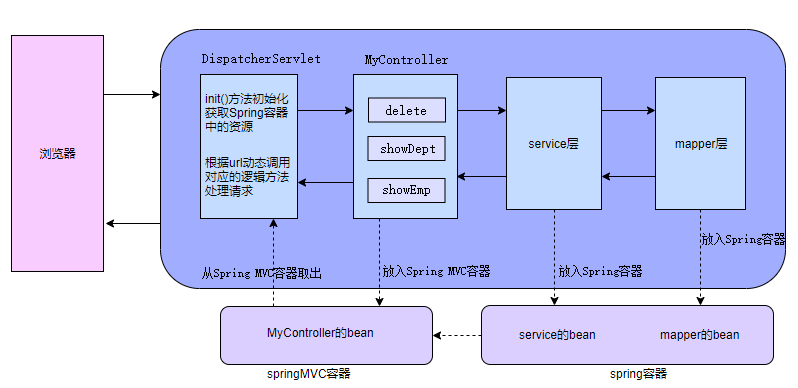

### Spring中的父子容器问题

因为Spring MVC属于Spring的子框架，所以Spring MVC中可以使用Spring框架的全部内容。

Spring 官方为Spring MVC专门定义了一个容器，这个容器里面放Spring MVC中全部Bean。且这个容器属于Spring容器的子容器。

有这样的一个规定：Spring MVC子容器可以调用Spring 父容器的全部内容。但是Spring父容器不能调用Spring MVC子容器内容。


## Spring MVC环境搭建

之前的spring和mybatis项目都不需要使用tomcat容器，不是必须放入tomcat才能被运行的，但是由于springmvc底层是对servlet的封装，servlet的运行是必须要用tomcat的，所以springmvc项目必须使用tomcat容器来运行。所以构建项目就要创建war项目了。


案例：实现一个小功能，实现一个控制单元即可，在浏览器访问。


### 创建项目

webapp项目


### 添加依赖

在pom.xml中添加Spring MVC的依赖。

Spring MVC 在平时随意可以当成一个独立框架看待，但其本质只是Spring Framework中的spring-webmvc.jar文件（算是Spring Framework衍生出来的二级框架），这个jar文件依赖了spring web模块。所以在只使用Spring MVC框架时需要导入spring-webmvc依赖即可。导入spring-webmvc的依赖，核心功能的5个依赖以及spring-web依赖就都过来了：


```xml
<project xmlns="http://maven.apache.org/POM/4.0.0" xmlns:xsi="http://www.w3.org/2001/XMLSchema-instance"
  xsi:schemaLocation="http://maven.apache.org/POM/4.0.0 http://maven.apache.org/maven-v4_0_0.xsd">
  <modelVersion>4.0.0</modelVersion>
  <groupId>org.msb</groupId>
  <artifactId>SpringMVCDemo01</artifactId>
  <packaging>war</packaging>
  <version>1.0-SNAPSHOT</version>
  <name>SpringMVCDemo01 Maven Webapp</name>
  <url>http://maven.apache.org</url>
  <dependencies>
    <dependency>
      <groupId>junit</groupId>
      <artifactId>junit</artifactId>
      <version>3.8.1</version>
      <scope>test</scope>
    </dependency>
    <!-- 依赖了Spring框架核心功能的5个依赖以及Spring整合Web的依赖spring-web -->
    <dependency>
      <groupId>org.springframework</groupId>
      <artifactId>spring-webmvc</artifactId>
      <version>6.0.11</version>
    </dependency>

  </dependencies>
  <build>
    <finalName>SpringMVCDemo01</finalName>
  </build>
</project>

```

### 创建跳转页面

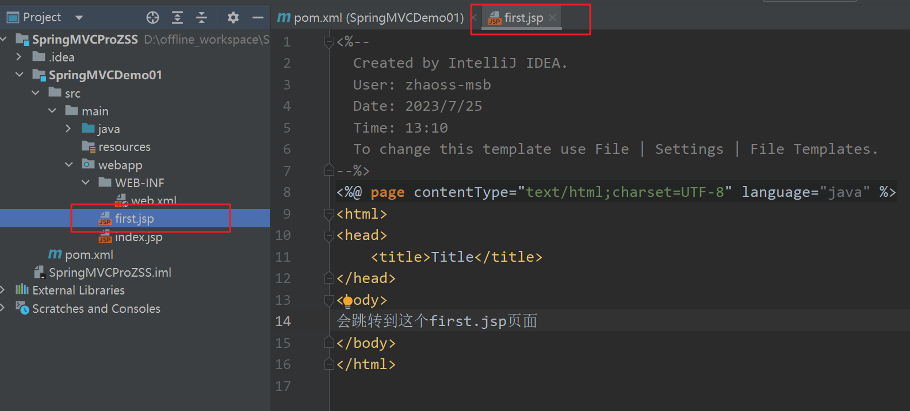

### 创建控制器类

新建com.msb.controller.FirstController。

```java
package com.msb.controller;

import org.springframework.stereotype.Controller;
import org.springframework.web.bind.annotation.RequestMapping;
import org.springframework.web.servlet.ModelAndView;

/**
 * @Author: zhaoss
 */
@Controller// 放入到Spring MVC容器中
public class FirstController {
    /*
     * 请求转发的简单写法（平时使用的方式）
     * 返回值是String，表示跳转的资源路径
     */
    @RequestMapping("/first2")
    public String test2(){
        return "/first.jsp";//    请求转发到first.jsp中    / ： 根路径
    }   
}
```

### 创建Spring MVC配置文件

在src/main/resources中新建Spring MVC框架配置文件springmvc.xml。这个文件的名称是随意的，只要和web.xml中配置param-value对应上就可以。

里面的约束和之前约束一样，你把之前applicationContext.xml中约束拿过来就行。

我们在控制层配置的注解啊

@Controller  这个是org.springframework的注解  -》使用context:component-scan解析

@RequestMapping 这个是org.springframework.web的注解 -》通过mvc:annotation-driven让Spring MVC的注解生效

```xml
<?xml version="1.0" encoding="UTF-8"?>
<beans xmlns="http://www.springframework.org/schema/beans"
       xmlns:mvc="http://www.springframework.org/schema/mvc"
       xmlns:xsi="http://www.w3.org/2001/XMLSchema-instance"
       xmlns:context="http://www.springframework.org/schema/context"
       xsi:schemaLocation="http://www.springframework.org/schema/beans
		https://www.springframework.org/schema/beans/spring-beans.xsd
        http://www.springframework.org/schema/context
        https://www.springframework.org/schema/context/spring-context.xsd
        http://www.springframework.org/schema/mvc
        https://www.springframework.org/schema/mvc/spring-mvc.xsd">

    <!-- 扫描控制器类，千万不要把service等扫描进来，也千万不要在Spring配置文件扫描控制器类所在包 -->
    <context:component-scan base-package="com.msb.controller"></context:component-scan>
    <!-- 让Spring MVC的注解生效 ：@RequestMapping，这个位置别忘记加入mvc的命名空间-->
    <mvc:annotation-driven></mvc:annotation-driven>
</beans>
```

### 编写web.xml内容

那你说springmvc.xml要不要被解析？肯定要啊！不解析怎么扫描，不扫描注解怎么识别？

在入口解析（在网页访问后，首先会访问Servlet的配置信息 web.xml），在web.xml中配置：

（1）把web.xml的模板先粘贴到web.xml中：

```xml
<?xml version="1.0" encoding="UTF-8"?>
<web-app xmlns="http://xmlns.jcp.org/xml/ns/javaee"
         xmlns:xsi="http://www.w3.org/2001/XMLSchema-instance"
         xsi:schemaLocation="http://xmlns.jcp.org/xml/ns/javaee http://xmlns.jcp.org/xml/ns/javaee/web-app_4_0.xsd"
         version="4.0">
</web-app>
```

（2）SpringMVC的底层是servlet，把Servlet给我们封装了，程序入口DispatcherServlet还是需要我们配置一下的。

web.xml的配置是为了让前端控制器DispatcherServlet生效。

```xml
<?xml version="1.0" encoding="UTF-8"?>
<web-app xmlns="http://xmlns.jcp.org/xml/ns/javaee"
         xmlns:xsi="http://www.w3.org/2001/XMLSchema-instance"
         xsi:schemaLocation="http://xmlns.jcp.org/xml/ns/javaee http://xmlns.jcp.org/xml/ns/javaee/web-app_4_0.xsd"
         version="4.0">
    <servlet>
        <servlet-name>springmvc</servlet-name>
        <servlet-class>org.springframework.web.servlet.DispatcherServlet</servlet-class>
    </servlet>
    <servlet-mapping>
        <servlet-name>springmvc</servlet-name>
        <!-- /表示除了.jsp以外的请求都可以访问DispatcherServlet，但是.jsp的请求不可以访问-->
        <!-- /表示除了.jsp结尾的uri，其他的uri都会触发DispatcherServlet，都会被拦截。此处不要写成 /* -->
        <url-pattern>/</url-pattern>
    </servlet-mapping>
</web-app>
```


DispatcherServlet是springmvc的入口，springmvc.xml的解析，是通过DispatcherServlet的一个参数,把xml名字给这个参数即可加载Spring MVC的配置文件。


将参数配置：

```xml
<?xml version="1.0" encoding="UTF-8"?>
<web-app xmlns="http://xmlns.jcp.org/xml/ns/javaee"
         xmlns:xsi="http://www.w3.org/2001/XMLSchema-instance"
         xsi:schemaLocation="http://xmlns.jcp.org/xml/ns/javaee http://xmlns.jcp.org/xml/ns/javaee/web-app_4_0.xsd"
         version="4.0">
  <servlet>
    <servlet-name>springmvc</servlet-name>
    <servlet-class>org.springframework.web.servlet.DispatcherServlet</servlet-class>
    <init-param>
      <!-- 参数名称必须叫做：contextConfigLocation。单词和大小写错误都导致配置文件无法正确加载 -->
      <param-name>contextConfigLocation</param-name>
      <!-- springmvc.xml 名称自定义，只要和我们创建的配置文件的名称对应就可以了。 -->
      <param-value>classpath:springmvc.xml</param-value>
    </init-param>
  </servlet>
  <servlet-mapping>
    <servlet-name>springmvc</servlet-name>
    <!-- /表示除了.jsp以外的请求都可以访问DispatcherServlet，如：first、first2，但是.jsp的请求不可以访问-->
    <!-- /表示除了.jsp结尾的uri，其他的uri都会触发DispatcherServlet，都会被拦截。此处不要写成 /* -->
    <url-pattern>/</url-pattern>
  </servlet-mapping>
</web-app>
```

加入配置load-on-startup：让在启动服务器的时候就加载springmvc.xml:

其实不写也行，不写的话就会在第一次访问的时候加载springmvc.xml:

```xml
<?xml version="1.0" encoding="UTF-8"?>
<web-app xmlns="http://xmlns.jcp.org/xml/ns/javaee"
         xmlns:xsi="http://www.w3.org/2001/XMLSchema-instance"
         xsi:schemaLocation="http://xmlns.jcp.org/xml/ns/javaee http://xmlns.jcp.org/xml/ns/javaee/web-app_4_0.xsd"
         version="4.0">
  <servlet>
    <servlet-name>springmvc</servlet-name>
    <servlet-class>org.springframework.web.servlet.DispatcherServlet</servlet-class>
    <init-param>
      <!-- 参数名称必须叫做：contextConfigLocation。单词和大小写错误都导致配置文件无法正确加载 -->
      <param-name>contextConfigLocation</param-name>
      <!-- springmvc.xml 名称自定义，只要和我们创建的配置文件的名称对应就可以了。 -->
      <param-value>classpath:springmvc.xml</param-value>
    </init-param>
    <!-- Tomcat启动立即加载Servlet，而不是等到访问Servlet才去实例化DispatcherServlet -->
    <!-- 配置上的效果：Tomcat启动立即加载Spring MVC框架的配置文件-->
    <load-on-startup>1</load-on-startup>
  </servlet>
  <servlet-mapping>
    <servlet-name>springmvc</servlet-name>
    <!-- /表示除了.jsp以外的请求都可以访问DispatcherServlet，但是.jsp的请求不可以访问-->
    <!-- /表示除了.jsp结尾的uri，其他的uri都会触发DispatcherServlet，都会被拦截。此处不要写成 /* -->
    <url-pattern>/</url-pattern>
  </servlet-mapping>
</web-app>
```

PS：<servlet-class>org.springframework.web.servlet.DispatcherServlet</servlet-class> 报红线错误，编译报错不用管，运行的时候不会报错，因为编译的时候需要你程序中有DispatcherServlet，那么就需要加入：

**tomcat10之后[servlet](https://so.csdn.net/so/search?q=servlet&spm=1001.2101.3001.7020)依赖包名不是javax.servlet，而是jakarta.servlet**。可以用以下两个依赖

```xml
    <dependency>
      <groupId>jakarta.servlet.jsp</groupId>
      <artifactId>jakarta.servlet.jsp-api</artifactId>
      <version>3.0.0</version>
      <scope>provided</scope>
    </dependency>
    <dependency>
      <groupId>jakarta.servlet</groupId>
      <artifactId>jakarta.servlet-api</artifactId>
      <version>5.0.0</version>
      <scope>provided</scope>
    </dependency>
```


如果你懒得加，那么就让他报错就行了，反正对运行没有影响。

上面的配置只对编译有效，对运行无效，因为运行的时候tomcat中是有servlet和jsp的。

### 配置tomcat
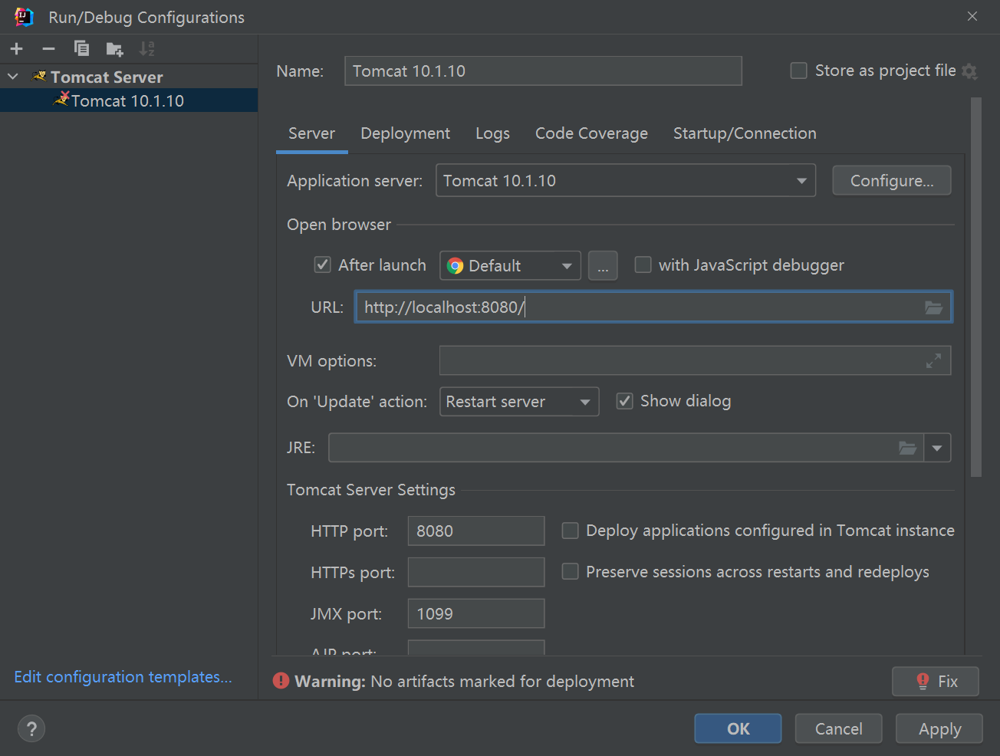
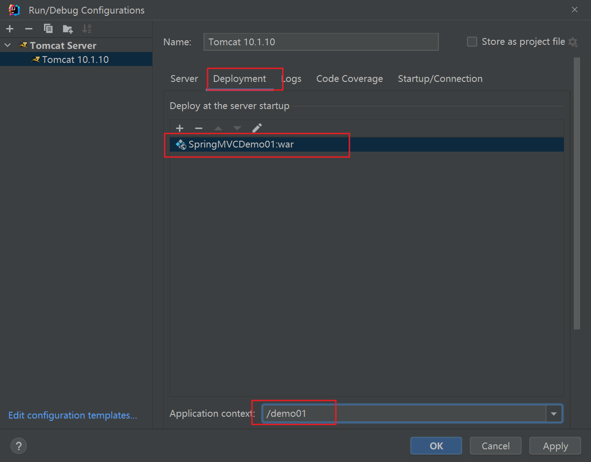
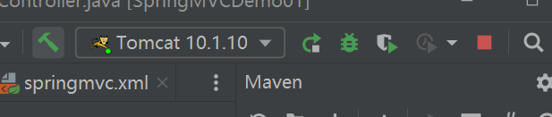

### 访问控制单元

访问我们要访问的控制单元：

在浏览器输入：http://localhost:8080/demo01/first2 和http://localhost:8080/demo01/first 如果都能转发到first.jsp页面说明整体环境搭建成功。


### 总结流程

http://localhost:8080/demo01/first2  --》先找web.xml---》/first2找到拦截地址是/ 那么可以走DispatcherServlet -》并把springmvc.xml解析-》扫描springmvc.xml中的包、注解-》找RequestMapping 中是first2 的控制单元-》执行方法test2()，若有参数接收参数 -》执行方法中逻辑, 请求转发到first.jsp中


现在用了springmvc的好处：

（1）作用和servlet作用一样，但是又和servlet解耦了，你看代码看不出来servlet。

（2）对象已经交给容器了，那么比如用到service对象就可以注入进来了。

## 映射路径

### 映射路径介绍

**（1）映射路径是什么**

映射路径在之前Java EE阶段中学习过，就是web.xml中`<url-pattern>`的值或者@WebServlet("")注解的值。

映射路径无论是在Servlet中还是在Spring MVC中，都表示：当URL中出现指定路径时会执行Servlet的方法或执行Spring MVC的控制单元。

例如下面代码：

```java
    @RequestMapping("/first2")
    public String test2(){
        return "/first.jsp";//    请求转发到first.jsp中    / ： 根路径
    } 
```

只要访问URL中 http://localhost:8080/demo01/first2 中 URI 是/demo01/first2 ，其中/demo01 表示当前项目的名称，/first2表示映射路径。Spring MVC 发现映射路径是/first2 时就会执行上面的控制单元。

由于在Servlet中url-pattern必须以 / 开头，所以在Spring MVC中定义映射路径时也是习惯以 / 开头，但是这个/可以省略不写加不加都行，但是我们一般都加上。


**（2）一个控制单元可以对应多个路径：**

@RequestMapping注解中发现：

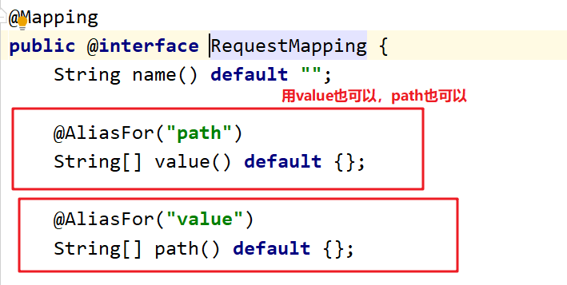


所以我们可以加入数组格式的路径，如：

```java
    @RequestMapping(value={"/first2","/first02"})
    public String test2(){
        return "/first.jsp";
    }
```

那么用户访问： http://localhost:8080/demo01/first2也可以， http://localhost:8080/demo01/first02 也可以


 **（3）不同控制单元路径不可重复：**

```java
@Controller
public class MyController {
    @RequestMapping("/test01")
    public String test01(){
        return "/index.jsp";
    }
}
```

```java
@Controller
public class MyController2 {
    @RequestMapping("/test01")
    public String test01(){
        return "/index.jsp";
    }
}
```

此时，就建议在当前类上也加入路径：

```java
@Controller
@RequestMapping("/MyController")
public class MyController {
    @RequestMapping(value={"/test01","/test1"})
    public String test01(){
        return "/index.jsp";
    }
}
```

```java
@Controller
@RequestMapping("/MyController2")
public class MyController2 {
    @RequestMapping(value={"/test01","/test1"})
    public String test01(){
        return "/index.jsp";
    }
}
```

那么访问就变成：http://localhost:8080/msb/demo01/MyController2/test01

 

### 多级路径

映射路径支持路径的写法。


但是在Java中 \ 表示转义字符，所以在Java中路径是使用 / 进行分隔，表示目录层次。

在Spring MVC 的映射路径也支持多层写法，例如下面的代码表示URL为 http://localhost:8080/msb/demo01/test/test2 时执行这个控制单元。

```java
    @RequestMapping("/test/test2")
    public String test2(){
        return "/first.jsp";
    }
```

### 多级路径中注意事项

在下面的代码中，当使用浏览器访问/test/test2时会出现404

```java
    @RequestMapping("/test/test3")
    public String test3(){
        return "first.jsp"; // 注意这里没有使用/
    }
```

请求http://localhost:8080/demo01/test/test3报错：


上面的404，并不是控制单元（控制器）的404，而是没有找到first.jsp。

仔细看上面图中红框中的错误，first.jsp为什么会从/test下去寻找呢？

因为return "first.jsp";是相对路径，Tomcat会在`webapp/test目录`下找一个叫做first.jsp的文件。显然是不存在这样的资源，first.jsp是在webapp目录下。

**解决办法：多层路径中最优写法**

只需要在返回值中使用`绝对路径`就可以减少出错的情况。

跳转时 / 表示项目根目录，也就是webapp目录的根目录。

### Ant风格的映射路径

在Spring MVC中支持Ant风格的映射路径写法。所谓的Ant风格就是支持三种特殊的符号：

| 符号 | 解释                    |
| ---- | ----------------------- |
| `?`  | 匹配任意单字符          |
| `*`  | 匹配0或者任意数量的字符 |
| `**` | 匹配0或者更多数量的目录 |

解释说明：

​	使用Ant的特殊符号时，表示模糊匹配。可能出现客户端发送过来的URL能匹配上多个映射路径，这时匹配的优先级为：

​	固定值 (test1) > `?` 形式(test?) > `*`形式(`/*`) > `**`形式（/**）


```java
    // 优先级最高
    @RequestMapping("/test1")
    public String testAnt1(){
        System.out.println("testAnt1");
        return "/first.jsp";
    }
    // 优先级低于test1。总长度为6，test开头，后面跟个任意内容符号
    @RequestMapping("/test?")
    public String testAnt2(){
        System.out.println("testAnt2");
        return "/first.jsp";
    }
    // 优先级低于？。一层路径，任意内容
    @RequestMapping("/*")
    public String testAnt3(){
        System.out.println("testAnt3");
        return "/first.jsp";
    }
    // 优先级低于**。任意层路径
    @RequestMapping("/**")
    public String testAnt4(){
        System.out.println("testAnt4");
        return "/first.jsp";
    }
```

请求http://localhost:8080/demo01/test1测试。

## `@RequestMapping`注解

先看元注解@Target({ElementType.TYPE, ElementType.METHOD})的含义：

代表@RequestMapping注解可以写在控制器类上，也可以写在控制单元方法上。

如果写在类上，表示当前类所有控制单元的映射路径，都以指定路径开头。

如果写在方法上，表示当前方法的映射路径。最终访问这个控制单元的映射路径为:类上@RequestMapping映射路径+方法上@RequestMapping映射路径。例如：下面的控制单元访问时的映射路径为/global/first3.

这种在类上写@RequetMapping的写法，在以后做管理类型项目、或网站后台项目中使用的比较多。平时在练习的时候绝大多数是直接在控制单元上写@RequestMapping注解，而不在类上写@RequestMapping

```java
@Controller
@RequestMapping("/global")
public class FirstController {
    @RequestMapping("/first3")
    public String test3(){
        return "/first.jsp";
    }
}
```

### 属性总览

在@RequestMapping注解中提供了很多参数

```java
public @interface RequestMapping {
    String name() default "";

    @AliasFor("path")
    String[] value() default {};

    @AliasFor("value")
    String[] path() default {};

    RequestMethod[] method() default {};

    String[] params() default {};

    String[] headers() default {};

    String[] consumes() default {};

    String[] produces() default {};
}
```

#### value属性

value：定义映射路径。URL中出现指定映射路径时会执行当前控制单元。支持一个方法多个映射路径。value属性可以省略不写，且Java的注解中，如果属性是数组类型，且取值只有一个时，{}可以省略不写。所以一共有四种写法。

但是需要注意：如果@RequestMapping只需要设置value属性的话可以省略。但是需要设置多个属性时value不能省略。

取值前面的`/`表示映射到项目根目录，可以省略不写，但是从规范上建议写上

```java
    @RequestMapping("/first3")
    public String first3(){
        return "/first.jsp";
    }
    @RequestMapping({"/first4","first5"})
    public String first4(){
        return "/first.jsp";
    }
    @RequestMapping(value="/first6")
    public String first6(){
        return "/first.jsp";
    }
    @RequestMapping(value={"/first7","first8"})
    public String first7(){
        return "/first.jsp";
    }
```

#### name属性

name：给控制单元定义一个名称。可以理解name是控制单元的注释。

```java
    @RequestMapping(value = "/testName",name = "测试下name属性")
    public String testName(){
        return "/first.jsp";
    }
```

#### path属性

path属性和value属性使用方式是相同的，都是设置控制单元的映射路径。

用法与value一致。

```java
    @RequestMapping(path = "/testPath")
    public String testPath(){
        return "first.jsp";
    }
```

#### method属性

查看源码发现

method属性类型是RequestMethod[]，RequestMethod是枚举类型，支持HTTP协议中绝大多数请求类型。

当设置了method属性后，表示只有指定类型请求方式才能访问这个控制单元方法，其他的请求方式访问时，响应会出现405状态码。

```java
 // 请求方式只能是DELETE和POST类型。
    @RequestMapping(value = "/testMethod",method = {RequestMethod.DELETE,RequestMethod.POST})
    public String testMethod(){
        return "/first.jsp";
    }
```

在浏览器输入http://localhost:8080/demo01/testMethod直接回车相当于get请求，后会出现`请求不允许`的错误


##### 简写方式

Spring MVC 框架针对不同请求方式提供了5个专门请求方式的注解

| @PostMapping("/first")   | 等效于 @RequestMapping(value = "/first",method = RequestMethod.POST) |
| ------------------------ | ------------------------------------------------------------ |
| @GetMapping("/first")    | 等效于 @RequestMapping(value = "/first",method = RequestMethod.GET) |
| @DeleteMapping("/first") | 等效于 @RequestMapping(value = "/first",method = RequestMethod.DELETE) |
| @PutMapping("/first")    | 等效于 @RequestMapping(value = "/first",method = RequestMethod.PUT) |
| @PatchMapping("/first")  | 等效于 @RequestMapping(value = "/first",method = RequestMethod.PATCH) |

多个可以一起使用。

#### params属性

params属性类型是String[]，表示请求中必须包含指定名称的请求参数。

```java
    @RequestMapping(value="/testParam",params = {"name"})
    public String testParam(){
        return "/first.jsp";
    }
```

如果请求中没有包含指定类型参数，响应会出现400状态码。并且明确提示在实际的请求参数中没有明确设置name属性。


#### headers属性

headers属性类型是String[],表示请求头中必须包含指定的请求头参数。


```java
@RequestMapping(value="/testHeaders",headers = "Cookie11")
public String testHeaders(){
    return "/first.jsp";
}
```

如果请求头中没有指定的请求头参数，浏览器会报404


请求头在哪看：

调试 network headers

> 小提示：
>
> ​	一些属性在谷歌浏览器中虽然看不到对应的请求参数，但是实际上已经包含了。
>
> ​	例如：Content-Type 随意在谷歌浏览器中Request Header无法查看到，但设置@RequestMapping(value="/testHeaders",headers = "Content-Type")后会发现依然可以访问控制单元。

#### consumes属性

consumers表示处理请求内容(Content-Type)的类型，平时多不设置，由Spring MVC自动判断。

#### produces属性

后面@ResponseBody注解中进行讲解。

## 静态资源放行

按照SpringMVC的使用流程，需要在web.xml文件中配置DispatcherServlet的拦截范围，而我们配置的拦截范围为”/”,表示拦截除jsp请求以外的所有请求。这样造成，请求是js,css,图片等静态资源的请求，也会被匹配到拦截，然后调用对应的单元方法来处理请求，比如你请求：http://localhost:8080/demo01/msb/js/jquery.js，它会到控制类中找路径是js/jquery.js的资源，很显然找不到的，我们是一个静态资源的请求，不应该按照普通单元方法请求的流程来处理，而是应该将对应的静态资源响应给浏览器使用。

怎么解决呢？

（1）方式1：缩小拦截范围，将拦截范围设置为*.do,这样就只对.do的资源拦截，其余的静态资源就会找对应的静态资源了：

```xml
<servlet-mapping>
    <servlet-name>springmvc</servlet-name>
    <!-- /表示除了.jsp结尾的uri，其他的uri都会触发DispatcherServlet。此处前往不要写成 /* -->
    <url-pattern>*.do</url-pattern>
</servlet-mapping>
```

如果这样的话，那么你的所有控制单元的路径都要带.do ，不太方便。

（2）方式2：静态资源放行

Spring MVC 支持静态资源配置，当URL满足指定路径要求时不再去找控制单元，而是直接转发到特定路径中静态资源。

例如项目结构是


如果把静态资源放在webapp下边中 resource/webapp 下是资源

需要在springmvc.xml 中配置静态资源放行


需要在springmvc.xml中配置

```xml
<!--配置静态资源放行-->
<!--mapping：当URI是什么样格式时，不再执行控制器，而是寻找静态资源。 ** 是通配符，表示任意层路径 -->
<!--location:去哪个目录中寻找静态资源。mapping中**的值是什么，就去location目录中找对应资源-->
<!--例如URL是http://localhost:8080/demo01/js/jquery.js 其中mapping的**就是jquery.js,就会去location的/js/目录中寻找jquery.js -->
<mvc:resources mapping="/js/**" location="/js/"></mvc:resources>
<mvc:resources mapping="/css/**" location="/css/"></mvc:resources>
<mvc:resources mapping="/images/**" location="/images/"></mvc:resources>
```


这样访问http://localhost:8080/demo01/images/aaa.png即可访问到静态资源。

## 控制单元的方法参数（接收请求参数）


### 控制单元方法参数写法

控制单元方法参数一共有两种写法：

（1）紧耦方式：获取原生Servlet API，通过原生Servlet API获取请求参数、设置响应内容、设置作用域的值。-》不用了

（2）解耦方式（松耦合方式）：使用Spring MVC提供的方式获取请求参数、设置响应内容、设置作用域的值。-》以后用这个

### 紧耦方式

之前在学习Servlet时，Servlet中service方法参数为HttpServletRequest、HttpServletResponse，通过这两个对象可以获取到HttpSession、ServletContext、PrintWriter等其他常用对象：


在Spring MVC中，可以直接在控制单元的方法参数中按需注入HttpServletRequest、HttpServletResponse、HttpSession对象。注入后就可以像之前学习Servlet一样进行获取参数。

**完成案例：前台表单录入参数，后台接收参数**

webapp目录下编写前台show.jsp页面：

```html
<%--
  Created by IntelliJ IDEA.
  User: zhaoss-msb
  Date: 2023/7/26
  Time: 21:39
  To change this template use File | Settings | File Templates.
--%>
<%@ page contentType="text/html;charset=UTF-8" language="java" %>
<html>
<head>
    <title>Title</title>
</head>
<body>
  <form  action="testform">
    <p>
        名字：<input type="text" name="name"/>
    </p>
    <p>
        密码：<input type="text" name="pwd"/>
    </p>
    <p>
        性别：
          男：<input type="radio" name="sex" value="男"/>
          女：<input type="radio" name="sex" value="女"/>
    </p>
    <p>
        爱好：
          吃：<input type="checkbox" name="hobby" value="吃"/>
          喝：<input type="checkbox" name="hobby" value="喝"/>
    </p>
    <p>
        <input type="submit" value="提交">
    </p>
  </form>
</body>
</html>

```

编写控制器com.msb.controller.MyController:

```java
package com.msb.controller;

import jakarta.servlet.http.HttpServletRequest;
import org.springframework.stereotype.Controller;
import org.springframework.web.bind.annotation.RequestMapping;

import java.util.Arrays;

/**
 * @Author: zhaoss
 */
@Controller// 放入到Spring MVC容器中
public class MyController {
    @RequestMapping("/testform")// 当前方法的映射路径
    public String demo01(HttpServletRequest req){
        String name = req.getParameter("name");
        String pwd = req.getParameter("pwd");
        String sex = req.getParameter("sex");
        String[] hobbies = req.getParameterValues("hobby");
        System.out.println(name + "---" + pwd + "---" + sex + "---" + Arrays.toString(hobbies));
        // 跳转到index.jsp中
        return "/index.jsp";
    }
}

```

请求http://localhost:8080/demo01/show.jsp，录入数据：

查看后端程序，已经正确输出


这种需要在控制单元方法参数中注入Servlet API的方式，称为**Spring MVC 紧耦方法**。因为使用的是原生Servlet API，和原生Servlet API紧耦。


上面使用servlet api的代码不报错，也意味着你的pom.xml中配置了：

```xml
<dependency>
      <groupId>jakarta.servlet.jsp</groupId>
      <artifactId>jakarta.servlet.jsp-api</artifactId>
      <version>3.0.0</version>
      <scope>provided</scope>
    </dependency>
    <dependency>
      <groupId>jakarta.servlet</groupId>
      <artifactId>jakarta.servlet-api</artifactId>
      <version>5.0.0</version>
      <scope>provided</scope>
    </dependency>
```

所以缺点：与servlet耦合性太高了,参数接收费劲。你在这就知道我们用原生的东西可以就行了，但是我们以后肯定不这么用，体现不出springmvc的好处

### 解耦方式

解耦方式是Spring MVC独有方式（使用过程中看不到servlet 的影子），是Spring MVC给开发者提供的：

（1）获取请求中内容

（2）设置作用域值

（3）设置响应内容

等写法。

#### 获取普通表单参数

案例：

webapp目录下定义前台jsp页面，编写表单：

```html
<%--
  Created by IntelliJ IDEA.
  User: zhaoss-msb
  Date: 2023/7/26
  Time: 21:39
  To change this template use File | Settings | File Templates.
--%>
<%@ page contentType="text/html;charset=UTF-8" language="java" %>
<html>
<head>
    <title>Title</title>
</head>
<body>
  <form  action="testform2">
    <p>
        名字：<input type="text" name="name"/>
    </p>
    <p>
        年龄：<input type="text" name="age"/>
    </p>
    <p>
        密码：<input type="text" name="pwd"/>
    </p>
    <p>
        性别：
          男：<input type="radio" name="sex" value="男"/>
          女：<input type="radio" name="sex" value="女"/>
    </p>
    <p>
        爱好：
          吃：<input type="checkbox" name="hobby" value="吃"/>
          喝：<input type="checkbox" name="hobby" value="喝"/>
    </p>
    <p>
        <input type="submit" value="提交">
    </p>
  </form>
</body>
</html>

```

后台com.msb.controller.MyController控制类：

```java
package com.msb.controller;

import jakarta.servlet.http.HttpServletRequest;
import org.springframework.stereotype.Controller;
import org.springframework.web.bind.annotation.RequestMapping;

import java.util.Arrays;

/**
 * @Author: zhaoss
 */
@Controller// 放入到Spring MVC容器中
public class MyController {
    @RequestMapping("/testform2")// 当前方法的映射路径
    public String demo02(int age,String name,String pwd,String sex,String[] hobby){
        System.out.println(name + "---" + age + "---" + pwd + "---" + sex + "---" + Arrays.toString(hobby));
        // 跳转到index.jsp中
        return "/index.jsp";
    }
}

```


需要注意的是：

**（1）**获取普通表单参数，只需要包含在控制单元中提供与请求参数同名的方法参数即可

**（2）**Spring MVC会自动进行类型转换，比如age在后台我们并没有进行类型转换即可转为int类型，以前用getParamter获取的是String类型，再转为int类型。

**（3）**如果你在表单的年龄框中录入的数据是12abc，那么会报400错误的。

**（4）**如果参数是基本数据类型如int，在控制单元方法参数中提供了参数，但是在请求中没有对应参数，这时Spring MVC会把空值赋予给参数，但是控制方法是无法接收空值的：

所以会报错

所以一些有经验的开发者在Spring MVC的参数中都是用封装类型，这样即使是空值也能正常接收。但此处不是说以后Spring MVC控制单元参数必须使用封装类类型，如果可以保证每次都会传递这个参数，也可以使用八大基本数据类型。

控制单元参数修改为Integer类型：

```java
    @RequestMapping("/testform2")// 当前方法的映射路径
    public String demo02(Integer age,String name,String pwd,String sex,String[] hobby){
        System.out.println(name + "---" + age + "---" + pwd + "---" + sex + "---" + Arrays.toString(hobby));
        // 跳转到index.jsp中
        return "/index.jsp";
    }
```

 这样即使age没有传递，后台也不会报错：


####  @RequestParam 注解的使用

@RequestParam是方法参数级注解。每个控制单元方法参数前面都能写这个注解。在@RequestParam注解里面提供了四个属性

这些属性只需要按需设置即可。可以都不使用，也可以都使用，也可以只使用里面的部分。

（1）name：当请求参数名和控制单元参数名不对应时，可以使用name指定请求参数名。这样方法参数就可以不与请求参数对应了。

```java
@Controller// 放入到Spring MVC容器中
public class MyController {
    @RequestMapping("/testParam1")
    public String testParam1(@RequestParam(name="name") String username){
        System.out.println(username);
        return "/index.jsp";
    }
}

```

含义：接收前台名字为name的参数的值赋值给username参数。

如访问： http://localhost:8080/demo01/testParam1?name=zs后台即可接受到。

（2）value：是name属性的别名。功能和name属性相同。之所以再次设置一个和name属性相同的value，是因为在Java注解中，当需要设置value属性，且只需要设置value属性时可以省略value属性名，这样写起来更加简单。

下面代码和上面（1）中的代码完全相同

```java
@Controller// 放入到Spring MVC容器中
public class MyController {
    @RequestMapping("/testParam1")
    public String testParam1(@RequestParam("name") String username){
        System.out.println(username);
        return "/index.jsp";
    }
}
```

（3）defaultValue：默认值。表示当请求参数中没有这个参数时给与的默认值。

```java
@RequestMapping("/testParam2")
    public String testParam2(@RequestParam(defaultValue="lili") String name,@RequestParam(defaultValue = "18")Integer age){
        System.out.println(name + "----" + age);
        return "/index.jsp";
    }
```

在浏览器地址栏输入：http://localhost:8080/demo01/testParam2 会在控制台打印:


很明显URL中没有name、age参数，但是赋予了默认值。

（4）required：boolean类型，表示请求中是否必须包含参数。

```java
@RequestMapping("/testParam3")
public String testParam3(@RequestParam(required = true) String name){
    System.out.println(name);
    return "/index.jsp";
}
```

如果地址栏忘记录入参数，访问http://localhost:8080/demo01/testParam3

会报400 错误

#### 接收多个同名表单参数

在提交表单数据时，可能在里面包含复选框。当选中多个复选框时会出现多个同名参数。在Spring MVC中可以使用数组和List接收多个同名参数。

（1）当使用数组进行接收时，需要数组对象名和请求参数名一致。如果**不想一致**，可以使用@RequestParam("hovers")定义请求参数名。

```java
    @RequestMapping("/testParam4")
    public String testParam4(@RequestParam("hobby") String[] hobbies){
        System.out.println(Arrays.toString(hobbies));
        return "/index.jsp";
    }
```

（2）在使用List进行接收时，**必须**在参数前面添加@RequestParam注解，注解中内容就是请求参数名

```java
    @RequestMapping("/testParam5")
    public String testParam5(@RequestParam("hobby") List hobbies){
        System.out.println(hobbies);
        return "/index.jsp";
    }
```

访问：http://localhost:8080/demo01/testParam5?hobby=html&hobby=java即可获取[html, java]。

#### 使用JavaBean作为参数（使用类对象作为控制单元参数）

JavaBean：就是具体（非抽象）公共（public）的类，一个包含私有属性，getter/setter方法和无参构造方法的Java类。是不是感觉和实体类特别像。其实写法上和实体类相同。唯一区别是实体类是数据库层面的概念，类型中属性要和数据库字段对应。而JavaBean的属性是灵活的，不是必须和哪里对应的。

JavaBean是一个专业概念，可以简单点理解：使用类对象做为控制单元参数，接收请求参数。如果不是特别较真，狭义上可以认为JavaBean就是项目中的实体类。

之前7.3.1中我们接收每个参数，后续可以将参数封装为具体的对象，其实也挺麻烦的，所以SpringMVC帮我们提供了一个方式可以直接使用类对象作为参数：

当使用类对象作为参数时，**要求属性名和参数名对应**，类型转换由Spring MVC自动完成。不支持@RequestParam注解。所以需要先建立一个类。且类中必须提供属性的getter和setter方法，因为Spring MVC就是**通过setter方法**把请求参数的值设置到类的属性中。**（注意，javabean的属性和前台参数名字可以不保一致，但是一定要确该属性对应的setXXX方法的XXX与前台参数名字一致，因为底层通过反射找set方法）**

前台jsp页面：

```html
<%--
  Created by IntelliJ IDEA.
  User: zhaoss-msb
  Date: 2023/7/26
  Time: 21:39
  To change this template use File | Settings | File Templates.
--%>
<%@ page contentType="text/html;charset=UTF-8" language="java" %>
<html>
<head>
    <title>Title</title>
</head>
<body>
  <form   action="test6">
    <p>
        名字：<input type="text" name="name"/>
    </p>
    <p>
        年龄：<input type="text" name="age"/>
    </p>
    <p>
        密码：<input type="text" name="pwd"/>
    </p>
    <p>
        性别：
          男：<input type="radio" name="sex" value="男"/>
          女：<input type="radio" name="sex" value="女"/>
    </p>
    <p>
        爱好：
          吃：<input type="checkbox" name="hobby" value="吃"/>
          喝：<input type="checkbox" name="hobby" value="喝"/>
    </p>
    <p>
        <input type="submit" value="提交">
    </p>
  </form>
</body>
</html>

```

javabean:com.msb.pojo.User

```java
package com.msb.pojo;

import java.util.Arrays;

/**
 * @Author: zhaoss
 */
public class User {
    private String name;
    private Integer age;
    private String pwd;
    private String sex;
    private String[] hobby;

    public String getName() {
        return name;
    }

    public void setName(String name) {
        System.out.println("name的setter方法");
        this.name = name;
    }

    public Integer getAge() {
        return age;
    }

    public void setAge(Integer age) {
        System.out.println("age的setter方法");
        this.age = age;
    }

    public String getPwd() {
        return pwd;
    }

    public void setPwd(String pwd) {
        System.out.println("pwd的setter方法");
        this.pwd = pwd;
    }

    public String getSex() {
        return sex;
    }

    public void setSex(String sex) {
        System.out.println("sex的setter方法");
        this.sex = sex;
    }

    public String[] getHobby() {
        return hobby;
    }

    public void setHobby(String[] hobby) {
        System.out.println("hobby的setter方法");
        this.hobby = hobby;
    }

    public User() {
        System.out.println("空构造器");
    }

    public User(String name, Integer age, String pwd, String sex, String[] hobby) {
        System.out.println("有参构造器");
        this.name = name;
        this.age = age;
        this.pwd = pwd;
        this.sex = sex;
        this.hobby = hobby;
    }

    @Override
    public String toString() {
        return "User{" +
                "name='" + name + '\'' +
                ", age=" + age +
                ", pwd='" + pwd + '\'' +
                ", sex='" + sex + '\'' +
                ", hobby=" + Arrays.toString(hobby) +
                '}';
    }
}

```

控制类：在控制单元中放置一个User类型对象，对象名称没有要求，只需要保证请求参数名和类的属性名相同就可以了。

```java
package com.msb.controller;

import com.msb.pojo.User;
import jakarta.servlet.http.HttpServletRequest;
import org.springframework.stereotype.Controller;
import org.springframework.web.bind.annotation.RequestMapping;
import org.springframework.web.bind.annotation.RequestParam;

import java.util.Arrays;
import java.util.List;

/**
 * @Author: zhaoss
 */
@Controller// 放入到Spring MVC容器中
public class MyController {

    @RequestMapping("/test6")
    public String test6(User user){
        System.out.println(user);
        return "/index.jsp";
    }
}

```


如果需要用多个对象接收，也是可以的，如前端：有学生信息，有班级信息,show.jsp:

```html
<%--
  Created by IntelliJ IDEA.
  User: zhaoss-msb
  Date: 2023/7/26
  Time: 21:39
  To change this template use File | Settings | File Templates.
--%>
<%@ page contentType="text/html;charset=UTF-8" language="java" %>
<html>
<head>
    <title>Title</title>
</head>
<body>
  <form   action="test6">
    <p>
        名字：<input type="text" name="name"/>
    </p>
    <p>
        年龄：<input type="text" name="age"/>
    </p>
    <p>
        密码：<input type="text" name="pwd"/>
    </p>
    <p>
        性别：
          男：<input type="radio" name="sex" value="男"/>
          女：<input type="radio" name="sex" value="女"/>
    </p>
    <p>
        爱好：
          吃：<input type="checkbox" name="hobby" value="吃"/>
          喝：<input type="checkbox" name="hobby" value="喝"/>
    </p>
    <p>
        <input type="submit" value="提交">
    </p>

      <p>
          班级名字：<input type="text" name="cname"/>
      </p>
      <p>
          班级编号：<input type="text" name="cno"/>
      </p>
  </form>
</body>
</html>

```

javabean：

```java
package com.msb.pojo;

/**
 * @Author: zhaoss
 */
public class Clazz {
    private String cname;
    private Integer cno;

    public Clazz(String cname, Integer cno) {
        this.cname = cname;
        this.cno = cno;
    }

    public Clazz() {
    }

    public String getCname() {
        return cname;
    }

    public void setCname(String cname) {
        this.cname = cname;
    }

    public Integer getCno() {
        return cno;
    }

    public void setCno(Integer cno) {
        this.cno = cno;
    }

    @Override
    public String toString() {
        return "Clazz{" +
                "cname='" + cname + '\'' +
                ", cno=" + cno +
                '}';
    }
}

```

```java
package com.msb.pojo;

import java.util.Arrays;

/**
 * @Author: zhaoss
 */
public class User {
    private String name;
    private Integer age;
    private String pwd;
    private String sex;
    private String[] hobby;
    private Clazz clazz;

    public Clazz getClazz() {
        return clazz;
    }

    public void setClazz(Clazz clazz) {
        this.clazz = clazz;
    }

    public String getName() {
        return name;
    }

    public void setName(String name) {
        System.out.println("name的setter方法");
        this.name = name;
    }

    public Integer getAge() {
        return age;
    }

    public void setAge(Integer age) {
        System.out.println("age的setter方法");
        this.age = age;
    }

    public String getPwd() {
        return pwd;
    }

    public void setPwd(String pwd) {
        System.out.println("pwd的setter方法");
        this.pwd = pwd;
    }

    public String getSex() {
        return sex;
    }

    public void setSex(String sex) {
        System.out.println("sex的setter方法");
        this.sex = sex;
    }

    public String[] getHobby() {
        return hobby;
    }

    public void setHobby(String[] hobby) {
        System.out.println("hobby的setter方法");
        this.hobby = hobby;
    }

    public User() {
        System.out.println("空构造器");
    }

    public User(String name, Integer age, String pwd, String sex, String[] hobby) {
        System.out.println("有参构造器");
        this.name = name;
        this.age = age;
        this.pwd = pwd;
        this.sex = sex;
        this.hobby = hobby;
    }

    @Override
    public String toString() {
        return "User{" +
                "name='" + name + '\'' +
                ", age=" + age +
                ", pwd='" + pwd + '\'' +
                ", sex='" + sex + '\'' +
                ", hobby=" + Arrays.toString(hobby) +
                ", clazz=" + clazz +
                '}';
    }
}

```

控制器：

```java
package com.msb.controller;

import com.msb.pojo.Clazz;
import com.msb.pojo.User;
import jakarta.servlet.http.HttpServletRequest;
import org.springframework.stereotype.Controller;
import org.springframework.web.bind.annotation.RequestMapping;
import org.springframework.web.bind.annotation.RequestParam;

import java.util.Arrays;
import java.util.List;

/**
 * @Author: zhaoss
 */
@Controller// 放入到Spring MVC容器中
public class MyController {
    @RequestMapping("/test6")
    public String test6(User user, Clazz cla){
        user.setClazz(cla);
        System.out.println(user);
        return "/index.jsp";
    }
}

```

如果你觉得这样都麻烦，你可以先改前端：

```html
<%--
  Created by IntelliJ IDEA.
  User: zhaoss-msb
  Date: 2023/7/26
  Time: 21:39
  To change this template use File | Settings | File Templates.
--%>
<%@ page contentType="text/html;charset=UTF-8" language="java" %>
<html>
<head>
    <title>Title</title>
</head>
<body>
  <form   action="test6">
    <p>
        名字：<input type="text" name="name"/>
    </p>
    <p>
        年龄：<input type="text" name="age"/>
    </p>
    <p>
        密码：<input type="text" name="pwd"/>
    </p>
    <p>
        性别：
          男：<input type="radio" name="sex" value="男"/>
          女：<input type="radio" name="sex" value="女"/>
    </p>
    <p>
        爱好：
          吃：<input type="checkbox" name="hobby" value="吃"/>
          喝：<input type="checkbox" name="hobby" value="喝"/>
    </p>
    <p>
        <input type="submit" value="提交">
    </p>

      <p>
          班级名字：<input type="text" name="clazz.cname"/>
      </p>
      <p>
          班级编号：<input type="text" name="clazz.cno"/>
      </p>
  </form>
</body>
</html>

```

控制类：

```java
package com.msb.controller;

import com.msb.pojo.Clazz;
import com.msb.pojo.User;
import jakarta.servlet.http.HttpServletRequest;
import org.springframework.stereotype.Controller;
import org.springframework.web.bind.annotation.RequestMapping;
import org.springframework.web.bind.annotation.RequestParam;

import java.util.Arrays;
import java.util.List;

/**
 * @Author: zhaoss
 */
@Controller// 放入到Spring MVC容器中
public class MyController {
    @RequestMapping("/test6")
    public String test6(User user){
        System.out.println(user);
        return "/index.jsp";
    }
}

```

也可以。

#### JavaBean和简单数据类型混合使用

既然Spring MVC中又支持JavaBean的形式，又支持使用简单类型接收。当两种方式都使用时，且类中和简单类型重名时，Spring MVC会“雨露均沾”都给设置上。

```java
@RequestMapping("/test6")
public String test6(User user,String name){
    System.out.println(user);
    System.out.println(name);
    return "/index.jsp";
}
```

输出的name为user中的name对象

这种写法中对于同学们存在一个非常常见的错误。当JavaBean中属性特别多时，原本希望使用普通属性类型接收参数，但是JavaBean中还存在个同名属性，且这个属性的类型和参数类型不一样。Spring MVC会进行类型转换，如果能够转换没有问题。如果无法转换会出现400

```java
@RequestMapping("/test6")
public String test6(User user,String name,String age){
    System.out.println(user);
    System.out.println(name);
    return "/index.jsp";
}
```
出现400，主要原因是无法把test赋值给User类中Integer age属性。

#### 接收日期类型参数

如果希望使用Date类型接收客户端传递过来的数据，默认情况下必须保证客户端参数格式和服务器日期格式一致。可以在计算机屏幕右下角查看到服务器的日期格式


所以只要保证客户端传递过来的日期是yyyy/MM/dd hh:mm:ss的格式，Spring MVC会自动进行类型转换。其中小时分钟秒可以省略不写。


控制单元：
```java
@RequestMapping("/test7")
public String test7(java.util.Date date){//想年月日时分秒都用，用util.Date
    System.out.println(date);
    return "/index.jsp";
}
```

在浏览器地址栏输入只包含日期的数据 http://localhost:8080/demo01/test7?date=2023/4/9

也可以在浏览器地址栏输入包含日期和小时分钟秒的数据 http://localhost:8080/demo01/test7?date=2023/4/9%205:19:23其中2023/4/9和5:19:23之间是空格，当回车发送请求后，会自动把空格解析为%20,因为空格是URL中的特殊字符。

默认情况下不支持只输入小时分钟秒。

如果觉得默认的格式无法满足要求，可以使用@DateTimeFormat自定义时间格式，定义前端要传过来的格式。

控制单元：

```java
    @RequestMapping("/test7")
    public String test7(@DateTimeFormat(pattern = "yyyy-MM-dd")java.util.Date date){
        System.out.println(date);
        return "/index.jsp";
    }
```

访问：http://localhost:8080/demo01/test7?date=2022-5-6即可。

小提示：

​	需要注意的是，当使用了@DateTimeFormat以后默认的时间格式就不能使用了。

如果你传过来的Date是要给对象的，那么@DateTimeFormat也可以写在JavaBean的属性上面。

控制类：

```java
@RequestMapping("/test8")
public String test8(User user){
    System.out.println(user);
    return "/index.jsp";
}
```

javabean:

```java
package com.msb.pojo;

import org.springframework.format.annotation.DateTimeFormat;

import java.util.Arrays;
import java.util.Date;

/**
 * @Author: zhaoss
 */
public class User {
    private String name;
    private Integer age;
    private String pwd;
    private String sex;
    private String[] hobby;
    private Clazz clazz;
    @DateTimeFormat(pattern = "yyyy-MM-dd")
    private Date date;


    public Clazz getClazz() {
        return clazz;
    }

    public void setClazz(Clazz clazz) {
        this.clazz = clazz;
    }

    public String getName() {
        return name;
    }

    public void setName(String name) {
        System.out.println("name的setter方法");
        this.name = name;
    }

    public Integer getAge() {
        return age;
    }

    public void setAge(Integer age) {
        System.out.println("age的setter方法");
        this.age = age;
    }

    public String getPwd() {
        return pwd;
    }

    public void setPwd(String pwd) {
        System.out.println("pwd的setter方法");
        this.pwd = pwd;
    }


    public Date getDate() {
        return date;
    }

    public void setDate(Date date) {
        this.date = date;
    }

    public String getSex() {
        return sex;
    }

    public void setSex(String sex) {
        System.out.println("sex的setter方法");
        this.sex = sex;
    }

    public String[] getHobby() {
        return hobby;
    }

    public void setHobby(String[] hobby) {
        System.out.println("hobby的setter方法");
        this.hobby = hobby;
    }

    public User() {
        System.out.println("空构造器");
    }

    public User(String name, Integer age, String pwd, String sex, String[] hobby) {
        System.out.println("有参构造器");
        this.name = name;
        this.age = age;
        this.pwd = pwd;
        this.sex = sex;
        this.hobby = hobby;
    }

    @Override
    public String toString() {
        return "User{" +
                "name='" + name + '\'' +
                ", age=" + age +
                ", pwd='" + pwd + '\'' +
                ", sex='" + sex + '\'' +
                ", hobby=" + Arrays.toString(hobby) +
                ", clazz=" + clazz +
                ", date=" + date +
                '}';
    }
}

```

访问：http://localhost:8080/demo01/test8?date=2022-5-6即可

#### 接收请求头数据

在HTTP协议中，请求头参数会有很多。如果希望接收请求头数据可以使用@RequestHeader进行接收。

以上面的/testDate请求举例，可以在谷歌开发者工具（F12）里面看到下面请求头参数。

在控制单元方法参数中添加对应名称的参数，并在参数前面添加@RequestHeader注解

```java
@RequestMapping("/test10")
public String test10(@RequestHeader String  Accept){
    System.out.println(Accept);
    return "/index.jsp";
}
```

上面这种写法中方法参数名和请求参数名完全对应。但是在Java中参数名的命名规范是首字母小写。Spring MVC对于接收请求参数时名称不区分大小写。所以上面的写法也是可以的。


对于请求参数名就是一个单词，不是xxx-xxx或xxx-xxx-xxx形式的参数名可以像上面的写法，让方法参数和请求头参数名对应。但是Java中方法参数命名要求中不允许存在-，也就是说请求参数中的Accept-Encoding是无法在Java代码中提供出来同名参数的。如下：

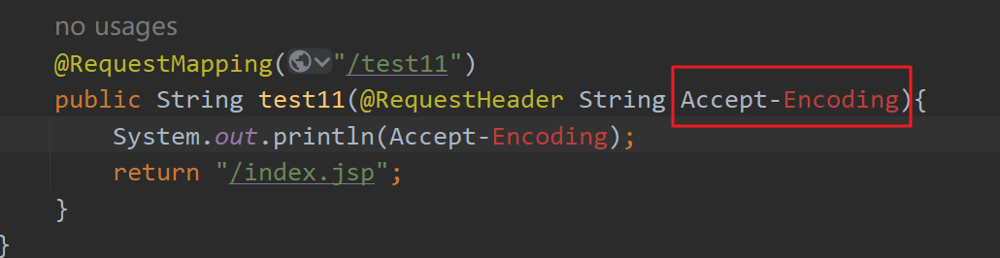

当希望去接收多个单词组成的请求参数时，需要在@RequestHeader注解中指定要接收的请求参数名，这时方法参数名就没有特殊要求了。


```java
@RequestMapping("/test11")
public String test11( @RequestHeader("Accept-Encoding") String suiyi){
    System.out.println(suiyi);
    return "/index.jsp";
}
```

## 转发和重定向

在前面Java EE阶段中学习过两个概念：转发和重定向。这两个概念都是出现在资源之间相互跳转的，如图：

请求转发：

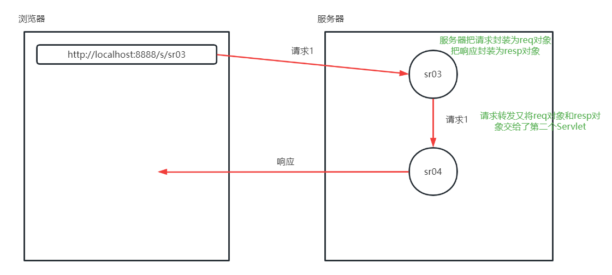

重定向：

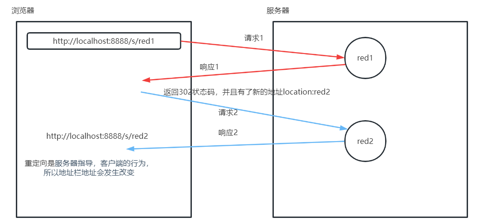

两者区别

​	（1）转发只能跳转到当前项目**内部**资源。重定向可以跳转到外部资源。例如：从自己的项目中跳转到百度应该使用重定向。

​	（2）转发是一次请求，无论服务器内部转发多少次，请求对象都不变。所以转发可以共享请求域的值。同时对于客户端浏览器URL是不变的。

​   重定向后需要客户端重新发起请求，和重定向之前不是一个请求。所以重定向后不能获取到之前设置在请求域的值。同时客户端浏览器URL是改变的。

​	（3）转发时资源路径如果是绝对路径，第一个 / 表示当前项目根目录。重定向时资源路径时绝对路径，第一个 / 表示 Tomcat 的 webapps目录，即：当前项目的上层目录。
​	（4）代码实现

请求转发：

```java
request.getRequestDispatcher("/first.jsp").forward(request,response);
```

重定向：

```java
response.sendRedirect("/demoprojectname/first.jsp");
```

### Spring MVC中的转发和重定向

在Spring MVC中无论是转发还是重定向，使用绝对路径时/都表示项目根目录。

这种设计对于开发者来说更加友好，不用在区分到底是转发，还是重定向了。

在Spring MVC框架中，**默认情况下都使用转发**进行寻找资源。例如下面代码表示转发到当前项目根目录下的first.jsp文件。

```java
@RequestMapping("/test11")
public String test11(){
    return "/first.jsp";
}
```

上面代码等效于下面代码。

在资源路径前面添加**forward: 表示转发**。因为写不写forward:都是转发，所以为了代码写起来简单一些，多省略forward:

```java
@RequestMapping("/test11")
public String test11(){
    return "forward:/first.jsp";
}
```

如果希望使用重定向跳转到其他资源，只能在资源路径最前面明确添加**redirect:**，下面代码就是使用重定向方式的写法。

```java
@RequestMapping("/test12")
public String test12(){
    return "redirect:/first.jsp";
}
```

### 使用View视图转发和重定向

使用View视图也可以完成。

```java
    @RequestMapping("/test13")
    public View test13(){
        // 请求转发
        View  v = new InternalResourceView("/index.jsp");
        return  v;
    }
```

```java
    @RequestMapping("/test14")
    public View test14(HttpServletRequest  req){
        // 重定向
        View  v = new RedirectView(req.getContextPath() + "/index.jsp");// req.getContextPath()获取上下文路径
        
        return  v;
    }
```

### 使用ModelAndView 转发重定向

ModelAndView 对象——springmvc底层进行转发重定向视图展示的时候都是通过该对象进行的。你在进行跳转的时候，无论你返回的时候用字符串还是View其实底层都是保存在ModelAndView进行操作的，如何保存的呢？按照下面方式：

```java
    @RequestMapping("/test15")
    public ModelAndView test15(){
        ModelAndView mv=new ModelAndView();
        // 转发方式一
        mv.setViewName("forward:/index.jsp");
        // 转发方式二
        mv.setView(new InternalResourceView("/index.jsp"));
        return mv;
    }
```

```java
    @RequestMapping("/test16")
    public ModelAndView test16(HttpServletRequest  req){

        ModelAndView mv=new ModelAndView();
        // 重定向方式一
        mv.setViewName("redirect:/index.jsp");
        // 重定向方式二
        mv.setView(new RedirectView(req.getContextPath()+"/index.jsp"));
        return mv;
    }
```

底层按照上面方式处理，我们自己写的时候也可以用这种，只是自己写出来比较麻烦。

(ModelAndView中的Model代表模型，View代表视图，这个名字就很好地解释了该类的作用。业务处理器调用模型层处理完用户请求后，把结果数据存储在该类的model属性中，把要返回的视图信息存储在该类的view属性中，然后让该ModelAndView返回该Spring MVC框架)

## 设置作用域的值

页面跳转后，是否可以携带数据呢？肯定是可以的呀，这里就需要在作用域中设置值，将数据存在域对象中。都有什么作用域呢？

| 作用域      | 范围     |
| ----------- | -------- |
| request     | 一次请求 |
| session     | 一次会话 |
| application | 一个项目 |


**案例：**

控制类：

```java
@RequestMapping("/test17")
    public String test17(HttpServletRequest req, HttpSession session){
        req.setAttribute("reqmsg","test");
        session.setAttribute("semsg","test2");
        // 全局对象不可以通过参数直接写，需要自己获取：
        ServletContext servletContext = req.getServletContext();
        //也可以ServletContext servletContext1 = session.getServletContext();
        servletContext.setAttribute("scmsg","test3");
        return "/first.jsp";
    }
```

first.jsp：

```html
<%--
  Created by IntelliJ IDEA.
  User: zhaoss-msb
  Date: 2023/7/25
  Time: 13:10
  To change this template use File | Settings | File Templates.
--%>
<%@ page contentType="text/html;charset=UTF-8" language="java" %>
<html>
<head>
    <title>Title</title>
</head>
<body>
会跳转到这个first.jsp页面
request中取值：${requestScope.reqmsg}
session中取值：${sessionScope.semsg}
application中取值：${applicationScope.scmsg}
</body>
</html>

```

访问：http://localhost:8080/demo01/test17

结果：

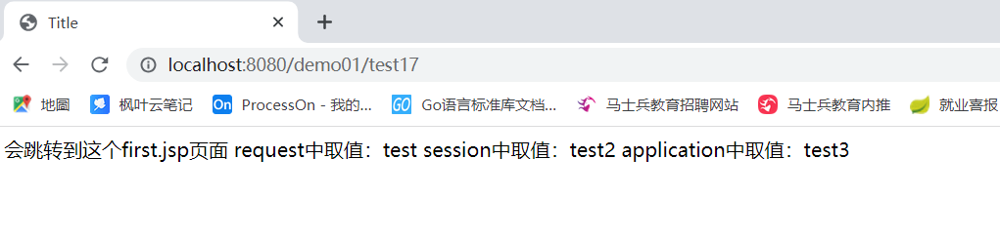

上面的作用域用的最多的作用域就是request作用域，所以springmvc干脆直接给我们封装了一个request作用域供我们使用，就不需要使用原生request作用域了，因为要是使用原生作用域还需要再pom.xml中先导入servlet的东西，耦合性高。

Spring MVC 中 提供了request作用域的解耦写法，没有提供session作用域和application作用域的解耦写法。也就是说当想给request作用域设置内容时有两种写法，给session和application作用域设置值只有紧耦方式。

Spring MVC 中提供的等价request作用域两种方式：在控制单元方法参数中添加org.springframework.ui.Model或java.util.Map对象。这两种方式的本质都是使用了Servlet中request.setAttribute(String,String);方法。

```java
    @RequestMapping("/test18")
    public String test18(Map<String,Object> map){
        map.put("reqmsg","test");
        return "/first.jsp";
    }

    @RequestMapping("/test19")
    public String test19(Model model){
        // 设置一个作用域值
        model.addAttribute("reqmsg","test");
        // 设置多个作用域值
        Map<String,Object> map = new HashMap<>();
        map.put("reqmsg2","test2");
        model.addAllAttributes(map);
        return "/first.jsp";
    }
```

 

## `@ResponseBody`注解

### `@ResponseBody`介绍

该注解用于将 控制单元 的方法返回的对象，通过适当的 转换器转换为指定格式后，写入到 Response 对象的 body 数据区。

返回的数据不是 html 标签的页面，而是其他某种格式的数据时（如**普通文本、 json、xml** 等）使用（**通常用于ajax 请求**）。

@ResponseBody注解是类或方法级注解。

当方法上添加@ResponseBody注解后，控制单元方法返回值将不再被视图解析器进行解析。而是把返回值放入到响应流中进行响应。

### 响应普通文本

直接在方法上添加上@ResponseBody，Spring MVC会把返回值设置到响应流中。

```java
@RequestMapping("/demo1")
@ResponseBody
public String demo1(){
    return "马士兵msbyjx";
}
```

访问控制器后的效果是在浏览器直接打印马士兵msbyjx字符串。(中文会出现乱码)

上面代码等效于直接使用PrintWriter对象进行打印:

```java
@RequestMapping("/demo1")
public void demo1(HttpServletResponse resp) throws IOException {
    PrintWriter out = resp.getWriter();
    out.print("马士兵msbyjx");
    out.flush();
    out.close();
}
```

### 乱码问题处理

在使用@ResponseBody注解时，只要返回值类型不是类或Map或List等满足键值对类型。Spring MVC 都会设置响应内容类型为text/html;charset=ISO-8859-1。

例如：String、八大基本数据类型等Content-Type都是这个类型。

很明显text/html;charset=ISO-8859-1中编码是不支持中文的。所以返回值中包含中文，打印在浏览器中会出现乱码。

想要改变@ResonseBody注解的响应内容类型(Content-Type)只能通过@RequestMapping的produces属性进行设置。

```java
    @RequestMapping(value="/demo1",produces = "text/html;charset=utf-8")
    @ResponseBody
    public String demo1(){
        return "马士兵msbyjx";
    }
```

### 响应json数据

@ResponseBody注解可以把控制单元返回值自动转换为json格式的数据（json对象）。

主要完成下面几个事情：

（1）判断返回值是否为`JavaBean、JavaBean数组、List<JavaBean类型>、Map`等满足键值对的类型。

（2）如果满足键值对类型，会使用Jackson把对象转换为JSON数据，设置到响应流中。同时会设置响应内容类型(Content-Type)为application/json;charset=utf-8

因为Spring MVC默认使用Jackson作为JSON转换工具，把java对象进行json转化，所以必须保证项目中存在Jackson的依赖，在pom.xml中加入下面依赖：

```xml
<dependency>
    <groupId>com.fasterxml.jackson.core</groupId>
    <artifactId>jackson-databind</artifactId>
    <version>2.15.2</version>
</dependency>
```

**案例：返回值是否为JavaBean类型，会使用Jackson把对象转换为JSON数据**

编写javabean：

```java
package com.msb.pojo;

import java.util.Date;

/**
 * @Author: zhaoss
 */
public class Student {
    private int id;
    private String name;
    private Date date;

    public Student() {
    }

    public int getId() {
        return id;
    }

    public void setId(int id) {
        this.id = id;
    }

    public String getName() {
        return name;
    }

    public void setName(String name) {
        this.name = name;
    }

    public Date getDate() {
        return date;
    }

    public void setDate(Date date) {
        this.date = date;
    }
}

```

在控制类中编写控制单元。

```java
    @RequestMapping(value="/demo2")
    @ResponseBody
    public Student demo2(){
        Student s = new Student();
        s.setId(17);
        s.setName("丽丽");
        s.setDate(new Date());
        return s;// 直接return这个对象，前端就会直接得到json对象，不用自己进行任何转化（都是json帮我们处理的）
    }
```

在浏览器访问后会在浏览器打印内容
查看 Content-Type 为json

但是上面日期的格式不正确，是一串数字，怎么解决呢？在javabean的属性中加入一个注解，通过该注解设置响应json数据中日期的格式：

```java
package com.msb.pojo;

import com.fasterxml.jackson.annotation.JsonFormat;

import java.util.Date;

/**
 * @Author: zhaoss
 */
public class Student {
    private int id;
    private String name;
    @JsonFormat(pattern = "yyyy-MM-dd")
    private Date date;

    public Student() {
    }

    public int getId() {
        return id;
    }

    public void setId(int id) {
        this.id = id;
    }

    public String getName() {
        return name;
    }

    public void setName(String name) {
        this.name = name;
    }

    public Date getDate() {
        return date;
    }

    public void setDate(Date date) {
        this.date = date;
    }
}

```

加入注解后再访问发现正常了


注意：

（1）

@DateTimeFormat注解：设置请求参数的日期格式

@JsonFormat注解：设置**响应json数据中的日期格式**

（2）

除了javabean对象以外，也可以使用Map或List<实体类>或List<Map>等类型,这些类型都可以被转换为JSON数据。可自行练习。


### 响应xml文件

在Spring MVC中支持把返回值转换为XML文件。如果项目中所有控制单元返回值结果都希望是XML格式，可以按照下面步骤完成。

先导入依赖：

ps：jackson-databind和jackson-dataformat-xml依赖只能导入一个。

```xml
<!--<dependency>
      <groupId>com.fasterxml.jackson.core</groupId>
      <artifactId>jackson-databind</artifactId>
      <version>2.15.2</version>
    </dependency>-->

    <dependency>
      <groupId>com.fasterxml.jackson.dataformat</groupId>
      <artifactId>jackson-dataformat-xml</artifactId>
      <version>2.15.2</version>
    </dependency>
```

控制单元方法和转换为JSON时写法完全相同。

```java
    @RequestMapping(value="/demo2")
    @ResponseBody
    public Student demo2(){
        Student s = new Student();
        s.setId(17);
        s.setName("丽丽");
        s.setDate(new Date());
        return s;
    }
```


## `@RestController`注解

如果控制器中所有的方法都包含@ResponseBody注解，类似下面效果：

```java
package com.msb.controller;

import com.msb.pojo.Student;
import org.springframework.web.bind.annotation.RequestMapping;
import org.springframework.web.bind.annotation.ResponseBody;

import java.util.Date;

/**
 * @Author: zhaoss
 */
@Controller
public class MyController2 {
    @RequestMapping(value="/demo01",produces = "text/html;charset=utf-8")
    @ResponseBody
    public String demo01(){
        return "马士兵msbyjx";
    }


    @RequestMapping(value="/demo02")
    @ResponseBody
    public Student demo02(){
        Student s = new Student();
        s.setId(17);
        s.setName("丽丽");
        s.setDate(new Date());
        return s;
    }
}

```

像这种类中所有的控制单元方法都有@ResponseBody，那么可以直接将@ResponseBody注解放在类上：

```java
package com.msb.controller;

import com.msb.pojo.Student;
import org.springframework.web.bind.annotation.RequestMapping;
import org.springframework.web.bind.annotation.ResponseBody;

import java.util.Date;

/**
 * @Author: zhaoss
 */
@Controller
@ResponseBody
public class MyController2 {
    @RequestMapping(value="/demo01",produces = "text/html;charset=utf-8")
    public String demo01(){
        return "马士兵msbyjx";
    }


    @RequestMapping(value="/demo02")
    public Student demo02(){
        Student s = new Student();
        s.setId(17);
        s.setName("丽丽");
        s.setDate(new Date());
        return s;
    }
}

```

@Controller、@ResponseBody注解可以使用@RestController进行简化。

@RestController = @Controller + @ResponseBody

当类上使用的是@RestController而不是@Controller时，控制单元方法不再需要写@ResponseBody(也不能写@ResponseBody)，Spring MVC在解析控制单元方法时会自动带有@ResponseBody注解。

所以：@RestController写起来更加简单了。

但是需要注意：

​	一旦类上使用了@RestController，所有控制单元返回都是普通文本或XML或JSON数据，而无法实现页面跳转功能了。

​	所以：只要类中有一个方法是希望实现页面跳转功能，类上就不能使用@RestController。只有类中所有的方法都是返回普通文本或JSON或XML的情况才能使用@RestController注解。

```java
package com.msb.controller;

import com.msb.pojo.Student;
import org.springframework.web.bind.annotation.RequestMapping;
import org.springframework.web.bind.annotation.ResponseBody;
import org.springframework.web.bind.annotation.RestController;

import java.util.Date;

/**
 * @Author: zhaoss
 */
@RestController  // 此处换成了@RestController，而不是@Controller了
public class MyController2 {
    // 下面所有方法都不写@ResponseBody注解
    
    
    @RequestMapping(value="/demo01",produces = "text/html;charset=utf-8")
    public String demo01(){
        return "马士兵msbyjx";
    }


    @RequestMapping(value="/demo02")
    public Student demo02(){
        Student s = new Student();
        s.setId(17);
        s.setName("丽丽");
        s.setDate(new Date());
        return s;
    }
}

```


访问：http://localhost:8080/demo01/demo01、http://localhost:8080/demo01/demo02即可。


## `@RequestBody`注解

通过案例：前台传递参数后端接收，一点点引入，我们通过ajax请求传递数据到后端

### ajax请求-数据为json对象

（1）在webapp目录下添加jquery.js文件：

（2）对js文件放行：springmvc.xml中：

```xml
<?xml version="1.0" encoding="UTF-8"?>
<beans xmlns="http://www.springframework.org/schema/beans"
       xmlns:mvc="http://www.springframework.org/schema/mvc"
       xmlns:xsi="http://www.w3.org/2001/XMLSchema-instance"
       xmlns:context="http://www.springframework.org/schema/context"
       xsi:schemaLocation="http://www.springframework.org/schema/beans
		https://www.springframework.org/schema/beans/spring-beans.xsd
        http://www.springframework.org/schema/context
        https://www.springframework.org/schema/context/spring-context.xsd
        http://www.springframework.org/schema/mvc
        https://www.springframework.org/schema/mvc/spring-mvc.xsd">

    <!-- 扫描控制器类，千万不要把service等扫描进来，也千万不要在Spring配置文件扫描控制器类所在包 -->
    <context:component-scan base-package="com.msb.controller"></context:component-scan>
    <!-- 让Spring MVC的注解生效 ：@RequestMapping，这个位置别忘记加入mvc的命名空间-->
   <mvc:annotation-driven></mvc:annotation-driven>
    <!-- 静态资源放行-->
    <mvc:resources mapping="/js/**" location="/js/"></mvc:resources>
</beans>
```

（3）webapp目录下创建test.jsp:

```html
<%--
  Created by IntelliJ IDEA.
  User: zhaoss-msb
  Date: 2023/8/2
  Time: 12:40
  To change this template use File | Settings | File Templates.
--%>
<%@ page contentType="text/html;charset=UTF-8" language="java" %>
<html>
<head>
    <title>Title</title>
    <script type="text/javascript" src="js/jquery.js" ></script>
    <script type="text/javascript">
      $(function (){
          $("#btn").click(function (){
              $.ajax({
                  url:"test1",
                  data:{"id":1,"name":"张三"},  //json对象
                  type:"post",
                  success:function (data) {
                      console.log(data);
                  }
              });
          })
      });
    </script>
</head>
<body>
    <button type="button" id="btn" >ajax请求</button>
</body>
</html>

```

（4）控制类：

```java
package com.msb.controller;

import com.msb.pojo.Student;
import org.springframework.stereotype.Controller;
import org.springframework.web.bind.annotation.RequestMapping;
import org.springframework.web.bind.annotation.ResponseBody;

import java.util.Date;

/**
 * @Author: zhaoss
 */
@Controller
public class MyController3 {
    @RequestMapping(value="/test1")
    @ResponseBody
    public String demo01(Student s){
        System.out.println(s);
        return "ok";
    }
}

```

（5）对应实体类：

```java
package com.msb.pojo;
/**
 * @Author: zhaoss
 */
public class Student {
    private int id;
    private String name;

    public Student() {
    }

    public int getId() {
        return id;
    }

    public void setId(int id) {
        this.id = id;
    }

    public String getName() {
        return name;
    }

    public void setName(String name) {
        this.name = name;
    }


    @Override
    public String toString() {
        return "Student{" +
                "id=" + id +
                ", name='" + name + '\'' +
                '}';
    }
}

```


### ajax请求-数据为json字符串

如果在ajax请求中发送的数据是json字符串：

```html
<%--
  Created by IntelliJ IDEA.
  User: zhaoss-msb
  Date: 2023/8/2
  Time: 12:40
  To change this template use File | Settings | File Templates.
--%>
<%@ page contentType="text/html;charset=UTF-8" language="java" %>
<html>
<head>
    <title>Title</title>
    <script type="text/javascript" src="js/jquery.js" ></script>
    <script type="text/javascript">
      $(function (){
          $("#btn").click(function (){
              $.ajax({
                  url:"test1",
                  data:'{"id":1,"name":"张三"}',//json字符串
                  type:"post",
                  success:function (data) {
                      console.log(data);
                  }
              });
          })
      });
    </script>
</head>
<body>
    <button type="button" id="btn" >ajax请求</button>
</body>
</html>

```

启动服务器发送请求，发现后台无法接受到数据


**怎么处理呢？需要使用@RequestBody注解。**

@RequestBody注解底层依赖的依然是Jackson工具包，其作用是把客户端传递过来的请求体中JSON或XML数据转换为Map、类、List<类>、List<Map>等类型。

使用@RequestBody注解需要导入依赖：

```xml
<dependency>
    <groupId>com.fasterxml.jackson.core</groupId>
    <artifactId>jackson-databind</artifactId>
    <version>2.15.2</version>
</dependency>
```

控制类变为：

```java
package com.msb.controller;

import com.msb.pojo.Student;
import org.springframework.stereotype.Controller;
import org.springframework.web.bind.annotation.RequestBody;
import org.springframework.web.bind.annotation.RequestMapping;
import org.springframework.web.bind.annotation.ResponseBody;

import java.util.Date;

/**
 * @Author: zhaoss
 */
@Controller
public class MyController3 {
    @RequestMapping(value="/test1")
    @ResponseBody
    public String demo01(@RequestBody Student s){
        System.out.println(s);
        return "ok";
    }
}

```


前台有三次需要重点注意的地方：

（1）contentType：必须设置。常见取值“application/json”或"application/xml"。如果没有设置这个属性，取值默认是application/x-www-form-urlencoded，表示普通表单参数。当设置为"application/json"时，会把data取值设置到请求体中，所以服务端接收参数时就不能按照普通表单参数进行接收。

（2）data: 请求参数。必须是字符串类型，不能是JSON格式的对象。因为在JSON中key两侧必须有双引号，所以data取值两侧用单引号包含。因为在JavaScript中字符串string类型可以使用单引号包含，也可以使用双引号包含。

（3）type: 既然@RequestBody注解是处理**请求体**中的数据，所以前端**不能是GET**类型请求（GET没有请求体），多用在POST类型的请求中。


修改test.jsp:

```html
<%--
  Created by IntelliJ IDEA.
  User: zhaoss-msb
  Date: 2023/8/2
  Time: 12:40
  To change this template use File | Settings | File Templates.
--%>
<%@ page contentType="text/html;charset=UTF-8" language="java" %>
<html>
<head>
    <title>Title</title>
    <script type="text/javascript" src="js/jquery.js" ></script>
    <script type="text/javascript">
      $(function (){
          $("#btn").click(function (){
              $.ajax({
                  url:"test1",
                  contentType:"application/json",// 修改请求内容类型 
                  data:'{"id":1,"name":"张三"}',//json字符串
                  type:"post",
                  success:function (data) {
                      console.log(data);
                  }
              });
          })
      });
    </script>
</head>
<body>
    <button type="button" id="btn" >ajax请求</button>
</body>
</html>

```

重启运行结果正常


## SSM整合

### 新建模块

maven  webapp

### 添加依赖和资源拷贝插件

```xml
<project xmlns="http://maven.apache.org/POM/4.0.0" xmlns:xsi="http://www.w3.org/2001/XMLSchema-instance"
  xsi:schemaLocation="http://maven.apache.org/POM/4.0.0 http://maven.apache.org/maven-v4_0_0.xsd">
  <modelVersion>4.0.0</modelVersion>
  <groupId>org.example</groupId>
  <artifactId>SSMDemo</artifactId>
  <packaging>war</packaging>
  <version>1.0-SNAPSHOT</version>
  <name>SSMDemo Maven Webapp</name>
  <url>http://maven.apache.org</url>
  <dependencies>
    <dependency>
      <groupId>junit</groupId>
      <artifactId>junit</artifactId>
      <version>3.8.1</version>
      <scope>test</scope>
    </dependency>
    <!-- 【必备】mybatis的依赖 -->
    <dependency>
      <groupId>org.mybatis</groupId>
      <artifactId>mybatis</artifactId>
      <version>3.5.9</version>
    </dependency>
    <!-- 【必备】连接mysql的依赖 -->
    <dependency>
      <groupId>mysql</groupId>
      <artifactId>mysql-connector-java</artifactId>
      <version>8.0.28</version>
    </dependency>
    <!-- 【必备】日志slf4j依赖：需要导入log4j,slf4j和slf4j整合log4j的依赖-->
    <dependency>
      <groupId>log4j</groupId>
      <artifactId>log4j</artifactId>
      <version>1.2.17</version>
    </dependency>
    <dependency>
      <groupId>org.slf4j</groupId>
      <artifactId>slf4j-api</artifactId>
      <version>1.6.1</version>
    </dependency>
    <dependency>
      <groupId>org.slf4j</groupId>
      <artifactId>slf4j-log4j12</artifactId>
      <version>1.7.2</version>
    </dependency>
    <!-- 【必备】spring的依赖  -->
    <dependency>
      <groupId>org.springframework</groupId>
      <artifactId>spring-context</artifactId>
      <version>6.0.5</version>
    </dependency>
    <!-- 【必备】springjdbc依赖：配置连接数据库数据源
    DriverManagerDataSource属于spring-jdbc包-->
    <dependency>
      <groupId>org.springframework</groupId>
      <artifactId>spring-jdbc</artifactId>
      <version>6.0.5</version>
    </dependency>
    <!--AOP命名空间的依赖：上面spring的依赖中包含aop了，但是还需要额外导入命名空间的依赖，运行时生效的-->
    <dependency>
      <groupId>org.aspectj</groupId>
      <artifactId>aspectjweaver</artifactId>
      <version>1.9.9.1</version>
      <scope>runtime</scope>
    </dependency>
    <!-- 【必备】spring整合mybatis的依赖  -->
    <dependency>
      <groupId>org.mybatis</groupId>
      <artifactId>mybatis-spring</artifactId>
      <version>3.0.1</version>
    </dependency>
    <!--jsp、servletapi，其实可以不导入，以防万一需要-->
    <dependency>
      <groupId>jakarta.servlet.jsp</groupId>
      <artifactId>jakarta.servlet.jsp-api</artifactId>
      <version>3.0.0</version>
      <scope>provided</scope>
    </dependency>
    <dependency>
      <groupId>jakarta.servlet</groupId>
      <artifactId>jakarta.servlet-api</artifactId>
      <version>5.0.0</version>
      <scope>provided</scope>
    </dependency>
    <!-- 【必备】依赖了Spring框架核心功能的5个依赖以及Spring整合Web的依赖spring-web -->
    <dependency>
      <groupId>org.springframework</groupId>
      <artifactId>spring-webmvc</artifactId>
      <version>6.0.11</version>
    </dependency>

    <!--Jackson依赖：进行把java对象进行json转化-->
    <dependency>
      <groupId>com.fasterxml.jackson.core</groupId>
      <artifactId>jackson-databind</artifactId>
      <version>2.15.2</version>
    </dependency>
  </dependencies>
  <build>
    <finalName>SSMDemo</finalName>
    <!-- 【必备】加入资源拷贝插件 -->
    <resources>
      <resource>
        <directory>src/main/java</directory>
        <includes>
          <include>**/*.xml</include>
        </includes>
      </resource>
      <resource>
        <directory>src/main/resources</directory>
        <includes>
          <include>**/*.txt</include>
          <include>**/*.xml</include>
          <include>**/*.properties</include>
        </includes>
      </resource>
    </resources>
  </build>
</project>

```

标识【必备】是ssm整合所必须的环境依赖，没有标注的可以等什么时候用什么时候放进来就可以。

### 添加java目录

### 添加log4j.properties

在resources目录下加入log4j.properties

```properties
# log4j中定义的级别：fatal(致命错误) > error(错误) >warn(警告) >info(普通信息) >debug(调试信息)>trace(跟踪信息)
log4j.rootLogger = DEBUG , console , D 

### console ###
log4j.appender.console = org.apache.log4j.ConsoleAppender
log4j.appender.console.Target = System.out
log4j.appender.console.layout = org.apache.log4j.PatternLayout
log4j.appender.console.layout.ConversionPattern = [%p] [%-d{yyyy-MM-dd HH\:mm\:ss}] %C.%M(%L) | %m%n
```


### 处理spring整合mybatis部分

添加applicationContext.xml:

```xml
<?xml version="1.0" encoding="UTF-8"?>
<beans xmlns="http://www.springframework.org/schema/beans"
       xmlns:xsi="http://www.w3.org/2001/XMLSchema-instance"
       xmlns:context="http://www.springframework.org/schema/context"
       xsi:schemaLocation="http://www.springframework.org/schema/beans
        https://www.springframework.org/schema/beans/spring-beans.xsd
        http://www.springframework.org/schema/context
        https://www.springframework.org/schema/context/spring-context.xsd">
    <!-- 【1】连接数据库，获取数据源，配置数据源，设置数据库连接的四个参数  -->
    <bean id="dataSource" class="org.springframework.jdbc.datasource.DriverManagerDataSource">
        <!-- 利用setter方法完成属性注入，四个参数名固定的，注意源码中虽然没有driverClassName属性，但是有driverClassName的setter方法 -->
        <property name="driverClassName" value="com.mysql.cj.jdbc.Driver"/>
        <property name="url" value="jdbc:mysql://localhost:3306/msbsys?useUnicode=true&amp;characterEncoding=utf-8&amp;useSSL=false&amp;serverTimezone=GMT%2B8&amp;allowPublicKeyRetrieval=true"/>
        <property name="username" value="root"/>
        <property name="password" value="root"/>
    </bean>
    <!-- 【2】获取SqlSessionFactory对象  -->
    <!-- 以前SqlSessionFactory都是在测试代码中我们自己创建的，但是现在不用了，整合包中提供的对于SqlSessionFactory的封装。里面提供了MyBatis全局配置文件所有配置的属性 -->
    <bean id="factory" class="org.mybatis.spring.SqlSessionFactoryBean">
        <!-- 注入数据源       -->
        <property name="dataSource" ref="dataSource"/>
        <!-- 给包下类起别名       -->
        <property name="typeAliasesPackage" value="com.msb.pojo"></property>
    </bean>
    <!-- 【3】扫描mapper文件   -->
    <!-- 设置扫描哪个包，进行接口绑定-->
    <!-- 所有Mapper接口代理对象都能创建出来，可以直接从容器中获取出来。 -->
    <bean class="org.mybatis.spring.mapper.MapperScannerConfigurer">
        <!-- 和SqlSessionFactory产生联系，以前接口绑定sqlSession.getMapper(BookMapper.class);
        都是通过以前接口绑定sqlSession来调用mapper，所以这里一定要注入工厂啊
         注意这里sqlSessionFactoryBeanName类型为String，所以用value把工厂名字写过来就行-->
        <property name="sqlSessionFactoryBeanName" value="factory"></property>
        <!-- 扫描的包 -->
        <property name="basePackage" value="com.msb.mapper"></property>
    </bean>

    <!-- 【4】扫描包下注解 -->
    <context:component-scan base-package="com.msb.service"></context:component-scan>
</beans>

```

### 处理整合springmvc部分

创建springmvc.xml:

```xml
<?xml version="1.0" encoding="UTF-8"?>
<beans xmlns="http://www.springframework.org/schema/beans"
       xmlns:mvc="http://www.springframework.org/schema/mvc"
       xmlns:xsi="http://www.w3.org/2001/XMLSchema-instance"
       xmlns:context="http://www.springframework.org/schema/context"
       xsi:schemaLocation="
        http://www.springframework.org/schema/beans
        https://www.springframework.org/schema/beans/spring-beans.xsd
        http://www.springframework.org/schema/context
        https://www.springframework.org/schema/context/spring-context.xsd
        http://www.springframework.org/schema/mvc
        https://www.springframework.org/schema/mvc/spring-mvc.xsd">
    <!-- 扫描控制器类，千万不要把service等扫描进来，也千万不要在Spring配置文件扫描控制器类所在包 -->
    <context:component-scan base-package="com.msb.controller"></context:component-scan>
    <!-- 让Spring MVC的注解生效 ：@RequestMapping-->
    <mvc:annotation-driven></mvc:annotation-driven>
    <!--配置静态资源放行-->
    <mvc:resources mapping="/js/**" location="/js/"></mvc:resources>
    <mvc:resources mapping="/css/**" location="/css/"></mvc:resources>
    <mvc:resources mapping="/images/**" location="/images/"></mvc:resources>
</beans>
```

### web.xml中加入springmvc.xml、applicationContext.xml的解析

```xml
<?xml version="1.0" encoding="UTF-8"?>
<web-app xmlns="http://xmlns.jcp.org/xml/ns/javaee"
         xmlns:xsi="http://www.w3.org/2001/XMLSchema-instance"
         xsi:schemaLocation="http://xmlns.jcp.org/xml/ns/javaee http://xmlns.jcp.org/xml/ns/javaee/web-app_4_0.xsd"
         version="4.0">
  <servlet>
    <servlet-name>springmvc</servlet-name>
    <servlet-class>org.springframework.web.servlet.DispatcherServlet</servlet-class>
    <init-param>
      <!-- 参数名称必须叫做：contextConfigLocation。单词和大小写错误都导致配置文件无法正确加载 -->
      <param-name>contextConfigLocation</param-name>
      <!-- springmvc.xml 名称自定义，只要和我们创建的配置文件的名称对应就可以了。 -->
      <param-value>classpath:springmvc.xml</param-value>
    </init-param>
    <!-- Tomcat启动立即加载Servlet，而不是等到访问Servlet才去实例化DispatcherServlet -->
    <!-- 配置上的效果：Tomcat启动立即加载Spring MVC框架的配置文件-->
    <load-on-startup>1</load-on-startup>
  </servlet>
  <servlet-mapping>
    <servlet-name>springmvc</servlet-name>
    <!-- /表示除了.jsp结尾的uri，其他的uri都会触发DispatcherServlet。此处前往不要写成 /* -->
    <url-pattern>/</url-pattern>
  </servlet-mapping>
  
  <!--新加入-->
  <!--解析applicationContext.xml：利用监听器监听-->
  <listener>
    <listener-class>org.springframework.web.context.ContextLoaderListener</listener-class>
  </listener>
  <!--给全局参数contextConfigLocation设置值，contextConfigLocation是ContextLoaderListener父类ContextLoader中的属性-->
  <context-param>
    <param-name>contextConfigLocation</param-name>
    <param-value>classpath:applicationContext.xml</param-value>
  </context-param>
</web-app>

```

### 创建数据库表


并在数据库表中添加数据。

### 创建项目目录结构

整合的配置内容已经配置好了，接下来开始创建项目的目录结构，项目要分层，有controller层、service层、有dao层（mapper层）、实体类层。

### 实体类构建

```java
package com.msb.pojo;

/**
 * @Author: zhaoss
 */
public class Book {
    private int id;
    private String name;
    private String author;
    private double price;

    public int getId() {
        return id;
    }

    public void setId(int id) {
        this.id = id;
    }

    public String getName() {
        return name;
    }

    public void setName(String name) {
        this.name = name;
    }

    public String getAuthor() {
        return author;
    }

    public void setAuthor(String author) {
        this.author = author;
    }

    public double getPrice() {
        return price;
    }

    public void setPrice(double price) {
        this.price = price;
    }

    @Override
    public String toString() {
        return "Book{" +
                "id=" + id +
                ", name='" + name + '\'' +
                ", author='" + author + '\'' +
                ", price=" + price +
                '}';
    }
}

```

### mapper层

com.msb.mapper下创建BookMapper接口：

```java
package com.msb.mapper;

/**
 * @Author: zhaoss
 */
import java.util.List;

public interface BookMapper {
    public abstract List selectAll();
}

```

resources目录下创建com.msb.mapper文件夹，创建BookMapper.xml文件：

```xml
<?xml version="1.0" encoding="UTF-8" ?>
<!DOCTYPE mapper
        PUBLIC "-//mybatis.org//DTD Mapper 3.0//EN"
        "https://mybatis.org/dtd/mybatis-3-mapper.dtd">
<mapper namespace="com.msb.mapper.BookMapper">
    <select id="selectAll" resultType="book">
        select * from book
    </select>
</mapper>
```

### service层

com.msb.service下创建BookService接口：

```java
package com.msb.service;

/**
 * @Author: zhaoss
 */
import java.util.List;

public interface BookService {
    public abstract List findAll();
}
```

com.msb.service.impl下构建BookServiceImpl实现类：

```java
package com.msb.service.impl;

import com.msb.mapper.BookMapper;
import com.msb.service.BookService;
import org.springframework.beans.factory.annotation.Autowired;
import org.springframework.stereotype.Service;

import java.util.List;

/**
 * @Author: zhaoss
 */
@Service
public class BookServiceImpl implements BookService {
    @Autowired
    private BookMapper bookMapper;
    public List findAll() {
        return bookMapper.selectAll();
    }
}

```

### controller层

```java
package com.msb.controller;

import com.msb.service.BookService;
import org.springframework.beans.factory.annotation.Autowired;
import org.springframework.stereotype.Controller;
import org.springframework.web.bind.annotation.RequestMapping;
import org.springframework.web.bind.annotation.ResponseBody;

import java.util.List;

/**
 * @Author: zhaoss
 */
@Controller
public class BookController {
    @Autowired
    private BookService bookService;
    @RequestMapping("/findAllBooks")
    @ResponseBody
    public List findAll(){
        List list = bookService.findAll();
        return list;
    }
}
```

最终目录结构：


### 测试

将项目添加入tomcat

访问：http://localhost:8080/ssm/findAllBooks


## WEB-INF下文件访问方式

### WEB-INF下文件访问方式

如果在WEB-INF目录下的jsp文件，如何进行访问呢？

```
webapp
-WEB-INF
--jsp
---hi.jsp
```


不可以直接通过浏览器访问 http://localhost:8080/demo01/WEB-INF/jsp/hi.jsp


因为WEB-INF下,应用服务器把它指为禁访目录,即直接在浏览器里是不能访问到的。（web-inf下的静态资源可以通过静态资源放行配置后访问到，此处说的是非静态资源，如：jsp资源）

WEB-INF下的资源，可以通过控制单元进行请求转发，编写控制单元：

```java
package com.msb.controller;

import org.springframework.stereotype.Controller;
import org.springframework.web.bind.annotation.RequestMapping;

/**
 * @Author: zhaoss
 */
@Controller
public class MyController4 {
    @RequestMapping(value="/testwebinf1")
    public String testwebinf1(){
        System.out.println("走入testwebinf1方法");
        // 请求转发到WEB-INF/jsp/hi.jsp
        return "WEB-INF/jsp/hi.jsp";
    }
}
```

这样就可以访问了：http://localhost:8080/demo01/testwebinf1


### 自定义视图解析器

如果控制类中的控制单元都是跳转到WEB-INF/jsp目录下，如：

```java
package com.msb.controller;

import org.springframework.stereotype.Controller;
import org.springframework.web.bind.annotation.RequestMapping;

/**
 * @Author: zhaoss
 */
@Controller
public class MyController4 {
    @RequestMapping(value="/testwebinf1")
    public String testwebinf1(){
        System.out.println("走入testwebinf1方法");
        // 请求转发到WEB-INF/jsp/hi.jsp
        return "WEB-INF/jsp/hi.jsp";
    }
    @RequestMapping(value="/testwebinf2")
    public String testwebinf2(){
        System.out.println("走入testwebinf2方法");
        // 请求转发到WEB-INF/jsp/hi.jsp
        return "WEB-INF/jsp/hi.jsp";
    }
    @RequestMapping(value="/testwebinf3")
    public String testwebinf3(){
        System.out.println("走入testwebinf3方法");
        // 请求转发到WEB-INF/jsp/hi.jsp
        return "WEB-INF/jsp/hi.jsp";
    }
}

```

**需要简化控制单元返回值的情况**下可以自定义视图解析器。

所以我们可以自定义视图解析器，在springmvc.xml中加入：

```xml
<!--配置自定义试图解析器-->
<bean id="viewResolver" class="org.springframework.web.servlet.view.InternalResourceViewResolver">
    	<!-- 前缀 -->
        <property name="prefix" value="/WEB-INF/jsp/"></property>
    	<!-- 后缀 -->
        <property name="suffix" value=".jsp"></property>
</bean>
```

加入视图解析器后，控制类可以简化为：

```java
package com.msb.controller;

import org.springframework.stereotype.Controller;
import org.springframework.web.bind.annotation.RequestMapping;

/**
 * @Author: zhaoss
 */
@Controller
public class MyController4 {
    @RequestMapping(value="/testwebinf1")
    public String testwebinf1(){
        System.out.println("走入testwebinf1方法");
        // 请求转发到WEB-INF/jsp/hi.jsp
        return "hi";
    }
    @RequestMapping(value="/testwebinf2")
    public String testwebinf2(){
        System.out.println("走入testwebinf2方法");
        // 请求转发到WEB-INF/jsp/hi.jsp
        return "hi";
    }
    @RequestMapping(value="/testwebinf3")
    public String testwebinf3(){
        System.out.println("走入testwebinf3方法");
        // 请求转发到WEB-INF/jsp/hi.jsp
        return "hi";// 由视图解析器拼接：prefix + hi + suffix。具体：/WEB-INF/jsp/ + hi + .jsp
    }
}

```

这样也是没有问题的。对于这种，项目结构比较固定，页面按照一定规则放在特定位置，且返回值内容比较长时，就可以配置视图解析器。


### 自定义视图解析器下跳转到其他控制器

当自定义视图解析器后，返回值前面和后面都会固定拼接字符串（在没有使用其他注解情况下）。但是如果想要控制单元跳转到非视图解析器指定的位置，那么需要在返回值前面**明确添加forward:或redirect:** ，这样就不走自定义的视图解析器了，如下：

```java
@RequestMapping(value="/testwebinf4")
public String testwebinf4(){
    System.out.println("走入testwebinf4方法");
    return "forward:/index.jsp";
}
```

这样访问http://localhost:8080/demo01/testwebinf4就会请求转发到webapp目录下的index.jsp页面。

### WEB-INF目录下资源互相访问

如果在hi.jsp想要跳转到hello.jsp怎么处理呢？

在hi.jsp中加入超链接:

```html
<%--
  Created by IntelliJ IDEA.
  User: zhaoss-msb
  Date: 2023/8/3
  Time: 13:24
  To change this template use File | Settings | File Templates.
--%>
<%@ page contentType="text/html;charset=UTF-8" language="java" %>
<html>
<head>
    <title>Title</title>
</head>
<body>
  hi..web-inf 
  <a href="testwebinf5">跳转到hello.jsp</a>  
</body>
</html>

```

href中定义的是控制单元地址，在控制单元中完成跳转：

```java
    @RequestMapping(value="/testwebinf5")
    public String testwebinf5(){
        // 请求转发到WEB-INF/jsp/hello.jsp
        return "hello";
    }
```

先通过控制单元请求到hi.jsp再点击超链接进入hello.jsp中。


## Restful风格的API接口

### Restful风格的API接口出现的原因

因为后端开发人员有很多，不只是一个人，这时候不同的开发人员开发风格不同，如果规范不统一，会出现什么问题？比如一个新增逻辑，不同的开发人员定义的url：

```java
http://localhost:8080/demo01/add
http://localhost:8080/demo01/save
http://localhost:8080/demo01/newUser
http://localhost:8080/demo01/zengjia
...等
```

每个人的规范不同，那么编写API接口的习惯自然不同。这样就会造成同一个类型的接口的所提供的路径千奇百怪，这样客户端调用的时候就会频繁切换不同风格的路径去调用，无形中增加了别人的劳动量和精力。

为了避免上述情况发生，所有人如果进行同一个项目的开发，那么就遵循一套相同的逻辑，如何优雅的、科学的去统一这套api呢？

答案：项目接口设计的时候遵循restful规范，此项目接口也就是具有restful风格的API接口。

### 考虑1：路径设计

路径的设计：由当前接口操作的资源决定，比如接口操作的对应是用户，路径可设计为：/user

### 考虑2：参数的传递

比如在进行查询指定用户id的用户时候，传统方式中查询用户的访问路径写法:http://localhost:8080/demo01/user?id=1

上面在参数传递的过程中，其实我们真正想要传递的数据是1，所以既然你的目的就是传递数据，那么可否写成下面的方式呢？http://localhost:8080/demo01/user/1,此时后端控制单元怎么处理呢？

```java
package com.msb.controller;

import com.msb.pojo.User;
import org.springframework.stereotype.Controller;
import org.springframework.web.bind.annotation.PathVariable;
import org.springframework.web.bind.annotation.RequestMapping;

/**
 * @Author: zhaoss
 */
@Controller
public class MyController5 {
    @RequestMapping(value="/user/{id}") // 前端传过来的参数就会给id
    public User selectOneUser(@PathVariable Integer id){
        //想要在方法中使用id，就需要将参数id指定为上面的id，此时需要@PathVariable注解，这样传过来的参数才会被方法的参数接收到
        // 方法的参数名字必须和路径中名称保持一致
        // 下面这句代码，是模拟从业务层获取到User对象：
        User user = new User();
        return user;
    }
}

```


### 考虑3：请求方式

但是这样又出现了新的问题，就是如何区分不同的操作调用不同的功能方法处理呢？比如删除和查询的url地址就是一样的怎么区分不同的操作呢?如：

删除用户: http://localhost:8080/demo01/user/1

查询用户:http://localhost:8080/demo01/user/1

此时就需要借助请求方式：

HTTP协议中支持很多种请求方式，除了GET和POST还有PUT和DELETE等，restful中要求使用不同的请求方式来标记对资源的操作方式，达到调用不同的后台功能方法来处理请求的目的。

具体的请求方式根据接口对资源的操作决定，增post  删delete  改put  查get

```
在 Restful 风格中，现有规定如下：
GET（SELECT）：从服务器查询，可以在服务器通过请求的参数区分查询的方式。
POST（CREATE）：在服务器端新建一个资源，调用 insert 操作。
PUT（UPDATE）：在服务器端更新资源，调用 update 操作。
PATCH（UPDATE）：在服务器端更新资源（客户端提供改变的属性）。(目前 jdk7 未实现，tomcat7不支持)。
DELETE（DELETE）：从服务器端删除资源，调用 delete 语句。
```

```java
/**
 * @RequestMapping注解可以接收任意请求方式的请求
 * @GetMapping("地址"):接收GET请求，一般用在查询方法上
 * @DeleteMapping("地址"):接收DELETE请求，一般用在删除方法上
 * @PostMapping("地址"):接收POST请求，一般用户在新增上
 * @PutMapping("地址"):接收PUT请求，一般用在修改上
 */
//查询用户信息
@GetMapping("/user/{id}")
public String selUser(@PathVariable Integer id){
    System.out.println("用户ID为:"+id);
    return "/success.jsp";
}
//删除用户信息
@DeleteMapping("/user/{id}")
public String delUser(@PathVariable Integer id){
    System.out.println("用户ID为:"+id);
    return "/success.jsp";
}
//新增用户信息
@PostMapping("/user/{id}/{name}/{age}")
public String addUser(@PathVariable Integer id,@PathVariable String name,@PathVariable Integer age){
    System.out.println("id = " + id + ", name = " + name + ", age = " + age);
    return "/success.jsp";
}
//修改用户信息
@PutMapping("/user/{id}/{name}")
public String updateUser(@PathVariable Integer id,@PathVariable String name){
    System.out.println("id = " + id + ", name = " + name);
    return "/success.jsp";
}
```


这样请求方式+路径参数即可确定要访问的具体的控制单元。


## 文件上传

把文件保存到服务器中，叫文件上传。

从服务器将文件下载到本地，叫文件下载。

以达到资源共享目的。

### 文件上传思路

图片不是保存在数据库，而是上传到服务器磁盘中。

如果有其它表单信息，如用户名字、用户性别、还有你要保存的图片的文件名称，一起保存到数据库。

在文件上传时文件和其他请求参数**是在请求体中进行传递，所以不支持GET类型请求，要使用POST类型请求**。GET请求方式提交的数据量大小有限制，如果文件过大肯定不能用GET方式。


### 前台页面的实现

文件上传的时机有两种：

**时机一**：选择好图片以后就直接上传——利用ajax方式（推荐）

**时机二**：选择好图片以后并不会直接上传，而是点击提交以后，将整个表单提交至后台。——利用非ajax方式

#### ajax方式

（1）导入jquery.js:


（2）注意对js文件放行，在springmvc.xml中加入：

```xml
<?xml version="1.0" encoding="UTF-8"?>
<beans xmlns="http://www.springframework.org/schema/beans"
       xmlns:mvc="http://www.springframework.org/schema/mvc"
       xmlns:xsi="http://www.w3.org/2001/XMLSchema-instance"
       xmlns:context="http://www.springframework.org/schema/context"
       xsi:schemaLocation="http://www.springframework.org/schema/beans
		https://www.springframework.org/schema/beans/spring-beans.xsd
        http://www.springframework.org/schema/context
        https://www.springframework.org/schema/context/spring-context.xsd
        http://www.springframework.org/schema/mvc
        https://www.springframework.org/schema/mvc/spring-mvc.xsd">


    <context:component-scan base-package="com.msb.controller"></context:component-scan>
    <mvc:annotation-driven></mvc:annotation-driven>
    <!-- 静态资源放行-->
    <mvc:resources mapping="/js/**" location="/js/"></mvc:resources>
 
</beans>
```

（3）save.jsp页面编写：

```html
<%--
  Created by IntelliJ IDEA.
  User: zhaoss-msb
  Date: 2023/8/4
  Time: 17:55
  To change this template use File | Settings | File Templates.
--%>
<%@ page contentType="text/html;charset=UTF-8" language="java" %>
<html>
<head>
    <title>Title</title>
    <script type="text/javascript" src="js/jquery.js"></script>
    <%--声明js代码域--%>
    <script type="text/javascript">
        /****************资源上传功能实现**********************************/
        $(function () {
            //给图片按钮绑定值改变事件
            $("#filebtn").change(function () {
                //获取要上传的文件资源
                var file=$("#filebtn")[0].files[0];
                //创建FormData对象存储要上传的资源(文件上传数据的载体)
                var formData = new FormData();
                formData.append("photo",file);
                //发起ajax请求完成文件上传
                $.ajax({
                    /*
                    在文件上传时文件和其他请求参数是在请求体中进行传递，
                    所以不支持GET类型请求，要使用POST类型请求。
                    GET请求方式提交的数据量大小有限制，
                    如果文件过大肯定不能用GET方式。
                     */
                    type:"post",//使用post类型的请求
                    data:formData,//请求数据
                    url:"upload",//请求地址
                    /*
                    如果该页面文件上传使用的是非ajax方式，那么必须在form表单中加入：
                    enctype="multipart/form-data"
                    加入该属性代表：表单提交的内容转为二进制方式
                    因为enctype默认值="application/x-www-form-urlencoded"，代表普通文本
                    姓名、年龄可以按照普通文本，但是文件不可以呀！
                    所以需要将表单提交的内容转为二进制方式
                    必须使用
                    enctype="multipart/form-data"

                    现在我们使用的是ajax方式，需要设置processData、contentType为false
                    ① 将processData属性的值设置为false，告诉浏览器发送对象请求数据
                    ② 将contentType属性的值设置为false，设置请求数据的类型为二进制类型。
                    所以enctype="multipart/form-data"等价于processData:false+contentType:false
                     */
                    processData:false,
                    contentType:false,
                    success:function (data) {//回调函数
						console.log(data)
                    }
                })
            })
        })
    </script>
</head>
<body>
<h1>用户账户注册</h1>
<form>
    <p>
        姓名：<input type="text" name="name"/>
    </p>
    <p>
        年龄：<input type="text" name="sex"/>
    </p>
    <p>
        头像：<input type="file" name="photo" id="filebtn"/>
    </p>
    <p>
        <input type="submit" value="提交"/>
    </p>
</form>
</body>
</html>

```


其中`var file=$("#filebtn")[0].files[0];`代表需要上传的文件，如何验证这段代码的含义，可以通过如下代码进行测试：

```html
<%--
  Created by IntelliJ IDEA.
  User: zhaoss-msb
  Date: 2023/8/4
  Time: 17:55
  To change this template use File | Settings | File Templates.
--%>
<%@ page contentType="text/html;charset=UTF-8" language="java" %>
<html>
<head>
    <title>Title</title>
    <script type="text/javascript" src="js/jquery.js"></script>
    <%--声明js代码域--%>
    <script type="text/javascript">
        /****************资源上传功能实现**********************************/
        $(function () {
            //给图片按钮绑定值改变事件
            $("#filebtn").change(function () {
                //获取要上传的文件资源
                var file=$("#filebtn");
                console.log(file);
            })
        })
    </script>
</head>
<body>
<h1>用户账户注册</h1>
<form>
    <p>
        姓名：<input type="text" name="name"/>
    </p>
    <p>
        年龄：<input type="text" name="sex"/>
    </p>
    <p>
        头像：<input type="file" name="photo" id="filebtn"/>
    </p>
    <p>
        <input type="submit" value="提交"/>
    </p>
</form>
</body>
</html>

```


### 配置表单解析对象

如果后台想要接收前台传过来的文件数据，必须在springmvc.xml中配置表单解析对象。

只有配置了MultipartResovler，Spring MVC 才会解析上传文件流数据。

同时`<bean>`的id必须叫做`multipartResovler`，叫其他名字无效。

```xml
<!-- 文件上传时，必须配置文件解析器 -->
<bean id="multipartResolver" class="org.springframework.web.multipart.support.StandardServletMultipartResolver"></bean>
```

### multipart配置

这个新的解析器使用Servlet容器自带的multipart解析功能，而不再依赖于第三方库（如Apache Commons FileUpload）。要使用这个解析器，你需要在web.xml文件中配置如下的multipart配置：

```xml
<?xml version="1.0" encoding="UTF-8"?>
<web-app xmlns="http://xmlns.jcp.org/xml/ns/javaee"
         xmlns:xsi="http://www.w3.org/2001/XMLSchema-instance"
         xsi:schemaLocation="http://xmlns.jcp.org/xml/ns/javaee http://xmlns.jcp.org/xml/ns/javaee/web-app_4_0.xsd"
         version="4.0">

  <servlet>
    <servlet-name>springmvc</servlet-name>
    <servlet-class>org.springframework.web.servlet.DispatcherServlet</servlet-class>
    <init-param>
      <param-name>contextConfigLocation</param-name>
      <param-value>classpath:springmvc.xml</param-value>
    </init-param>
    <load-on-startup>1</load-on-startup>
    <!-- 新增 -->
    <multipart-config>
      <max-file-size>2097152</max-file-size>
      <max-request-size>4194304</max-request-size>
      <file-size-threshold>0</file-size-threshold>
    </multipart-config>
    <!--
        max-file-size: 指定上传文件允许的最大大小。 默认值为1MB
        max-request-size: 指定multipart/form-data请求允许的最大大小。 默认值为10MB。
        PS: 其中max-file-size指定的大小是单文件上传的大小限制，而max-request-size是一次请求的多个文件大小限制。
        location: 指定将存储上载文件的目录。 未指定时，将使用自定义目录。
        file-size-threshold: 指定文件将写入磁盘的大小阈值。 默认值为0。
    -->
  </servlet>
  <servlet-mapping>
    <servlet-name>springmvc</servlet-name>
    <url-pattern>/</url-pattern>
  </servlet-mapping>
</web-app>
```

### 后台控制单元实现

#### 存储图片在计算机的某个盘符

存储图片在计算机的某个盘符：如存储在计算机的D:/images/目录下

```java
package com.msb.controller;

import com.msb.pojo.User;
import jakarta.servlet.annotation.MultipartConfig;
import org.springframework.stereotype.Controller;
import org.springframework.web.bind.annotation.PathVariable;
import org.springframework.web.bind.annotation.RequestMapping;
import org.springframework.web.bind.annotation.ResponseBody;
import org.springframework.web.multipart.MultipartFile;

import java.io.File;
import java.io.IOException;

/**
 * @Author: zhaoss
 */
@Controller
@MultipartConfig
public class MyController6 {
    @RequestMapping(value="/upload")
    @ResponseBody
    public String upload(MultipartFile photo) throws IOException {//photo接收前台传过来的文件对象
        // 将传过来的图片放在d盘目录下,名字为原始资源名称
        File dir = new File("D:/images/");
        // 如果不存在则创建目录
        if(!dir.exists()){
            dir.mkdirs();
        }
        // 获取文件原始名字
        String originalFilename = photo.getOriginalFilename();
        // 文件存储位置拼接：意味着：存储在D:/images/a.png
        File file =new File(dir,originalFilename);
        //  文件保存
        photo.transferTo(file);
        return "ok";
    }
}

```


#### 保存文件到当前项目中

上面演示时是把图片保存到计算机的一个目录中，这样做的好处是每次重启项目文件也不会丢失，但是存储后的图片无法通过浏览器进行访问，无法对外共享。

所以我们可以把图片保存到项目中，这样在浏览器可以访问项目下的图片。

但是要注意的是图片需要保存到：Tomcat的目录的项目下。**目录为项目编译后发布到Tomcat的目录**。

修改控制单元为：

```java
package com.msb.controller;

import com.msb.pojo.User;
import jakarta.servlet.annotation.MultipartConfig;
import jakarta.servlet.http.HttpServletRequest;
import org.springframework.stereotype.Controller;
import org.springframework.web.bind.annotation.PathVariable;
import org.springframework.web.bind.annotation.RequestMapping;
import org.springframework.web.bind.annotation.ResponseBody;
import org.springframework.web.multipart.MultipartFile;

import java.io.File;
import java.io.IOException;

/**
 * @Author: zhaoss
 */
@Controller
@MultipartConfig
public class MyController6 {
    @RequestMapping("/upload2")
    @ResponseBody
    public String upload2(MultipartFile photo,HttpServletRequest req) throws IOException {
        // 把文件放在服务器目录：
        String realPath = req.getServletContext().getRealPath("/images");
        System.out.println(realPath);

        File dir = new File(realPath);
        if (!dir.exists()){// 如果目录不存在，创建目录
            dir.mkdirs();
        }

        // 获取上传图片的原始名字
        String originalFilename = photo.getOriginalFilename();

        // 文件存储位置拼接：存储d:/images/拼接图片原始名字 sm05.png
        // d:/images/sm05.png
        File file = new File(dir,originalFilename);
        // 文件保存：
        photo.transferTo(file);

        return "ok";
    }
}

```

重启服务器测试，图片可存入服务器：

在tomcat安装目录的 `webdapps\demo01\images`


访问：http://localhost:8080/demo01/images/test.png即可访问到图片，注意如果想要这个访问生效，记得配置静态 资源放行


```xml
<mvc:resources mapping="/images/**" location="/images/"></mvc:resources>
```

注意：

**服务器重启后，图片资源就没有了**，但是用最开始存入盘符的形式，即使服务器停掉，图片仍然存在。

但是实际开发中服务器一般不会轻易停掉，所以你要想资源共享，就将图片上传到服务器目录下。


#### 生成唯一文件名

在上面代码中，保存文件名称时是使用文件上传时的名称进行保存。这样做存在一个问题：如果存在同名文件，后上传文件会覆盖之前文件内容。

所以在文件上传时都会生成一个全局唯一的文件名。常见有两种方式：

（1）时间戳+随机数

（2）UUID

文件名是全局唯一的，但是保存时文件扩展名要和上传文件的扩展名保持一致。

```java
package com.msb.controller;

import com.msb.pojo.User;
import jakarta.servlet.annotation.MultipartConfig;
import jakarta.servlet.http.HttpServletRequest;
import org.springframework.stereotype.Controller;
import org.springframework.web.bind.annotation.PathVariable;
import org.springframework.web.bind.annotation.RequestMapping;
import org.springframework.web.bind.annotation.ResponseBody;
import org.springframework.web.multipart.MultipartFile;

import java.io.File;
import java.io.IOException;
import java.util.Random;
import java.util.UUID;

/**
 * @Author: zhaoss
 */
@Controller
@MultipartConfig
public class MyController6 {
    @RequestMapping(value="/upload3")
    @ResponseBody
    public String upload3(MultipartFile photo, HttpServletRequest req) throws IOException {//photo接收前台传过来的文件对象
        // 把文件放在服务器目录：
        String realPath = req.getServletContext().getRealPath("/images");
        System.out.println(realPath);

        File dir = new File(realPath);
        if (!dir.exists()){// 如果目录不存在，创建目录
            dir.mkdirs();
        }

        // 获取上传图片的原始名字
        String originalFilename = photo.getOriginalFilename();
        // 获取文件后缀：
        String suffix = originalFilename.substring(originalFilename.lastIndexOf("."));


        // 创建文件唯一名字：
        // 方式1：利用时间戳+随机数+后缀：
        /*long time01 = System.currentTimeMillis();
        String filename = time01 + "" + new Random().nextInt(1000) + suffix;*/

        // 方式2：UUID
        UUID uuid = UUID.randomUUID();
        String filename = uuid + suffix;

        File file = new File(dir,filename);
        // 文件保存：
        photo.transferTo(file);
        return "ok";
    }
}

```


#### ajax响应部分处理

如果想要在控制单元返回一些数据，并且数据在前台可以接收处理，那么可以在控制单元中返回Map集合，然后再前台的ajax回调处理中获取Map集合，如：返回上传成功，在前台页面显示上传的图片（将图片进行回显）

后端：新增map集合的处理

```java
package com.msb.controller;

import jakarta.servlet.annotation.MultipartConfig;
import jakarta.servlet.http.HttpServletRequest;
import org.springframework.stereotype.Controller;
import org.springframework.web.bind.annotation.RequestMapping;
import org.springframework.web.bind.annotation.ResponseBody;
import org.springframework.web.multipart.MultipartFile;

import java.io.File;
import java.io.IOException;
import java.util.HashMap;
import java.util.Map;
import java.util.Random;

/**
 * @Author: zhaoss
 */
@Controller
@MultipartConfig
public class MyController6 {
    @RequestMapping(value="/upload3")
    @ResponseBody
    public Map upload3(MultipartFile photo, HttpServletRequest req) throws IOException {
        // 把文件放在服务器目录：
        String realPath = req.getServletContext().getRealPath("/images");
        System.out.println(realPath);

        File dir = new File(realPath);
        if (!dir.exists()){// 如果目录不存在，创建目录
            dir.mkdirs();
        }

        // 获取上传图片的原始名字
        String originalFilename = photo.getOriginalFilename();
        // 获取文件后缀：
        String suffix = originalFilename.substring(originalFilename.lastIndexOf("."));


        // 创建文件唯一名字：
        // 方式1：利用时间戳+随机数+后缀：
        /*long time01 = System.currentTimeMillis();
        String filename = time01 + "" + new Random().nextInt(1000) + suffix;*/

        // 方式2：UUID
        UUID uuid = UUID.randomUUID();
        String filename = uuid + suffix;

        File file = new File(dir,filename);
        // 文件保存：
        photo.transferTo(file);
        // 新增代码：
        Map map = new HashMap();
        map.put("msg",1);// 上传图片成功返回：码1
        map.put("filename",fileName);// 存入文件名字
		// 新增代码：
        return map;
    }
}

```

前端处理：

```html
<%--
  Created by IntelliJ IDEA.
  User: zhaoss-msb
  Date: 2023/8/4
  Time: 17:55
  To change this template use File | Settings | File Templates.
--%>
<%@ page contentType="text/html;charset=UTF-8" language="java" %>
<html>
<head>
    <title>Title</title>
    <script type="text/javascript" src="js/jquery.js"></script>
    <script type="text/javascript">
        $(function () {
            $("#filebtn").change(function () {
                var file=$("#filebtn")[0].files[0];
                var formData = new FormData();
                formData.append("photo",file);
                $.ajax({
                    type:"post",
                    data: formData,
                    url:"upload3",
                    processData:false,
                    contentType:false,
                    success:function (data) {//回调函数，新增处理
                        console.log(data)
                        if (data.msg == 1){
                            alert("上传成功")
                        }
                        $("#img_span").html("")

                    }
                })
            })
        })
    </script>
</head>
<body>
<h1>用户账户注册</h1>
<form>
    <p>
        姓名：<input type="text" name="name"/>
    </p>
    <p>
        年龄：<input type="text" name="sex"/>
    </p>
    <p>
        头像：<input type="file" name="photo" id="filebtn"/>
        <span id="img_span"></span> <%-- 新增处理--%>
    </p>
    <p>
        <input type="submit" value="提交"/>
    </p>
</form>
</body>
</html>

```

上面的响应如果不好使，请查看pom.xml中是否导入依赖：

```xml
<dependency>
    <groupId>com.fasterxml.jackson.core</groupId>
    <artifactId>jackson-databind</artifactId>
    <version>2.15.2</version>
</dependency>
```

## 完整添加流程

上面已经把文件上传功能实现好了，那么现在开始做整个表单的提交。

下面的案例要加入**ssm整合处理**。

### 修改前端页面

首先先把表单内容增多一些：


```html
<%--
  Created by IntelliJ IDEA.
  User: zhaoss-msb
  Date: 2023/8/4
  Time: 17:55
  To change this template use File | Settings | File Templates.
--%>
<%@ page contentType="text/html;charset=UTF-8" language="java" %>
<html>
<head>
    <title>Title</title>
    <script type="text/javascript" src="js/jquery.js"></script>
    <script type="text/javascript">
        $(function () {
            $("#filebtn").change(function () {
                var file=$("#filebtn")[0].files[0];
                var formData = new FormData();
                formData.append("photo",file);
                $.ajax({
                    type:"post",
                    data: formData,
                    url:"upload3",
                    processData:false,
                    contentType:false,
                    success:function (data) {
                        console.log(data)
                        if (data.msg == 1){
                            alert("上传成功")
                        }
                        $("#img_span").html("")
                    }
                })
            })
        })
    </script>
</head>
<body>
<h1>用户账户注册</h1>
<form>
    <p>
        姓名：<input type="text" name="name"/>
    </p>
    <p>
        年龄：<input type="text" name="sex"/>
    </p>
    <p>
        生日：<input type="date" name="birthdate"/>
    </p>
    <p>
        头像：<input type="file" name="photo" id="filebtn"/>
        <span id="img_span"></span><%----%>
    </p>
    <p>
        <input type="submit" value="提交"/>
    </p>
</form>
</body>
</html>

```


### 创建数据库表


### 构建实体类

```java
package com.msb.pojo;

import com.fasterxml.jackson.annotation.JsonFormat;
import org.springframework.format.annotation.DateTimeFormat;

import java.util.Date;

/**
 * @Author: zhaoss
 */
public class LoginUser {
    private Integer id;
    private String name;
    private Integer age;

    
    @DateTimeFormat(pattern = "yyyy-MM-dd")// 接收日期的格式
    @JsonFormat(pattern = "yyyy-MM-dd")//响应日期的格式
    private Date birthdate;
    private String filename;
    private String filetype;

    public LoginUser(Integer id, String name, Integer age, Date birthdate, String filename, String filetype) {
        this.id = id;
        this.name = name;
        this.age = age;
        this.birthdate = birthdate;
        this.filename = filename;
        this.filetype = filetype;
    }

    public LoginUser() {
    }

    public Integer getId() {
        return id;
    }

    public void setId(Integer id) {
        this.id = id;
    }

    public String getName() {
        return name;
    }

    public void setName(String name) {
        this.name = name;
    }

    public Integer getAge() {
        return age;
    }

    public void setAge(Integer age) {
        this.age = age;
    }

    public Date getBirthdate() {
        return birthdate;
    }

    public void setBirthdate(Date birthdate) {
        this.birthdate = birthdate;
    }

    public String getFilename() {
        return filename;
    }

    public void setFilename(String filename) {
        this.filename = filename;
    }

    public String getFiletype() {
        return filetype;
    }

    public void setFiletype(String filetype) {
        this.filetype = filetype;
    }

    @Override
    public String toString() {
        return "LoginUser{" +
                "id=" + id +
                ", name='" + name + '\'' +
                ", age=" + age +
                ", birthdate=" + birthdate +
                ", filename='" + filename + '\'' +
                ", filetype='" + filetype + '\'' +
                '}';
    }
}

```

### 持久层

com.msb.mapper.UserMapper：

```java
package com.msb.mapper;


import com.msb.pojo.LoginUser;

/**
 * @Author: zhaoss
 */
public interface UserMapper {
    // 添加实现
    int insertUser(LoginUser user);
}
```

resources/com/msb/mapper/UserMapper.xml:

```xml
<?xml version="1.0" encoding="UTF-8" ?>
<!DOCTYPE mapper
        PUBLIC "-//mybatis.org//DTD Mapper 3.0//EN"
        "https://mybatis.org/dtd/mybatis-3-mapper.dtd">
<mapper namespace="com.msb.mapper.UserMapper">
    <insert id="insertUser">
        insert into table_user values(default,#{name},#{age},#{birthdate},#{filename},#{filetype})
    </insert>
</mapper>
```

### 业务层

com.msb.service.UserService:

```java
package com.msb.service;


import com.msb.pojo.LoginUser;

/**
 * @Author: zhaoss
 */
public interface UserService {
    int save(LoginUser user);
}

```


com.msb.service.impl.UserServiceImpl:

```java
package com.msb.service.impl;

import com.msb.mapper.UserMapper;
import com.msb.pojo.LoginUser;
import com.msb.service.UserService;
import org.springframework.beans.factory.annotation.Autowired;
import org.springframework.stereotype.Service;

/**
 * @Author: zhaoss
 */
@Service
public class UserServiceImpl implements UserService {
    @Autowired
    private UserMapper userMapper;
    @Override
    public int save(LoginUser user) {
        return userMapper.insertUser(user);
    }
}

```

### 控制层

com.msb.controller.UserController:

```java
package com.msb.controller;

import com.msb.pojo.LoginUser;
import com.msb.service.UserService;
import jakarta.servlet.annotation.MultipartConfig;
import jakarta.servlet.http.HttpServletRequest;
import org.springframework.beans.factory.annotation.Autowired;
import org.springframework.stereotype.Controller;
import org.springframework.web.bind.annotation.RequestMapping;
import org.springframework.web.bind.annotation.ResponseBody;
import org.springframework.web.multipart.MultipartFile;

import java.io.File;
import java.io.IOException;
import java.util.HashMap;
import java.util.Map;
import java.util.Random;

/**
 * @Author: zhaoss
 */
@Controller

public class UserController {
    
    @Autowired
    private UserService userService;
    @RequestMapping(value="/loginform")
    public String login(LoginUser user){
        int n = userService.save(user);
        if(n > 0){// 成功跳转success.jsp页面
            return "success.jsp";
        }
        return "fail.jsp";// 失败跳转到fail.jsp
    }
}

```


### 创建成功和失败页面

success.jsp：

```html
<%--
  Created by IntelliJ IDEA.
  User: zhaoss-msb
  Date: 2023/8/8
  Time: 19:53
  To change this template use File | Settings | File Templates.
--%>
<%@ page contentType="text/html;charset=UTF-8" language="java" %>
<html>
<head>
    <title>Title</title>
</head>
<body>
  添加数据成功
</body>
</html>

```

fail.jsp:

```html
<%--
  Created by IntelliJ IDEA.
  User: zhaoss-msb
  Date: 2023/8/8
  Time: 19:53
  To change this template use File | Settings | File Templates.
--%>
<%@ page contentType="text/html;charset=UTF-8" language="java" %>
<html>
<head>
    <title>Title</title>
</head>
<body>
添加数据失败
</body>
</html>

```


### 再次修改前端页面，添加隐藏数据

```html
<%--
  Created by IntelliJ IDEA.
  User: zhaoss-msb
  Date: 2023/8/4
  Time: 17:55
  To change this template use File | Settings | File Templates.
--%>
<%@ page contentType="text/html;charset=UTF-8" language="java" %>
<html>
<head>
    <title>Title</title>
    <script type="text/javascript" src="js/jquery.js"></script>
    <script type="text/javascript">
        $(function () {
            $("#filebtn").change(function () {
                var file=$("#filebtn")[0].files[0];
                var formData = new FormData();
                formData.append("photo",file);
                $.ajax({
                    type:"post",
                    data: formData,
                    url:"upload3",
                    processData:false,
                    contentType:false,
                    success:function (data) {
                        console.log(data)
                        if (data.msg == 1){
                            alert("上传成功")
                        }

                        $("#img_span").html("")
                        /*新增回显处理*/
                        $("#filename").val(data.filename);
                        $("#filetype").val(data.filetype);
                    }
                })
            })
        })
    </script>
</head>
<body>
<h1>用户账户注册</h1>
<form action="loginform">
    <p>
        姓名：<input type="text" name="name"/>
    </p>
    <p>
        年龄：<input type="text" name="age"/>
    </p>
    <p>
        生日：<input type="date" name="birthdate"/>
    </p>
    <p>
        头像：<input type="file" name="photo" id="filebtn"/>
        <span id="img_span"></span>
    </p>
    <p>
        <%--新增：隐藏数据的具体数值，在ajax请求文件回显的时候处理--%>
        <input type="hidden" name="filename" id="filename" >
        <input type="hidden" name="filetype" id="filetype" >
        <input type="submit" value="提交"/>
    </p>
</form>
</body>
</html>

```


在ajax文件上传对应控制单元中也要新增filetype的存储：


```java
@Controller
public class MyController6 {
    @RequestMapping(value="/upload3")
    @ResponseBody
    public Map upload3(MultipartFile photo, HttpServletRequest req) throws IOException {

        String originalFilename = photo.getOriginalFilename();

        String suffix = originalFilename.substring(originalFilename.lastIndexOf("."));
        long timeMillis = System.currentTimeMillis();
        String random = timeMillis + "" + new Random().nextInt(1000);

        String fileName = random + suffix;
        String realPath = req.getServletContext().getRealPath("/images");
        photo.transferTo(new File(realPath + "/" + fileName));

        Map map = new HashMap();
        map.put("msg",1);
        map.put("filename",fileName);
        map.put("filetype",photo.getContentType()); // 新增：filetype文件类型的存储
        return map;
    }

    @Autowired
    private UserService userService;
    @RequestMapping(value="/loginform")
    public String login(LoginUser user){
        int n = userService.save(user);
        if(n > 0){
            return "success.jsp";
        }
        return "fail.jsp";
    }
}

```

测试即可成功。

## 查询全部用户的实现

在上面的代码基础上完成查询逻辑：

### 持久层

com.msb.mapper.UserMapper:

```java
package com.msb.mapper;


import com.msb.pojo.LoginUser;

import java.util.List;

/**
 * @Author: zhaoss
 */
public interface UserMapper {
    List<LoginUser> selectAllUsers();
}
```

resources/com/msb/mapper/UserMapper.xml:

```xml
<?xml version="1.0" encoding="UTF-8" ?>
<!DOCTYPE mapper
        PUBLIC "-//mybatis.org//DTD Mapper 3.0//EN"
        "https://mybatis.org/dtd/mybatis-3-mapper.dtd">
<mapper namespace="com.msb.mapper.UserMapper">
    <select id="selectAllUsers" resultType="LoginUser" >
        select * from table_user
    </select>
</mapper>
```

### 业务层

com.msb.service.UserService:

```java
package com.msb.service;

import com.msb.pojo.LoginUser;
import java.util.List;

/**
 * @Author: zhaoss
 */
public interface UserService {
    List<LoginUser> findAll();
}

```

com.msb.service.impl.UserServiceImpl:

```java
package com.msb.service.impl;

import com.msb.mapper.UserMapper;
import com.msb.pojo.LoginUser;
import com.msb.service.UserService;
import org.springframework.beans.factory.annotation.Autowired;
import org.springframework.stereotype.Service;

import java.util.List;

/**
 * @Author: zhaoss
 */
@Service
public class UserServiceImpl implements UserService {
    @Autowired
    private UserMapper userMapper;
    @Override
    public List<LoginUser> findAll() {
        return userMapper.selectAllUsers();
    }
}

```

### 控制层

```java
package com.msb.controller;

import com.msb.pojo.LoginUser;
import com.msb.service.UserService;
import jakarta.servlet.annotation.MultipartConfig;
import jakarta.servlet.http.HttpServletRequest;
import org.springframework.beans.factory.annotation.Autowired;
import org.springframework.stereotype.Controller;
import org.springframework.web.bind.annotation.RequestMapping;
import org.springframework.web.bind.annotation.ResponseBody;
import org.springframework.web.multipart.MultipartFile;

import java.io.File;
import java.io.IOException;
import java.util.*;

/**
 * @Author: zhaoss
 */
@Controller
public class MyController6 {
        @RequestMapping(value="/findAllUsers")
    @ResponseBody
    public List<LoginUser> findAllUsers(LoginUser user){
        return userService.findAll();
    }
}

```


### 前端页面编写

编写showuser.jsp页面


```html
<%--
  Created by IntelliJ IDEA.
  User: zhaoss-msb
  Date: 2023/8/4
  Time: 17:55
  To change this template use File | Settings | File Templates.
--%>
<%@ page contentType="text/html;charset=UTF-8" language="java" %>
<html>
<head>
    <title>Title</title>
    <script type="text/javascript" src="js/jquery.js"></script>
    <script type="text/javascript">
        $(function () {
            alert("a")
            // 发送ajax请求
            $.ajax(
                {
                    type:"post",
                    url:"findAllUsers",
                    success:function(result){
                        $.each(result,function(i,e){// 对响应内容遍历
                            // 遍历的结果放入tbody中：
                            $("#tb").append("<tr>\n"+
                                " <th>"+e.id+"</th>\n"+
                                " <th>"+e.name+"</th>\n"+
                                " <th>"+e.age+"</th>\n"+
                                "<th>"+e.birthdate+"</th>\n"+
                                "<th>"+e.filename+"</th>\n"+
                                "<th>"+e.filetype+"</th>\n"+
                                "<th></th>\n"+
                                "<th><a href=''>下载</a></th>\n"+
                                "</tr>")
                        })
                    }
                }
            )
        })
    </script>
</head>
<body>
<%--
定义一个表来展示数据
table>tr>th*8 点击tab按键就可以显示8行
--%>
<table>
    <tr>
        <th>用户编号</th>
        <th>名字</th>
        <th>年龄</th>
        <th>出生日期</th>
        <th>文件名字</th>
        <th>文件类型</th>
        <th>图片</th>
        <th>操作</th>
    </tr>
    <tbody id="tb"></tbody>
</table>


</body>
</html>

```


### 测试

因为咱们现在的服务器每次启动图片都会消失，所以在测试的时候需要注意：

每次先访问save.jsp将图片存到服务器，然后访问showuser.jsp查询图片。

注意自己手动删除数据库的数据与服务器中图片保持一致，在测试阶段只能用这种方式，实际开发图片有专门的服务器存放，我们不会反复的重启。


## 文件下载

下载的逻辑：目前图片是放置在服务器上的，下载的话是将图片从服务器下载到本地盘符中。点击下载按钮，将图片名称传到后台，发送请求到后端进行下载。


前端处理：showuser.jsp:

```html
<%--
  Created by IntelliJ IDEA.
  User: zhaoss-msb
  Date: 2023/8/4
  Time: 17:55
  To change this template use File | Settings | File Templates.
--%>
<%@ page contentType="text/html;charset=UTF-8" language="java" %>
<html>
<head>
    <title>Title</title>
    <script type="text/javascript" src="js/jquery.js"></script>
    <script type="text/javascript">
        $(function () {
            $.ajax(
                {
                    type:"post",
                    url:"findAllUsers",
                    success:function(result){
                        $.each(result,function(i,e){
                            
                            $("#tb").append("<tr>\n"+
                                " <th>"+e.id+"</th>\n"+
                                " <th>"+e.name+"</th>\n"+
                                " <th>"+e.age+"</th>\n"+
                                "<th>"+e.birthdate+"</th>\n"+
                                "<th>"+e.filename+"</th>\n"+
                                "<th>"+e.filetype+"</th>\n"+
                                "<th></th>\n"+
                                "<th><a href='download?filename="+e.filename+"&filetype="+e.filetype+"'>下载</a></th>\n"+
                                "</tr>")// 新增：下载超链接的处理
                        })
                    }
                }
            )
        })
    </script>
</head>
<body>
<table>
    <tr>
        <th>用户编号</th>
        <th>名字</th>
        <th>年龄</th>
        <th>出生日期</th>
        <th>文件名字</th>
        <th>文件类型</th>
        <th>图片</th>
        <th>操作</th>
    </tr>
    <tbody id="tb"></tbody>
</table>


</body>
</html>

```


后端控制单元：

```java
package com.msb.controller;

import com.msb.pojo.LoginUser;
import com.msb.service.UserService;
import jakarta.servlet.ServletOutputStream;
import jakarta.servlet.http.HttpServletRequest;
import jakarta.servlet.http.HttpServletResponse;
import org.springframework.beans.factory.annotation.Autowired;
import org.springframework.stereotype.Controller;
import org.springframework.web.bind.annotation.RequestMapping;
import org.springframework.web.bind.annotation.ResponseBody;
import org.springframework.web.multipart.MultipartFile;

import java.io.*;
import java.util.*;

/**
 * @Author: zhaoss
 */
@Controller
public class MyController6 {
 
    @RequestMapping(value="/download")
    public void download(HttpServletRequest req, HttpServletResponse resp,String filename,String filetype) throws IOException {
        // 设置响应头和响应类型
        // 设置以后，浏览器会出现下载图片的效果
        resp.setHeader("Content-Disposition","attachment;filename=" + filename);
        resp.setContentType(filetype);


        // 【1】先将图片从服务器读过来：
        String realPath = req.getServletContext().getRealPath("/images");// 获取图片在服务器中的真实路径
        InputStream is = new FileInputStream(realPath + "/" + filename );
        // 【2】再将读过来的读片写入到服务器中：
        // 下面这种写法是错误的，如果这样写，你点击下载是将图片下载到我的本地了
        // OutputStream os = new FileOutputStream("d:/demo.png");
        // 我们要做的是写入到当前你的客户端：
        ServletOutputStream os = resp.getOutputStream();

        // 将读进来的内容写出到你的本地
        int n = is.read();
        while(n != -1){
            os.write(n);
            n = is.read();
        }

        os.close();
        is.close();
    }
}

```


## 拦截器

### 介绍

springmvc中的处理：


用户通过浏览器发送请求，会通过web.xml先进入到DisptcherServlet，先去找**路径是否匹配**，一般在DisptcherServlet路径我们会配置为/ ，比如你请求/test1，路径匹配，会去找到对应的控制单元的方法。

如果你想要在控制单元执行之前做点事情，可以怎么解决呢？

有人想到用过滤器，在javaee阶段我们学习过过滤器的使用， 使用 Filter 的完整流程： Filter 对用户请求进行预处理，接着将请求交给 Servlet 进行处理并生成响应，最后 Filter 再 对服务器响应进行后处理。过滤器的执行时机，是在Servlet之前执行的。

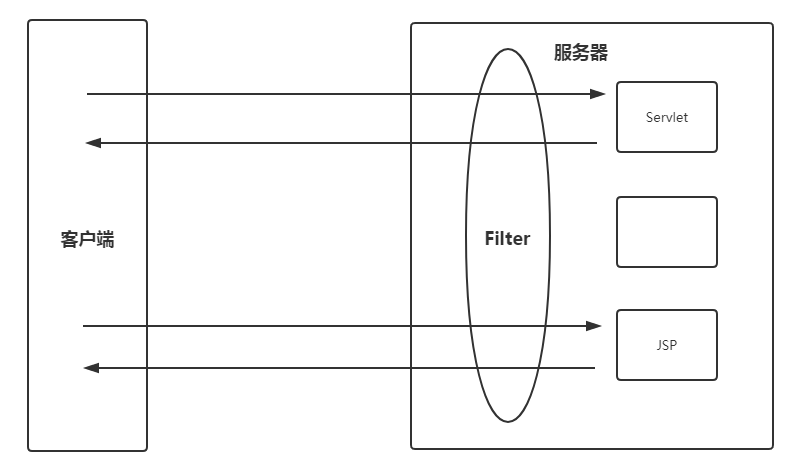

我们可以在过滤器中控制走入到不同的servlet/jsp/请求资源中。

但是在使用了SpringMVC后，**Servlet只有一个了**，也就是**DisptcherServlet**。如果你仍然使用过滤器来完成请求的拦截，就会造成，过滤器会拦截DispatcherServlet所有的请求。那么，如果我们有部分请求不想被拦截，怎么办呢？SpringMVC给出了拦截器来实现单元方法的拦截，拦截器的执行是在DispatcherServlet之后和单元方法之前的，这样我们就可以在单元方法被之前之前对请求进行自定义的拦截处理了。

<span style="color:red;font-weight:bold;">注意：只有URL匹配到了控制单元，拦截器才能生效</span>

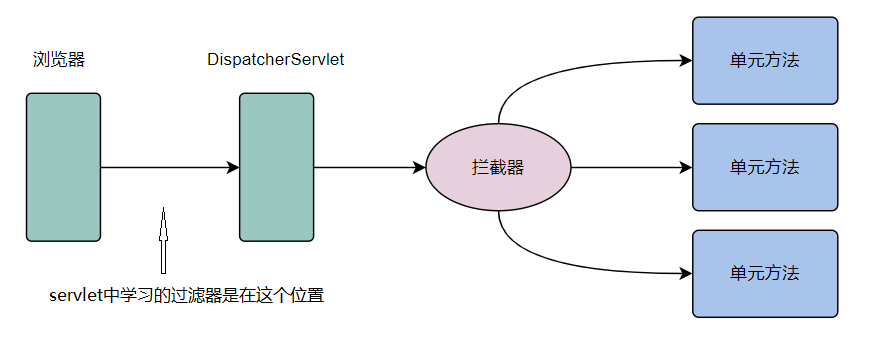

### 拦截器的使用-代码实现

#### 拦截器的定义方式

1.   通过实现HandlerInterceptor接口来定义。

2. 通过实现WebRequestInterceptor接口来定义。

```
public class MyInterceptor implements HandlerInterceptor{}、 ——> 推荐方式
public class MyInterceptor implements WebRequestInterceptor {}、
```

在com.msb.interceptor下创建拦截器：

```java
package com.msb.interceptor;

import jakarta.servlet.http.HttpServletRequest;
import jakarta.servlet.http.HttpServletResponse;
import org.springframework.web.servlet.HandlerInterceptor;
import org.springframework.web.servlet.ModelAndView;

/**
 * @Author: zhaoss
 */
public class MyInterceptor implements HandlerInterceptor {
    /*
    先重写三个方法，先不用考虑三个方法的作用，我们先关注三个方法的执行时机即可
     */
    @Override
    public boolean preHandle(HttpServletRequest request, HttpServletResponse response, Object handler) throws Exception {
        System.out.println("preHandle");
        return false;
    }

    @Override
    public void postHandle(HttpServletRequest request, HttpServletResponse response, Object handler, ModelAndView modelAndView) throws Exception {
        System.out.println("postHandle");
    }

    @Override
    public void afterCompletion(HttpServletRequest request, HttpServletResponse response, Object handler, Exception ex) throws Exception {
        System.out.println("afterCompletion");
    }
}


```

#### 配置拦截器

拦截器是给哪个控制单元加的呢？需要在springmvc中配置拦截器。

```xml
<?xml version="1.0" encoding="UTF-8"?>
<beans xmlns="http://www.springframework.org/schema/beans"
       xmlns:mvc="http://www.springframework.org/schema/mvc"
       xmlns:xsi="http://www.w3.org/2001/XMLSchema-instance"
       xmlns:context="http://www.springframework.org/schema/context"
       xsi:schemaLocation="http://www.springframework.org/schema/beans
		https://www.springframework.org/schema/beans/spring-beans.xsd
        http://www.springframework.org/schema/context
        https://www.springframework.org/schema/context/spring-context.xsd
        http://www.springframework.org/schema/mvc
        https://www.springframework.org/schema/mvc/spring-mvc.xsd">

    <!-- 扫描控制器类，千万不要把service等扫描进来，也千万不要在Spring配置文件扫描控制器类所在包 -->
    <context:component-scan base-package="com.msb.controller"></context:component-scan>
    <!-- 让Spring MVC的注解生效 ：@RequestMapping，这个位置别忘记加入mvc的命名空间-->
    <mvc:annotation-driven></mvc:annotation-driven>
    <!-- 静态资源放行-->
    <mvc:resources mapping="/js/**" location="/js/"></mvc:resources>
    <mvc:resources mapping="/images/**" location="/images/"></mvc:resources>

    <!-- 文件上传时，必须配置文件解析器 -->
    <bean id="multipartResolver" class="org.springframework.web.multipart.support.StandardServletMultipartResolver"></bean>


    <!--配置拦截器-->
    <mvc:interceptors>
        <!--配置具体的拦截器的bean及其拦截范围-->
        <mvc:interceptor>
            <mvc:mapping path="/testmi1" /><!--配置你要拦截的单元方法的访问路径，第一个/表示项目根目录-->
            <bean class="com.msb.interceptor.MyInterceptor"></bean><!--上面路径对应的拦截器是哪个-->
            <!--配置拦截器的bean对象，只在当前mvc:interceptor内有效-->
        </mvc:interceptor>
    </mvc:interceptors>
</beans>
```

#### 编写控制单元

```java
package com.msb.controller;

import jakarta.servlet.annotation.MultipartConfig;
import jakarta.servlet.http.HttpServletRequest;
import org.springframework.stereotype.Controller;
import org.springframework.web.bind.annotation.RequestMapping;
import org.springframework.web.bind.annotation.ResponseBody;
import org.springframework.web.multipart.MultipartFile;

import java.io.File;
import java.io.IOException;
import java.util.HashMap;
import java.util.Map;
import java.util.Random;

/**
 * @Author: zhaoss
 */
@Controller
public class MyController7 {
    @RequestMapping(value="/testmi1")
    public String testmi1() throws IOException { 
        System.out.println("进入控制单元");
        return "/index.jsp";
    }

}

```

#### 测试

启动服务器，访问http://localhost:8080/demo01/testmi1看结果

发现控制单元没有进，所以能感受到拦截器中的preHandle方法是进入控制单元方法之前执行的。

那么如果想要控制单元执行，怎么处理呢？将preHandle中的返回值变为true：

```java
@Override
public boolean preHandle(HttpServletRequest request, HttpServletResponse response, Object handler) throws Exception {
    System.out.println("preHandle");
    return true;//该返回值决定了控制单元是否进入执行
}
```


可以看出上面三个方法都是围绕控制单元执行的。

### 拦截方法介绍

#### preHandle方法

**执行时机：**

进入控制单元方法之前执行。

**作用：**

真正执行拦截的方法，**返回false表示拦截此次请求，返回true表示放行。**

**参数:**

​HttpServletRequest request:此次拦截的请求的request对象

​HttpServletResponse response:此次拦截的请求的response对象

Object handler:HandlerMethod类型，存储了拦截的单元方法的method对象。（拦截的控制单元的方法对应的对象）

**返回值：**

​boolean类型，false表示拦截，true表示放行。

**案例：**

在preHandle方法中加入维护页面，比如你控制单元/testmi1要进行某个功能的升级，升级的时候并不想让其它人访问，如果访问的话可以走维护页面，那么就可以在preHandle方法中进行处理。

先定义维护页面：wh.jsp:

```html
<%--
  Created by IntelliJ IDEA.
  User: zhaoss-msb
  Date: 2023/8/7
  Time: 18:02
  To change this template use File | Settings | File Templates.
--%>
<%@ page contentType="text/html;charset=UTF-8" language="java" %>
<html>
<head>
    <title>Title</title>
</head>
<body>
    系统升级中，请稍后访问
</body>
</html>

```

拦截器：

```java
package com.msb.interceptor;


import jakarta.servlet.http.HttpServletRequest;
import jakarta.servlet.http.HttpServletResponse;
import org.springframework.web.servlet.HandlerInterceptor;
import org.springframework.web.servlet.ModelAndView;

/**
 * @Author: zhaoss
 */
public class MyInterceptor implements HandlerInterceptor {
    /*
    先重写三个方法，先不用考虑三个方法的作用，我们先关注三个方法的执行时机即可
     */
    @Override
    public boolean preHandle(HttpServletRequest request, HttpServletResponse response, Object handler) throws Exception {
        System.out.println("preHandle");
        // 进行页面维护操作，拦截进入到维护页面：
        response.sendRedirect("/demo01/wh.jsp");
        // 进入维护页面，不需要走入单元方法中，返回值定义为false
        return false;
    }
}


```

访问http://localhost:8080/demo01/testmi1


#### postHandle方法


**执行时机:**

​单元方法之后，转发的视图资源之前。

**作用:**

​对单元方法转发的资源进行拦截，可以对model中的数据进行校验等。

**参数:**

​HttpServletRequest request:此次拦截的请求的request对象。

​HttpServletResponse response:此次拦截的请求的response对象。

​Object handler:HandlerMethod类型，存储了拦截的单元方法的method对象。

​ModelAndView: 存储了model和view信息的对象。

**案例：**控制单元跳转到index.jsp页面，并将数据存入request作用域中，然后再index.jsp中显示，但是要防止出现恶意字符，会对恶意敏感字符进行替换为** 。

控制单元：

```java
package com.msb.controller;

import org.springframework.stereotype.Controller;
import org.springframework.web.bind.annotation.RequestMapping;
import java.io.IOException;
import java.util.Map;

/**
 * @Author: zhaoss
 */
@Controller
public class MyController7 {
    @RequestMapping(value="/testmi1")
    public String testmi1(Map map) throws IOException {
        System.out.println("进入控制单元");
        // 模拟数据库中查出来的数据，存入request作用域：
        map.put("msg","TMD");
        return "/index.jsp";
    }

}

```

index.jsp:

```html
<%@ page contentType="text/html;charset=UTF-8" language="java" %>
<html>
<body>
<h2>Hello World!</h2>
</body>
request作用域取值：${requestScope.msg}
</html>

```

拦截器处理：

```java
package com.msb.interceptor;


import jakarta.servlet.http.HttpServletRequest;
import jakarta.servlet.http.HttpServletResponse;
import org.springframework.web.servlet.HandlerInterceptor;
import org.springframework.web.servlet.ModelAndView;

import java.util.Map;

/**
 * @Author: zhaoss
 */
public class MyInterceptor implements HandlerInterceptor {

	@Override
    public boolean preHandle(HttpServletRequest request, HttpServletResponse response, Object handler) throws Exception {
        System.out.println("preHandle");
        return true;
    }
    @Override
    public void postHandle(HttpServletRequest request, HttpServletResponse response, Object handler, ModelAndView modelAndView) throws Exception {
        System.out.println("postHandle");
        // ModelAndView就是底层执行转发重定向的对象
        // getModel返回的Map集合就是我们在控制单元中使用的那个：
        Map<String, Object> map = modelAndView.getModel();
        // 获取集合中存储信息：
        String msg = (String)map.get("msg");
        // 对敏感词汇进行过滤：
        if (msg.contains("MD")){
            // 替换敏感字符为*
            String s = msg.replaceAll("MD", "**");
            map.put("msg",s);
        }
    }
}
```


#### afterCompletion方法

**作用:**

​		对整个拦截流程中的异常信息进行捕捉处理。

​		进行一些扫尾工作：如资源的关闭、垃圾的回收等。

**执行时机:**

​处理完视图和模型数据，**渲染视图完毕**之后执行。

**参数:**

​HttpServletRequest request:此次拦截的请求的request对象。

​HttpServletResponse response:此次拦截的请求的response对象。

​Object handler:HandlerMethod类型，存储了拦截的单元方法的method对象。

​Exception：存储异常信息的对象，如果没有异常信息则默认为null。

**案例：**把异常信息打印一下：

控制单元中制造一个异常：

```java
package com.msb.controller;

import org.springframework.stereotype.Controller;
import org.springframework.web.bind.annotation.RequestMapping;
import java.io.IOException;
import java.util.Map;

/**
 * @Author: zhaoss
 */
@Controller
public class MyController7 {
    @RequestMapping(value="/testmi1")
    public String testmi1(Map map){
        int a = 1/0; // 制造异常
        return "/index.jsp";
    }

}

```

拦截器处理：输出异常：

```java
package com.msb.interceptor;


import jakarta.servlet.http.HttpServletRequest;
import jakarta.servlet.http.HttpServletResponse;
import org.springframework.web.servlet.HandlerInterceptor;
import org.springframework.web.servlet.ModelAndView;

import java.util.Map;

/**
 * @Author: zhaoss
 */
public class MyInterceptor implements HandlerInterceptor {
    @Override
    public void afterCompletion(HttpServletRequest request, HttpServletResponse response, Object handler, Exception ex) throws Exception {
        System.out.println("afterCompletion");
        System.out.println(ex); // 输出异常
    }
}
```

### 拦截器配置说明

之前的拦截器配置为：

```xml
    <!--配置拦截器-->
    <mvc:interceptors>
        <!--配置具体的拦截器的bean及其拦截范围-->
        <mvc:interceptor>
            <mvc:mapping path="/testmi1" /><!--配置你要拦截的单元方法的访问路径，第一个/表示项目根目录-->
            <bean class="com.msb.interceptor.MyInterceptor"></bean><!--上面路径对应的拦截器是哪个-->
            <!--配置拦截器的bean对象，只在当前mvc:interceptor内有效-->
        </mvc:interceptor>
    </mvc:interceptors>
```

如果，控制单元都想都这个拦截器，那么可以配置为：

```xml
	<!--配置拦截器-->    
	<mvc:interceptors>
        <mvc:interceptor>
            <mvc:mapping path="/*" />
            <bean class="com.msb.interceptor.MyInterceptor"></bean>
        </mvc:interceptor>
    </mvc:interceptors>
```

也可以修改为如下，将拦截器变为全局拦截器：

```xml
    <mvc:interceptors>
        <bean class="com.msb.interceptor.MyInterceptor"></bean>
    </mvc:interceptors>
```

### 多个拦截器执行顺序

多个拦截器同时存在时，执行的顺序由配置顺序决定，先配置谁，谁就先执行。


控制单元：

```java
@Controller
public class MyController8 {
    @RequestMapping(value="/testmi2")
    public String testmi2() throws IOException {
        System.out.println("进入控制单元testmi2");
        return "/index.jsp";
    }
}

```

拦截器1：

```java
package com.msb.interceptor;


import jakarta.servlet.http.HttpServletRequest;
import jakarta.servlet.http.HttpServletResponse;
import org.springframework.web.servlet.HandlerInterceptor;
import org.springframework.web.servlet.ModelAndView;

import java.util.Map;

/**
 * @Author: zhaoss
 */
public class MyInterceptor1 implements HandlerInterceptor {
    /*
    先重写三个方法，先不用考虑三个方法的作用，我们先关注三个方法的执行时机即可
     */
    @Override
    public boolean preHandle(HttpServletRequest request, HttpServletResponse response, Object handler) throws Exception {
        System.out.println("preHandle1");
        return true;
    }

    @Override
    public void postHandle(HttpServletRequest request, HttpServletResponse response, Object handler, ModelAndView modelAndView) throws Exception {
        System.out.println("postHandle1");
    }

    @Override
    public void afterCompletion(HttpServletRequest request, HttpServletResponse response, Object handler, Exception ex) throws Exception {
        System.out.println("afterCompletion1");
    }
}


```


拦截器2：

```java
package com.msb.interceptor;


import jakarta.servlet.http.HttpServletRequest;
import jakarta.servlet.http.HttpServletResponse;
import org.springframework.web.servlet.HandlerInterceptor;
import org.springframework.web.servlet.ModelAndView;

/**
 * @Author: zhaoss
 */
public class MyInterceptor2 implements HandlerInterceptor {
    /*
    先重写三个方法，先不用考虑三个方法的作用，我们先关注三个方法的执行时机即可
     */
    @Override
    public boolean preHandle(HttpServletRequest request, HttpServletResponse response, Object handler) throws Exception {
        System.out.println("preHandle2");
        return true;
    }

    @Override
    public void postHandle(HttpServletRequest request, HttpServletResponse response, Object handler, ModelAndView modelAndView) throws Exception {
        System.out.println("postHandle2");
    }

    @Override
    public void afterCompletion(HttpServletRequest request, HttpServletResponse response, Object handler, Exception ex) throws Exception {
        System.out.println("afterCompletion2");
    }
}


```

配置拦截器：（springmvc.xml中）

```xml
    <mvc:interceptors>
        <mvc:interceptor>
            <mvc:mapping path="/testmi2" /> 
            <bean class="com.msb.interceptor.MyInterceptor1"></bean> 
        </mvc:interceptor>
        <mvc:interceptor>
            <mvc:mapping path="/testmi2" />
            <bean class="com.msb.interceptor.MyInterceptor2"></bean>
        </mvc:interceptor>
    </mvc:interceptors>
```

运行http://localhost:8080/demo01/testmi2访问：

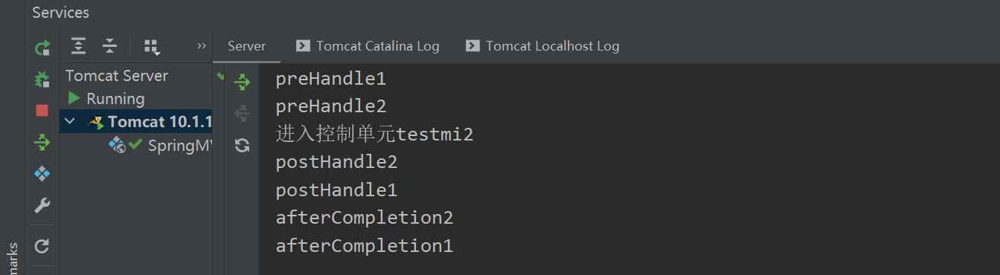

为了便于理解结果可以想象为如下：

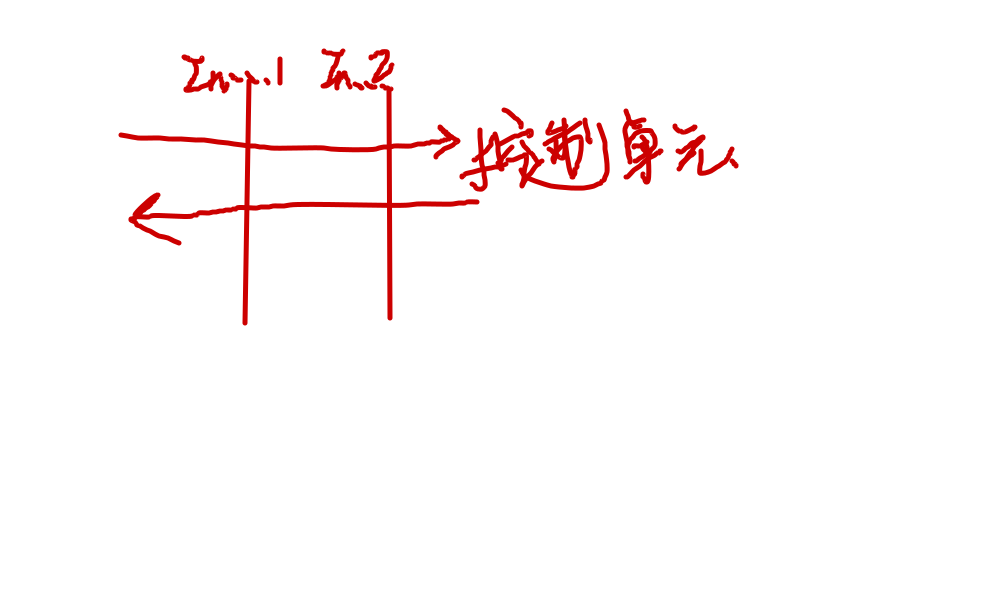

## Spring MVC异常处理

### 介绍

在Spring MVC支持异常处理，不会呈现给用户异常界面，而是当出现异常时交给某个特定的控制器。

如：一个上线的项目，呈现了500界面，会非常影响用户体验度。同时也显示公司实力有问题、不专业。

控制单元：

```java
/**
 * @Author: zhaoss
 */
@Controller
public class MyController9 {
    @RequestMapping(value="/testexcep")
    public String testexcep() throws IOException {
        System.out.println("进入控制单元testexcep");
        int num = 10 / 0;
        return "/index.jsp";
    }
}

```

访问 发现报错


### 解决方式1：局部配置（基于注解）

出现异常以后，不让用户看到异常错误界面，而是跳转到某个指定的界面。实现:

控制单元：

```java
package com.msb.controller;

import org.springframework.stereotype.Controller;
import org.springframework.web.bind.annotation.ExceptionHandler;
import org.springframework.web.bind.annotation.RequestMapping;

import java.io.IOException;

/**
 * @Author: zhaoss
 */
@Controller
public class MyController9 {
    @RequestMapping(value="/testexcep")
    public String testexcep() throws IOException {
        System.out.println("进入控制单元testexcep");
        int num = 10 / 0;
        return "/index.jsp";
    }


    // 加入下面方法（异常处理器），如果出现该异常，就走入error.jsp页面
    @ExceptionHandler(value = {ArithmeticException.class, NullPointerException.class})
    public String myexception(){
        return "redirect:/error.jsp";
    }
}

```

error.jsp:

```html
<%--
  Created by IntelliJ IDEA.
  User: zhaoss-msb
  Date: 2023/8/7
  Time: 19:35
  To change this template use File | Settings | File Templates.
--%>
<%@ page contentType="text/html;charset=UTF-8" language="java" %>
<html>
<head>
    <title>Title</title>
</head>
<body>
页面出现错误，请联系管理员。
</body>
</html>

```

访问http://localhost:8080/demo01/testexcep：

结果：


上面的方式，配置在控制器类中，只有当前这个控制器类的控制单元出现异常时才能执行，其他类的控制单元出现异常不能执行。

每个控制器类中可以有多个处理异常的方法，每个方法上面只需要有@ExceptionHandler，千万别添加了@RequestMapping注解。


### 解决方式2：全局配置 -使用@ControllerAdvice注解方式（基于注解）

全局配置方式，对所有控制单元的所有方法都生效。

```java
package com.msb.controller;

import org.springframework.web.bind.annotation.ControllerAdvice;
import org.springframework.web.bind.annotation.ExceptionHandler;

/**
 * @Author: zhaoss
 */
@ControllerAdvice
public class MyExceptionController {
    @ExceptionHandler(value = ArithmeticException.class)
    public String myexception(){
        return "/error.jsp";
    }
}
```


因为@ControllerAdvice已经继承了@Component注解，所以类上只添加这个注解就可以了。

不需要在添加@Controller注解了。

控制单元：

```java
package com.msb.controller;

import org.springframework.stereotype.Controller;
import org.springframework.web.bind.annotation.ExceptionHandler;
import org.springframework.web.bind.annotation.RequestMapping;

import java.io.IOException;

/**
 * @Author: zhaoss
 */
@Controller
public class MyController9 {
    @RequestMapping(value="/testexcep")
    public String testexcep() throws IOException {
        System.out.println("进入控制单元testexcep");
        int num = 10 / 0;
        return "/index.jsp";
    }

}

```


访问发现已经跳转到error


小提示：

如果配置了局部异常处理器和全局异常处理器，优先匹配局部异常处理器。


### 解决方式3：全局配置-使用配置文件配置 （基于配置文件）

在Spring MVC中包含HandlerExceptionResolver组件，专门负责处理异常的，接口中只包含一个resolveException方法。

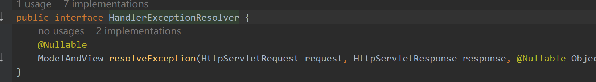

程序员可以自行对接口实现，也可以使用Spring MVC提供的实现。


其中最简单好用的就是SimpleMappingExceptionResolver，里面有个全局属性exceptionMappings,表示当出现了什么类型异常时跳转到指定的页面。

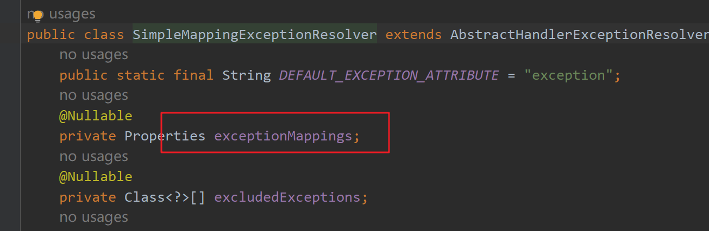

想要在异常出现时跳转到指定页面，只需要在springmvc.xml文件中添加异常解析器即可。（配置文件优先级低于注解的方式）

下面的配置表示当出现空指针异常时跳转到/error1.jsp，算术异常都跳转到/error2.jsp

```xml
<bean class="org.springframework.web.servlet.handler.SimpleMappingExceptionResolver">
        <property name="exceptionMappings">
            <props>
                <prop key="java.lang.NullPointerException">/error1.jsp</prop>
                <prop key="java.lang.ArithmeticException">/error2.jsp</prop>
            </props>
        </property>
    </bean>
```

控制单元：

```java
package com.msb.controller;

import org.springframework.stereotype.Controller;
import org.springframework.web.bind.annotation.ExceptionHandler;
import org.springframework.web.bind.annotation.RequestMapping;

import java.io.IOException;

/**
 * @Author: zhaoss
 */
@Controller
public class MyController9 {
    @RequestMapping(value="/testexcep")
    public String testexcep() throws IOException {
        System.out.println("进入控制单元testexcep");
        int num = 10 / 0;
        return "/index.jsp";
    }
}

```

### 解决方式4：根据状态码跳转到指定页面

在Spring MVC框架中没有提供根据状态码跳转到特定的视图。想要实现根据状态码跳转到指定页面可以使用Java EE中提供的实现方案，在web.xml中配置，这种方案不需要依赖任何框架。

```xml
 <error-page>
    <error-code>500</error-code>
    <location>/error.jsp</location>
  </error-page>
  <error-page>
    <error-code>404</error-code>
    <location>/index.jsp</location>
  </error-page>
```

## 国际化支持

i18n是internationalization（国际化）的缩写。因为单词比较长，取首字母i和末字母n，中间还有18个字母，所以叫做i18n。

国际化主要是让同一个项目，在不做任何修改的情况下，在不同语言环境中显示不同语言文字。

页面，在中文环境下显示中文，在英文环境下显示英文：


Spring MVC的国际化底层是通过LocaleResolver区域解析器来解析用户所在区域。根据区域判断使用哪种语言。

LocaleResolver所有实现类都在org.springframework.web.servlet.i18n包中。


里面有四个能用的实现类

（1）AcceptHeaderLocaleResolver：根据请求头判断时区

（2）SessionLocaleResolver：根据Session判断时区

（3）CookieLocaleResolver：根据Cookie判断时区

（4）FixedLocaleResolver：固定时区

这些实现类都能实现国际化效果，主要区别是实现方式不相同。因为AcceptHeaderLocaleResolver是默认的LocaleResolver，且适用面比较广。所以使用AcceptHeaderLocaleResolver给同学们讲解国际化的实现

### AcceptLanguageLocaleResolver实现国际化

#### AcceptLanguageLocaleResolver实现原理介绍

AcceptLanguageLocaleResolver是根据请求头的Accept-Language进行判断使用哪种语言进行显示。

在Accept-Language中可以有多个可接受的语言，具体需要看自己的浏览器设置。以谷歌浏览器举例：

点击谷歌浏览器右上角三个点 - > 点击设置


在设置页面中分别点击高级 -> 语言 -> 语言 -> 添加语言 可以添加一个新的语言。


在默认情况下可以看到，谷歌浏览器有中文(简体)、中文，所以请求头的Accept-Language里面只有zh-CN(中文的缩写),zh。

在添加页面中添加一个英语（美国）后，请求头的Accept-Language里面: en-US,en;q=0.9,zh-CN;q=0.8,zh;q=0.7

这些语言有着严格的顺序要求，可以点击语言右侧的三个点让语言上移或下移。谁在上面，表示谁的优先级更高。

如果希望浏览器变成英文浏览器可以点击语言右侧的三个点，然后选中以这种该语言显示Google Chrome。这样做了之后，当前界面和设置中的文字都变成了设置的语言。


#### 代码实现步骤

##### 新建配置文件

在src/main/resources中新建属性文件。属性文件语法：`任意名_语言_国家.properties`。例如：中文是zh、英文是en。如果为了更加精确是哪国使用的这个语言，可以在后面添加国家，因为美式英语和英式英语是不一样的。中国：CN、美国是US，国家缩写都是大写的。

新建`suiyi_zh_CN.properties`

```properties
msb.username=用户名
msb.password=密码
msb.submit=登录
```

新建`suiyi_en_US.properties`

```properties
msb.username=username
msb.password=password
msb.submit=login
```

文件中key是自定义的，msb.username这就是key，随意起。但是value要和语言对应。所以在suiyi_en_US.properties的msb.username的value值是英文的，在suiyi_zh_CN.properties中msb.username的值是中文的。

同时要保证不同的properties文件的key是相同的。因为Spring MVC会根据语言环境自动获取不同文件中指定名称（key）对应的值。

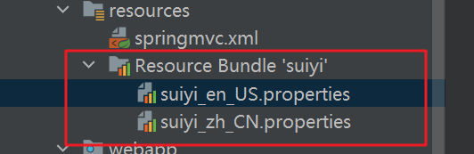


##### 添加配置

在springmvc.xml中添加额外配置。因为属性文件名称是随意起的，所以需要明确告诉Spring MVC国际化资源文件名称。只需要写名称不需要写后面的语言和国家缩写。

AcceptHeaderLocaleResolver是默认的LocaleResolver可以不配置，id属性可以省略也可以换成其他名称。

ResourceBundleMessageSource的id属性不能省略，且必须叫做messageSource。换名或省略id都会导致properties无法被加载。

```xml
    <!-- 加载属性文件 -->
    <bean id="messageSource" class="org.springframework.context.support.ResourceBundleMessageSource">
        <property name="basename" value="suiyi"></property>   <!-- 需要明确告诉Spring MVC国际化资源文件名称 -->
    </bean>
    <!-- 默认也是AcceptHeaderLocaleResolver，所以可以不配置-->
    <bean id="localeResovler" class="org.springframework.web.servlet.i18n.AcceptHeaderLocaleResolver"></bean>
```

##### 新建控制单元

新建控制单元方法。该方法负责显示页面。

想让国际化生效，必须保证使用了Spring MVC框架。具体效果：必须先走控制器，转发到页面。直接访问JSP页面国际化无效。因为直接访问JSP文件是不通过Spring MVC的，而国际化是Spring MVC这里提供的功能。

```java
package com.msb.controller;

import org.springframework.stereotype.Controller;
import org.springframework.web.bind.annotation.RequestMapping;

import java.io.IOException;

/**
 * @Author: zhaoss
 */
@Controller
public class MyController10 {
    @RequestMapping("/showForm")
    public String showForm(){
        return "/login.jsp";
    }
}

```

##### 新建页面

在webapp目录下新建login.jsp.

此处需要注意：

（1）在上面使用taglib执行引入标签库

（2）`<spring:message code="属性文件的key"></spring:message>`根据语言环境负责加载属性文件中key的值。中文环境就加载suiyi_zh_CN.properties文件内容，英文环境就加载suiyi_en_US.properties文件内容

```html
<%--
  Created by IntelliJ IDEA.
  User: zhaoss-msb
  Date: 2023/8/7
  Time: 20:22
  To change this template use File | Settings | File Templates.
--%>
<%@ page contentType="text/html;charset=UTF-8" language="java" %>
<%@ taglib prefix="spring" uri="http://www.springframework.org/tags" %>
<html>
<head>
    <title>Title</title>
</head>
<body>
<form action="" method="post">
    <spring:message code="msb.username"></spring:message> <input type="text" name="username"/><br/>
    <spring:message code="msb.password"></spring:message> <input type="text" name="password"/><br/>
    <input type="submit" value="<spring:message code="msb.submit"></spring:message>"/>
</form>
</body>
</html>

```

#### 测试

**如果浏览器是英文环境：**


**如果浏览器是中文环境：**

在浏览器地址栏输入http://localhost:8080/demo01/showForm


会发现文字不能正常显示，为乱码状态，需要设置properties文件编码：


设置完编码后会发现suiyi_zh_CN.properties文件里面内容变成了乱码，需要重新填写一下value值。

```
msb.username=用户名
msb.password=密码
msb.submit=登录
```

修改后重启项目发现正常
