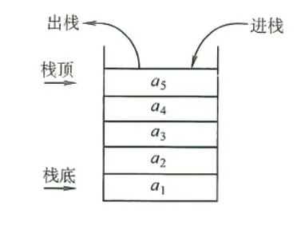
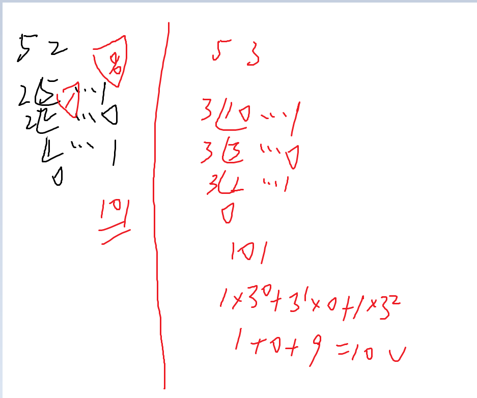

## 小点

### goto 语句

```c++
#include<bits/stdc++.h>
using namespace std;
int main()
{   
    temp:
        cout<<"4";
    goto temp;
    return 0;
}
```

### 数组有关

```c++
arr[5] 

0 1 2 3 4

arr[2][5]

0 1 2 3 4 5

0 1 2 3 4 5
```

可以理解为

第一个是行,如果是单独的就默为1

第二个是列

### 按位与或非

& 按位AND
| 按位OR
^ 按位异或

```c
int a=4;
int b=3;
//100
//011
//111 异或
int c=a^b;
```

## 


### 指针


```c

#include<bits/stdc++.h>
using namespace std;
int main(){
	char s[111];
	scanf("%s",s);
	printf("%s",s);
	return 0;
}


#include<bits/stdc++.h>
using namespace std;
int main(){
	int num_1=5;
	int *pti_1;
	pti_1=&num_1;
	printf("%d",*pti_1);
	return 0;
}


//字符串
#include<bits/stdc++.h>
using namespace std;
int main(){
	char s0[]={'1','2','h','m'};
	char s1[]={'1','2','h','m','\0'};
	char s2[]="s01,hello";
	
	printf("%s\n",s0);
	printf("%s\n",s1); //字符串要标记结尾
	printf("%s\n",s2); 
	printf("%p\n",s2); //字符串首地址
	
	return 0;
}


#include<bits/stdc++.h>
int main(){
	char *keywords[]={"main","int","if"};
	int Numkeywords=sizeof(keywords)/sizeof(keywords[0]);
	for(int i=0;i<Numkeywords;i++){
		printf("%s\n",keywords[i]);
	}
	return 0;
}

/*
  
  指针也分类型，指向char类型的，指向int类型的等等
  scanf的时候有的需要&，为什么数组不需要？ 因为char给出的就是地址
  arr[i]和*(arr+1)等价
  
 */


//解引用指针： *号还可以用于解引用指针，访问指针指向的内存中的值。
#include<bits/stdc++.h>
int main(){
	int *a;
	int b=10;
	*a=b;
	printf("%d\n",b);
}


#include<bits/stdc++.h>
using namespace std;
void test01(int a){
	a++;
	printf("函数内%d\n",a);
}
void test02(int &a){ //c++中的引用，不推荐使用，不然太乱了
	a++;
	printf("函数内%d\n",a);
}
void test03(int* a){
	printf("%p\n",a);
}
int main(){
	int a; 
	a=10;
	printf("函数前%d\n",a);
	test01(a);
	printf("函数后%d\n",a);
	printf("\n");
	
	a=10;
	printf("函数前%d\n",a);
	test02(a);
	printf("函数后%d\n",a);
	printf("\n");
	
	test03(&a);
	printf("\n");
	
	return 0;
}

/*
  
  因为函数中如果地址
  
 */
```
```c
#include <stdio.h>
 //用指针对指针指向的值比较
const int MAX = 3;
 
int main ()
{
   int  var[] = {10, 100, 200};
   int  i, *ptr;
 
   /* 指针中第一个元素的地址 */
   ptr = var;
   i = 0;
   while ( ptr <= &var[MAX - 1] )
   {
 
      printf("存储地址：var[%d] = %p\n", i, ptr );
      printf("存储值：var[%d] = %d\n", i, *ptr );
 
      /* 指向上一个位置 */
      ptr++;
      i++;
   }
   return 0;
}
```
```c
// 函数用于检查字符是否为数字
int isNum(char c) {
	return (c >= '0' && c <= '9');
}

// 函数用于检查字符是否为字母或数字
int isAbcorNum(char &c) {
	return ((c >= 'A' && c <= 'Z') || (c >= 'a' && c <= 'z') || (c >= '0' && c <= '9'));
}
int isAbcorNum(char *c) {
	return ((c >= 'A' && c <= 'Z') || (c >= 'a' && c <= 'z') || (c >= '0' && c <= '9'));
}
// 函数用于检查字符串是否为关键字
int isKeyword(char *word) {
	char *keywords[] = {"int", "main", "if", "while", "for", "else"};
	int numKeywords = sizeof(keywords) / sizeof(keywords[0]);
	for (int i = 0; i < numKeywords; i++) {
		if (strcmp(word, keywords[i]) == 0)
			return 1;
	}
	return 0;
}
第三个错误,其他的都正确

简单一点, 就是默认的可以进行基本类型的传入
加上&可以改变原本的值
如果是字符出类型的话,加上*可以调用内存地址,并且改变原来的值
```c
// 函数用于检查字符是否为数字
int isNum(char c) {
	return (c >= '0' && c <= '9');
}

// 函数用于检查字符是否为字母或数字
int isAbcorNum(char &c) {
	return ((c >= 'A' && c <= 'Z') || (c >= 'a' && c <= 'z') || (c >= '0' && c <= '9'));
}
int isAbcorNum(char *c) {
	return ((c >= 'A' && c <= 'Z') || (c >= 'a' && c <= 'z') || (c >= '0' && c <= '9'));
}
// 函数用于检查字符串是否为关键字
int isKeyword(char *word) {
	char *keywords[] = {"int", "main", "if", "while", "for", "else"};
	int numKeywords = sizeof(keywords) / sizeof(keywords[0]);
	for (int i = 0; i < numKeywords; i++) {
		if (strcmp(word, keywords[i]) == 0)
			return 1;
	}
	return 0;
}
第三个错误,其他的都正确

简单一点, 就是默认的可以进行基本类型的传入
加上&可以改变原本的值
如果是字符出类型的话,加上*可以调用内存地址,并且改变原来的值


### char和int的大小问题

char
通常是1 个字节 (1字节8bit)（8 bit,2^8）, 这是一个整数类型。

int
整型，4 个字节( 4个字节32bit )，取值范围 -2147483648 到 2147483647.( 2^32)

大概十位

long long  8 个字节 


如何得来的?? char能代表的最大数是多少?

```python
math.pow(2,8)
256 为char 的最大整数值 
a=math.pow(2,8)
```


### .和->

.用于实体
->用于指针

复习中遇到的有疑惑的问题

    1 大写转小写
    2 a=getchar() putchar()
    3 e^x log 等函数的使用
    4     abs(int)
    fabs(double)
    sin(double) cos tan
    exp(double) e^x
    pow(double,double)
    sqrt(double) 开方
    lnx  log(double)
    logx  log10(x)
    5 %e
    6 switch
    7 闰年


### pta解题步骤

题目
思路
全部情况(要考虑全面) 作图
知识点 所需要的(......)
代码


## 常常遇到的基础错误

### n,m颠倒导致错误

初始化结构体的一种方式

```c++
#include<stdio.h>
#define N 6
#define MAXSIZE 100
typedef struct{
    int cur;
    char data[N];
} SLinkList[MAXSIZE];
int main(){
    SLinkList s={{1," "},{2,"zhao"},{3,"liu"},{4,"wang"},{5,"song"}}; //!
    int i=0;
    do{
        printf("%s   ",s[i].data);
        i=s[i].cur;
    }while(i);
    return 0;
}
```

### int和数据大小的bug

由于数据量较大，不推荐直接使用 cin, cout 输入输出。

另外，请确保最终结果是直接输出整个字符串，而非使用 printf("%c") 或 putchar() 等函数一个一个地输出字符，否则可能导致超时。

### 慎用反逻辑

`if(a[i]==' '||a[i]=='\0')`
等价于
`if(a[i]!='' &&a[i]!='\0')`

### == =

### 忘记 & 取地址符

### main mian


## 代码

### 处理末尾空格

```c++
方法一

int i;
for (i = 0; i < n-1 ; i++)
　　printf("%d ", a[i]);
printf("%d", a[i]);


方法二


int flag=1;
    for(int i=0;i<n;i++)
    {
        if(flag)
        {
            printf("%d",a[i]);
            flag=0;
        }
        else printf(" %d",a[i]);
    }
```

### 顺序表插入

从后往前插

```c++
#include<bits/stdc+++.h>
using namespace std;

int a[1111];
int main(){

    int n;
    cin>>n;

    for(int i=0;i<n;i++){
        int x;
        cin>>x;
        a[i]=x;
    }

    int x;
    cin>>x;
    a[n]=x;
    n++;

    //最末尾少一个 
    for(int i=n-1;i>0;i--){
        if(a[i-1]>a[i]){
            int t;
            t=a[i];
            a[i]=a[i-1];
            a[i-1]=t;
        }
    }

    for(int i=0;i<n;i++){
        cout<<a[i]<<",";
    }
    return 0;
}
```

### 数组写链表 应付考试版本

垃圾-数组写链表-应付考试
有序链表的归并
输入样例:
6 5
1 23 26 45 66 99
14 21 28 50 100
输出样例:
1 14 21 23 26 28 45 50 66 99 100

//合并+快排

```c
#include<stdio.h>
void f(int a[], int l, int r)
{
   int x=a[l],i=l,j=r;
   if(i>=j) return;
   while(i<j)
   {
     while(i<j&&a[j]>=x)j--;
     a[i]=a[j];
     while(i<j&&a[i]<=x)i++;
     a[j]=a[i];
   }
   a[i]=x;
   f(a,l,i-1);
   f(a,i+1,r);
}
int main()
{
    int m,n,a[200002],i,j,t;
    scanf("%d %d",&m,&n);
    for(i=0;i<m;i++)
    {
        scanf("%d",&a[i]);
    }
    for(i=m;i<n+m;i++)
    {
        scanf("%d",&a[i]);
    }
    f(a,0,n+m-1);
    for(i=0;i<n+m;i++)
    {
        if(i==n+m-1)
        printf("%d",a[i]);
        else printf("%d ",a[i]);
    }
    return 0;
}
```

约瑟夫

```c
#include<stdio.h>
int f(int n,int m)
{
    if(n==1) return 1;
    else return (f(n-1,m)+m-1)%n+1;
}
int main()
{
    int n,m;
    scanf("%d %d",&n,&m);
    printf("%d",f(n,m));
    return 0;
 }
```

双向链表
学会了单向链表，我们又多了一种解决问题的能力，单链表利用一个指针就能在内存中找到下一个位置，这是一个不会轻易断裂的链。但单链表有一个弱点——不能回指。比如在链表中有两个节点A,B，他们的关系是B是A的后继，A指向了B，便能轻易经A找到B,但从B却不能找到A。一个简单的想法便能轻易解决这个问题——建立双向链表。在双向链表中，A有一个指针指向了节点B，同时，B又有一个指向A的指针。这样不仅能从链表头节点的位置遍历整个链表所有节点，也能从链表尾节点开始遍历所有节点。对于给定的一列数据，按照给定的顺序建立双向链表，按照关键字找到相应节点，输出此节点的前驱节点关键字及后继节点关键字。

输入格式:
第一行两个正整数n（代表节点个数），m（代表要找的关键字的个数）。第二行是n个数（n个数没有重复），利用这n个数建立双向链表。接下来有m个关键字，每个占一行。(1<=n<=50)

输出格式:
对给定的每个关键字，输出此关键字前驱节点关键字和后继节点关键字。如果给定的关键字没有前驱或者后继，则不输出。

注意：每个给定关键字的输出占一行。
一行输出的数据之间有一个空格，行首、行末无空格。

输入样例:
10 3
1 2 3 4 5 6 7 8 9 0
3
5
0
输出样例:
2 4
4 6
9

```c
#include<stdio.h>
int main()
{
    int n,m,a[51],i,j;
    scanf("%d %d",&n,&m);
    for(i=1;i<=n;i++)
    {
        scanf("%d",&a[i]);
    }
    while(m--)
    {
        int x;
        scanf("%d",&x);
        for(i=1;i<=n;i++)
        {
            if(x==a[i])
            {
              if(i==1) printf("%d\n",a[i+1]);
              if(i==n) printf("%d\n",a[i-1]);
              if(i!=1&&i!=n) printf("%d %d\n",a[i-1],a[i+1]);
            }
        }
    }
    return 0;
}
```

### 共用体练习OJ

```c++
#include <stdio.h>
#include <stdlib.h>
#include <math.h>
#include <string.h>
union
{
    char c[18];
    double b;
    int a;
}u[100001];
int main()
{
    int n,m,i,t;
    char s[100001][10];
    scanf("%d %d",&n,&m);
    for(i=0;i<n;i++)
    {
        scanf("%s",s[i]);//不能使用gets(),因为那样会把一行当成一个字符串。
        if(strcmp(s[i],"INT")==0)//区别在这里
            scanf("%d",&u[i].a);
        else if(strcmp(s[i],"DOUBLE")==0)
            scanf("%lf",&u[i].b);
        else if(strcmp(s[i],"STRING")==0)
            scanf("%s",u[i].c);

    }
    while(m--)
    {
        scanf("%d",&t);
        if(strcmp(s[t],"DOUBLE")==0)
            printf("%.2lf\n",u[t].b);
        else if(strcmp(s[t],"INT")==0)
           printf("%d\n",u[t].a);
        else if(strcmp(s[t],"STRING")==0)
           printf("%s\n",u[t].c);
    }
    return 0;
}
```

### 对三个数排序

```
#include <bits/stdc++.h>
using namespace std;
int main()
{
    int a, b, c, t;
    cin>>a>>b>>c;
    if (a > b) {
        t = a;
        a = b;
        b = t;
    }
    if (a > c) {
        t = a;
        a = c;
        c = t;
    }
    if (b > c) {
        t = b;
        b = c;
        c = t;
    }
    cout<<a<<b<<c;
    return 0;
}
```

### 马拦过河卒

棋盘上A点有一个过河卒，需要走到目标B点。卒行走的规则：可以向下、或者向右。同时在棋盘上C点有一个对方的马，该马所在的点和所有跳跃一步可达的点称为对方马的控制点。因此称之为“马拦过河卒”。
棋盘用坐标表示，A点（0，0）、B点（n，m）（n，m为不超过15的整数），同样马的位置坐标是需要给出的。现在要求你计算出卒从A点能够到达B点的路径的条数，假设马的位置是固定不动的，并不是卒走一步马走一步。

输入格式:
一行四个数据，用空格分隔，分别表示B点的坐标和马的坐标。

输出格式:
一个数据，表示所有的路径条数。

输入样例:
6 6 3 3

输出样例:
6

tips: 可以输出动态规划的表格来看一下
由自己模拟的图像和 题意中 制定了00 和mn 可以知道,所需的要多一个(非m-1,n-1个,需要0-m,0-n)
//ac

```c++
#include<stdio.h>
#include<stdlib.h>
int horseRoute[25][25],soldierRoute[25][25];
// 输入6 6 3 3 输出6   总大小 马的位置
void horse(int x,int y)
{
    horseRoute[x][y]=1;
    horseRoute[x-1][y+2]=1;
    horseRoute[x-2][y+1]=1;
    horseRoute[x-2][y-1]=1;
    horseRoute[x-1][y-2]=1;
    horseRoute[x+1][y-2]=1;
    horseRoute[x+2][y-1]=1;
    horseRoute[x+2][y+1]=1;
    horseRoute[x+1][y+2]=1;
}
int main()
{
    int bx,by,horseX,horseY;
    scanf("%d %d %d %d",&bx,&by,&horseX,&horseY);
    // bx=6;by=6;horseX=3,horseY=3;
    horse(horseX,horseY);

    soldierRoute[0][0]=1;

    for(int i=0;i<=bx;i++)
    for(int j=0;j<=by;j++)
    if(horseRoute[i][j]!=1&&soldierRoute[i][j]==0)  //到达不了 还没走到
        soldierRoute[i][j]=soldierRoute[i-1][j]+soldierRoute[i][j-1];

    // for(int i=0;i<bx;i++)
    // {
    //     for(int j=0;j<by;j++)
    //     printf("%d",soldierRoute[i+1][j+1]);
    //     printf("\n");
    // }

    printf("%d\n",soldierRoute[bx][by]);
    return 0;
}
```

### abs函数 gcd lcm 函数 一些函数

abs函数，求绝对值

gcd函数，求最大公约数

lcm函数，最小公倍数

### 最大公约数

```c++
int gcd(int a,int b)
{
    if(a<b) swap(a,b);
    for(int i=b;i>=1;i--)
    {
        if(a%i==0&&b%i==0)
        return i;
    }
}
```

### c++log函数 c++对数函数

c++log函数

 exp() //e^n
 log(x) //以e为底x的对数
若自l定义底数

lognm=log(n)/log(m)
对应的题目：H - Eyad and Math

you need compare a^b and c^d which is much or less

左右同取以为底的对数

得到下式（次方前移）

if(b*log(a)<d*log(c))

### 导弹拦截问题

导弹拦截问题的读入

while(scanf("%d",a)!=EOF);

一发最多拦截几个

最长递减子序列

```c++
 #include <bits/stdc++.h>
 using namespace std;
 ​
 int datas[1111];
 int results[1111]; // dp[]
 int main()
 {
     int n;
     int max_len = 0;
     cin >> n;
     for (int i = 0; i < n; i++)c
     {
         cin >> datas[i];
         results[i] = 1;
     }
     for (int i = 0; i < n; i++)
     {
         for (int j = 0; j < i; j++)
         {
             if (datas[j] >= datas[i]) //前提，前边的数据要小于当前的数据
             {
                 results[i] = max(results[j] + 1, results[i]);
             }
             max_len = max(max_len, results[i]);
         }
     }
     cout << max_len;
     return 0;
 }
 // 132
```

拦截需要多少个

复制代码

```c++
#include<bits/stdc++.h>
using namespace std;
int n,i,k,x,p,j,a[1111],l[1111];
int main()
{
​
    while(scanf("%d",&x)==EOF) a[++n]=x;
    k=1;
    l[1]=a[1];
​
    for(i=2; i<=n; i++)
    {
        p=0;
        for(j=1; j<=k; j++)
            if(l[j]>=a[i])
                if(p==0) p=j;
                else if(l[j]<l[p]) p=j;
    }
    if(p==0) l[++k]=a[i];
    else l[p]=a[i];
    int t=0;
    cout<<k;
    return 0;
}
```

### 双指针 代码随想录 删除数组中的指定元素 动态数组 动态数组额引用 动态数组函数

删除数组中的指定元素

```c++
#include <bits/stdc++.h>
using namespace std;
int removeElement(vector<int> &nums, int val)
{
    int slowIndex = 0;
    for (int fastIndex = 0; fastIndex < nums.size(); fastIndex++)
    {
        if (val != nums[fastIndex])
        {
            nums[slowIndex++] = nums[fastIndex];
        }
    }
    return slowIndex;
}
int main()
{
    vector<int> a;
    a.push_back(1);
    a.push_back(2);
    a.push_back(3);
    a.push_back(4);
    a.push_back(5);
    int val = 4;
    int n = removeElement(a, val);
    for (int i = 0; i < n; i++)
        cout << a[i] << " ";
    return 0;
}
```

### 如何求三个数的最大公约数

分三种情况：

1、当这三个数成倍数时，它们的最大公约数就是其中最小的那个数；

2、当这三个数是互质数时，它们的最大公因数就是1；

3、既不成倍数又不是互质数时，用短除法来求最简单。用3个数公有的因数去除这3个数，再把所有的公因数乘起来。

### 素数

```c++
#include<bits/stdc++.h>
using namespace std;
int getprime(int n){
    if(n==1||n==2)
        return 0;
    int flag=0;
    for(int i=2;i<n;i++){
        if(n%i==0){
            flag=1;
            break;
        }
    }
    if(flag==1)
        return 0;
    else
        return 1;
}
int main(){

    int n;
    while(cin>>n){
        cout<<getprime(n)<<endl;
    }
}
```

### 把所有相同数字后移的算法

0把所有相同数字后移动

算法1


```c++
#include<bits/stdc++.h>
using namespace std;
void moveZeros(int arr[],int n)
{
    int zeros=0;
    for(int i=0;i<n;i++)
    {
        if(arr[i]!=0)
        {
            arr[i-zeros]=arr[i];//精髓
        }
        else
        {
            zeros++;
        }
    }
    //
    int j=n-zeros;
    while (j<n)
    {
        arr[j]=0;
        j++;
    }
}

int main()
{
    int arr[]={1,7,0,2,3,0,4,8};
    moveZeros(arr,8);
    for(int i=0;i<8;i++)
    cout<<arr[i]<<" ";
    return 0;
}
```

算法2

和算法1类似:指针换位法

	


```c++
#include<bits/stdc++.h>
using namespace std;

void moveZeros2(int arr[],int n)
{
    int j=0; 
    int i;
    for(int i=0;i<n;i++)
    {
        if(arr[i]!=0)   //刚开始什么也不发生，ij指向同一个位置向前移动
        {
           swap(arr[i],arr[j]);
            j++;
        }
    }
}
int main()
{
    int arr[]={1,7,0,2,3,0,4,8};
    moveZeros2(arr,8);
    for(int i=0;i<8;i++)
    cout<<arr[i]<<" ";
    return 0;
}
```

## 栈和队列

### 栈



先进先出

在栈中应包含头文件： #include< stack > 。定义：stack< int > s

```c++
s.empty();         //如果栈为空则返回true, 否则返回false;
s.size();          //返回栈中元素的个数
s.top();           //返回栈顶元素, 但不删除该元素
s.pop();           //弹出栈顶元素, //@但不返回其值
s.push();          //将元素压入栈顶
```


### 队列

```c++
q.empty()               如果队列为空返回true，否则返回false
q.size()                返回队列中元素的个数
q.pop()                 删除队列首元素但//@不返回其值
q.front()               返回队首元素的值，但不删除该元素
q.push()                在队尾压入新元素//@
q.back()                返回队列尾元素的值，但不删除该元素//@
```


### 进制转换




```c++
#include<bits/stdc++.h>
using namespace std;
stack <int>q;
void zhuanhuan(int n,int wei){
	while(n){
		q.push(n%wei);
		n/=wei;
	}
	while(!q.empty()){
		cout<<q.top();
		q.pop();
	}
}
int main(){
	int n=5;
	int wei=2;
	zhuanhuan(n,wei);
	return 0;
}		
```


```c++
#include<bits/stdc++.h>
using namespace std;
int main(){
    stack <int> q; //int 和char等价（在a.push()的过程中）
    int n; cin>>n;
    int b; cin>>b;
//    int n=10;
//    int b=16;
    while (n)
    {
        q.push(n%b);
        n=n/b;
    }
    while (!q.empty())
    {
         if(q.top()>9){
            printf("%c",q.top()+65-10); //A的ascll：65-10or9     单数字没有ascll
         }
         else{
             cout<<q.top();
         }
        q.pop();
    }
    return 0;
}
```


### 求字符串的中间位置,判断是否回文

```c++
#include <stdio.h>
#include <string.h>
#define  N  80
int fun(char *str)
{
    int i,n;
    n=strlen(str);
    for(i=0;i<=(n+1)/2;i++) //do not forget equal
    {
        if(str[i]!=str[n-1-i])
        {
            return 0;
        }
    }
    return 1;
}

main()
{ char  s[N] ;
  printf("Enter a string: ") ; gets(s) ;
  printf("\n\n") ; puts(s) ;
  if(fun(s)) printf("  YES\n") ;
  else       printf("  NO\n") ;
}
```

### 爬楼梯

爬楼梯
一

假设你正在爬楼梯。需要 n 阶你才能到达楼顶。

每次你可以爬 1 或 2 个台阶。你有多少种不同的方法可以爬到楼顶呢？

确定dp数组以及下标的含义
dp[i]： 爬到第i层楼梯，有dp[i]种方法

确定递推公式
如果可以推出dp[i]呢？

从dp[i]的定义可以看出，dp[i] 可以有两个方向推出来。

首先是dp[i - 1]，上i-1层楼梯，有dp[i - 1]种方法，那么再一步跳一个台阶不就是dp[i]了么。

还有就是dp[i - 2]，上i-2层楼梯，有dp[i - 2]种方法，那么再一步跳两个台阶不就是dp[i]了么。

那么dp[i]就是 dp[i - 1]与dp[i - 2]之和！

所以dp[i] = dp[i - 1] + dp[i - 2] 。

在推导dp[i]的时候，一定要时刻想着dp[i]的定义，否则容易跑偏。

这体现出确定dp数组以及下标的含义的重要性！

dp数组如何初始化
本题其实就不应该讨论dp[0]的初始化！讨论它没有意义（此时我就发现一个绝佳的大厂面试题，第一道题就是单纯的爬楼梯，然后看候选人的代码实现，如果把dp[0]的定义成1了，就可以发难了，为什么dp[0]一定要初始化为1，此时可能候选人就要强行给dp[0]应该是1找各种理由。那这就是一个考察点了，对dp[i]的定义理解的不深入）

我相信dp[1] = 1，dp[2] = 2，这个初始化大家应该都没有争议的。

所以我的原则是：不考虑dp[0]如果初始化，只初始化dp[1] = 1，dp[2] = 2，然后从i = 3开始递推，这样才符合dp[i]的定义。

确定遍历顺序
从递推公式dp[i] = dp[i - 1] + dp[i - 2];中可以看出，遍历顺序一定是从前向后遍历的

举例推导dp数组
举例当n为5的时候，dp table（dp数组）应该是这样的

复制代码

```c++
class Solution {
public:
    int climbStairs(int n) {
        if (n <= 1) return n;
        int dp[3];
        dp[1] = 1;
        dp[2] = 2;
        for (int i = 3; i <= n; i++) {
            int sum = dp[1] + dp[2];
            dp[1] = dp[2];
            dp[2] = sum;
        }
        return dp[2];
    }
};
```

复制代码
二
这道题目还可以继续深化，就是一步一个台阶，两个台阶，三个台阶，直到 m个台阶，有多少种方法爬到n阶楼顶。
复制代码
//高阶爬楼梯

```c++
int climbStairs(int n,int m) {
        vector<int> dp(n + 1, 0);
        dp[0] = 1;
        for (int i = 1; i <= n; i++) {
            for (int j = 1; j <= m; j++) { // 把m换成2，就可以AC爬楼梯这道题
                if (i - j >= 0) dp[i] += dp[i - j];
            }
        }
        return dp[n];
}
```

### 装船问题

```c++
int mian()
{
    int n;
    struct Node
    {
        double price,weight;
        double rat;
    }node[111];

    double maxPrice =0; double maxCarryweight=0;double nowCarryweight=0; 
    int t=0;
    for(int i=0;i<n;i++)
    {
        if(nowCarryweight+node[i].weight<maxCarryweight)  //可以装下整个货物
        {
            nowCarryweight+=node[i].weight;
            maxPrice+=node[i].price;
            t=i;
        }
    }
    if(nowCarryweight<maxCarryweight)  //还有空间，但是装不下一整个
    {
        maxPrice+=(maxCarryweight-nowCarryweight)*node[t].rat;
    }

    return 0;
}
```

## 体系

### 文件操作

一个文件，无论它是文本文件还是二进制文件，都是代表了一系列的字节。C 语言不仅提供了访问顶层的函数，也提供了底层（OS）调用来处理存储设备上的文件。本章将讲解文件管理的重要调用。

#### 打开文件

您可以使用 **fopen( )** 函数来创建一个新的文件或者打开一个已有的文件，这个调用会初始化类型 **FILE** 的一个对象，类型 **FILE** 包含了所有用来控制流的必要的信息。下面是这个函数调用的原型：
`FILE *fopen( const char *filename, const char *mode );`
在这里，**filename** 是字符串，用来命名文件，访问模式 **mode** 的值可以是下列值中的一个：

```
r
打开一个已有的文本文件，允许读取文件。
w
打开一个文本文件，允许写入文件。如果文件不存在，则会创建一个新文件。在这里，您的程序会从文件的开头写入内容。如果文件存在，则该会被截断为零长度，重新写入。
a
打开一个文本文件，以追加模式写入文件。如果文件不存在，则会创建一个新文件。在这里，您的程序会在已有的文件内容中追加内容。
r+
打开一个文本文件，允许读写文件。
w+
打开一个文本文件，允许读写文件。如果文件已存在，则文件会被截断为零长度，如果文件不存在，则会创建一个新文件。
a+
打开一个文本文件，允许读写文件。如果文件不存在，则会创建一个新文件。读取会从文件的开头开始，写入则只能是追加模式。
```

如果处理的是二进制文件，则需使用下面的访问模式来取代上面的访问模式：
`"rb", "wb", "ab", "rb+", "r+b", "wb+", "w+b", "ab+", "a+b"`

#### 关闭文件

为了关闭文件，请使用 fclose( ) 函数。函数的原型如下：

 `int fclose( FILE *fp );`
如果成功关闭文件，**fclose( )** 函数返回零，如果关闭文件时发生错误，函数返回 **EOF**。这个函数实际上，会清空缓冲区中的数据，关闭文件，并释放用于该文件的所有内存。EOF 是一个定义在头文件 **stdio.h** 中的常量。
C 标准库提供了各种函数来按字符或者以固定长度字符串的形式读写文件。

#### 写入文件

下面是把字符写入到流中的最简单的函数：
`int fputc( int c, FILE *fp );`
函数 **fputc()** 把参数 c 的字符值写入到 fp 所指向的输出流中。如果写入成功，它会返回写入的字符，如果发生错误，则会返回 **EOF**。您可以使用下面的函数来把一个以 null 结尾的字符串写入到流中：
`int fputs( const char *s, FILE *fp );`
函数 **fputs()** 把字符串 **s** 写入到 fp 所指向的输出流中。如果写入成功，它会返回一个非负值，如果发生错误，则会返回 **EOF**。您也可以使用 `int fprintf(FILE *fp,const char *format, ...)`函数把一个字符串写入到文件中。尝试下面的实例：

```c++
#include <stdio.h>
int main()
{
   FILE *fp = NULL;
   fp = fopen("test.txt", "w+");
   fprintf(fp, "This is testing for fprintf...\n");
   fputs("This is testing for fputs...\n", fp);
   fclose(fp);
}
```

#### 读取文件

下面是从文件读取单个字符的最简单的函数：
`int fgetc( FILE * fp );`
**fgetc()** 函数从 fp 所指向的输入文件中读取一个字符。返回值是读取的字符，如果发生错误则返回 **EOF**。下面的函数允许您从流中读取一个字符串：
`char *fgets( char *buf, int n, FILE *fp );`
函数 **fgets()** 从 fp 所指向的输入流中读取 n - 1 个字符。它会把读取的字符串复制到缓冲区 **buf**，并在最后追加一个 **null** 字符来终止字符串。
如果这个函数在读取最后一个字符之前就遇到一个换行符 `\n'`或文件的末尾 EOF，则只会返回读取到的字符，包括换行符。您也可以使用 `int fscanf(FILE *fp, const char *format, ...)` 函数来从文件中读取字符串，但是在遇到第一个空格和换行符时，它会停止读取。

```c++
#include <stdio.h>
int main() {
    FILE* fp = NULL;
    char buff[255];
    fp = fopen("/tmp/test.txt", "r");
    fscanf(fp, "%s", buff);
    printf("1: %s\n", buff);
    fgets(buff, 255, (FILE*)fp);
    printf("2: %s\n", buff);
    fgets(buff, 255, (FILE*)fp);
    printf("3: %s\n", buff);
    fclose(fp);
}
```

当上面的代码被编译和执行时，它会读取上一部分创建的文件，产生下列结果：

1: This
2: is testing for fprintf...
3: This is testing for fputs...

首先，**fscanf()** 方法只读取了 **This**，因为它在后边遇到了一个空格。其次，调用 **fgets()** 读取剩余的部分，直到行尾。最后，调用 **fgets()** 完整地读取第二行。

#### 二进制 I/O 函数

下面两个函数用于二进制输入和输出：

size_t fread(void *ptr, size_t size_of_elements, size_t number_of_elements, FILE *a_file); size_t fwrite(const void *ptr, size_t size_of_elements, size_t number_of_elements, FILE *a_file);

这两个函数都是用于存储块的读写 - 通常是数组或结构体。

### 输入输出

#### gets() & puts() 函数

```
**char *gets(char *s)** 函数从 **stdin** 读取一行到 **s** 所指向的缓冲区，直到一个终止符或 EOF。

**int puts(const char *s)** 函数把字符串 s 和一个尾随的换行符写入到 **stdout**。
```

```c++
#include <stdio.h>
int main( )
{
   char str[100];
   printf( "Enter a value :");
   gets( str );
   printf( "\nYou entered: ");
   puts( str );
   return 0;
}
```

### char操作

```c++
char s[100]; // 定义
scanf("%s",s); // 输入
printf("%s",s); // 输出
strlen(s) // 求字符串长度
cin.getline(s, 10); // 包含空格输入
gets(s) // 包含空格输入，某些oj不支持
strcmp(a, b) // 比较函数，-1,0,1 <---> 小于 等于 大于
```

### 链表

```c++
#include<stdio.h>
#include<stdlib.h>
//链表

//声明
// 头节点 headNode  (N为大写(代码规范))
//tempNode 临时节点 临时储存 会被下边的操作影响或者更改的 节点 delNode()中有所体现
//pMove 游动节点
//newNode 新的节点
//tailNode 尾节点
//list 链表


struct Node
{
   int data;
   struct Node* next;
};

//建立链表     仅仅空链表头
struct Node* createList()
{
   struct Node* headNode=(struct Node*)malloc(sizeof(struct Node));
   //headNode->data=1;
   headNode->next=NULL;
   return headNode;
}

//创建节点
//仅仅创建节点，不进行其他操作（如链接）
struct Node* createNode(int data)
{
   struct Node* newNode=(struct Node*)malloc(sizeof(struct Node));
   newNode->data=data;
   newNode->next=NULL;
   return newNode;
}

//头插法
void insertNodeByHead(struct Node* headNode,int data)
{
   struct Node* newNode=createNode(data);
   newNode->next=headNode->next;
   headNode->next=newNode;
}

void printfList(struct Node* headNode)
{
   struct Node* pMove=headNode->next;
   while (pMove)
   {
       if(pMove->next)
       printf("%d ",pMove->data);
       else
       printf("%d",pMove->data);
       pMove=pMove->next;
   }
   printf("\n");
}
void printList(struct Node* HeadNode)
{
   while(HeadNode->next)
   {
       HeadNode=HeadNode->next;   //因为第一个不输出，所以将这个放在前边
       if(HeadNode->next) printf("%d ",HeadNode->data);
       else printf("%d\n",HeadNode->data);
   }
}


//插入在某一个位置之后的代码
void insertInCertainPlease(struct Node*pMove,int x)
{
   struct Node* newNode=createNode(x);
   newNode->next=pMove->next;
   pMove->next=newNode;
}


// 7-6 数据结构实验之链表七：单链表中重复元素的删除 (20 分)
// 两个for循环类遍历所有
// 此处用while循环代替for循环


//不释放内存版本
void delNode2(struct Node* preNode)//predelNode 被删除的节点的前一个
{
   preNode->next=preNode->next->next;
}

//释放内存版本
void delNode(struct Node* preNode)//predelNode 被删除的节点的前一个
{
   struct Node* tempNode = preNode->next;//tempNode 临时节点 临时储存 会被下边的操作影响或者更改的 节点
   preNode->next = tempNode->next;
   free(tempNode);
}


struct Node *del(struct Node *head, int n) //头节点和位数
{
   struct Node *pMove1, *pMove2, *tempNode;
   pMove1 = head->next;
   while(pMove1 != NULL){
       pMove2 = pMove1;
       while(pMove2->next != NULL){
           if(pMove2->next->data == pMove1->data){
               delNode2(pMove2);
               n--;
           }
           else pMove2 = pMove2->next;
       }
       pMove1 = pMove1->next;
   }
   printf("%d\n", n);
   return head;
};


void jdcr()//7-7 师--链表的结点插入 (20 分)
{
   int n;
   while(scanf("%d",&n)!=EOF)
   {
       struct Node *headNode,*pMove;
       headNode=createList(); // 创建空的头节点
       for(int i=0; i<n; i++)
       {
           //每次查找之前pMove 重新回到头节点
           pMove=headNode;

           //输入位置和所插入的数值
           int m,x;
           scanf("%d %d",&m,&x);

           //寻找插入位置
           for(int j=0; j<m; j++)
           {
               if(pMove->next==NULL)
                   break;
               pMove=pMove->next;
           }

           //将数字插在确定的位置(即pMove之后)
           insertInCertainPlease(pMove,x);
       }
       printList(headNode);
   }
}


// 约瑟夫

//建立环形链表  赋值为1->n
struct Node * circularlist(int n)
{
   struct Node *headNode,*tailNode;   //tailNode 指向 
   headNode=createList();
   headNode->data=1;   //环形链表的头节点需要赋值
   tailNode=headNode;
   for(int i=1;i<n;i++)
   {
       insertNodeByHead(tailNode,i+1);
   }
   tailNode->next=headNode;
   return headNode;
};


void joseph(struct Node *headNode,int n)
{
   struct Node *pMove,*prepMove;
   pMove=headNode;
   prepMove=pMove;
   while(prepMove->next!=headNode)
       prepMove=prepMove->next;            //让preMove指向headNode的前一个
   while(pMove->next!=pMove)  //
   {
       for(int i=0;i<n-1;i++)
       {
           pMove=pMove->next;
           prepMove=prepMove->next;
       }
       delNode(prepMove);
       prepMove=pMove->next;
       // q->next=p->next;
       // free(p);
       // p=q->next;
   }
   printf("%d\n",pMove->data);
}


int main()
{
   //测试一下头插法

   /* struct Node* headNode=createList();
   int n;
   scanf("%d",&n);
   while(n--)
   {
       int x;
       scanf("%d",&x);
       insertNodeByHead(headNode,x);
   }
   printfList(headNode); */


/*  struct Node* headNode=createList();
   int n;
   scanf("%d",&n);
   for(int i=0;i<n;i++)
   {
       int x;
       scanf("%d",&x);
       insertNodeByHead(headNode,x);
   }

   printf("%d\n",n);
   printfList(headNode);   


   headNode=del(headNode,n);

   printfList(headNode);
*/


   return 0;
}
```

### c++ 储存类

auto
register
static
extern
mutable
thread_local (C++11)
从 C++ 17 开始，auto 关键字不再是 C++ 存储类说明符，且 register 关键字被弃用。

auto
auto f=3.14;      //double
auto s("hello");  //const char*

静态局部变量
在局部变量前加上“static”关键字，就成了静态局部变量。静态局部变量存放在内存的全局数据区。函数结束时，静态局部变量不会消失，每次该函数调用时，也不会为其重新分配空间。它始终驻留在全局数据区，直到程序运行结束。静态局部变量的初始化与全局变量类似．如果不为其显式初始化，则C++自动为其初始化为0。

external

mutable 存储类
mutable 说明符仅适用于类的对象，这将在本教程的最后进行讲解。它允许对象的成员替代常量。也就是说，mutable 成员可以通过 const 成员函数修改。

### 运算符

<<=    左移且赋值运算符    C <<= 2 等同于 C = C << 2
\>>=    右移且赋值运算符

|=    按位或且赋值运算符

杂项运算符

sizeof    sizeof 运算符返回变量的大小。例如，sizeof(a) 将返回 4，其中 a 是整数。
Condition ? X : Y    条件运算符。如果 Condition 为真 ? 则值为 X : 否则值为 Y。
,    逗号运算符会顺序执行一系列运算。整个逗号表达式的值是以逗号分隔的列表中的最后一个表达式的值。
.（点）和 ->（箭头）    成员运算符用于引用类、结构和共用体的成员。
Cast    强制转换运算符把一种数据类型转换为另一种数据类型。例如，int(2.2000) 将返回 2。
&    指针运算符 & 返回变量的地址。例如 &a; 将给出变量的实际地址。

* 指针运算符 * 指向一个变量。例如，*var; 将指向变量 var。

### 链表

```c++
#include <bits/stdc++.h>//增删改查
using namespace std; 
struct lnode{
    int data;
    struct lnode *nxt;
};

lnode* create(int n){//头插法建立单链表 
    lnode *head;
    head=(lnode*)malloc(sizeof(lnode));
    head->nxt=NULL;
    lnode *p;
    for(int i=1;i<=n;i++){
        p=(lnode*)malloc(sizeof(lnode));
        cin>>p->data;
        p->nxt=head->nxt;
        head->nxt=p;
    }
    return head;
}
lnode* create2(int n){//尾插法建立单链表 
    lnode *head;
    head=(lnode*)malloc(sizeof(lnode));
    head->nxt=NULL;
    lnode *p,*tail=head;
    for(int i=1;i<=n;i++){
        p=(lnode*)malloc(sizeof(lnode));
        cin>>p->data;
        p->nxt=NULL;
        tail->nxt=p;
        tail=p;
    }
    return head;
}
lnode* locate(lnode *head,int i){//查找单链表中第i位的元素 
    lnode p=head->nxt;
    int j=1;
    while(p&&j<i){ j>=i
        p=p->nxt;j++;
    }
    if(!p||j>i) return NULL;
    return p;    
}
```

### 快速排序

```c++
#include<stdio.h>
void quick_sort(int *a,int x,int y)
{
    if(x>=y)
    return ;//不可或缺，不然没有出口
    int temp=a[x];
    int i=x;
    int j=y;
    while(i<j)
    {//情况1
        while(i<j&&a[j]>=temp)
        j--;
        a[i]=a[j];//情况2
        while(i<j&&a[i]<=temp)
        i++;
        a[j]=a[i];
    }//i===j
    a[i]=temp;
    quick_sort(a,x,i-1);//左边调用函数
    quick_sort(a,i+1,y);//右边调用函数
}
int main()
{
    int a[]={64, 34, 25, 12, 22, 11, 90};
    int n=7;
    quick_sort(a,0,n-1);//n-1**
    for(int i=0;i<n;i++)
    printf("%d ",a[i]);
    return 0;
}
```

### 线段树


### static

1.static修饰变量
a. 函数中局部变量：
  声明周期延长：该变量不随函数结束而结束
  初始化：只在第一次调用该函数时进行初始化
  记忆性：后序调用时，该变量使用前一次函数调用完成之后保存的值
  存储位置：不会存储在栈上，放在数据段

#include<bits/stdc++.h>
using namespace std;
//int a[111];
int *getarr(){
    static int a[111];
    a[0]=0;
    a[1]=1;
    return a;
}

int main(){
    int *a=getarr();
    for(int i=0;i<2;i++){
        cout<<a[i]<<" ";
    }

```
return 0;
```

}

### 指针

```c++
#include<bits/stdc++.h>
using namespace std;


int main(){
    int* p;
    int a=10;
    p=&a;

    cout<<p<<endl;  //地址
    cout<<*p;   //值


    return 0;
}
```

找到pta的原始数据

```c++
int main() {
    int a;
    scanf("%d",&a);
    if(a<=100){
        printf("test");
    }
    else{
        while(1);
    }
    return 0;
}
```

# 高级操作

# C语言实现字符串切片

C语言的标准库里好像没有字符串切片函数，于是闲的无聊自己基于 Python 的切片的格式实现了一个。因为是根据 Python 的切片的格式实现的，所以这里不附带使用教程了。使用的格式基本是和 Python 一致的。

```c
#include <stdio.h>
#include <stdlib.h>
#include <string.h>
#include <ctype.h>

typedef long long SizeType;

size_t fgetln(FILE *stream, char *dest, size_t size) {
	size_t i;
	for (i=0, *dest=fgetc(stream); *dest!='\n'&&!feof(stream)&&--size>0;
		++i, *++dest=fgetc(stream));
	*dest='\0';
	return i;
}

// 读取一行字符串。

size_t slice(char *from, char *to,
	SizeType begin, SizeType end, SizeType interval) {
		SizeType i;
		begin+=begin<0?strlen(from):0;
		end+=end>0?0:strlen(from);
		interval=interval?interval:1;
		for (i=0; from[begin]!='\0'&&begin<end; ++i, begin+=interval)
				to[i]=from[begin];
		to[i]='\0';
		return i;
	}

// 切片函数。

char * StrSize(char * from,
	SizeType * m, SizeType * n, SizeType * o) {
	*m=atoll(from);
	from=strchr(from, ':');
	if (!from) return from;
	*n=atoll(++from);
	from=strchr(from, ':');
	if (!from) return from;
	*o=atoll(++from);
	return from;
}

// 字符串解析成数字，由 ":" 分隔。

size_t strslice(char * format, char * from, char *to) {
	SizeType m=0, n=0, o=0;
	StrSize(format, &m, &n, &o);
	// printf("%lld, %lld, %lld\n", m, n, o);
	return slice(from, to, m, n, o);
}

// 用字符串作为切片的格式的切片函数。

int main(int argc, char *argv[]) {
	char * String=malloc(128);
	char * Format=malloc(128);
	char * Save=malloc(128);
	for(;;) {
		memset(String, 0, 128);
		memset(Format, 0, 128);
		memset(Save, 0, 128);
		fgetln(stdin, String, 128);
		fgetln(stdin, Format, 128);
		strslice(Format, String, Save);
		printf("%s\n", Save);
	}
}
```

测试：

```text
Hello world
::
Hello world

Hello world
1
ello world

Hello world
-1
d

Hello world
1:
ello world

Hello world
-1:
d

Hello world
:1
H

Hello world
:-1
Hello worl

Hello world
::1
Hello world

Hello world
::2
Hlowrd

Hello world
1:-1
ello worl

Hello world
2:1
[无输出]

Hello world
-2:-1
l

Hello world
-1:-2
[无输出]
```


## 错误
strlen 写成 strcmp
strcmp 不加 ==0
memset(s,0,sizeof(s)) 写成了 memset(s,0,strlen(s))
return (c>='0'||c<='9') 写错了
for(i=0;i<strlen(str);i++){ 为何会无限输出     后面更改了str的长度,修改了str,导致i不会终止