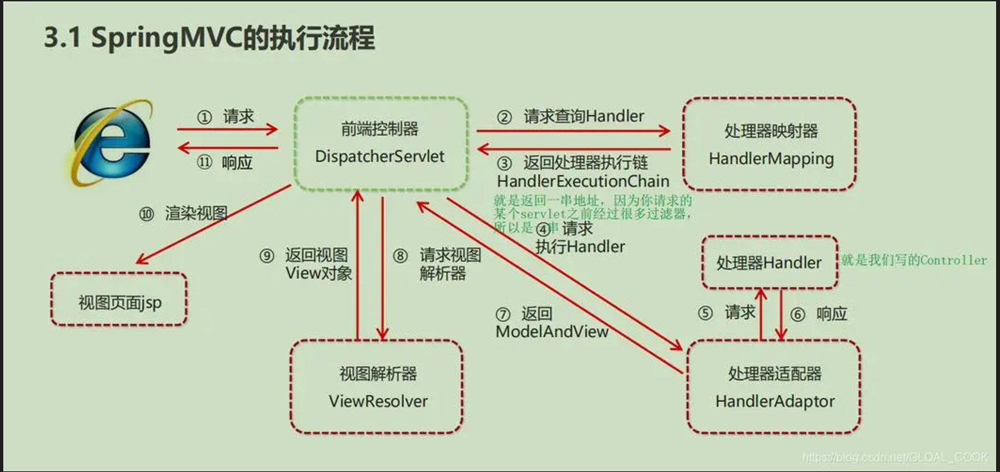

## 为什么说 Java 语言“编译与解释并存”？
因为 Java 语言既具有编译型语言的特征，也具有解释型语言的特征。由 Java 编写的程序需要 先经过编译步骤，生成.class 文件，这个文件必须由 Java 解释器来解释执行。

## JIT Just In Time
JIT 完成一次编译后会将字源码对应的机器码保存起来

## AOT Ahead of Time
在程序执行前将其编译为机器码


## JWT细节
前端从后端接收JWT之后存储在本地存储中 local strong session stgorge
之后请求的时候 将JWT放入HTTP Header中的Authorization位 

## Java特点
简单
高效
跨平台
支持多线程


## JavaC++
类 单继承 c++ 支持多继承
不提供指针访问内存
自动垃圾回收


```
<< :左移运算符，向左移若干位，高位丢弃，低位补零。x << 1,相当于 x 乘以 2(不溢出的情况下)。
>> :带符号右移，向右移若干位，高位补符号位，低位丢弃。正数高位补 0,负数高位补 1。x >> 1,相当于 x 除以 2。
>>> :无符号右移，忽略符号位，空位都以 0 补齐。

```
由于 double，float 在二进制中的表现比较特殊，因此不能来进行移位操作。


### 如果移位的位数超过数值所占有的位数会怎样？
取余 之后再...


## 8 种基本类型
6 种数字类型：
    4 种整数型：byte、short、int、long 1 2 4 8
    2 种浮点型：float、double 4 8
1 种字符类型：char 1
1 种布尔型：boolean。1b


## 基本类型和包装类型的区别？
泛型
对象在堆中 基本 栈的局部变量表
占用高内存小
默认赋值为空 默认赋值为0之类的
==

## 包装类型的缓存机制
Java 基本数据类型的包装类型的大部分都用到了缓存机制来提升性能。
Byte,Short,Integer,Long 这 4 种包装类默认创建了数值 [-128，127] 的相应类型的缓存数据，
Character 创建了数值在 [0,127] 范围的缓存数据，
Boolean 直接返回 True or False。Integer 


如果超出对应范围仍然会去创建新的对象，缓存的范围区间的大小只是在性能和资源之间的权衡。
两种浮点数类型的包装类 Float,Double 并没有实现缓存机制。

## 装箱和拆箱
装箱： 将基本类型用它们对应的引用类型包装起来；
拆箱： 将包装类型转换为基本数据类型；

装箱其实就是调用了 包装类的 valueOf() 方法，拆箱其实就是调用了 xxxValue() 方法。
```
Integer i = 10 等价于 Integer i = Integer.valueOf(10)
int n = i 等价于 int n = i.intValue()
```

## 浮点数精度丢失
计算机在表示一个数字时，宽度是有限的，无限循环的小数存储在计算机时，只能被截断，所以就会导致小数精度发生损失的情况。

### 解决方法 BigDecimal
可以直接使用 BigDecimal 来定义浮点数的值，然后再进行浮点数的运算操作即可。

## 成员变量与局部变量的区别？
可以被访问控制修饰符所修饰  局部变量不能被访问控制修饰符以及static修饰 但是都可以被final修饰
成员变量是属于类的  局部变量 是属于实例的
成员变量是对象的一部分，它随着对象的创建而存在， 而局部变量随着方法的调用而生成，随着方法的调用结束而消亡。
从变量是否有默认值来看，成员变量如果没有被赋初始值，则会自动以类型的默认值而赋值（一种情况例外:被 final 修饰的成员变量也必须显式地赋值），而局部变量则不会自动赋值。


## 为什么成员变量有默认值？
先不考虑变量类型，如果没有默认值会怎样？变量存储的是内存地址对应的任意随机值，程序读取该值运行会出现意外

## 静态变量 static
静态变量也就是被 static 关键字修饰的变量
静态变量是通过类名来访问的，例如StaticVariableExample.staticVar（如果被 private关键字修饰就无法这样访问了）。
通常情况下，静态变量会被 final 关键字修饰成为常量。


## 静态方法不可以调用非静态成员
静态方法是属于类的, 非静态成员属于实例对象
非静态成员 不存在的时候,静态方法已经存在了

## 静态方法和实例方法的不同
调用静态方法可以无需创建对象
静态方法在访问本类的成员时，只允许访问静态成员（即静态成员变量和静态方法），不允许访问实例成员（即实例成员变量和实例方法），而实例方法不存在这个限制。

## 重载和重写
重载就是同样方法的参数个数和类型不同, 可以进行不通过的操作
重写就是当子类重写父类的方法


## 可变长参数
Java 的可变参数编译后实际会被转换成一个数组
```java
public static void printVariable(String... args) {
    for (String s : args) {
        System.out.println(s);
    }
}
```

遇到方法重载的情况怎么办呢？
答案是会优先匹配固定参数的方法，因为固定参数的方法匹配度更高。


## 面向对象

## 对象实体 对象引用
一个对象引用可以指向 0 个或 1 个对象（一根绳子可以不系气球，也可以系一个气球）；
一个对象可以有 n 个引用指向它（可以用 n 条绳子系住一个气球）。


### 对象的相等和引用相等的区别
对象的相等一般比较的是内存中存放的内容是否相等。
引用相等一般比较的是他们指向的内存地址是否相等。


## 如果一个类没有声明构造方法，该程序能正确执行吗?
会有默认的不带参数的构造方法。


## 介绍一下构造方法

名字和类名字相同
没有返回值
生成对象的时候自动执行

构造方法不能被 override（重写）,但是可以 overload（重载）,所以你可以看到一个类中有多个构造函数的情况。

## 面向对象的三大特征

封装
将属性和方法包装起来

继承
它允许一个类（称为子类或派生类）继承另一个类（称为父类或基类）的属性和方法。通过继承，子类可以重用父类的代码，并且可以在不修改父类的情况下添加新的功能或修改已有的行为。

多态
//TODO 


## 接口 抽象类
都不能被实例化。
都可以包含**抽象方法**。
一个类只能继承一个类，但是可以实现多个接口。

接口主要用于对类的行为进行约束，你实现了某个接口就具有了对应的行为。
抽象类主要用于代码复用，强调的是所属关系。
一个类只能继承一个类，但是可以实现多个接口。

都可以只有默认的实现方法 default

    接口中的成员变量只能是 public static final 类型的，不能被修改且必须有初始值，而抽象类的成员变量默认 default，可在子类中被重新定义，也可被重新赋值。


## 深拷贝和浅拷贝区别了解吗？什么是引用拷贝？
浅拷贝 会拷贝此对象但是不会拷贝其内部的引用对象
深拷贝 深拷贝会完全复制整个对象， 包括这个对象所包含的内部对象。

    实现深拷贝 重写clone方法


## equal
equal方法存在于 Object类中,用于判断对象相等, 默认的实现是== 一般我们会重写这个方法

## hashcode 有什么用
hashcode的作用是对利用到hash 的数据结构， 加速查找元素

### 那为什么 JDK 还要同时提供这两个方法呢？
hshcode 判断相等后, 不一定相等, 因为存在hash冲突.
但是hashcode可以判断不等
在使用hash 的容器中, 使用hashcode可以提高效率

## StringBuilder StringBuffer String
StringBuilder 与 StringBuffer 都继承自 AbstractStringBuilder 类

    在 AbstractStringBuilder 中也是使用字符数组保存字符串，不过没有使用 final 和 private 关键字修饰
    AbstractStringBuilder 是 StringBuilder 与 StringBuffer 的公共父类，定义了一些字符串的基本操作，如 expandCapacity、append、insert、indexOf 等公共方法

### 线程安全性
String 中的对象是不可变的，也就可以理解为常量，线程安全。
StringBuilder 并没有对方法进行加同步锁，所以是非线程安全的。
StringBuffer 对方法加了锁，所以是线程安全的。

String  操作少量的数据
StringBuilder 单线程操作字符串缓冲区下操作大量数据
StringBuffer  多线程操作字符串缓冲区下操作大量数据

### String 不可变的原因
```java
public final class String implements java.io.Serializable, Comparable<String>, CharSequence {
    private final char value[];
  //...
}
```
保存字符串的数组被 final 修饰且为私有的， 并且String 类没有提供/暴露修改这个字符串的方法。


### Java 9 将 String 的底层实现由 char[] 改成了 byte[]
在某些编码方式下会生内存

### +
底层 `StringBuilder` 调用 `append()` 方法实现

### String中equals() 和 Object中equals() 方法
String继承自object, 因而他们都有 object 类.  
String 中的 equals 方法是被重写过的，比较的是 String 字符串的值是否相等。


### 字符串常量池
JVM 为了提升性能和减少内存消耗针对字符串（String 类）专门开辟的一块区域，主要目的是为了避免字符串的重复创建。

###  String.intern()
String.intern() 是一个 native（本地）方法，其作用是将指定的字符串对象的引用保存在字符串常量池中，可以简单分为两种情况：


# Error


## Exception 和 Error 有什么区别？
Exception : 程序本身可以处理的异常，可以通过 catch 来进行捕获。Exception 又可以分为 Checked Exception (受检查异常，必须处理) 和 Unchecked Exception (不受检查异常，可以不处理)。
Error： Error 属于程序无法处理的错误. 例如 Java 虚拟机运行错误（Virtual MachineError）、虚拟机内存不够错误(OutOfMemoryError)、类定义错误（NoClassDefFoundError）等 。这些异常发生时，Java 虚拟机（JVM）一般会选择线程终止


## Checked Exception 和 Unchecked Exception 有什么区别？
Checked Exception 即 受检查异常 ，Java 代码在编译过程中，如果受检查异常没有被 catch或者throws 关键字处理的话，就没办法通过编译。
    除了RuntimeException及其子类以外，其他的Exception类及其子类都属于受检查异常 。常见的受检查异常有：IO 相关的异常、ClassNotFoundException、SQLException...。
Unchecked Exception 即 不受检查异常 ，Java 代码在编译过程中 ，我们即使不处理不受检查异常也可以正常通过编译。
    RuntimeException 及其子类都统称为非受检查异常，常见的有（建议记下来，日常开发中会经常用到）：NullPointerException(空指针错误)IllegalArgumentException(参数错误比如方法入参类型错误)NumberFormatException（字符串转换为数字格式错误，IllegalArgumentException的子类）ArrayIndexOutOfBoundsException（数组越界错误）ClassCastException（类型转换错误）ArithmeticException（算术错误）SecurityException （安全错误比如权限不够）UnsupportedOperationException(不支持的操作错误比如重复创建同一用户)


## try 块或 catch 块中遇到 return 语句时 还会执行 finally 吗
会执行

## finally 中的代码一定会执行吗？
不一定
比如在finally之前
程序所在的线程死亡,虚拟机关闭,cpu关闭


## 如何使用 try-with-resources 代替try-catch-finally？
```java
try (Scanner scanner = new Scanner(new File("test.txt"))) {
    while (scanner.hasNext()) {
        System.out.println(scanner.nextLine());
    }
} catch (FileNotFoundException fnfe) {
    fnfe.printStackTrace();
}
```


## 何谓 SPI?
是一种接口提供方式, 调用方提供好接口, 服务端去实现


## 序列化反序列化
将数据结构转化为二进制字节流
用于传输 存储等
应用层


## transient
transient声明的关键字不会被实例化 ,比如密码
private transient String password; // 使用 transient 修饰


## 常见序列化协议有哪些？
Hessian、Kryo、Protobuf、ProtoStuff， 这些都是基于二进制的序列化协议。
JSON 和 XML 这种属于文本类序列化方式。可读性比较好，性能较差


## 为什么不推荐使用 JDK 自带的序列化？
不支持跨语言调用
性能差
存在安全问题：


## Java IO 流
的 40 多个类都是从如下 4 个抽象类基类中派生出来的。
InputStream/Reader: 所有的输入流的基类，前者是字节输入流，后者是字符输入流。
OutputStream/Writer: 所有输出流的基类，前者是字节输出流，后者是字符输出流。


## I/O 流为什么要分为字节流和字符流呢?
不管是磁盘还是网络传输，最小的存储单元都是字节
但是 在程序中操作的通常是字符形式的数据，因此需要提供对字符进行操作的方法。


## java数据类型 4 种
引用数据类型
    类
    接口
    数组
    枚举


## 权限
private 仅类内部
defalut 包内

    子类继承父类的成员时，可以访问父类中具有default访问权限的成员，但前提是子类和父类必须在同一个包内。如果子类和父类不在同一个包内，子类是无法访问父类中使用默认访问权限修饰的成员的
protected 包内 和 子类

    允许子类（无论是否在同一包内）访问被修饰的成员。而default访问修饰符则只能被同一包内的类访问。 
public  所有类都可访问
越来越放松


### 执行顺序
静态代码块->构造代码块->构造方法

子类重写父类的方法的时候,权限不可以比父类的更加严格
子类的对象无法直接访问父类的方法,因而提供了super关键字
    使用super调用父类指定构造方法 super(x,x)

如果父类的成员不希望被子类重写,可以用final关键字


## 静态变量
static 修饰的 只分配一次内存
通过类名访问,无需创建对象


## 静态方法和实例方法有什么不同
类名方法调用 不需要创建对象
只可访问静态成员变量


## 重载 重写
两个完全不同的概念
继承类或者实现接口 重写方法
类中的方法,参数 类型,个数,顺序,返回值 不同, 称为重载


## 构造方法
存在于类中
名字与类名相同
没有返回值
创建对象时自动调用
不可以被重写,可以被重载


## 面向对象的3个特征
继承 多态 封装

拥有同父类的属性和方法
一个对象有多个不同的状态,主要表现在 继承 重写 上 
主要表现为,将对象的属性和方法封装在一起


## 具体实现
浅拷贝继承Cloneable 直接用默认的.clone() 方法
深拷贝继承Cloneale 之后重写clone方法,拷贝内部对象,注意内部对象也需要继承Cloneable方法


## Object常见的类
getClass wait notify notifyall 
hashCode equal
toString Clone


### equal
对于基本类型，== 判断两个值是否相等，基本类型没有 equals 方法
对于引用类型，== 判断两个变量是否引用同一个对象，而 equals() 判断值是否相等 我们可以重写 equal 方法达到我们想要的效果


## 抽象类和普通的类的区别
抽象类不可以被实例化 只能继承
抽象类中含有抽象方法 抽象类被 abstract 修饰


## 什么是反射
是指在运行时操作 类、接口、属性和方法

反射提高了程序的可拓展性
但是带来了额外的开销 并且不安全


## final
变量 不可被修改
方法 不可贝重写
类 不可被继承


## String 字符串常量池
已存在的会引用,而不是创建新的对象
.intern(),本地方法,用于将指定的存储到字符串常量池中


## 异常
Throwable Exception Error
Exception CheckedException UncheckException
Error

Exception 程序可以处理的异常
Error 程序无法处理的异常 JVM错误 内存不足


## Checked Exception
在java代码中接受异常检查,如果代码没有被try throw 修饰,则会报错
除了 RuntimeException 其他都是Checked


## 泛型
提高了代码的复用性
编译器可以对参数进行检测
可以增强代码的可读性稳定性


### 什么是泛型
允许在定义类、接口和方法时使用类型参数


## 反射
Spring中 简化配置
注解 动态特性


## 注解
用于修饰类方法变量
通过反射机制
简化代码加速开发


## IO
都是从以下类派生出来的
InputStream Reader
OutPutStream Writer


## 为何要有字节流字符流
字符流耗时间
字节流有时候会存在编码问题


## 值传递
实参 形参(函数括号内的)


## 值传递 引用传递
java中仅有值
java中引用数据类型传递的是值,这个值是地址


## 序列化反序列化
推荐使用kryo


## 获取对象的四种方式
Object.class
Class.forName"cn.javaguid.Main"
.getClass
类加载器传入路径


##  代理模式
静态代理
动态代理


## Unsafe
是java中的一个类, 主要提供本地方法, 用于一些高性能的数据结构, 但是使用不当会造成内存泄漏


## 集合
Collection Set List Queue Map

Set HashSet SortedSet
HashSet LinkedHashSet
SortedSet TreeSet

List ArrayList Vector
ArraryList LinkedList
Vector Stack

Queue ProriQueue Dequeu

Map HashMap HashTable SortedMap
HashMap linkedHashMap
SortedMap TreeMap


## 区别
List 有序可重复
Set 不可重复
Queue 有序
Map 键值对

List
ArrayList Object[]
Vector Object[]
LinkedList 1.6 循环链表 1.7 取消了循环


Set
HashSet 无序唯一
TreeSet 有序唯一

Queue 
ProriQUeue Object[] 实现小顶堆
DelayQueue

Map
HashMap 数组+链表 -> 数组+链表+红黑树
表长>8 数组>64


LinkedHashMap
继承HashMap
加入了双向链表,可以保证键值对的插入顺序

HashTable 数组+链表 线程安全

TreeMap 红黑树(一种排序二叉树)


## 如何选用集合
需要排序的时候 TreeMap
不需要排序 HashMap
保证线程安全 CocurrentHashMap


## 为何使用集合
简化操作
规范操作

## list ArrayList
动态扩容
泛型
只能存储对象 可以存储任何类型
创建时无需指定大小  需要指定大小

Vector 线程安全 
Stack 线程安全 都是有synchornized修饰

## ArrayList LinkedList 插入删除时间复杂度

头   尾   指定位置
n  1 n
1 1 n 

一般不使用LinkedList


## RandomAccess 标记接口随机访问
链表不是连续的存储空间,不能实现随机访问

## Comparable Comparator
A compareTo B  compare A B 


## PriorityQueue
出队顺序和优先级有关
二叉堆 O(logN) 插入 删除
非线程安全
默认小顶堆


## BlockQueue 阻塞队列
如果队列满了,一直等到队列可以放入新的元素的时候放入


## 数组转集合 aslist


## 源码分析Arraylist
extend AbstractList
implemlent list Ramdomaccess cloneable Serializable
可以null值 null值无意义


## 比较Arraylist LinkedList
都不是线程安全 Arraylist LinkedList
内存占用
是否支持随机访问
数据结构 数组  双向链表


## CocurrnetHashMap
1.7 Segment的组合16个 可以理解为最多支持16个并发
1.8 Node数组 链表+红黑树


## 进程 线程
进程是程序的一次执行过程 包含多个线程
线程是比进程更小的执行单位

线程共享 堆和本地方法区
线程独立的有 程序计数器 虚拟机栈 本地方法栈

在Windows linux中采用1对1的线程模型


## 程序计数器 
记录执行到哪里了,方便中断之后恢复


## 虚拟机栈
为虚拟机提供服务


## 本地方法栈
为native方法提供服务


## 如何创建线程
new Thread().start()

实现方式有
继承 Thread 
实现 Runnable 
实现 Callable 使用线程池


## 线程的生命周期和状态
6
new 初始状态 还没有被start调用
runnable 运行状态 被调用了start
blocked 阻塞状态 需要等待锁释放
waiting 等待状态 需要等待其他线程做出一些指定的动作
time-wating 超时等待状态 在指定的事件后自行返回而不是像waiting一直等待
terminated 终止状态


## 上下文切换
线程切换需要进行上下文切换 让出cpu的使用权


## Thread sleep 和 Object wait
sleep 没有释放锁, 而 wait 释放了锁
为何wait 不定义咋Thread中
释放锁操作的对象是Object 而非线程
为何sleep不定义在Object中
让当前进程等待,不涉及到对象


## Thread中的start和run
run不会当作多线程执行 start会


## 并发与并行
并发 在同一时间段执行
并行 在同一时刻运行


## 同步和异步
同步需要等待返回结果
异步不需要


## 为何要使用多线程
现在计算机大多都是多线程的,充分利用计算机资源
减少了线程上下文切换带来的开销
当今互联网对并发要求很高


## 使用多线程可能会带来什么问题
死锁 线程不安全 内存泄漏


## 线程安全
对于同一份数据,不管多少线程同时访问,都可以保证这一份数据的一致性和正确性
混乱 错误 丢失


## 单核cpu运行多个线程效率一定会高吗
cpu密集型 多线程开销大,不一定
IO密集型 一般会提高效率


## 死锁
两个或多个进程因争夺资源而相互等待


## 条件
宏观
互斥条件  循环等待
第一个 第二个
请求与保持条件  不剥夺条件

互斥条件 一个资源某一时刻只有一个线程可以占用
请求与保持条件 因请求资源阻塞时,不释放资源
不剥夺条件 线程获得的资源不可被剥夺
循环等待条件 形成一种头尾项链的循环等待资源


## 检测死锁
jconsloe 
JDK bin目录下


## 避免死锁
破坏请求保持条件 一次性获取所有资源
破坏不剥夺条件 申请不到则主动释放
循环等待条件 按照某一顺序申请资源,某一顺序释放资源


## JMM 
java内存模型


## volatile 关键字 指示变量是不稳定的

    用来告诉编译器这个变量可能会在程序的控制之外发生改变，因此编译器不能对其进行优化。这样可以确保每次访问该变量时都会从内存中重新读取，而不是使用缓存值。
如何保证变量的可见性
每次使用都要到主存中读取 
不可以保证原子性


## 如何禁止指令重排序
volatile 关键字


## 乐观锁和悲观锁
bei
假设每次都出问题,所以每次操作之前都加锁

le
假设每次都没问题,先直接操作,提交的时候再做验证


## 场景
bei 写比教多的场景 竞争激烈
le 写少的场景 竞争少

## 如何实现乐观锁


## CAS算法


## ABA问题


## synchronized
方法
代码块


## synchronized 和 volatile 区别
volatile 是轻量的 synchronized 是重量级的
volatile 解决变量在多个线程之间的可见性, synchronized 解决多个线程之间访问资源的问题
volatile 修饰变量 synchronized 修饰方法和代码块


## reentrantlock 
可重入锁
可以获得自己内部的锁 避免死锁


## 公平锁 非公平锁
先申请的先获得锁
随机获取锁


## synchronized 和 reentrantlock
都是可重入锁

synchronized 非公平锁 reentantlock 可以是公平锁也可以是非公所suo
reen等待可中断


Java 中`synchronized`和`ReentrantLock`等独占锁就是悲观锁

```java
public void performSynchronisedTask() {
    synchronized (this) {
        // 需要同步的操作
    }
}


private Lock lock = new ReentrantLock();
lock.lock();
try {
   // 需要同步的操作
} finally {
    lock.unlock();
}
```

乐观锁java中没有提供,一般需要手动实现


## 共享锁和独占锁
一个锁可以被多个线程获取
一个锁只可以被一个线程获得


## 线程持有读锁还可以获取写suo吗
不可以 如果发现写锁被占用, 直接获取失败
但是持有写锁可以获取读锁


## StampedLock 不可重入
性能好 乐观锁


## ThreadLocal
我们创建的 变量 是可以被任何一个 线程 访问修改的
但是每个线程都有一块仅自己访问的空间 TheadLocal

## 主内存和本地内存
所有的线程创建的实例对象都放在主内存中
每个线程都有自己私有的本地内存, 存储了该线程以读/写共享变量的副本


## 线程池
有任务需要处理的时候,直接向线程池中获取线程来处理,处理完之后并不会被直接销毁,而是等待下一个任务

降低资源消耗 重复利用线程而不需要 销毁和创建
提高响应速度
提高线程的可管理性 避免过多的或者过少创建线程


## 如何创建线程池
ThreadPoolExecutor 构造函数来创建
Executors 不推荐

使用第一个
显式的写明过期时间等等参数,避免资源耗尽


## 线程池中线程异常后，销毁还是复用
使用execute()时，未捕获异常导致线程终止，线程池创建新线程替代；使用submit()时，异常被封装在Future中，线程继续复用。


## 根据任务优先级来执行的线程池
使用一个优先阻塞队列


## Future 
主要用在一些需要执行耗时任务的场景，避免程序一直原地等待耗时任务执行完成

1取消任务；  2判断任务是否被取消;
3判断任务是否已经执行完成;
4获取任务执行结果。

## AQS


## 指令重排序
编译器优化
并行指令重排
现代处理器,如果不存在数据依赖性,处理器可以改变语句对应机器指令的执行顺序

两个线程如果通信的话,需要经历
线程1 把本地内存中修改的共享变量副本的值同步到主内存中去.
线程2到主内存中读取对应的共享变量的值


## JMM java memory model
定义了共享内存中 多线程 读写变量的规范 从而保证指令的正确性
jmm 把内存区域分成两块 一个是主内存 一个是线程的私有内存 线程只是操作私有内存 私有内存和主内存可以同步


## CAS
compare and swap
一种乐观锁的思想 在无锁的情况下实现线程安全

while 体现了自旋
```
while(true){
    int oldData=mainMemory
    //operation
    if(compareAndSwap){
        //成功
        break;
        失败不退出
    }
}
```


## volatile
保证线程间的可见性
    当一个线程对这个变量进行操作的时候, 都胡从主内存中获取新的值
防止指令重排序
    防止编译器优化 使多线程按照正确的流程访问变量


## ......


# 框架

## Spring框架中的单例bean是线程安全的吗
不是 所以如果该处理逻辑中 有对该单列状态的修改（体现为该单例的成员属性），则必须考虑线程同步问题
是单例吗
是

## AOP 面向切面编程
抽取公共模块复用，降低耦合，减少代码的修改
为公共日志保存， 事务处理等

## spring中事务是如何实现的
spring实现的事务本质就是 AOP 完成， 对方法前后进行拦截，在执行方法之前开启事务，在执行完目标方法之后根据执行情况提交或者回滚事务


## 事务失效的场景
一共三个
捕获了异常但是没有抛出
抛出的异常类型不对 需要配置 @Transactional
方法上不是public修饰的，也会导致事务失效

## Spring Bean的声明周期
BeanDefinition 类 获取bean的定义信息 这里面就封装了bean的所有信息 比如 类的全路径 是否是延迟加载 是否是单例等等这些信息
创建bean 调用构造函数实例化bean
bean的依赖注入，比如一些set方法注入 @Autowire在这一步完成
是处理Aware接口，如果某一个bean实现了Aware接口就会重写方法执行
是bean的后置处理器BeanPostProcessor
初始化方法，比如实现了接口InitializingBean或者自定义了方法init-method标签或@PostContruct

>第六步是执行了bean的后置处理器BeanPostProcessor，主要是对bean进行增强，有可能在这里产生代理对象
>
>最后一步是销毁bean
>


## Spring中的循环引用
循环依赖 循环引用指的是 两个或两个以上的 bean 互相依赖对方 形成了闭环
在spring中 允许存在 spring使用三级缓存 解决了大部分循环引用问题


### 构造方法出现了循环依赖怎么解决
由于bean的生命周期中构造函数是第一个执行的因此 spring框架不能解决 构造函数依赖注入的问题
可以使用 @Lazy 懒加载


## 三级缓存
单例池 初始化完成的bean对象
早期的bean对象 生命周期还没有走完
工厂对象 缓存的工厂 用来创建对象


## 三级缓存的流程


## SpringMVC的执行流程知道嘛





## Springboot自动配置原理
@SpringBootApplication 对三个注解进行了封装

@SpringBootConfiguration 和 Configuration 相同 声明为配置类
@EnableAutoConfiguration 核心
@ComponentScan 包扫描


@EnableAutoConfiguration
该注解通过`@Import`注解导入对应的配置选择器 读取了配置的类的全类名
在这些配置类所定义的Bean会判断是否有对应的class文件，如果有则加载该类


## Spring 的常见注解有哪些
实例化 bean @Controller @Component @Service @Repository

@Atuowired Spring @Resource java
类型 名称 
@Qualifier 用于指定具体的依赖对象的名称
@Scope 标注bean的范围(单例多例)

@Configuration @ComponentScan @bean **方法**的返回值储存到Spring容器
@Import 导入的**类**会放到Spring容器中
@Aspect @Before @After @Around @Pointcut AOP


## SpringMVC常见的注解有哪些
@RequestMapping
@RequestBody
@RequestParam 
@PathViriable
@ResponseBody
@RequestHeader
@PostMapping、@GetMapping
@RestController


## Springboot常见注解有哪些
@SpringBootApplication
包括
@SpringBootConfiguration Configration
@EnableAutoConfiguration 自动配置
@ComponentScan 包扫描


## MyBatis执行流程
读取xml配置文件
创建工厂
创建会话
使用执行器操作数据库
并且进行输入输出映射

## 是否支持延迟加载

支持

在用到数据的时候查询 用不到的时候不查询
可以在Mapper的xml中配置延迟加载 默认是关闭的

### 延迟加载的底层原理
使用代理对象完成的
使用拦截器


## Mybatis的一级、二级缓存
一级缓存: 底层是 HashMap 本地缓存 其存储作用域为 Session Session销毁后会清空数据 默认是开启的
二级缓存是基于namespace和mapper的作用域起作用的 默认关闭


### 二级缓存什么时候会清除数据
某一个作用域进行了增改删操作 所有select缓存都会被清除


# 微服务

## SpringCloud 五大组件
远程调用
网关
注册中心
负载均衡
降级熔断


### 注册中心
服务注册和发现和监控


eureka
被消费者 主动发送信息给注册中心
消费者 从注册中心拉取信息


nacos 和 eureka 的区别
1. nacos 存在临时实例 和永久实例 临时实例和 eureka 相同 对于永久实例 nacos 会主动询问
2. 非临时实例不会被删除
3. Nacos和eureka集群默认都是AP模式 但是nacos存在永久实例 则会采用CP模式
4. 主动推送变更消息客户端


### 负载均衡
Ribben 从注册中心获取节点信息 之后按照负载均衡配置来处理

随机
轮询
权重
最少连接
配置区域轮询 比如同一个机房为一个区域


#### 如何自定一负载均衡
实现IRule接口
编写配置类


### 服务降级熔断
服务降级 针对于某个接口
服务熔断 针对于整个微服务


服务降级
一般开发中与Feign接口整合, 编写降级逻辑


服务熔断
如果检测到一定时间内失败次数很高, 就会触发熔断机制
一段时间之后尝试请求微服务 如果失败会继续熔断
如果成功就关闭熔断


#### 如何监测微服务
skywalking
可以监控微服务 并给出提醒
可以看到整个微服务的状态
可以看到详细的接口相应情况 包括接口每个阶段执行的情况 包括数据库的耗时情况


#### 限流
nginx 
漏桶算法 
    以固定的速率输出请求 过多的请求等待或丢弃
网关 springcloud
令牌桶
    申请到令牌的服务才处理 过多的等待或丢弃


### 消息队列
RabbitMQ
publicher exchange queue consumerX

#### 如何保证消息不丢失
使用确认机制 检测丢失
丢失后 可以使用 使用回调方法 写入日志 保存到数据库重发 来解决

消息持久化
默认为内存存储 开启持久化可以缓存消息 交换机和队列中的数据

消费者有确认机制
消费者出现异常的时候会 利用本地重试 如果一直失败 会将信息发送到异常交换机 由人工处理


#### 如何解决重复消息
设置唯一id
幂等 方案: 分布式锁 数据库锁


#### 多条消息堆积在MQ 如何解决
增加消费者
消费者启用多线程技术
扩大队列容积
使用惰性队列


#### rabbit 高可用
集群


# 其他


## 分布式接口设计
幂等
restful 风格中 put update 都不是幂等的
### 如何解决接口幂等问题
1. 新增数据 可以使用唯一索引

2. tooken + redis
请求的时候将要tooken 存储到redis中
处理的时候去redis看一下有没有token 有就处理, 处理的同时时候删除token

3. 使用分布式锁


## 采用哪种方式解决的分布式事务

 


## 分布式任务调度
xxl-job

随机
轮询
一致性hash
LFU
LRD
故障转移
分片广播


### 任务失败怎么办哪
设置故障转移和重试机制

### 大量数据需要执行
采用分片广播


## 如何存储一个数组到数据库
序列化
转为json 之后存入


## 分布式锁和分布式事务的关系
分布式锁为分布式事务提供服务


## 如何实现分布式锁
单机情况下使用语言内置的锁可以实现 分布式情况下无法这样做
可以使用一个互斥量 或者使用Redis内置的Redlock 使用互斥量一般是单点情况下 redlock使用了多个节点搭建 避免单点故障
使用互斥量可以使用redis或者是MySQL数据库 实现  获得锁的时候插入一个数据 释放锁的时候删除这个数据 唯一索引可以保证只被插入一次
使用redlock 会尝试从 N 个独立的节点获取锁 并且从大多数节点上获得锁成功 就认为获得了锁


## 事务的ACID特征
原子性 一致性 隔离性 持久性
aut cons ins de 
事务是最小单元 数据库事务前后 数据的状态保持一致 并发事务之间不受影响 事务提交后对数据库的修改是永久的


## CAP BASE 了解吗
CAP BASE 是分布式系统架构的一些概念
CAP 指的是 一致性 可用性 分区容错性 分布式系统一般无法满足三者 而我们要认为网络是不可靠的 因而我们再分布式系统设计的时候一般选取 两种原则 CP AP 
CP 保证了强一致性 但是会损失部分可用性  AP 保证了系统的高可用 允许中间状态存在 


BASE 是对 CAP 的一种妥协
BASE指的是 基本可用 软状态 和 最终一致性
通过参考BASE理论可以搭建微服务的架构


## Redis中key不能过大
会对redis的持久化产生影响 阻塞主线程 或 过多的消耗资源
回盘策略如果设置的always 主线程执行完后 会调用fsync() 函数 等到读写操作完成之后 函数才会返回 因而会阻塞
过大的key会造成AOF重写的机制过快 损失性能


## 分布式ID了解吗
UUID 雪花算法生成分布式ID
UUID 过长 造成 MAC地址泄漏 空间消耗大 没有业务意义 没有规则
雪花算法生成的ID 有可能会产生重复 但可以定制 并且相对来说短一些 可以实现有序递增

## UUID多少位
128b 

## UUID可以作为数据库的主键吗
可以但是不建议
因为太长了
影响性能


## 如何做的限流
根据用户的ID 使用限流中间件
//TODO 


## 超时重试机制
超时重试机制 
可以采用 固定时间重试 或者是梯度区间重试的方法
防止一次请求被多次执行 可以使用幂等设计接口


## 什么是IO多路复用
系统再等待IO的时候不会阻塞 可以去处理其他请求


## 什么是服务降级
主动关闭部分功能 保证总体可用
比如限制流 延长页面相应时间等


## 数据库优化方法哪些
增加缓存
搭建集群 包括读写分离的主从复制集群 还有分片集群
对数据进行分库分表


## linux 端口占用
可以采用查看进程的方式 也可以使用查看网络的方式
使用查看进程的方式 命令是 ps -ef| grep 端口号
使用查看网络的方式 命令是 netstatu |grep 端口号


## 继承和聚合的区别在哪
继承是 is a 的关系 子类是父类的特殊实现形式
聚合是 has a 的关系 一个对象包含另一个对象


## 反射的原理
通过Class类，我们可以获取类的结构信息，如类的方法、字段、构造函数等
并且可以动态地创建对象、调用方法、访问字段等


## 什么情况下会更倾向于使用抽象类而不是接口
类中有属性 ...
需要定义一些 默认的实现 


## 更倾向于使用接口
深层次解耦 更有利于拓展
继承多个


## 遍历数组的时候


外层循环遍历行 内层循环遍历列 的性能会更高一些


# 山大地伟面经
注意一些比较实际的东西
比如 基础 数据库 还有一些旧技术但是有用的技术的原理 操作系统和网络问的不多


## MVC
MVC是一种设计模式
Model（模型）、View（视图）、Controller（控制器）
Controller  是Model和View这两层的桥梁


## 讲一下你对java的理解
历史悠久 应用广泛 包括智能手机 软件 嵌入式
特性 跨平台 多线程 面向对象的特征
对比 简单 相较于c++ 不支持指针操作内存 自动垃圾回收 不支持运算符重载
生态十分完善 包括数据库 集群 和一系列中间件都对java进行了适配


## servlet
servlet 是 javaweb的 核心内容
是java 实现的动态web技术
servlet 是java规范之一 我们实现servlet 接口可以借助servelt 服务器运行项目


### 声明周期
Servlet 初始化后调用 init () 方法。
    创建一个servlet 实例
Servlet 调用 service() 方法来处理客户端的请求。
    service 会调用 doGet doPost 方法 我们需要重写这些方法
Servlet 销毁前调用 destroy() 方法。
最后，Servlet 是由 JVM 的垃圾回收器进行垃圾回收的。

每个请求都会创建一个线程 执行 根据不同的路径 执行不同的servlet 方法


tomcat 一般作为javaweb项目的web容器
实际上 tomact 是一个servlet 容器
用来托管和处理servlet


## spring如何进行 异常处理
使用 @ExceptionalHandler 注解 在类中定义一个方法
    单个Controller
使用 @ControllerAdvice 注解 定义一个类
    全局
可以在里面针对不同的异常类 写对应的处理方法


## sql
内外连接
    是用来处理夺表操作的
    见mysql


sql执行顺序


如何对SQL语句优化


分页查询

问了一些SQL的书写，比如聚合函数、group by啥的


## 旧技术
基本的JDBC操作
1. 注册数据库
2. 建立连接
3. 创建操作对象 写入sql语句
4. 执行语句
5. 处理结果
6. 关闭资源


Java内存分布 垃圾回收
CMS G1
溢出问题

怎么判断空指针


Static关键字的用法


## 反向输出一个整数的数字（说一下怎么实现就行，%，/）
如果使用算法的话
对10取余得到最后一个数字 为新数字的第一个数字
之后将源数字除以10 重复操作 可以得到新数字的第二个数字
如此递归 得到最终的结果

如果用库函数的话
将数字转为 String 之后用 StringBuffer 中的 reverse 函数 之后再转为整数


## 对加班怎么看
现在年轻 加班有加班费的话 倒是挺喜欢加班的 一方面可以多赚点钱 另一方面可以增加工作能力
对敲代码挺感兴趣的


## 在进行数据库设计的时候，进行数据库需求描述的时候，用什么工具来描述数据需求
uml包图和类图


## 描述业务需求的时候有用到什么工具吗
流程图
用例图


## UI设计是怎么做的
可以用一些ui设计参考软件 比如 figma


## 软件应该从哪些方面进行评价
功能 性能 
可靠性  安全性 兼容性 易用性
还要看用户的反映


## 你觉得你是个怎样的人
做事比较认真 有责任心
之前初中高中 也有担任班委 办事老师挺满意的
做事比较干净


## 为什么挂科
那段时间比较贪玩 而且那个课比较难 没怎么学
之后暑假认认真真的学了一遍 暑假过后开学的时候补考过了


## 微服务的表结构

范式


## 问了 SpringBoot 的两个事务的书写方式
（声明式、编程式）

启动类 @EnableTransactionManagement
启动事务的时候 添加   @Transactional  注解


# 非技术

## 关于公司
是一家国有控股企业
使用 计算机技术 赋能传统产业


## 未来三年的工作计划
多学习 提升自己 争取拿更高的工资 争取在这个行业更加深入一些


## 家庭情况


# 反问
## 我们要实习多久
## 实习到明年毕业才能转正是吗
## 应届生工资大概是多少


## 大学经历
刚开始参加了ACM社团 后来发现自己不太适合写算法 之后就退了
之后课余时间 就鼓捣一些自己喜欢的东西 比如docke git linux 等
还有一些硬件的 aruiniu 单片机等 装系统 刷机什么的 还有部署使用各种各样的开源项目


两个面试官，一个hr,一个技术，过程比较轻松

1.自我介绍
2.考研了吗？考了什么学校？考了多少分？二战吗？
3.家在外省，为什么选择济南？
4.之前有投过简历吗？有没有收到offer? 在招聘软件上投过很多 回复的很少 有一个让我等着
5.针对项目问了特别多问题（优势？学校老师要求的还是自己做的？ 学校的大作业 我做的比较认真 后来学了新技术又优化了一下  大概是做什么的，如何实现）
7.（简历上写了熟悉linux系统）问了几条linux命令，比如如何复制文件，如何给用户授权，最大的权限是什么？
    拥有者 所属组 其他用户 chmod chown:修改所属组和所有者
    chown runoob:runoobgroup file1.txt
8.数据库！！！
（1）问了几个语句
如何给查询结果排序（升序，降序DESC）
如何分片（比如查询第10-15条记录）
SELECT *
FROM your_table
LIMIT 9, 6;
（2）主要学了哪些数据库？
mysql redis 
（3）熟悉数据库索引吗？索引的优缺点？有哪几类索引？
B树索引、哈希索引、全文索引等
    全文索引 一般用于模糊查询
（4）哪些数据适合索引？（比如性别适不适合）
通常情况下，索引应该应用于那些经常被用作查询条件的列，以提高查询性能。性别这一列通常只有两个不同的取值（比如"男"和"女"），因此对于性别这样的低基数列来说，并不适合创建索引。
    作为查询条件的列
    区分度高的 长度短 
    经常用于where的字段
    经常用于排序分组的字段
（5）知道范式吗？第一范式第二范式？
    解耦 消除冗余
    第一范式 字段的值是源自性的,不可再分
    第二范式 数据库中的每个记录都是 唯一可以标识的 而且所有非主键字段 都必须完全依赖主键
    第三范式 所有非主属性之间不可存在依赖
（6）什么是mySQL事务？
    事务是一组 逻辑上的一块执行的 行为 要么同时,,,,
    mysql事务对应一组操作 要么同时,,,,
    可以开启事务 之后输入代码 最后提交事务
    成功的话 事务就会正常执行 有误的话可以进行事务的回滚
    mysql不会自动回滚 需要我们自己解决
    使用一些框架 出现异常的时候可以帮助我们回滚
9.主要用的语言是什么？
10.你的职业规划是什么？
11.对于女生来说，考公务员是一个比较好的选择，你考虑过公务员吗？为什么不考   不喜欢那种东西 没啥兴趣 没啥意思


# 电商项目


商品表（Products table）：
    商品ID（Product ID）
    商品名称（Product Name）
    商品描述（Product Description）
    商品价格（Product Price）
    商品库存（Product Stock）
    商品分类ID（Category ID）
    上架时间（Listed Time）
    下架时间（Unlisted Time）
    销量（Sales Volume）
    状态（Status）
    创建时间（Created Time）
    更新时间（Updated Time）

商品分类表（Categories table）：
    分类ID（Category ID）
    分类名称（Category Name）
    父级分类ID（Parent Category ID）


购物车如何实现的
    未登录的用户存放到本地缓存中 比如lcoalStrong
    已经登录的存放在redis中
需要后端提供哪些接口?
    对Redis操作的一些接口
    可以使用Redis 中的 hash 结构存放 id 和 数量两个字段
    提供查询和更新的接口


订单
    创建一个订单类
    确定支付的时候 点击支付就会创建订单
    从Redis中拷贝购物车信息 之后添加到订单中 并使用订单类提供的方法计算价格
    之后将订单给 RabbitMQ 使用异步处理 不会阻塞主线程
    这一块是比较复杂的 建议画一个流程图
    使用定时调度 超时的订单就自动释放


