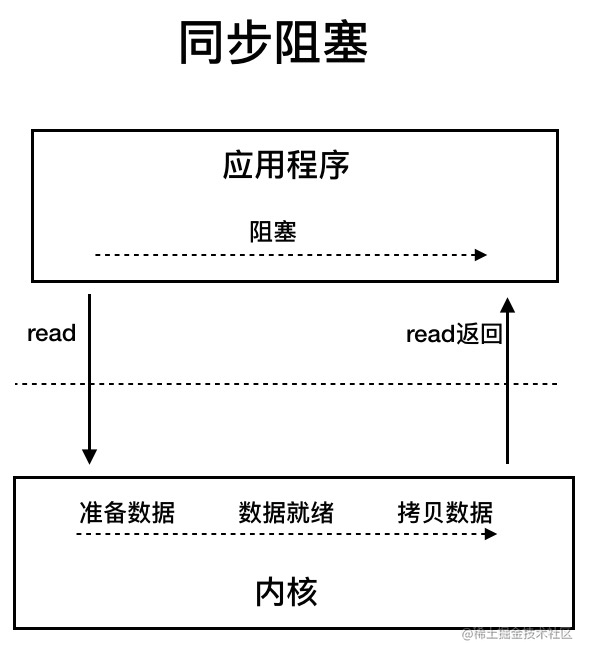
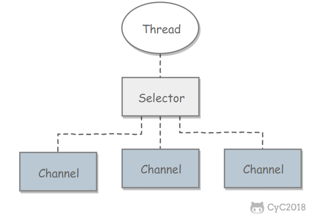

## 介绍一下java中的IO
磁盘操作 File
字节操作 InputStream OutputStream
字符操作 Reader 和 Writer
对象操作 Serializable
网络操作 Socket
新的输入输出 NIO


## File 类可以用于表示文件和目录的信息
递归地列出一个目录下所有**文件**
```java 
public static void listAllFiles(File dir) {
    if (dir == null || !dir.exists()) {
        return;
    }
    if (dir.isFile()) {
        System.out.println(dir.getName());
        return;
    }
    for (File file : dir.listFiles()) {
        listAllFiles(file);
    }
}
```


## 实现文件复制
```java
public static void copyFile(String src, String dist) throws IOException {
    FileInputStream in = new FileInputStream(src);
    FileOutputStream out = new FileOutputStream(dist);
    byte[] buffer = new byte[20 * 1024];
    int cnt;
    // read() 最多读取 buffer.length 个字节
    // 返回的是实际读取的个数
    // 返回 -1 的时候表示读到 eof，即文件尾
    while ((cnt = in.read(buffer, 0, buffer.length)) != -1) {
        out.write(buffer, 0, cnt);
    }
    in.close();
    out.close();
}
```


## FilterInputStream
FilterInputStream 属于抽象**装饰者**，装饰者用于装饰组件，为组件提供额外的功能。例如 `BufferedInputStream` 为 `FileInputStream` 提供缓存的功能。
实例化一个具有缓存功能的字节流对象时，只需要在 FileInputStream 对象上再套一层 BufferedInputStream 对象即可。
```java
FileInputStream fileInputStream = new FileInputStream(filePath);
BufferedInputStream bufferedInputStream = new BufferedInputStream(fileInputStream);
```

## 编码
GBK 编码中，中文字符占 2 个字节，英文字符占 1 个字节；
UTF-8 编码中，中文字符占 3 个字节，英文字符占 1 个字节；
UTF-16be 编码中，中文字符和英文字符都占 2 个字节。
unicode：任何字符都占 2 个字节

UTF-16be 中的 be 指的是 Big Endian，也就是大端。相应地也有 UTF-16le，le 指的是 Little Endian，也就是小端。
Java 使用这种双字节编码是为了让一个中文或者一个英文都能使用一个 char 来存储。


## getBytes
`byte[] bytes = str1.getBytes();`
getBytes() 的默认编码方式与平台有关， 一般为 UTF-8。


## 为何要有字符流
在程序中操作的通常是字符形式的数据
InputStreamReader 实现从**字节**流解码成**字符**流；
OutputStreamWriter 实现字符流编码成为字节流。


## 实现逐行输出文本文件的内容
```java
import java.io.*;
/**
 * Main
 */
public class Main {
    public static void readFileContent(String filePath) throws Exception {
        FileReader fileReader = new FileReader(filePath);
        BufferedReader bufferedReader = new BufferedReader(fileReader);
    
        String line;
        while ((line = bufferedReader.readLine()) != null) {
            System.out.println(line);
        }
        // 装饰者模式使得 BufferedReader 组合了一个 Reader 对象
        // 在调用 BufferedReader 的 close() 方法时会去调用 Reader 的 close() 方法
        // 因此只要一个 close() 调用即可
        bufferedReader.close();
    }
}
```


## 序列化和反序列化
序列化就是将一个对象转换成字节序列
```java
序列化：ObjectOutputStream.writeObject()
反序列化：ObjectInputStream.readObject()
```


## Serializable
序列化的类需要实现 Serializable 接口
Serializable是一个**标记接口**


## 网路操作
Java 中的网络支持：

InetAddress：用于表示网络上的硬件资源，即 IP 地址；
URL：统一资源定位符；
Sockets：使用 TCP 协议实现网络通信；
Datagram：使用 UDP 协议实现网络通信。


## URL 
从url中读取数据
```java
public class Main {
    public static void main(String[] args) throws IOException {
        URL url = new URL("http://www.baidu.com");
        /* 字节流 */
        InputStream is = url.openStream();
        /* 字符流 */
        InputStreamReader isr = new InputStreamReader(is, "utf-8");
        /* 提供缓存功能 */
        BufferedReader br = new BufferedReader(isr);
        String line;
        while ((line = br.readLine()) != null) {
            System.out.println(line);
        }
        br.close();
    }
}
```

## Sockets
ServerSocket：服务器端类
Socket：客户端类
服务器和客户端通过 InputStream 和 OutputStream 进行输入输出。


## Datagram
DatagramSocket：通信类
DatagramPacket：数据包类


## NIO
I/O 与 NIO 最重要的区别是数据打包和传输的方式， I/O 以流的方式处理数据，而 NIO 以块的方式处理数据。
面向流的 I/O 一次处理一个字节数据
面向块的 I/O 一次处理一个数据块


## 通道
通道 Channel 是对原 I/O 包中的流的模拟，可以通过它读取和写入数据


## 缓冲区
发送给一个通道的所有数据都必须首先放到缓冲区中，同样地，从通道中读取的任何数据都要先读到缓冲区中。也就是说，不会直接对通道进行读写数据，而是要先经过缓冲区。

缓冲区状态变量
capacity：最大容量；
position：当前已经读写的字节数；
limit：还可以读写的字节数。


## NIO 复制文件
```java
public class Main {
    public static void fastCopy(String src, String dist) throws IOException {
        try (/* 获得源文件的输入字节流 */
        FileInputStream fin = new FileInputStream(src)) {
            /* 获取输入字节流的文件通道 */
            FileChannel fcin = fin.getChannel();
            /* 获取目标文件的输出字节流 */
            FileOutputStream fout = new FileOutputStream(dist);
            /* 获取输出字节流的文件通道 */
            FileChannel fcout = fout.getChannel();
            /* 为缓冲区分配 1024 个字节 */
            ByteBuffer buffer = ByteBuffer.allocateDirect(1024);
            while (true) {
                /* 从输入通道中读取数据到缓冲区中 */
                int r = fcin.read(buffer);
                /* read() 返回 -1 表示 EOF */
                if (r == -1) {
                    break;
                }
                /* 切换读写 */
                buffer.flip();
                /* 把缓冲区的内容写入输出文件中 */
                fcout.write(buffer);
                /* 清空缓冲区 */
                buffer.clear();
            }
        }
    }
}
```
NIO 常常被叫做非阻塞 IO，主要是因为 NIO 在网络通信中的非阻塞特性被广泛使用。


## 对比


NIO 与普通 I/O 的区别主要有以下两点：

NIO 是非阻塞的；
NIO 面向块，I/O 面向流


## javaIO设计模式
## 装饰者模式
```java
// 抽象组件
interface Component {
    void operation();
}
// 具体组件
class ConcreteComponent implements Component {
    @Override
    public void operation() {
        System.out.println("执行具体操作");
    }
}
// 装饰者
class Decorator implements Component {
    private Component component;
    public Decorator(Component component) {
        this.component = component;
    }
    @Override
    public void operation() {
        // 在调用具体组件方法前添加额外功能
        System.out.println("在调用具体组件方法前添加额外功能");
        component.operation();
        // 在调用具体组件方法后添加额外功能
        System.out.println("在调用具体组件方法后添加额外功能");
    }
}
// 客户端代码
public class Client {
    public static void main(String[] args) {
        // 创建具体组件
        Component component = new ConcreteComponent();
        // 创建装饰者，并传入具体组件
        Component decorator = new Decorator(component);
        // 调用装饰者的方法，实际上会执行具体组件的方法，并在前后添加额外功能
        decorator.operation();
    }
}
```

// 装饰者模式使得 BufferedReader 组合了一个 Reader 对象
// 在调用 BufferedReader 的 close() 方法时会去调用 Reader 的 close() 方法
// 因此只要一个 close() 调用即可


## java中3种常见的IO模型
BIO 同步阻塞 IO 模型 
同步阻塞 IO 模型中，应用程序发起 read 调用后，会一直阻塞，直到内核把数据拷贝到用户空间。



同步非阻塞 IO 模型。


同步非阻塞 IO 模型中，应用程序会一直发起 read 调用，等待数据从内核空间拷贝到用户空间的这段时间里，线程依然是阻塞的，直到在内核把数据拷贝到用户空间。

应用程序不断进行 I/O 系统调用轮询数据是否已经准备好的过程是十分消耗 CPU 资源的。


I/O 多路复用模型


NIO (Non-blocking/New I/O)

它是支持面向缓冲的，基于通道的 I/O 操作方法。 对于高负载、高并发的（网络）应用，应使用 NIO 。
NIO 可以看作是 I/O 多路复用模型




AIO  也就是 NIO 2

异步 IO 模型
异步 IO 是基于事件和回调机制实现的


## NIO 核心知识点
NIO 并不一定意味着高性能，它的性能优势主要体现在高并发和高延迟的网络环境下。当连接数较少、并发程度较低或者网络传输速度较快时，NIO 的性能并不一定优于传统的 BIO 。

Channel 是全双工的

Channel 最核心的两个方法：

read ：读取数据并写入到 Buffer 中。
write ：将 Buffer 中的数据写入到 Channel 中。


Selector它允许一个线程处理多个 Channel。


### NIO 零拷贝
零拷贝是指计算机执行 IO 操作时，CPU 不需要将数据从一个存储区域复制到另一个存储区域，从而可以减少上下文切换以及 CPU 的拷贝时间。
零拷贝主要是减少了 CPU 拷贝及上下文的切换。


