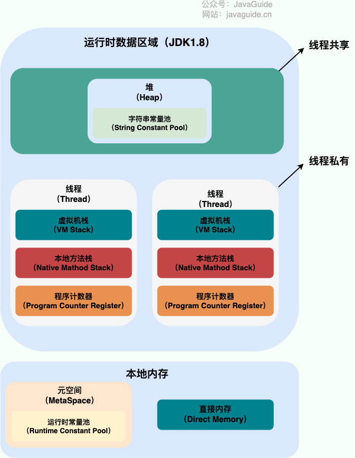

## jni

> 介绍
JNI（Java Native Interface）是Java提供的一种编程框架，用于实现Java和本地代码（如C、C++）之间的交互。通过JNI，Java应用程序可以调用本地代码中的函数，同时本地代码也可以调用Java中的方法。

> 优缺点
`实现对特定平台、硬件或底层功能的访问`。 特定平台或底层的访问
利用Java的跨平台特性，同时结合本地代码的性能优势。 加速运行

使用不当可能导致内存泄漏

> 特性
提供了Java和本地代码之间的`数据交换机制，如将Java对象传递给本地代码，或将本地数据返回给Java应用程序`。 提供了数据交换


## 程序计数器

记录正在执行的虚拟机字节码指令的地址
（如果正在执行的是本地方法则为空）


## Java 虚拟机栈


每个 Java 方法在执行的同时会创建一个栈帧用于存储局部变量表、操作数栈、常量池引用等信息。从方法调用直至执行完成的过程，对应着一个栈帧在 Java 虚拟机栈中入栈和出栈的过程。


## 本地方法栈

native 方法


## 堆

所有对象都在这里分配内存


将堆分成两块：

新生代
老年代


1.7 1.8 区别

1.7 方法区(永久代) 1.8 原空间 移动到直接内存中
    防止内存溢出


## 方法区

用于存放**已被加载**的类信息、常量、静态变量、即时编译器编译后的代码等数据。

对这块区域进行垃圾回收的主要目标是 `对常量池的回收和对类的卸载`

HotSpot 虚拟机把它当成永久代来进行垃圾回收。但很难确定永久代的大小，因为它受到很多因素影响，并且每次 Full GC 之后永久代的大小都会改变，所以经常会抛出 OutOfMemoryError 异常。为了更容易管理方法区，从 JDK 1.8 开始，移除永久代，并把方法区移至元空间，它位于本地内存中，而不是虚拟机内存中。


方法区是一个 JVM 规范，永久代与元空间都是其一种实现方式。在 JDK 1.8 之后，原来永久代的数据被分到了堆和元空间中。元空间存储类的元信息，静态变量和常量池等放入堆中。


## 运行时常量池

运行时常量池是方法区的一部分。

Class 文件中的常量池（编译器生成的字面量和符号引用）会在类加载后被放入这个区域。


## 直接内存

NIO 类，它可以使用 本地函数 直接分配堆外内存
然后通过 Java 堆里的 DirectByteBuffer 对象作为这块内存的引用进行操作。这样能在一些场景中显著提高性能，因为避免了在堆内存和堆外内存来回拷贝数据。


# 垃圾回收

垃圾收集主要是针对堆和方法区进行。程序计数器、虚拟机栈和本地方法栈这三个区域属于线程私有的，只存在于线程的生命周期内，线程结束之后就会消失，因此不需要对这三个区域进行垃圾回收。


## 判断一个对象是否可以被回收

1. 引用计数法

> 介绍
为对象添加一个引用计数器，当对象增加一个引用时计数器加 1，引用失效时计数器减 1。引用计数为 0 的对象可被回收。

> 优缺点
无法解决循环引用问题
循环引用的数据需要被清理,但是引用计数法判断其仍是有效的


2. 可达性分析算法

以 GC Roots 为起始点进行搜索，可达的对象都是存活的，不可达的对象可被回收。
GC Roots 中包含

虚拟机栈中局部变量表中引用的对象
本地方法栈中 JNI 中引用的对象
方法区中类静态属性引用的对象
方法区中的常量引用的对象


## 方法区垃圾收集

类的卸载条件很多，需要满足以下三个条件，并且满足了条件也不一定会被卸载：

该类所有的实例都已经被回收，此时堆中不存在该类的任何实例。
加载该类的 ClassLoader 已经被回收。
该类对应的 Class 对象没有在任何地方被引用，也就无法在任何地方通过反射访问该类方法。


## finalize()
> 介绍
是于关闭资源的一个方法。 但是 try-finally 等方式可以做得更好. 

> 优缺点
该方法运行代价很高，不确定性大，无法保证各个对象的调用顺序，因此最好不要使用。

    当一个对象可被回收时，如果需要执行该对象的 finalize() 方法，那么就有可能在该方法中让对象重新被引用，从而实现自救。自救只能进行一次，如果回收的对象之前调用了 finalize() 方法自救，后面回收时不会再调用该方法。

> 结语


## 引用类型


Java 提供了四种强度不同的引用类型。

#### 1. 强引用

被强引用关联的对象不会被回收。

使用 new 一个新对象的方式来创建强引用。

```java
Object obj = new Object();
```

#### 2. 软引用

被软引用关联的对象只有在内存不够的情况下才会被回收。
使用 SoftReference 类来创建软引用。

```java
Object obj = new Object();
SoftReference<Object> sf = new SoftReference<Object>(obj);
obj = null;  // 使对象只被软引用关联
```

#### 3. 弱引用

被弱引用关联的对象一定会被回收，也就是说它只能存活到下一次垃圾回收发生之前。
使用 WeakReference 类来创建弱引用。

```java
Object obj = new Object();
WeakReference<Object> wf = new WeakReference<Object>(obj);
obj = null;
```

#### 4. 虚引用

又称为幽灵引用或者幻影引用，一个对象是否有虚引用的存在，不会对其生存时间造成影响，也无法通过虚引用得到一个对象。
为一个对象设置虚引用的唯一目的是`能在这个对象被回收时收到一个系统通知`。
使用 PhantomReference 来创建虚引用。

```java
Object obj = new Object();
PhantomReference<Object> pf = new PhantomReference<Object>(obj, null);
obj = null;
```


## 垃圾收集算法

前提 内存分块 相邻块可以合并


1. 标记 - 清除

> 介绍
标记 清除 合并

> 优缺点

产生碎片
效率不高


2. 标记 - 整理

> 介绍
对存活的对象标记 移动到一端 清理其他块

> 优缺点

效率低


3. 复制


> 介绍
内存划分为两块,每次使用一块 复制存活对象到另一块 之后清理

> 优缺点
浪费内存

> 拓展

现在的商业虚拟机都采用这种收集算法回收新生代，但是并不是划分为大小相等的两块，而是一块较大的 Eden 空间和两块较小的 Survivor 空间，每次使用 Eden 和其中一块 Survivor。在回收时，将 Eden 和 Survivor 中还存活着的对象全部复制到另一块 Survivor 上，最后清理 Eden 和使用过的那一块 Survivor。
HotSpot 虚拟机的 Eden 和 Survivor 大小比例默认为 8:1，保证了内存的利用率达到 90%。如果每次回收有多于 10% 的对象存活，那么一块 Survivor 就不够用了，此时需要依赖于老年代进行空间分配担保，也就是借用老年代的空间存储放不下的对象。 注: 意思就是 直接晋升为老年代


### 分代收集

新生代使用：复制算法

老年代使用：标记 - 清除 或者 标记 - 整理 算法


## 几个垃圾收集器


Minor GC 和 Full GC

@


## 内存分配与回收策略


### Minor GC 和 Full GC
- Minor GC：回收`新生代`，因为新生代对象存活时间很短，因此 `Minor` GC 会频繁执行，执行的速度一般也会比较快。
- Full GC：回收`老年代和新生代`，老年代对象其存活时间长，因此 `Full` GC 很少执行，执行速度会比 Minor GC 慢很多。


### 内存分配策略

#### 1. 对象优先在 Eden 分配

大多数情况下，对象在`新生代 Eden` 上分配，当 `Eden 空间不够时，发起 Minor GC`。

#### 2. 大对象直接进入老年代

大对象是指`需要连续内存空间的对象`，最典型的大对象是那种很长的字符串以及数组。
经常出现大对象会提前触发垃圾收集以获取足够的连续空间分配给大对象。
-XX:PretenureSizeThreshold，大于此值的对象直接在老年代分配，避免在 Eden 和 Survivor 之间的大量内存复制。

#### 3. 长期存活的对象进入老年代

为对象定义年龄计数器，`对象在 Eden 出生并经过 Minor GC 依然存活，将移动到 Survivor 中，年龄就增加 1 岁`，增加到一定年龄则移动到老年代中。
-XX:MaxTenuringThreshold 用来定义年龄的阈值。

#### 4. 动态对象年龄判定
虚拟机并不是永远要求对象的年龄必须达到 MaxTenuringThreshold 才能晋升老年代，如果在 Survivor 中**相同年龄所有对象大小的总和大于 Survivor 空间的一半**，则年龄大于或等于该年龄的对象可以直接进入老年代，无需等到 MaxTenuringThreshold 中要求的年龄。

#### 5. 空间分配担保
在发生 Minor GC 之前，虚拟机先检查老年代最大可用的连续空间是否大于新生代所有对象总空间，如果条件成立的话，那么 Minor GC 可以确认是安全的。

如果不成立的话虚拟机会查看 HandlePromotionFailure 的值是否允许担保失败，如果允许那么就会继续检查老年代最大可用的连续空间是否大于历次晋升到老年代对象的平均大小，如果大于，将尝试着进行一次 Minor GC；如果小于，或者 HandlePromotionFailure 的值不允许冒险，那么就要进行一次 Full GC。


### Full GC 的触发条件

对于 Minor GC，其触发条件非常简单，当 Eden 空间满时，就将触发一次 Minor GC。而 Full GC 则相对复杂，有以下条件：


#### 1. 调用 System.gc()
只是建议虚拟机执行 Full GC，但是虚拟机不一定真正去执行。不建议使用这种方式，而是让虚拟机管理内存。
#### 2. 老年代空间不足
老年代空间不足的常见场景为前文所讲的大对象直接进入老年代、长期存活的对象进入老年代等。
为了避免以上原因引起的 Full GC，应当尽量不要创建过大的对象以及数组。除此之外，可以通过 -Xmn 虚拟机参数调大新生代的大小，让对象尽量在新生代被回收掉，不进入老年代。还可以通过 -XX:MaxTenuringThreshold 调大对象进入老年代的年龄，让对象在新生代多存活一段时间。
#### 3. 空间分配担保失败
使用复制算法的 Minor GC 需要老年代的内存空间作担保，如果担保失败会执行一次 Full GC。具体内容请参考上面的第 5 小节。
#### 4. JDK 1.7 及以前的永久代空间不足
在 JDK 1.7 及以前，HotSpot 虚拟机中的方法区是用永久代实现的，永久代中存放的为一些 Class 的信息、常量、静态变量等数据。
当系统中要加载的类、反射的类和调用的方法较多时，永久代可能会被占满，在未配置为采用 CMS GC 的情况下也会执行 Full GC。如果经过 Full GC 仍然回收不了，那么虚拟机会抛出 java.lang.OutOfMemoryError。
为避免以上原因引起的 Full GC，可采用的方法为增大永久代空间或转为使用 CMS GC。
#### 5. Concurrent Mode Failure
执行 CMS GC 的过程中同时有对象要放入老年代，而此时老年代空间不足（可能是 GC 过程中浮动垃圾过多导致暂时性的空间不足），便会报 Concurrent Mode Failure 错误，并触发 Full GC。


## 四、类加载机制
类是在运行期间第一次使用时动态加载的，而不是一次性加载所有类。因为如果一次性加载，那么会占用很多的内存。

### 类的生命周期


包括以下 7 个阶段：

-   **加载（Loading）**  : 加载到内存
-   **验证（Verification）**  检查信息和安全性
-   **准备（Preparation）**  给常量分配空间和赋值 给变量分配空间和赋默认值
-   **解析（Resolution）**  常量池 符号引用->直接引用
-   **初始化（Initialization）**  init
- 使用（Using）
- 卸载（Unloading）


### 类加载过程
包含了加载、验证、准备、解析和初始化这 5 个阶段。


#### 1. 加载
加载是类加载的一个阶段，注意不要混淆。

加载过程完成以下三件事：

- 通过类的完全限定名称获取定义该类的二进制字节流。
- 将该字节流表示的静态存储结构转换为方法区的运行时存储结构。
- 在内存中生成一个代表该类的 Class 对象，作为方法区中该类各种数据的访问入口。


其中二进制字节流可以从以下方式中获取：

- 从 ZIP 包读取，成为 JAR、EAR、WAR 格式的基础。
- 从网络中获取，最典型的应用是 Applet。
- 运行时计算生成，例如动态代理技术，在 java.lang.reflect.Proxy 使用 ProxyGenerator.generateProxyClass 的代理类的二进制字节流。
- 由其他文件生成，例如由 JSP 文件生成对应的 Class 类。


#### 2. 验证
确保 Class 文件的字节流(byte)中包含的信息符合当前虚拟机的要求，并且不会危害虚拟机自身的安全。

#### 3. 准备
类变量是被 static 修饰的变量，准备阶段为类变量分配内存并设置初始值，使用的是方法区的内存。
实例变量不会在这阶段分配内存，它会在对象实例化时随着对象一起被分配在堆中。应该注意到，实例化不是类加载的一个过程，类加载发生在所有实例化操作之前，并且类加载只进行一次，实例化可以进行多次。
初始值一般为 0 值，例如下面的类**变量** value 被初始化为 0 而不是 123。

```java
public static int value = 123;
```
如果类变量是**常量**，那么它将初始化为表达式所定义的值而不是 0。例如下面的常量 value 被初始化为 123 而不是 0。
```java
public static final int value = 123;
```

#### 4. 解析

将常量池的符号引用替换为直接引用的过程。
其中解析过程在某些情况下可以在初始化阶段之后再开始，这是为了支持 Java 的动态绑定。

#### 5. 初始化

初始化阶段才真正开始执行类中定义的 Java 程序代码。初始化阶段是虚拟机执行类构造器 
`clinit\>() `方法的过程。在准备阶段，类变量已经赋过一次系统要求的初始值，而在初始化阶段，根据程序员通过程序制定的主观计划去初始化类变量和其它资源。


### 类初始化时机


#### 1. 主动引用

虚拟机规范中并没有强制约束何时进行加载，但是规范严格规定了有且只有下列五种情况必须对类进行初始化（加载、验证、准备都会随之发生）：
- 遇到 **new、getstatic、putstatic、invokestatic** 这四条字节码指令时，如果类没有进行过初始化，则必须先触发其初始化。最常见的生成这 4 条指令的场景是：**使用 new 关键字实例化对象的时候；读取或设置一个类的静态字段（被 final 修饰、已在编译期把结果放入常量池的静态字段除外）的时候；以及调用一个类的静态方法的时候。**
- 使用 java.lang.reflect 包的方法对类进行**反射**调用的时候，如果类没有进行初始化，则需要先触发其初始化。
- 当初始化一个类的时候，如果发现**其父类还没有进行过初始化**，则需要先触发其父类的初始化。
- 当虚拟机启动时，用户需要指定一个要执行的主类（包含 **main**() 方法的那个类），虚拟机**会先初始化这个主类**；
- 当使用 JDK 1.7 的动态语言支持时，如果一个 java.lang.invoke.MethodHandle 实例最后的解析结果为 REF_getStatic, REF_putStatic, REF_invokeStatic 的方法句柄，并且这个方法句柄所对应的类没有进行过初始化，则需要先触发其初始化；


#### 2. 被动引用
以上 5 种场景中的行为称为对一个类进行主动引用。除此之外，所有引用类的方式都不会触发初始化，称为被动引用。被动引用的常见例子包括：
- 通过子类引用父类的静态字段，不会导致子类初始化。
`System.out.println(SubClass.value);  // value 字段在 SuperClass 中定义`

- 通过数组定义来引用类，不会触发此类的初始化。该过程会对数组类进行初始化，数组类是一个由虚拟机自动生成的、直接继承自 Object 的子类，其中包含了数组的属性和方法。
`SuperClass[] sca = new SuperClass[10];`
?

- 常量在编译阶段会存入调用类的常量池中，本质上并没有直接引用到定义常量的类，因此不会触发定义常量的类的初始化。
`System.out.println(ConstClass.HELLOWORLD);`


### 类与类加载器
两个类相等，需要类本身相等，并且使用同一个类加载器进行加载。这是因为**每一个类加载器都拥有一个独立的类名称空间**
这里的相等，包括类的 Class 对象的 equals() 方法、isAssignableFrom() 方法、isInstance() 方法的返回结果为 true，也包括使用 instanceof 关键字做对象所属关系判定结果为 true。


### 类加载器分类
从 Java 虚拟机的角度来讲，只存在以下两种不同的类加载器：
- 启动类加载器（Bootstrap ClassLoader），使用 C++ 实现，是虚拟机自身的一部分；
- 所有其它类的加载器，使用 Java 实现，独立于虚拟机，继承自抽象类 java.lang.ClassLoader。

从 Java 开发人员的角度看，类加载器可以划分得更细致一些：

- 启动类加载器（Bootstrap ClassLoader）此类加载器负责将存放在 `JRE_HOME\\lib` 目录中的，或者被 -Xbootclasspath 参数所指定的路径中的，并且是虚拟机识别的（仅按照文件名识别，如 rt.jar，名字不符合的类库即使放在 lib 目录中也不会被加载）类库加载到虚拟机内存中。启动类加载器无法被 Java 程序直接引用，用户在编写自定义类加载器时，如果需要把加载请求委派给启动类加载器，直接使用 null 代替即可。

- 扩展类加载器（Extension ClassLoader）这个类加载器是由 ExtClassLoader（sun.misc.Launcher$ExtClassLoader）实现的。它负责将 &lt;JAVA_HOME\>/lib/ext 或者被 java.ext.dir 系统变量所指定路径中的所有类库加载到内存中，开发者可以直接使用扩展类加载器。


- 应用程序类加载器（Application ClassLoader）这个类加载器是由 AppClassLoader（sun.misc.Launcher$AppClassLoader）实现的。由于这个类加载器是 ClassLoader 中的 getSystemClassLoader() 方法的返回值，因此一般称为系统类加载器。它负责加载用户类路径（ClassPath）上所指定的类库，开发者可以直接使用这个类加载器，如果应用程序中没有自定义过自己的类加载器，一般情况下这个就是程序中默认的类加载器。


## store


## 类的初始化

初始化阶段才真正开始执行类中定义的 Java 程序代码。初始化阶段是虚拟机执行类构造器 
`clinit\>() `方法的过程。在准备阶段，类变量已经赋过一次系统要求的初始值，而在初始化阶段，根据程序员通过程序制定的主观计划去初始化类变量和其它资源。

`clinit\>()` 是由编译器自动收集类中所有类变量的赋值动作和静态语句块中的语句合并产生的，编译器收集的顺序由语句在源文件中出现的顺序决定。特别注意的是，静态语句块只能访问到定义在它之前的类变量，定义在它之后的类变量只能赋值，不能访问。例如以下代码：

```java
public class Test {
    static {
        i = 0;                // 给变量赋值可以正常编译通过
        System.out.print(i);  // 这句编译器会提示“非法向前引用”
    }
    static int i = 1;
}
```

由于父类的 &lt;clinit\>() 方法先执行，也就意味着父类中定义的静态语句块的执行要优先于子类。例如以下代码：

```java
static class Parent {
    public static int A = 1;
    static {
        A = 2;
    }
}

static class Sub extends Parent {
    public static int B = A;
}

public static void main(String[] args) {
     System.out.println(Sub.B);  // 2
}
```


## store


## 双亲委派模型
应用程序是由三种类加载器互相配合从而实现类加载，除此之外还可以加入自己定义的类加载器。

下图展示了类加载器之间的层次关系，称为双亲委派模型（Parents Delegation Model）。该模型要求除了顶层的启动类加载器外，其它的类加载器都要有自己的父类加载器。这里的父子关系一般通过组合关系（Composition）来实现，而不是继承关系（Inheritance）。

<div align="center">  </div><br>

#### 1. 工作过程

一个类加载器首先将类加载请求转发到父类加载器，只有当父类加载器无法完成时才尝试自己加载。

#### 2. 好处

使得 Java 类随着它的类加载器一起具有一种带有优先级的层次关系，从而使得基础类得到统一。

例如 java.lang.Object 存放在 rt.jar 中，如果编写另外一个 java.lang.Object 并放到 ClassPath 中，程序可以编译通过。由于双亲委派模型的存在，所以在 rt.jar 中的 Object 比在 ClassPath 中的 Object 优先级更高，这是因为 rt.jar 中的 Object 使用的是启动类加载器，而 ClassPath 中的 Object 使用的是应用程序类加载器。rt.jar 中的 Object 优先级更高，那么程序中所有的 Object 都是这个 Object。

#### 3. 实现

以下是抽象类 java.lang.ClassLoader 的代码片段，其中的 loadClass() 方法运行过程如下：先检查类是否已经加载过，如果没有则让父类加载器去加载。当父类加载器加载失败时抛出 ClassNotFoundException，此时尝试自己去加载。

```java
public abstract class ClassLoader {
    // The parent class loader for delegation
    private final ClassLoader parent;

    public Class<?> loadClass(String name) throws ClassNotFoundException {
        return loadClass(name, false);
    }

    protected Class<?> loadClass(String name, boolean resolve) throws ClassNotFoundException {
        synchronized (getClassLoadingLock(name)) {
            // First, check if the class has already been loaded
            Class<?> c = findLoadedClass(name);
            if (c == null) {
                try {
                    if (parent != null) {
                        c = parent.loadClass(name, false);
                    } else {
                        c = findBootstrapClassOrNull(name);
                    }
                } catch (ClassNotFoundException e) {
                    // ClassNotFoundException thrown if class not found
                    // from the non-null parent class loader
                }

                if (c == null) {
                    // If still not found, then invoke findClass in order
                    // to find the class.
                    c = findClass(name);
                }
            }
            if (resolve) {
                resolveClass(c);
            }
            return c;
        }
    }

    protected Class<?> findClass(String name) throws ClassNotFoundException {
        throw new ClassNotFoundException(name);
    }
}
```

### 自定义类加载器实现

以下代码中的 FileSystemClassLoader 是自定义类加载器，继承自 java.lang.ClassLoader，用于加载文件系统上的类。它首先根据类的全名在文件系统上查找类的字节代码文件（.class 文件），然后读取该文件内容，最后通过 defineClass() 方法来把这些字节代码转换成 java.lang.Class 类的实例。

java.lang.ClassLoader 的 loadClass() 实现了双亲委派模型的逻辑，自定义类加载器一般不去重写它，但是需要重写 findClass() 方法。

```java
public class FileSystemClassLoader extends ClassLoader {

    private String rootDir;

    public FileSystemClassLoader(String rootDir) {
        this.rootDir = rootDir;
    }

    protected Class<?> findClass(String name) throws ClassNotFoundException {
        byte[] classData = getClassData(name);
        if (classData == null) {
            throw new ClassNotFoundException();
        } else {
            return defineClass(name, classData, 0, classData.length);
        }
    }

    private byte[] getClassData(String className) {
        String path = classNameToPath(className);
        try {
            InputStream ins = new FileInputStream(path);
            ByteArrayOutputStream baos = new ByteArrayOutputStream();
            int bufferSize = 4096;
            byte[] buffer = new byte[bufferSize];
            int bytesNumRead;
            while ((bytesNumRead = ins.read(buffer)) != -1) {
                baos.write(buffer, 0, bytesNumRead);
            }
            return baos.toByteArray();
        } catch (IOException e) {
            e.printStackTrace();
        }
        return null;
    }

    private String classNameToPath(String className) {
        return rootDir + File.separatorChar
                + className.replace('.', File.separatorChar) + ".class";
    }
}
```


## jvm调优

set JAVA_OPTS=-Xms256m -Xmx1024m -XX:MetaspaceSize=128m -XX:MaxMetaspaceSize=512m 生效周期

java -jar %JAVA_OPTS% ruoyi-admin.jar

mvn clean package -Dmaven.test.skip=true

顺序是有必要的, 因为有参数的原因
参数为跳过测试 -D表示用来设置系统属性


## JVM





线程私有的：

程序计数器
虚拟机栈
本地方法栈


线程共享的：

堆
方法区


什么是虚拟机栈
栈由一个个栈帧组成
每个栈帧中都拥有：局部变量表、操作数栈、动态链接、方法返回地址
先进后出的数据结构，只支持出栈和入栈两种操作


垃圾回收是否涉及栈
不涉及 主要涉及堆内存 栈弹出之后会自动释放空间

栈内的局部对象是否线程安全
是的
但是如果局部对象引用了外部对象,就不是安全的了


局部变量表 主要存放了编译期可知的各种数据类型

操作数栈 主要作为方法调用的中转站使用，用于存放方法执行过程中产生的中间计算结果。另外，计算过程中产生的临时变量也会放在操作数栈中。


动态链接 主要服务**一个方法需要调用其他方法的场景**。Class 文件的常量池里保存有大量的符号引用比如方法引用的符号引用。当一个方法要调用其他方法，需要将常量池中指向方法的符号引用转化为其在内存地址中的直接引用。动态链接的作用就是为了将符号引用转换为调用方法的直接引用，这个过程也被称为 动态连接 。


## StackOverFlowError  OutOfMemoryError 栈内存溢出
线程请求栈的深度超过当前 Java 虚拟机栈的最大深度的时候，就抛出 StackOverFlowError 错误。
递归调用


除了 StackOverFlowError 错误之外，栈还可能会出现OutOfMemoryError错误，这是因为如果栈的内存大小可以动态扩展， 如果虚拟机在动态扩展栈时无法申请到足够的内存空间，则抛出OutOfMemoryError异常。


## 堆和栈的区别
私有 共有
储存的东西不同


## 虚拟机栈和本地方法栈的异同

虚拟机栈为虚拟机执行 Java 方法 （也就是字节码）服务，而本地方法栈则为虚拟机使用到的 Native 方法服务。


## 堆

> 永久代在堆中

Java 虚拟机所管理的内存中最大的一块，Java 堆是所有线程共享的一块内存区域，在虚拟机启动时创建。此内存区域的唯一目的就是存放对象实例，几乎所有的对象实例以及数组都在这里分配内存。


JDK 1.7 开始已经默认开启逃逸分析，如果某些方法中的对象引用没有被返回或者未被外面使用（也就是未逃逸出去），那么对象可以直接在栈上分配内存。


Java 堆是垃圾收集器管理的主要区域，因此也被称作 GC 堆（Garbage Collected Heap）。从垃圾回收的角度，由于现在收集器基本都采用分代垃圾收集算法，所以 Java 堆还可以细分为：新生代和老年代；再细致一点有：Eden、Survivor、Old 等空间。进一步划分的目的是更好地回收内存，或者更快地分配内存。

JDK 7 版本及 JDK 7 版本之前，堆内存被通常分为下面三部分：


新生代内存(Young Generation)
老生代(Old Generation)
永久代(Permanent Generation)

Eden 区、两个 Survivor 区 S0 和 S1 都属于新生代，中间一层属于老年代，最下面一层属于永久代。

JDK 8 版本之后 PermGen(永久代) 已被 Metaspace(元空间) 取代，元空间使用的是本地内存


大部分情况，对象都会首先在 Eden 区域分配，在一次新生代垃圾回收后，如果对象还存活，则会进入 S0 或者 S1，并且对象的年龄还会加 1(Eden 区->Survivor 区后对象的初始年龄变为 1)，当它的年龄增加到一定程度（默认为 15 岁），就会被晋升到老年代中。对象晋升到老年代的年龄阈值，可以通过参数 -XX:MaxTenuringThreshold 来设置。不过，设置的值应该在 0-15，否则会爆出以下错误：
`MaxTenuringThreshold of 20 is invalid; must be between 0 and 15`


记录年龄的区域在对象头中，这个区域的大小通常是 4 位。


## 方法区


当虚拟机要使用一个类时，它需要读取并解析 Class 文件获取相关信息，再将信息存入到方法区。方法区会存储已被虚拟机加载的 类信息、字段信息、方法信息、常量、静态变量、即时编译器编译后的代码缓存等数据。


## 方法区和永久代以及元空间是什么关系呢？

方法区和永久代以及元空间的关系很像 Java 中接口和类的关系，类实现了接口，这里的类就可以看作是永久代和元空间，接口可以看作是方法区，也就是说永久代以及元空间是 HotSpot 虚拟机对虚拟机规范中方法区的两种实现方式。


永久代有一个 JVM 本身设置的固定大小上限，无法进行调整（也就是受到 JVM 内存的限制）
而元空间使用的是本地内存,受本机内存的限制

-XX：MaxMetaspaceSize 标志设置最大元空间大小，默认值为 unlimited，这意味着它只受系统内存的限制。

永久代会为 GC 带来不必要的复杂度，并且回收效率偏低


## 方法区常用参数有哪些？

1.8之前

```

-XX:PermSize=N //方法区 (永久代) 初始大小
-XX:MaxPermSize=N //方法区 (永久代) 最大大小,超过这个值将会抛出 OutOfMemoryError 异常:java.lang.OutOfMemoryError: PermGen

```


```

-XX:MetaspaceSize=N //设置 Metaspace 的初始（和最小大小）
-XX:MaxMetaspaceSize=N //设置 Metaspace 的最大大小

```


与永久代很大的不同就是，如果不指定大小的话，随着更多类的创建，虚拟机会耗尽所有可用的系统内存。


## 运行时常量池


存放编译期生成的各种字面量（Literal）和符号引用（Symbolic Reference）的 常量池表(Constant Pool Table)

运行时常量池是方法区的一部分


## 字符串常量池

字符串常量池 是 JVM 为了提升性能和减少内存消耗针对字符串（String 类）专门开辟的一块区域，主要目的是为了避免字符串的重复创建。

StringTable 可以简单理解为一个固定大小的HashTable ，容量为 StringTableSize（可以通过 -XX:StringTableSize 参数来设置），保存的是字符串（key）和 字符串对象的引用（value）的映射关系，字符串对象的引用指向堆中的字符串对象。


JDK1.7 之前，字符串常量池存放在永久代。JDK1.7 字符串常量池和静态变量从永久代移动了 Java 堆中。
因为
永久代（方法区实现）的 GC 回收效率太低


## 直接内存
直接内存是一种特殊的**内存缓冲区**，并不在 Java 堆或方法区中分配的，而是通过 JNI 的方式在本地内存上分配的。

直接内存并不是虚拟机运行时数据区的一部分，也不是虚拟机规范中定义的内存区域，但是这部分内存也被频繁地使用。而且也可能导致 OutOfMemoryError 错误出现。

NIO中就使用到了


## 堆外内存
堆外内存就是把内存对象分配在堆外的内存


## HotSpot 虚拟机实战

### 对象的创建


- 0
遇到new指令
是否能在常量池中定位到这个类的引用
没有则进行类加载

- 0
类加载检查通过后，接下来虚拟机将为新生对象分配内存。


分配方式有 “指针碰撞” 和 “空闲列表” 两种，选择哪种分配方式由 Java 堆是否规整决定，而 Java 堆是否规整又由所采用的垃圾收集器是否带有压缩整理功能决定。

指针碰撞： 适用场合：堆内存规整（即没有内存碎片）的情况下。原理：用过的内存全部整合到一边，没有用过的内存放在另一边，中间有一个分界指针，只需要向着没用过的内存方向将该指针移动对象内存大小位置即可。使用该分配方式的 GC 收集器：Serial, ParNew

空闲列表： 适用场合：堆内存不规整的情况下。原理：虚拟机会维护一个列表，该列表中会记录哪些内存块是可用的，在分配的时候，找一块儿足够大的内存块儿来划分给对象实例，最后更新列表记录。使用该分配方式的 GC 收集器：CMS


> 内存分配并发
> 虚拟机采用两种方式来保证线程安全：
> ??
> ??

- 3
初始化0值


- 4 设置对象头

例如这个对象是哪个类的实例、如何才能找到类的元数据信息、对象的哈希码、对象的 GC 分代年龄等信息


- 5 执行init方法


### 对象的内存布局


可以分为 3 块区域：对象头（Header）、实例数据（Instance Data）和对齐填充（Padding）。

对象头包括两部分信息：

    标记字段（Mark Word）：用于存储对象自身的运行时数据， 如哈希码（HashCode）、GC 分代年龄、锁状态标志、线程持有的锁、偏向线程 ID、偏向时间戳等等。
    类型指针（Klass Word）：对象指向它的类元数据的指针，虚拟机通过这个指针来确定这个对象是哪个类的实例。

实例数据部分是对象真正存储的有效信息，也是在程序中所定义的各种类型的字段内容。

对齐填充部分不是必然存在的，也没有什么特别的含义，仅仅起占位作用。 因为 Hotspot 虚拟机的自动内存管理系统要求对象起始地址必须是 8 字节的整数倍，换句话说就是对象的大小必须是 8 字节的整数倍。而对象头部分正好是 8 字节的倍数（1 倍或 2 倍），因此，当对象实例数据部分没有对齐时，就需要通过对齐填充来补全。


### 对象的访问定位

使用句柄、直接指针


## JVM垃圾回收详解


Java 堆是垃圾收集器管理的主要区域，因此也被称作 GC 堆（Garbage Collected Heap）。

由于现在收集器基本都采用分代垃圾收集算法，所以 Java 堆被划分为了几个不同的区域，这样我们就可以根据各个区域的特点选择合适的垃圾收集算法。


对象在新生代中 Eden 区分配。当 Eden 区没有足够空间进行分配时，虚拟机将发起一次 Minor GC。下面我们来进行实际测试一下。

Eden内存不够的话会
通过 分配担保机制 把新生代的对象提前转移到老年代中去


> 大对象直接进入老年代

需要大量连续内存空间的对象（比如：字符串、数组）

    旨在避免将大对象放入新生代，从而减少新生代的垃圾回收频率和成本


G1 垃圾回收器会根据 -XX:G1HeapRegionSize 参数设置的堆区域大小和 -XX:G1MixedGCLiveThresholdPercent 参数设置的阈值，来决定哪些对象会直接进入老年代。


长期存活的对象将进入老年代
对象在 Survivor 中每熬过一次 MinorGC,年龄就增加 1 岁
当它的年龄增加到一定程度（默认为 15 岁），就会被晋升到老年代中。


### 空间分配担保
空间分配担保是为了确保在 Minor GC 之前老年代本身还有容纳新生代所有对象的剩余空间。


## 死亡对象判断方法

### 引用计数法

每当有一个地方引用它，计数器就加 1；
当引用失效，计数器就减 1；
任何时候计数器为 0 的对象就是不可能再被使用的


但是 很难解决对象之间循环引用的问题


### 可达性分析算法

通过一系列的称为 “GC Roots” 的对象作为起点，从这些节点开始向下搜索，节点所走过的路径称为引用链，当一个对象到 GC Roots 没有任何引用链相连的话，则证明此对象是不可用的，需要被回收。

哪些对象可以作为 GC Roots 呢？
虚拟机栈(栈帧中的局部变量表)中引用的对象
本地方法栈(Native 方法)中引用的对象
方法区中类静态属性引用的对象
方法区中常量引用的对象
所有被同步锁持有的对象
JNI（Java Native Interface）引用的对象


### 对象可以被回收，就代表一定会被回收吗？

两次确认


## 引用类型总结
JDK1.2 之前，Java 中引用的定义很传统：如果 reference 类型的数据存储的数值代表的是另一块内存的起始地址，就称这块内存代表一个引用。


JDK1.2 以后，Java 对引用的概念进行了扩充，将引用分为强引用、软引用、弱引用、虚引用四种（引用强度逐渐减弱）


垃圾回收器绝不会回收它

可有可无的生活用品
只要垃圾回收器没有回收它，该对象就可以被程序使用。软引用可用来实现内存敏感的高速缓存。


可有可无的生活用品
只具有弱引用的对象拥有更短暂的生命周期

虚引用并不会决定对象的生命周期。如果一个对象仅持有虚引用，那么它就和没有任何引用一样，在任何时候都可能被垃圾回收。


## 运行时常量池主要回收的是废弃的常量。那么，我们如何判断一个常量是废弃常量呢？


假如在字符串常量池中存在字符串 "abc"，如果当前没有任何 String 对象引用该字符串常量的话，就说明常量 "abc" 就是废弃常量


## 判断一个类是无用的类？

而要判定一个类是否是“无用的类”的条件则相对苛刻许多。类需要同时满足下面 3 个条件才能算是 “无用的类”：


该类所有的实例都已经被回收，也就是 Java 堆中不存在该类的任何实例。
加载该类的 ClassLoader 已经被回收。
该类对应的 java.lang.Class 对象没有在任何地方被引用，无法在任何地方通过反射访问该类的方法。


## 垃圾收集算法

### 标记-清除（Mark-and-Sweep）算法
标记-清除（Mark-and-Sweep）算法分为“标记（Mark）”和“清除（Sweep）”阶段：首先标记出所有不需要回收的对象，在标记完成后统一回收掉所有没有被标记的对象。


效率不高
产生碎片


### 复制算法

将内存分为大小相同的两块，每次使用其中的一块。当这一块的内存使用完后，就将还存活的对象复制到另一块去，然后再把使用的空间一次清理掉。

可用内存变小：可用内存缩小为原来的一半。
不适合老年代：如果存活对象数量比较大，复制性能会变得很差。


### 标记-整理算法


算法是根据老年代的特点提出的一种标记算法，标记过程仍然与“标记-清除”算法一样，但后续步骤不是直接对可回收对象回收，而是让所有存活的对象向一端移动，然后直接清理掉端边界以外的内存。
由于多了整理这一步，因此效率也不高，适合老年代这种垃圾回收频率不是很高的场景。


### 分代收集算法


比如在新生代中，每次收集都会有大量对象死去，所以可以选择”标记-复制“算法，只需要付出少量对象的复制成本就可以完成每次垃圾收集。而老年代的对象存活几率是比较高的，而且没有额外的空间对它进行分配担保，所以我们必须选择“标记-清除”或“标记-整理”算法进行垃圾收集。


## 各种垃圾收集器

@


## .class类文件

一个java文件中可以有多个类,但是只能有一个public类
编译后会生成多个.class 文件


类似一个结构体


## 类的生命周期


类加载过程的第一步，主要完成下面 3 件事情：通过全类名获取定义此类的二进制字节流。将字节流所代表的静态存储结构转换为方法区的运行时数据结构。在内存中生成一个代表该类的 Class 对象，作为方法区这些数据的访问入口。


验证是连接阶段的第一步，这一阶段的目的是确保 Class 文件的字节流中包含的信息符合《Java 虚拟机规范》的全部约束要求，保证这些信息被当作代码运行后不会危害虚拟机自身的安全。


准备阶段是正式为类变量分配内存并设置类变量初始值的阶段，这些内存都将在方法区中分配。对于该阶段有以下几点需要注意：


解析阶段是虚拟机将常量池内的符号引用替换为直接引用的过程。


初始化阶段是执行初始化方法 <clinit> ()方法的过程，是类加载的最后一步，这一步 JVM 才开始真正执行类中定义的 Java 程序代码(字节码)。


卸载类即该类的 Class 对象被 GC。

卸载类需要满足 3 个要求:

该类的所有的实例对象都已被 GC，也就是说堆不存在该类的实例对象。
该类没有在其他任何地方被引用
该类的类加载器的实例已被 GC


## 详解


对于已经加载的类会被放在 ClassLoader 中。在类加载的时候，系统会首先判断当前类是否被加载过。已经被加载的类会直接返回，否则才会尝试加载。


JVM 启动的时候，并不会一次性加载所有的类，而是根据需要去动态加载。也就是说，大部分类在具体用到的时候才会去加载，这样对内存更加友好。


## ClassLoader


`BootstrapClassLoader`(启动类加载器)：最顶层的加载类，由 C++实现，通常表示为 null，并且没有父级，主要用来加载 JDK 内部的核心类库（ %JAVA_HOME%/lib目录下的 rt.jar、resources.jar、charsets.jar等 jar 包和类）以及被 -Xbootclasspath参数指定的路径下的所有类。
`ExtensionClassLoader`(扩展类加载器)：主要负责加载 %JRE_HOME%/lib/ext 目录下的 jar 包和类以及被 java.ext.dirs 系统变量所指定的路径下的所有类。
`AppClassLoader`(应用程序类加载器)：面向我们用户的加载器，负责加载当前应用 classpath 下的所有 jar 包和类。


除了 BootstrapClassLoader 是 JVM 自身的一部分之外，其他所有的类加载器都是在 JVM 外部实现的，并且全都继承自 ClassLoader抽象类。这样做的好处是用户可以自定义类加载器，以便让应用程序自己决定如何去获取所需的类。


每个 ClassLoader 可以通过getParent()获取其父 ClassLoader，如果获取到 ClassLoader 为null的话，那么该类是通过 BootstrapClassLoader 加载的。


> 为什么 获取到 ClassLoader 为null就是 BootstrapClassLoader 加载的呢？ 这是因为BootstrapClassLoader 由 C++ 实现，由于这个 C++ 实现的类加载器在 Java 中是没有与之对应的类的，所以拿到的结果是 null。

## 自定义类加载器


如果我们要自定义自己的类加载器，很明显需要继承 ClassLoader抽象类。

有两个关键的方法：

protected Class loadClass(String name, boolean resolve)：加载指定二进制名称的类，实现了双亲委派机制 。name 为类的二进制名称，resolve 如果为 true，在加载时调用 resolveClass(Class<?> c) 方法解析该类。

protected Class findClass(String name)：根据类的二进制名称来查找类，默认实现是空方法。

> 建议 ClassLoader的子类重写 findClass(String name)方法而不是loadClass(String name, boolean resolve) 方法。

如果我们不想打破双亲委派模型，就重写 ClassLoader 类中的 findClass() 方法即可，无法被父类加载器加载的类最终会通过这个方法被加载。但是，如果想打破双亲委派模型则需要重写 loadClass() 方法。


## 双亲委派模型介绍


ClassLoader 类使用委托模型来搜索类和资源。每个 ClassLoader 实例都有一个相关的父类加载器。需要查找类或资源时，ClassLoader 实例会在试图亲自查找类或资源之前，将搜索类或资源的任务委托给其父类加载器。


## JVM参数


### 堆

显式指定堆内存–Xms和-Xmx

-Xms<heap size>[unit]
-Xmx<heap size>[unit]

heap size 表示要初始化内存的具体大小。
unit 表示要初始化内存的单位。单位为 “ g” (GB)、“ m”（MB）、“ k”（KB）。


-Xms2G -Xmx5G


第二大影响因素是为 Young Generation 在堆内存所占的比例。默认情况下，YG 的最小大小为 1310 MB，最大大小为 无限制。


-XX:NewSize=<young size>[unit]
-XX:MaxNewSize=<young size>[unit]


NewSize 与 MaxNewSize 设为一致:  -Xmn256m


设置老年代与新生代内存的比值。
-XX:NewRatio=1


也就是说老年代和新生代所占比值为 1：1，新生代占整个堆栈的 1/2。


从 Java 8 开始，如果我们没有指定 Metaspace 的大小，随着更多类的创建，虚拟机会耗尽所有可用的系统内存


1.8之前

-XX:PermSize=N #方法区 (永久代) 初始大小
-XX:MaxPermSize=N #方法区 (永久代) 最大大小,超过这个值将会抛出 OutOfMemoryError 异常:java.lang.OutOfMemoryError: PermGen


1.8

-XX:MetaspaceSize=N #表示 Metaspace 使用过程中触发 Full GC 的阈值，只对触发起作用。
-XX:MaxMetaspaceSize=N #设置 Metaspace 的最大大小


Metaspace 的初始容量并不是 -XX:MetaspaceSize 设置，无论 -XX:MetaspaceSize 配置什么值，对于 64 位 JVM 来说，Metaspace 的初始容量都是 21807104（约 20.8m）。

> MetaspaceSize 的默认大小取决于平台，范围从 12 MB 到大约 20 MB。


也就是说，MetaspaceSize 表示 Metaspace 使用过程中触发 Full GC 的阈值，只对触发起作用。


### 垃圾收集器

串行垃圾收集器
并行垃圾收集器
CMS 垃圾收集器
G1 垃圾收集器


-XX:+UseSerialGC
-XX:+UseParallelGC
-XX:+UseConcMarkSweepGC
-XX:+UseG1GC


> GC日志

```
# 必选
# 打印基本 GC 信息
-XX:+PrintGCDetails
-XX:+PrintGCDateStamps
# 打印对象分布
-XX:+PrintTenuringDistribution
# 打印堆数据
-XX:+PrintHeapAtGC
# 打印Reference处理信息
# 强引用/弱引用/软引用/虚引用/finalize 相关的方法
-XX:+PrintReferenceGC
# 打印STW时间
-XX:+PrintGCApplicationStoppedTime

# 可选
# 打印safepoint信息，进入 STW 阶段之前，需要要找到一个合适的 safepoint
-XX:+PrintSafepointStatistics
-XX:PrintSafepointStatisticsCount=1

# GC日志输出的文件路径
-Xloggc:/path/to/gc-%t.log
# 开启日志文件分割
-XX:+UseGCLogFileRotation
# 最多分割几个文件，超过之后从头文件开始写
-XX:NumberOfGCLogFiles=14
# 每个文件上限大小，超过就触发分割
-XX:GCLogFileSize=50M


```


-XX:+HeapDumpOnOutOfMemoryError
-XX:HeapDumpPath=./java_pid<pid>.hprof
-XX:OnOutOfMemoryError="< cmd args >;< cmd args >"
-XX:+UseGCOverheadLimit

1. HeapDumpOnOutOfMemoryError 指示 JVM 在遇到 OutOfMemoryError 错误时将 heap 转储到物理文件中。
2. HeapDumpPath 表示要写入文件的路径; 可以给出任何文件名; 但是，如果 JVM 在名称中找到一个 <pid> 标记，则当前进程的进程 id 将附加到文件名中，并使用.hprof格式
3. OnOutOfMemoryError 用于发出紧急命令，以便在内存不足的情况下执行; 应该在 cmd args 空间中使用适当的命令。例如，如果我们想在内存不足时重启服务器，我们可以设置参数: -XX:OnOutOfMemoryError="shutdown -r" 
4. UseGCOverheadLimit 是一种策略，它限制在抛出 OutOfMemory 错误之前在 GC 中花费的 VM 时间的比例


其他

-server : 启用“ Server Hotspot VM”; 此参数默认用于 64 位 JVM
-XX:+UseStringDeduplication : Java 8u20 引入了这个 JVM 参数，通过创建太多相同 String 的实例来减少不必要的内存使用; 这通过将重复 String 值减少为单个全局 char [] 数组来优化堆内存。
-XX:+UseLWPSynchronization: 设置基于 LWP (轻量级进程)的同步策略，而不是基于线程的同步。
-XX:LargePageSizeInBytes: 设置用于 Java 堆的较大页面大小; 它采用 GB/MB/KB 的参数; 页面大小越大，我们可以更好地利用虚拟内存硬件资源; 然而，这可能会导致 PermGen 的空间大小更大，这反过来又会迫使 Java 堆空间的大小减小。
-XX:MaxHeapFreeRatio : 设置 GC 后, 堆空闲的最大百分比，以避免收缩。

-XX:SurvivorRatio : eden/survivor 空间的比例, 例如-XX:SurvivorRatio=6 设置每个 survivor 和 eden 之间的比例为 1:6。


-XX:+UseLargePages : 如果系统支持，则使用大页面内存; 请注意，如果使用这个 JVM 参数，OpenJDK 7 可能会崩溃。

-XX:+UseStringCache : 启用 String 池中可用的常用分配字符串的缓存。
-XX:+UseCompressedStrings : 对 String 对象使用 byte [] 类型，该类型可以用纯 ASCII 格式表示。
-XX:+OptimizeStringConcat : 它尽可能优化字符串串联操作。


## JDK监视工具


jps (JVM Process Status）: 类似 UNIX 的 ps 命令。用于查看所有 Java 进程的启动类、传入参数和 Java 虚拟机参数等信息；
jstat（JVM Statistics Monitoring Tool）: 用于收集 HotSpot 虚拟机各方面的运行数据;
jinfo (Configuration Info for Java) : Configuration Info for Java,显示虚拟机配置信息;
jmap (Memory Map for Java) : 生成堆转储快照;
jhat (JVM Heap Dump Browser) : 用于分析 heapdump 文件，它会建立一个 HTTP/HTML 服务器，让用户可以在浏览器上查看分析结果。
> JDK9 移除了 jhat；jstack (Stack Trace for Java) : 生成虚拟机当前时刻的线程快照，线程快照就是当前虚拟机内每一条线程正在执行的方法堆栈的集合。


jps -v：输出虚拟机进程启动时 JVM 参数。

jps -m：输出传递给 Java 进程 main() 函数的参数。


@


jconsole 查看死锁
jstack 查看栈


