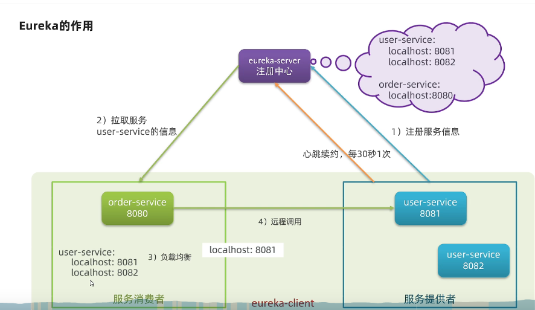

# 微服务技术栈

## 远程调用

### java请求http资源

启动项
```java
@MapperScan("cn.itcast.order.mapper")
@SpringBootApplication
public class OrderApplication{
    public static void main(String[] args){
        SpringApplication.run(OrderApplication.class,args);
    }
    @Bean
    public RestTemplate restTemplate(){
        return new RestTemplate();
    }
}

```

service 中的 queryOrderById
```java
@Service
public class OrderService{
    @Autowired
    private RestTemplate restTemplate;
    public Order queryOrderById(Long orderId){
        Order order=orderMapper.findById(orderId);
        String url ="http://localhost:8081/user/"+order.getUserId();
        User user=restTemplate.getForObject(url,User.classs);
        order.setUser(user);
        return order;
    }
}
```


Feign


@LoadBalanced 是 Spring Cloud 中的一个注解，用于在使用 RestTemplate 进行 HTTP 请求时实现负载均衡。
RestTemplate 服务远程调用 发送http请求
```java
@Bean
public RestTemplate xxrestTemplate(){
    return new RestTemplate();
}
@Autowired
private RestTemplate kkrestTemplate;
String xxurl = "http://localhost:8081/user/"+order.getUserId();
User gguser = kkrestTemplate.getForObject(xxurl, User.class);//第一个参数是路径，第二个参数是你想要拿到什么类型的数据
order.setUser(gguser);//把向用户项目拿到的数据封装到这个订单项目
```

## Feign
Feign声明式客户端
RestTemplate 发起远程调用的代码
```java
String url="http://userservice/user/"+order.getuserId();
User user=restTemplate.getForObject(url,User.class);
```

声明式
编写Feign客户端

类似操作数据库的mapper
例子
```java
@FeignClient("userservice")
public interface UserClient{
	GetMapping("/user/{id}")
	User findById(@PathVariablke("id") Long id);
}
```

引入使用
1. 引入依赖
```yml
<dependency>
	<grouId>org.springframework.cloud<grouId>
	<artifactId>spring-cloud-start-openfeign<artifactId>
</dependency>
```

2. 添加注解
在启动类上标注`@EnableFeignClient`


配置

yml配置
```yml
feign:
	client:
		config:
			default:
				loggerLevel: FULL
```

java代码配置
新建一个类
```java
public class FeignClientConfiguration{
	@Bean
	public Logger.Level feignLogLevel(){
		return Logger.Level.BASIC;
	}
}
```
如果是全局配置,放到`@EnableFeignClients`注解中
```java
@EnableFeignClients(defaultConfigutation=FeignClietnConfiguration.class)
```
如果是局部配置
注解添加到`public interface UserClient{}`上
```java
@FeignClient(value="userservice",configuration=FeignClientConfiguration.class)
```


Feign的性能优化
Feign的底层实现
- URLConnection: **默认** ，不支持连接池
- Apache HttpClient: 支持连接池
- OKHttp: 支持连接池


1. 使用连接池替代默认的
2. 日志级别最好用basic或none


Feign 添加Http Client的支持
- 引入依赖
```yml
<dependency>
	<groupId>io.github.openfeign</groupId>
	<artifactId>feign-httpclient</artifactId>
</dependency>
```
- 配置连接池
```yml
feign:
	client:
		config:
			default:
				loggerLevel: BASIC
	httpclient:
		enable: true
		max-connections: 200 # 最大连接数
		max-connections-per-route: 50 # 每个路径的最大连接数
```


企业中Feign的两种最佳实践
1. 继承

给**消费者FeignClient**和**提供者的controller**定义统一的父接口作为标准

- 但是会产生耦合
- 对springmvc不起效(父接口参数列表中的映射不会被继承)

```java
public interface UserAPI{
	@GetMapping("/user/{id}")
	User findById(@PathVariable("id"))
}
```
客户端
```java
@FeignClient(value="userservice")
public interface UserClient extends UerAPI{

}
```
服务端
```java
@RestController
public class UserController implements UserAPI{

}
```

2. 抽取FeignClient为独立模块,并且把接口有关的POJO,默认的Feign配置都i放在这个文件夹
order-service,pay-service引用上述的独立模块

远程调用user-service


实践
1. 删除service中的Client,Config,User类
2. 新建项目,引入feign的统一api,引入自己写的包

```xml
<dependency>
	<groupID>cn.itcast.demo<groupID>
	<artifactId>feign-api</artifactId>
	<version>1.0</version>
</dependency>
```
3. 修改原来代码中的类的引入位置
4. 发现无法自动注入成功

两种方式
- 指定FeignClient所在的包

@EnableFeignClients(basePackages="cn.itcast.feign.clents")
适合批量
- 指定FeignClient的字节码

@EnableFeignClients(clients={UserClient.class})
适合单独


## 注册中心
Eureka Nacos

### Nasco
服务分级存储
1. 一级是服务
2. 二级是集群 例如杭州 上海
3. 三级是实例

服务搭建
windows平台下载后用命令行直接运行

服务注册到nacos
在clouud-demo父工程中添加spring-cloud-alibaba的管理；依赖
```xml
<dependency>
	<groupId>com.alibaba.cloud</groupId>
	<artifactId>spring-cloud-alibab-dependencies</artifactId>
	<version>2.2.5.RELEASE<version>
	<type>pom</type>
	<scope>import<scope>
</dependency>

```

添加nacos的客户端依赖
```xml
<dependency>
	<groupId>com.alibaba.cloud</groupId>
	<artifactId>spring-cloud-starter-alibaba-nacos-discover</artifactId>
</dependency>
```

修改user-service&order-service中的application.yml文件
```yml
spring:
	cloud:
		nacos:
			server-addr: localhost:8848
```

配置集群属性
```yml
spring:
	cloud:
		nacos:
			discovery:
				cluster-name: HZ #设置集群名称，例如杭州
```


优先修改相同集群的，要修改负载均衡规则
```yml
userservice:
	ribbon:
		NFLoadBalancerRuleClassName: com.alibaba.cloud.nacos.ribbon.NacosRule
```
相同集群中随机挑选


权重
Nacos控制台中编辑，即可修改权重

```
0.1
1   频率越高
0 不被访问
```


环境隔离namespace
不同namespace下的服务不可见
树状图
```
namespace
	group
		service/data 
```	

```yml
spring:
	cloud:
		nacos:
			discovery:
				namespace: 492a7d5d-237b-46a1-a99a-fa8e # 此处填id
```


临时实例和非临时实例
临时实例 采用心跳检测，服务挂掉之后，会直接删除
非临时实例，采用nacos主动询问，挂掉后会报不健康， 不会删除


Eureka 采用pull 
nacos 采用pull + push， 主动推送变更消息

```yml
spring:
	cloud:
		nacos:
			discovery:
				ephemeral: false

```


nacos 配置管理
放入热更新的配置


新建配置
DataID: userservice-dev.yaml
Group: DEFAULT_GROUP
配置文件的内容
```yaml
pattern: 
	dateformat: yyyy-MM-dd HH:mm:ss

```
nacos 中的配置文件会和application.yml中合并

顺序：
bootstrap.yml->nacos配置文件->application.yml
1. 引入nacos配置管理依赖
```yml
<dedpendency>
	<groupId>com.alibaba.cloud</groupId>
	<artifcatId>spring-cloud-starter-alibab-nacos-config</artifcatId>
</dedpendency>
```
2. 在userserives 中的resource目录中添加一个`bootstrap.yml`文件，这个文件是引导文件，优先级高于`application.yml`
```yml
spring:
	applicatioin:
		name: userservice # 服务名字
	profiles:
		active: dev # 环境
	cloud:
		nacos:
			server-addr: localhost:8848 # nacos地址
			config:
				file-extension: yaml # 文件后缀名
```
3. 测试配置是否正常
在controller中测试
```java
@Slf4j
@RestController
@RequestMapping("/user")
@RefreshScope
public claass UserController{
	@Atuowired
	private UserService userService;
	
	@Value("${pattern.dataformat}")
	private String dataformat;
	
	@GetMapping("now")
	public String now(){
		return LocalDataTime.now().format(DataTimeFormatter.ofPattern(dataformat));
	}
}

```

4. 在`@Value`注入的变量所在类上添加注解，添加`@RefreshScope`注解

5. 用`ConfigurationProperties`会自动刷新
```java
@Data
@Component //注册为bean 都可以使用
@ConfigConfigurationProperties(prefix="pattern")
public calss PatternProperties{
	private String dataformate;

}
```


多环境共享配置

在nacos中新建配置,为`userservice.yaml`
```yaml
pattern: 
	envSharedValue: 环境共享属性
```

在Config / PatternProperties 中


```java
@Data
@Component //注册为bean 都可以使用
@ConfigConfigurationProperties(prefix="pattern")
public calss PatternProperties{
	private String envSharedValue;

}
```
优先级
```
profile.yaml -> 服务名称.yaml -> 本地配置
```


nacos集群搭建

1. 搭载mysql集群并初始化数据表
新建一个数据库,命名为nacos,而后导入下面的sql
......
2. 下载解压nacos,修改配置多个,不同端口,其他全相同,分别启动

进入nacos的config目录,修改配置文件cluster.conf.example,重命名为cluster.conf
添加节点信息
```
127.0.0.1:8844
127.0.0.1:8845
127.0.0.1:8846
```

打开mysql的数据源(去掉#)
密码账号还有url

`db.num=1`


分别更改三个server.port

启动

`startup.cmd`
3. nginx 负载均衡
   
在最后追加
config/nginx.conf
```conf
upstream nacos-cluster{
	server 127.0.0.1:8845
	server 127.0.0.1:8846
	server 127.0.0.1:8847
}

server{
	listen: 80;
	server_name localhost;

	location /nacos{ # 访问/nacos这个路径
		proxy_pass http://nacos-cluster;
	}
}
```


### Eureka

eurekaApplication
order 访问两个user服务
user
user


服务端
```xml
<dependency>
    <groupId>org.springframework.cloud</groupId>
    <artifactId>spring-cloud-starter-netflix-eureka-server</artifactId>
</dependency>
```


启动类加入`@EnableEurekaSServer`注解
```yml
server:
    port: 10086
spring:
    application:
        name: eurekaserver # 服务名称
eureka:
    client: 
        service-url:
    defaultZone: http://127.0.0.1:10086/eureka/  # 地址信息
```


客户端
引入eurekaclient依赖`变化`
在application.yml添加名称和地址`不变`
仍为`defaultZone: http://127.0.0.1:10086/eureka/  # 地址信息`


使用和服务配置
修改路径
```java
String url="http://localhost:8081/user"
改为
String url="http://userservice/user"
```

启动项目中加入`@LoadBalance`
不是给启动项加,给RestTemplate 类加


## 负载均衡
Ribbon 

### Ribbon


IRule
自定义
1. 在application类中定义一个新的rule
```java
@Bean
public IRule randomRule(){
    return new RandomRule();
}
对所有微服务都随机(这个类中的)
```
2. 在配置文件中修改


```yml
userservice:
    ribbon:
        NFLoadBalancecrRuleClassName: com.netflix.loadbalancer.RandomRule

```
对某个指定的微服务而言的(这个类中的)


饥饿加载
启动时候就创建类
```yml
ribbon:
    eager-load:
        enable: true
        clients: userservice # 针对这个类
```


## 网关
Gateway SpringGateWay


网关

请求转发
安全认证
流量控制
负载均衡
降级熔断
参数校验

请求转发+请求过滤

先nginx 再 网关


 
SpringGateWay

实现原理
通过过滤器来处理请求

流程
路由判断
请求过滤
服务处理 后端处理
响应过滤 后端处理后再次进行过滤
响应返回

SpringCloud GateWay 断言
如果客户端发送的请求满足了断言的条件,则映射到指定的路由器
可以在配置文件中写明
可以对Cookies 时间 Header Method Path Query 配置


一个路由规则匹配多个断言
如果一个请求可以匹配多个路由,则映射第一个匹配成功的路由

如何实现动态路由
结合`Nacos or  Eureka `注册中心,将配置写到注册中心,进而避免重启

SpringCloud GateWay 过滤器 分类

第一种分类方法
Pre 请求到微服务之前,可以进行拦截和修改
Post 请求完之后,可以修改内容或者响应头

第二种分类方法
GatewayFilter
局部过滤器 应用在单个路由
GlobalFilter
全局 应用在所有路由器上的过滤器


SpringCloud GateWay 支持限流吗
支持 基于Redis

配置全局异常处理
实现 ErrorWebExceptionHandler 并重写 handler 方法

### GateWay

springcloud中网关的实现包括两种
- gateway 响应式 性能更好
- zuul 阻塞式编程,基于servlet


```xml
<dependency>
	<groupId>org.springframework.cloud</grouupId>
	<artifactId>spring-cloud-starter-gateway</artifactId>
</dependency>

<dependency>
	<groupId>com.alibaba.cloud</grouupId>
	<artifactId>spring-cloud-starter-alibaba-nacos-discovery</artifactId>
</dependency>
```
创建主类
```java
public class GatewayApplication{
	public static void main(String[] args){
		SpringApplication.run(GatewayApplication.class,args);
	}
}
```


编写路由配置以及nacos地址

```yml
server:
	port: 10010 # 网关端口
spring: 
	application: 
		name: gateway  # 服务名称
	cloud:
		nacos:
			server-addr: localhost:8848 #nacos地址
		gateway:
			routes:
			-	id: user-service # 路由id,唯一即可
				uri: lb://userservice # lb 就是负载均衡 后面跟上服务名称 loadbalance
				# uri: http://127.0.0.1:8081 # 固定地址
				predicates: # 断言
					- Path=/user/**
```


AddRequstHeader GatewayFilter Factory

```yml
spring: 
	cloud:
		gateway:
			routes:
				filters: 
				- AddRequestHeader=Truth,Itcast is freaking awsome!				
```

```java
@FeignClient("userservice")
public interface UserClient{
	GetMapping("/user/{id}")
	User findById(@PathVariablke("id") Long id,RequestHeader(value="truth",required=false)String truth);
}
```


or 
对于所有的都过滤
```yml
spring: 
	cloud:
		gateway:
			default-filters: 
			- AddRequestHeader=Truth,Itcast is freaking awsome!				
```


全局过滤器 GlobalFilter
通过重写,进而自定义

自定义全局顾虑器,判断参数中是否有authorization,有的话判断是不是admin,同时满足,则放行

新建一个类`AuthorizeFilter`

```java
@Component
public class AuthorizeFilter implements GlobalFilter,Ordered{
	@Override
	public Mono<Void> filter(ServerWebExchange exchange,GatewayFilterChain chain){
		ServerHttpRequest request=exchange.getRequest();
		MultiValueMap<String,String> params=request.getQueryParams();
		String auth=params.getFirst("authorization");
		if("admin".equal(auth)){
			return chain.filter(exchange);
		}
		exchange.getResponse().setStatusCode(HttoStatus.UNAUTHORIZED);
		return exchange.getResponse().setComplete();
	}
	@Override
	public int getOrder(){
		return -1;
	}
}
```

order 值越小,优先级越高,执行顺序越往前
GlobalFilter 通过实现Ordered接口,或者添加@Order注解来指定Order
路由过滤器和dedfaultFilter的order由Spring指定,默认是按照从1递增
当过滤器的order值一样时,会按照`defaultFilter>路由过滤器>GlobalFilter`的顺序执行


### 跨域问题

```yml
spring:
	cloud:
		gateway:
			globalcors:
				add-to-simple-url-handler-mapping: true #解决询问的options请求被拦截
				crosssConfigurations:
					'[/**]':
						allowedOrigins: # 允许那些跨域请求
							-"http://localhost:8090"
							-"http://www.leyou.com"
						allowedMethods: # 允许的ajax请求方式
							-"GET"
							-"POST"
							-"DELETE"
							-"PUT"
							-"OPTIONS"
						allowedHeaders: "*" # 允许在请求中携带的头信息
						allowCredentials: true  # 是否允许携带cookie
						maxAge: 360000 #跨域有效期检测

```


## 分布式搜索
ES

### ES

lucene 开源java语言的搜索引擎类库

1. 易拓展
2. 高性能

1. 只限于java开发
2. 学习曲线陡峭
3. 不支持水平拓展


elasticseacrch

1. 支持分布式,可以水平开发
2. 提供restful接口,可以被任何语言调用


install
```sh
docker network create es-net

docker load -i es.tar

docker - run -d \
	--name es\
	-e "ES_JAVA_OPTS=-Xms512m -Xmx512m" \
	-e "discovery.type=single-node" \
	-v es-data:/usr/share/elasticsearch/data\
	-v es-plugs:/usr/share/elasticsearch/plugins \
	--privileged \
	--network es-net\
	-p 9200:9200 \
	-p 9300:9300 \
elasticsearch:7.12.1
```
`-e "cluster.name=es-docker-cluster"` 设置集群


使用
```json
GET / #测试es是否连接
POST /_analyze
{
	"text": "黑马学习java太棒了",
	"analyzer":"ik_max_word" //ik_min_word
}
```


kibana
给elasticsearch提供可视化界面

安装

```
docker run -d \
--name kibana
-e ELASTICSEARCH_HOSTS=http://es:9200 \
--netwotk=es-net \
-p 5601:5601 \
libana:7.12.1
```

	libana版本要和es版本一样


ik分词器
默认的对中文支持很差


分词器
在线安装
```
docker exec -it elasticsearch /bin/bash

./bin/elasticsearch-plug install
https://github.com/medcl/elasticsearch-analysis-ik/releases/download/v7.12.1/elasticsearch-analysis-ik-7.12.1.zip
exit
docker restart elasticsearch
```


离线安装
```
docker  volume inspect es-plugins
之后将安装包放到指定路径
重启容器
```

词库
用户可以自己拓展词典,可以配置停用的词典
在ik分词器的config目录的`analyzer.cfg.xml`文件中


## 消息队列
rabbit MQ 
SpringAMQP
Kafka

### RabbitMQ
SpringAMQP是基于RabbitMQ封装的一套模板
message queue 消息队列,也就是broker


异步通信
right:
提高吞吐量
解耦

wrong:
依赖broker
架构复杂,不利于追踪


安装
官网
docker


使用
```xml
<dependency>
	<groupId>org.springframework.boot<groupId>
	<artifactId>spring-boot-starter-amqp</artifactId>
</dependency>
```

```yml
spring:
	rabbitmq:
		host: 192.168.150.101
		port: 5672
		virtual-host: / # 虚拟主机
		usrname: itcast
		password: 123321

```

新建测试类,进行测试
```java
@RunWith(SpringRunner.class)
@SpingBootTest
public class SpringAmpqTest{
	@Autowired
	private RabbitTemplate rabbitTemplate;
	@Test
	public void testSimpleQueue(){
		String queueName ="simple..queue";
		String message="hello,Spring amqp!";
		rabbitTemplate.converAndSend(queueName,message);
	}
}
```

接收消息

```java
@Component
public class SpringRabbitListener{
	@RabbitListener(queues="simple.queue")
	public void listenSimpleQueue(String msg){
		System.out.println("消费者收到消息:"+msg);
	}
}
```
修改application.yml

设置preFetch的值,可以控制预取消息的上限

```yml
spring:
	rabbitmq:
		listener:
			simple:
				prefetch: 1 # 默认好像是无穷大

```


workqueue
```java
@Component
public class SpringRabbitListener{
	@RabiitListener(queues="simple.queue");
	public void ListenWorkQueue1(String msg) throw EXception{
		Systemctl.out.println("消费者1接收消息:"+msg);
		Thread.sleep(20);
	}
	@RabiitListener(queues="simple.queue");
	public void ListenWorkQueue2(String msg) throw EXception{
		Systemctl.out.println("消费者2接收消息:"+msg);
		Thread.sleep(200);
	}
```


exchange 引入交换机


```java
@Configuration
public class FanoutConfig{
	@Bean
	public FanoutExchange fanoutExchange()}{
		return new FanoutExchange("itcast.fanout");
	}
	@Bean
	public Queue fanoutQueue1(){
		return new Queue("fanout.queue1");
	}
	@Bean
	public Binding fanoutBinding1(Queue fanoutQueue1,FanoutExchange fanoutExchane){
		return BindingBuilder
		.bind(fanoutQueue1)
		.to(fanoutExchane)
	}
	@Bean
	public Binding fanoutBinding1(Queue fanoutQueue1,FanoutExchange fanoutExchane){
		return BindingBuilder
		.bind(fanoutQueue2)
		.to(fanoutExchane)
	}
	@RabbitListener(queues="fanout.queue1")
	public void listenFanoutQueue1(String msg){
		System.out.println(msg);
	}
	@RabbitListener(queue="fanout.queue2")
	public void listenFanoutQueue2(String msg){ 
		System.out.println(msg);
	}
}
```

Test
```java
@Test
public void testSendFanoutExchange(){
	String exchangeName="itcast.fanout";
	String message="hello";
	rabbitTemplate.convertAndSend(exchangeName,"".message);
}
```


简单声明 && 路由

```java
@RabbitListener(bindings=@QueueBinding(
	value=@Queue(name="direct.queue1");
	exchange=@Exchange(name="itcast.direct",type=ExchangeTypes.DIRECT).
	key={"red","blue"}
))
public void listenDirectQueue1(String msg){
	System.out.println(msg);
}


@RabbitListener(bindings=@QueueBinding(
	value=@Queue(name="direct.queue2");
	exchange=@Exchange(name="itcast.direct",type=ExchangeTypes.DIRECT).
	key={"yellow","blue"}
))
public void listenDirectQueue1(String msg){
	System.out.println(msg);
}
```


testSendFanoutExchange


Test
```java
@Test
public void testSendFanoutExchange(){
	String exchangeName="itcast.direct";
	String message="hello";
	rabbitTemplate.convertAndSend(exchangeName,"blue".message);
}
```


topicExchange
多个单词,以 `.` 分开
`# 0个或者多个`
`* 代指一个`

ex:
1. china.#
2. #.news

```java

@RabbitListener(bindings=@QueueBinding(
	value=@Queue(name="direct.queue1");
	exchange=@Exchange(name="itcast.topic",type=ExchangeTypes.DIRECT).
	key="china.#"
))
public void listenDirectQueue1(String msg){
	System.out.println(msg);
}


@RabbitListener(bindings=@QueueBinding(
	value=@Queue(name="direct.queue2");
	exchange=@Exchange(name="itcast.topic",type=ExchangeTypes.DIRECT).
	key="#.news"
))
public void listenDirectQueue1(String msg){
	System.out.println(msg);
}


```

Test
```java
@Test
public void testSendFanoutExchange(){
	String exchangeName="itcast.direct";
	String message="hello";
	rabbitTemplate.convertAndSend(exchangeName,"china.news".message);
}
```


### 消息转换器 jackson
可以让发送的数据为json类型,而不是java序列化的
jackson
```xml
<dependency>
	<groupId>com.fasterxml.jackson.core</groupId>
	<artifactId>jackson-databind</artifactId>
</dependency>
```


启动类
```java
@Bean
public MessageConverter messageConverter(){
	return new Jackson2JsonMessageConverter();
}
```


消费者,监听object.queue队列并消费信息
```java
@RabbitListener(queues="object.queue")
public void listenObjectQueue(Map<String,Object> msg){
	System.out.println(msg);
}
```


## 不全85-142


