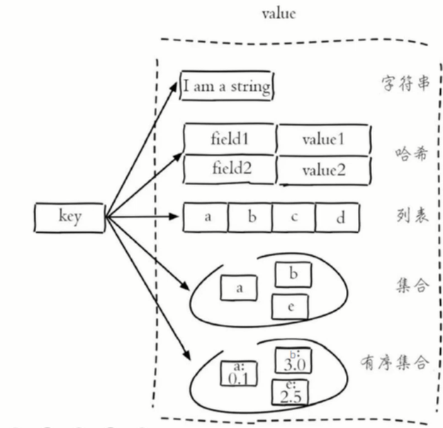

使用场景
缓存 数据库 消息队列

## redis中集群有哪些方案
主从复制 哨兵模式
分片集群


## redis脑裂
在使用哨兵检测节点的时候, 由于网络分区, 哨兵没有检测到主节点, 于是提升了一个从节点为主节点, 但是数据其实仍写入到了原来的主节点. 
之后网络分区恢复之后, 旧的主节点从新的主节点同步数据, 导致大量数据丢失

修改redis配置 设置最少的从节点数量


## 启动

登录
redis-server
redis-server redis.conf
redis-cli


其中常见的options有：
`-h 127.0.0.1`：指定要连接的redis节点的IP地址，默认是127.0.0.1
`-p 6379`：指定要连接的redis节点的端口，默认是6379
`-a 123321`：指定redis的访问密码 


后台启动 
修改配置文件
就在我们之前解压的redis安装包下
（ /usr/local/src/redis-6.2.6 ），名字叫redis.conf：
```conf
cp redis.conf redis.conf.bck
# 允许访问的地址，默认是127.0.0.1，会导致只能在本地访问。修改为0.0.0.0则可以在任意IP访问，生产环境不要设置为0.0.0.0
bind 0.0.0.0
# 守护进程，修改为yes后即可后台运行
daemonize yes
# 密码，设置后访问Redis必须输入密码
requirepass 123321
```

Redis的其它常见配置：

```conf
# 监听的端口
port 6379
# 工作目录，默认是当前目录，也就是运行redis-server时的命令，日志、持久化等文件会保存在这个目录
dir .
# 数据库数量，设置为1，代表只使用1个库，默认有16个库，编号0~15
databases 1
# 设置redis能够使用的最大内存
maxmemory 512mb
# 日志文件，默认为空，不记录日志，可以指定日志文件名
logfile "redis.log"
```


## Redis 数据结构
Redis中默认使用字符串来存储数据的,而且是二进制安全的,这意味着我们可以把很多类型的数据都存放到Redis中

5中基本 5中高级
```sh
String
List
Set
Hash
SortedSet
```



String
```sh
SET
GET
DEL
EXISTS 是否存在
KEYS * 查看也都有哪些键
KEYS *me 匹配
TTL 查看过期时间
FLUSHALL 删除所有
EXPITE name 10 # 设置过期时间
SETEX name 10 # 同上
SETNX name 10 # 不存在的时候设置
```


> 中文支持
> 登录的时候`redis-cli --raw`


List
像一个栈的结构
-1 代表最后一个
```sh
LPUSH letter a # 左插入
LPUSH letter a b c
LRANGE 0 -1 # 所有的元素
RPUSH
RPOP # 删除
LPOP 5 # 删除5个元素
LLEN letter # 查看长度
LTRIM letter [start] [stop] # 删除指定范围以外的
```

Set
不可以添加相同的元素
```sh
SADD crouse Redis
SMEMBERS crouse # 查看所有元素
SISMEMBER crouse Redis # 查看是否在集合中
SREM crouse Redis # 删除
```
支持集合的交集并集等运算


Hash
key value 形式
```
hset person name laoyang
hset person age 100
hget person name
hget persion age
hgetall person
hdel person age
hexists person name # 是否存在 
hkeys person # get all key
hlen person # get the length of person
```


SortedSet

要结合Hash
Z 开头
```
ZADD result 680 清华 660 北大 650 复旦
ZRANGE result 0 -1 
ZRANGE result 9 -1 withscores
zscore result 清华
zrank result 清华
zrevrank result 清华 
zren result 清华
```


## 事务
中间有错误,仍然继续执行
```sh
mutil # 开启事务
set k1 v1
set k2 v2
exec # 执行事务
```


## 持久化
RDB  快照
修改配置文件
xsave 3600 1 # 3600s有一个变化就记录一次

控制台操作
save 生成备份的文件
bgsave # 后台子进程


AOF
修改配置文件
appendonly yes
文件过大
bgrewriteaof 执行重写, 优化大小


## redis 数据删除策略
惰性删除 需要该key的时候,校验是否过期
定期删除 每隔一段时间, 对key进行检查, 删除里面过期的key


## 数据淘汰策略
默认不淘汰任何key 满了会报错
...
allkeys-LRU 最好


## 缓存穿透 击穿 雪崩

缓存穿透
请求的数据不存在
对 某些不存在的数据进行请求 从而 不经过缓存
对不存在的数据缓存一个空数据
过滤


缓存击穿
大量相同的请求
缓存击穿是指某个热点数据在缓存中过期或被删除
在访问数据库的时候加锁 防止大量相同的请求到达数据库


缓存雪崩
大量不同的请求
缓存数据在同一时间大面积失效（过期）  
服务器宕机，导致大量的请求都到达数据库
合理设置缓存过期时间
分布式缓存 集群
对于系统刚启动得到时候可以 预热


缓存一致性
缓存一致性要求数据更新的同时缓存数据也能够实时更新
更新数据的时候更新缓存
读取之前验证缓存是否是最新的


使用互斥锁 强一致性
逻辑过期 高性能

逻辑过期


缓存 “无底洞” 现象
所谓“无底洞”就是说投入越多不一定产出越多。
指的是为了满足业务要求添加了大量缓存节点，但是性能不但没有好转反而下降了的现象。
产生原因：缓存系统通常采用 hash 函数将 key 映射到对应的缓存节点，随着缓存节点数目的增加，键值分布到更多的节点上，导致客户端一次批量操作会涉及**多次网络操作**，这意味着批量操作的耗时会随着节点数目的增加而不断增大。此外，网络连接数变多，对节点的性能也有一定影响。
多次网络操作: 批量操作比如批量获取多个key(例如redis的mget操作)，通常需要从不同实例获取key值，相比于单机批量操作只涉及到一次网络操作，分布式批量操作会涉及到多次网络io。


redis单线程
避免在Redis中执行耗时的操作


## 主从复制
命令行 或者
修改配置文件

replicaof # 指定主节点

主从集群并没有解决海量数据和 高并发写入的问题


## 哨兵模式
哨兵是单独的进程,监视主节点
从节点配置文件中指定主节点,并且连接到主节点
1. `新建 sentinel.conf`
`sentinel monitor master 127.0.0.1 6379 1 `# 有一个哨兵节点同意就可以进行你故障转移
2. `redis-sentinel sentinel.conf`


## 分片集群
集群中有多个master 保存不同数据
master 可以有 多个 slave 节点
master 之间通过 ping 检测是否挂掉
客户端可以请求任意节点, 最后都会转发到正确的节点

写入和读取的时候 计算一下key的hash 从而分配到对应的节点上


## Redis集群


主从集群

分片集群
hash
一致性hash


解决 双写一致 缓存不一致
根据id查询数据时，如果缓存未命中，则查询数据库，将数据库结果写入缓存，并设置超时时间
根据id修改数据时，先修改数据库，再删除缓存


分布式条件下 redis作为缓存
Redis代替session
key 随机串tooken
value 存储的用户的数据
当注册完成后，用户去登录会去校验用户提交的手机号和验证码，是否一致，如果一致，则根据手机号查询用户信息，不存在则新建，最后将用户数据保存到redis，并且生成token作为redis的key，当我们校验用户是否登录时，会去携带着token进行访问，从redis中取出token对应的value，判断是否存在这个数据，如果没有则拦截，如果存在则将其保存到threadLocal中，并且放行。
为何要放到threadlocal中
之后再使用的时候就不用查询第二次了
token 保存在 cookie 中


互斥锁
如果从缓存没有查询到数据，则进行互斥锁的获取，获取互斥锁后，判断是否获得到了锁，如果没有获得到，则休眠，过一会再进行尝试，直到获取到锁为止，才能进行查询

如何保证缓存与数据库的操作的同时成功或失败
单体系统，将缓存与数据库操作放在一个事务
分布式系统，利用TCC等分布式事务方案


## 使用场景

计数器
可以对 String 进行自增自减运算，从而实现计数器功能。
Redis 这种内存型数据库的读写性能非常高，很适合存储频繁读写的计数量。

缓存
将热点数据放到内存中，设置内存的最大使用量以及淘汰策略来保证缓存的命中率。

查找表
例如 DNS 记录就很适合使用 Redis 进行存储。
查找表和缓存类似，也是利用了 Redis 快速的查找特性。但是查找表的内容不能失效，而缓存的内容可以失效，因为缓存不作为可靠的数据来源。

消息队列
List 是一个双向链表，可以通过 lpush 和 rpop 写入和读取消息
不过最好使用 Kafka、RabbitMQ 等消息中间件。

会话缓存
可以使用 Redis 来统一存储多台应用服务器的会话信息。
当应用服务器不再存储用户的会话信息，也就不再具有状态，一个用户可以请求任意一个应用服务器，从而更容易实现高可用性以及可伸缩性。

分布式锁实现
在分布式场景下，无法使用单机环境下的锁来对多个节点上的进程进行同步。
可以使用 Redis 自带的 `SETNX` (set if not exist) 命令实现分布式锁，除此之外，还可以使用官方提供的 RedLock 分布式锁实现。

redisson 是提供了一系列的分布式的Java常用对象
redisson 实现的锁是可重入的(实现原理:一个hash表记录一下) 多个锁重如需要判断是否是同一个线程

redisson 如何控制锁的有效时常

    redisson 提供了一个看门狗, 一个线程获取锁之后, 看门狗会给他续期

redisson 不能解决主从一致性
但是可以用 redlock 实现, 但是性能很低, 要保持数据的强一致性, 可以用消息队列实现分布式锁


其它
Set 可以实现交集、并集等操作，从而实现共同好友等功能。
ZSet 可以实现有序性操作，从而实现排行榜等功能。


# 小点

## 为何redis 是单线程的还这么快
内存
单线程,减少了不必要的上下文切换,也不用考虑线程安全问题
使用IO多路复用 非阻塞IO

## 解释一下IO多路复用
redis的瓶颈在于 网络延迟 而不是 执行速度
IO多路复用是用来提高网络效率的
使用单个线程监听多个 socket 在某个 socket 可读或者是可写的时候发出通知 避免无效的等待


## 非阻塞IO
请求数据的时候,如果数据没准备好,会直接返回错误结果,而不是等待## redis
