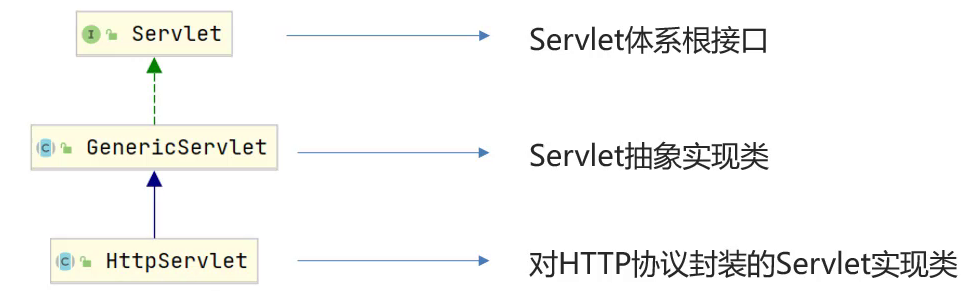

## servlet-tomcat
(1)Request是从客户端向服务端发出的请求对象，
(2)Response是从服务端响应给客户端的结果对象，
(3)JSP是动态网页技术,
(4)会话技术是用来存储客户端和服务端交互所产生的数据，
(5)过滤器是用来拦截客户端的请求,
(6)监听器是用来监听特定事件


#### 手写服务器

服务器可以使用java完成编写
```java
public class Server {
    public static void main(String[] args) throws IOException {
        ServerSocket ss = new ServerSocket(8080); // 监听指定端口
        System.out.println("server is running...");
        while (true){
            Socket sock = ss.accept();
            System.out.println("connected from " + sock.getRemoteSocketAddress());
            Thread t = new Handler(sock);
            t.start();
        }
    }
}

class Handler extends Thread {
    Socket sock;

    public Handler(Socket sock) {
        this.sock = sock;
    }

    public void run() {
        try (InputStream input = this.sock.getInputStream()) {
            try (OutputStream output = this.sock.getOutputStream()) {
                handle(input, output);
            }
        } catch (Exception e) {
            try {
                this.sock.close();
            } catch (IOException ioe) {
            }
            System.out.println("client disconnected.");
        }
    }

    private void handle(InputStream input, OutputStream output) throws IOException {
        BufferedReader reader = new BufferedReader(new InputStreamReader(input, StandardCharsets.UTF_8));
        BufferedWriter writer = new BufferedWriter(new OutputStreamWriter(output, StandardCharsets.UTF_8));
        // 读取HTTP请求:
        boolean requestOk = false;
        String first = reader.readLine();
        if (first.startsWith("GET / HTTP/1.")) {
            requestOk = true;
        }
        for (;;) {
            String header = reader.readLine();
            if (header.isEmpty()) { // 读取到空行时, HTTP Header读取完毕
                break;
            }
            System.out.println(header);
        }
        System.out.println(requestOk ? "Response OK" : "Response Error");
        if (!requestOk) {
            // 发送错误响应:
            writer.write("HTTP/1.0 404 Not Found\r\n");
            writer.write("Content-Length: 0\r\n");
            writer.write("\r\n");
            writer.flush();
        } else {
            // 发送成功响应:
            //读取html文件，转换为字符串
            BufferedReader br = new BufferedReader(new FileReader("http/html/a.html"));
            StringBuilder data = new StringBuilder();
            String line = null;
            while ((line = br.readLine()) != null){
                data.append(line);
            }
            br.close();
            int length = data.toString().getBytes(StandardCharsets.UTF_8).length;
            writer.write("HTTP/1.1 200 OK\r\n");
            writer.write("Connection: keep-alive\r\n");
            writer.write("Content-Type: text/html\r\n");
            writer.write("Content-Length: " + length + "\r\n");
            writer.write("\r\n"); // 空行标识Header和Body的分隔
            writer.write(data.toString());
            writer.flush();
        }
    }
}
```


## Tomcat
Tomcat部署项目
将项目放置到webapps目录下，即部署完成。
war包
Tomcat检测到war包后会自动完成解压缩，在webapps目录下就会多一个haha目录


## Servlet
> a sevlet is a small java programme in web

### 简介
* Servlet是JavaWeb最为核心的内容，它是Java提供的一门==动态==web资源开发技术。
* 使用Servlet就可以实现，根据不同的登录用户在页面上动态显示不同内容。
* Servlet是JavaEE规范之一，其实就是一个接口，将来我们需要定义Servlet类实现Servlet接口，并由web服务器运行Servlet


编写一个Servlet类，最终通过浏览器访问所编写的Servlet程序。==
具体的实现步骤为:

1. 创建Web项目`web-demo`，导入Servlet依赖坐标
```xml
<dependency>
    <groupId>javax.servlet</groupId>
    <artifactId>javax.servlet-api</artifactId>
    <version>3.1.0</version>
    <!--
      此处为什么需要添加该标签?
      provided指的是在编译和测试过程中有效,最后生成的war包时不会加入
       因为Tomcat的lib目录中已经有servlet-api这个jar包，如果在生成war包的时候生效就会和Tomcat中的jar包冲突，导致报错
    -->
    <scope>provided</scope>
</dependency>
```

2. 创建:定义一个类，实现Servlet接口，并重写接口中所有方法，并在service方法中输入一句话
```java
package com.itheima.web;
import javax.servlet.*;
import java.io.IOException;
public class ServletDemo1 implements Servlet {
    public void service(ServletRequest servletRequest, ServletResponse servletResponse) throws ServletException, IOException {
        System.out.println("servlet hello world~");
    }
    public void init(ServletConfig servletConfig) throws ServletException {

    }
    public ServletConfig getServletConfig() {
        return null;
    }

    public String getServletInfo() {
        return null;
    }

    public void destroy() {

    }
}
```

3. 配置:在类上使用@WebServlet注解，配置该Servlet的访问路径
```java
@WebServlet("/demo1")
```
4. 访问:启动Tomcat,浏览器中输入URL地址访问该Servlet

5. 器访问后，在控制台会打印`servlet hello world~` 说明servlet程序已经成功运行。


<!-- ## servlet -->
servlet 是 javaweb的 核心内容
是java 实现的动态web技术
servlet 是java规范之一 我们实现servlet 接口可以借助servelt 服务器运行项目


tomcat 一般作为javaweb项目的web容器
实际上 tomact 是一个servlet 容器
用来托管和处理servlet


### 执行流程 + 生命周期

Servlet 初始化后调用 init () 方法。
    创建一个servlet 实例
Servlet 调用 service() 方法来处理客户端的请求。
    service 会调用 doGet doPost 方法 我们需要重写这些方法
Servlet 销毁前调用 destroy() 方法。
最后，Servlet 是由 JVM 的垃圾回收器进行垃圾回收的。

每个请求都会创建一个线程 执行 根据不同的路径 执行不同的servlet 方法


### 体系结构

通过上面的学习，我们知道要想编写一个Servlet就必须要实现Servlet接口，重写接口中的5个方法，虽然已经能完成要求，但是编写起来还是比较麻烦的，因为我们更关注的其实只有service方法，那有没有更简单方式来创建Servlet呢?

因为我们将来开发B/S架构的web项目，都是针对HTTP协议，所以我们自定义Servlet,会通过继承==HttpServlet==
具体的编写格式如下:
```java
@WebServlet("/demo4")
public class ServletDemo4 extends HttpServlet {
    @Override
    protected void doGet(HttpServletRequest req, HttpServletResponse resp) throws ServletException, IOException {
        //TODO GET 请求方式处理逻辑
        System.out.println("get...");
    }
    @Override
    protected void doPost(HttpServletRequest req, HttpServletResponse resp) throws ServletException, IOException {
        //TODO Post 请求方式处理逻辑
        System.out.println("post...");
    }
}
```
* 要想发送一个GET请求，请求该Servlet，只需要通过浏览器发送`http://localhost:8080/web-demo/demo4`,就能看到doGet方法被执行了
* 要想发送一个POST请求，请求该Servlet，单单通过浏览器是无法实现的，这个时候就需要编写一个form表单来发送请求，在webapp下创建一个`a.html`页面，内容如下:
```html
<!DOCTYPE html>
<html lang="en">
<head>
    <meta charset="UTF-8">
    <title>Title</title>
</head>
<body>
    <form action="/web-demo/demo4" method="post">
        <input name="username"/><input type="submit"/>
    </form>
</body>
</html>
```
启动测试，即可看到doPost方法被执行了。


### urlPattern配置

Servlet类编写好后，要想被访问到，就需要配置其访问路径（==urlPattern==）
* 一个Servlet,可以配置多个urlPattern

```java
package com.itheima.web;
import javax.servlet.ServletRequest;
import javax.servlet.ServletResponse;
import javax.servlet.annotation.WebServlet;
/**
 * urlPattern: 一个Servlet可以配置多个访问路径
*/
@WebServlet(urlPatterns = {"/demo7","/demo8"})
public class ServletDemo7 extends MyHttpServlet {

    @Override
    protected void doGet(ServletRequest req, ServletResponse res) {
        
        System.out.println("demo7 get...");
    }
    @Override
    protected void doPost(ServletRequest req, ServletResponse res) {
    }
}
```
在浏览器上输入`http://localhost:8080/web-demo/demo7`,`http://localhost:8080/web-demo/demo8`这两个地址都能访问到ServletDemo7的doGet方法。


* ==urlPattern配置规则==
* 精确匹配
```java
/**
 * UrlPattern:
 * * 精确匹配
 */
@WebServlet(urlPatterns = "/user/select")
public class ServletDemo8 extends MyHttpServlet {
    @Override
    protected void doGet(ServletRequest req, ServletResponse res) {

        System.out.println("demo8 get...");
    }
    @Override
    protected void doPost(ServletRequest req, ServletResponse res) {
    }
}
```

* 目录匹配
```java
package com.itheima.web;
import javax.servlet.ServletRequest;
import javax.servlet.ServletResponse;
import javax.servlet.annotation.WebServlet;

/**
 * UrlPattern:
 * * 目录匹配: /user/*
 */
@WebServlet(urlPatterns = "/user/*")
public class ServletDemo9 extends MyHttpServlet {
    @Override
    protected void doGet(ServletRequest req, ServletResponse res) {

        System.out.println("demo9 get...");
    }
    @Override
    protected void doPost(ServletRequest req, ServletResponse res) {
    }
}
```

* 扩展名匹配
```java
package com.itheima.web;
import javax.servlet.ServletRequest;
import javax.servlet.ServletResponse;
import javax.servlet.annotation.WebServlet;
/**
 * UrlPattern:
 * * 扩展名匹配: *.do
*/
@WebServlet(urlPatterns = "*.do")
public class ServletDemo10 extends MyHttpServlet {

    @Override
    protected void doGet(ServletRequest req, ServletResponse res) {
        System.out.println("demo10 get...");
    }
    @Override
    protected void doPost(ServletRequest req, ServletResponse res) {
    }
}
```

访问路径`http://localhost:8080/web-demo/任意.do`

==注意==:

1. 如果路径配置的不是扩展名，那么在路径的前面就必须要加`/`否则会报错


2. 如果路径配置的是`*.do`,那么在*.do的前面不能加`/`,否则会报错


* 任意匹配


```java
package com.itheima.web;

import javax.servlet.ServletRequest;
import javax.servlet.ServletResponse;
import javax.servlet.annotation.WebServlet;

/**
 * UrlPattern:
 * * 任意匹配： /
 */
@WebServlet(urlPatterns = "/")
public class ServletDemo11 extends MyHttpServlet {

@Override
protected void doGet(ServletRequest req, ServletResponse res) {

    System.out.println("demo11 get...");
}
@Override
protected void doPost(ServletRequest req, ServletResponse res) {
}
}
```

访问路径`http://localhost:8080/demo-web/任意`

```java
package com.itheima.web;

import javax.servlet.ServletRequest;
import javax.servlet.ServletResponse;
import javax.servlet.annotation.WebServlet;

/**
 * UrlPattern:
 * * 任意匹配： /*
 */
@WebServlet(urlPatterns = "/*")
public class ServletDemo12 extends MyHttpServlet {

@Override
protected void doGet(ServletRequest req, ServletResponse res) {

    System.out.println("demo12 get...");
}
@Override
protected void doPost(ServletRequest req, ServletResponse res) {
}
}

```


**小结**
1. urlPattern总共有四种配置方式，分别是精确匹配、目录匹配、扩展名匹配、任意匹配
2. 五种配置的优先级为 精确匹配 > 目录匹配> 扩展名匹配 > /* > / ,无需记，以最终运行结果为准。
