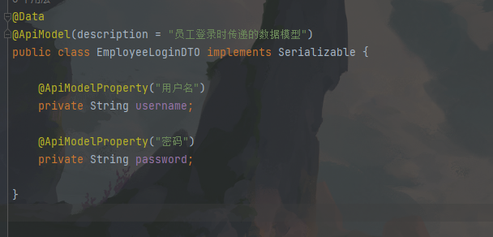

## 整合操作

Lombok
FreeMaker
logback
Thymeleaf
PageHelper
SpringDoc
DevTools热部署
mybatis plus
数据校验validation


典型的Spring Boot项目的树形目录结构：
```
├── src
│   ├── main
│   │   ├── java
│   │   │   └── com
│   │   │       └── example
│   │   │           └── demo
│   │   │               └── DemoApplication.java
│   │   └── resources
│   │       ├── static
│   │       │   └── css
│   │       │       └── style.css
│   │       ├── templates
│   │       │   └── index.html
│   │       ├── application.properties
│   │       └── application.yml
│   └── test
│       ├── java
│       │   └── com
│       │       └── example
│       │           └── demo
│       │               └── DemoApplicationTests.java
│       └── resources
│           └── test.properties
└── pom.xml
```

新建springboot项目
1. 新建一个简单的项目
2. 配置pom
```xml
<parent>
    <groupId>org.springframework.boot</groupId>
    <artifactId>spring-boot-starter-parent</artifactId>
    <version>3.0.6</version>
</parent>
<dependences>
    <dependency>
        <groupId>org.springframework.boot</groupId>
        <artifactId>spring-boot-starter</artifactId>
    </dependency>
    <dependency>
        <groupId>org.springframework.boot</groupId>
        <artifactId>spring-boot-starter-test</artifactId>
    </dependency>
</dependences>
```

web项目
1. 添加web依赖
```xml
<dependency>
  <groupId>org.springframework.boot</groupId>
  <artifactId>spring-boot-starter-web</artifactId>
</dependency>
```
2. 创建控制类
```java
@Controller
public class DemoController {
    @RequestMapping("/show")
    @ResponseBody
    public String show(){
        return "hello springboot"; // 响应给浏览器一句话
    }
}
```
```yaml
server:
  port: 8888
  servlet:
    context-path: /hello
```
其他参考[文档](https://docs.spring.io/spring-boot/docs/current/reference/html/application-properties.html#appendix.application-properties.server)


Lombok
```xml
<dependency>
    <groupId>org.projectlombok</groupId>
    <artifactId>lombok</artifactId>
    <optional>true</optional>
</dependency>
```


整合MyBatis
1. 引入Mybatis 驱动 引入mysql 驱动
~~~xml
<dependencies>

        <!--Mybatis启动器,Mybatis为了整合SpringBoot第三方提供的-->
        <dependency>
            <groupId>org.mybatis.spring.boot</groupId>
            <artifactId>mybatis-spring-boot-starter</artifactId>
            <version>3.0.2</version>
        </dependency>

        <!--MySQL依赖-->
        <dependency>
            <groupId>com.mysql</groupId>
            <artifactId>mysql-connector-j</artifactId>
            <scope>runtime</scope>
        </dependency>
    </dependencies>
~~~
```yml
spring:
  datasource:
  	driver-class-name: com.mysql.cj.jdbc.Driver
    url: jdbc:mysql://127.0.0.1:3306/msbsys?characterEncoding=utf8&useSSL=false&serverTimezone=Asia/Shanghai
    username: root
    password: root
```
mybatis支持注解开发和xml文件开发


整合Druid
~~~xml
<!-- 添加druid启动器-->
<dependency>
    <groupId>com.alibaba</groupId>
    <artifactId>druid-spring-boot-starter</artifactId>
    <version>1.2.11</version>
</dependency>
~~~
~~~yaml
spring:
  datasource:
    type: com.alibaba.druid.pool.DruidDataSource  #底层使用druid连接池
    driver-class-name: com.mysql.cj.jdbc.Driver
    url: jdbc:mysql://localhost:3306/msbsys?serverTimezone=Asia/Shanghai&useSSL=false&characterEncoding=utf8
    username: root
    password: root
    druid:
      # 连接池的配置信息
      initial-size: 5  # 初始化连接数大小
      max-active: 30  # 最大连接数
      min-idle: 5   # 最小连接数
      # 配置获取连接等待超时的时间
      max-wait: 60000  #如果连接都被占用，最大等待时间1min=60000ms
      validation-query: SELECT 1 FROM DUAL  #通过从续表查询来监控是否连接数据库，语句执行能连接，语句不执行没连接
      # 配置一个连接在池中最小空闲的时间，单位是毫秒
      min-evictable-idle-time-millis: 300000
      test-while-idle: true
      # 开启SQL监控、防火墙监控、日志监控
      filters: stat,wall,slf4j
      # 配置DruidStatViewServlet
      stat-view-servlet:
        # 登录名
        login-username: admin
        # 登录密码
        login-password: admin
        url-pattern: /druid/*
        # IP白名单(没有配置或者为空，则允许所有访问)
        allow: 192.167.10.1,127.0.0.1  # 本机和设置的ip可以访问后台管理界面
        reset-enable: false # 不要重置
        # 启用控制台-后台管理界面，必须启用，否则访问界面会404
        enabled: true
~~~


FreeMaker
1. xml
~~~xml
<dependency>
    <groupId>org.springframework.boot</groupId>
    <artifactId>spring-boot-starter-freemarker</artifactId>
</dependency>
~~~
Freemarker 默认默认视图路径文 resources/templates 目录由自动化配置类FreemarkerProperties 类决定
该目录可以进行在application.yml 中进行修改：修改application.yml 添加freemarker 基本配置如下: 
2. yml
```yml
spring:
    freemarker:
        suffix: .ftl # 修改后缀
        content-type: text/html   # 此为默认类型，不设置也没有关系
        charset: UTF-8
        template-loader-path: classpath:/views/ # 修改存放目录,不修改默认就是templates下
```
springboot 2.2.0版本以后，freemaker模版引擎默认的模版文件后缀名由**ftl**改变为**ftlh**。若使用ftl将无法正常映射与展示。ftlh，使freemarker默认以html内容转码输出，以利于模板输出的安全。
3. 创建Controller
编写FreemarkerController 控制器转发视图
~~~java
@Controller
public class MyController {
    @RequestMapping("/test1")
    public String test1(HttpServletRequest req){
        req.setAttribute("msg","msb");
        //返回模板文件名称
        return "test1";
    }
}
~~~
4. 创建Freemarker模板
在resources/views目录下创建test1.ftl文件
~~~java
hi test1.ftl <br>
${msg}
~~~


logback
Spring Boot默认使用Logback组件作为日志管理（官方推出的）。Logback是由log4j创始人设计的一个开源日志组件。
在Spring Boot项目中我们不需要额外的添加Logback的依赖，因为在spring-boot-starter或者spring-boot-starter-web中已经包含了Logback的依赖。
使用案例：打印sql相关日志。在配置文件application.yml中设置：
```yml
# 不改变日志类型和日志规则 只开启mybatis中对应SQL的日志
logging:
  level:
    com.msb.mapper: trace
```


Thymeleaf
1. 在pom.xml中添加Thymeleaf启动器
~~~xml
<!--thymeleaf启动器-->
<dependency>
    <groupId>org.springframework.boot</groupId>
    <artifactId>spring-boot-starter-thymeleaf</artifactId>
</dependency>
~~~
1. 在`resources/template`s文件夹下新建html页面。
```html
<!DOCTYPE html>
<html lang="en" xmlns:th="http://www.thymeleaf.org">
<head>
    <meta charset="UTF-8">
    <title>Title</title>
</head>
<body>
    hi test01.html
</body>
</html>
```
1. 新建控制器
此处方法返回值为页面名称。
~~~java
package com.msb.controller;
@Controller
public class MyController {
    @RequestMapping("/show")
    public String show(){
        System.out.println("执行show方法");
        return "test01";
    }
}
~~~

源码
```java
public class ThymeleafProperties {
    public static final String DEFAULT_PREFIX = "classpath:/templates/";
    public static final String DEFAULT_SUFFIX = ".html";
}
```


PageHelper
在Service中添加入主要的分页逻辑.
SpringBoot整合PageHelper完成分页，可直接利用上面整合代码进行测试。
PageHelper是一个Mybatis分页插件，官网：https://pagehelper.github.io/
现在SpringBoot整合PageHelper完成分页使用非常简单的（以前搞依赖，配置拦截器）
1. 先在pom.xml中导入启动器：**(SpringBoot3 必须整合  1.4.6以上版本，否则不好使)**
```xml
<dependency>
    <groupId>com.github.pagehelper</groupId>
    <artifactId>pagehelper-spring-boot-starter</artifactId>
    <version>1.4.6</version>  
</dependency>
```
1. 编写mapper层
接口：
```java
public interface UserMapper {
    List<User> selectAllUsers();
}
```
mapper.xml:
```xml
<?xml version="1.0" encoding="UTF-8" ?>
<!DOCTYPE mapper
        PUBLIC "-//mybatis.org//DTD Mapper 3.0//EN"
        "https://mybatis.org/dtd/mybatis-3-mapper.dtd">
<mapper namespace="com.msb.mapper.UserMapper">
    <select id="selectAllUsers">
        select
        *
        from
        t_user
    </select>
</mapper>
```
1. 编写业务层
接口：
```java
public interface UserService {
    /**
     *
     * @param pageNum 页码
     * @param pageSize 每页数据大小
     * @return
     */
    PageInfo<User> findAllUsers(int pageNum, int pageSize);
}
```

实现类：
```java
@Service
public class UserServiceImpl implements UserService {
    @Override
    public PageInfo<User> findAllUsers(int pageNum, int pageSize) {
        PageHelper.startPage(pageNum,pageSize);
        List<User> users = userMapper.selectAllUsers();
        // PageInfo是分页查询所有查询结果封装的类，所有的结果都从这个类取
        // 使用PageInfo包装查询后的结果,只需要将PageInfo交给页面就行。
        PageInfo<User> info = new PageInfo<>(users);
        return info;
    }
}
```
4. 编写控制层
```java
@Controller
public class UserController {
    @Autowired
    private UserService userService;

   
    @GetMapping("/user/list")
    @ResponseBody
    public PageInfo<User> selectAll(int pageNum,int pageSize){
        return userService.findAllUsers(pageNum,pageSize);
    }
}
```


SpringDoc
SpringDoc是一个在Spring框架中用于生成API文档的工具,类似 Swagger
```xml
<dependency>
     <groupId>org.springdoc</groupId>
     <artifactId>springdoc-openapi-starter-webmvc-ui</artifactId>
     <version>2.1.0</version>
</dependency>
```
```java
@Configuration
public class SpringDocConfig {
    @Bean
    public OpenAPI restfulOpenAPI() {
        Info info = new Info().title("SpringBoot项目")
                .description("用户管理项目")
                .version("1.0.0");
        return new OpenAPI()
                .info(info);
    }
}
```


DevTools热部署
热部署原理
项目中修改代码后重启的目的：其实就是重新编译生成了新的 Class 文件，这个文件里记录着和代码等对应的各种信息，然后 Class 文件将被虚拟机的 ClassLoader 加载。
热部署在原理上是使用了两个 ClassLoader，一个 ClassLoader 加载那些不会改变的类（第三方 Jar 包），另一个ClassLoader 加载会更改的类，称为 restart ClassLoader。它监听到如果有 Class 文件改动了，原来的 restart ClassLoader 被丢弃，重新创建一个 restart ClassLoader，由于需要加载的类相比较少，不需要人工重启服务器，所以实现了较快的重启时间。
在Spring Boot项目中 通过配置 DevTools  工具（开发者工具）来达到热部署效果。

配置 DevTools 环境
```xml
<!-- DevTools 的坐标 -->
<dependency>
    <groupId>org.springframework.boot</groupId>
    <artifactId>spring-boot-devtools</artifactId>
    <!--项目运行时生效。表示编译时不参与，但是参与项目的测试、打包。该依赖被打包时会被包含。-->
    <scope>runtime</scope>
    <!--设置为true热部署才生效-->
    <optional>true</optional>
</dependency>
```

devtools 可以实现**页面热部署**（即页面修改后会立即生效，这个可以直接在 application.properties 文件中配置 spring.thymeleaf.cache=false 来实现），实现**类文件热部署**（类文件修改后不会立即生效），实现对**属性文件的热部署**。即 devtools 会监听 classpath 下的文件变动，并且会立即重启应用（发生在保存时机），注意：因为其采用的虚拟机机制，该项重启是很快的。配置了后在修改 java 文件后也就支持了热启动，不过这种方式是属于项目重启（速度比较快的项目重启），会清空 session 中的值，也就是如果有用户登陆的话，项目重启后需要重新登陆。
​	默认情况下，/META-INF/maven，/META-INF/resources，/resources，/static，/templates，/public 这些文件夹下的文件修改不会使应用重启，但是会重新加载（ devtools 内嵌了一个 LiveReload server，当资源发生改变时，浏览器刷新）
在 application.yml 中配置 spring.devtools.restart.enabled=false，此时 restart 类加载器还会初始化，但不会监视文件更新。
```yml
spring:
  ## 热部署配置
  devtools:
    restart:
      enabled: true  # 开启热部署
      # 设置热启动路径，这个路径下的内容修改后不需要重启，进行热部署。    
      additional-paths: src/main/java
      # 设置的内容为不让热部署去管理，不需要加载 (其实指的就是编译过的文件，因为热部署只管理变化的内容，编译过的没有变化的内容不加载)
      exclude: WEB-INF/**
```

IDEA 配置
当我们修改了 Java 类后，IDEA 默认是不自动编译的，而 spring-boot-devtools 又是监测 classpath 下的文件发生变化才会重启应用，所以需要设置 IDEA 的自动编译。

自动编译配置
File -> Settings -> Compiler -> Build Project automatically 高级设置- 属性修改-允许auto-make 允许程序在运行的时候自动编译

关闭浏览器缓存
不关闭缓存，浏览器可能还用上次的界面，不是新的内容，找到浏览器，开发者工具（f12）-网络-禁用缓存：


数据校验validation
```xml
<dependency>
    <groupId>org.springframework.boot</groupId>
    <artifactId>spring-boot-starter-validation</artifactId>
</dependency>
```


mybatis plus
```xml
<!--mybatis-plus启动器-->
<dependency>
    <groupId>com.baomidou</groupId>
    <artifactId>mybatis-plus-boot-starter</artifactId>
    <version>3.5.3.1</version>
</dependency>
```
1. 构建实体类
```java
@NoArgsConstructor
@AllArgsConstructor
@Data
@TableName("t_user")  // 对应的数据库中表为t_user,如果数据库中表和实体类名字一致，可以不指定
public class User {
    @TableField(exist = false) // 如果数据库表中没有这个字段，这个字段与数据库表字段对不上，加了这个属性，就不会报错
    private Integer a;
    @TableField("uid") // 指定数据库表中字段名字，如果数据库表字段和属性名字一致，可以不指定
    private Integer id;
    private String uname;
    private String pwd;
    private String realname;
    private Integer identity;
}
```
1. 构建mapper层
mapper接口：
```java
/**
 * 继承BaseMapper接口，该接口中定义了很多基础的增删改查的方法，
 * 所以UserMapper中就不需要定义基础的增删改查方法了
 */
public interface UserMapper extends BaseMapper<User> {
}
```
mapper.xml可以不写了
1. 构建service层
service接口：
```java
/**
 * 继承IService接口，该接口中定义了很多基础的增删改查的方法，
 *  * 所以UserService中就不需要定义基础的增删改查方法了
 */
public interface UserService extends IService<User> {
}
```
service实现类：
```java
/**
 * 如果用UserServiceImpl  直接implements UserService会报错
 * 因为要实现全部的抽象方法
 * 那还不如不继承了，太麻烦了呀
 * mybatis-plus同样给出了解决方案，让UserServiceImpl继承ServiceImpl
 * ServiceImpl有两个泛型，其中一个代表你要注入的mapper，另一个代表你这个实现类中操作的那个表对应的实体类
 * 这样UserServiceImpl中一些基本的方法就不用去写了，除非一些特殊的逻辑底层没提供那你就自己加入
 */
@Service
public class UserServiceImpl extends ServiceImpl<UserMapper, User> implements UserService {
}
```
1. 启动类
启动类加入mapper层扫描：
```java
@SpringBootApplication
public class SpringBootM12Application {
    public static void main(String[] args) {
        SpringApplication.run(SpringBootM12Application.class, args);
    }
}
```
1. 测试
利用单元测试进行测试
```java
@SpringBootTest
class SpringBootM12ApplicationTests {
    @Autowired
    private UserService userService;
    @Test
    void contextLoads() {
        // 查询全部USer：
        List<User> list = userService.list();
        for (User user : list) {
            System.out.println(user);
        }
    }
}
```
1. 测试增删改查
```java
@SpringBootTest
class SpringBootM12ApplicationTests {
    @Autowired
    private UserService userService;
    @Test
    void test01() {
        // 查询全部USer：
        List<User> list = userService.list();
        for (User user : list) {
            System.out.println(user);
        }
    }
    @Test
    void test02() {
        // 带条件的查询：
        // 查询uid>=5的数据
        // QueryWrapper 作用就是在原本的sql上拼接where条件
        // 适用场合：查询、删除、更新
        QueryWrapper<User> q = new QueryWrapper<>();
        q.ge("uid",5);// 条件指定参照使用手册

        List<User> list = userService.list(q); // 将条件传入
        for (User user : list) {
            System.out.println(user);
        }
    }
    @Test
    void test03() {
        // 带条件的查询：
        // 查询uid>=5，uname=fh的数据
        QueryWrapper<User> q = new QueryWrapper<>();
        q.ge("uid", 5).eq("uname","fh");// 多条件追加调用即可
        List<User> list = userService.list(q); // 将条件传入
        for (User user : list) {
            System.out.println(user);
        }
    }
    @Test
    void test04() {
        // 查询单个数据：
        QueryWrapper<User> q = new QueryWrapper<>();
        q.eq("uname","fh");
        User one = userService.getOne(q);
        System.out.println(one);
    }
    @Test
    void test05() {
        // 增加数据：单个增加用save方法，多个用saveBatch方法
        boolean save = userService.save(new User(1, 111, "a", "a", "a", 1));
        System.out.println(save);
    }
    @Test
    void test06() {
        // 更新数据：
        QueryWrapper<User> q = new QueryWrapper<>();
        q.eq("uid","111");
        User u = new User(1, 111, "bbb", "bbb", "bb", 2);
        boolean update = userService.update(u, q);//第一个参数为更新的字段，第二个参数为更新的where条件
        System.out.println(update);
    }
    @Test
    void test07() {
        // 删除数据：
        QueryWrapper<User> q = new QueryWrapper<>();
        q.eq("uid","111");
        boolean remove = userService.remove(q);//第一个参数为更新的字段，第二个参数为更新的where条件
        System.out.println(remove);
    }
}
```
1. 分页操作
mybatis-plus自带分页插件，不用像之前一样整合`PageHelper`了。
（1）想要分页插件生效，先进行配置分页插件，配置分页拦截器：
可以修改为如下，可修改、也可以使用官网的
```java
@Configuration
public class PageConfig {
    /**
     * 新的分页插件,一缓和二缓遵循mybatis的规则,需要设置 MybatisConfiguration#useDeprecatedExecutor = false 避免缓存出现问题(该属性会在旧插件移除后一同移除)
     */
    @Bean
    public MybatisPlusInterceptor mybatisPlusInterceptor() {
        MybatisPlusInterceptor interceptor = new MybatisPlusInterceptor();
        PaginationInnerInterceptor p = new PaginationInnerInterceptor();
        p.setOverflow(false);// 设置是否轮回，就是查到最后一条的时候是否需要轮回到第一条
        p.setMaxLimit(500L);// 单页最大数量500
        p.setDbType(DbType.MYSQL);// 设置数据库类型
        interceptor.addInnerInterceptor(p);
        return interceptor;
    }
}
```
（2）测试方法中：
```java
@SpringBootTest
class SpringBootM12ApplicationTests {
    @Autowired
    private UserService userService;
    @Test
    public void testPage(){
        // 分页查询条件：当前页  页大小
        // 带条件的分页加上QueryWrapper
        QueryWrapper<User> queryWrapper=new QueryWrapper<>();
        queryWrapper.lt("uid", "5");
        Page<User> page = userService.page(new Page<>(1, 3), queryWrapper);
        // 分页返回数据：当前页数据  总页数  总记录数  当前页  页大小 ... ..
        List<User> list = page.getRecords();
        list.forEach(System.out::println);
        System.out.println("总页数:"+page.getPages());
        System.out.println("总记录数:"+page.getTotal());
        System.out.println("当前页:"+page.getCurrent());
        System.out.println("页大小:"+page.getSize());
    }
}
```


## 事务支持
直接使用注解配置即可，无需xml配置内容。
```java
@Service
public class UserServiceImpl implements UserService {
    @Autowired
    private UserMapper userMapper;
    @Override
    public int deleteUserById(Integer uid) {
        int num = userMapper.delete(uid);
        int a = 1/0;
        return num;
    }
}
```
启动服务器，测试：
发现，数据库数据被删除，但是后台报错：
所以必须要加入事务的控制：
```java
@Service
public class UserServiceImpl implements UserService {
    @Autowired
    private UserMapper userMapper;
    @Override
    @Transactional(propagation= Propagation.REQUIRED) //added
    public int deleteUserById(Integer uid) {
        int num = userMapper.delete(uid);
        int a = 1/0;
        return num;
    }
}
```
启动服务器，测试，发现程序报错，数据库数据没有被删除，证明事务加入成功，非常简单的操作！在service层每个增删改方法前都加入@Transactional(propagation = Propagation.REQUIRED)注解即可。


## 异常控制
`template/error/error.html`
如果你整合的是thymeleaf就创建error.html，如果你整合的是freemarker你就创建error.ftl,SpringBoot会自动帮你跳转到异常页
面。
`template/error/404.html`
如果你想不同的异常跳转到不同的页面，可以做如下处理：页面名字设为即将出现错误的状态码


局部异常处理 @ExceptionHandler 
这种处理方式属于局部处理方式，只对当前MyController控制单元中的异常生效
```java
@Controller
public class MyController {
    @RequestMapping("/test1")
    @ResponseBody
    public String test01(){
        System.out.println("test1---");
        int a = 1/0;
        return "test01";
    }
    // 出现算术异常，跳转到如下方法解决：
    @ExceptionHandler(value = {java.lang.ArithmeticException.class})
    public String myexceptionhandler(){
        System.out.println("异常处理逻辑代码。。");
        return "myerror";
    }
}
```

实现全局异常处理 @ControllerAdvice、@ExceptionHandler
```java
@ControllerAdvice // 代表当前类为异常处理类
public class GlobalExceptionHandler {
    // 出现算术异常，跳转到如下方法解决：
    @ExceptionHandler(value = {java.lang.ArithmeticException.class})
    public String myexceptionhandler(){
        System.out.println("异常处理逻辑代码。。");
        return "myerror";
    }
}
```


配置方式处理
```java
public class GlobalExceptionHandler3 implements HandlerExceptionResolver {
    @Override
    public ModelAndView resolveException(HttpServletRequest request, HttpServletResponse response, Object handler, Exception ex) {
        ModelAndView m = new ModelAndView();
        if (ex instanceof ArithmeticException){
            m.setViewName("myerror"); 
        }
        return m;
    }
}
```


## 拦截器
首先定义拦截器，这个与SpringMVC中的学习是一致的，在com.msb.interceptors中定义拦截器：
注意需要加入@Component注解，代表使用容器管理拦截器对象
```java
@Component
public class DemoInterceptor implements HandlerInterceptor {
    @Override
    public boolean preHandle(HttpServletRequest request, HttpServletResponse response, Object handler) throws Exception {
        System.out.println("执行拦截器");
        return true;
    }
    // 省略postHandle、afterCompletion方法，与springmvc中定义一致
}
```

定义好拦截器以后，配置拦截器，在springmvc中是利用xml对拦截器配置进行注册，但是springboot中没有xml配置，怎么处理呢？使用配置类：
```java
@Configuration  // 类上有注解@Configuration,此类相当于SpringMVC配置文件。
public class MyConfig implements WebMvcConfigurer {
    @Autowired
    private DemoInterceptor demoInterceptor;
    //配置拦截器的映射
    @Override
    public void addInterceptors(InterceptorRegistry registry) {

        /*InterceptorRegistration ir = registry.addInterceptor(demoInterceptor);
        InterceptorRegistration ir2 = ir.addPathPatterns("/**");  // 设置拦截路径
        InterceptorRegistration ir3 = ir2.excludePathPatterns("/login"); // 设置不拦截url*/
        // 链式调用
        registry.addInterceptor(demoInterceptor).addPathPatterns("/**").excludePathPatterns("/login");
    }
}
```
registry.addInterceptor(demoInterceptor) —— 代表注册拦截器
addPathPattern() —— 设置拦截路径，拦截哪些URL，/** 拦截全部
excludePathPatterns() —— 不拦截哪些URL

PS：当excludePathPatterns()和addPathPattern()冲突时，excludePathPatterns()生效。
如下：registry.addInterceptor(demoInterceptor).addPathPatterns("/login").excludePathPatterns("/login");


## Mybatis
注解开发
MyBatis提供了多种注解来简化SQL映射的配置，常用的注解包括：
```
@Select： 用于执行查询操作。
@Insert： 用于执行插入操作。
@Update： 用于执行更新操作。
@Delete： 用于执行删除操作。
@Results： 用于配置结果集的映射。
@Result： 用于配置单个结果映射。
@Param： 用于传递参数。
```
```java
import org.apache.ibatis.annotations.*;
@Mapper
public interface UserMapper {
    // 查询用户列表
    @Select("SELECT * FROM user")
    @Results({
        @Result(column="id", property="id"),
        @Result(column="username", property="username"),
        @Result(column="password", property="password")
    })
    List<User> selectAll();
    // 根据ID查询用户
    @Select("SELECT * FROM user WHERE id = #{id}")
    User selectById(@Param("id") Integer id);
    // 插入用户
    @Insert("INSERT INTO user(username, password) VALUES(#{username}, #{password})")
    int insertUser(@Param("username") String username, @Param("password") String password);
    // 更新用户
    @Update("UPDATE user SET username=#{username}, password=#{password} WHERE id=#{id}")
    int updateUser(@Param("id") Integer id, @Param("username") String username, @Param("password") String password);
    // 删除用户
    @Delete("DELETE FROM user WHERE id = #{id}")
    int deleteUser(@Param("id") Integer id);
}
```


xml文件开发
```xml
<?xml version="1.0" encoding="UTF-8" ?>
<!DOCTYPE mapper
  PUBLIC "-//mybatis.org//DTD Mapper 3.0//EN"
  "http://mybatis.org/dtd/mybatis-3-mapper.dtd">
<mapper namespace="com.msb.mapper.UserMapper">
    <select id="selectAllUsers" resultType="com.msb.pojo.User">
        select * from t_user
    </select>
</mapper>
```
xml文件放在resources目录下,并且配置路径
```yml
mybatis:
  mapper-locations: classpath:mapper/*.xml
```
设置实体类包别名
~~~yaml
mybatis:
  type-aliases-package: com.msb.pojo   #给指定包中的所有类起别名
~~~
resultType中改为别名即可：
```xml
<select id="selectAllUsers" resultType="User">
```


@Mapper 和 @MapperScan
接口上加入@Mapper注解，但是这样只会扫描一个接口，或用@MapperScan，扫描整个包。
```
@MapperScan("com.msb.mapper")  // 在启动类上添加注解，表示mapper接口所在位置
```

Lombok
```
@Getter/@Setter: 作用类上，生成所有成员变量的getter/setter方法；
	作用于成员变量上，生成该成员变量的getter/setter方法。
@ToString: 作用于类，覆盖默认的toString()方法
@EqualsAndHashCode: 作用于类，覆盖默认的equals和hashCode
@NoArgsConstructor：生成无参构造器；
@RequiredArgsConstructor：生成包含final和@NonNull注解的成员变量的构造器；
@AllArgsConstructor：生成全参构造器
@Data: 作用于类上，注解集合，使用它相当于使用下列注解：
	@ToString 
	@EqualsAndHashCode 
	@Getter 
	@Setter 
	@RequiredArgsConstructor
@Builder: 作用于类上，将类转变为建造者模式
@Log: 作用于类上，生成日志变量
```


## SpringDoc
利用注解标注在接口的方法上，给方法添加说明信息。SpringDoc会借助相应的注解来生成对应的帮助文档

ApiResponses
```dart
@ApiResponses：用于请求的方法上，表示一组响应，，是一个复合注解，里面包含了多个@ApiResponse子注解。
    @ApiResponse：用在@ApiResponses中，一般用于表达一个错误的响应信息
        code：数字，例如400
        message：信息，例如"请求参数没填好"
        response：抛出异常的类
```
```
@ApiResponses({
    @ApiResponse(code=400, message="请求参数没填好"),
    @ApiResponse(code=404, message="请求路径没有或页面跳转路径不对")
})
```

Schema
用在模型类上,对模型类做注释; 用在属性上,对属性做注释 ;
```dart
@NoArgsConstructor
@AllArgsConstructor
@Data
@Schema(description = "用户实体类")
public class User {
    @Schema(description = "用户id主键")
    private Integer uid;
    @Schema(description =  "用户名字")
    private String uname;
    @Schema(description =  "账户密码")
    private String pwd;
    @Schema(description =  "真实名字")
    private String realname;
    @Schema(description = "身份标识")
    private Integer identity;
}
```


注解的使用案例：
在Controller 上使用注解
```java
@Controller
@Tag(name = "用户模块管理", description = "用户接口")
public class UserController {
    @Autowired
    private UserService userService;

    @GetMapping("/user/{uid}")
    @ResponseBody
    @Operation(summary="用户模块-根据用户id查询用户信息")
    @Parameter(name="uid",description ="查询参数用户id",required = true)
    public User select(@PathVariable Integer uid){
        return userService.findOneUser(uid);
    }

    @PostMapping("/user")
    @Parameter(name = "user",description = "用户信息",required = true)
    @ResponseBody
    @Operation(summary="用户模块-保存用户信息")
    public int save(@RequestBody User user){
        return userService.save(user);
    }

    @PutMapping("/user")
    @ResponseBody
    @Operation(summary="用户模块-更新用户信息")
    public int update(@RequestBody User user){
        return userService.update(user);
    }
    @DeleteMapping("/user/{uid}")
    @ResponseBody
    @Operation(summary="用户模块-根据用户id删除用户信息")
    public int delete(@PathVariable Integer uid){
        return userService.deleteUserById(uid);
    }

    @GetMapping("/user/list")
    @ResponseBody
    @Operation(summary="用户模块-查询用户信息用来分页")
    public PageInfo<User> selectAll(int pageNum,int pageSize){
        return userService.findAllUsers(pageNum,pageSize);
    }

}
```


接口文档访问
swagger 文档形式访问在以下 URL 中提供：http://localhost:8080/swagger-ui/index.html。
json 格式的 OpenAPI 3.0.1 描述将在以下 URL 中提供： http://localhost:8080/v3/api-docs 。
yaml 格式在以下 URL 中提供： http://localhost:8080/v3/api-docs.yaml。
对于 HTML 格式的 swagger 文档的自定义路径，在 config 文件中添加自定义 springdoc 属性：
```
# swagger-ui custom path
springdoc.swagger-ui.path=/swagger-ui.html
```

我们一般使用：http://localhost:8080/swagger-ui/index.html，查看生成的接口文档，查看文档说明信息：


## validation
| 注解         | 功能                                                         |
| :----------- | :----------------------------------------------------------- |
| @AssertFalse | 可以为null,如果不为null的话必须为false                       |
| @AssertTrue  | 可以为null,如果不为null的话必须为true                        |
| @DecimalMax  | 设置不能超过最大值                                           |
| @DecimalMin  | 设置不能超过最小值                                           |
| @Digits      | 设置必须是数字且数字整数的位数和小数的位数必须在指定范围内   |
| @Future      | 日期必须在当前日期的未来                                     |
| @Past        | 日期必须在当前日期的过去                                     |
| @Max         | 最大不得超过此最大值                                         |
| @Min         | 最大不得小于此最小值                                         |
| @NotNull     | 不能为null，可以是空                                         |
| @Min         | 最大不得小于此最小值                                         |
| @Pattern     | 必须满足指定的正则表达式                                     |
| @Size        | 集合、数组、map等的size()值必须在指定范围内                  |
| @Email       | 必须是email格式                                              |
| @Length      | 长度必须在指定范围内                                         |
| @NotBlank    | 字符串不能为null,字符串trim()后也不能等于“”                  |
| @NotEmpty    | 不能为null，集合、数组、map等size()不能为0；字符串trim()后可以等于“” |
| @Range       | 值必须在指定范围内                                           |
| @URL         | 必须是一个URL                                                |

校验注解的使用
User 实体类参数校验注解
如对用户进行删除或者更新操作的时候，对用户的属性值进行一些基本校验：
```java
public class User{
    @NotBlank(message = "用户名不能为空!")
    private String userName;
    @NotBlank(message = "用户密码不能为空!")
    @Length(min = 6, max = 10,message = "密码长度至少6位但不超过10位!")
    private String userPwd;
    /*
      省略get set 方法  
    */
}
```
接口方法形参 @Valid 注解添加, 以生效
@Valid 代表对当前客户端提交的表单参数进行校验
```java
@RestController
public class MyController {
    @PostMapping("/user")
    public int save(@RequestBody @Valid User user){
        System.out.println("进入save方法");
        // 这里有访问service层的代码，省略...模拟return 0 ，主要为了测试参数部分的校验
        return 0;
    }
}
```


## 拦截器
首先定义拦截器，这个与SpringMVC中的学习是一致的，在com.msb.interceptors中定义拦截器：
注意需要加入@Component注解，代表使用容器管理拦截器对象
```java
@Component
public class DemoInterceptor implements HandlerInterceptor {
    @Override
    public boolean preHandle(HttpServletRequest request, HttpServletResponse response, Object handler) throws Exception {
        System.out.println("执行拦截器");
        return true;
    }
    
    // 省略postHandle、afterCompletion方法，与springmvc中定义一致
}
```
定义好拦截器以后，配置拦截器，在springmvc中是利用xml对拦截器配置进行注册，但是springboot中没有xml配置，怎么处理呢？使用配置类：
```java
@Configuration  // 类上有注解@Configuration,此类相当于SpringMVC配置文件。
public class MyConfig implements WebMvcConfigurer {
    @Autowired
    private DemoInterceptor demoInterceptor;
    //配置拦截器的映射
    @Override
    public void addInterceptors(InterceptorRegistry registry) {
        /*InterceptorRegistration ir = registry.addInterceptor(demoInterceptor);
        InterceptorRegistration ir2 = ir.addPathPatterns("/**");  // 设置拦截路径
        InterceptorRegistration ir3 = ir2.excludePathPatterns("/login"); // 设置不拦截url*/
        // 链式调用
        registry.addInterceptor(demoInterceptor).addPathPatterns("/**").excludePathPatterns("/login");
    }
}
```
registry.addInterceptor(demoInterceptor) —— 代表注册拦截器
addPathPattern() —— 设置拦截路径，拦截哪些URL，/** 拦截全部
excludePathPatterns() —— 不拦截哪些URL
PS：当excludePathPatterns()和addPathPattern()冲突时，excludePathPatterns()生效。
如下：registry.addInterceptor(demoInterceptor).addPathPatterns("/login").excludePathPatterns("/login");


拦截器应用案例
案例：非登录状态下无法访问静态资源
创建登录页面login.html:
```html
<!DOCTYPE html>
<html lang="en">
<head>
    <meta charset="UTF-8">
    <title>Title</title>
</head>
<body>
    <form action="login">
        <input type="text" name="uname">
        <input type="password" name="pwd">
        <input type="submit" value="登录">
    </form>
</body>
</html>
```
点击登录按钮，跳转到login控制单元： com.msb.controller.MyController:
```java
@Controller
public class LoginController {
    @RequestMapping("/login")
    public String login(String uname, String pwd, HttpServletRequest req){
        System.out.println("---" + uname + "---" + pwd);
        if ("lili".equals(uname) && "123123".equals(pwd)){
            // 登录成功在session作用域中存入数据：
            req.getSession().setAttribute("uname",uname);
            // 登录成功跳转到主页面：
            return "main";
        }
       return "redirect:/login.html";
    }
}
```
登录成功，跳转如main.html中：resources/templates/main.html:
```html
<!DOCTYPE html>
<html lang="en">
<head>
    <meta charset="UTF-8">
    <title>Title</title>
</head>
<body>
这是主页
</body>
</html>
```
启动服务器，测试，发现 ：http://localhost:8080/a.html 、  http://localhost:8080/login.html都可以直接访问，对于a.html来说，应该是登录后才可以访问，怎么处理呢？使用拦截器：
加入拦截器类：com.msb.interceptors.LoginInterceptor:
```java
@Component
public class LoginInterceptor implements HandlerInterceptor {
    @Override
    public boolean preHandle(HttpServletRequest request, HttpServletResponse response, Object handler) throws Exception {
        // 如果登录过，就放行：
        if (request.getSession().getAttribute("uname") != null){
            return true;
        }
        // 如果没有登录过，先进行登录：(重定向)
        response.sendRedirect("login.html");
        return false; // 不放行
    }
}
```
注册拦截器：com.msb.config.MyConfig:
```java
@Configuration
public class MyConfig implements WebMvcConfigurer {
    @Autowired
    private LoginInterceptor loginInterceptor;
    //配置拦截器的映射
    @Override
    public void addInterceptors(InterceptorRegistry registry) {
        // 拦截所有路径
        // 但是对：login.html放行，向后台提交login的时候放行。
        registry.addInterceptor(loginInterceptor).addPathPatterns("/**").excludePathPatterns("/login","/login.html");//链式调用
    }
}
```
测试：在没有登录的情况下直接访问：http://localhost:8080/a.html 不可以，会直接跳转到：  http://localhost:8080/login.html。案例成功。
但是新的问题又出现了，如果在login.html中有其他的静态资源：
```html
<!DOCTYPE html>
<html lang="en">
<head>
    <meta charset="UTF-8">
    <title>Title</title>
</head>
<body>
    <form action="login">
        <input type="text" name="uname">
        <input type="password" name="pwd">
        <input type="submit" value="登录">
    </form>


</body>
</html>
```
那么访问login.html的时候：
因为你请求login.html,login.html中有a.png这个静态资源，拦截器中处理的是这个静态资源拦截会又跳转到login.html，进入login.html中又会请求a.png.....反复......
那怎么处理呢？在没登录的情况下，(登录界面的 //HACK)图片资源、js资源、css资源应该放行，所以在拦截器中加入静态资源的放行：
```java
@Configuration
public class MyConfig implements WebMvcConfigurer {
    @Autowired
    private LoginInterceptor loginInterceptor;
    //配置拦截器的映射
    @Override
    public void addInterceptors(InterceptorRegistry registry) {
        // 拦截所有路径
        // 但是对：login.html放行，向后台提交login的时候放行。
        registry.addInterceptor(loginInterceptor).addPathPatterns("/**").excludePathPatterns("/login","/login.html","/css/**","/js/**","/images/**");//链式调用
    }
}
```


## Bean管理
之前在异常处理中我们使用了利用配置类来完成全局异常处理的方式：
```java
@Configuration
public class GlobalExceptionHandler2 {
    @Bean
    public SimpleMappingExceptionResolver getSME(){
        SimpleMappingExceptionResolver sme = new SimpleMappingExceptionResolver();
        Properties p = new Properties();
        p.put("java.lang.ArithmeticException","myerror");
        sme.setExceptionMappings(p);
        return sme;
    }
}
```
利用@Configuration、@Bean注解来完成。因为Spring Boot 中没有XML文件，所以所有的Bean管理都放入在一个配置类中实现。
配置类就是类上具有@Configuration的类。这个类就相当于之前的applicationContext.xml。
现在我们就重点讲一下这个bean管理，通过案例来感受，我们构建一个Student类，然后构建Student类对象：
**在com.msb.pojo下构建Student类：**
```java
public class Student {
    private int id;
    private String name;
    //省略 getter setter 构造
}
```

Springboot 所以所有的Bean管理都放入在一个配置类中实现：
创建包com.msb.config，在下面定义配置类：MyConfig:
```java
@Configuration  // 加入这个注解，代表当前为配置类，可以替代xml
public class MyConfig {
    // 相当于以前的bean标签,s相当于以前的id
    // 如果括号中s没有写，那么id相当于方法名：getStudent
    @Bean("s")
    public Student getStudent(){
        Student s = new Student();
        s.setId(1);
        s.setName("zs");  //这个过程就相当于之前给对象注入属性的过程
        return s;
    }
}
```
利用单元测试，测试s对象：
```java
@SpringBootTest
class SpringBootM10ApplicationTests {
    /*
     将对象注入
     先按照类型注入，如果该类型对象有多个再按照名字
     */
    @Autowired
    private Student stu;
    @Test
    void contextLoads() {
        System.out.println(stu);
    }
}
```
我们用这种方式，一般都是创建Spring框架封装的对象，如异常案例中的：SimpleMappingExceptionResolver。

注入高级   @Qualifier("s2") 
@Autowired的注入：先按照类型注入，如果该类型对象有多个再按照名字**，那么问题来了，如果真的有多个类型相同的对象呢？**
比如：
```java
@Configuration 
public class MyConfig {
    @Bean("s")
    public Student getStudent(){
        Student s = new Student();
        s.setId(1);
        s.setName("zs");  
        return s;
    }
    @Bean("s2")
    public Student getStudent2(){
        Student s = new Student();
        s.setId(2);
        s.setName("ls");  
        return s;
    }
}
```
那么测试类中如何写呢？
```java
@SpringBootTest
class SpringBootM10ApplicationTests {
    @Autowired
    @Qualifier("s2")  // Spring容器中存在同类型的Bean通过Bean的名称获取到Bean对象,需要@Autowired、@Qualifier结合使用
    private Student stu;

    @Test
    void contextLoads() {
        System.out.println(stu);
    }
}
```


## apache POI
Apache POI 是一个流行的开源Java库，提供了一组API，用于处理各种微软文档格式，如Word、Excel和PowerPoint。它允许用户以编程方式创建、修改和提取这些文档的内容
```xml
<dependency>
    <groupId>org.apache.poi</groupId>
    <artifactId>poi</artifactId>
    <version>3.9</version>
</dependency>
<dependency>
    <groupId>org.apache.poi</groupId>
    <artifactId>poi-ooxml</artifactId>
    <version>3.9</version>
</dependency>
```

```java
@SpringBootTest  
public class POI {  
    @Test  
    public void write() throws Exception {  
        //创建一个excel文件  
        XSSFWorkbook excel=new XSSFWorkbook();  
        //在excel中创建一页  
        XSSFSheet sheet=excel.createSheet("info");  
        XSSFRow row=sheet.createRow(1);  
  
        row.createCell(1).setCellValue("姓名");  
        row.createCell(2).setCellValue("城市");  
  
        row= sheet.createRow(2);  
        row.createCell(1).setCellValue("张三");  
        row.createCell(2).setCellValue("北京");  
  
        FileOutputStream outputStream=new FileOutputStream(new File("E:/test/info.xlsx"));  
        excel.write(outputStream);  
  
        outputStream.close();  
    }  
  
    @Test  
    public void read() throws Exception {  
        InputStream inputStream=new FileInputStream((new File("E:/test/info.xlsx")));  
        XSSFWorkbook excel=new XSSFWorkbook(inputStream);  
        XSSFSheet sheet=excel.getSheetAt(0);  
        int lastRowNum=sheet.getLastRowNum();  
        for (int i = 1; i<=lastRowNum; i++) {  
            //get line  
            XSSFRow row=sheet.getRow(i);  
            //read line  
            String cellValue=row.getCell(1).getStringCellValue();  
            String cellValue2=row.getCell(2).getStringCellValue();  
            System.out.println(cellValue+":"+cellValue2);  
        }  
        inputStream.close();  
    }  
}
```


## Swagger 接口文档
@Api
类上
Controller

@ApiOperation
方法上
例如Controller中的方法

@ApiModel
类上
entity DTO VO

@ApiModelProperty
属性上,描述属性信息
属性方法



## HttpClient
使用java发送get和post请求
```xml
<dependency>  
    <groupId>org.apache.httpcomponents</groupId>  
    <artifactId>httpclient</artifactId>  
</dependency>
```
```java
@SpringBootTest  
public class HttpClientTest {  
    @Test  
    public void testGet() throws Exception {  
        CloseableHttpClient closeableHttpClient= HttpClients.createDefault();  
        HttpGet httpGet=new HttpGet("http://www.baidu.com");  
  
        CloseableHttpResponse closeableHttpResponse=closeableHttpClient.execute(httpGet);  
  
        int statusCode=closeableHttpResponse.getStatusLine().getStatusCode();  
        System.out.println("服务器返回的状态码是："+statusCode);  
  
        HttpEntity httpEntity=closeableHttpResponse.getEntity();  
        String body= EntityUtils.toString(httpEntity);  
  
        System.out.println(body);  
  
        closeableHttpResponse.close();  
        closeableHttpClient.close();  
    }  
    @Test  
    public void testPost() throws Exception {  
        CloseableHttpClient httpClient= HttpClients.createDefault();  
        HttpPost httpPost=new HttpPost("http://");  
        JSONObject jsonObject=new JSONObject();  
        jsonObject.put("username","admin");  
        jsonObject.put("password","123456");  
        StringEntity stringEntity=new StringEntity(jsonObject.toString());  
        stringEntity.setContentEncoding("utf_8");  
        stringEntity.setContentType("application/json");  
        httpPost.setEntity(stringEntity);  
        CloseableHttpResponse closeableHttpResponse = httpClient.execute(httpPost);  
        int statusCode=closeableHttpResponse.getStatusLine().getStatusCode();  
        System.out.println("响应码为:"+statusCode);  
        HttpEntity httpEntity=closeableHttpResponse.getEntity();  
        String body=EntityUtils.toString(httpEntity);  
        System.out.println("相应数据为"+body);  
        closeableHttpResponse.close();  
        httpClient.close();  
    }  
}
```

HttpClientUtil 封装好的工具类

```java
public class HttpClientUtil {
    static final  int TIMEOUT_MSEC = 5 * 1000;
    /**
     * 发送GET方式请求
     * @param url
     * @param paramMap
     * @return
     */
    public static String doGet(String url,Map<String,String> paramMap){
        // 创建Httpclient对象
        CloseableHttpClient httpClient = HttpClients.createDefault();

        String result = "";
        CloseableHttpResponse response = null;

        try{
            URIBuilder builder = new URIBuilder(url);
            if(paramMap != null){
                for (String key : paramMap.keySet()) {
                    builder.addParameter(key,paramMap.get(key));
                }
            }
            URI uri = builder.build();

            //创建GET请求
            HttpGet httpGet = new HttpGet(uri);

            //发送请求
            response = httpClient.execute(httpGet);

            //判断响应状态
            if(response.getStatusLine().getStatusCode() == 200){
                result = EntityUtils.toString(response.getEntity(),"UTF-8");
            }
        }catch (Exception e){
            e.printStackTrace();
        }finally {
            try {
                response.close();
                httpClient.close();
            } catch (IOException e) {
                e.printStackTrace();
            }
        }

        return result;
    }

    /**
     * 发送POST方式请求
     * @param url
     * @param paramMap
     * @return
     * @throws IOException
     */
    public static String doPost(String url, Map<String, String> paramMap) throws IOException {
        // 创建Httpclient对象
        CloseableHttpClient httpClient = HttpClients.createDefault();
        CloseableHttpResponse response = null;
        String resultString = "";

        try {
            // 创建Http Post请求
            HttpPost httpPost = new HttpPost(url);

            // 创建参数列表
            if (paramMap != null) {
                List<NameValuePair> paramList = new ArrayList();
                for (Map.Entry<String, String> param : paramMap.entrySet()) {
                    paramList.add(new BasicNameValuePair(param.getKey(), param.getValue()));
                }
                // 模拟表单
                UrlEncodedFormEntity entity = new UrlEncodedFormEntity(paramList);
                httpPost.setEntity(entity);
            }

            httpPost.setConfig(builderRequestConfig());

            // 执行http请求
            response = httpClient.execute(httpPost);

            resultString = EntityUtils.toString(response.getEntity(), "UTF-8");
        } catch (Exception e) {
            throw e;
        } finally {
            try {
                response.close();
            } catch (IOException e) {
                e.printStackTrace();
            }
        }

        return resultString;
    }

    /**
     * 发送POST方式请求
     * @param url
     * @param paramMap
     * @return
     * @throws IOException
     */
    public static String doPost4Json(String url, Map<String, String> paramMap) throws IOException {
        // 创建Httpclient对象
        CloseableHttpClient httpClient = HttpClients.createDefault();
        CloseableHttpResponse response = null;
        String resultString = "";

        try {
            // 创建Http Post请求
            HttpPost httpPost = new HttpPost(url);

            if (paramMap != null) {
                //构造json格式数据
                JSONObject jsonObject = new JSONObject();
                for (Map.Entry<String, String> param : paramMap.entrySet()) {
                    jsonObject.put(param.getKey(),param.getValue());
                }
                StringEntity entity = new StringEntity(jsonObject.toString(),"utf-8");
                //设置请求编码
                entity.setContentEncoding("utf-8");
                //设置数据类型
                entity.setContentType("application/json");
                httpPost.setEntity(entity);
            }

            httpPost.setConfig(builderRequestConfig());

            // 执行http请求
            response = httpClient.execute(httpPost);

            resultString = EntityUtils.toString(response.getEntity(), "UTF-8");
        } catch (Exception e) {
            throw e;
        } finally {
            try {
                response.close();
            } catch (IOException e) {
                e.printStackTrace();
            }
        }

        return resultString;
    }
    private static RequestConfig builderRequestConfig() {
        return RequestConfig.custom()
                .setConnectTimeout(TIMEOUT_MSEC)
                .setConnectionRequestTimeout(TIMEOUT_MSEC)
                .setSocketTimeout(TIMEOUT_MSEC).build();
    }

}
```


## java WebSocket
```xml
websocket
```
websocket.html
```html
<!DOCTYPE HTML>
<html>
<head>
    <meta charset="UTF-8">
    <title>WebSocket Demo</title>
</head>
<body>
    <input id="text" type="text" />
    <button onclick="send()">发送消息</button>
    <button onclick="closeWebSocket()">关闭连接</button>
    <div id="message">
    </div>
</body>
<script type="text/javascript">
    var websocket = null;
    var clientId = Math.random().toString(36).substr(2);
    //判断当前浏览器是否支持WebSocket
    if('WebSocket' in window){
        //连接WebSocket节点
        websocket = new WebSocket("ws://localhost:8080/ws/"+clientId);
    }
    else{
        alert('Not support websocket')
    }
    //连接发生错误的回调方法
    websocket.onerror = function(){
        setMessageInnerHTML("error");
    };
    //连接成功建立的回调方法
    websocket.onopen = function(){
        setMessageInnerHTML("连接成功");
    }
    //接收到消息的回调方法
    websocket.onmessage = function(event){
        setMessageInnerHTML(event.data);
    }
    //连接关闭的回调方法
    websocket.onclose = function(){
        setMessageInnerHTML("close");
    }
    //监听窗口关闭事件，当窗口关闭时，主动去关闭websocket连接，防止连接还没断开就关闭窗口，server端会抛异常。
    window.onbeforeunload = function(){
        websocket.close();
    }
    //将消息显示在网页上
    function setMessageInnerHTML(innerHTML){
        document.getElementById('message').innerHTML += innerHTML + '<br/>';
    }
    //发送消息
    function send(){
        var message = document.getElementById('text').value;
        websocket.send(message);
    }
	//关闭连接
    function closeWebSocket() {
        websocket.close();
    }
</script>
</html>
```

配置类
```java
/**
 * WebSocket配置类，用于注册WebSocket的Bean
 */
@Configuration
public class WebSocketConfiguration {
    @Bean
    public ServerEndpointExporter serverEndpointExporter() {
        return new ServerEndpointExporter();
    }
}
```

工具类
```java
/**
 * WebSocket服务
 */
@Component
@ServerEndpoint("/ws/{sid}")
public class WebSocketServer {
    //存放会话对象
    private static Map<String, Session> sessionMap = new HashMap();
    /**
     * 连接建立成功调用的方法
     */
    @OnOpen
    public void onOpen(Session session, @PathParam("sid") String sid) {
        System.out.println("客户端：" + sid + "建立连接");
        sessionMap.put(sid, session);
    }
    /**
     * 收到客户端消息后调用的方法
     *
     * @param message 客户端发送过来的消息
     */
    @OnMessage
    public void onMessage(String message, @PathParam("sid") String sid) {
        System.out.println("收到来自客户端：" + sid + "的信息:" + message);
    }
    /**
     * 连接关闭调用的方法
     *
     * @param sid
     */
    @OnClose
    public void onClose(@PathParam("sid") String sid) {
        System.out.println("连接断开:" + sid);
        sessionMap.remove(sid);
    }
    /**
     * 群发
     *
     * @param message
     */
    public void sendToAllClient(String message) {
        Collection<Session> sessions = sessionMap.values();
        for (Session session : sessions) {
            try {
                //服务器向客户端发送消息
                session.getBasicRemote().sendText(message);
            } catch (Exception e) {
                e.printStackTrace();
            }
        }
    }
}
```

使用
```java
@Component
public class WebSocketTask {
    @Autowired
    private WebSocketServer webSocketServer;
    /**
     * 通过WebSocket每隔5秒向客户端发送消息
     */
    @Scheduled(cron = "0/5 * * * * ?")
    public void sendMessageToClient() {
        webSocketServer.sendToAllClient("这是来自服务端的消息：" + DateTimeFormatter.ofPattern("HH:mm:ss").format(LocalDateTime.now()));
    }
}
```


## SpringTask
corn表达式
```
1 2 3 4 5 6 7
秒 分钟 小时  日 月 周 年
```
xml
spring-context

启动类
@EnableScheduling
类
@Scheduled (corn="0/5 * * * * ?")


## SpringCash

```xml
<dependency>  
    <groupId>org.springframework.boot</groupId>  
    <artifactId>spring-boot-starter-cache</artifactId>  
</dependency>
```

```
@EnableCashing # 启动类注解
@Casheable # 查询缓存
@CashePut # 返回数据放到缓存
@CashEvict # 删除缓存
```

用于Controller
```java
@CachePut(cacheNames = "userCash",key="#result.id") // #result.id 取到的是返回值
```
```java
@Cacheable(cacheNames="userCache",key="#id") //key的生成 userCache::10
public Result<DishVO> er(@PathVariable Long id){  
    log.info("根据id查询菜品");  
    DishVO dishVO=dishService.getByIdWithFlavor(id);  
    return Result.success(dishVO);  
}
```
```java
@CacheEvict(cacheNames="userCache",key="#id")
or
@CacheEcivt(cacheNames="userCache",allEvtries=true)
```


## use Redis in Java
1. 
```xml
<dependency>
```
2. 
```yml
spring:
 redis:
	 host:
	 port:
	 password:
	database: 10 # 默认使用0号数据库
```
3.  配置类,创建ResidTemplate对象
```java
@Configuration  
@Slf4j  
public class RedisConfiguration {  
    @Bean // 此处使用注解可以注入RedisConnectionFactory  
    public RedisTemplate redisTemplate(RedisConnectionFactory redisConnectionFactory){  
        RedisTemplate redisTemplate = new RedisTemplate();  
        redisTemplate.setConnectionFactory(redisConnectionFactory);  
        redisTemplate.setKeySerializer(new StringRedisSerializer());  
        return redisTemplate;  
    }  
}
```
4. 通过RedisTemplate对象操作Redis
```java
@Autowired  
private RedisTemplate redisTemplate;  
@Test  
public void springRedisTest(){  
    System.out.println(redisTemplate);  
    ValueOperations valueOperations =redisTemplate.opsForValue();  
    HashOperations hashOperations=redisTemplate.opsForHash();  
    ListOperations listOperations= redisTemplate.opsForList();  
    SetOperations setOperations=redisTemplate.opsForSet();  
    ZSetOperations zSetOperations=redisTemplate.opsForZSet();  
}
```

简单的redis操作示例
```java
@SpringBootTest  
public class SpringRedisTest {  
    @Autowired  
    private RedisTemplate redisTemplate;  
    @Test  
    public void testString(){  
        redisTemplate.opsForValue().set("city","beijing");  
        String city=(String) redisTemplate.opsForValue().get("city");  
        System.out.println(city);  
    }  
}
```

实际使用
在Controller中使用 
```java
// @GetMapping("/list")  
// @ApiOperation("根据分类id查询菜品")  
// public Result<List<DishVO>> list(Long cateGoryId) {  
//     Dish dish=new Dish();  
//     dish.setCategoryId(cateGoryId);  
//     dish.setStatus(StatusConstant.ENABLE);  
//     List<DishVO> list=dishService.listWithFlavor(dish);  
//     return Result.success(list);  
// }  
@Autowired  
private RedisTemplate redisTemplate;  

@GetMapping("/list")  
@ApiOperation("根据分类id查询菜品")  
public Result<List<DishVO>> list(Long cateGoryId) {  
    String key = "dish_" + cateGoryId;  
    List<DishVO> list=(List<DishVO>)redisTemplate.opsForValue().get(key);  
    if(list!=null&&list.size()>0){  
        return Result.success(list);  
    }  
    Dish dish=new Dish();  
    dish.setCategoryId(cateGoryId);  
    dish.setStatus(StatusConstant.ENABLE);  
    list=dishService.listWithFlavor(dish);  
    redisTemplate.opsForValue().set(key,list);  
    return Result.success(list);  
}
```

新增和修改需要清理缓存数据
```java
private void cleanCache(String pattern){  
    Set keys =redisTemplate.keys(pattern);  
    redisTemplate.delete(keys);  
}
```
```java
@ApiOperation("修改菜品")  
public Result update(@RequestBody DishDTO dishDTO){  
    log.info("修改菜品:{}",dishDTO);  
    dishService.updateWithFlavor(dishDTO);  
    cleanCache("dish_*");   # 此处
    return Result.success();  
}
```


## 拦截器 和 登陆验证的实现
拦截器类
```java
@Component
@Slf4j
public class JwtTokenAdminInterceptor implements HandlerInterceptor {
    @Autowired
    private JwtProperties jwtProperties;
    public boolean preHandle(HttpServletRequest request, HttpServletResponse response, Object handler) throws Exception {
        //判断当前拦截到的是Controller的方法还是其他资源
        if (!(handler instanceof HandlerMethod)) {
            //当前拦截到的不是动态方法，直接放行
            return true;
        }
        //1、从请求头中获取令牌
        String token = request.getHeader(jwtProperties.getAdminTokenName());
        //2、校验令牌
        try {
            log.info("jwt校验:{}", token);
            Claims claims = JwtUtil.parseJWT(jwtProperties.getAdminSecretKey(), token);
            Long empId = Long.valueOf(claims.get(JwtClaimsConstant.EMP_ID).toString());
            log.info("当前员工id：", empId);
            BaseContext.setCurrentId(empId);
            //3、通过，放行
            return true;
        } catch (Exception ex) {
            //4、不通过，响应401状态码
            response.setStatus(401);
            return false;
        }
    }
}
```

配置类
```java
@Configuration
public class WebConfig implements WebMvcConfigurer {
    @Autowired
    private JwtTokenAdminInterceptor jwtTokenAdminInterceptor;
    @Override
    public void addInterceptors(InterceptorRegistry registry) {
        registry.addInterceptor(jwtTokenAdminInterceptor)
                .addPathPatterns("/**") // 添加需要拦截的路径
                .excludePathPatterns("/login"); // 排除不需要拦截的路径
    }
}
```

JwtUtil
```java
public class JwtUtil {
    public static String createJWT(String secretKey, long ttlMillis, Map<String, Object> claims) {
        // 指定签名的时候使用的签名算法，也就是header那部分
        SignatureAlgorithm signatureAlgorithm = SignatureAlgorithm.HS256;

        // 生成JWT的时间
        long expMillis = System.currentTimeMillis() + ttlMillis;
        Date exp = new Date(expMillis);

        // 设置jwt的body
        JwtBuilder builder = Jwts.builder()
                // 如果有私有声明，一定要先设置这个自己创建的私有的声明，这个是给builder的claim赋值，一旦写在标准的声明赋值之后，就是覆盖了那些标准的声明的
                .setClaims(claims)
                // 设置签名使用的签名算法和签名使用的秘钥
                .signWith(signatureAlgorithm, secretKey.getBytes(StandardCharsets.UTF_8))
                // 设置过期时间
                .setExpiration(exp);

        return builder.compact();
    }

    /**
     * Token解密
     *
     * @param secretKey jwt秘钥 此秘钥一定要保留好在服务端, 不能暴露出去, 否则sign就可以被伪造, 如果对接多个客户端建议改造成多个
     * @param token     加密后的token
     * @return
     */
    public static Claims parseJWT(String secretKey, String token) {
        // 得到DefaultJwtParser
        Claims claims = Jwts.parser()
                // 设置签名的秘钥
                .setSigningKey(secretKey.getBytes(StandardCharsets.UTF_8))
                // 设置需要解析的jwt
                .parseClaimsJws(token).getBody();
        return claims;
    }

}
```


Controller 中
```java
@PostMapping("/login")
@ApiOperation("登录接口")
public Result<EmployeeLoginVO> login(@RequestBody EmployeeLoginDTO employeeLoginDTO) {
    log.info("员工登录：{}", employeeLoginDTO);
    Employee employee = employeeService.login(employeeLoginDTO);
    //登录成功后，生成jwt令牌
    Map<String, Object> claims = new HashMap<>();
    claims.put(JwtClaimsConstant.EMP_ID, employee.getId());
    String token = JwtUtil.createJWT(
            jwtProperties.getAdminSecretKey(),
            jwtProperties.getAdminTtl(),
            claims);
    EmployeeLoginVO employeeLoginVO = EmployeeLoginVO.builder()
            .id(employee.getId())
            .userName(employee.getUsername())
            .name(employee.getName())
            .token(token)
            .build();
    return Result.success(employeeLoginVO);
}
```

## nginx
解决跨域和负载均衡
```conf
upstream webservers{
	  server 127.0.0.1:8081 weight=90 ;
	  #server 127.0.0.1:8088 weight=10 ;
	}
    server {
        listen       81;
        server_name  localhost;

        #charset koi8-r;

        #access_log  logs/host.access.log  main;

        location / {
            root   html/sky;
            index  index.html index.htm;
        }

        #error_page  404              /404.html;

        # redirect server error pages to the static page /50x.html
        #
        error_page   500 502 503 504  /50x.html;
        location = /50x.html {
            root   html;
        }

        # 反向代理,处理管理端发送的请求
        # /api/employee -> admin/employee
        location /api/ {
			proxy_pass   http://localhost:8081/admin/;
            #proxy_pass   http://webservers/admin/;
        }
		
		# 反向代理,处理用户端发送的请求
        location /user/ {
            proxy_pass   http://webservers/user/;
        }
		
		# WebSocket
		location /ws/ {
            proxy_pass   http://webservers/ws/;
			proxy_http_version 1.1;
			proxy_read_timeout 3600s;
			proxy_set_header Upgrade $http_upgrade;
			proxy_set_header Connection "$connection_upgrade";
        }

        # pass the PHP scripts to FastCGI server listening on 127.0.0.1:9000
        #
        #location ~ \.php$ {
        #    root           html;
        #    fastcgi_pass   127.0.0.1:9000;
        #    fastcgi_index  index.php;
        #    fastcgi_param  SCRIPT_FILENAME  /scripts$fastcgi_script_name;
        #    include        fastcgi_params;
        #}

        # deny access to .htaccess files, if Apache's document root
        # concurs with nginx's one
        #
        #location ~ /\.ht {
        #    deny  all;
        #}
    }

```

## @Value


```java
package com.huanf.config;
import lombok.Data;
import org.springframework.beans.factory.annotation.Value;
import org.springframework.context.annotation.Configuration;
@Configuration
@Data
public class MailConfig {
// 这行代码使用了Spring框架的@Value注解来从配置文件中读取名为spring.mail.enable的属性的值。如果在配置文件中找不到对应的属性，它会使用默认值false。
    @Value("${spring.mail.enable:false}")
    private Boolean enable;
    @Value("${spring.mail.host}")
    private String host;
    @Value("${spring.mail.username}")
    private String username;
    @Value("${spring.mail.password}")
    private String password;
    @Value("${spring.mail.target}")
    private String target;
    private final String title = "剩余可用Key库存提醒";
}
```


## springboot 跨域
```java
package com.huanf.config;
import org.springframework.context.annotation.Configuration;
import org.springframework.web.servlet.config.annotation.CorsRegistry;
import org.springframework.web.servlet.config.annotation.WebMvcConfigurer;
@Configuration
public class WebConfig implements WebMvcConfigurer {
    @Override
    public void addCorsMappings(CorsRegistry registry) {
        // 设置允许跨域的路径
        registry.addMapping("/**")
                // 设置允许跨域请求的域名
                .allowedOriginPatterns("*")
                // 是否允许cookie
                .allowCredentials(true)
                // 设置允许的请求方式
                .allowedMethods("GET", "POST", "DELETE", "PUT")
                // 设置允许的header属性
                .allowedHeaders("*")
                // 跨域允许时间
                .maxAge(3600);
    }
}
```


## store


### springBoot底层原理

之前对于SpringBoot的学习，就是停留在应用阶段，那么SpringBoot底层原理是什么样子呢？一起来揭晓。

之前我们就学习过Spring Boot的核心，你从之前的应用阶段也感受到了：

​		**起步依赖**- 即启动器，起步依赖本质上是一个Maven项目对象模型（Project Object Model，POM），定义了对其他库的传递依赖，这些东西加在一起即支持某项功能。 简单的说，起步依赖就是将具备某种功能的坐标打包到一起，并提供一些默认的功能。

​		**自动配置** -Spring Boot的自动配置是一个运行时（更准确地说，是应用程序启动时）的过程，考虑了众多因素，才决定 Spring配置应该用哪个，不该用哪个。该过程是Spring自动完成的。  

所以起步依赖和自动配置就是我们要研究的两个方向。

##依赖机制管理

先进行思考：

#### （1）为什么我们进行web开发，导入web启动器后，所有相关的依赖都导入进来了？

web启动器：

```xml
<dependency>
    <groupId>org.springframework.boot</groupId>
    <artifactId>spring-boot-starter-web</artifactId>
</dependency>
```

对应依赖：


答案：

点入<artifactId>spring-boot-starter-web</artifactId>，发现其中有个<dependencies>标签，内部导入了非常多的依赖，这些依赖中有的也是启动器，有的是依赖jar包。依赖的启动器又依赖了很多jar包。

所以只要导入一个场景启动器，这个场景启动器会自动的把它用到的所有的功能场景相关的依赖全部导入。按照maven的依赖传递原则，A依赖B，B依赖C，那么A就依赖了B和C。这样以后的开发会变得非常简单，你想做什么场景，就导入什么场景启动器就可以了。


#### （2）为什么在导入依赖的时候，版本号不用写？

比如：

```xml
        <dependency>
            <groupId>org.springframework.boot</groupId>
            <artifactId>spring-boot-starter-web</artifactId>
        </dependency>

        <dependency>
            <groupId>org.springframework.boot</groupId>
            <artifactId>spring-boot-starter-test</artifactId>
            <scope>test</scope>
        </dependency>
```

答案：

因为我们的springboot项目，都有一个父项目spring-boot-starter-parent：

```xml
   <parent>
        <groupId>org.springframework.boot</groupId>
        <artifactId>spring-boot-starter-parent</artifactId>
        <version>3.1.2</version>
        <relativePath/> <!-- lookup parent from repository -->
    </parent>
```

点击进入：<artifactId>spring-boot-starter-parent</artifactId>发现这个父项目还有父项目spring-boot-dependencies：

```xml
  <parent>
    <groupId>org.springframework.boot</groupId>
    <artifactId>spring-boot-dependencies</artifactId>
    <version>3.1.2</version>
  </parent>
```

点击进入：<artifactId>spring-boot-dependencies</artifactId>发现其中有个标签<properties>，内部可以看到很多技术对应的版本信息，这些技术的版本信息已经内置规定好了，这些版本信息都是精挑细选的，如果将来某一天你用到这些技术，这些版本之间是一定不会造成冲突的，相当于springboot在定义3.1.2版本的时候把其他大部分技术对应的版本都定义好了，都是经过测试的，我们使用的时候放心大胆的去用就行了，如果人家没有给我们规定好，让我们自己去选择版本的话，很可能就造成冲突了。

往下看还有<dependencyManagement>标签，叫做版本锁定/依赖管理，一般在父工程中定义一些版本的信息，这样子工程继承父工程的时候，就无需指定版本信息了，比如后续我们在项目中要是引入spring-boot-starter-web就无需指定版本信息了，因为已经内置好了：（下面图片摘自源码）


换句话说就是版本号其实已经在父项目中进行管理了！父项目可以称为版本仲裁中心。

但是如果你觉得父项目中给你提供的版本不好用，你想用自己指定版本的依赖，那么就利用maven的就近原则，在pom.xml中指定自己的版本即可。比如我想修改mysql驱动的依赖，父项目中提供的版本号为：


可以在你自己项目的pom.xml中直接指定你需要的版本即可：


如果是第三方的jar包，父项目没有进行管理的，那么版本号就需要自行声明，比如我们用过的druid连接池的依赖：（坐标自己去maven仓库中找）

```xml
<!-- 添加druid启动器-->
<dependency>
    <groupId>com.alibaba</groupId>
    <artifactId>druid-spring-boot-starter</artifactId>
    <version>1.2.11</version>
</dependency>
```

#### 自动配置机制

SpringBoot自动配置完成流程是什么样子的呢？

**（一）创建项目，导入启动器。比如导入web启动器：**

```xml
<dependency>
    <groupId>org.springframework.boot</groupId>
    <artifactId>spring-boot-starter-web</artifactId>
</dependency>
```

1. 场景启动器帮我们导入了相关场景的所有依赖，比如：spring-boot-starter-json、spring-boot-starter-tomcat、spring-web、spring-webmvc。

2. 除了上面的依赖之外，还导入了一个spring-boot-starter，你会发现所有的启动器都导入了spring-boot-starter，这个spring-boot-starter是核心启动器，是启动器的启动器。

3. 点入spring-boot-starter，发现其中有一个依赖spring-boot-autoconfigure，自动配置的包。这个包你可以看一下：springboot把各种场景的功能对应的自动配置都放在这里了（比如整合web的配置，整合thymeleaf的配置、整合es的配置、整合redis的配置等等全都在里面），里面囊括了所有场景的所有配置。


4. 只要spring-boot-autoconfigure包下的所有类都能生效，那么相当于springboot的官方写好的整合功能就生效。
5. 但是SpringBoot默认扫描不到spring-boot-autoconfigure包下写好的配置类，SpringBoot默认只扫描主程序所在的包和子包中的注解。启动类在启动时会**做注解扫描**(@Controller、@Service、@Repository......)，扫描位置为同包或者子包下的注解。

------》截止到这里，相当于spring-boot-autoconfigure包下所有自动配置类引入项目中了，至于是否生效，要看下面第（二）步。

**（二）创建主程序，主程序上使用@SpringBootApplication注解**

主程序中有一个@SpringBootApplication注解，点入@SpringBootApplication注解发现，该注解上面还有三个非常重要的注解：

```
@Configuration（@SpringBootConfiguration点开查看发现里面还是应用了@Configuration）
@EnableAutoConfiguration
@ComponentScan
```

​	即 @SpringBootApplication = (默认属性)@Configuration + @EnableAutoConfiguration + @ComponentScan。

​	所以，如果我们使用如下的SpringBoot启动类，整个SpringBoot应用依然可以与之前的启动类功能对等：

```
@Configuration
@EnableAutoConfiguration
@ComponentScan
public class Application {// 启动类
    public static void main(String[] args) {
        SpringApplication.run(Application.class, args);
    }
}
```

这些注解的作用是什么呢？

1. @SpringBootConfiguration点进去发现该注解上有个@Configuration注解，所以就相当于主程序是一个Spring Ioc容器的配置类

2. @ComponentScan的功能其实就是自动扫描并加载符合条件的组件（比如@Component和@Repository等）或者bean定义，最终将这些bean定义加载到IoC容器中。我们可以通过@ComponentScan的basePackages等属性来细粒度的定制@ComponentScan自动扫描的范围，如果不指定，则默认Spring框架实现会从声明@ComponentScan所在类的package进行扫描。这也是为什么我们的启动类一般放在com.msb下，因为会从com.msb及其子包扫描。
3. @EnableAutoConfiguration：该注解是开启springboot自动配置的核心。如何开启的自动配置呢？

点入EnableAutoConfiguration注解，发现上面还有一个注解Import：

```java
@Import({AutoConfigurationImportSelector.class})
public @interface EnableAutoConfiguration {
    ...
}
```

@Import注解的作用是：给容器中放入指定类型的组件。AutoConfigurationImportSelector这个类比较特殊，可以实现批量导入组件，这个类中有个方法：该方法可以获取自动配置的集合，看看都可以帮我们批量导入哪些组件。


```java
protected List<String> getCandidateConfigurations(AnnotationMetadata metadata, AnnotationAttributes attributes) {
        List<String> configurations = ImportCandidates.load(AutoConfiguration.class, this.getBeanClassLoader()).getCandidates();
        Assert.notEmpty(configurations, "No auto configuration classes found in META-INF/spring/org.springframework.boot.autoconfigure.AutoConfiguration.imports. If you are using a custom packaging, make sure that file is correct.");
        return configurations;
    }
```


getCandidateConfigurations这个方法就是获取候选的配置，这些配置是从哪里来的呢？从：META-INF/spring/org.springframework.boot.autoconfigure.AutoConfiguration.imports这个文件中来，这个文件在哪呢？


这个文件中列举了springboot项目启动需要导入到容器中的所有类，一共142个类，名字都叫XXXConfiguration。

@EnableAutoConfiguration是借助@Import的帮助，将所有符合自动配置条件的bean定义加载到IoC容器。帮助SpringBoot应用将所有符合条件的@Configuration配置都加载到当前SpringBoot创建并使用的IoC容器。

这样就解决了启动类只会会从com.msb及其子包扫描的问题了，解决了SpringBoot默认扫描不到spring-boot-autoconfigure包下写好的配置类的问题，这样所有的组件都在容器中了。


虽然导入了142个自动配置类，但是这些类不一定生效，随便打开一个类看看：比如AopAutoConfiguration类：


按住ctrl按键点击Advice发现报错：cannot find declaration to go to ,点不进去

Advice不存在，那么这个配置不生效的。这个类属于AOP场景下的包，所以只有你真正导入了aop场景的包才会生效。

**所以：这142个自动配置类，会按需生效。**通过条件注解@ConditionalOnXXXXXX来完成。


又比如：web依赖相关的自动配置类：DispatcherServletAutoConfiguration，


按住ctrl按键点击点击DispatcherServlet，发现可以进去，因为我们项目中导入了webmvc的包，所以底层可以使用到。

类路径下存在DispatcherServlet，那么这个配置类就生效，结合@Bean注解给容器中放入一堆组件，那这些组件就能工作。


又比如：tomcat的自动配置类：嵌入式web服务器工厂类：EmbeddedWebServerFactoryCustomizerAutoConfiguration


只要你导包有tomcat的场景，就有Tomcat这个类，只要有这个类，就会给容器放入一个tomcat服务器的工厂定制化器TomcatWebServerFactoryCustomizer，这个定制化器中要用一个东西：serverProperties


这个是什么呢？可以看看开头的注解：@EnableConfigurationProperties({ServerProperties.class})


很多自动配置类都有这个@EnableConfigurationProperties注解，这个注解代表：开启这个类和配置文件的绑定，也就是配置文件中的所有属性都封装到ServerProperties类中了，点击ServerProperties类可以看到：


这样就可以把配置文件中server.port的属性值封装到ServerProperties这个属性类中，

@EnableConfigurationProperties注解除了开启这个类和配置文件的绑定外，还会把这个ServerProperties对象放入容器中。


再看一个与服务器有关的自动配置类：ServletWebServerFactoryAutoConfiguration

发现：也有@EnableConfigurationProperties({ServerProperties.class})这个配置：


再看下面方法：


所以@Bean放入ServletWebServerFactoryCustomizer组件的时候，会要求传入ServerProperties，这个参数容器中有，会从容器中取。这样ServletWebServerFactoryCustomizer就会拥有serverProperties对象，点入ServletWebServerFactoryCustomizer：


这样底层调用这个属性就可以获取到tomcat的端口号了，可以调用各种封装的信息了，都是来源于ServerProperties封装的文件。

**所以给容器中放入的组件的核心参数，其实都是来源于XXXXProperties，XXXXProperties适合配置文件绑定的！**

只需要该配置文件中的值，这样核心组件的底层参数都能修改了！

**（三）写业务，全程无需关心各种整合。（无需我们关心，因为底层帮我们完成了整合）**


### Bean注入

再加深难度，如果现在有**学生类，班级类**：

班级类：

```java
package com.msb.pojo;

/**
 * @Author: zhaoss
 */
public class Clazz {
    private int id;
    private String name;

    public int getId() {
        return id;
    }

    public void setId(int id) {
        this.id = id;
    }

    public String getName() {
        return name;
    }

    public void setName(String name) {
        this.name = name;
    }

    public Clazz() {
    }

    public Clazz(int id, String name) {
        this.id = id;
        this.name = name;
    }

    @Override
    public String toString() {
        return "Clazz{" +
                "id=" + id +
                ", name='" + name + '\'' +
                '}';
    }
}

```


学生类：

```java
package com.msb.pojo;

/**
 * @Author: zhaoss
 */
public class Student {
    private int id;
    private String name;
    private Clazz c;

    public int getId() {
        return id;
    }

    public void setId(int id) {
        this.id = id;
    }

    public String getName() {
        return name;
    }

    public void setName(String name) {
        this.name = name;
    }

    public Clazz getC() {
        return c;
    }

    public void setC(Clazz c) {
        this.c = c;
    }

    public Student(int id, String name, Clazz c) {
        this.id = id;
        this.name = name;
        this.c = c;
    }

    public Student() {
    }

    @Override
    public String toString() {
        return "Student{" +
                "id=" + id +
                ", name='" + name + '\'' +
                ", c=" + c +
                '}';
    }
}

```

现在就需要创建学生对象的同时，指定学生所在的班级，所以需要构建班级对象，然后注入给学生：

配置类：

```java
package com.msb.config;

import com.msb.pojo.Clazz;
import com.msb.pojo.Student;
import org.springframework.context.annotation.Bean;
import org.springframework.context.annotation.Configuration;

/**
 * @Author: zhaoss
 */
@Configuration  
public class MyConfig {

    @Bean("s2")
    public Student getStudent2(Clazz c){// 在参数中加入Clazz c,通过参数传递的形式完成注入，会优先找容器中同类型的Clazz对象，如果多个Clazz对象，可以使用：(@Qualifier("cla") Clazz c),这个位置不需要使用@AutoWire注解，因为在这里默认就是利用参数注入对象
        Student s = new Student();
        s.setId(2);
        s.setName("ls");  
        //s.setC(getCla());// 这种调用方法的形式也可以，但不是注入的形式
        s.setC(c);
        return s;
    }

    @Bean("cla")
    public Clazz getCla(){
        Clazz c = new Clazz();
        c.setId(1);
        c.setName("java406班");
        return c;
    }
    
    @Bean("cla2")
    public Clazz getCla(){
        Clazz c = new Clazz();
        c.setId(1001);
        c.setName("java班级");
        return c;
    }

}

```

测试类：

```java
package com.msb;

import com.msb.pojo.Student;
import org.junit.jupiter.api.Test;
import org.springframework.beans.factory.annotation.Autowired;
import org.springframework.beans.factory.annotation.Qualifier;
import org.springframework.boot.test.context.SpringBootTest;

@SpringBootTest
class SpringBootM10ApplicationTests {
    @Autowired
    @Qualifier("s2") 
    private Student stu;

    @Test
    void contextLoads() {
        System.out.println(stu);
    }

}

```

所以以后你可能会在**配置类的方法**中见到很多参数，你没有传递，但是这个参数就有值了，那一定是因为SpringBoot底层已经帮你把各种对象创建好了，帮你注入了，你拿着这个参数直接使用即可。（这种注入只在配置类中有效，在别处不可以通过参数注入对象）


