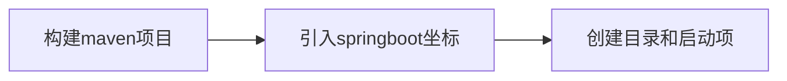

# 开发环境配置

## 1.下载安装JDK并配置环境变量

[jdk下载](https://www.oracle.com/java/technologies/javase/javase-jdk8-downloads.html) 

安装jdk，建议下载jdk1.8

配制环境变量

（1）**右击此电脑 >> 属性 >> 高级系统设置 >> 环境变量**


（2）**新建系统变量**

变量名：CLASSPATH

变量值：.;%JAVA_HOME%\lib\dt.jar;%JAVA_HOME%\lib\tools.jar;　　(标红前面的点一定不能忘)

输入完毕点击确定

注意系统变量是下面这里的，上面的是用户变量。


（3）**再新建一个系统变量**

变量名：JAVA_HOME

变量值：jdk1.8.0的安装地址


(4)**新建完成后在系统变量中找到 path 变量**

点击编辑


然后保存即可，最后可以在cmd窗口输入：Java -version 来查看当前版本确定是否配置成功！


## 2.下载安装Eclipse

 [下载Eclipse](https://www.eclipse.org/downloads/packages/)

解压下载的压缩文件 ，建议不要放到带空格和中文的目录下

## 3.下载Maven

[maven下载](http://maven.apache.org/download.cgi)

解压文件

配置maven环境变量

（1）新建系统变量 **MAVEN_HOME**，变量值：**D:\apache-maven-3.6.3**（你自己的安装路径）

（2）编辑系统变量 **Path**，添加变量值：**;%MAVEN_HOME%\bin**

（3）测试mvn -v

## 4.配置maven仓库和阿里源

（1）**本地新建文件夹MavenRepository**

（2）***\*找到 apache-maven-3.6.3\conf 目录中的\**** settings.xml 文件

找到settings.xml 文件中  <localRepository> </localRepository>打开注释修改如下：

  <localRepository>D:\MavenRepository</localRepository>

（3）**添加阿里源** ，找到 <mirrors>  </ mirrors>标签，标签中添加mirror子节点，内容如下：

```
<mirror>
        <id>aliyun-public</id>
        <mirrorOf>*</mirrorOf>
        <name>aliyun public</name>
        <url>https://maven.aliyun.com/repository/public</url>
    </mirror>

    <mirror>
        <id>aliyun-central</id>
        <mirrorOf>*</mirrorOf>
        <name>aliyun central</name>
        <url>https://maven.aliyun.com/repository/central</url>
    </mirror>

    <mirror>
        <id>aliyun-spring</id>
        <mirrorOf>*</mirrorOf>
        <name>aliyun spring</name>
        <url>https://maven.aliyun.com/repository/spring</url>
    </mirror>

    <mirror>
        <id>aliyun-spring-plugin</id>
        <mirrorOf>*</mirrorOf>
        <name>aliyun spring-plugin</name>
        <url>https://maven.aliyun.com/repository/spring-plugin</url>
    </mirror>

    <mirror>
        <id>aliyun-apache-snapshots</id>
        <mirrorOf>*</mirrorOf>
        <name>aliyun apache-snapshots</name>
        <url>https://maven.aliyun.com/repository/apache-snapshots</url>
    </mirror>

    <mirror>
        <id>aliyun-google</id>
        <mirrorOf>*</mirrorOf>
        <name>aliyun google</name>
        <url>https://maven.aliyun.com/repository/google</url>
    </mirror>

    <mirror>
        <id>aliyun-gradle-plugin</id>
        <mirrorOf>*</mirrorOf>
        <name>aliyun gradle-plugin</name>
        <url>https://maven.aliyun.com/repository/gradle-plugin</url>
    </mirror>

    <mirror>
        <id>aliyun-jcenter</id>
        <mirrorOf>*</mirrorOf>
        <name>aliyun jcenter</name>
        <url>https://maven.aliyun.com/repository/jcenter</url>
    </mirror>

    <mirror>
        <id>aliyun-releases</id>
        <mirrorOf>*</mirrorOf>
        <name>aliyun releases</name>
        <url>https://maven.aliyun.com/repository/releases</url>
    </mirror>

    <mirror>
        <id>aliyun-snapshots</id>
        <mirrorOf>*</mirrorOf>
        <name>aliyun snapshots</name>
        <url>https://maven.aliyun.com/repository/snapshots</url>
    </mirror>

    <mirror>
        <id>aliyun-grails-core</id>
        <mirrorOf>*</mirrorOf>
        <name>aliyun grails-core</name>
        <url>https://maven.aliyun.com/repository/grails-core</url>
    </mirror>

    <mirror>
        <id>aliyun-mapr-public</id>
        <mirrorOf>*</mirrorOf>
        <name>aliyun mapr-public</name>
        <url>https://maven.aliyun.com/repository/mapr-public</url>
    </mirror>
```

## 5.Eclipse配置maven


## 6.安装mysql

## 7.IntelliJ IDEA 配置maven阿里云

进入到idea安装目录，找到\plugins\maven\lib 目录，可以看到maven有几个


修改maven2 或maven3 下conf目录下的settings.xml 文件如下

　　找到mirrors，添加以下内容

```
<mirror>
        <id>aliyun-public</id>
        <mirrorOf>*</mirrorOf>
        <name>aliyun public</name>
        <url>https://maven.aliyun.com/repository/public</url>
    </mirror>

    <mirror>
        <id>aliyun-central</id>
        <mirrorOf>*</mirrorOf>
        <name>aliyun central</name>
        <url>https://maven.aliyun.com/repository/central</url>
    </mirror>

    <mirror>
        <id>aliyun-spring</id>
        <mirrorOf>*</mirrorOf>
        <name>aliyun spring</name>
        <url>https://maven.aliyun.com/repository/spring</url>
    </mirror>

    <mirror>
        <id>aliyun-spring-plugin</id>
        <mirrorOf>*</mirrorOf>
        <name>aliyun spring-plugin</name>
        <url>https://maven.aliyun.com/repository/spring-plugin</url>
    </mirror>

    <mirror>
        <id>aliyun-apache-snapshots</id>
        <mirrorOf>*</mirrorOf>
        <name>aliyun apache-snapshots</name>
        <url>https://maven.aliyun.com/repository/apache-snapshots</url>
    </mirror>

    <mirror>
        <id>aliyun-google</id>
        <mirrorOf>*</mirrorOf>
        <name>aliyun google</name>
        <url>https://maven.aliyun.com/repository/google</url>
    </mirror>

    <mirror>
        <id>aliyun-gradle-plugin</id>
        <mirrorOf>*</mirrorOf>
        <name>aliyun gradle-plugin</name>
        <url>https://maven.aliyun.com/repository/gradle-plugin</url>
    </mirror>

    <mirror>
        <id>aliyun-jcenter</id>
        <mirrorOf>*</mirrorOf>
        <name>aliyun jcenter</name>
        <url>https://maven.aliyun.com/repository/jcenter</url>
    </mirror>

    <mirror>
        <id>aliyun-releases</id>
        <mirrorOf>*</mirrorOf>
        <name>aliyun releases</name>
        <url>https://maven.aliyun.com/repository/releases</url>
    </mirror>

    <mirror>
        <id>aliyun-snapshots</id>
        <mirrorOf>*</mirrorOf>
        <name>aliyun snapshots</name>
        <url>https://maven.aliyun.com/repository/snapshots</url>
    </mirror>

    <mirror>
        <id>aliyun-grails-core</id>
        <mirrorOf>*</mirrorOf>
        <name>aliyun grails-core</name>
        <url>https://maven.aliyun.com/repository/grails-core</url>
    </mirror>

    <mirror>
        <id>aliyun-mapr-public</id>
        <mirrorOf>*</mirrorOf>
        <name>aliyun mapr-public</name>
        <url>https://maven.aliyun.com/repository/mapr-public</url>
    </mirror>
```

修改后保存，打开idea，菜单 file-settings,搜索maven，选择刚才修改的maven


# springboot

集成了一下依赖，自动选择依赖



```xml

    <parent>
        <groupId>org.springframework.boot</groupId>
        <artifactId>spring-boot-starter-parent</artifactId>
        <version>2.7.13</version>
    </parent>

    <dependency>
        <groupId>org.springframework.boot</groupId>
        <artifactId>spring-boot-starter</artifactId>
    </dependency>
    <!-- web开发的依赖 -->
    <dependency>
        <groupId>org.springframework.boot</groupId>
        <artifactId>spring-boot-starter-web</artifactId>
    </dependency>
    <dependency>
        <groupId>org.springframework.boot</groupId>
        <artifactId>spring-boot-starter-test</artifactId>
        <scope>test</scope>
    </dependency>

    <dependency>
        <groupId>org.springframework.boot</groupId>
        <artifactId>spring-boot-starter-validation</artifactId>
    </dependency>
    <dependency>
        <groupId>org.mybatis.spring.boot</groupId>
        <artifactId>mybatis-spring-boot-starter</artifactId>
        <version>2.1.3</version>
    </dependency>
    <dependency>
        <groupId>mysql</groupId>
        <artifactId>mysql-connector-java</artifactId>
        <version>8.0.33</version>
    </dependency>
    <dependency>
        <groupId>com.alibaba</groupId>
        <artifactId>druid-spring-boot-starter</artifactId>
        <version>1.1.10</version>
    </dependency>
    <dependency>
        <groupId>org.springframework.boot</groupId>
        <artifactId>spring-boot-starter-data-jpa</artifactId>
    </dependency>
    <dependency>
        <groupId>org.springframework.boot</groupId>
        <artifactId>spring-boot-starter-data-redis</artifactId>
    </dependency>


```


# 配置javaweb时候遇到的问题


\无法连接tomcat ---没有配置tomcat插件
tomcat启动失败 ----已经被占用了,打开本地端口发现确实有进程占用


给了一个杂七杂八的javaweb项目，配置

jar包 和mysql版本要对应，还有durid的配置文件也可能不同


数据库 jar 连接信息 调用jquery中有对ajax的实现.而且 使用起来非常方便.


# main

之前学习的那一套,
最底层,用js等前端调用请求和处理,纯前端三剑客
之后有了jsp
再之后有了vue


只有又有了thymeleaf


# 数据库


JDBC是Java访问数据库的标准接口

    理论
mysql-connector-java是具体的JDBC驱动程序
    
    实
    使用jdbc就要引入

Druid是一个实现了JDBC规范的数据库连接池

    优化器,也需要引入jdbc
MyBatis是一个基于JDBC的持久层框架，

    优化器,和Durid同级


## jdbc


引入jdbc依赖
测试数据库连接是否正确的代码

```java
package com.sdut;

import java.sql.Connection;
import java.sql.Driver;
import java.sql.DriverManager;
import java.sql.Statement;
import java.util.Stack;

public class Main {
// result ture means databases connected
    public static void main(String[] args)throws Exception {
        Connection connection= DriverManager.getConnection("jdbc:mysql://127.0.0.1:3306/db01","root","");
        Statement statement=connection.createStatement();
        System.out.println(statement.execute("select 1"));
    }
}


```


## durid 用配置文件优化了jdbc上面的


Druid是一个实现了JDBC规范的数据库连接池,
优化了jdbc

所以引入了durid也需要引入jdbc
druid.properties

```

driverClassName=com.mysql.jdbc.Driver
url=jdbc:mysql:///db3
username=root
password=root
# 初始线程个数
initialSize=5
# 最大线程个数
maxActive=10
# 最大连接数据库的等待时间
maxWait=3000

```


代码略


## mybatis


# spring

![img][tmp]

![[捕获.png]]

将创建对象交给编译器管理


# tomcat配置

### tomcat目录结构

/bin：存放windows或Linux平台上启动和关闭Tomcat的脚本文件
/conf：存放Tomcat服务器的各种全局配置文件，其中最重要的是server.xml和web.xml
/doc：存放Tomcat文档
/server：包含三个子目录：classes、lib和webapps
/server/lib：存放Tomcat服务器所需的各种JAR文件
/server/webapps：存放Tomcat自带的两个WEB应用admin应用和 manager应用
/common/lib：存放Tomcat服务器以及所有web应用都可以访问的jar文件
/shared/lib：存放所有web应用都可以访问的jar文件（但是不能被Tomcat服务器访问）
/logs：存放Tomcat执行时的日志文件
/src：存放Tomcat的源代码
/webapps：Tomcat的主要Web发布目录，默认情况下把Web应用文件放于此目录
/work：存放JSP编译后产生的class文件

### tomcat诊断

（1）进入tomcat解压目录下的bin文件夹下

 

（2）输入startup.bat


(3)打开浏览器输入(http://localhost:8080/)


**出现的问题**

（1）端口占用

解决方案1：改端口号

修改tomcat安装目录下conf文件夹下的server.xml文件


解决方案2：关闭占用8080端口的应用

（2）提示信息出现乱码

主要是编码方案不一致造成的，大家可以自行研究一下

## 4.在idea中配置tomcat

（1）启动idea新建项目，选取web application


(2)点击右上角 【Edit Configurations】

 


点击local


（3）继续点击Deployment选项


**注意：jdk版本 Servlet版本  Tomcat版本的对应关系**

要对应


##Request&Response

**今日目标**

>* 掌握Request对象的概念与使用
>* 掌握Response对象的概念与使用
>* 能够完成用户登录注册案例的实现
>* 能够完成SqlSessionFactory工具类的抽取

## 1，Request和Response的概述

==Request是请求对象，Response是响应对象。==这两个对象在我们使用Servlet的时候有看到：

此时，我们就需要思考一个问题request和response这两个参数的作用是什么?


* request:==获取==请求数据
  * 浏览器会发送HTTP请求到后台服务器[Tomcat]
  * HTTP的请求中会包含很多请求数据[请求行+请求头+请求体]
  * 后台服务器[Tomcat]会对HTTP请求中的数据进行解析并把解析结果存入到一个对象中
  * 所存入的对象即为request对象，所以我们可以从request对象中获取请求的相关参数
  * 获取到数据后就可以继续后续的业务，比如获取用户名和密码就可以实现登录操作的相关业务
* response:==设置==响应数据
  * 业务处理完后，后台就需要给前端返回业务处理的结果即响应数据
  * 把响应数据封装到response对象中
  * 后台服务器[Tomcat]会解析response对象,按照[响应行+响应头+响应体]格式拼接结果
  * 浏览器最终解析结果，把内容展示在浏览器给用户浏览

对于上述所讲的内容，我们通过一个案例来初步体验下request和response对象的使用。

```java
@WebServlet("/demo3")
public class ServletDemo3 extends HttpServlet {
    @Override
    protected void doGet(HttpServletRequest request, HttpServletResponse response) throws ServletException, IOException {
        //使用request对象 获取请求数据
        String name = request.getParameter("name");//url?name=zhangsan

        //使用response对象 设置响应数据
        response.setHeader("content-type","text/html;charset=utf-8");
        response.getWriter().write("<h1>"+name+",欢迎您！</h1>");
    }

    @Override
    protected void doPost(HttpServletRequest request, HttpServletResponse response) throws ServletException, IOException {
        System.out.println("Post...");
    }
}
```

启动成功后就可以通过浏览器来访问，并且根据传入参数的不同就可以在页面上展示不同的内容:


**小结**

在这节中，我们主要认识了下request对象和reponse对象:

* request对象是用来封装请求数据的对象
* response对象是用来封装响应数据的对象

目前我们只知道这两个对象是用来干什么的，那么它们具体是如何实现的，就需要我们继续深入的学习。接下来，就先从Request对象来学习,主要学习下面这些内容:

* request继承体系

* request获取请求参数
* request请求转发

## 2，Request对象

### 2.1 Request继承体系

在学习这节内容之前，我们先思考一个问题，前面在介绍Request和Reponse对象的时候，比较细心的同学可能已经发现：

* 当我们的Servlet类实现的是Servlet接口的时候，service方法中的参数是ServletRequest和ServletResponse
* 当我们的Servlet类继承的是HttpServlet类的时候，doGet和doPost方法中的参数就变成HttpServletRequest和HttpServletReponse

那么，

* ServletRequest和HttpServletRequest的关系是什么?
* request对象是有谁来创建的?
* request提供了哪些API,这些API从哪里查?

首先，我们先来看下Request的继承体系:


从上图中可以看出，ServletRequest和HttpServletRequest都是Java提供的，所以我们可以打开JavaEE提供的API文档[参考: 资料/JavaEE7-api.chm],打开后可以看到:


所以ServletRequest和HttpServletRequest是继承关系，并且两个都是接口，接口是无法创建对象，这个时候就引发了下面这个问题:


这个时候，我们就需要用到Request继承体系中的`RequestFacade`:

* 该类实现了HttpServletRequest接口，也间接实现了ServletRequest接口。
* Servlet类中的service方法、doGet方法或者是doPost方法最终都是由Web服务器[Tomcat]来调用的，所以Tomcat提供了方法参数接口的具体实现类，并完成了对象的创建
* 要想了解RequestFacade中都提供了哪些方法，我们可以直接查看JavaEE的API文档中关于ServletRequest和HttpServletRequest的接口文档，因为RequestFacade实现了其接口就需要重写接口中的方法

对于上述结论，要想验证，可以编写一个Servlet，在方法中把request对象打印下，就能看到最终的对象是不是RequestFacade,代码如下:

```java
@WebServlet("/demo2")
public class ServletDemo2 extends HttpServlet {
    @Override
    protected void doGet(HttpServletRequest request, HttpServletResponse response) throws ServletException, IOException {
        System.out.println(request);
    }

    @Override
    protected void doPost(HttpServletRequest request, HttpServletResponse response) throws ServletException, IOException {
    }
}
```

启动服务器，运行访问`http://localhost:8080/request-demo/demo2`,得到运行结果:


**小结**

* Request的继承体系为ServletRequest-->HttpServletRequest-->RequestFacade
* Tomcat需要解析请求数据，封装为request对象,并且创建request对象传递到service方法
* 使用request对象，可以查阅JavaEE API文档的HttpServletRequest接口中方法说明

### 2.2 Request获取请求数据

HTTP请求数据总共分为三部分内容，分别是==请求行、请求头、请求体==，对于这三部分内容的数据，分别该如何获取，首先我们先来学习请求行数据如何获取?

#### 2.2.1 获取请求行数据

请求行包含三块内容，分别是`请求方式`、`请求资源路径`、`HTTP协议及版本`


对于这三部分内容，request对象都提供了对应的API方法来获取，具体如下:

* 获取请求方式: `GET`

```
String getMethod()
```

* 获取虚拟目录(项目访问路径): `/request-demo`

```
String getContextPath()
```

* 获取URL(统一资源定位符): `http://localhost:8080/request-demo/req1`

```
StringBuffer getRequestURL()
```

* 获取URI(统一资源标识符): `/request-demo/req1`

```
String getRequestURI()
```

* 获取请求参数(GET方式): `username=zhangsan&password=123`

```
String getQueryString()
```

介绍完上述方法后，咱们通过代码把上述方法都使用下:

```java
/**
 * request 获取请求数据
 */
@WebServlet("/req1")
public class RequestDemo1 extends HttpServlet {
    @Override
    protected void doGet(HttpServletRequest req, HttpServletResponse resp) throws ServletException, IOException {
        // String getMethod()：获取请求方式： GET
        String method = req.getMethod();
        System.out.println(method);//GET
        // String getContextPath()：获取虚拟目录(项目访问路径)：/request-demo
        String contextPath = req.getContextPath();
        System.out.println(contextPath);
        // StringBuffer getRequestURL(): 获取URL(统一资源定位符)：http://localhost:8080/request-demo/req1
        StringBuffer url = req.getRequestURL();
        System.out.println(url.toString());
        // String getRequestURI()：获取URI(统一资源标识符)： /request-demo/req1
        String uri = req.getRequestURI();
        System.out.println(uri);
        // String getQueryString()：获取请求参数（GET方式）： username=zhangsan
        String queryString = req.getQueryString();
        System.out.println(queryString);
    }
    @Override
    protected void doPost(HttpServletRequest req, HttpServletResponse resp) throws ServletException, IOException {
    }
}
```

启动服务器，访问`http://localhost:8080/request-demo/req1?username=zhangsan&passwrod=123`，获取的结果如下:


#### 2.2.2 获取请求头数据

对于请求头的数据，格式为`key: value`如下:


所以根据请求头名称获取对应值的方法为:

```
String getHeader(String name)
```

接下来，在代码中如果想要获取客户端浏览器的版本信息，则可以使用

```java
/**
 * request 获取请求数据
 */
@WebServlet("/req1")
public class RequestDemo1 extends HttpServlet {
    @Override
    protected void doGet(HttpServletRequest req, HttpServletResponse resp) throws ServletException, IOException {
        //获取请求头: user-agent: 浏览器的版本信息
        String agent = req.getHeader("user-agent");
		System.out.println(agent);
    }
    @Override
    protected void doPost(HttpServletRequest req, HttpServletResponse resp) throws ServletException, IOException {
    }
}

```

重新启动服务器后，`http://localhost:8080/request-demo/req1?username=zhangsan&passwrod=123`，获取的结果如下:


#### 2.2.3 获取请求体数据

浏览器在发送GET请求的时候是没有请求体的，所以需要把请求方式变更为POST，请求体中的数据格式如下:


对于请求体中的数据，Request对象提供了如下两种方式来获取其中的数据，分别是:

* 获取字节输入流，如果前端发送的是字节数据，比如传递的是文件数据，则使用该方法

```
ServletInputStream getInputStream()
该方法可以获取字节
```

* 获取字符输入流，如果前端发送的是纯文本数据，则使用该方法

```
BufferedReader getReader()
```

接下来，大家需要思考，要想获取到请求体的内容该如何实现?

>具体实现的步骤如下:
>
>1.准备一个页面，在页面中添加form表单,用来发送post请求
>
>2.在Servlet的doPost方法中获取请求体数据
>
>3.在doPost方法中使用request的getReader()或者getInputStream()来获取
>
>4.访问测试

1. 在项目的webapp目录下添加一个html页面，名称为：`req.html`

```html
<!DOCTYPE html>
<html lang="en">
<head>
    <meta charset="UTF-8">
    <title>Title</title>
</head>
<body>
<!-- 
    action:form表单提交的请求地址
    method:请求方式，指定为post
-->
<form action="/request-demo/req1" method="post">
    <input type="text" name="username">
    <input type="password" name="password">
    <input type="submit">
</form>
</body>
</html>
```

2. 在Servlet的doPost方法中获取数据

```java
/**
 * request 获取请求数据
 */
@WebServlet("/req1")
public class RequestDemo1 extends HttpServlet {
    @Override
    protected void doGet(HttpServletRequest req, HttpServletResponse resp) throws ServletException, IOException {
    }
    @Override
    protected void doPost(HttpServletRequest req, HttpServletResponse resp) throws ServletException, IOException {
        //在此处获取请求体中的数据
    }
}
```

3. 调用getReader()或者getInputStream()方法，因为目前前端传递的是纯文本数据，所以我们采用getReader()方法来获取

```java
/**
 * request 获取请求数据
 */
@WebServlet("/req1")
public class RequestDemo1 extends HttpServlet {
    @Override
    protected void doGet(HttpServletRequest req, HttpServletResponse resp) throws ServletException, IOException {
    }
    @Override
    protected void doPost(HttpServletRequest req, HttpServletResponse resp) throws ServletException, IOException {
         //获取post 请求体：请求参数
        //1. 获取字符输入流
        BufferedReader br = req.getReader();
        //2. 读取数据
        String line = br.readLine();
        System.out.println(line);
    }
}
```

==注意==

BufferedReader流是通过request对象来获取的，当请求完成后request对象就会被销毁，request对象被销毁后，BufferedReader流就会自动关闭，所以此处就不需要手动关闭流了。

4. 启动服务器，通过浏览器访问`http://localhost:8080/request-demo/req.html`


点击`提交`按钮后，就可以在控制台看到前端所发送的请求数据


**小结**

HTTP请求数据中包含了`请求行`、`请求头`和`请求体`，针对这三部分内容，Request对象都提供了对应的API方法来获取对应的值:

* 请求行
  * getMethod()获取请求方式
  * getContextPath()获取项目访问路径
  * getRequestURL()获取请求URL
  * getRequestURI()获取请求URI
  * getQueryString()获取GET请求方式的请求参数
* 请求头
  * getHeader(String name)根据请求头名称获取其对应的值
* 请求体
  * 注意: ==浏览器发送的POST请求才有请求体==
  * 如果是纯文本数据:getReader()
  * 如果是字节数据如文件数据:getInputStream()

#### 2.2.4 获取请求参数的通用方式

在学习下面内容之前，我们先提出两个问题:

* 什么是请求参数?
* 请求参数和请求数据的关系是什么?

1.什么是请求参数?

为了能更好的回答上述两个问题，我们拿用户登录的例子来说明

1.1 想要登录网址，需要进入登录页面

1.2 在登录页面输入用户名和密码

1.3 将用户名和密码提交到后台

1.4 后台校验用户名和密码是否正确

1.5 如果正确，则正常登录，如果不正确，则提示用户名或密码错误

上述例子中，用户名和密码其实就是我们所说的请求参数。

2.什么是请求数据?

请求数据则是包含请求行、请求头和请求体的所有数据

3.请求参数和请求数据的关系是什么?

3.1 请求参数是请求数据中的部分内容

3.2 如果是GET请求，请求参数在请求行中

3.3 如果是POST请求，请求参数一般在请求体中

对于请求参数的获取,常用的有以下两种:

* GET方式:

```
String getQueryString()
```

* POST方式:

```
BufferedReader getReader();
```

有了上述的知识储备，我们来实现一个案例需求:

（1）发送一个GET请求并携带用户名，后台接收后打印到控制台

（2）发送一个POST请求并携带用户名，后台接收后打印到控制台

此处大家需要注意的是GET请求和POST请求接收参数的方式不一样，具体实现的代码如下:

```java
@WebServlet("/req1")
public class RequestDemo1 extends HttpServlet {
    @Override
    protected void doGet(HttpServletRequest req, HttpServletResponse resp) throws ServletException, IOException {

        String result = req.getQueryString();
        System.out.println(result);

    }
    @Override
    protected void doPost(HttpServletRequest req, HttpServletResponse resp) throws ServletException, IOException {
        BufferedReader br = req.getReader();
        String result = br.readLine();
        System.out.println(result);
    }
}
```

* 对于上述的代码，会存在什么问题呢?


* 如何解决上述重复代码的问题呢?


当然，也可以在doGet中调用doPost,在doPost中完成参数的获取和打印,另外需要注意的是，doGet和doPost方法都必须存在，不能删除任意一个。

==GET请求和POST请求获取请求参数的方式不一样，在获取请求参数这块该如何实现呢?==

要想实现，我们就需要==思考==:

GET请求方式和POST请求方式区别主要在于获取请求参数的方式不一样，是否可以提供一种==统一==获取请求参数的方式，从而==统一==doGet和doPost方法内的代码?

解决方案一:

```java
@WebServlet("/req1")
public class RequestDemo1 extends HttpServlet {
    @Override
    protected void doGet(HttpServletRequest req, HttpServletResponse resp) throws ServletException, IOException {
        //获取请求方式
        String method = req.getMethod();
        //获取请求参数
        String params = "";
        if("GET".equals(method)){
            params = req.getQueryString();
        }else if("POST".equals(method)){
            BufferedReader reader = req.getReader();
            params = reader.readLine();
        }
        //将请求参数进行打印控制台
        System.out.println(params);
      
    }
    @Override
    protected void doPost(HttpServletRequest req, HttpServletResponse resp) throws ServletException, IOException {
        this.doGet(req,resp);
    }
}
```

使用request的getMethod()来获取请求方式，根据请求方式的不同分别获取请求参数值，这样就可以解决上述问题，但是以后每个Servlet都需要这样写代码，实现起来比较麻烦，这种方案我们不采用

解决方案二:

request对象已经将上述获取请求参数的方法进行了封装，并且request提供的方法实现的功能更强大，以后只需要调用request提供的方法即可，在request的方法中都实现了哪些操作?

(1)根据不同的请求方式获取请求参数，获取的内容如下:


(2)把获取到的内容进行分割，内容如下:


(3)把分割后端数据，存入到一个Map集合中:


**注意**:因为参数的值可能是一个，也可能有多个，所以Map的值的类型为String数组。

基于上述理论，request对象为我们提供了如下方法:

* 获取所有参数Map集合

```
Map<String,String[]> getParameterMap()
```

* 根据名称获取参数值（数组）

```
String[] getParameterValues(String name)
```

* 根据名称获取参数值(单个值)

```
String getParameter(String name)
```

接下来，我们通过案例来把上述的三个方法进行实例演示:

1.修改req.html页面，添加爱好选项，爱好可以同时选多个

```html
<!DOCTYPE html>
<html lang="en">
<head>
    <meta charset="UTF-8">
    <title>Title</title>
</head>
<body>
<form action="/request-demo/req2" method="get">
    <input type="text" name="username"><br>
    <input type="password" name="password"><br>
    <input type="checkbox" name="hobby" value="1"> 游泳
    <input type="checkbox" name="hobby" value="2"> 爬山 <br>
    <input type="submit">

</form>
</body>
</html>
```


2.在Servlet代码中获取页面传递GET请求的参数值

 2.1获取GET方式的所有请求参数

```java
/**
 * request 通用方式获取请求参数
 */
@WebServlet("/req2")
public class RequestDemo2 extends HttpServlet {
    @Override
    protected void doGet(HttpServletRequest req, HttpServletResponse resp) throws ServletException, IOException {
        //GET请求逻辑
        System.out.println("get....");
        //1. 获取所有参数的Map集合
        Map<String, String[]> map = req.getParameterMap();
        for (String key : map.keySet()) {
            // username:zhangsan lisi
            System.out.print(key+":");

            //获取值
            String[] values = map.get(key);
            for (String value : values) {
                System.out.print(value + " ");
            }

            System.out.println();
        }
    }

    @Override
    protected void doPost(HttpServletRequest req, HttpServletResponse resp) throws ServletException, IOException {
    }
}
```

获取的结果为:


 2.2获取GET请求参数中的爱好，结果是数组值

```java
/**
 * request 通用方式获取请求参数
 */
@WebServlet("/req2")
public class RequestDemo2 extends HttpServlet {
    @Override
    protected void doGet(HttpServletRequest req, HttpServletResponse resp) throws ServletException, IOException {
        //GET请求逻辑
        //...
        System.out.println("------------");
        String[] hobbies = req.getParameterValues("hobby");
        for (String hobby : hobbies) {
            System.out.println(hobby);
        }
    }

    @Override
    protected void doPost(HttpServletRequest req, HttpServletResponse resp) throws ServletException, IOException {
    }
}
```

获取的结果为:


 2.3获取GET请求参数中的用户名和密码，结果是单个值

```java
/**
 * request 通用方式获取请求参数
 */
@WebServlet("/req2")
public class RequestDemo2 extends HttpServlet {
    @Override
    protected void doGet(HttpServletRequest req, HttpServletResponse resp) throws ServletException, IOException {
        //GET请求逻辑
        //...
        String username = req.getParameter("username");
        String password = req.getParameter("password");
        System.out.println(username);
        System.out.println(password);
    }

    @Override
    protected void doPost(HttpServletRequest req, HttpServletResponse resp) throws ServletException, IOException {
    }
}
```

获取的结果为:


3.在Servlet代码中获取页面传递POST请求的参数值

 3.1将req.html页面form表单的提交方式改成post

 3.2将doGet方法中的内容复制到doPost方法中即可

**小结**

* req.getParameter()方法使用的频率会比较高

* 以后我们再写代码的时候，就只需要按照如下格式来编写:

```
public class RequestDemo1 extends HttpServlet {
    @Override
    protected void doGet(HttpServletRequest req, HttpServletResponse resp) throws ServletException, IOException {
       //采用request提供的获取请求参数的通用方式来获取请求参数
       //编写其他的业务代码...
    }
    @Override
    protected void doPost(HttpServletRequest req, HttpServletResponse resp) throws ServletException, IOException {
        this.doGet(req,resp);
    }
}
```

### 2.3 IDEA快速创建Servlet

使用通用方式获取请求参数后，屏蔽了GET和POST的请求方式代码的不同，则代码可以定义如下格式:


由于格式固定，所以我们可以使用IDEA提供的模板来制作一个Servlet的模板，这样我们后期在创建Servlet的时候就会更高效，具体如何实现:

(1)按照自己的需求，修改Servlet创建的模板内容


（2）使用servlet模板创建Servlet类


### 2.4 请求参数中文乱码问题

问题展示:

(1)将req.html页面的请求方式修改为get

```
<!DOCTYPE html>
<html lang="en">
<head>
    <meta charset="UTF-8">
    <title>Title</title>
</head>
<body>
<form action="/request-demo/req2" method="get">
    <input type="text" name="username"><br>
    <input type="password" name="password"><br>
    <input type="checkbox" name="hobby" value="1"> 游泳
    <input type="checkbox" name="hobby" value="2"> 爬山 <br>
    <input type="submit">

</form>
</body>
</html>
```

(2)在Servlet方法中获取参数，并打印

```java
/**
 * 中文乱码问题解决方案
 */
@WebServlet("/req4")
public class RequestDemo4 extends HttpServlet {
    @Override
    protected void doGet(HttpServletRequest request, HttpServletResponse response) throws ServletException, IOException {
       //1. 获取username
       String username = request.getParameter("username");
       System.out.println(username);
    }

    @Override
    protected void doPost(HttpServletRequest request, HttpServletResponse response) throws ServletException, IOException {
        this.doGet(request, response);
    }
}
```

（3）启动服务器，页面上输入中文参数


（4）查看控制台打印内容


（5）把req.html页面的请求方式改成post,再次发送请求和中文参数


（6）查看控制台打印内容，依然为乱码


通过上面的案例，会发现，不管是GET还是POST请求，在发送的请求参数中如果有中文，在后台接收的时候，都会出现中文乱码的问题。具体该如何解决呢？

#### 2.4.1 POST请求解决方案

* 分析出现中文乱码的原因：
  * POST的请求参数是通过request的getReader()来获取流中的数据
  * TOMCAT在获取流的时候采用的编码是ISO-8859-1
  * ISO-8859-1编码是不支持中文的，所以会出现乱码
* 解决方案：
  * 页面设置的编码格式为UTF-8
  * 把TOMCAT在获取流数据之前的编码设置为UTF-8
  * 通过request.setCharacterEncoding("UTF-8")设置编码,UTF-8也可以写成小写

修改后的代码为:

```java
/**
 * 中文乱码问题解决方案
 */
@WebServlet("/req4")
public class RequestDemo4 extends HttpServlet {
    @Override
    protected void doGet(HttpServletRequest request, HttpServletResponse response) throws ServletException, IOException {
        //1. 解决乱码: POST getReader()
        //设置字符输入流的编码，设置的字符集要和页面保持一致
        request.setCharacterEncoding("UTF-8");
       //2. 获取username
       String username = request.getParameter("username");
       System.out.println(username);
    }

    @Override
    protected void doPost(HttpServletRequest request, HttpServletResponse response) throws ServletException, IOException {
        this.doGet(request, response);
    }
}
```

重新发送POST请求，就会在控制台看到正常展示的中文结果。

至此POST请求中文乱码的问题就已经解决，但是这种方案不适用于GET请求，这个原因是什么呢，咱们下面再分析。

#### 2.4.2 GET请求解决方案

刚才提到一个问题是`POST请求的中文乱码解决方案为什么不适用GET请求？`

* GET请求获取请求参数的方式是`request.getQueryString()`
* POST请求获取请求参数的方式是`request.getReader()`
* request.setCharacterEncoding("utf-8")是设置request处理流的编码
* getQueryString方法并没有通过流的方式获取数据

所以GET请求不能用设置编码的方式来解决中文乱码问题，那问题又来了，如何解决GET请求的中文乱码呢? 

1. 首先我们需要先分析下GET请求出现乱码的原因:

 

(1)浏览器通过HTTP协议发送请求和数据给后台服务器（Tomcat)

(2)浏览器在发送HTTP的过程中会对中文数据进行URL==编码==

(3)在进行URL编码的时候会采用页面`<meta>`标签指定的UTF-8的方式进行编码，`张三`编码后的结果为`%E5%BC%A0%E4%B8%89`

(4)后台服务器(Tomcat)接收到`%E5%BC%A0%E4%B8%89`后会默认按照`ISO-8859-1`进行URL==解码==

(5)由于前后编码与解码采用的格式不一样，就会导致后台获取到的数据为乱码。

思考: 如果把`req.html`页面的`<meta>`标签的charset属性改成`ISO-8859-1`,后台不做操作，能解决中文乱码问题么?

答案是否定的，因为`ISO-8859-1`本身是不支持中文展示的，所以改了<meta>标签的charset属性后，会导致页面上的中文内容都无法正常展示。

分析完上面的问题后，我们会发现，其中有两个我们不熟悉的内容就是==URL编码==和==URL解码==，什么是URL编码，什么又是URL解码呢?

**URL编码**

这块知识我们只需要了解下即可,具体编码过程分两步，分别是:

(1)将字符串按照编码方式转为二进制

(2)每个字节转为2个16进制数并在前边加上%

`张三`按照UTF-8的方式转换成二进制的结果为:

```
1110 0101 1011 1100 1010 0000 1110 0100 1011 1000 1000 1001
```

这个结果是如何计算的?

使用`http://www.mytju.com/classcode/tools/encode_utf8.asp`，输入`张三`


就可以获取张和三分别对应的10进制，然后在使用计算器，选择程序员模式，计算出对应的二进制数据结果:


在计算的十六进制结果中，每两位前面加一个%,就可以获取到`%E5%BC%A0%E4%B8%89`。

当然你从上面所提供的网站中就已经能看到编码16进制的结果了:


但是对于上面的计算过程，如果没有工具，纯手工计算的话，相对来说还是比较复杂的，我们也不需要进行手动计算，在Java中已经为我们提供了编码和解码的API工具类可以让我们更快速的进行编码和解码:

编码:

```java
java.net.URLEncoder.encode("需要被编码的内容","字符集(UTF-8)")
```

解码:

```java
java.net.URLDecoder.decode("需要被解码的内容","字符集(UTF-8)")
```

接下来咱们对`张三`来进行编码和解码

```
public class URLDemo {

  public static void main(String[] args) throws UnsupportedEncodingException {
        String username = "张三";
        //1. URL编码
        String encode = URLEncoder.encode(username, "utf-8");
        System.out.println(encode); //打印:%E5%BC%A0%E4%B8%89

       //2. URL解码
       //String decode = URLDecoder.decode(encode, "utf-8");//打印:张三
       String decode = URLDecoder.decode(encode, "ISO-8859-1");//打印:`å¼ ä¸ `
       System.out.println(decode);
    }
}

```

到这，我们就可以分析出GET请求中文参数出现乱码的原因了，

* 浏览器把中文参数按照`UTF-8`进行URL编码
* Tomcat对获取到的内容进行了`ISO-8859-1`的URL解码
* 在控制台就会出现类上`å¼ ä¸‰`的乱码，最后一位是个空格

2. 清楚了出现乱码的原因，接下来我们就需要想办法进行解决


从上图可以看住，

* 在进行编码和解码的时候，不管使用的是哪个字符集，他们对应的`%E5%BC%A0%E4%B8%89`是一致的

* 那他们对应的二进制值也是一样的，为:

  * ```
    1110 0101 1011 1100 1010 0000 1110 0100 1011 1000 1000 1001
    ```

* 为所以我们可以考虑把`å¼ ä¸‰`转换成字节，在把字节转换成`张三`，在转换的过程中是它们的编码一致，就可以解决中文乱码问题。

具体的实现步骤为:

>1.按照ISO-8859-1编码获取乱码`å¼ ä¸‰`对应的字节数组
>
>2.按照UTF-8编码获取字节数组对应的字符串

实现代码如下:

```
public class URLDemo {

  public static void main(String[] args) throws UnsupportedEncodingException {
        String username = "张三";
        //1. URL编码
        String encode = URLEncoder.encode(username, "utf-8");
        System.out.println(encode);
        //2. URL解码
        String decode = URLDecoder.decode(encode, "ISO-8859-1");

        System.out.println(decode); //此处打印的是对应的乱码数据

        //3. 转换为字节数据,编码
        byte[] bytes = decode.getBytes("ISO-8859-1");
        for (byte b : bytes) {
            System.out.print(b + " ");
        }
		//此处打印的是:-27 -68 -96 -28 -72 -119
        //4. 将字节数组转为字符串，解码
        String s = new String(bytes, "utf-8");
        System.out.println(s); //此处打印的是张三
    }
}
```

**说明**:在第18行中打印的数据是`-27 -68 -96 -28 -72 -119`和`张三`转换成的二进制数据`1110 0101 1011 1100 1010 0000 1110 0100 1011 1000 1000 1001`为什么不一样呢？

其实打印出来的是十进制数据，我们只需要使用计算机换算下就能得到他们的对应关系，如下图:


至此对于GET请求中文乱码的解决方案，我们就已经分析完了，最后在代码中去实现下:

```java
/**
 * 中文乱码问题解决方案
 */
@WebServlet("/req4")
public class RequestDemo4 extends HttpServlet {
    @Override
    protected void doGet(HttpServletRequest request, HttpServletResponse response) throws ServletException, IOException {
        //1. 解决乱码：POST，getReader()
        //request.setCharacterEncoding("UTF-8");//设置字符输入流的编码

        //2. 获取username
        String username = request.getParameter("username");
        System.out.println("解决乱码前："+username);

        //3. GET,获取参数的方式：getQueryString
        // 乱码原因：tomcat进行URL解码，默认的字符集ISO-8859-1
       /* //3.1 先对乱码数据进行编码：转为字节数组
        byte[] bytes = username.getBytes(StandardCharsets.ISO_8859_1);
        //3.2 字节数组解码
        username = new String(bytes, StandardCharsets.UTF_8);*/

        username  = new String(username.getBytes(StandardCharsets.ISO_8859_1),StandardCharsets.UTF_8);

        System.out.println("解决乱码后："+username);

    }

    @Override
    protected void doPost(HttpServletRequest request, HttpServletResponse response) throws ServletException, IOException {
        this.doGet(request, response);
    }
}
```

**注意**

* 把`request.setCharacterEncoding("UTF-8")`代码注释掉后，会发现GET请求参数乱码解决方案同时也可也把POST请求参数乱码的问题也解决了
* 只不过对于POST请求参数一般都会比较多，采用这种方式解决乱码起来比较麻烦，所以对于POST请求还是建议使用设置编码的方式进行。

另外需要说明一点的是==Tomcat8.0之后，已将GET请求乱码问题解决，设置默认的解码方式为UTF-8==

**小结**

1. 中文乱码解决方案

* POST请求和GET请求的参数中如果有中文，后台接收数据就会出现中文乱码问题

  GET请求在Tomcat8.0以后的版本就不会出现了

* POST请求解决方案是:设置输入流的编码

  ```
  request.setCharacterEncoding("UTF-8");
  注意:设置的字符集要和页面保持一致
  ```

* 通用方式（GET/POST）：需要先解码，再编码

  ```
  new String(username.getBytes("ISO-8859-1"),"UTF-8");
  ```

2. URL编码实现方式:

* 编码:

  ```
  URLEncoder.encode(str,"UTF-8");
  ```

* 解码:

  ```
  URLDecoder.decode(s,"ISO-8859-1");
  ```

### 2.5 Request请求转发

1. ==请求转发(forward):一种在服务器内部的资源跳转方式。==


(1)浏览器发送请求给服务器，服务器中对应的资源A接收到请求

(2)资源A处理完请求后将请求发给资源B

(3)资源B处理完后将结果响应给浏览器

(4)请求从资源A到资源B的过程就叫==请求转发==

2. 请求转发的实现方式:

```
req.getRequestDispatcher("资源B路径").forward(req,resp);
```

具体如何来使用，我们先来看下需求:


针对上述需求，具体的实现步骤为:

>1.创建一个RequestDemo5类，接收/req5的请求，在doGet方法中打印`demo5`
>
>2.创建一个RequestDemo6类，接收/req6的请求，在doGet方法中打印`demo6`
>
>3.在RequestDemo5的方法中使用
>
>​	req.getRequestDispatcher("/req6").forward(req,resp)进行请求转发
>
>4.启动测试

(1)创建RequestDemo5类

```java
/**
 * 请求转发
 */
@WebServlet("/req5")
public class RequestDemo5 extends HttpServlet {
    @Override
    protected void doGet(HttpServletRequest request, HttpServletResponse response) throws ServletException, IOException {
        System.out.println("demo5...");
    }

    @Override
    protected void doPost(HttpServletRequest request, HttpServletResponse response) throws ServletException, IOException {
        this.doGet(request, response);
    }
}
```

(2)创建RequestDemo6类

```java
/**
 * 请求转发
 */
@WebServlet("/req6")
public class RequestDemo6 extends HttpServlet {
    @Override
    protected void doGet(HttpServletRequest request, HttpServletResponse response) throws ServletException, IOException {
        System.out.println("demo6...");
    }

    @Override
    protected void doPost(HttpServletRequest request, HttpServletResponse response) throws ServletException, IOException {
        this.doGet(request, response);
    }
}
```

(3)在RequestDemo5的doGet方法中进行请求转发

```java
/**
 * 请求转发
 */
@WebServlet("/req5")
public class RequestDemo5 extends HttpServlet {
    @Override
    protected void doGet(HttpServletRequest request, HttpServletResponse response) throws ServletException, IOException {
        System.out.println("demo5...");
        //请求转发
        request.getRequestDispatcher("/req6").forward(request,response);
    }

    @Override
    protected void doPost(HttpServletRequest request, HttpServletResponse response) throws ServletException, IOException {
        this.doGet(request, response);
    }
}
```

(4)启动测试

访问`http://localhost:8080/request-demo/req5`,就可以在控制台看到如下内容:


说明请求已经转发到了`/req6`

3. 请求转发资源间共享数据:使用Request对象

此处主要解决的问题是把请求从`/req5`转发到`/req6`的时候，如何传递数据给`/req6`。

需要使用request对象提供的三个方法:

* 存储数据到request域[范围,数据是存储在request对象]中

```
void setAttribute(String name,Object o);
```

* 根据key获取值

```
Object getAttribute(String name);
```

* 根据key删除该键值对

```
void removeAttribute(String name);
```

接着上个需求来:


> 1.在RequestDemo5的doGet方法中转发请求之前，将数据存入request域对象中
>
> 2.在RequestDemo6的doGet方法从request域对象中获取数据，并将数据打印到控制台
>
> 3.启动访问测试

(1)修改RequestDemo5中的方法

```java
@WebServlet("/req5")
public class RequestDemo5 extends HttpServlet {
    @Override
    protected void doGet(HttpServletRequest request, HttpServletResponse response) throws ServletException, IOException {
        System.out.println("demo5...");
        //存储数据
        request.setAttribute("msg","hello");
        //请求转发
        request.getRequestDispatcher("/req6").forward(request,response);

    }

    @Override
    protected void doPost(HttpServletRequest request, HttpServletResponse response) throws ServletException, IOException {
        this.doGet(request, response);
    }
}
```

(2)修改RequestDemo6中的方法

```java
/**
 * 请求转发
 */
@WebServlet("/req6")
public class RequestDemo6 extends HttpServlet {
    @Override
    protected void doGet(HttpServletRequest request, HttpServletResponse response) throws ServletException, IOException {
        System.out.println("demo6...");
        //获取数据
        Object msg = request.getAttribute("msg");
        System.out.println(msg);

    }

    @Override
    protected void doPost(HttpServletRequest request, HttpServletResponse response) throws ServletException, IOException {
        this.doGet(request, response);
    }
}
```

(3)启动测试

访问`http://localhost:8080/request-demo/req5`,就可以在控制台看到如下内容:


此时就可以实现在转发多个资源之间共享数据。

4. 请求转发的特点

* 浏览器地址栏路径不发生变化

  虽然后台从`/req5`转发到`/req6`,但是浏览器的地址一直是`/req5`,未发生变化

  

* 只能转发到当前服务器的内部资源

  不能从一个服务器通过转发访问另一台服务器

* 一次请求，可以在转发资源间使用request共享数据

  虽然后台从`/req5`转发到`/req6`，但是这个==只有一次请求==

## 3，Response对象

前面讲解完Request对象，接下来我们回到刚开始的那张图:


* Request:使用request对象来==获取==请求数据
* Response:使用response对象来==设置==响应数据

Reponse的继承体系和Request的继承体系也非常相似:


 介绍完Response的相关体系结构后，接下来对于Response我们需要学习如下内容:

* Response设置响应数据的功能介绍
* Response完成重定向
* Response响应字符数据
* Response响应字节数据

### 3.1 Response设置响应数据功能介绍

HTTP响应数据总共分为三部分内容，分别是==响应行、响应头、响应体==，对于这三部分内容的数据，respone对象都提供了哪些方法来进行设置?

1. 响应行


对于响应头，比较常用的就是设置响应状态码:

```
void setStatus(int sc);
```

2. 响应头


设置响应头键值对：

```
void setHeader(String name,String value);
```

3. 响应体


对于响应体，是通过字符、字节输出流的方式往浏览器写，

获取字符输出流:

```
PrintWriter getWriter();
```

获取字节输出流

```
ServletOutputStream getOutputStream();
```

介绍完这些方法后，后面我们会通过案例把这些方法都用一用，首先先来完成下重定向的功能开发。

### 3.2 Respones请求重定向

1. ==Response重定向(redirect):一种资源跳转方式。==


(1)浏览器发送请求给服务器，服务器中对应的资源A接收到请求

(2)资源A现在无法处理该请求，就会给浏览器响应一个302的状态码+location的一个访问资源B的路径

(3)浏览器接收到响应状态码为302就会重新发送请求到location对应的访问地址去访问资源B

(4)资源B接收到请求后进行处理并最终给浏览器响应结果，这整个过程就叫==重定向==

2. 重定向的实现方式:

```
resp.setStatus(302);
resp.setHeader("location","资源B的访问路径");
```

具体如何来使用，我们先来看下需求:


针对上述需求，具体的实现步骤为:

> 1.创建一个ResponseDemo1类，接收/resp1的请求，在doGet方法中打印`resp1....`
>
> 2.创建一个ResponseDemo2类，接收/resp2的请求，在doGet方法中打印`resp2....`
>
> 3.在ResponseDemo1的方法中使用
>
> ​	response.setStatus(302);
>
> ​	response.setHeader("Location","/request-demo/resp2") 来给前端响应结果数据
>
> 4.启动测试

(1)创建ResponseDemo1类

```java
@WebServlet("/resp1")
public class ResponseDemo1 extends HttpServlet {
    @Override
    protected void doGet(HttpServletRequest request, HttpServletResponse response) throws ServletException, IOException {
        System.out.println("resp1....");
    }

    @Override
    protected void doPost(HttpServletRequest request, HttpServletResponse response) throws ServletException, IOException {
        this.doGet(request, response);
    }
}
```

(2)创建ResponseDemo2类

```java
@WebServlet("/resp2")
public class ResponseDemo2 extends HttpServlet {
    @Override
    protected void doGet(HttpServletRequest request, HttpServletResponse response) throws ServletException, IOException {
        System.out.println("resp2....");
    }

    @Override
    protected void doPost(HttpServletRequest request, HttpServletResponse response) throws ServletException, IOException {
        this.doGet(request, response);
    }
}
```

(3)在ResponseDemo1的doGet方法中给前端响应数据

```java
@WebServlet("/resp1")
public class ResponseDemo1 extends HttpServlet {
    @Override
    protected void doGet(HttpServletRequest request, HttpServletResponse response) throws ServletException, IOException {
        System.out.println("resp1....");
        //重定向
        //1.设置响应状态码 302
        response.setStatus(302);
        //2. 设置响应头 Location
        response.setHeader("Location","/request-demo/resp2");
    }

    @Override
    protected void doPost(HttpServletRequest request, HttpServletResponse response) throws ServletException, IOException {
        this.doGet(request, response);
    }
}
```

(4)启动测试

访问`http://localhost:8080/request-demo/resp1`,就可以在控制台看到如下内容:


说明`/resp1`和`/resp2`都被访问到了。到这重定向就已经完成了。

虽然功能已经实现，但是从设置重定向的两行代码来看，会发现除了重定向的地址不一样，其他的内容都是一模一样，所以request对象给我们提供了简化的编写方式为:

```
resposne.sendRedirect("/request-demo/resp2")
```

所以第3步中的代码就可以简化为：

```java
@WebServlet("/resp1")
public class ResponseDemo1 extends HttpServlet {
    @Override
    protected void doGet(HttpServletRequest request, HttpServletResponse response) throws ServletException, IOException {
        System.out.println("resp1....");
        //重定向
        resposne.sendRedirect("/request-demo/resp2")；
    }

    @Override
    protected void doPost(HttpServletRequest request, HttpServletResponse response) throws ServletException, IOException {
        this.doGet(request, response);
    }
}
```

3. 重定向的特点

* 浏览器地址栏路径发送变化

  当进行重定向访问的时候，由于是由浏览器发送的两次请求，所以地址会发生变化

  

* 可以重定向到任何位置的资源(服务内容、外部均可)

  因为第一次响应结果中包含了浏览器下次要跳转的路径，所以这个路径是可以任意位置资源。

* 两次请求，不能在多个资源使用request共享数据

  因为浏览器发送了两次请求，是两个不同的request对象，就无法通过request对象进行共享数据

介绍完==请求重定向==和==请求转发==以后，接下来需要把这两个放在一块对比下:


以后到底用哪个，还是需要根据具体的业务来决定。

### 3.3 路径问题

1. 问题1：转发的时候路径上没有加`/request-demo`而重定向加了，那么到底什么时候需要加，什么时候不需要加呢?


其实判断的依据很简单，只需要记住下面的规则即可:

* 浏览器使用:需要加虚拟目录(项目访问路径)
* 服务端使用:不需要加虚拟目录

对于转发来说，因为是在服务端进行的，所以不需要加虚拟目录

对于重定向来说，路径最终是由浏览器来发送请求，就需要添加虚拟目录。

掌握了这个规则，接下来就通过一些练习来强化下知识的学习:

* `<a href='路劲'>`
* `<form action='路径'>`
* req.getRequestDispatcher("路径")
* resp.sendRedirect("路径")

答案:

```
1.超链接，从浏览器发送，需要加
2.表单，从浏览器发送，需要加
3.转发，是从服务器内部跳转，不需要加
4.重定向，是由浏览器进行跳转，需要加。
```

2. 问题2：在重定向的代码中，`/request-demo`是固定编码的，如果后期通过Tomcat插件配置了项目的访问路径，那么所有需要重定向的地方都需要重新修改，该如何优化?


答案也比较简单，我们可以在代码中动态去获取项目访问的虚拟目录，具体如何获取，我们可以借助前面咱们所学习的request对象中的getContextPath()方法，修改后的代码如下:

```java
@WebServlet("/resp1")
public class ResponseDemo1 extends HttpServlet {
    @Override
    protected void doGet(HttpServletRequest request, HttpServletResponse response) throws ServletException, IOException {
        System.out.println("resp1....");

        //简化方式完成重定向
        //动态获取虚拟目录
        String contextPath = request.getContextPath();
        response.sendRedirect(contextPath+"/resp2");
    }

    @Override
    protected void doPost(HttpServletRequest request, HttpServletResponse response) throws ServletException, IOException {
        this.doGet(request, response);
    }
}
```

重新启动访问测试，功能依然能够实现，此时就可以动态获取项目访问的虚拟路径，从而降低代码的耦合度。

### 3.4 Response响应字符数据

要想将字符数据写回到浏览器，我们需要两个步骤:

* 通过Response对象获取字符输出流： PrintWriter writer = resp.getWriter();

* 通过字符输出流写数据: writer.write("aaa");

接下来，我们实现通过些案例把响应字符数据给实际应用下:

1. 返回一个简单的字符串`aaa`

```java
/**
 * 响应字符数据：设置字符数据的响应体
 */
@WebServlet("/resp3")
public class ResponseDemo3 extends HttpServlet {
    @Override
    protected void doGet(HttpServletRequest request, HttpServletResponse response) throws ServletException, IOException {
        response.setContentType("text/html;charset=utf-8");
        //1. 获取字符输出流
        PrintWriter writer = response.getWriter();
		 writer.write("aaa");
    }
    @Override
    protected void doPost(HttpServletRequest request, HttpServletResponse response) throws ServletException, IOException {
        this.doGet(request, response);
    }
}
```


2. 返回一串html字符串，并且能被浏览器解析

```
PrintWriter writer = response.getWriter();
//content-type，告诉浏览器返回的数据类型是HTML类型数据，这样浏览器才会解析HTML标签
response.setHeader("content-type","text/html");
writer.write("<h1>aaa</h1>");
```


==注意:==一次请求响应结束后，response对象就会被销毁掉，所以不要手动关闭流。

3. 返回一个中文的字符串`你好`，需要注意设置响应数据的编码为`utf-8`

```
//设置响应的数据格式及数据的编码
response.setContentType("text/html;charset=utf-8");
writer.write("你好");
```


### 3.3 Response响应字节数据

要想将字节数据写回到浏览器，我们需要两个步骤:

- 通过Response对象获取字节输出流：ServletOutputStream outputStream = resp.getOutputStream();

- 通过字节输出流写数据: outputStream.write(字节数据);

接下来，我们实现通过些案例把响应字符数据给实际应用下:

1. 返回一个图片文件到浏览器

```java
/**
 * 响应字节数据：设置字节数据的响应体
 */
@WebServlet("/resp4")
public class ResponseDemo4 extends HttpServlet {
    @Override
    protected void doGet(HttpServletRequest request, HttpServletResponse response) throws ServletException, IOException {
        //1. 读取文件
        FileInputStream fis = new FileInputStream("d://a.jpg");
        //2. 获取response字节输出流
        ServletOutputStream os = response.getOutputStream();
        //3. 完成流的copy
        byte[] buff = new byte[1024];
        int len = 0;
        while ((len = fis.read(buff))!= -1){
            os.write(buff,0,len);
        }
        fis.close();
    }

    @Override
    protected void doPost(HttpServletRequest request, HttpServletResponse response) throws ServletException, IOException {
        this.doGet(request, response);
    }
}
```


上述代码中，对于流的copy的代码还是比较复杂的，所以我们可以使用别人提供好的方法来简化代码的开发，具体的步骤是:

(1)pom.xml添加依赖

```xml
<dependency>
    <groupId>commons-io</groupId>
    <artifactId>commons-io</artifactId>
    <version>2.6</version>
</dependency>
```

(2)调用工具类方法

```
//fis:输入流
//os:输出流
IOUtils.copy(fis,os);
```

优化后的代码:

```java
/**
 * 响应字节数据：设置字节数据的响应体
 */
@WebServlet("/resp4")
public class ResponseDemo4 extends HttpServlet {
    @Override
    protected void doGet(HttpServletRequest request, HttpServletResponse response) throws ServletException, IOException {
        //1. 读取文件
        FileInputStream fis = new FileInputStream("d://a.jpg");
        //2. 获取response字节输出流
        ServletOutputStream os = response.getOutputStream();
        //3. 完成流的copy
      	IOUtils.copy(fis,os);
        fis.close();
    }

    @Override
    protected void doPost(HttpServletRequest request, HttpServletResponse response) throws ServletException, IOException {
        this.doGet(request, response);
    }
}
```

## 4，用户注册登录案例

接下来我们通过两个比较常见的案例，一个是==注册==，一个是==登录==来对今天学习的内容进行一个实战演练，首先来实现用户登录。

### 4.1 用户登录

#### 4.1.1 需求分析


1. 用户在登录页面输入用户名和密码，提交请求给LoginServlet
2. 在LoginServlet中接收请求和数据[用户名和密码]
3. 在LoginServlt中通过Mybatis实现调用UserMapper来根据用户名和密码查询数据库表
4. 将查询的结果封装到User对象中进行返回
5. 在LoginServlet中判断返回的User对象是否为null
6. 如果为nul，说明根据用户名和密码没有查询到用户，则登录失败，返回"登录失败"数据给前端
7. 如果不为null,则说明用户存在并且密码正确，则登录成功，返回"登录成功"数据给前端

#### 4.1.2 环境准备

1. 复制资料中的静态页面到项目的webapp目录下

参考`资料\1. 登陆注册案例\1. 静态页面`,拷贝完效果如下:


2. 创建db1数据库，创建tb_user表，创建User实体类

2.1 将`资料\1. 登陆注册案例\2. MyBatis环境\tb_user.sql`中的sql语句执行下:


 2.2 将`资料\1. 登陆注册案例\2. MyBatis环境\User.java`拷贝到com.itheima.pojo


3. 在项目的pom.xml导入Mybatis和Mysql驱动坐标

```xml
<dependency>
    <groupId>org.mybatis</groupId>
    <artifactId>mybatis</artifactId>
    <version>3.5.5</version>
</dependency>

<dependency>
    <groupId>mysql</groupId>
    <artifactId>mysql-connector-java</artifactId>
    <version>5.1.34</version>
</dependency>
```

4. 创建mybatis-config.xml核心配置文件，UserMapper.xml映射文件,UserMapper接口

4.1  将`资料\1. 登陆注册案例\2. MyBatis环境\mybatis-config.xml`拷贝到resources目录下

```xml
<?xml version="1.0" encoding="UTF-8" ?>
<!DOCTYPE configuration
        PUBLIC "-//mybatis.org//DTD Config 3.0//EN"
        "http://mybatis.org/dtd/mybatis-3-config.dtd">
<configuration>
    <!--起别名-->
    <typeAliases>
        <package name="com.itheima.pojo"/>
    </typeAliases>

    <environments default="development">
        <environment id="development">
            <transactionManager type="JDBC"/>
            <dataSource type="POOLED">
                <property name="driver" value="com.mysql.jdbc.Driver"/>
                <!--
                    useSSL:关闭SSL安全连接 性能更高
                    useServerPrepStmts:开启预编译功能
                    &amp; 等同于 & ,xml配置文件中不能直接写 &符号
                -->
                <property name="url" value="jdbc:mysql:///db1?useSSL=false&amp;useServerPrepStmts=true"/>
                <property name="username" value="root"/>
                <property name="password" value="1234"/>
            </dataSource>
        </environment>
    </environments>
    <mappers>
        <!--扫描mapper-->
        <package name="com.itheima.mapper"/>
    </mappers>
</configuration>
```

4.2 在com.itheima.mapper包下创建UserMapper接口

```java
public interface UserMapper {

}
```

4.3 将`资料\1. 登陆注册案例\2. MyBatis环境\UserMapper.xml`拷贝到resources目录下

==注意：在resources下创建UserMapper.xml的目录时，要使用/分割==


至此我们所需要的环境就都已经准备好了，具体该如何实现?

#### 4.1.3 代码实现

1. 在UserMapper接口中提供一个根据用户名和密码查询用户对象的方法

```java
/**
     * 根据用户名和密码查询用户对象
     * @param username
     * @param password
     * @return
     */
    @Select("select * from tb_user where username = #{username} and password = #{password}")
    User select(@Param("username") String username,@Param("password")  String password);
```

**说明**

@Param注解的作用:用于传递参数,是方法的参数可以与SQL中的字段名相对应。

2. 修改loign.html

```html
<!DOCTYPE html>
<html lang="en">

<head>
    <meta charset="UTF-8">
    <title>login</title>
    <link href="css/login.css" rel="stylesheet">
</head>

<body>
<div id="loginDiv">
    <form action="/request-demo/loginServlet" method="post" id="form">
        <h1 id="loginMsg">LOGIN IN</h1>
        <p>Username:<input id="username" name="username" type="text"></p>

        <p>Password:<input id="password" name="password" type="password"></p>

        <div id="subDiv">
            <input type="submit" class="button" value="login up">
            <input type="reset" class="button" value="reset">&nbsp;&nbsp;&nbsp;
            <a href="register.html">没有账号？点击注册</a>
        </div>
    </form>
</div>

</body>
</html>
```

3. 编写LoginServlet

```java
@WebServlet("/loginServlet")
public class LoginServlet extends HttpServlet {
    @Override
    protected void doGet(HttpServletRequest request, HttpServletResponse response) throws ServletException, IOException {
        //1. 接收用户名和密码
        String username = request.getParameter("username");
        String password = request.getParameter("password");

        //2. 调用MyBatis完成查询
        //2.1 获取SqlSessionFactory对象
        String resource = "mybatis-config.xml";
        InputStream inputStream = Resources.getResourceAsStream(resource);
        SqlSessionFactory sqlSessionFactory = new SqlSessionFactoryBuilder().build(inputStream);
        //2.2 获取SqlSession对象
        SqlSession sqlSession = sqlSessionFactory.openSession();
        //2.3 获取Mapper
        UserMapper userMapper = sqlSession.getMapper(UserMapper.class);
        //2.4 调用方法
        User user = userMapper.select(username, password);
        //2.5 释放资源
        sqlSession.close();


        //获取字符输出流，并设置content type
        response.setContentType("text/html;charset=utf-8");
        PrintWriter writer = response.getWriter();
        //3. 判断user释放为null
        if(user != null){
            // 登陆成功
            writer.write("登陆成功");
        }else {
            // 登陆失败
            writer.write("登陆失败");
        }
    }

    @Override
    protected void doPost(HttpServletRequest request, HttpServletResponse response) throws ServletException, IOException {
        this.doGet(request, response);
    }
}
```

4. 启动服务器测试

4.1 如果用户名和密码输入错误，则


4.2 如果用户名和密码输入正确，则


至此用户的登录功能就已经完成了~

### 4.2 用户注册

#### 4.2.1 需求分析


1. 用户在注册页面输入用户名和密码，提交请求给RegisterServlet
2. 在RegisterServlet中接收请求和数据[用户名和密码]
3. 在RegisterServlet中通过Mybatis实现调用UserMapper来根据用户名查询数据库表
4. 将查询的结果封装到User对象中进行返回
5. 在RegisterServlet中判断返回的User对象是否为null
6. 如果为nul，说明根据用户名可用，则调用UserMapper来实现添加用户
7. 如果不为null,则说明用户不可以，返回"用户名已存在"数据给前端

#### 4.2.2 代码编写

1. 编写UserMapper提供根据用户名查询用户数据方法和添加用户方法

```java
/**
* 根据用户名查询用户对象
* @param username
* @return
*/
@Select("select * from tb_user where username = #{username}")
User selectByUsername(String username);

/**
* 添加用户
* @param user
*/
@Insert("insert into tb_user values(null,#{username},#{password})")
void add(User user);
```

2. 修改register.html

```html
<!DOCTYPE html>
<html lang="en">
<head>
    <meta charset="UTF-8">
    <title>欢迎注册</title>
    <link href="css/register.css" rel="stylesheet">
</head>
<body>

<div class="form-div">
    <div class="reg-content">
        <h1>欢迎注册</h1>
        <span>已有帐号？</span> <a href="login.html">登录</a>
    </div>
    <form id="reg-form" action="/request-demo/registerServlet" method="post">

        <table>

            <tr>
                <td>用户名</td>
                <td class="inputs">
                    <input name="username" type="text" id="username">
                    <br>
                    <span id="username_err" class="err_msg" style="display: none">用户名不太受欢迎</span>
                </td>

            </tr>

            <tr>
                <td>密码</td>
                <td class="inputs">
                    <input name="password" type="password" id="password">
                    <br>
                    <span id="password_err" class="err_msg" style="display: none">密码格式有误</span>
                </td>
            </tr>

        </table>

        <div class="buttons">
            <input value="注 册" type="submit" id="reg_btn">
        </div>
        <br class="clear">
    </form>

</div>
</body>
</html>
```

3. 创建RegisterServlet类

```java
@WebServlet("/registerServlet")
public class RegisterServlet extends HttpServlet {
    @Override
    protected void doGet(HttpServletRequest request, HttpServletResponse response) throws ServletException, IOException {
        //1. 接收用户数据
        String username = request.getParameter("username");
        String password = request.getParameter("password");

        //封装用户对象
        User user = new User();
        user.setUsername(username);
        user.setPassword(password);

        //2. 调用mapper 根据用户名查询用户对象
        //2.1 获取SqlSessionFactory对象
        String resource = "mybatis-config.xml";
        InputStream inputStream = Resources.getResourceAsStream(resource);
        SqlSessionFactory sqlSessionFactory = new SqlSessionFactoryBuilder().build(inputStream);
        //2.2 获取SqlSession对象
        SqlSession sqlSession = sqlSessionFactory.openSession();
        //2.3 获取Mapper
        UserMapper userMapper = sqlSession.getMapper(UserMapper.class);

        //2.4 调用方法
        User u = userMapper.selectByUsername(username);

        //3. 判断用户对象释放为null
        if( u == null){
            // 用户名不存在，添加用户
            userMapper.add(user);

            // 提交事务
            sqlSession.commit();
            // 释放资源
            sqlSession.close();
        }else {
            // 用户名存在，给出提示信息
            response.setContentType("text/html;charset=utf-8");
            response.getWriter().write("用户名已存在");
        }

    }

    @Override
    protected void doPost(HttpServletRequest request, HttpServletResponse response) throws ServletException, IOException {
        this.doGet(request, response);
    }
}
```

4. 启动服务器进行测试

4.1 如果测试成功，则在数据库中就能查看到新注册的数据

4.2 如果用户已经存在，则在页面上展示 `用户名已存在` 的提示信息

### 4.3 SqlSessionFactory工具类抽取

上面两个功能已经实现，但是在写Servlet的时候，因为需要使用Mybatis来完成数据库的操作，所以对于Mybatis的基础操作就出现了些重复代码，如下

```java
String resource = "mybatis-config.xml";
InputStream inputStream = Resources.getResourceAsStream(resource);
SqlSessionFactory sqlSessionFactory = new 
	SqlSessionFactoryBuilder().build(inputStream);
```

有了这些重复代码就会造成一些问题:

* 重复代码不利于后期的维护
* SqlSessionFactory工厂类进行重复创建
  * 就相当于每次买手机都需要重新创建一个手机生产工厂来给你制造一个手机一样，资源消耗非常大但性能却非常低。所以这么做是不允许的。

那如何来优化呢？

* 代码重复可以抽取工具类
* 对指定代码只需要执行一次可以使用静态代码块

有了这两个方向后，代码具体该如何编写?

```java
public class SqlSessionFactoryUtils {

    private static SqlSessionFactory sqlSessionFactory;

    static {
        //静态代码块会随着类的加载而自动执行，且只执行一次
        try {
            String resource = "mybatis-config.xml";
            InputStream inputStream = Resources.getResourceAsStream(resource);
            sqlSessionFactory = new SqlSessionFactoryBuilder().build(inputStream);
        } catch (IOException e) {
            e.printStackTrace();
        }
    }


    public static SqlSessionFactory getSqlSessionFactory(){
        return sqlSessionFactory;
    }
}
```

工具类抽取以后，以后在对Mybatis的SqlSession进行操作的时候，就可以直接使用

```java
SqlSessionFactory sqlSessionFactory =SqlSessionFactoryUtils.getSqlSessionFactory();
```

这样就可以很好的解决上面所说的代码重复和重复创建工厂导致性能低的问题了。


# chap02 会话技术

## 2.1 会话简介

在日常生活中，从拨通电话到挂断电话之间的一连串的你问我答的过程就是一个会话。在打电话过程中，通话双方会有通话内容，同样，在客户端与服务器交互的过程中，也会产生一些数据。例如，用户甲和乙分别登录了购物网站，甲购买了一个iPhone手机，乙购买了一个iPad，当这两个用户结账时，Web服务器需要对用户甲和乙的信息分别进行保存。为了保存会话过程中产生的数据，Servlet提供了两个用于保存会话数据的对象，分别是Cookie和Session。

## 2.2 Cookie对象

### 2.2.1  什么是Cookie

在现实生活中，当顾客在购物时，商城经常会赠送顾客一张会员卡，卡上记录用户的个人信息（姓名，手机号等）、消费额度和积分额度等。顾客一旦接受了会员卡，以后每次光临该商场时，都可以使用这张会员卡，商场也将根据会员卡上的消费记录计算会员的优惠额度和累加积分。在Web应用中，Cookie的功能类似于会员卡，当用户通过浏览器访问Web服务器时，服务器会给客户端发送一些信息，如用户信息和商品信息，这些信息都保存在Cookie中。这样，当该浏览器再次访问服务器时，会在请求头中将Cookie发送给服务器，方便服务器对浏览器做出正确地响应。

服务器向客户端发送Cookie时，会在HTTP响应头字段中增加Set-Cookie响应头字段。Set-Cookie头字段中设置的Cookie的具体示例如下：

```
Set-Cookie: user=sdut; Path=/;
```

user表示Cookie的名称，sdut表示Cookie的值，Path表示Cookie的属性。Cookie必须以键值对的形式存在，Cookie属性可以有多个，属性之间用分号“;”和空格分隔。

当用户第一次访问服务器时，服务器会在响应消息中增加Set-Cookie头字段，将用户信息以Cookie的形式发送给浏览器。一旦用户浏览器接受了服务器发送的Cookie信息，就会将它保存在浏览器的缓冲区中，这样，当浏览器后续访问该服务器时，都会在请求消息中将用户信息以Cookie的形式发送给服务器，从而使服务器分辨出当前请求是由哪个用户发出的。


### 2.2.2  Cookie API

1.构造方法

```
public Cookie(java.lang.String name,java.lang.String value);
```

在Cookie的构造方法中，参数name用于指定Cookie的名称，value用于指定Cookie的值。需要注意的是，Cookie一旦创建，它的名称就不能再更改，Cookie的值可以为任何值，创建后允许被修改。

2.Cookie类的常用方法

| **方法声明**                    | **功能描述**                                 |
| ------------------------------- | -------------------------------------------- |
| String getName()                | 用于返回Cookie的名称                         |
| void setValue(String newValue)  | 用于为Cookie设置一个新的值                   |
| String getValue()               | 用于返回Cookie的值                           |
| void setMaxAge(int expiry)      | 用于设置Cookie在浏览器客户机上保持有效的秒数 |
| int getMaxAge()                 | 用于返回Cookie在浏览器客户机上保持有效的秒数 |
| void setPath(String uri)        | 用于设置该Cookie项的有效目录路径             |
| String getPath()                | 用于返回该Cookie项的有效目录路径             |
| void setDomain(String pattern)  | 用于设置该Cookie项的有效域                   |
| String getDomain()              | 用于返回该Cookie项的有效域                   |
| void setVersion(int v)          | 用于设置该Cookie项采用的协议版本             |
| int getVersion()                | 用于返回该Cookie项采用的协议版本             |
| void setComment(String purpose) | 用于设置该Cookie项的注解部分                 |
| String getComment()             | 用于返回该Cookie项的注解部分                 |
| void setSecure(boolean flag)    | 用于设置该Cookie项是否只能使用安全的协议传送 |
| boolean getSecure()             | 用于返回该Cookie项是否只能使用安全的协议传送 |

3.setMaxAge(int expiry)方法和getMaxAge()方法

setMaxAge(int expiry)和getMaxAge()方法分别用于设置和返回Cookie在浏览器上保持有效的秒数。如果设置的值为一个正整数，浏览器会将Cookie信息保存在本地硬盘中。从当前时间开始，在没有超过指定的秒数之前，这个Cookie都保持有效，并且同一台计算机上运行的该浏览器都可以使用这个Cookie信息。如果设置值为负整数，浏览器会将Cookie信息保存在浏览器的缓存中，当浏览器关闭时，Cookie信息会被删除。如果设置值为0，则浏览器会立即删除这个Cookie信息。

4.setPath(String uri)方法和getPath()方法

setPath(String uri)方法和getPath()方法是针对Cookie的Path属性的。如果创建的某个Cookie对象没有设置Path属性，那么该Cookie只对当前访问路径所属的目录及其子目录有效。如果想让某个Cookie项对站点的所有目录下的访问路径都有效，应调用Cookie对象的setPath()方法将其Path属性设置为“/”。

5.setDomain(String pattern)方法和getDomain()方法

setDomain(String pattern)方法和getDomain()方法是针对Cookie的domain属性的。domain属性用于指定浏览器访问的域。例如，传智播客的域为“itcast.cn”。设置domain属性时，其值必须以“.”开头，如domain=.itcast.cn。默认情况下，domain属性的值为当前主机名，浏览器在访问当前主机下的资源时，都会将Cookie信息发送给服务器（当前主机）。需要注意的是，domain属性的值不区分大小写。

### 2.2.3 Cookie实例

```
@WebServlet(name = "testCookie", value = "/test-cookie")
public class TestCookie extends HttpServlet {
    @Override
    protected void doGet(HttpServletRequest req, HttpServletResponse resp) throws ServletException, IOException {
        this.doPost(req, resp);
    }

    @Override
    protected void doPost(HttpServletRequest req, HttpServletResponse resp) throws ServletException, IOException {
        //指定服务器输出内容的编码方式UTF-8，防止发生乱码
        resp.setContentType("text/html;charset=utf-8");
        //获取所有cookie
        Cookie[] cookies = req.getCookies();
        //定义flag的boolean变量，用于判断cookies是否为空
        boolean flag = false;
        //遍历cookie数组
        if (cookies.length > 0 && cookies != null) {
            for (Cookie cookie : cookies) {
                //获取cookie的名称
                String name = cookie.getName();
                //判断名称是否是lastTime
                if ("lastTime".equals(name)) {
                    //有该cookie不是第一次访问
                    flag = true;
                    //响应数据
                    //获取cookie的value时间
                    String value = cookie.getValue();
                    System.out.println("解码前：" + value);
                    //URL解码
                    value = URLDecoder.decode(value, "utf-8");
                    System.out.println("解码后：" + value);
                    resp.getWriter().write("欢迎回来，您上次访问时间为:" + value);
                    //设置cookie的value
                    //获取当前时间的字符串，重新设置cookie的值，重新发送cookie
                    Date date = new Date();
                    SimpleDateFormat timesdf = new SimpleDateFormat("yyyy年MM月dd日 HH:mm:ss");
                    String str_time = timesdf.format(date);
                    System.out.println("编码前：" + str_time);
                    //URL编码
                    str_time = URLEncoder.encode(str_time, "utf-8");
                    System.out.println("编码后：" + str_time);
                    cookie.setValue(str_time);
                    //设置cookie存活时间
                    cookie.setMaxAge(60 * 60 * 24 * 30);    //一个月
                    //加入当前cookie请求时间
                    resp.addCookie(cookie);
                    break;

                }

            }
            //如果cookies中没有时间，也就是没有访问过
            if (cookies == null || cookies.length == 0 || flag == false) {
                //设置cookie的value
                //获取当前时间的字符串，重新设置cookie的值，重新发送cookie
                Date date = new Date();
                SimpleDateFormat sdf = new SimpleDateFormat("yyyy年MM月dd日HH:mm:ss");
                String str_date = sdf.format(date);
                System.out.println("编码前：" + str_date);
                //URL编码
                str_date = URLEncoder.encode(str_date, "utf-8");
                System.out.println("编码后：" + str_date);
                Cookie cookie = new Cookie("lastTime", str_date);
                //设置cookie存活时间
                cookie.setMaxAge(60 * 60 * 24 * 30);//一个月
                resp.addCookie(cookie);
                resp.getWriter().write("您好，欢迎您首次访问");
            }
        }
    }
}
```

## 2.3 Session对象

### 2.3.1  什么是Session

1.Session对象

当人们去医院就诊时，就诊病人需要办理医院的就诊卡，就诊卡上只有卡号，没有其他信息。但病人每次去该医院就诊时，只要出示就诊卡，医务人员便可根据卡号查询到病人的就诊信息。Session技术类似医院办理就诊卡和医院为每个病人保留病历档案的过程。当浏览器访问Web服务器时，Servlet容器就会创建一个Session对象和ID属性， Session对象就相当于病历档案，ID就相当于就诊卡号。当客户端后续访问服务器时，只要将ID传递给服务器，服务器就能判断出该请求是哪个客户端发送的，从而选择与之对应的Session对象为其服务。


用户甲和用户乙都调用buyServlet将商品添加到购物车，调用payServlet进行商品结算。由于甲和乙购买商品的过程类似，在此，以用户甲为例进行详细说明。当用户甲访问购物网站时，服务器为甲创建了一个Session对象（相当于购物车）。当甲将iPhone手机添加到购物车时，iPhone手机的信息便存放到了Session对象中。同时，服务器将Session对象的ID属性以Cookie (Set-Cookie: JSESSIONID=111)的形式返回给甲的浏览器。当甲完成购物进行结账时，需要向服务器发送结账请求，这时，浏览器自动在请求消息头中将Cookie (Cookie: JSESSIONID=111)信息发送给服务器，服务器根据ID属性找到为用户甲所创建的Session对象，并将Session对象中所存放的iPhone手机信息取出进行结算。

2.Session与Cookie区别

Session还具有更高的安全性，它将关键数据保存在服务器。cookie则是将数据存在客户端的浏览器中。因此cookie是较为危险的，若客户端遭遇黑客攻击，cookie信息容易被窃取，数据也可能被篡改，而运用Session可以有效避免这种情况的发生。

### 2.3.2  HttpSession API

1.获取Session对象

Session是与每个请求消息紧密相关的，为此，HttpServletRequest定义了用于获取Session对象的getSession()方法，该方法有两种重载形式，具体如下：

```
public HttpSession getSession(boolean create)//第一个
public HttpSession getSession()//第二个
```

第一个getSession()方法根据传递的参数判断是否创建新的HttpSession对象，如果参数为true，则在相关的HttpSession对象不存在时创建并返回新的HttpSession对象，否则不创建新的HttpSession对象，而是返回null。

第二个getSession()方法相当于第一个方法参数为true时的情况，在相关的HttpSession对象不存在时总是创建新的HttpSession对象。需要注意的是，由于getSession()方法可能会产生发送会话标识号的Cookie头字段，所以必须在发送任何响应内容之前调用getSession()方法。

2.HttpSession接口中的常用方法

| **方法声明**                                | **功能描述**                                                 |
| ------------------------------------------- | ------------------------------------------------------------ |
| String getId()                              | 用于返回与当前HttpSession对象关联的会话标识号                |
| long getCreationTime()                      | 用于返回Session创建的时间，这个时间是创建Session的时间与1970年1月1日00:00:00之间时间差的毫秒表示形式 |
| long getLastAccessedTime()                  | 用于返回客户端最后一次发送与Session相关请求的时间，这个时间是发送请求的时间与1970年1月1日00:00:00之间时间差的毫秒表示形式 |
| void setMaxInactiveInterval(int interval)   | 用于设置当前HttpSession对象可空闲的以秒为单位的最长时间，也就是修改当前会话的默认超时间隔 |
| boolean isNew()                             | 判断当前HttpSession对象是否是新创建的                        |
| void invalidate()                           | 用于强制使Session对象无效                                    |
| ServletContext getServletContext()          | 用于返回当前HttpSession对象所属于的Web应用程序对象，即代表当前Web应用程序的ServletContext对象 |
| void setAttribite(String name,Object value) | 用于将一个对象与一个名称关联后存储到当前的HttpSession对象中  |
| String getAttribute()                       | 用于从当前HttpSession对象中返回指定名称的属性对象            |
| void removeAttribute(String name)           | 用于从当前HttpSession对象中删除指定名称的属性                |

3.Session的生命周期

（1）Session生效

Sessinon在用户第一次访问服务器时创建，需要注意只有访问JSP、Servlet等程序时才会创建Session。此外，还可调用request.getSession(true)强制生成Session。只访问HTML、IMAGE等静态资源并不会创建Session。

（2）Session失效

a.“超时限制”判断Session是否生效

Web服务器采用“超时限制”判断客户端是否还在继续访问。在一定时间内，如果某个客户端一直没有请求访问，那么，Web服务器就会认为该客户端已经结束请求，并且将与该客户端会话所对应的HttpSession对象变成垃圾对象，等待垃圾收集器将其从内存中彻底清除。反之，如果浏览器超时后，再次向服务器发出请求访问，那么，Web服务器会创建一个新的HttpSession对象，并为其分配一个新的ID属性。

b.强制Session失效

invalidate()方法，该方法可以强制使Session对象失效，具体用法如下所示：

```
HttpSession session = request.getSession();
session.invalidate();//注销该request的所有session
```

有时默认的Session失效时间并不能满足我们的需求。这时我们需要自定义Session的失效时间，自定义Session的失效时间有3种：

I.第1种

在项目的web.xml文件中配置Session的失效时间，具体代码如下所示：

```
<session-config>
    <session-timeout>30</session-timeout>
</session-config>
```

需要注意的是，在web.xml配置的Session失效时间默认是分钟，所以上述代码设置Session失效时间为30分钟。

II..第2种

在Servlet程序中手动设置Session的失效时间，具体代码如下所示：

```
session.setMaxInactiveInterval(30 * 60);//设置单位为秒，设置为-1永不过期
```

III..第3种

在<Tomcat安装目录>\conf\web.xml文件中，可以找到如下一段配置信息：

```
<session-config>
<session-timeout>30</session-timeout>
</session-config>
```

**注：如果将<session-timeout>元素中的时间值设置成0或负数，则表示会话永不超时。需要注意的是<Tomcat安装目录>\conf\web.xml文件对站点内的所有Web应用程序都起作用。**

### 2.3.3 实例：实现购物车

以购买蛋糕为例，模拟实现购物车功能。购物车的访问流程具体如下图所示。


当用户使用浏览器访问某个网站的蛋糕列表页面时，如果购买某个蛋糕，那么首先会判断蛋糕是否存在，如果存在就加入购物车，跳转到购物车中所购买蛋糕的列表页面。否则，返回蛋糕列表页面。

（1）创建封装蛋糕信息的类，在项目下新建一个名称为entity的包，在该包中创建一个名称为Cake的类。主要代码如下：

```
public class Cake {
    private static final long serialVersionUID = 1L;
    private String id;
    private String name;
    public Cake() {
    }
    public Cake(String id, String name) {
        this.id = id;
        this.name = name;
    }

    public String getId() {
        return id;
    }

    public void setId(String id) {
        this.id = id;
    }

    public String getName() {
        return name;
    }

    public void setName(String name) {
        this.name = name;
    }
}
```

（2）创建数据库模拟类，在entity包中创建一个名称为CakeDB的类，该类用于模拟保存所有蛋糕的数据库。主要代码如下：

```
public class CakeDB {
    private static Map<String, Cake> cake = new LinkedHashMap<String, Cake>();
    static {
        cake.put("1", new Cake("1", "A类蛋糕"));
        cake.put("2", new Cake("2", "B类蛋糕"));
        cake.put("3", new Cake("3", "C类蛋糕"));
        cake.put("4", new Cake("4", "D类蛋糕"));
        cake.put("5", new Cake("5", "E类蛋糕"));
    }
    // 获得所有的蛋糕
    public static Collection<Cake> getAll() {
        return cake.values();
    }
    // 根据指定的id获蛋糕
    public static Cake getCake(String id) {
        return cake.get(id);
    }
}
```

（3）创建Servlet，创建一个名称为ListCakeServlet的Servlet类，该Servlet用于显示所有可购买蛋糕的列表，通过单击“购买”链接，便可将指定的蛋糕添加到购物车中。主要代码如下：

```
@WebServlet(name = "ListCakeServlet", value = "/ListCakeServlet")
public class ListCakeServlet extends HttpServlet {
    @Override
    protected void doGet(HttpServletRequest req, HttpServletResponse resp) throws ServletException, IOException {
        this.doPost(req, resp);
    }
    @Override
    protected void doPost(HttpServletRequest req, HttpServletResponse resp) throws ServletException, IOException {
        //resp.setContentType("text/tml;charset=utf-8");
       resp.setHeader("Content-type","text/html;charset=UTF-8");
        PrintWriter out = resp.getWriter();
        Collection<Cake> cakes = CakeDB.getAll();
        out.write("本站提供的蛋糕有：<br/>");
        for (Cake cake : cakes) {
            String url = "PurchaseServlet?id=" + cake.getId();
            out.write(cake.getName() + "<a href='" + url + "'>点击购买</a><br/>");
        }
    }
}
```

（4）创建一个名称为PurchaseServlet的Servlet类，该类实现了两个功能，一个是将用户购买的蛋糕信息保存到Session对象中，一个是在用户购买蛋糕结束后，将页面重定向到用户已经购买的蛋糕列表。主要代码如下：

```
@WebServlet(name = "PurchaseServlet", value = "/PurchaseServlet")
public class PurchaseServlet extends HttpServlet {
    @Override
    protected void doGet(HttpServletRequest req, HttpServletResponse resp) throws ServletException, IOException {
        this.doPost(req, resp);
    }

    @Override
    protected void doPost(HttpServletRequest req, HttpServletResponse resp) throws ServletException, IOException {
       // 获得用户购买的商品
        String id = req.getParameter("id");
        if (id == null) {
            // 如果id为null，重定向到ListCakeServlet页面
            String url = "ListCakeServlet";
            resp.sendRedirect(url);
            return;
        }
        Cake book = CakeDB.getCake(id);
        // 创建或者获得用户的Session对象
        HttpSession session = req.getSession();
        // 从Session对象中获得用户的购物车
        List<Cake> cart = (List) session.getAttribute("cart");
        if (cart == null) {
            // 首次购买，为用户创建一个购物车(List集合模拟购物车)
            cart = new ArrayList<Cake>();
            // 将购物城存入Session对象
            session.setAttribute("cart", cart);
        }
        // 将商品放入购物车
        cart.add(book);
        // 创建Cookie存放Session的标识号
        Cookie cookie = new Cookie("JSESSIONID", session.getId());
        cookie.setMaxAge(60 * 30);
        cookie.setPath("/Servlet");
        resp.addCookie(cookie);
        // 重定向到购物车页面
        String url = "CartServlet";
        resp.sendRedirect(url);
    }
}
```

（5）创建一个名称为CartServlet的Servlet类，该类主要用于展示用户已经购买的蛋糕列表，其实现代码如下：

```
@WebServlet(name = "CartServlet", value = "/CartServlet")
public class CartServlet extends HttpServlet {
    @Override
    protected void doGet(HttpServletRequest req, HttpServletResponse resp) throws ServletException, IOException {
       this.doPost(req, resp);
    }

    @Override
    protected void doPost(HttpServletRequest req, HttpServletResponse resp) throws ServletException, IOException {
        resp.setContentType("text/html;charset=utf-8");
        PrintWriter out = resp.getWriter();
        // 变量cart引用用户的购物车
        List<Cake> cart = null;
        // 变量purFlag标记用户是否买过商品
        boolean pruFlag = true;
        // 获得用户的session
        HttpSession session = req.getSession(false);
        // 如果session为null，则purFlag置为false
        if (session == null) {
            pruFlag = false;
        } else {
            // 获得用户购物车
            cart = (List) session.getAttribute("cart");
            // 如果用的购物车为null，则purFlag置为false
            if (cart == null) {
                pruFlag = false;
            }
        }
        if (!pruFlag) {
            out.write("对不起！您还没有购买任何商品！<br>");
        } else {
            // 否则显示用户购买蛋糕的信息
            out.write("您购买的蛋糕有：<br>");
            double price = 0;
            for (Cake cake : cart) {
                out.write(cake.getName() + "<br>");
            }

        }
    }
}
```

（6）测试

### 2.3.4  实例：应用Session对象模拟用户登录


（1）创建封装用户信息类，在项目的src目录下的entity包中编写一个名称为User的类。主要代码如下：

```
public class User {
    private String username;
    private String password;

    public String getUsername() {
        return username;
    }

    public void setUsername(String username) {
        this.username = username;
    }

    public String getPassword() {
        return password;
    }

    public void setPassword(String password) {
        this.password = password;
    }

    public User(String username, String password) {
        this.username = username;
        this.password = password;
    }

    public User() {
    }
}
```

（2）创建Servlet，编写IndexServlet类，该类用于显示网站的首界面。主要代码如下：

```
@WebServlet(name = "IndexServlet", value = "/IndexServlet")
public class IndexServlet extends HttpServlet {
    @Override
    protected void doGet(HttpServletRequest req, HttpServletResponse resp) throws ServletException, IOException {
        // 解决乱码问题
        resp.setContentType("text/html;charset=utf-8");
        // 创建或者获取保存用户信息的Session对象
        HttpSession session = req.getSession();
        User user = (User) session.getAttribute("user");
        if (user == null) {
            resp.getWriter().print("您还没有登录，请<a href='login.html'>登录</a>");
        } else {
            resp.getWriter().print("您已登录，欢迎你，" + user.getUsername() + "！");
            resp.getWriter().print("<a href='LogoutServlet'>退出</a>");
            // 创建Cookie存放Session的标识号
            Cookie cookie = new Cookie("JSESSIONID", session.getId());
            cookie.setMaxAge(60 * 30);
            cookie.setPath("/demochap02");
            resp.addCookie(cookie);
        }
    }
    @Override
    protected void doPost(HttpServletRequest req, HttpServletResponse resp) throws ServletException, IOException {
        this.doGet(req,resp);
    }
}
```

（3）创建Servlet，编写LoginServlet，该Servlet用于显示用户登录成功后的界面。主要代码如下：

```
@WebServlet(name = "LoginServlet", value = "/LoginServlet")
public class LoginServlet extends HttpServlet {
    @Override
    protected void doGet(HttpServletRequest req, HttpServletResponse resp) throws ServletException, IOException {
        resp.setContentType("text/html;charset=utf-8");
        String username = req.getParameter("username");
        String password = req.getParameter("password");
        PrintWriter pw = resp.getWriter();
        //假设正确的用户名 是itcast 密码是123
        if (("sdut").equals(username) && ("123").equals(password)) {
            User user = new User();
            user.setUsername(username);
            user.setPassword(password);
            req.getSession().setAttribute("user", user);
            resp.sendRedirect("IndexServlet");
        } else {
            pw.write("用户名或密码错误，登录失败");
        }

    }
    @Override
    protected void doPost(HttpServletRequest req, HttpServletResponse resp) throws ServletException, IOException {
        this.doGet(req,resp);
    }
}
```

（4）创建Servlet，编写LogoutServlet，该Servlet用于显示用户登录成功后的界面。主要代码如下：

```
@WebServlet(name = "LogoutServlet", value = "/LogoutServlet")
public class LogoutServlet extends HttpServlet {
    @Override
    protected void doGet(HttpServletRequest req, HttpServletResponse resp) throws ServletException, IOException {
        req.getSession().removeAttribute("user");
        resp.sendRedirect("IndexServlet");
    }

    @Override
    protected void doPost(HttpServletRequest req, HttpServletResponse resp) throws ServletException, IOException {
        this.doGet(req,resp);
    }
}
```

（4）创建登录页面，在项目的web目录下创建一个名称为login.html的页面，该页面中包含用户登录表单信息。主要代码如下：

```
<body>
<form name="reg" action="LoginServlet"  method="post">
    用户名: <input name="username" type="text"/><br/>
    密码：  <input name="password" type="password"/><br/>
    <input type="submit" value="提交" id="bt"/>
</form>
</body>
```

（5）运行测试

## 2.4Servlet的高级特性

### 2.4.1 Filter

1.什么是Filter

Filter被称为过滤器，Filter基本功能就是对Servlet容器调用Servlet的过程进行拦截，它位于客户端和处理程序之间，能够对请求和响应进行检查和修改。Filter就好比现实中的污水净化设备，专门用于过滤污水杂质。


当客户端对服务器资源发出请求时，服务器会根据过滤规则进行检查，如果客户的请求满足过滤规则，则对客户请求进行拦截，对请求头和请求数据进行检查或修改，并依次通过过滤器链，最后把过滤之后的请求交给处理程序。请求信息在过滤器链中可以被修改，也可以根据客户端的请求条件不将请求发往处理程序。

Filter除了可以实现拦截功能，还可以提高程序的性能，在Web开发时，不同的Web资源中的过滤操作可以放在同一个Filter中完成，这样可以不用多次编写重复代码，从而提高了程序的性能。

2.Filter相关API

Filter中包含了3个接口，分别是Filter接口、FilterConfig接口和FilterChain接口，它们都位于javax.servlet包中。

**Filter接口**

| **方法声明**                                                 | **功能描述**                                                 |
| ------------------------------------------------------------ | ------------------------------------------------------------ |
| init(FilterConfig filterConfig)                              | init()方法是Filter的初始化方法，创建Filter实例后将调用init()方法。该方法的参数filterConfig用于读取Filter的初始化参数。 |
| doFilter(ServletRequest request,ServletResponse response,FilterChain chain) | doFilter()方法完成实际的过滤操作，当客户的请求满足过滤规则时，Servlet容器将调用过滤器的doFilter()方法完成实际的过滤操作。doFilter()方法有多个参数，其中，参数request和response为Web服务器或Filter链中的上一个Filter传递过来的请求和响应对象；参数chain代表当前Filter链的对象。 |
| destroy()                                                    | 该方法用于释放被Filter对象打开的资源，例如关闭数据库和 IO流。destroy()方法在Web服务器释放Filter对象之前被调用。 |

**FilterConfig接口**

FilterConfig接口用于封装Filter的配置信息，在Filter初始化时，服务器将FilterConfig对象作为参数传递给Filter对象的初始化方法。

| **方法声明**                         | **功能描述**                                   |
| ------------------------------------ | ---------------------------------------------- |
| String getFilterName()               | 返回Filter的名称                               |
| ServletContext getServletContext()   | 返回FilterConfig对象中封装的ServletContext对象 |
| String getInitParameter(String name) | 返回名为name的初始化参数值                     |
| Enumeration getInitParameterNames()  | 返回Filter所有初始化参数的枚举                 |

**FilterChain接口**

FilterChain接口的doFilter()方法用于调用过滤器链中的下一个过滤器，如果这个过滤器是链上的最后一个过滤器，则将请求提交给处理程序或将响应发给客户端。

3.Filter的生命周期

Filter的生命周期指的是一个Filter对象从创建到执行再到销毁的过程。Filter接口中的三个方法就是管理Filter对象生命周期的方法。Filter的生命周期可分为创建、执行、销毁三个阶段。

```
Web服务器启动的时候会创建Filter实例对象，并调用init()方法，完成对象的初始化。需要注意的是，在一次完整的请求当中，Filter对象只会创建一次，init()方法也只会执行一次。

当客户端请求目标资源时，服务器会筛选出符合映射条件的Filter，并按照类名的的先后顺序依次执行doFilter() 方法。例如MyFilter01优先MyFilter02执行。在一次完整的请求当中，doFilter()方法可以执行多次。

服务器关闭时，Web服务器调用destroy()方法销毁Filter对象。
```

4.实现Filter

示例

```
@WebFilter(filterName = "MyFilter",urlPatterns = "/MyServlet")
public class MyFilter implements Filter {
	public void init(FilterConfig fConfig) throws ServletException {
		// 过滤器对象在初始化时调用，可以配置一些初始化参数
	}
	public void doFilter(ServletRequest request,
                           ServletResponse response,
			FilterChain chain) throws IOException, ServletException {
		// 用于拦截用户的请求，如果和当前过滤器的拦截路径匹配，该方法会被调用
		PrintWriter out=response.getWriter();
		out.write("Hello MyFilter");
	}
	public void destroy() {
		// 过滤器对象在销毁时自动调用，释放资源
	}
}
```

@WebFilter注解的属性filterName用于设置Filter的名称，urlPattern属性用于匹配用户请求的URL，例如“/MyServlet”，表示过滤器MyFilter会拦截发送到/MyServlet资源的请求。这个URL还可以使用通配符“*”表示，例如，“*.do”匹配所有以“.do”结尾的Servlet路径。

| **属性名**      | **类型**       | **描述**                                                     |
| --------------- | -------------- | ------------------------------------------------------------ |
| filterName      | String         | 指定过滤器的名称。默认是过滤器类的名称。                     |
| urlPatterns     | String[]       | 指定一组过滤器的URL匹配模式。                                |
| value           | String[]       | 该属性等价于urlPatterns属性。urlPatterns和value属性不能同时使用。 |
| servletNames    | String[]       | 指定过滤器将应用于哪些Servlet。取值是 @WebServlet 中的 name 属性的取值。 |
| dispatcherTypes | DispatcherType | 指定过滤器的转发模式。具体取值包括：ERROR、FORWARD、INCLUDE、REQUEST。 |
| initParams      | WebInitParam[] | 指定过滤器的一组初始化参数。                                 |

5.Filter映射

Filter拦截的资源需要在Filter实现类中使用注解@WebFilter进行配置，这些配置信息就是Filter映射。Filter的映射方式可分为两种：使用通配符“*”拦截用户所有请求和拦截不同访问方式的请求。

@WebFilter注解有一个特殊的属性dispatcherTypes，它可以指定过滤器的转发模式，dispatcherTypes属性有4个常用值，REQUEST、INCLUDE、FORWARD和ERROR。

```
过滤器设置dispatcherTypes属性值为REQUEST时，如果用户通过RequestDispatcher对象的include()方法或forward()方法访问目标资源，那么过滤器不会被调用。除此之外，该过滤器会被调用。

过滤器设置dispatcherTypes属性值为INCLUDE时，如果用户通过RequestDispatcher对象的include()方法访问目标资源，那么过滤器将被调用。除此之外，该过滤器不会被调用。

过滤器设置dispatcherTypes属性值为FORWARD时，如果通过RequestDispatcher对象的forward()方法访问目标资源，那么过滤器将被调用。除此之外，该过滤器不会被调用。

过滤器设置dispatcherTypes属性值为ERROR时，如果通过声明式异常处理机制调用目标资源，那么过滤器将被调用。除此之外，过滤器不会被调用。
```

6.Filter链

在一个Web应用程序中可以注册多个Filter，每个Filter都可以针对某一个URL的请求进行拦截。如果多个Filter都对同一个URL的请求进行拦截，那么这些Filter就组成一个Filter链。Filter链使用FilterChain对象表示，FilterChain对象提供了一个doFilter()方法，该方法的作用是让Filter链上的当前过滤器放行，使请求进入下一个Filter。


当浏览器访问Web服务器中的资源时需要经过两个过滤器Filter1和Filter2，首先Filter1会对这个请求进行拦截，在Filter1过滤器中处理好请求后，通过调用Filter1的doFilter()方法将请求传递给Filter2，Filter2将用户请求处理后同样调用doFilter()方法，最终将请求发送给目标资源。当Web服务器对这个请求做出响应时，响应结果也会被过滤器拦截，拦截顺序与之前相反，最终响应结果被发送给客户端。

**需要注意的是，Servlet3.0新增了@WebFilter注解，当使用注解配置多个Filter时，用户无法控制它们的执行顺序，Filter的执行顺序是按照Filter的类名控制的，按自然排序的规则。例如，MyFilter01会比MyFilter02优先执行。**

### 2.4.2 Listener

在Web程序开发中，经常需要对某些事件进行监听，以便及时作出处理，如监听鼠标单击事件、监听键盘按下事件等。为此，Servlet提供了监听器（Listener），专门用于监听Servlet事件。

```
Listener在监听过程中会涉及几个重要组成部分，具体如下。
（1）事件：用户的一个操作，如单击一个按钮、调用一个方法、创建一个对象等。
（2）事件源：产生事件的对象。
（3）事件监听器：负责监听发生在事件源上的事件。
（4）事件处理器：监听器的成员方法，当事件发生的时候会触发对应的处理器（成员方法）。

注意：当用户执行一个操作触发事件源上的事件时，该事件会被事件监听器监听到，当监听器监听到事件发生时，相应的事件处理器就会对发生的事件进行处理。
```

```
事件监听器的工作过程可分为以下几个步骤。
    （1）将监听器绑定到事件源，也就是注册监听器。
	（2）监听器监听到事件发生时，会调用监听器的成员方法，将事件对象传递给事件处理器，即触发事件处理器。
	（3）事件处理器通过事件对象获得事件源，并对事件源进行处理。
```

Web应用中的Listener就是一个实现了特定接口的Java程序，专门用于监听Web应用程序中ServletContext、HttpSession和ServletRequest等域对象的创建和销毁过程，以及这些域对象属性的修改，并且感知绑定到HttpSession域中某个对象的状态变化。

| **类型**                        | **描述**                                                     |
| ------------------------------- | ------------------------------------------------------------ |
| ServletContextListener          | 用于监听ServletContext对象的创建与销毁过程                   |
| HttpSessionListener             | 用于监听HttpSession对象的创建和销毁过程                      |
| ServletRequestListener          | 用于监听ServletRequest对象的创建和销毁过程                   |
| ServletContextAttributeListener | 用于监听ServletContext对象中的属性变更                       |
| HttpSessionAttributeListener    | 用于监听HttpSession对象中的属性变更                          |
| ServletRequestAttributeListener | 用于监听ServletRequest对象中的属性变更                       |
| HttpSessionBindingListener      | 用于监听JavaBean对象绑定到HttpSession对象和从HttpSession对象解绑的事件 |
| HttpSessionActivationListener   | 用于监听HttpSession中对象活化和钝化的过程                    |

```
Listener中的8种Servlet事件监听器可以分为三类，具体如下。
（1）用于监听域对象创建和销毁的监听器：ServletContextListener接口、HttpSessionListener接口和ServletRequestListener接口。
（2）用于监听域对象属性增加和删除的监听器：ServletContextAttributeListener接口、HttpSessionAttributeListener接口和ServletRequestAttributeListener接口。
（3）用于监听绑定到HttpSession域中某个对象状态的事件监听器：HttpSessionBindingListener接口和HttpSessionActivationListener接口。

```

### 2.4.3 Filter在Cookie自动登录中的使用

```
实现步骤：
要实现Filter对Cookie进行拦截并实现自动登录，需要有以下几个文件。
1.需要有一个User实体类，用于封装用户的信息。
2.需要有一个login.jsp的登录页面，在该页面中编写一个用户登录表单。用户登录表单需要填写用户名和密码，以及用户自动登录的时间。
3.需要一个登录成功后的页面。
4.需要编写两个Servlet，一个Servlet类用于处理用户的登录请求，如果输入的用户名和密码正确，则发送一个用户自动登录的Cookie，并跳转到首页，否则提示输入的用户名或密码错误，并跳转至登录页面（login.jsp），让用户重新登录；另外一个Servlet类用于拦截用户登录的访问请求，判断请求中是否包含用户自动登录的Cookie，如果包含则获取Cookie中的用户名和密码，并验证用户名和密码是否正确，如果正确，则将用户的登录信息封装到User对象存入Session域中，完成用户自动登录。
```

1.新建登录页面改为login.jsp

```
<%@ page contentType="text/html;charset=UTF-8" language="java" %>
<html>
<head>
    <title>Title</title>
</head>
<body>
<form name="reg" action="LoginServlet"  method="post">
    <table border="1" width="600px" cellpadding="0" cellspacing="0" align="center" >
        <tr><td height="30" align="center">用户名：</td><td>&nbsp;&nbsp;
            <input type="text" name="username" />${errerMsg }</td></tr>
        <tr><td height="30" align="center">密&nbsp; 码：</td<td>&nbsp;&nbsp;
            <input type="password" name="password" /></td></tr>
        <tr><td height="35" align="center">自动登录时间</td>
            <td><input type="radio" name="autologin" value="${60*60*24*31}"/>一个月
                <input type="radio" name="autologin" value="${60*60*24*31*3}"/>三个月
                <input type="radio" name="autologin" value="${60*60*24*31*6}"/>半年
                <input type="radio" name="autologin" value="${60*60*24*31*12}"/>一年
            </td></tr><tr><td height="30" colspan="2" align="center">
        <input type="submit" value="登录" />&nbsp;&nbsp;&nbsp;&nbsp;
        <input type="reset" value="重置" /></td></tr>
    </table>
</form>
</body>
</html>
```

2.新建LoginServlet

```
@WebServlet(name = "LoginServlet", value = "/LoginServlet")
public class LoginServlet extends HttpServlet {
    @Override
    protected void doGet(HttpServletRequest req, HttpServletResponse resp) throws ServletException, IOException {
        resp.setContentType("text/html;charset=utf-8");
        String username = req.getParameter("username");
        String password = req.getParameter("password");
        PrintWriter pw = resp.getWriter();
        //假设正确的用户名 是sdut 密码是123
        if (("sdut").equals(username) && ("123").equals(password)) {
            User user = new User();
            user.setUsername(username);
            user.setPassword(password);
            req.getSession().setAttribute("user", user);
            //发送自动登录Cookie
            String autoLogin = req.getParameter("autologin");
            if (autoLogin != null) {// 注意 cookie 中的密码要加密
                Cookie cookie = new Cookie("autologin", username + "-"+ password);
                cookie.setMaxAge(Integer.parseInt(autoLogin));
                cookie.setPath(req.getContextPath());
                resp.addCookie(cookie);
            }
            resp.sendRedirect("IndexServlet");
        } else {
            req.setAttribute("errerMsg", "用户名或密码错误");
            req.getRequestDispatcher("login.jsp").forward(req,resp);
        }

    }
    @Override
    protected void doPost(HttpServletRequest req, HttpServletResponse resp) throws ServletException, IOException {
        this.doGet(req,resp);
    }
}
```

3.新建LogoutServlet

```
@WebServlet(name = "LogoutServlet", value = "/LogoutServlet")
public class LogoutServlet extends HttpServlet {
    @Override
    protected void doGet(HttpServletRequest req, HttpServletResponse resp) throws ServletException, IOException {
        req.getSession().removeAttribute("user"); // 用户注销
        // 从客户端删除自动登录的cookie
        Cookie cookie = new Cookie("autologin", "msg");
        cookie.setPath(req.getContextPath());
        cookie.setMaxAge(0);
        resp.addCookie(cookie);
        resp.sendRedirect("login.jsp");
    }

    @Override
    protected void doPost(HttpServletRequest req, HttpServletResponse resp) throws ServletException, IOException {
        this.doGet(req,resp);
    }
}
```

4.新建IndexServlet

```
@WebServlet(name = "IndexServlet", value = "/IndexServlet")
public class IndexServlet extends HttpServlet {
    @Override
    protected void doGet(HttpServletRequest req, HttpServletResponse resp) throws ServletException, IOException {
        // 解决乱码问题
        resp.setContentType("text/html;charset=utf-8");
        // 创建或者获取保存用户信息的Session对象
        HttpSession session = req.getSession();
        User user = (User) session.getAttribute("user");
        if (user == null) {
            resp.getWriter().print("您还没有登录，请<a href='login.jsp'>登录</a>");
        } else {
            resp.getWriter().print("您已登录，欢迎你，" + user.getUsername() + "！");
            resp.getWriter().print("<a href='LogoutServlet'>退出</a>");
        }
    }
    @Override
    protected void doPost(HttpServletRequest req, HttpServletResponse resp) throws ServletException, IOException {
        this.doGet(req,resp);
    }
}
```

5.创建过滤器

```
@WebFilter(filterName = "AutoLoginFilter",urlPatterns = "/*")
public class AutoLoginFilter implements Filter {
    @Override
    public void init(FilterConfig filterConfig) throws ServletException {
        
    }

    @Override
    public void doFilter(ServletRequest servletRequest, ServletResponse servletResponse, FilterChain filterChain) throws IOException, ServletException {
        HttpServletRequest req = (HttpServletRequest) servletRequest;
        Cookie[] cookies = req.getCookies();	
        String autologin = null;
        for (int i = 0; cookies != null && i < cookies.length; i++) {
            if ("autologin".equals(cookies[i].getName())) {
                // 找到了指定的cookie
                autologin = cookies[i].getValue();	
                break;
            }
        }
        if (autologin != null) {
            // 做自动登录
            String[] parts = autologin.split("-");
            String username = parts[0];String password = parts[1];
            if ("sdut".equals(username)&& ("123").equals(password)) {
                User user = new User();
                user.setUsername(username);
                user.setPassword(password);
                req.getSession().setAttribute("user", user);
            }
        }
        filterChain.doFilter(req, servletResponse);
        // 放行
    }

    @Override
    public void destroy() {
       
    }
}
```

6.运行测试


															# chap03 Jsp相关技术

## 3.1 JSP概述

JSP全名是Java Server Pages，即Java服务器页面。它是Servlet更高级别的扩展。在JSP文件中，HTML代码与Java代码共同存在，其中，HTML代码用来实现网页中静态内容的显示，Java代码用来实现网页中动态内容的显示。最终，JSP文件会通过Web服务器的Web容器编译成一个Servlet，用来处理各种请求。

由于JSP是基于Java语言的，使用JSP开发的Web应用是跨平台的，可以应用于不同的系统中，如Windows、Linux等。当从一个平台移植到另一个平台时，JSP和JavaBean的代码并不需要重新编译，这是因为Java的字节码是与平台无关的，这也符合了Java语言“一次编译，到处运行”的特点。

JSP的工作模式是请求/响应模式，客户端首先发出HTTP请求，JSP程序收到请求后进行处理并返回处理结果。一个JSP文件第一次被请求时，JSP容器把该JSP文件转换成为一个Servlet，而这个容器本身也是一个Servlet。


## 3.2 JSP基础语法

### 3.2.1 JSP页面的基本构成

一个JSP页面可以包括指令标识、HTML代码、JavaScript代码、嵌入的Java代码、注释和JSP动作标识等内容。


### 3.2.2 JSP脚本元素

JSP脚本元素是指嵌套在“<%”和“%>”之中的一条或多条Java程序代码。通过JSP脚本元素可以将Java代码嵌入HTML页面中，所有可执行的Java代码，都可以通过JSP脚本执行。
JSP脚本元素主要包含如下三种类型：
（1）JSP Scriptlets 。
（2）声明标识 。
（3）JSP表达式。

1.JSP Scriptlets

JSP Scriptlets 是一段代码片段。所谓代码片段，就是在JSP页面中嵌入的Java代码或脚本代码。代码片段将在页面请求的处理期间被执行，通过Java代码可以定义变量或流程控制语句等；而脚本代码可以应用JSP的内置对象在页面输出内容、处理请求和访问session会话等。JSP Scriptlets的语法格式如下所示：

```
<% java 代码（变量、方法、表达式等）%>
```

2.在JSP Scriptlets中可以进行属性的定义，也可以输出内容，但是它不可以进行方法的定义。如果想在脚本元素中定义方法，可以使用声明标识。声明标识用于在JSP页面中定义全局变量或方法，它以“<%!”开始，以“%>”结束。通过声明标识定义的变量和方法可以被整个JSP页面访问，所以通常使用该标识定义整个JSP页面需要引用的变量或方法。
声明标识的语法格式如下所示：

```
<%! 
	定义变量或方法等
%>
```

在JSP声明语句中定义的都是成员方法、成员变量、静态方法、静态变量、静态代码块等。在JSP声明语句中声明的方法在整个JSP页面内有效，但是在方法内定义的变量只在该方法内有效。当声明的方法被调用时，会为方法内定义的变量分配内存，而调用结束后立刻会释放所占的内存。
**注意：在一个JSP页面中可以有多个JSP声明标识，单个声明中的Java语句可以是不完整的，但是多个声明组合后的结果必须是完整的Java语句。**

**总之，“<%!”和“%>”是用来定义属性和方法的，“<%”和“%>”主要是用来输出内容的，因此如果涉及到了成员变量的操作，那么就应该使用<%!和%>，而如果是涉及到了输出内容的时候，就使用<%和%>。**

3.JSP表达式

JSP表达式（expression）用于向页面输出信息，它以“<%=”开始，以“%>”结束，其基本的语法格式如下所示：

```
<%= expression %>
```

参数expression可以是任何Java语言的完整表达式，该表达式的最终运算结果将被转换成一个字符串。

**注意：“<%=”是一个完整的符号，“<%”和“=”之间不能有空格，且JSP表达式中的变量或表达式后面不能有分号（;）。**

### 3.2.3 JSP注释

```
//注释内容
```

```
/**
  提示信息1
  提示信息2
  ......
 */
```

```
/**
 * 提示信息1
 * 提示信息2
 * ......
 */

```

```
<%-- 注释内容 --%>  隐藏注释
```

## 3.3 JSP指令

### 3.3.1  page指令

在JSP页面中，经常需要对页面的某些特性进行描述，例如，页面的编码方式，JSP页面采用的语言等，这些特性的描述可以通过page指令实现。page指令的具体语法格式如下所示：

```
<%@ page 属性名1= "属性值1" 属性名2= "属性值2" ...%>
```

| ***\*属性名称\**** | ***\*取值范围\****    | ***\*描述\****                                               |
| ------------------ | --------------------- | ------------------------------------------------------------ |
| language           | java                  | 指定JSP页面所用的脚本语言，默认为Java                        |
| import             | 任何包名、类名        | 指定在JSP页面翻译成的Servlet源文件中导入的包或类。import是唯一可以声明多次的page指令属性。一个import属性可以引用多个类，中间用英文逗号隔开 |
| session            | true、false           | 指定该JSP内是否内置Session对象，如果为true，则说明内置Session对象，可以直接使用，否则没有内置Session对象。默认情况下，session属性的值为true。需要注意的是，JSP 容器自动导入以下4个包：java.lang.*javax.servlet.*javax.servlet.jsp.*javax.servlet.http.* |
| isErrorPage        | true、false           | 指定该页面是否为错误处理页面，如果为true，则该JSP内置有一个Exception对象的exception，可直接使用。默认情况下，isErrorPage的值为false |
| errorPage          | 某个JSP页面的相对路径 | 指定一个错误页面，如果该JSP程序抛出一个未捕捉的异常，则转到errorPage指定的页面。errorPage指定页面的isErrorPage属性为true，且内置的exception对象为未捕捉的异常 |
| contentType        | 有效的文档类型        | 指定当前JSP页面的MIME类型和字符编码，例如：HTML格式为text/html纯文本格式为text/plainJPG图像为image/jpegGIF图像为image/gifWord文档为application/msword |
| pageEnCoding       | 当前页面              | 指定页面编码格式                                             |

示例：

```
<%@ page language="java" contentType="text/html; charset=UTF-8" 
pageEncoding="UTF-8"%>
<%@ page import="java.awt.*" %>
<%@ page import="java.util.*","java.awt.*"%>
```

###  3.3.2  include指令

在实际开发时，有时需要在JSP页面中包含另一个JSP页面，这时，可以通过include指令实现，include指令的具体语法格式如下所示：

```
<%@ include file="被包含的文件地址"%>
```

include指令只有一个file属性，用于指定要包含文件的路径。需要注意的是，插入文件的路径一般不以“/”开头，而是使用相对路径。

示例：

```
<%@ include file="date.jsp"%>
```

**使用include指令的常见问题**

（1）被引入的文件必须遵循JSP语法，其中的内容可以包含静态HTML、JSP脚本元素和JSP指令等普通JSP页面所具有的一切内容。
（2）除了指令元素之外，被引入的文件中的其他元素都被转换成相应的Java源代码，然后插入进当前JSP页面所翻译成的Servlet源文件中，插入位置与include指令在当前JSP页面中的位置保持一致。
（3）file属性的设置值必须使用相对路径，如果以“/”开头，表示相对于当前Web应用程序的根目录（注意不是站点根目录）；否则，表示相对于当前文件。需要注意的是，这里的file属性指定的相对路径是相对于文件（file），而不是相对于页面（page）。
（4）在应用include指令进行文件包含时，为了使整个页面的层次结构不发生冲突，建议在被包含页面中将<html>，<body>等标签删除，因为在包含页面的文件中已经指定了这些标签。

### 3.3.3  taglib指令

在JSP文件中，可以通过taglib指令标识该页面中所使用的标签库，同时引用标签库，并指定标签的前缀。在页面中引用标签库后，就可以通过前缀来引用标签库中的标签。taglib指令的具体语法格式如下：

```
<%@ taglib prefix="tagPrefix" uri="tagURI" %>
```

prefix：用于指定标签的前缀，该前缀不能命名为jsp、jspx、java、sun、servlet和sunw。
uri：用于指定标签库文件的存放位置。

示例：

```
<%@ taglib prefix="c" uri="http://java.sun.com/jsp/jstl/core" %>
```

在页面中引用JSTL中的核心标签库

## 3.4 JSP动作元素

### 3.4.1  包含文件元素

```
<jsp:include page="URL" flush="true|false" />
```

page：用于指定被引入文件的相对路径。例如，指定属性值为top.jsp，则表示将当前JSP文件相同文件夹下的top.jsp文件引入到当前JSP页面中。
flush：用于指定是否将当前页面的输出内容刷新到客户端，默认情况下，flush属性的值为false。

### 3.4.2 请求转发元素

```
<jsp:forward page="relativeURL" />
```

page属性用于指定请求转发到的资源的相对路径，该路径的目标文件必须是当前应用中的内部资源。

## 3.5 JSP隐式对象

### 3.5.1  隐式对象的概述

在JSP页面中，有一些对象需要频繁使用，如果每次都重新创建这些对象则会非常麻烦。为了简化Web应用程序的开发，JSP2.0规范中提供了9个隐式（内置）对象，它们是JSP默认创建的，可以直接在JSP页面中使用。

| **名称**    | **类型**                               | **描述**                                    |
| ----------- | -------------------------------------- | ------------------------------------------- |
| out         | javax.servlet.jspJspWriter             | 用于页面输出                                |
| request     | javax.servlet.http.HttpServletRequest  | 得到用户请求信息                            |
| response    | javax.servlet.http.HttpServletResponse | 服务器向客户端的回应信息                    |
| config      | javax.servlet.ServletConfig            | 服务器配置，可以取得初始化参数              |
| session     | javax.servlet.http.HttpSession         | 用来保存用户的信息                          |
| application | javax.servlet.ServletContext           | 所有用户的共享信息                          |
| page        | java.lang.Object                       | 指当前页面转换后的Servlet类的实例           |
| pageContext | javax.servlet.jsp.PageContext          | JSP的页面容器                               |
| exception   | java.lang.Throwable                    | 表示JSP页面所发生的异常，在错误页中才起作用 |

### 3.5.2  out对象

out对象是javax.servlet.jsp.JspWriter类的实例对象，它的作用与ServletResponse.getWriter()方法返回的PrintWriter对象非常相似，都是用来向客户端发送文本形式的实体内容。不同的是，out对象的类型为JspWriter，它相当于带缓存功能的PrintWriter。


**在JSP页面中，通过out隐式对象写入数据相当于将数据插入到JspWriter对象的缓冲区中，只有调用了ServletResponse.getWriter()方法，缓冲区中的数据才能真正写入到Servlet引擎所提供的缓冲区中。**

使用page指令设置out对象的缓冲区大小

```
<%@ page language="java" contentType="text/html; charset=UTF-8" buffer="0kb" %>
```

### 3.5.3  pageContext对象

在JSP页面中，使用pageContext对象可以获取JSP的其他8个隐式对象。pageContext对象是javax.servlet.jsp.PageContext类的实例对象，它代表当前JSP页面的运行环境，并提供了一系列用于获取其他隐式对象的方法。

1.**pageContext对象获取隐式对象的方法**

| **方法名**                         | **功能描述**                |
| ---------------------------------- | --------------------------- |
| JspWriter getOut()                 | 用于获取out隐式对象         |
| Object getPage()                   | 用于获取page隐式对象        |
| ServletRequest getRequest()        | 用于获取request隐式对象     |
| ServletResponse getResponse()      | 用于获取response隐式对象    |
| HttpSession getSession()           | 用于获取session隐式对象     |
| Exception getException()           | 用于获取exception隐式对象   |
| ServletConfig getServletConfig()   | 用于获取config隐式对象      |
| ServletContext getServletContext() | 用于获取application隐式对象 |

**2.pageContext操作属性的相关方法**

| **方法名**                                            | **功能描述**                          |
| ----------------------------------------------------- | ------------------------------------- |
| void setAttribute(String name,Object value,int scope) | 用于设置pageContext对象的属性         |
| Object getAttribute(String name,int scope)            | 用于获取pageContext对象的属性         |
| void removeAttribute(String name,int scope)           | 用于删除指定范围内名称为name的属性    |
| void removeAttribute(String name)                     | 用于删除所有范围内名称为name的属性    |
| Object findAttribute(String name)                     | 用于从4个域对象中查找名称为name的属性 |

pageContext操作属性的相关方法中参数name指定的是属性名称，参数scope指定的是属性的作用范围。pageContext对象的作用范围有4个值，具体如下：

- pageContext.PAGE_SCOPE：表示页面范围。
- pageContext.REQUEST_SCOPE：表示请求范围。
- pageContext.SESSION_SCOPE：表示会话范围。
- pageContext.APPLICATION_SCOPE：表示Web应用程序范围。

**需要注意的是，当调用findAttribute()方法查找名称为name的属性时，会按照page、request、session和application的顺序依次进行查找，如果找到，则返回属性的名称，否则返回null。**

### 3.5.4  exception对象

在JSP页面中，经常需要处理一些异常信息，处理异常信息可以通过exception对象实现。exception对象是java.lang.Exception类的实例对象，它用于封装JSP中抛出的异常信息。需要注意的是，exception对象只有在错误处理页面才可以使用，即page指令中指定了属性<%@ page isErrorPage="true"%>的页面。

```
<%@ page language="java" contentType="text/html; charset=UTF-8"
	                   pageEncoding="UTF-8" errorPage="error.jsp"%>
<!DOCTYPE html PUBLIC "-//W3C//DTD HTML 4.01 Transitional//EN" 
                        "http://www.w3.org/TR/html4/loose.dtd">
<html>
<head>
<meta http-equiv="Content-Type" content="text/html; charset=UTF-8">
<title>exception object test</title>
</head>
<body>
	<%
		int a = 3;
		int b = 0;
	%>
	输出结果为：<%=(a / b)%><!--此处会产生异常  -->
</body>
</html>
```

error.jsp

```
<%@ page language="java" contentType="text/html; charset=UTF-8"
    pageEncoding="UTF-8" isErrorPage="true "%>
<!DOCTYPE html PUBLIC "-//W3C//DTD HTML 4.01 Transitional//EN"
                       "http://www.w3.org/TR/html4/loose.dtd">
<html>
<head>
<meta http-equiv="Content-Type" content="text/html; charset=UTF-8">
<title>error page</title>
</head>
<body>
     <!-- 显示异常信息 -->
     <%=exception.getMessage()%><br />
</body>
</html>
```

## 3.6 EL

EL全称为Expression Language，即表达式语言。它是JSP 2.0引入的一个新内容。EL可以简化JSP开发中的对象引用，从而规范页面代码，增加程序的可读性及可维护性。EL为不熟悉Java语言页面开发的人员提供了一个开发JavaWeb应用的新途径。

### 3.6.1 EL基本语法

```
${表达式}
```

${表达式}”中的表达式必须符合EL语法要求。

**由于EL的语法以“${" 开头，如果在JSP网页中要显示“${"字符串，必须在前面加上“\”符号，即“\${"，或者写成“${${}", 也就是用表达式输出“${" 符号。**

使用EL同样可以成功获取Servlet中存储的数据，但EL明显简化了JSP页面的书写，使程序简洁易维护。**另外，当域对象里面的值不存在时，使用EL获取域对象里面的值时返回空字符串；而使用Java方式获取时，如果返回值是null，会报空指针异常，所以在实际开发中推荐使用EL的方式获取域对象中存储的数据。**

EL基本语法的特点

（1）EL可以与JavaScript语句结合使用。
（2）EL可以自动进行类型转换。如果想通过EL获取两个字符串数值（如number1和number2）的和，可以直接通过“+”符号进行连接（如$ {number1+number2}）。
（3）EL不仅可以访问一般变量，还可以访问JavaBean中的属性、嵌套属性和集合对象。
（4）在EL中，可以执行算术运算、逻辑运算、关系运算和条件运算等。
（5）在EL中，可以获取pageContext对象，进而获取其他内置对象。
（6）在使用EL进行除法运算时，如果除数为0，则返回表示无穷大的Infinity，而不返回错误。
（7）在EL中，可以访问JSP的作用域（request、 session、 application 以及page）。

### 3.6.2  EL中的标识符

在EL中，经常需要使用一些符号标记一些名称，如变量名、自定义函数名等，这些符号被称为标识符。EL中的标识符可以由任意的大小写字母、数字和下划线组成，为了避免出现非法的标识符，在定义标识符时还需要遵循以下规范：
（1）不能以数字开头。
（2）不能是EL中的关键字，如and、or、gt等。
（3）不能是EL隐式对象，如pageContext。
（4）不能包含单引号（'）、双引号（"）、减号（-）和正斜线（/）等特殊字符。

### 3.6.3 EL中的关键字

关键字就是编程语言里事先定义好并赋予了特殊含义的单词，和其他语言一样，EL中也定义了许多关键字，如false、not等。EL中所有的关键字如下所示：

```
and	     eq	       gt	       true	       instanceof	
or	     ne	       le	       false	       empty	
not	     lt	       ge	       null	       div	       mod
```

### 3.6.4  EL中的变量

```
${product}
```

product就是一个变量，通过表达式${product}就可以访问变量product的值。

### 3.6.5  EL中的常量

布尔常量用于区分一个事物的正反两面，它的值只有两个，分别是true和false。

整型常量与Java中的十进制的整型常量相同，它的取值范围是Java语言中定义的常量Long.MIN_VALUE到Long.MAX_VALUE之间，即（-2）∧63~2∧63-1之间的整数。

浮点数常量用整数部分加小数部分表示，也可以用指数形式表示，例如，1.2E4和1.2都是合法的浮点数常量。浮点数常量的取值范围是Java语言中定义的常量Double.MIN_VALUE到Double.MAX_VALUE之间，即4.9E-324~1.8E308之间的浮点数。

字符串常量是用单引号或双引号引起来的一连串字符。由于字符串常量需要用单引号或双引号引起来，所以字符串本身包含的单引号或双引号需要用反斜杠（\）进行转义，即用“\'”表示字面意义上的单引号，用“\"”表示字面意义上的双引号。如果字符串本身包含反斜杠（\），也要进行转义，即用“\\”表示字面意义上的一个反斜杠。
需要注意的是，只有字符串常量用单引号引起来时，字符串本身包含的单引号才需要进行转义，而双引号不必进行转义，例如，'ab\'4c"d5\\e'表示的字符串是ab'4c"d5\e；只有字符串常量用双引号引起来时，字符串本身包含的双引号才需要进行转义，而单引号不必转义，例如"ab'4c\"d5\\e"表示的字符串是ab'4c"d5\e。

Null常量用于表示变量引用的对象为空，它只有一个值，用null表示。

### 3.6.6  EL访问数据

1.EL中的运算符—点运算符（.）

```
${customer.name}
```

表达式${customer.name}中点运算符的作用就是访问customer对象中的name属性。

2.EL中的运算符—方括号运算符（[]）

EL中的中括号运算符与点运算符的功能相同，都用于访问JSP页面中某些对象的属性，当获取的属性名中包含一些特殊符号，如“-”或“?”等非字母或数字的符号，就只能使用中括号运算符访问该属性。中括号运算符的用法示例如下：

```
${user["My-Name"]}
```

（1）点运算符和方括号运算符在某种情况下可以互换，如${student.name}等价于
         ${student["name"]}。
（2）中括号运算符还可以访问List集合或数组中指定索引的某个元素，如表达式
         ${users[0]}用于访问集合或数组中第一个元素。
（3）中括号运算符和点运算符可以相互结合使用，例如，表达式${users[0].userName}
         可以访问集合或数组中的第一个元素的userName属性。 

### 3.6.7  EL中的运算符

1.算术运算符

| **算术运算符** | **说明**     | **算术表达式**       | **结果** |
| -------------- | ------------ | -------------------- | -------- |
| +              | 加           | ${10+2}              | 12       |
| -              | 减           | ${10-2}              | 8        |
| *              | 乘           | ${10*2}              | 20       |
| /（或div）     | 除           | ${10/4}或${10 div 2} | 2.5      |
| %（或mod）     | 取模（取余） | ${10%4}或${10 mod 2} | 2        |

EL的“+”运算符与Java的“+”运算符不同，它不能实现两个字符串之间的连接，如果使用该运算符连接两个不可以转换为数值型的字符串，将抛出异常;如果使用该运算符连接两个可以转换为数值型的字符串，EL会自动将这两个字符串转换为数值型，再进行加法运算。

2.比较运算符

| **比较运算符** | **说明** | **算术表达式**       | **结果** |
| -------------- | -------- | -------------------- | -------- |
| ==（或eq）     | 等于     | ${10==2}或${10 eq 2} | false    |
| !=（或ne）     | 不等于   | ${10!=2}或${10 ne 2} | true     |
| <（或lt）      | 小于     | ${10<2}或${10 lt 2}  | false    |
| >（或gt）      | 大于     | ${10>2}或${10 gt 2}  | true     |
| <=（或le）     | 小于等于 | ${10<=2}或${10 le 2} | false    |
| >=（或ge）     | 大于等于 | ${10>=2}或${10 ge 2} | true     |

（1）比较运算符中的“==”是两个等号，千万不可只写一个等号。
（2）为了避免与JSP页面的标签产生冲突，对于后4种比较运算符，EL中通常使用上表中括号内的表示方式，例如，使用“lt”代替“<”运算符，如果运算符后面是数字，在运算符和数字之间至少要有一个空格，例如${1lt 2}，但后面如果有其他符号时则可以不加空格，例如${1lt(1+1)}。

3.逻辑运算符

| **比较运算符** | **说明** | **算术表达式**                     | **结果** |
| -------------- | -------- | ---------------------------------- | -------- |
| 逻辑运算符     | 说明     | 算术表达式                         | 结果     |
| &&（and）      | 逻辑与   | ${true&&false}或${true and false}  | false    |
| \|\|（or）     | 逻辑或   | ${false\|\|true}或${false or true} | true     |

4.empty运算符

在EL中，判断对象是否为空，可以通过empty运算符实现，该运算符是一个前缀（prefix）运算符， 即empty运算符位于操作数前方，用来确定一个对象或变量是否为null或空。empty运算符的语法格式如下:

```
${empty expression}
```

5.条件运算符

EL中条件运算符(?:)用于执行某种条件判断，它类似于Java语言中的if-else语句，其语法格式如下:

```
${A?B:C}
```

表达式A的计算结果为布尔类型，如果表达式A的计算结果为true，就执行表达式B，并返回B的值作为整个表达式的结果；如果表达式A的计算结果为false，就执行表达式C，并返回C的值作为整个表达式的结果。例如，表达式${(1==2)?3:4}的结果就是4。

### 3.6.8  EL隐式对象

为了能够获得Web应用程序中的相关数据，EL提供了11个隐式对象，这些对象类似于JSP的内置对象，可以直接通过对象名进行各种操作。在EL的隐式对象中，除PageContext是JavaBean对象，对应于javax.servlet.jsp.PageContext类型外，其他的隐式对象都对应于java.util.Map类型。这些隐式对象可以分为页面上下文对象、访问作用域范围的隐式对象和访问环境信息的隐式对象3种。

| **隐式对象名称** | **描**    **述**                                             |
| ---------------- | ------------------------------------------------------------ |
| pageContext      | 对应于JSP页面中的pageContext对象                             |
| pageScope        | 代表page域中用于保存属性的Map对象                            |
| requestScope     | 代表request域中用于保存属性的Map对象                         |
| sessionScope     | 代表session域中用于保存属性的Map对象                         |
| applicationScope | 代表application域中用于保存属性的Map对象                     |
| param            | 表示一个保存了所有请求参数的Map对象                          |
| paramValues      | 表示一个保存了所有请求参数的Map对象，它对于某个请求参数，返回的是一个String类型数组 |
| header           | 表示一个保存了所有http请求头字段的Map对象                    |
| headerValues     | 表示一个保存了所有http请求头字段的Map对象，返回String类型数组 |
| cookie           | 用于获取使用者的cookie值，cookie的类型是Map                  |
| initParam        | 表示一个保存了所有Web应用初始化参数的Map对象                 |

```
<%@ page language="java" contentType="text/html; charset=utf-8"%>
<html>
<head></head>
<body>
	请求URI为：${pageContext.request.requestURI} <br />
	Content-Type响应头：${pageContext.response.contentType} <br /> 
	服务器信息为：${pageContext.servletContext.serverInfo} <br /> 
	Servlet注册名为：${pageContext.servletConfig.servletName} <br />
</body>
</html>
```

## 3.7 JSTL

JSTL叫做标准标签库，但实际上它是由5个功能不同的标签库组成。这5个标签库分别是核心标签库、国际化/格式化标签库、SQL标签库、XML标签库和函数标签库。在使用这些标签库之前，必须在JSP页面的顶部使用<%@ taglib%>指令定义引用的标签库和访问前缀。

```
<%@ taglib prefix="c" url="http://java.sun.com/jsp/jstl/core" %>
核心标签库主要用于完成JSP页面的常用功能，包括JSTL的表达式标签、URL标签、流程控制标签。例如，用于输出文本内容的<c:out>标签、用于条件判断的<c:if>标签、用于迭代循环的<c:forEach>标签等
```

```
<%@ taglib prefix "fmt" url="http://java.sun.com/jsp/jstl/fmt"%>
国际化/格式化标签库，它包含实现Web应用程序的国际化标签和格式化标签。例如，设置JSP页面的本地信息、设置JSP页面的时区、使日期按照本地格式显示等。
```

```
<%@ taglib prefix="sql" url="http://java.sun.com/jsp/jstl/sql" %>
SQL标签库，它包含了用于访问数据库和操作数据库的标签。例如，获取数据库连接、从数据库表中检索数据等。由于在软件分层开发模型中，JSP页面仅作为显示层，一般不会在JSP页面中直接操作数据库，所以，JSTL中提供的这套标签库不经常使用。
```

```
<%@ taglib prefx="xml" url="http://java.sun.com/jsp/jstl/xml" %> 
XML文档的标签库，它包含对XML文档中的数据进行操作的标签。例如，解析XML文件、输出XML文档中的内容，以及迭代处理XML文档中的元素。XML广泛应用于Web开发，使用XML标签库处理XML文档更加简单方便。
```

```
<%@ taglib prefix= "fn" url="http://java.sun.com/jsp/jstl/functions"%>
函数标签库，它提供了一套自定义EL函数，包含了JSP网页制作者经常要用到的字符串操作。例如，提取字符串中的子字符串、获取字符串的长度等。
```

### 3.7.1  JSTL的下载和使用

1.下载JSTL包

从Apache的网站下载JSTL的JAR包jakarta-taglibs-standard-1.1.2.zip，将下载好的JSTL安装包进行解压，此时，在lib目录下可以看到两个JAR文件，分别为jstl.jar和standard.jar。其中，jstl.jar文件包含JSTL规范中定义的接口和相关类，standard.jar文件包含用于实现JSTL的.class文件以及JSTL中5个标签库描述符文件（TLD）。

2.导入JSTL包

（1）在项目的web包的WEB-INF包中新建lib包，将jstl.jar和standard.jar这两个文件复制到lib目录下。


（2）下面需要在IDEA中配置导入的两个文件才可以正常使用。在IDEA界面单击【File】→【Setting】，在Setting界面下单击【languages&Frameworks】→【Schemas and DTDs】。


（3）


在上图中的【URI】选项中填入http://java.sun.com/jsp/jstl/core，在【File】选项中找到解压文件jakarta-taglibs-standard-1.1.2的tld目录下的c.tld文件，单击【OK】按钮完成导入。至此，JSTL安装配置完成，在chapter07项目中就可以使用JSTL标签库了。

### 3.7.2 JSTL中的Core标签库

1.表达式标签

```
<c:out>标签
<c:out>标签，该标签可以将一段文本内容或表达式的结果输出到客户端。如果<c:out>标签输出的文本内容中包含需要进行转义的特殊字符，例如>、<、&、'、" 等，<c:out>标签会默认对它们进行HTML编码转换后再输出。

<c:out value="value" [default="defaultValue"] 
[escapeXml="{true|false}"]/>

<c:out value="value" [escapeXml="{true|false}"]>
       defaultValue 
</c:out>

（1）value属性用于指定输出的文本内容。
（2）default属性用于指定当value属性为null时所输出的默认值，该属性是可选的（中括号中的属性都是可选的）。
（3）escapeXml属性用于指定是否将>、<、&、'、" 等特殊字符进行HTML编码转换后再进行输出，默认值为true。


<%--第1个out标签 --%>
	userName属性的值为：
	<c:out value="${param.username}" default="unknown"/> <br />
	<%--第2个out标签 --%>
	userName属性的值为：
<c:out value="${param.username}">
             unknown
        </c:out>
```


```
<c:remove var="name" [scope=”范围”]/>

var：用于指定要移除的变量名。
scope：用于指定变量的有效范围，可选值有page、request、session和application，默认值为page。如果在该标签中没有指定变量的有效范围，那么将分别在page、request、 session 和application的范围内查找要移除的变量并移除。例如，在一个页面中，存在不同范围的两个同名变量，当不指定范围时移除该变量，这两个范围内的变量都将被移除。因此，在移除变量时，最好指定变量的有效范围。
```


2.流程控制标签

```
<c:if test="testCondition" var="result"  [scope="{page|request|session|application}"]/>

<c:if test="testCondition" var="result" [scope="{page|request|session|application}"]>
	body content
</c:if>

test属性用于设置逻辑表达式。
var属性用于指定逻辑表达式中变量的名字。
scope属性用于指定var变量的作用范围，默认值为page。

<c:set value="1" var="visitCount" property="visitCount" />
	<c:if test="${visitCount==1 }">
		This is you first visit. Welcome to the site!
	</c:if>
```


```
<c:choose>标签没有属性，在它的标签体中只能嵌套一个或多个<c:when>标签，零个或一个<c:otherwise>标签，并且同一个<c:choose>标签中所有的<c:when>子标签必须出现在<c:otherwise>子标签之前，其语法格式如下：
<c:choose>
	Body content(<when> and <otherwise> subtags) 
</c:choose>
```


```
<c:when test="testCondition">
	Body content
</c:when>
<c:when>标签只有一个test属性，该属性的值为布尔类型。test属性支持动态值，其值可以是一个条件表达式，如果条件表达式的值为true，就执行这个<c:when>标签体的内容
```


```
<c:otherwise>
	conditional block
</c:otherwise>
<c:otherwise>标签没有属性，它必须作为<c:choose>标签最后分支出现，当所有的<c:when>标签的test条件都不成立时，才执行和输出<c:otherwise>标签体的内容
```

```
<body>
	<c:choose>
	   <c:when test="${empty param.username}">
 		   unKnown user.
 	   </c:when>
	   <c:when test="${param.username=='itcast' }">
 		   ${ param.username} is manager.
 	   </c:when>
	   <c:otherwise>
  		   ${ param.username} is employee.
 	   </c:otherwise>
	</c:choose>
</body>
```

3.循环标签

```
<c:forEach [var="varName"] items="collection" [varStatus="varStatusName"]
[begin="begin"] [end="end"] [step="step"]>
	body content
</c:forEach>

<c:forEach [var="varName"] [varStatus="varStatusName"] begin="begin" 
end="end" [step="step"]>
	body content
</c:forEach>

var属性：用于将当前迭代到的元素保存到page域中的名称。
items属性：用于指定将要迭代的集合对象。
varStatus属性：用于指定将当前迭代状态信息的对象保存到page域中的名称。
begin属性：用于指定从集合中第几个元素开始进行迭代，begin的索引值从0开始， 
          如果没有指定items属性，就从begin指定的值开始迭代，直到迭代结束为止。
step属性：用于指定迭代的步长，即迭代因子的增量。
```


```
<body>
	<%String[] fruits = { "apple", "orange", "grape", "banana" };%>
	String数组中的元素：
	<c:forEach var="name" items="<%=fruits%>">
 		${name}<br />
	</c:forEach>
	<%       Map userMap = new HashMap();
		userMap.put("Tom", "123");
		userMap.put("Make", "123");
		userMap.put("Lina", "123");     %>
	HashMap集合中的元素：
	<c:forEach var="entry" items="<%=userMap%>">
		${entry.key}&nbsp;${entry.value}<br />
	</c:forEach>
</body>
```

4.URL相关标签

```
<c:param name="name" value="value">
<c:param name="name">
	parameter value
</c:param>
name属性用于指定参数的名称；
value属性用于指定参数的值，当使用<c:param>标签为一个URL地址附加参数时，它会自动对参数值进行URL编码，例如，如果传递的参数值为“中国”，则将其转换为“%e4%b8%ad%e5%9b%bd”后再附加到URL地址后面，这也是使用<c:param>标签的最大好处。
```


```
<c:url value="value" [context="context"] [var="varName"]
[scope="{page|request|session|application}"]/>

<c:url value="value" [context="context"] [var="varName"]
[scope="{page|request|session|application}"]>
	<c:param>标签
</c:url>

value属性：用于指定构造的URL。
context属性：用于指定导入同一个服务器下其他Web应用的名称。
var属性：用于指定将构造的URL地址保存到域对象的属性名称。
scope属性：用于将构造好的URL保存到域对象中。

<body>
使用绝对路径构造URL:<br />
<c:url var="myURL"
       value="http://localhost:8080/chapter07/c_out1.jsp">
    <c:param name="username" value="张三" />
</c:url>
<a href="${myURL}">c_out1.jsp</a><br />
使用相对路径构造URL:<br />
<c:url var="myURL"  value="c_out1.jsp?username=Tom" />
<a href="${myURL}">c_out1.jsp</a>
</body>
```

## 3.8 Ajax

### 3.8.1 Ajax简介

Ajax全称是Asynchronous Javascript and XML，即异步的JavaScript和 XML。Ajax是一种Web应用技术，该技术是在JavaScript、DOM、服务器配合下，实现浏览器向服务器发送异步请求。


| **比较方式** | **遵循的协议** | **请求发出方式**             | **数据展示方式**                      |
| ------------ | -------------- | ---------------------------- | ------------------------------------- |
| 传统方式     | HTTP           | 页面链接跳转发出             | 重新载入新页面                        |
| Ajax异步方式 | HTTP           | 由XMLHttpRequest实例发出请求 | JavaScript和DOM技术把数据更新到本页面 |


### 3.8.2  jQuery框架

要实现Ajax异步刷新就需要使用到JavaScript和DOM技术，但使用JavaScript实现Ajax异步刷新比较复杂，而且需要考虑到跨域等问题，因此，人们在Web项目开发过程中提供了很多框架，对Ajax做了一系列封装简化，使操作更方便快捷。其中，最常用的框架为jQuery。

1.下载jQuery

```
https://jquery.com/
```

2.引入jQuery

```
<!-- 引入本地下载的jQuery -->
<script src="jquery-1.6.1.js"></script>
```

```
<!-- 引入CDN加速的jQuery -->
<script src="https://code.jquery.com/jquery-1.6.1.js"></script>
```

3.jQuery的常用操作

```
jQuery选择器用于获取网页元素对象。jQuery选择器以“$”符号开头
<div id="myId"></div>
<script>
    $('#myId'); 	// 获取id值为myId的元素对象
</script>

<div id="myId">content</div>
<script>
    // ① 获取元素的内容
    var html = $('#myId').html();
    alert(html);			// 输出结果：content
    // ② 设置元素的内容
    $('#myId').html('Hello');	// 执行后，网页中元素的内容变为Hello
</script>
```


```
在jQuery中，事件一般直接绑定在元素上。
<button>say hello</button>
<script>
    //为button元素绑定单击（click）事件，参数是事件的处理程序
    $('button').click(function() {
        alert('Hello');
    });
</script>
```


```
jQuery中支持多个链式编程方法，在完成相同功能的情况下，开发者可以编写最少的代码。
<ul>
    <li>0</li> <li>1</li>
    <li>2</li> <li>3</li>
</ul>
<script>
    //多个方法链式调用，将ul中索引为2的li元素的内容设置为Hello
    $('ul').find('li').eq(2).html('Hello');
</script>
```

4.jQuery中的load()方法

由于使用XMLHttpRequest对象发送Ajax请求操作较为繁琐，因此jQuery对这些操作做了一系列的封装简化，提供了一系列向服务器请求数据的方法。jQuery提供的方法大致可分为两类，一类是用于发送请求的$.get()方法和$.post()方法；另一类是用于获取不同格式数据的$.load()方法、$.getJSON()方法和$.getScript()方法。

在jQuery的Ajax请求方法中，load()方法是最基本、最常用的方法之一，该方法可以请求HTML内容，并使用获得的数据替换指定元素的内容。

```
load(url,data,callback)
```

| **参数** | **描述**                   |
| -------- | -------------------------- |
| url      | 必需，指定加载资源的路径   |
| data     | 可选，发送至服务器的数据   |
| callback | 可选，请求完成时执行的函数 |

```
<button id="btn">加载数据</button>
<div id="box"></div>
<script type="text/javascript">
    $('#btn').click(function() {
        $('#box').load('http://localhost:8080/chapter12/target.jsp');
    });
</script>
```

```
<button id="btn">加载数据</button>
<div id="box"></div>
<script>
    $('#btn').click(function() {
        $('#box').load('http://localhost:8080/chapter12/Load2Servlet',
            {username: 'itcast', password: 123});
    });
</script>
```

load()方法的第3个参数是回调函数，该函数在请求数据加载完成后执行。回调函数用于获取本次请求的相关信息，它有3个默认参数，分别表示响应数据、请求状态和XMLHttpRequest对象。其中，请求状态共有5种，分别为success（成功）、notmodified（未修改）、error（错误）、timeout（超时）和parsererror（解析错误）。

```
$('#box').load('http://localhost:8080/chapter12/Load2Servlet',
            {username: 'itcast', password: 123},
            function(responseData, status, xhr){
    console.log(responseData);	// 输出请求的数据
    console.log(status);		// 输出请求状态
    console.log(xhr);		// 输出XMLHttpRequest对象
})
```

5.发送GET和POST请求

jQuery提供了$.get()方法和$.post()方法，分别用于发送GET请求和POST请求。

（1）$.get()方法

```
$.get(url,data,function(data, status, xhr),dataType)
```

| **参数**                    | **描述**                                                     |
| --------------------------- | ------------------------------------------------------------ |
| url                         | 必须，规定加载资源的路径                                     |
| data                        | 可选，发送至服务器的数据                                     |
| function(data, status, xhr) | 可选，请求成功时执行的函数data表示从服务器返回的数据status表示请求的状态值xhr表示当前请求相关的XMLHttpRequest对象 |
| dataType                    | 可选，预期的服务器响应的数据类型（ xml、html、text、script、json、jsonp） |

```
<div id="box"></div>
<script>
    $('#btn').click(function() {
        $.get('http://localhost:8080/chapter12/target.jsp', function(data) {
            $('#box').html(data);
        }, 'html');
    });
</script>
```

```
<button id="btn">加载数据</button>
<div id="box"></div>
<script>
    $('#btn').click(function() {
        var userData = {username: 'itcast', password: 123};
        $.get('http://localhost:8080/chapter12/Load2Servlet',userData,
            function(data) {$('#box').html(data);}, 'html');
    });
</script>
```

（2）$.post()方法

在jQuery中，发送GET请求调用$.get()方法，发送POST请求调用$.post()方法，两个方法使用方式完全相同，替换两者的方法名就可以在GET请求和POST请求方式之间切换。

```
<div id="box"></div>
<script>
    $('#btn').click(function() {
        var userData = {username: 'itcast', password: 123};
        $.post('http://localhost:8080/chapter12/Load2Servlet',userData,
            function(data) { $('#box').html(data); }, 'html');
    });
```

### 3.8.3 JSON数据格式

jQuery中可以调用$.get()方法和$.post()方法发送Ajax请求，这些方法都可以获取服务器返回的数据。在实际开发中，服务器返回的数据都会遵循一定的格式，如XML、JSON和TEXT等。按照一定格式保存数据，可以确保JavaScript程序能够正确解析、识别这些数据。在Ajax请求中，最常用的数据格式为JSON。

1.JSON数据格式

JSON是一种存储key/value（键值对）数据的格式，类似于JavaScript的对象格式。它的优势在于数据能被处理成对象，方便获取信息字段。

```
[
    {
		"name": "Java基础",
		"author": "黑马程序员",
		"price": "¥78.20"
	}, {
		"name": "Java进阶",
		"author": "黑马程序员",
		"price": "¥39.50"
	}
]
```

JSON数组数据都存储在一对[]中，在[]中，每一组数据用一对{}括起来，多个组之间用“,”分隔。需要注意的是，如果value是String类型的话必须用双引号引起来，如果是value是number、object、boolean和数组的话可以不使用双引号。

### 3.8.4 Ajax的基础操作

在jQuery中，向服务器请求数据的方法有很多。其中，最基本的方法是$.ajax()， $.ajax()方法可以精确地控制Ajax请求。

$.ajax()方法是jQuery中最底层的Ajax方法，前面讲解的$.get()方法、$.post()方法就是对$.ajax()方法进一步的封装，$.get()方法、$.post()方法的实际封装。

```
jQuery.each( [ "get", "post" ], function( i, method ) {
    jQuery[ method ] = function( url, data, callback, type ) {
        if ( jQuery.isFunction( data ) ) {
            type = type || callback;
            callback = data;
            data = undefined;
        }
        return jQuery.ajax({
            url: url, type: method, dataType: type, data: data, success: callback
        });
    };
});
```

```
$.ajax(options)		    // 语法格式1
$.ajax(url,options)		    // 语法格式2
```

$.ajax()方法可设置的参数

| ***\*参数\****             | ***\*描述\****                                               |
| -------------------------- | ------------------------------------------------------------ |
| url                        | 请求地址，默认是当前页面                                     |
| data                       | 发送至服务器的数据                                           |
| xhr                        | 用于创建XMLHttpRequest对象的函数                             |
| beforeSend(xhr)            | 发送请求前执行的函数                                         |
| success(result,status,xhr) | 请求成功时执行的函数                                         |
| error(xhr,status,error)    | 请求失败时执行的函数                                         |
| complete(xhr,status)       | 请求完成时执行的函数（请求成功或失败时都会调用，顺序在success和error函数之后） |
| callback                   | 请求完成时执行的函数                                         |
| dataType                   | 预期的服务器响应的数据类型                                   |
| type                       | 请求方式（GET或POST）                                        |
| cache                      | 是否允许浏览器缓存被请求页面，默认为true                     |
| cache                      | 设置本地的请求超时时间（以毫秒计）                           |
| async                      | 是否使用异步请求。默认为true                                 |
| username                   | 在HTTP访问认证请求中使用的用户名                             |
| password                   | 在HTTP访问认证请求中使用的密码                               |
| contentType                | 发送数据到服务器时所使用的内容类型。默认为“application/x-www-form-urlencoded” |
| processData                | 是否将请求发送的数据转换为查询字符串。默认为true             |
| context                    | 为所有Ajax相关的回调函数指定this值                           |
| dataFilter(data,type)      | 用于处理 XMLHttpRequest 原始响应数据                         |
| global                     | 是否为请求触发全局Ajax事件处理程序，默认为true               |
| ifModified                 | 是否仅在最后一次请求后，响应发生改变时才请求成功，默认为false |
| traditional                | 是否仅在最后一次请求后，响应发生改变时才请求成功，默认为false |
| scriptCharset              | 请求的字符集                                                 |

```
$.ajax({
                type:"post",				//提交方式
                url:'http://localhost:8080/chapter12/AJAXServlet',
                data:{
                    userName:  $("#userName").val(),password:  $("#password").val()},
                dataType: "text",    		//返回数据的格式
                success:function(a){      	//请求成功后执行的函数
                    if(a=="true"){$('#suss').html("登录成功!")}
                    else{$('#suss').html("登录失败!")}
                },
                error :function () { //请求失败后执行的函数
                    alert("请求失败");},
            });
```

```
boolean flag = false;
if((request.getParameter("userName")).equals("itcast")
        &&request.getParameter("password").equals("123")) {
    flag = true;	//登录成功标志
}else {flag=false;}
response.setContentType("text/html;charset=utf-8");
//使用PrintWriter方法打印登录结果
response.getWriter().print(flag);
```

## 3.9 综合实例：用户管理

1.创建数据库

```
SET NAMES utf8mb4;
SET FOREIGN_KEY_CHECKS = 0;

-- ----------------------------
-- Table structure for user
-- ----------------------------
DROP TABLE IF EXISTS `user`;
CREATE TABLE `user`  (
  `id` int(11) NOT NULL AUTO_INCREMENT,
  `name` varchar(32) CHARACTER SET utf8 COLLATE utf8_general_ci NULL DEFAULT NULL COMMENT '用户名称',
  `gender` char(1) CHARACTER SET utf8 COLLATE utf8_general_ci NULL DEFAULT NULL COMMENT '性别',
  `age` int(11) NULL DEFAULT NULL,
  `address` varchar(256) CHARACTER SET utf8 COLLATE utf8_general_ci NULL DEFAULT NULL COMMENT '地址',
  `qq` varchar(50) CHARACTER SET utf8 COLLATE utf8_general_ci NULL DEFAULT NULL,
  `email` varchar(255) CHARACTER SET utf8 COLLATE utf8_general_ci NULL DEFAULT NULL,
  PRIMARY KEY (`id`) USING BTREE
) ENGINE = InnoDB AUTO_INCREMENT = 76 CHARACTER SET = utf8 COLLATE = utf8_general_ci ROW_FORMAT = Dynamic;
```

2.新建web项目userdemo


3.构建mvc架构


4.准备数据访问相关，此处使用mysql数据库及连接池

（1）在pom.xml文件添加需要的包

```
<dependency>
            <groupId>mysql</groupId>
            <artifactId>mysql-connector-java</artifactId>
            <version>8.0.28</version>
        </dependency>
        <dependency>
            <groupId>com.alibaba</groupId>
            <artifactId>druid</artifactId>
            <version>1.2.16</version>
        </dependency>
        <dependency>
            <groupId>org.springframework</groupId>
            <artifactId>spring-jdbc</artifactId>
            <version>5.3.20</version>
        </dependency>
        <dependency>
            <groupId>commons-beanutils</groupId>
            <artifactId>commons-beanutils</artifactId>
            <version>1.9.4</version>
        </dependency>
```

（2）在resources文件夹添加druid.properties文件

```
driverClassName = com.mysql.jdbc.Driver
url = jdbc:mysql:///dbtest
username = root
password = 123456
# 初始化连接数量
initialSize=5
# 最大连接数
maxActive=10
# 最大等待时间
maxWait=3000
```

```
/**
 * JDBC工具类 使用Durid连接池
 */
public class JDBCUtils {
    private static DataSource ds ;
    static {
        try {
            //1.加载配置文件
            Properties pro = new Properties();
            //使用ClassLoader加载配置文件，获取字节输入流
            InputStream is = JDBCUtils.class.getClassLoader().getResourceAsStream("druid.properties");
            pro.load(is);
            //2.初始化连接池对象
            ds= DruidDataSourceFactory.createDataSource(pro);
        }catch (IOException e) {
            e.printStackTrace();
        } catch (Exception e) {
            e.printStackTrace();
        }
    }
    /**
     * 获取连接池对象
     */
    public static DataSource getDataSource(){
        return ds;
    }


    /**
     * 获取连接Connection对象
     */
    public static Connection getConnection() throws SQLException {
        return  ds.getConnection();
    }
}
```

5.在domain包中添加User类及PageBean（分页）

```
public class User {
    private int id;
    private String name;
    private String gender;
    private Integer age;
    private String address;
    private String qq;
    private String email;

    public int getId() {
        return id;
    }

    public void setId(int id) {
        this.id = id;
    }

    public String getName() {
        return name;
    }

    public void setName(String name) {
        this.name = name;
    }

    public String getGender() {
        return gender;
    }

    public void setGender(String gender) {
        this.gender = gender;
    }

    public Integer getAge() {
        return age;
    }

    public void setAge(Integer age) {
        this.age = age;
    }

    public String getAddress() {
        return address;
    }

    public void setAddress(String address) {
        this.address = address;
    }

    public String getQq() {
        return qq;
    }

    public void setQq(String qq) {
        this.qq = qq;
    }

    public String getEmail() {
        return email;
    }

    public void setEmail(String email) {
        this.email = email;
    }

    @Override
    public String toString() {
        return "User{" +
                "id=" + id +
                ", name='" + name + '\'' +
                ", gender='" + gender + '\'' +
                ", age=" + age +
                ", address='" + address + '\'' +
                ", qq='" + qq + '\'' +
                ", email='" + email + '\'' +
                '}';
    }
}
```

```
public class PageBean<T> {
    private int totalCount; // 总记录数
    private int totalPage ; // 总页码
    private List<T> list ; // 每页的数据
    private int currentPage ; //当前页码
    private int rows;//每页显示的记录数
    public int getTotalCount() {
        return totalCount;
    }

    public void setTotalCount(int totalCount) {
        this.totalCount = totalCount;
    }

    public int getTotalPage() {
        return totalPage;
    }

    public void setTotalPage(int totalPage) {
        this.totalPage = totalPage;
    }

    public List<T> getList() {
        return list;
    }

    public void setList(List<T> list) {
        this.list = list;
    }

    public int getCurrentPage() {
        return currentPage;
    }

    public void setCurrentPage(int currentPage) {
        this.currentPage = currentPage;
    }

    public int getRows() {
        return rows;
    }

    public void setRows(int rows) {
        this.rows = rows;
    }

    @Override
    public String toString() {
        return "PageBean{" +
                "totalCount=" + totalCount +
                ", totalPage=" + totalPage +
                ", list=" + list +
                ", currentPage=" + currentPage +
                ", rows=" + rows +
                '}';
    }
}
```

6.添加dao层代码

```
public interface UserDao {
    public List<User> findAll();
    void add(User user);
    void delete(int id);
    User findById(int i);
    void update(User user);
    /**
     * 查询总记录数
     * @return
     * @param condition
     */
    int findTotalCount(Map<String, String[]> condition);
    /**
     * 分页查询每页记录
     * @param start
     * @param rows
     * @param condition
     * @return
     */
    List<User> findByPage(int start, int rows, Map<String, String[]> condition);
}
```

```
public class UserDaoImpl implements UserDao {
    private JdbcTemplate template = new JdbcTemplate(JDBCUtils.getDataSource());
    @Override
    public List<User> findAll() {
        String sql = "select * from user";
        List<User> users = template.query(sql, new BeanPropertyRowMapper<User>(User.class));
        return users;
    }


    @Override
    public void add(User user) {
       //1.定义sql
        String sql = "insert into user values(null,?,?,?,?,?,?,null,null)";
        //2.执行sql
        template.update(sql, user.getName(), user.getGender(), user.getAge(), user.getAddress(), user.getQq(), user.getEmail());
    }

    @Override
    public void delete(int id) {
        //1.定义sql
        String sql = "delete from user where id = ?";
        //2.执行sql
        template.update(sql, id);
    }

    @Override
    public User findById(int id) {
        String sql = "select * from user where id = ?";
        return template.queryForObject(sql, new BeanPropertyRowMapper<User>(User.class), id);
    }

    @Override
    public void update(User user) {
        String sql = "update user set name = ?,gender = ? ,age = ? , address = ? , qq = ?, email = ? where id = ?";
        template.update(sql, user.getName(), user.getGender(), user.getAge(), user.getAddress(), user.getQq(), user.getEmail(), user.getId());
    }

    @Override
    public int findTotalCount(Map<String, String[]> condition) {
        //1.定义模板初始化sql
        String sql = "select count(*) from user where 1 = 1 ";
        StringBuilder sb = new StringBuilder(sql);
        //2.遍历map
        Set<String> keySet = condition.keySet();
        //定义参数的集合
        List<Object> params = new ArrayList<Object>();
        for (String key : keySet) {
            //排除分页条件参数
            if("currentPage".equals(key) || "rows".equals(key)){
                continue;
            }
            //获取value
            String value = condition.get(key)[0];
            //判断value是否有值
            if(value != null && !"".equals(value)){
                //有值
                sb.append(" and "+key+" like ? ");
                params.add("%"+value+"%");//？条件的值
            }
        }
        return template.queryForObject(sb.toString(),Integer.class,params.toArray());
    }

    @Override
    public List<User> findByPage(int start, int rows, Map<String, String[]> condition) {
        String sql = "select * from user  where 1 = 1 ";

        StringBuilder sb = new StringBuilder(sql);
        //2.遍历map
        Set<String> keySet = condition.keySet();
        //定义参数的集合
        List<Object> params = new ArrayList<Object>();
        for (String key : keySet) {
            //排除分页条件参数
            if("currentPage".equals(key) || "rows".equals(key)){
                continue;
            }
            //获取value
            String value = condition.get(key)[0];
            //判断value是否有值
            if(value != null && !"".equals(value)){
                //有值
                sb.append(" and "+key+" like ? ");
                params.add("%"+value+"%");//？条件的值
            }
        }
        //添加分页查询
        sb.append(" limit ?,? ");
        //添加分页查询参数值
        params.add(start);
        params.add(rows);
        sql = sb.toString();
        return template.query(sql,new BeanPropertyRowMapper<User>(User.class),params.toArray());
    }
}
```

7.添加service层代码

```
public interface UserService {
    /**
     * 查询所有用户信息
     * @return
     */
    public List<User> findAll();

    /**
     * 保存User
     * @param user
     */
    void addUser(User user);

    /**
     * 根据id删除User
     * @param id
     */
    void deleteUser(String id);

    /**
     * 根据id查询
     * @param id
     * @return
     */
    User findUserById(String id);

    /**
     * 修改用户信息
     * @param user
     */
    void updateUser(User user);

    /**
     * 批量删除用户
     * @param ids
     */
    void delSelectedUser(String[] ids);
    /**
     * 分页条件查询
     * @param currentPage
     * @param rows
     * @param condition
     * @return
     */
    PageBean<User> findUserByPage(String currentPage, String rows, Map<String, String[]> condition);
}
```

```
public class UserServiceImpl  implements UserService {
    private UserDao dao = new UserDaoImpl();
    @Override
    public List<User> findAll() {
        //调用Dao完成查询
        return dao.findAll();
    }


    @Override
    public void addUser(User user) {
        dao.add(user);
    }

    @Override
    public void deleteUser(String id) {
        dao.delete(Integer.parseInt(id));
    }

    @Override
    public User findUserById(String id) {
        return dao.findById(Integer.parseInt(id));
    }

    @Override
    public void updateUser(User user) {
        dao.update(user);
    }

    @Override
    public void delSelectedUser(String[] ids) {
        if(ids != null && ids.length > 0){
            //1.遍历数组
            for (String id : ids) {
                //2.调用dao删除
                dao.delete(Integer.parseInt(id));
            }
        }
    }

    @Override
    public PageBean<User> findUserByPage(String _currentPage, String _rows, Map<String, String[]> condition) {
        int currentPage = Integer.parseInt(_currentPage);
        int rows = Integer.parseInt(_rows);

        if(currentPage <=0) {
            currentPage = 1;
        }
        //1.创建空的PageBean对象
        PageBean<User> pb = new PageBean<User>();
        //2.设置参数
        pb.setCurrentPage(currentPage);
        pb.setRows(rows);

        //3.调用dao查询总记录数
        int totalCount = dao.findTotalCount(condition);
        pb.setTotalCount(totalCount);
        //4.调用dao查询List集合
        //计算开始的记录索引
        int start = (currentPage - 1) * rows;
        List<User> list = dao.findByPage(start,rows,condition);
        pb.setList(list);

        //5.计算总页码
        int totalPage = (totalCount % rows)  == 0 ? totalCount/rows : (totalCount/rows) + 1;
        pb.setTotalPage(totalPage);
        return pb;
    }
}
```

8.添加web层代码及jsp页面代码（Servlet）

（1）index.jsp

```
<%@ page contentType="text/html;charset=UTF-8" language="java" %>
<%@ taglib prefix="c" uri="http://java.sun.com/jsp/jstl/core" %>
<!DOCTYPE html>
<html lang="zh-CN">
<head>
  <meta charset="utf-8"/>
  <meta http-equiv="X-UA-Compatible" content="IE=edge"/>
  <meta name="viewport" content="width=device-width, initial-scale=1"/>
  <title>首页</title>

  <!-- 1. 导入CSS的全局样式 -->
  <link href="css/bootstrap.min.css" rel="stylesheet">
  <!-- 2. jQuery导入，建议使用1.9以上的版本 -->
  <script src="js/jquery-2.1.0.min.js"></script>
  <!-- 3. 导入bootstrap的js文件 -->
  <script src="js/bootstrap.min.js"></script>
  <script type="text/javascript">
  </script>
</head>
<body>
  <div >${user.name},欢迎您</div>
  <div align="center">
    <a
            href="${pageContext.request.contextPath}/findUserByPageServlet" style="text-decoration:none;font-size:33px">查询所有用户信息
    </a>
  </div>
</body>
</html>
```

(2)FindUserByPageServlet

```
@WebServlet("/findUserByPageServlet")
public class FindUserByPageServlet extends HttpServlet {
    protected void doPost(HttpServletRequest request, HttpServletResponse response) throws ServletException, IOException {
        request.setCharacterEncoding("utf-8");

        //1.获取参数
        String currentPage = request.getParameter("currentPage");//当前页码
        String rows = request.getParameter("rows");//每页显示条数

        if(currentPage == null || "".equals(currentPage)){

            currentPage = "1";
        }


        if(rows == null || "".equals(rows)){
            rows = "5";
        }
        
        //获取条件查询参数
        Map<String, String[]> condition = request.getParameterMap();


        //2.调用service查询
        UserService service = new UserServiceImpl();
        PageBean<User> pb = service.findUserByPage(currentPage,rows,condition);

        System.out.println(pb);

        //3.将PageBean存入request
        request.setAttribute("pb",pb);
        request.setAttribute("condition",condition);//将查询条件存入request
        //4.转发到list.jsp
        request.getRequestDispatcher("/list.jsp").forward(request,response);
    }

    protected void doGet(HttpServletRequest request, HttpServletResponse response) throws ServletException, IOException {
        this.doPost(request, response);
    }
}
```

(3)list.jsp

```
<%@ page contentType="text/html;charset=UTF-8" language="java" %>
<%@taglib prefix="c" uri="http://java.sun.com/jsp/jstl/core" %>
<!DOCTYPE html>
<!-- 网页使用的语言 -->
<html lang="zh-CN">
<head>
    <!-- 指定字符集 -->
    <meta charset="utf-8">
    <!-- 使用Edge最新的浏览器的渲染方式 -->
    <meta http-equiv="X-UA-Compatible" content="IE=edge">
    <!-- viewport视口：网页可以根据设置的宽度自动进行适配，在浏览器的内部虚拟一个容器，容器的宽度与设备的宽度相同。
    width: 默认宽度与设备的宽度相同
    initial-scale: 初始的缩放比，为1:1 -->
    <meta name="viewport" content="width=device-width, initial-scale=1">
    <!-- 上述3个meta标签*必须*放在最前面，任何其他内容都*必须*跟随其后！ -->
    <title>用户信息管理系统</title>

    <!-- 1. 导入CSS的全局样式 -->
    <link href="css/bootstrap.min.css" rel="stylesheet">
    <!-- 2. jQuery导入，建议使用1.9以上的版本 -->
    <script src="js/jquery-2.1.0.min.js"></script>
    <!-- 3. 导入bootstrap的js文件 -->
    <script src="js/bootstrap.min.js"></script>
    <style type="text/css">
        td, th {
            text-align: center;
        }
    </style>
    <script>
        function deleteUser(id){
            //用户安全提示
            if(confirm("您确定要删除吗？")){
                //访问路径
                location.href="${pageContext.request.contextPath}/delUserServlet?id="+id;
            }
        }
        window.onload = function(){
            //给删除选中按钮添加单击事件
            document.getElementById("delSelected").onclick = function(){
                if(confirm("您确定要删除选中条目吗？")){

                   var flag = false;
                    //判断是否有选中条目
                    var cbs = document.getElementsByName("uid");
                    for (var i = 0; i < cbs.length; i++) {
                        if(cbs[i].checked){
                            //有一个条目选中了
                            flag = true;
                            break;
                        }
                    }

                    if(flag){//有条目被选中
                        //表单提交
                        document.getElementById("form").submit();
                    }

                }

            }
            //1.获取第一个cb
            document.getElementById("firstCb").onclick = function(){
                //2.获取下边列表中所有的cb
                var cbs = document.getElementsByName("uid");
                //3.遍历
                for (var i = 0; i < cbs.length; i++) {
                    //4.设置这些cbs[i]的checked状态 = firstCb.checked
                    cbs[i].checked = this.checked;

                }

            }
        }
    </script>
</head>
<body>
<div class="container">
    <h3 style="text-align: center">用户信息列表</h3>
    <div style="float: left;">
        <form class="form-inline" action="${pageContext.request.contextPath}/findUserByPageServlet" method="post">
            <div class="form-group">
                <label for="exampleInputName2">姓名</label>
                <input type="text" name="name" value="${condition.name[0]}" class="form-control" id="exampleInputName2" >
            </div>
            <div class="form-group">
                <label for="exampleInputName3">籍贯</label>
                <input type="text" name="address" value="${condition.address[0]}" class="form-control" id="exampleInputName3" >
            </div>

            <div class="form-group">
                <label for="exampleInputEmail2">邮箱</label>
                <input type="text" name="email" value="${condition.email[0]}" class="form-control" id="exampleInputEmail2"  >
            </div>
            <button type="submit" class="btn btn-default">查询</button>
        </form>
    </div>
    <div style="float: right;margin: 5px;">
        <a class="btn btn-primary" href="${pageContext.request.contextPath}/add.jsp">添加联系人</a>
        <a class="btn btn-primary" href="javascript:void(0);" id="delSelected">删除选中</a>
    </div>
    <form id="form" action="${pageContext.request.contextPath}/delSelectedServlet" method="post">
        <table border="1" class="table table-bordered table-hover">
        <tr class="success">
            <th><input type="checkbox" id="firstCb"></th>
            <th>编号</th>
            <th>姓名</th>
            <th>性别</th>
            <th>年龄</th>
            <th>籍贯</th>
            <th>QQ</th>
            <th>邮箱</th>
            <th>操作</th>
        </tr>
        <c:forEach items="${pb.list}" var="user" varStatus="s">
            <tr>
                <td><input type="checkbox" name="uid" value="${user.id}"></td>
                <td>${s.count}</td>
                <td>${user.name}</td>
                <td>${user.gender}</td>
                <td>${user.age}</td>
                <td>${user.address}</td>
                <td>${user.qq}</td>
                <td>${user.email}</td>
                <td><a class="btn btn-default btn-sm" href="${pageContext.request.contextPath}/findUserServlet?id=${user.id}">修改</a>&nbsp;
                    <a class="btn btn-default btn-sm" href="javascript:deleteUser(${user.id});">删除</a></td>
            </tr>
        </c:forEach>
    </table>
    </form>
    <div>
        <nav aria-label="Page navigation">
            <ul class="pagination">
                <c:if test="${pb.currentPage == 1}">
                    <li class="disabled">
                </c:if>

                <c:if test="${pb.currentPage != 1}">
                    <li>
                </c:if>


                    <a href="${pageContext.request.contextPath}/findUserByPageServlet?currentPage=${pb.currentPage - 1}&rows=5&name=${condition.name[0]}&address=${condition.address[0]}&email=${condition.email[0]}" aria-label="Previous">
                        <span aria-hidden="true">&laquo;</span>
                    </a>
                </li>
                <c:forEach begin="1" end="${pb.totalPage}" var="i" >
                    <c:if test="${pb.currentPage == i}">
                        <li class="active"><a href="${pageContext.request.contextPath}/findUserByPageServlet?currentPage=${i}&rows=5&name=${condition.name[0]}&address=${condition.address[0]}&email=${condition.email[0]}">${i}</a></li>
                    </c:if>
                    <c:if test="${pb.currentPage != i}">
                        <li><a href="${pageContext.request.contextPath}/findUserByPageServlet?currentPage=${i}&rows=5&name=${condition.name[0]}&address=${condition.address[0]}&email=${condition.email[0]}">${i}</a></li>
                    </c:if>
                </c:forEach>
                <li>
                    <a href="${pageContext.request.contextPath}/findUserByPageServlet?currentPage=${pb.currentPage + 1}&rows=5&name=${condition.name[0]}&address=${condition.address[0]}&email=${condition.email[0]}" aria-label="Next">
                        <span aria-hidden="true">&raquo;</span>
                    </a>
                </li>
                <span style="font-size: 25px;margin-left: 5px;">
                    共${pb.totalCount}条记录，共${pb.totalPage}页
                </span>
            </ul>
        </nav>
    </div>
</div>
</body>
</html>
```

(4)DelUserServlet

```
@WebServlet("/delUserServlet")
public class DelUserServlet extends HttpServlet {
    protected void doPost(HttpServletRequest request, HttpServletResponse response) throws ServletException, IOException {
        //1.获取id
        String id = request.getParameter("id");
        //2.调用service删除
        UserService service = new UserServiceImpl();
        service.deleteUser(id);

        //3.跳转到查询所有Servlet
        response.sendRedirect(request.getContextPath()+"/userListServlet");
    }

    protected void doGet(HttpServletRequest request, HttpServletResponse response) throws ServletException, IOException {
        this.doPost(request, response);
    }
}
```

(5)add.jsp

```
<%@ page contentType="text/html;charset=UTF-8" language="java" %>

<!-- HTML5文档-->
<!DOCTYPE html>
<!-- 网页使用的语言 -->
<html lang="zh-CN">
<head>
    <!-- 指定字符集 -->
    <meta charset="utf-8">
    <!-- 使用Edge最新的浏览器的渲染方式 -->
    <meta http-equiv="X-UA-Compatible" content="IE=edge">
    <!-- viewport视口：网页可以根据设置的宽度自动进行适配，在浏览器的内部虚拟一个容器，容器的宽度与设备的宽度相同。
    width: 默认宽度与设备的宽度相同
    initial-scale: 初始的缩放比，为1:1 -->
    <meta name="viewport" content="width=device-width, initial-scale=1">
    <!-- 上述3个meta标签*必须*放在最前面，任何其他内容都*必须*跟随其后！ -->
    <title>添加用户</title>

    <!-- 1. 导入CSS的全局样式 -->
    <link href="css/bootstrap.min.css" rel="stylesheet">
    <!-- 2. jQuery导入，建议使用1.9以上的版本 -->
    <script src="js/jquery-2.1.0.min.js"></script>
    <!-- 3. 导入bootstrap的js文件 -->
    <script src="js/bootstrap.min.js"></script>
</head>
<body>
<div class="container">
    <center><h3>添加联系人页面</h3></center>
    <form action="${pageContext.request.contextPath}/addUserServlet" method="post">
        <div class="form-group">
            <label for="name">姓名：</label>
            <input type="text" class="form-control" id="name" name="name" placeholder="请输入姓名">
        </div>

        <div class="form-group">
            <label>性别：</label>
            <input type="radio" name="gender" value="男" checked="checked"/>男
            <input type="radio" name="gender" value="女"/>女
        </div>

        <div class="form-group">
            <label for="age">年龄：</label>
            <input type="text" class="form-control" id="age" name="age" placeholder="请输入年龄">
        </div>

        <div class="form-group">
            <label for="address">籍贯：</label>
            <select name="address" class="form-control" id="address">
                <option value="陕西">陕西</option>
                <option value="北京">北京</option>
                <option value="上海">上海</option>
            </select>
        </div>

        <div class="form-group">
            <label for="qq">QQ：</label>
            <input type="text" class="form-control" id="qq" name="qq" placeholder="请输入QQ号码"/>
        </div>

        <div class="form-group">
            <label for="email">Email：</label>
            <input type="text" class="form-control" id="email" name="email" placeholder="请输入邮箱地址"/>
        </div>
        <div class="form-group" style="text-align: center">
            <input class="btn btn-primary" type="submit" value="提交" />
            <input class="btn btn-default" type="reset" value="重置" />
            <input class="btn btn-default" type="button" value="返回" />
        </div>
    </form>
</div>
</body>
</html>
```

(6)AddUserServlet

```
@WebServlet("/addUserServlet")
public class AddUserServlet extends HttpServlet {
    protected void doPost(HttpServletRequest request, HttpServletResponse response) throws ServletException, IOException {
        //1.设置编码
        request.setCharacterEncoding("utf-8");
        //2.获取参数
        Map<String, String[]> map = request.getParameterMap();
        //3.封装对象
        User user = new User();
        try {
            BeanUtils.populate(user,map);
        } catch (IllegalAccessException e) {
            e.printStackTrace();
        } catch (InvocationTargetException e) {
            e.printStackTrace();
        }
        System.out.println(user);
        //4.调用Service保存
        UserService service = new UserServiceImpl();
        service.addUser(user);

        //5.跳转到userListServlet
        response.sendRedirect(request.getContextPath()+"/userListServlet");
    }

    protected void doGet(HttpServletRequest request, HttpServletResponse response) throws ServletException, IOException {
        this.doPost(request, response);
    }
}
```

(7)DelSelectedServlet

```
@WebServlet("/delSelectedServlet")
public class DelSelectedServlet extends HttpServlet {
    protected void doPost(HttpServletRequest request, HttpServletResponse response) throws ServletException, IOException {
        //1.获取所有id
        String[] ids = request.getParameterValues("uid");
        //2.调用service删除
        UserService service = new UserServiceImpl();
        service.delSelectedUser(ids);

        //3.跳转查询所有Servlet
        response.sendRedirect(request.getContextPath()+"/userListServlet");
    }

    protected void doGet(HttpServletRequest request, HttpServletResponse response) throws ServletException, IOException {
        this.doPost(request, response);
    }
}
```

(8)FindUserServlet

```
@WebServlet("/findUserServlet")
public class FindUserServlet extends HttpServlet {
    protected void doPost(HttpServletRequest request, HttpServletResponse response) throws ServletException, IOException {
        //1.获取id
        String id = request.getParameter("id");
        //2.调用Service查询
        UserService service = new UserServiceImpl();
        User user = service.findUserById(id);

        //3.将user存入request
        request.setAttribute("user",user);
        //4.转发到update.jsp
        request.getRequestDispatcher("/update.jsp").forward(request,response);
    }

    protected void doGet(HttpServletRequest request, HttpServletResponse response) throws ServletException, IOException {
        this.doPost(request, response);
    }
}
```

(9)update.jsp

```
<%@ page contentType="text/html;charset=UTF-8" language="java" %>
<%@taglib prefix="c" uri="http://java.sun.com/jsp/jstl/core" %>
<!DOCTYPE html>
<!-- 网页使用的语言 -->
<html lang="zh-CN">
    <head>
        <!-- 指定字符集 -->
        <meta charset="utf-8">
        <meta http-equiv="X-UA-Compatible" content="IE=edge">
        <meta name="viewport" content="width=device-width, initial-scale=1">
        <title>修改用户</title>

        <link href="css/bootstrap.min.css" rel="stylesheet">
        <script src="js/jquery-2.1.0.min.js"></script>
        <script src="js/bootstrap.min.js"></script>
        
    </head>
    <body>
        <div class="container" style="width: 400px;">
        <h3 style="text-align: center;">修改联系人</h3>
        <form action="${pageContext.request.contextPath}/updateUserServlet" method="post">
            <!--  隐藏域 提交id-->
            <input type="hidden" name="id" value="${user.id}">

          <div class="form-group">
            <label for="name">姓名：</label>
            <input type="text" class="form-control" id="name" name="name"  value="${user.name}" readonly="readonly" placeholder="请输入姓名" />
          </div>

          <div class="form-group">
            <label>性别：</label>
              <c:if test="${user.gender == '男'}">
                  <input type="radio" name="gender" value="男" checked />男
                  <input type="radio" name="gender" value="女"  />女
              </c:if>

              <c:if test="${user.gender == '女'}">
                  <input type="radio" name="gender" value="男"  />男
                  <input type="radio" name="gender" value="女" checked  />女
              </c:if>


          </div>

          <div class="form-group">
            <label for="age">年龄：</label>
            <input type="text" class="form-control" value="${user.age}" id="age"  name="age" placeholder="请输入年龄" />
          </div>

          <div class="form-group">
            <label for="address">籍贯：</label>
             <select name="address" id="address" class="form-control" >
                 <c:if test="${user.address == '陕西'}">
                    <option value="陕西" selected>陕西</option>
                    <option value="北京">北京</option>
                    <option value="上海">上海</option>
                 </c:if>

                 <c:if test="${user.address == '北京'}">
                     <option value="陕西" >陕西</option>
                     <option value="北京" selected>北京</option>
                     <option value="上海">上海</option>
                 </c:if>

                 <c:if test="${user.address == '上海'}">
                     <option value="陕西" >陕西</option>
                     <option value="北京">北京</option>
                     <option value="上海" selected>上海</option>
                 </c:if>
            </select>
          </div>

          <div class="form-group">
            <label for="qq">QQ：</label>
            <input type="text" id="qq" class="form-control" value="${user.qq}" name="qq" placeholder="请输入QQ号码"/>
          </div>

          <div class="form-group">
            <label for="email">Email：</label>
            <input type="text" id="email" class="form-control" value="${user.email}" name="email" placeholder="请输入邮箱地址"/>
          </div>

             <div class="form-group" style="text-align: center">
                <input class="btn btn-primary" type="submit" value="提交" />
                <input class="btn btn-default" type="reset" value="重置" />
                <input class="btn btn-default" type="button" value="返回"/>
             </div>
        </form>
        </div>
    </body>
</html>
```

(10)UpdateUserServlet

```
@WebServlet("/updateUserServlet")
public class UpdateUserServlet extends HttpServlet {
    protected void doPost(HttpServletRequest request, HttpServletResponse response) throws ServletException, IOException {
        //1.设置编码
        request.setCharacterEncoding("utf-8");
        //2.获取map
        Map<String, String[]> map = request.getParameterMap();
        //3.封装对象
        User user = new User();
        try {
            BeanUtils.populate(user,map);
        } catch (IllegalAccessException e) {
            e.printStackTrace();
        } catch (InvocationTargetException e) {
            e.printStackTrace();
        }

        //4.调用Service修改
        UserService service = new UserServiceImpl();
        service.updateUser(user);

        //5.跳转到查询所有Servlet
        response.sendRedirect(request.getContextPath()+"/userListServlet");
    }

    protected void doGet(HttpServletRequest request, HttpServletResponse response) throws ServletException, IOException {
        this.doPost(request, response);
    }
}
```

(11)UserListServlet

```
@WebServlet("/userListServlet")
public class UserListServlet extends HttpServlet {
    protected void doPost(HttpServletRequest request, HttpServletResponse response) throws ServletException, IOException {
        //1.调用UserService完成查询
        UserService service = new UserServiceImpl();
        List<User> users = service.findAll();
        //2.将list存入request域
        request.setAttribute("users",users);
        //3.转发到list.jsp
        request.getRequestDispatcher("/list.jsp").forward(request,response);
    }

    protected void doGet(HttpServletRequest request, HttpServletResponse response) throws ServletException, IOException {
        this.doPost(request, response);
    }
}
```

# chap01  Servlet技术

## 1.1 HTTP协议

HTTP(Hyper Text Transfer Protocol)<超文本传输协议>的缩写.是用于从WWW服务器传输超文本到本地浏览器的传输协议.HTTP是一个应用层协议,由请求和响应构成,是一个标准的个客户端和服务器模型.

客户向服务器请求服务时，只需传送请求方法和路径。请求方法常用的有GET、HEAD、POST。每种方法规定了客户与服务器联系的类型不同。由于HTTP协议简单，使得HTTP服务器的程序规模小，因而通信速度很快


1.基于请求/响应模型的协议。请求和响应必须成对，先有请求后有响应

2.http协议默认端口:80 https协议默认端口: 443

3.简单快速：客户向服务器请求服务时，只需传送请求方法和路径。请求方法常用的有GET、HEAD、POST。每种方法规定了客户与服务器联系的类型不同。由于HTTP协议简单，使得HTTP服务器的程序规模小，因而通信速度很快。

4.灵活：HTTP允许传输任意类型的数据对象。正在传输的类型由Content-Type加以标记。

5.无连接：无连接的含义是限制每次连接只处理一个请求。服务器处理完客户的请求，并收到客户的应答后，即断开连接。采用这种方式可以节省传输时间。

6.无状态：HTTP协议是无状态协议。无状态是指协议对于事务处理没有记忆能力。缺少状态意味着如果后续处理需要前面的信息，则它必须重传，这样可能导致每次连接传送的数据量增大。另一方面，在服务器不需要先前信息时它的应答就较快。

### 1.1.1 HTTP请求

**http请求包括:请求行、请求头、请求体**


[HTTP响应头和请求头信息对照表](http://tools.jb51.net/table/http_header)

### 1.1.2 HTTP响应报文

**HTTP的响应报文也由三部分组成（响应行+响应头+响应体）**


```
HTTP/1.1 200 OK
Server: Apache-Coyote/1.1
Set-Cookie: JSESSIONID=E1352C5CCEAD7EA9A6F8DA253395781C; Path=/vk
Content-Type: application/json;charset=UTF-8
Transfer-Encoding: chunked
Date: Wed, 26 Sep 2018 03:24:59 GMT
//此处有空格
1dd0
{"sessionToken":null,"code":"1","msg":null,"service":"iModelServiceImpl","method":"findModelByType","key":null,"paras":{},"result":{"pageInfo":{"pageNum":1,"numPerPage":20,"totalCount":28,"pageNumShown":2,"startNum":0,"endNum":20},"list":[{"id":1268735016960,"vkId":1098450468864,"name":"城市","status":"1","delStatus":"2","viewIndex":0,"remark":"","dataArea":"","tvName":"城市1.xlsx","resultLang":"","setLocal":"2","c":0,"cn":"","ct":1535351516000,"l":null,"ln":null,"ltt":1535351516000,"fullMapping":"1","vkdbName":"AQI城市","itemId":16694810509312},{"id":3843924426752,"vkId":84077923270656,"name":"AQI指数","status":"1","delStatus":"2","viewIndex":0,"remark":"","dataArea":"","tvName":"aqi_table","resultLang":"","setLocal":"2","c":0,"cn":"","ct":1534668644000,"l":null,"ln":null,"ltt":1534668644000,"fullMapping":"2","vkdbName":"电商交易分析","itemId":10106414563328},{"id":4039492239360,"vkId":84077923270656,"name":"市场广告占有率","status":"1","delStatus":"2","viewIndex":null,"remark":null,"dataArea":null,"tvName":"advertising_share","resultLang":null,"setLocal":"2","c":null,"cn":null,"ct":1534668690000,"l":null,"ln":null,"ltt":1534668690000,"fullMapping":"2","vkdbName":"电商交易分析","itemId":10106414563328},{"id":4194551463936,"vkId":84077923270656,"name":"注册客户增长趋势","status":"1","delStatus":"2","viewIndex":null,"remark":null,"dataArea":null,"tvName":"a_registered_customers_growth_trend","resultLang":null,"setLocal":"2","c":null,"cn":null,"ct":1534668727000,"l":null,"ln":null,"ltt":1534668727000,"fullMapping":"2","vkdbName":"电商交易分析","itemId":10106414563328},{"id":4435954630656,"vkId":84077923270656,"name":"新业务增长分析","status":"1","delStatus":"2","viewIndex":null,"remark":null,"dataArea":null,"tvName":"a_new_business_growth_analysis","resultLang":null,"setLocal":"2","c":null,"cn":null,"ct":1534668785000,"l":null,"ln":null,"ltt":1534668785000,"fullMapping":"2","vkdbName":"电商交易分析","itemId":10106414563328},{"id":4591269707776,"vkId":84077923270656,"name":"电商公司交易趋势","status":"1","delStatus":"2","viewIndex":null,"remark":null,"dataArea":null,"tvName":"a_electricity_supplier_trading_trend","resultLang":null,"setLocal":"2","c":null,"cn":null,"ct":1534668822000,"l":null,"ln":null,"ltt":1534668822000,"fullMapping":"2","vkdbName":"电商交易分析","itemId":10106414563328},{"id":4742163988480,"vkId":84077923270656,"name":"预算开销对比","status":"1","delStatus":"2","viewIndex":null,"remark":null,"dataArea":null,"tvName":"a_budget_overhead_comparison","resultLang":null,"setLocal":"2","c":null,"cn":null,"ct":1534668858000,"l":null,"ln":null,"ltt":1534668858000,"fullMapping":"2","vkdbName":"电商交易分析","itemId":10106414563328},{"id":4885466578944,"vkId":84077923270656,"name":"销售瀑布","status":"1","delStatus":"2","viewIndex":null,"remark":null,"dataArea":null,"tvName":"a_selling_waterfalls","resultLang":null,"setLocal":"2","c":null,"cn":null,"ct":1534668892000,"l":null,"ln":null,"ltt":1534668892000,"fullMapping":"2","vkdbName":"电商交易分析","itemId":10106414563328},{"id":5021173284864,"vkId":84077923270656,"name":"自定义","status":"1","delStatus":"2","viewIndex":null,"remark":null,"dataArea":null,"tvName":null,"resultLang":"select * from zyy_emp","setLocal":"2","c":null,"cn":null,"ct":1535442352000,"l":null,"ln":null,"ltt":1535442352000,"fullMapping":"2","vkdbName":"电商交易分析","itemId":236090615136256},{"id":5831709949952,"vkId":84077923270656,"name":"zy_test","status":"1","delStatus":"2","viewIndex":null,"remark":null,"dataArea":null,"tvName":"zy_test","resultLang":null,"setLocal":"2","c":null,"cn":null,"ct":1535874061000,"l":null,"ln":null,"ltt":1535874061000,"fullMapping":"1","vkdbName":"电商交易分析","itemId":16694810509312},{"id":6901450407936,"vkId":5891063545856,"name":"zy-stu","status":"1","delStatus":"2","viewIndex":0,"remark":"","dataArea":"","tvName":"zy-test.xlsx","resultLang":"","setLocal":"2","c":0,"cn":"","ct":1534676773000,"l":null,"ln":null,"ltt":1534676773000,"fullMapping":"1","vkdbName":"四川省2018年电力总分析","itemId":16694810509312},{"id":11079988019200,"vkId":84077923270656,"name":"zy-自定义sql-903","status":"1","delStatus":"2","viewIndex":0,"remark":"","dataArea":"","tvName":"","resultLang":"SELECT * from zy_test t ;","setLocal":"2","c":0,"cn":"","ct":1535944882000,"l":null,"ln":null,"ltt":1535944882000,"fullMapping":"2","vkdbName":"电商交易分析","itemId":16694810509312},{"id":12502322642944,"vkId":2084980129792,"name":"zy-stu-excel-819","status":"1","delStatus":"2","viewIndex":null,"remark":null,"dataArea":null,"tvName":"stu.xlsx","resultLang":null,"setLocal":"2","c":null,"cn":null,"ct":1534680721000,"l":null,"ln":null,"ltt":1534680721000,"fullMapping":"1","vkdbName":"2018年计算机学员信息","itemId":16694810509312},{"id":24037057101824,"vkId":22646536273920,"name":"学生信息","status":"1","delStatus":"2","viewIndex":null,"remark":null,"dataArea":null,"tvName":"01.xlsx","resultLang":null,"setLocal":"2","c":null,"cn":null,"ct":1535080921000,"l":null,"ln":null,"ltt":1535080921000,"fullMapping":"2","vkdbName":"2018年软件工程学生基本信息","itemId":16694810509312},{"id":28477864542208,"vkId":84077923270656,"name":"自定义sql_3","status":"1","delStatus":"2","viewIndex":null,"remark":null,"dataArea":null,"tvName":null,"resultLang":"select d.*,e.*\nfrom zyy_dept d ,zyy_emp e\nwhere d.deptno = e.deptno","setLocal":"2","c":null,"cn":null,"ct":1535358003000,"l":null,"ln":null,"ltt":1535358003000,"fullMapping":"2","vkdbName":"电商交易分析","itemId":236090615136256},{"id":30036178501632,"vkId":42125932625920,"name":"lllll","status":"1","delStatus":"2","viewIndex":null,"remark":null,"dataArea":null,"tvName":"t_1","resultLang":null,"setLocal":"2","c":null,"cn":null,"ct":1534753815000,"l":null,"ln":null,"ltt":1534753815000,"fullMapping":"1","vkdbName":"2018年风力分析","itemId":28899207544832},{"id":52815678406656,"vkId":84077923270656,"name":"kfeng_test_mysql","status":"1","delStatus":"2","viewIndex":0,"remark":"","dataArea":"","tvName":"sys_dictonary","resultLang":"","setLocal":"1","c":0,"cn":"","ct":1535978623000,"l":null,"ln":null,"ltt":1535978623000,"fullMapping":"2","vkdbName":"电商交易分析","itemId":16694810509312},{"id":236320945340416,"vkId":84077923270656,"name":"单表本地化存储","status":"1","delStatus":"2","viewIndex":null,"remark":null,"dataArea":null,"tvName":"a_budget_overhead_comparison","resultLang":null,"setLocal":"1","c":null,"cn":null,"ct":1534903707000,"l":null,"ln":null,"ltt":1534903707000,"fullMapping":"2","vkdbName":"电商交易分析","itemId":236090615136256},{"id":236841471049728,"vkId":236458682089472,"name":"excel本地化存储","status":"1","delStatus":"2","viewIndex":null,"remark":null,"dataArea":null,"tvName":"学院专业信息表1.xlsx","resultLang":null,"setLocal":"1","c":null,"cn":null,"ct":1534903831000,"l":null,"ln":null,"ltt":1534903831000,"fullMapping":"2","vkdbName":"学员信息表","itemId":236090615136256},{"id":240781818331136,"vkId":84077923270656,"name":"自定义sql本地化存储","status":"1","delStatus":"2","viewIndex":null,"remark":null,"dataArea":null,"tvName":null,"resultLang":"select d.*,e.*\nfrom zyy_dept d,zyy_emp  e\nwhere d.deptno = e.deptno","setLocal":"1","c":null,"cn":null,"ct":1534904771000,"l":null,"ln":null,"ltt":1534904771000,"fullMapping":"2","vkdbName":"电商交易分析","itemId":236090615136256}],"businid":null},"page":null,"appName":null,"success":true,"model":"DEFAULT","files":null,"fail":false,"request":null,"response":null}
0
```

**响应行：**

①报文协议及版本；

例如：HTTP/1.1 200 OK
②状态码及状态描述；

状态码：由3位数字组成，第一个数字定义了响应的类别

1xx：指示信息，表示请求已接收，继续处理

2xx：成功，表示请求已被成功接受，处理。

200 OK：客户端请求成功
204 No Content：无内容。服务器成功处理，但未返回内容。一般用在只是客户端向服务器发送信息，而服务器不用向客户端返回什么信息的情况。不会刷新页面。
206 Partial Content：服务器已经完成了部分GET请求（客户端进行了范围请求）。响应报文中包含Content-Range指定范围的实体内容
3xx：重定向

301 Moved Permanently：永久重定向，表示请求的资源已经永久的搬到了其他位置。
302 Found：临时重定向，表示请求的资源临时搬到了其他位置
303 See Other：临时重定向，应使用GET定向获取请求资源。303功能与302一样，区别只是303明确客户端应该使用GET访问
307 Temporary Redirect：临时重定向，和302有着相同含义。POST不会变成GET
304 Not Modified：表示客户端发送附带条件的请求（GET方法请求报文中的IF…）时，条件不满足。返回304时，不包含任何响应主体。虽然304被划分在3XX，但和重定向一毛钱关系都没有
4xx：客户端错误

400 Bad Request：客户端请求有语法错误，服务器无法理解。
401 Unauthorized：请求未经授权，这个状态代码必须和WWW-Authenticate报头域一起使用。
403 Forbidden：服务器收到请求，但是拒绝提供服务
404 Not Found：请求资源不存在。比如，输入了错误的url
415 Unsupported media type：不支持的媒体类型
5xx：服务器端错误，服务器未能实现合法的请求。

500 Internal Server Error：服务器发生不可预期的错误。
503 Server Unavailable：服务器当前不能处理客户端的请求，一段时间后可能恢复正常，

**响应头：**

③响应报文头，也是由多个属性组成；

响应头也是用键值对k：v

服务器通过响应头来控制浏览器的行为，不同的头浏览器操作不同


**响应体：**

④响应报文体，服务器发送给浏览器的正文，即我们真正要的“干货” ；

 响应体，响应体是服务器回写给客户端的页面正文，浏览器将正文加载到内存，然后解析渲染   显示页面内容

**Content-Type详解**


## 1.2 Servlet技术简介

servlet是一种应用于服务器端的Java程序,可以生成动态的web页面。
servlet运行在服务器端,是由web服务器负责加载的,是独立于平台和协议的Java应用程序。

### 1.2.1 Servlet的意义和生命周期

Servlet其实并不是很复杂的东西，事实上，servlet就是一个java接口，定义了处理网络请求的规范。所有实现servlet的类，都需要实现它那五个方法，其中最主要的是三个生命周期方法 init()和destroy()service(),所有实现servlet接口的类都需要回答这三个问题：

•你初始化时要做什么

•你销毁时要做什么

•你接受到请求时要做什么

```
package javax.servlet;
import java.io.IOException; 
public interface Servlet {  
    void init(ServletConfig var1) throws ServletException; 
        ServletConfig getServletConfig();
    void service(ServletRequest var1, ServletResponse var2) throws  ServletException, IOException;
    String getServletInfo();
    void destroy();
}
```

Servlet接口源码如下：

一共有三个生命周期方法，init（），service（），destroy（）

init()方法：在servlet被创建时调用

service()方法：servlet接收到前端发送过来的HTTP请求时调用

destory()方法：servlet销毁时被调用

**其他方法**

ServletConfig getServletConfig()  :用于获取Servlet对象的配置信息，返回Servlet的ServletConfig对象

String getServletInfo():返回一个字符串，其中包含关于Servlet的信息，例如，作者、版本和版权等信息

### 1.2.2 Servlet生命周期详解

**第一次接触Servlet和WEB服务器时，我们一定会有这个疑问：为什么我们都不用使用new关键字来实例化Servlet就能够使用了呢？**

这是因为，在我们第一次访问到servlet的时候，servlet容器会根据web.xml文件里注册的servlet信息，为我们创建一个servlet实例，调用

servlet的init方法，这个实例会常驻内存，当我们每次访问servlet配置的mapping地址时，就会调用该实例的service方法来处理请求，当web服务

器关闭时，会调用servlet的destroy方法来销毁servlet实例。


### 1.2.3 创建Servlet的三种方法

1. 实现servlet接口，重写接口中的init(),service(),destroy()等方法

2. 继承GenericServlet，重写父类中的service()方法

3. 继承HttpServlet，重写父类中的doGet()和doPost()方法

GenericServlet是一个抽象类，实现了servlet接口；HttpServlet是一个普通类，继承自GenericServlet

**我们都使用HttpServlet来实现。**

**HttpServlet类的常用方法及功能**

| **方法声明**                                                                | **功能描述**             |
| ----------------------------------------------------------------------- | -------------------- |
| protected void doGet(HttpServletRequest req, HttpServletResponse resp)  | 用于处理GET类型的Http请求的方法  |
| protected void doPost(HttpServletRequest req, HttpServletResponse resp) | 用于处理POST类型的Http请求的方法 |
| protected void doPut(HttpServletRequest req, HttpServletResponse resp)  | 用于处理PUT类型的Http请求的方法  |

## 1.3 Servlet开发入门

### 1.3.1 创建第一个Servlet应用程序


**创建新的Servlet**

1.找到项目的src文件右键添加Class文件


2.让新建的Java类继承HttpServlet，重载doPost和doGet方法，并添加@WebServlet注解

```
@WebServlet(name = "TestServlet01")
public class TestServlet01 extends HttpServlet {
    @Override
    protected void doGet(HttpServletRequest req, HttpServletResponse resp) throws ServletException, IOException {
        super.doGet(req, resp);
    }

    @Override
    protected void doPost(HttpServletRequest req, HttpServletResponse resp) throws ServletException, IOException {
        super.doPost(req, resp);
    }
}
```

3.修改doPost和doGet方法

```
public class @WebServlet(name = "TestServlet01",urlPatterns = "/TestServlet01")
public class TestServlet01 extends HttpServlet {
    @Override
    protected void doGet(HttpServletRequest req, HttpServletResponse resp) throws ServletException, IOException {
        this.doPost(req, resp);
    }

    @Override
    protected void doPost(HttpServletRequest req, HttpServletResponse resp) throws ServletException, IOException {
        PrintWriter out=resp.getWriter();
        out.println("First Servlet");
    }
} extends HttpServlet {
    @Override
    protected void doGet(HttpServletRequest req, HttpServletResponse resp) throws ServletException, IOException {
        this.doPost(req, resp);
    }

    @Override
    protected void doPost(HttpServletRequest req, HttpServletResponse resp) throws ServletException, IOException {
        PrintWriter out=resp.getWriter();
        out.println("First Servlet");
    }
}
```

4.启用运行在浏览器中输入http://localhost:8080/firstservlet_war_exploded/TestServlet01

### 1.3.2 Servlet配置

若想让Servlet正确地运行在服务器中并处理请求信息，必须进行适当的配置，关于Servlet的配置主要有两种方式，分别是通过Web应用的配置文件web.xml来完成配置和使用@WebServlet注解的方式完成

**1.使用web.xml配置Servlet**

在web.xml文件中，通过<servlet>标签进行注册，在<servlet>标签下包含若干个子元素。

| **属性名**         | **类型** | **描述**                            |
| --------------- | ------ | --------------------------------- |
| <servlet-name>  | String | 指定该Servlet的名称，一般与Servlet类名相同，要求唯一 |
| <servlet-class> | String | 指定该Servlet类的位置，包括包名与类名            |
| <description>   | String | 指定该Servlet的描述信息                   |
| <display-name>  | String | 指定该Servlet的显示名                    |

把Servlet映射到URL地址，使用<servlet-mapping>标签进行映射，使用<servlet-name>子标签指定要映射的Servlet名称，名称要和之前在<servlet>标签下注册的相同；使用<url-pattern>子标签映射URL地址，地址前必须加“/”，否则访问不到。

```
<servlet>
    <servlet-name>HelloServlet</servlet-name>
    <servlet-class>web.controller.HelloServlet</servlet-class>
</servlet>
<servlet-mapping>
    <servlet-name>HelloServlet</servlet-name>
    <url-pattern>/servlet/HelloServlet</url-pattern>
</servlet-mapping>
```

**2.使用@WebServlet注解配置Servlet**

@WebServlet 注解用于代替web.xml文件中的<servlet>等标签，该注解将会在项目部署时被容器处理，容器将根据具体的属性配置将相应的类部署为Servlet。为此，@WebServlet注解提供了一些属性。

| **属性声明**                | **功能描述**                                                          |
| ----------------------- | ----------------------------------------------------------------- |
| String name             | 指定Servlet的name属性，等价于<servlet-name>。如果没有显式指定，则该Servlet的取值即为类的全限定名。 |
| String[] value          | 该属性等价于urlPatterns属性。urlPatterns和value属性不能同时使用。                    |
| String[] urlPatterns    | 指定一组Servlet的URL匹配模式。等价于<url-pattern>标签。                           |
| int loadOnStartup       | 指定Servlet的加载顺序，等价于<load-on-startup>标签。                            |
| WebInitParam[]          | 指定一组Servlet初始化参数，等价于<init-param>标签。                               |
| boolean  asyncSupported | 声明Servlet是否支持异步操作模式，等价于<async-supported> 标签。                      |
| String description      | Servlet的描述信息，等价于<description>标签。                                  |
| String displayName      | Servlet的显示名，通常配合工具使用，等价于 <display-name>标签。                        |

@WebServlet注解可以标注在任意一个继承了HttpServlet类的类之上，属于类级别的注解。下面使用@WebServlet注解标注ActionServlet类。

使用@WebServlet注解将HelloServlet类标注为一个Servlet。@WebServlet注解中的name属性值用于指定servlet的name属性，等价于<Servlet-name>，如果没有设置@WebServlet的name属性，其默认值是Servlet的类完整名称。urlPatterns属性值用于指定一组servlet的url的匹配模式，等价于<url-pattern>标签。如果需要在@WebServlet注解中设置多个属性，属性之间用逗号隔开。通过@WebServlet注解能极大地简化了Servlet的配置步骤，降低了开发人员的开发难度。

## 1.4 ServletConfig和ServletContext

### 1.4.1 ServletConfig接口

在Servlet运行期间，经常需要一些配置信息，例如，文件使用的编码等，这些信息都可以在@WebServlet注解的属性中配置。当Tomcat初始化一个Servlet时，会将该Servlet的配置信息封装到一个ServletConfig对象中，通过调用init(ServletConfig config)方法将ServletConfig对象传递给Servlet。ServletConfig定义了一系列获取配置信息的方法。

| **方法说明**                             | **功能描述**                         |
| ------------------------------------ | -------------------------------- |
| String getInitParameter(String name) | 根据初始化参数名返回对应的初始化参数值              |
| Enumeration getInitParameterNames()  | 返回一个Enumeration对象，其中包含了所有的初始化参数名 |
| ServletContext getServletContext()   | 返回一个代表当前Web应用的ServletContext对象   |
| String getServletName()              | 返回Servlet的名字                     |

```
@WebServlet(name = "TestServlet01",urlPatterns = "/TestServlet01",initParams = {@WebInitParam(name = "encoding",value = "UFT-8"),})
public class TestServlet01 extends HttpServlet {
    @Override
    protected void doGet(HttpServletRequest req, HttpServletResponse resp) throws ServletException, IOException {
        this.doPost(req, resp);
    }

    @Override
    protected void doPost(HttpServletRequest req, HttpServletResponse resp) throws ServletException, IOException {
        PrintWriter out=resp.getWriter();
        //out.println("First Servlet");
        //获取ServletConfig对象
        ServletConfig config=this.getServletConfig();
        //获取参数名为encoding对应的参数值
        String param=config.getInitParameter("encoding");
        out.println("encoding="+param);
    }
}
```

### 1.4.2 ServletContext接口

当Servlet容器启动时，会为每个Web应用创建一个唯一的ServletContext对象代表当前Web应用。ServletContext对象不仅封装了当前Web应用的所有信息，而且实现了多个Servlet之间数据的共享。

**1.获取Web应用程序的初始化参数**

在web.xml文件中，可以配置Servlet的初始化信息，还可以配置整个Web应用的初始化信息。Web应用初始化参数的配置方式具体如下所示。

```
 <context-param>
        <param-name>name</param-name>
        <param-value>SDUT</param-value>
    </context-param>
    <context-param>
        <param-name>address</param-name>
        <param-value>zibo</param-value>
    </context-param>
```

<context-param>元素位于根元素<web-app>中，它的子元素<param-name>和<param-value>分别用来指定参数的名字和参数值。可以通过调用ServletContext接口中定义的getInitParameterNames()和getInitParameter(String name)方法，分别获取参数名和参数值。

使用ServletContext接口获取Web应用程序的初始化参数

```
@Override
    protected void doPost(HttpServletRequest req, HttpServletResponse resp) throws ServletException, IOException {
        resp.setContentType("text/html;charset=utf-8");
        PrintWriter out=resp.getWriter();
        //获取ServletContext对象
        ServletContext context=this.getServletContext();
        //得到包含所有初始化参数的Enumeration对象
        Enumeration<String> paramNames=context.getInitParameterNames();
        //遍历所有参数信息
        while (paramNames.hasMoreElements()){
            String name=paramNames.nextElement();
            String value=context.getInitParameter(name);
            out.println(name+":"+value);
            out.println("<br/>");
        }
    }
```

**2.实现多个Servlet对象共享数据**

由于一个Web应用中的所有Servlet共享同一个ServletContext对象，所以ServletContext对象的域属性可以被该Web应用中的所有Servlet访问。ServletContext接口中定义了用于增加、删除、设置ServletContext域属性的四个方法。

| **方法说明**                                  | **功能描述**                                            |
| ----------------------------------------- | --------------------------------------------------- |
| Enumeration getAttributeNames()           | 返回一个Enumeration对象，该对象包含了所有存放在ServletContext中的所有域属性名 |
| Object getAttibute(String name)           | 根据参数指定的属性名返回一个与之匹配的域属性值                             |
| void removeAttribute(String name)         | 根据参数指定的域属性名，从ServletContext中删除匹配的域属性                |
| void setAttribute(String name,Object obj) | 设置ServletContext的域属性，其中name是域属性名，obj是域属性值           |

（1）创建新的Servlet类中调用了ServletContext接口中的方法设置属性值

```
@WebServlet(name ="TestServlet02",urlPatterns = "/TestServlet02")
public class TestServlet02 extends HttpServlet {
    @Override
    protected void doPost(HttpServletRequest req, HttpServletResponse resp) throws ServletException, IOException {
        ServletContext context=this.getServletContext();
        // 通过setAttribute()方法设置属性值
        context.setAttribute("data", "this servlet save data");
    }
    @Override
    protected void doGet(HttpServletRequest req, HttpServletResponse resp) throws ServletException, IOException {
        this.doPost(req,resp);
    }
}
```

（2）创建新的Servlet类，在新类中调用了ServletContext接口中的方法获取属性值。

```
@WebServlet(name = "TestServlet03",urlPatterns = "/TestServlet03")
public class TestServlet03 extends HttpServlet {
    @Override
    protected void doGet(HttpServletRequest req, HttpServletResponse resp) throws ServletException, IOException {
        this.doPost(req,resp);
    }
    @Override
    protected void doPost(HttpServletRequest req, HttpServletResponse resp) throws ServletException, IOException {
        PrintWriter out = response.getWriter();
        ServletContext context = this.getServletContext();
        // 通过getAttribute()方法获取属性值
        String data = (String)context.getAttribute("data");
        out.println(data);
    }
}
```

运行，先访问第一个Servlet，然后再访问第二个Servlet

**3.读取Web应用下的资源文件**

ServletContext接口定义了一些读取Web资源的方法，这些方法是依靠Servlet容器来实现的。Servlet容器根据资源文件相对于Web应用的路径，返回关联资源文件的IO流、资源文件在文件系统的绝对路径等。

| **方法说明**                                     | **功能描述**                                                                                                             |
| -------------------------------------------- | -------------------------------------------------------------------------------------------------------------------- |
| Set getResourcePaths(String path)            | 返回一个Set集合，集合中包含资源目录中子目录和文件的路径名称。参数path必须以正斜线(/)开始，指定匹配资源的部分路径                                                        |
| String getRealPath(String path)              | 返回资源文件在服务器文件系统上的真实路径(文件的绝对路径)。参数path代表资源文件的虚拟路径，它应该以正斜线(/)开始，“/”表示当前Web应用的根目录，如果Servlet容器不能将虚拟路径转换为文件系统的真实路径，则返回null |
| URL getResource(String path)                 | 返回映射到某个资源文件的URL对象。参数path必须以正斜线(/)开始，“/”表示当前Web应用的根目录                                                                 |
| InputStream getResourceAsStream(String path) | 返回映射到某个资源文件的InputStream输入流对象。参数path传递规则和getResource()方法完全一致                                                          |

（1）创建一个资源文件。在项目中右击src目录下的resources目录，选择【New】→【File】选项，新建一个名称为test.properties的资源文件。在创建好的test.properties文件中，输入如下所示的配置信息。

```
Name = SDUT
Address = Zibo
```

（2）编写读取itcast.properties资源文件的Servlet。

```
@WebServlet(name = "TestServlet04",urlPatterns = "/TestServlet04")
public class TestServlet04 extends HttpServlet {
    protected void doGet(HttpServletRequest req, HttpServletResponse resp) throws ServletException, IOException {
        this.doPost(req,resp);
    }
    @Override
    protected void doPost(HttpServletRequest req, HttpServletResponse resp) throws ServletException, IOException {
        resp.setContentType("text/html;charset=utf-8");
        ServletContext context = this.getServletContext();
        PrintWriter out = resp.getWriter();
        InputStream in = context.getResourceAsStream("/WEB-INF/classes/test.properties");
        Properties pros = new Properties();
        pros.load(in);
        out.println("Name=" + pros.getProperty("Name") + "<br />");
        out.println("Address=" + pros.getProperty("Address") + "<br />");

    }
}
```

## 1.5 HttpServletResponse对象

### 1.5.1 HttpServletResponse接口定义的状态码方法

当Servlet向客户端回送响应消息时，需要在响应消息中设置状态码，状态码代表着客户端请求服务器的结果。为此，HttpServletResponse接口定义了3个发送状态码的方法。

（1）setStatus(int status)方法用于设置HTTP响应消息的状态码，并生成响应状态行。由于响应状态行中的状态描述信息直接与状态码相关，而HTTP版本由服务器确定，所以，只要通过setStatus(int status)方法设置了状态码，即可实现状态行的发送。例如，正常情况下，Web服务器会默认产生一个状态码为200的状态行。

（2）sendError(int sc)方法用于发送表示错误信息的状态码，例如，404状态码表示找不到客户端请求的资源。

（3）sendError(int code, String message)方法除了设置状态码，还会向客户端发出一条错误信息。服务器默认会创建一个HTML格式的错误服务页面作为响应结果，其中包含参数message指定的文本信息，这个HTML页面的内容类型为“text/html”，保留cookies和其他未修改的响应头信息。如果一个对应于传入的错误码的错误页面已经在web.xml中声明，那么这个声明的错误页面会将优先建议的message参数服务于客户端。

### 1.5.2 HttpServletResponse接口设置HTTP响应头字段的方法

| ***\*方法说明\****                                                                                    | ***\*功能描述\****                                                                                                                                                                                                                                                      |
| ------------------------------------------------------------------------------------------------- | ------------------------------------------------------------------------------------------------------------------------------------------------------------------------------------------------------------------------------------------------------------------- |
| void addHeader(String name, String value)           void setHeader(String name, String value)     | 这两个方法都是用来设置HTTP协议的响应头字段，其中，参数name用于指定响应头字段的名称，参数value用于指定响应头字段的值。不同的是，addHeader()方法可以增加同名的响应头字段，而setHeader()方法则会覆盖同名的头字段                                                                                                                                            |
| void addIntHeader(String name,int value)                 void setIntHeader(String name,int value) | 这两个方法专门用于设置包含整数值的响应头。避免了调用addHeader()与setHeader()方法时，需要将int类型的设置值转换为String类型的麻烦                                                                                                                                                                                     |
| void setContentLength(int len)                                                                    | 该方法用于设置响应消息的实体内容的大小，单位为字节。对于HTTP协议来说，这个方法就是设置Content-Length响应头字段的值                                                                                                                                                                                                  |
| void setContentType(String type)                                                                  | 该方法用于设置Servlet输出内容的MIME类型，对于HTTP协议来说，就是设置Content-Type响应头字段的值。例如，如果发送到客户端的内容是jpeg格式的图像数据，就需要将响应头字段的类型设置为“image/jpeg”。需要注意的是，如果响应的内容为文本，setContentType()方法的还可以设置字符编码，如：text/html;charset=UTF-8                                                                        |
| void setLocale(Locale loc)                                                                        | 该方法用于设置响应消息的本地化信息。对HTTP来说，就是设置Content-Language响应头字段和Content-Type头字段中的字符集编码部分。需要注意的是，如果HTTP消息没有设置Content-Type头字段，setLocale()方法设置的字符集编码不会出现在HTTP消息的响应头中，如果调用setCharacterEncoding()或setContentType()方法指定了响应内容的字符集编码，setLocale()方法将不再具有指定字符集编码的功能                       |
| void setCharacterEncoding(String charset)                                                         | 该方法用于设置输出内容使用的字符编码，对HTTP 协议来说，就是设置Content-Type头字段中的字符集编码部分。如果没有设置Content-Type头字段，setCharacterEncoding方法设置的字符集编码不会出现在HTTP消息的响应头中。setCharacterEncoding()方法比setContentType()和setLocale()方法的优先权高，setCharacterEncoding()方法的设置结果将覆盖setContentType()和setLocale()方法所设置的字符码表 |

需要注意的是，addHeader()、setHeader()、addIntHeader()、setIntHeader()方法都是用于设置各种头字段的，而setContetType()、setLoacale()和setCharacterEncoding()方法用于设置字符编码，这些设置字符编码的方法可以有效解决中文字符乱码问题。

### 1.5.3 发送响应消息体相关的方法

由于在HTTP响应消息中，大量的数据都是通过响应消息体传递的，所以，ServletResponse遵循IO流传递大量数据的设计理念。在发送响应消息体时，定义了两个与输出流相关的方法。

（1）getOutputStream()方法

getOutputStream()方法所获取的字节输出流对象为ServletOutputStream类型。由于ServletOutputStream是OutputStream的子类，它可以直接输出字节数组中的二进制数据。所以，要想输出二进制格式的响应正文，就需要调用getOutputStream()方法。

（2）getWriter()方法

getWriter()方法所获取的字符输出流对象为PrintWriter类型。由于PrintWriter类型的对象可以直接输出字符文本内容，所以，要想输出内容为字符文本的网页文档，需要调用getWriter()方法。

### 1.5.4 HttpServletResponse接口的sendRedirect()方法，实现请求重定向

在某些情况下，针对客户端的请求，一个Servlet类可能无法完成全部工作。这时，可以使用请求重定向来完成。所谓请求重定向，指的是Web服务器接收到客户端的请求后，可能由于某些条件限制，不能访问当前请求URL所指向的Web资源，而是指定了一个新的资源路径，让客户端重新发送请求。

为了实现请求重定向，HttpServletResponse接口定义了一个sendRedirect()方法，该方法用于生成302响应码和Location响应头，从而通知客户端重新访问Location响应头中指定的URL。

```
public void sendRedirect(java.lang.String location) throws java.io.IOException
```

参数location可以使用相对URL，Web服务器会自动将相对URL翻译成绝对URL，再生成Location头字段。


**实例：**

1.在webapp目录下新建一个登录页面

```
<!DOCTYPE html>
<html lang="en">
<head>
    <meta charset="UTF-8">
    <title>Title</title>
</head>
<body>
<form action="LoginServlet" method="post">
    用户名： <input type="text" name="username" /><br />
    密   码：<input type="password" name="password"/><br />
    <input type="submit" value="登录" />
</form>
</body>
</html>
```

再新建一个welcome页面

```
<!DOCTYPE html>
<html lang="en">
<head>
    <meta charset="UTF-8">
    <title>Title</title>
</head>
<body>
欢迎你，登录成功！
</body>
</html>
```

2.新建LoginServlet

```
@WebServlet(name = "LoginServlet",value = "/LoginServlet")
public class LoginServlet extends HttpServlet {
    @Override
    protected void doGet(HttpServletRequest req, HttpServletResponse resp) throws ServletException, IOException {
        this.doPost(req,resp);
    }

    @Override
    protected void doPost(HttpServletRequest req, HttpServletResponse resp) throws ServletException, IOException {
        resp.setContentType("text/html;charset=utf-8");
        // 用HttpServletRequest对象的getParameter()方法获取用户名和密码
        String username = req.getParameter("username");
        String password = req.getParameter("password");
        if (("sdut").equals(username) &&("123").equals(password)) {
            resp.sendRedirect("welcome.html");
        } else {
            resp.sendRedirect("login.html");
        }
    }
}
```

3.运行测试

### 1.5.5 解决中文乱码问题

由于计算机中的数据都是以二进制形式存储的，所以，当传输文本时，就会发生字符和字节之间的转换。字符与字节之间的转换是通过查码表完成的，将字符转换成字节的过程称为编码，将字节转换成字符的过程称为解码，如果编码和解码使用的码表不一致，就会导致乱码问题。

1.新建一个Servlet，代码如下，运行测试

```
@WebServlet(name = "TestServlet05",value = "/TestServlet05")
public class TestServlet05 extends HttpServlet {
    @Override
    protected void doGet(HttpServletRequest req, HttpServletResponse resp) throws ServletException, IOException {
        this.doPost(req,resp);
    }

    @Override
    protected void doPost(HttpServletRequest req, HttpServletResponse resp) throws ServletException, IOException {
        String data = "山东理工大学";
        PrintWriter out = resp.getWriter();
        out.println(data);

    }
}
```

结果如下


2.页面中的乱码问题

浏览器显示的内容都是“??????”，说明发生了乱码问题。此处产生乱码的原因是response对象的字符输出流在编码时，采用的是ISO-8859-1的字符码表，该码表并不兼容中文，会将“山东理工大学”编码为“63 63”(在ISO-8859-1的码表中查不到的字符就会显示63)。当浏览器对接收到的数据进行解码时，会采用默认的码表GB2312，将“63 ”解码为“?”，因此，浏览器将“山东理工大学”两个字符显示成了“??????”。


3.解决页面中的乱码问题

**方法一**

```
// 设置HttpServletResponse使用utf-8编码
response.setCharacterEncoding("utf-8"); 
// 通知浏览器使用utf-8解码
response.setHeader("Content-Type","text/html;charset=utf-8"); 
```

**方法二**

```
// 包含第一种方式的两个功能
response.setContentType("text/html;charset=utf-8"); 
```

## 1.6 HttpServletRequest对象

### 1.6.1 HttpServletRequest接口获取请求行的相关方法

| ***\*方法声明\****               | ***\*功能描述\****                                                                                                              |
| ---------------------------- | --------------------------------------------------------------------------------------------------------------------------- |
| String getMethod( )          | 该方法用于获取HTTP请求消息中的请求方式（如GET、POST等）                                                                                           |
| String getRequestURI( )      | 该方法用于获取请求行中资源名称部分，即位于URL的主机和端口之后、参数部分之前的数据                                                                                  |
| String getQueryString( )     | 该方法用于获取请求行中的参数部分，也就是资源路径后面问号（?）以后的所有内容                                                                                      |
| String getProtocol( )        | 该方法用于获取请求行中的协议名和版本，例如HTTP/1.0或HTTP/1.1                                                                                      |
| String getContextPath( )     | 该方法用于获取请求URL中属于Web应用程序的路径，这个路径以“/”开头，表示相对于整个Web站点的根目录，路径结尾不含“/”。如果请求URL属于Web站点的根目录，那么返回结果为空字符串（""）                          |
| String getServletPath( )     | 该方法用于获取Servlet的名称或Servlet所映射的路径                                                                                             |
| String getRemoteAddr( )      | 该方法用于获取请求客户端的IP地址，其格式类似于“192.168.0.3”                                                                                       |
| String getRemoteHost( )      | 该方法用于获取请求客户端的完整主机名，其格式类似于“pc1.itcast.cn”。需要注意的是，如果无法解析出客户机的完整主机名，该方法将会返回客户端的IP地址                                            |
| int getRemotePort()          | 该方法用于获取请求客户端网络连接的端口号                                                                                                        |
| String getLocalAddr()        | 该方法用于获取Web服务器上接收当前请求网络连接的IP地址                                                                                               |
| String getLocalName()        | 该方法用于获取Web服务器上接收当前网络连接IP所对应的主机名                                                                                             |
| int getLocalPort()           | 该方法用于获取Web服务器上接收当前网络连接的端口号                                                                                                  |
| String getServerName()       | 该方法用于获取当前请求所指向的主机名，即HTTP请求消息中Host头字段所对应的主机名部分                                                                               |
| int getServerPort()          | 该方法用于获取当前请求所连接的服务器端口号，即如果HTTP请求消息中Host头字段所对应的端口号部分                                                                          |
| String getScheme()           | 该方法用于获取请求的协议名，例如http、https或ftp                                                                                              |
| StringBuffer getRequestURL() | 该方法用于获取客户端发出请求时的完整URL，包括协议、服务器名、端口号、资源路径等信息，但不包括后面的查询参数部分。注意，getRequestURL()方法返回的结果是StringBuffer类型，而不是String类型，这样更便于对结果进行修改 |

### 1.6.2 HttpServletRequest接口获取HTTP请求头字段的方法

| **方法声明**                            | **功能描述**                                                                                                 |
| ----------------------------------- | -------------------------------------------------------------------------------------------------------- |
| String getHeader(String name)       | 该方法用于获取一个指定头字段的值，如果请求消息中没有包含指定的头字段，getHeader()方法返回null；如果请求消息中包含有多个指定名称的头字段，getHeader()方法返回其中第一个头字段的值    |
| Enumeration getHeaders(String name) | 该方法返回一个Enumeration集合对象，该集合对象由请求消息中出现的某个指定名称的所有头字段值组成。在多数情况下，一个头字段名在请求消息中只出现一次，但有时候可能会出现多次                |
| Enumeration getHeaderNames()        | 该方法用于获取一个包含所有请求头字段的Enumeration对象                                                                         |
| int getIntHeader(String name)       | 该方法用于获取指定名称的头字段，并且将其值转为int类型。需要注意的是，如果指定名称的头字段不存在，返回值为-1；如果获取到的头字段的值不能转为int类型，将发生NumberFormatException异常 |
| long getDateHeader(String name)     | 该方法用于获取指定头字段的值，并将其按GMT时间格式转换成一个代表日期/时间的长整数，这个长整数是自1970年1月1日0点0分0秒算起的以毫秒为单位的时间值                           |
| String getContentType()             | 该方法用于获取Content-Type头字段的值，结果为String类型                                                                     |
| int getContentLength()              | 该方法用于获取Content-Length头字段的值，结果为int类型                                                                      |
| String getCharacterEncoding()       | 该方法用于返回请求消息的实体部分的字符集编码，通常是从Content-Type头字段中进行提取，结果为String类型                                              |

### 1.6.3 请求转发

Servlet之间可以相互跳转，利用Servlet的跳转可以很容易地把一项任务按模块分开，例如，使用一个Servlet实现用户登录，然后跳转到另外一个Servlet实现用户资料修改。Servlet的跳转要通过RequestDispatcher接口的实例对象实现。HttpServletRequest接口提供了getRequestDispatcher()方法用于获取RequestDispatcher对象，getRequestDispatcher()方法的具体格式如下所示。

```
RequestDispatcher getRequestDispatcher(String path)
```

getRequestDispatcher()方法返回封装了某条路径所指定资源的RequestDispatcher对象。其中，参数 path 必须以“/”开头，用于表示当前 Web 应用的根目录。需要注意的是，WEB-INF目录中的内容对RequestDispatcher对象也是可见的。因此，传递给 getRequestDispatcher(String path) 方法的资源可以是 WEB-INF 目录中的文件。

获取到RequestDispatcher对象后，如果当前 Web 资源不想处理请求，RequestDispatcher接口提供了一个forward()方法，该方法可以将当前请求传递给其他 Web 资源对这些信息进行处理并响应给客户端，这种方式称为请求转发。forward()方法的具体格式如下所示。

```
forward(ServletRequest request,ServletResponse response)
```

forward()方法用于将请求从一个 Servlet 传递给另一个 Web 资源。在 Servlet 中，可以对请求做一个初步处理，然后通过调用forward()方法，将请求传递给其他资源进行响应。需要注意的是，该方法必须在响应提交给客户端之前被调用，否则将抛出 IllegalStateException 异常。

**案例：**

1.新建一个Servlet

```
@WebServlet(name = "TestServlet06",value = "/TestServlet06")
public class TestServlet06 extends HttpServlet {
    @Override
    protected void doGet(HttpServletRequest req, HttpServletResponse resp) throws ServletException, IOException {
        this.doPost(req, resp);
    }

    @Override
    protected void doPost(HttpServletRequest req, HttpServletResponse resp) throws ServletException, IOException {
        resp.setContentType("text/html;charset=utf-8");
        req.setAttribute("username", "张三");//将数据存储到request对象中
        RequestDispatcher dispatcher =req.getRequestDispatcher("/TestServlet07");
        dispatcher.forward(req,resp);

    }
}
```

2.新建TestServlet07

```
@WebServlet(name = "TestServlet07",value = "/TestServlet07")
public class TestServlet07 extends HttpServlet {

    @Override
    protected void doGet(HttpServletRequest req, HttpServletResponse resp) throws ServletException, IOException {
        this.doPost(req, resp);
    }

    @Override
    protected void doPost(HttpServletRequest req, HttpServletResponse resp) throws ServletException, IOException {
        resp.setContentType("text/html;charset=utf-8");
        PrintWriter out = resp.getWriter();
        String username = (String) req.getAttribute("username");
        if (username != null) {
            out.println("用户名：" + username + "<br/>");
        }
    }
}
```

3.测试

### 1.6.4 获取请求参数

1.ServletRequest中获取请求参数的方法

| **方法声明**                                 | **功能描述**                                                                                                                               |
| ---------------------------------------- | -------------------------------------------------------------------------------------------------------------------------------------- |
| String getParameter(String name)         | 该方法用于获取某个指定名称的参数值，如果请求消息中没有包含指定名称的参数，getParameter()方法返回null；如果指定名称的参数存在但没有设置值，则返回一个空串；如果请求消息中包含有多个该指定名称的参数，getParameter()方法返回第一个出现的参数值 |
| String[] getParameterValues(String name) | 该方法用于返回一个String类型的数组，HTTP请求消息中可以有多个相同名称的参数（通常由一个包含有多个同名的字段元素的form表单生成），如果要获得HTTP请求消息中的同一个参数名所对应的所有参数值，那么就应该使用getParameterValues()方法    |
| Enumeration getParameterNames()          | 该方法用于返回一个包含请求消息中所有参数名的Enumeration对象，在此基础上，可以对请求消息中的所有参数进行遍历处理                                                                          |
| Map getParameterMap()                    | 该方法用于将请求消息中的所有参数名和值装入进一个Map对象中返回                                                                                                       |

2.实例

（1）新建一个html页面

```
<form action="TestServlet08" method="POST">
  用户名：<input type="text" name="username"><br />
  密   码：<input type="password" name="password">
  <br />
  爱好：
  <input type="checkbox" name="hobby" value="sing">唱歌
  <input type="checkbox" name="hobby" value="dance">跳舞
  <input type="checkbox" name="hobby" value="football">足球<br />
  <input type="submit" value="提交">
</form>
```

（2）新建Servlet

```java
@WebServlet(name = "TestServlet08",value = "/TestServlet08")
public class TestServlet08 extends HttpServlet {
    @Override
    protected void doGet(HttpServletRequest req, HttpServletResponse resp) throws ServletException, IOException {
        this.doPost(req, resp);
    }

    @Override
    protected void doPost(HttpServletRequest req, HttpServletResponse resp) throws ServletException, IOException {
        String name = req.getParameter("username");
        String password = req.getParameter("password");
        System.out.println("用户名:" + name);
        System.out.println("密  码:" + password);
        // 获取参数名为“hobby”的值
        String[] hobbys = req.getParameterValues("hobby");
        System.out.print("爱好:");
        for (int i = 0; i < hobbys.length; i++) {
            System.out.print(hobbys[i] + ", ");
        }

    }
}
```

（3）测试

### 1.6.5 通过Request对象传递数据

1.setAttribute()方法

setAttribute()方法用于将一个对象与一个name关联后存储进ServletRequest对象中，其完整声明定义如下。

```
public void setAttribute(String name,Object o);
```

setAttribute()方法的参数列表的第一个参数接收的是一个String类型的name，第二个参数接收的是一个Object类型的对象o。需要注意的是，如果ServletRequest对象中已经存在指定名称的属性，setAttribute()方法将会先删除原来的属性，然后再添加新的属性。如果传递给setAttribute()方法的属性值对象为null，则删除指定名称的属性，这时的效果等同于removeAttribute()方法。

2.getAttribute()方法

getAttribute()方法用于从ServletRequest对象中返回指定名称的属性对象，其完整声明如下：

```
public Object getAttribute(String name);
```

3.removeAttribute()方法

removeAttribute()方法用于从ServletRequest对象中删除指定名称的属性，其完整声明如下：

```
public void removeAttribute(String name);
```

4.getAttributeNames()方法

getAttributeNames()方法用于返回一个包含ServletRequest对象中的所有属性名的Enumeration对象，在此基础上，可以对ServletRequest对象中的所有属性进行遍历处理。getAttributeNames()方法声明如下：

```
public Enumeration getAttributeNames();
```

需要注意的是，只有属于同一个请求中的数据才可以通过Request对象传递数据。


### servlet

狭义的Servlet是指Java语言实现的一个接口，广义的Servlet是指任何实现了这个Servlet接口的类
几乎可以相应任何类型的请求
但是大多数情况下 只是用来拓展基于http协议的web服务器


## 富文本编译器的实现

使用`kindeditor`
1. 引入 js依赖，`kindeditor.js`
2. 标识输入框(form提交,textarea文本域)
```html
<textarea id="content" rows="5" cols="20" name="content"></textarea>
//注意表单提交
```
3. 添加行为代码


```js
KindEditor.ready(function() {
    var kindEditorParams = {
        afterBlur: function() {
            this.sync();
        }
    };
    KindEditor.create('#content', kindEditorParams);
});
```


## markdown在线预览

editormd

会自动配置编辑和预览框

类似上个
```js
$(function () {
    blogEditor = editormd("blog-editormd", {
        width: "100%",
        height: 640,
        syncScrolling: "single",
        path: "/admin/plugins/editormd/lib/",
        toolbarModes: 'full',
        /**图片上传配置*/
        imageUpload: true,
        imageFormats: ["jpg", "jpeg", "gif", "png", "bmp", "webp"], //图片上传格式
        imageUploadURL: "/admin/blogs/md/uploadfile",
        onload: function (obj) { //上传成功之后的回调
        }
    });

    // 编辑器粘贴上传
    document.getElementById("blog-editormd").addEventListener("paste", function (e) {
        var clipboardData = e.clipboardData;
        if (clipboardData) {
            var items = clipboardData.items;
            if (items && items.length > 0) {
                for (var item of items) {
                    if (item.type.startsWith("image/")) {
                        var file = item.getAsFile();
                        if (!file) {
                            alert("请上传有效文件");
                            return;
                        }
                        var formData = new FormData();
                        formData.append('file', file);
                        var xhr = new XMLHttpRequest();
                        xhr.open("POST", "/admin/upload/file");
                        xhr.onreadystatechange = function () {
                            if (xhr.readyState == 4 && xhr.status == 200) {
                                var json=JSON.parse(xhr.responseText);
                                if (json.resultCode == 200) {
                                    blogEditor.insertValue("");
                                } else {
                                    alert("上传失败");
                                }
                            }
                        }
                        xhr.send(formData);
                    }
                }
            }
        }
    });

    new AjaxUpload('#uploadCoverImage', {
        action: '/admin/upload/file',
        name: 'file',
        autoSubmit: true,
        responseType: "json",
        onSubmit: function (file, extension) {
            if (!(extension && /^(jpg|jpeg|png|gif)$/.test(extension.toLowerCase()))) {
                alert('只支持jpg、png、gif格式的文件！');
                return false;
            }
        },
        onComplete: function (file, r) {
            if (r != null && r.resultCode == 200) {
                $("#blogCoverImage").attr("src", r.data);
                $("#blogCoverImage").attr("style", "width: 128px;height: 128px;display:block;");
                return false;
            } else {
                alert("error");
            }
        }
    });
});

```

```html
<div class="form-group" id="blog-editormd">
    <textarea style="display:none;"
                th:utext="${blog!=null and blog.blogContent !=null}?${blog.blogContent}: ''"></textarea>
</div>
```