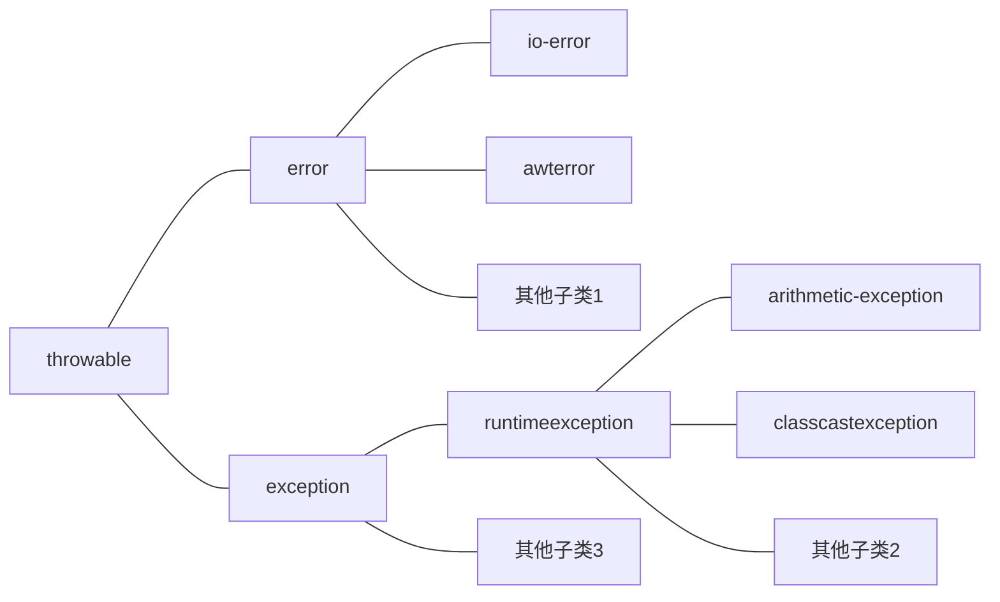
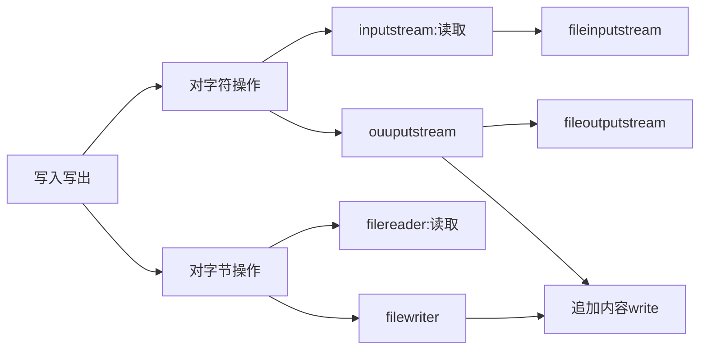

### java 版本

SE standard
EE empise
ME micro edition


```java
public class Example02 {
    public static void main(String[] args) {
        byte a;                // 定义byte类型的变量a
        int b = 298;          // 定义int类型的变量b
        a = (byte) b;
        System.out.println("b=" + b);
        System.out.println("a=" + a);
    }
}
```


变量b本身的值为298，然而在赋值给变量a后，a的值为42。出现这种现象的原因是，变量b为int类型，在内存中占用4个字节；byte类型的数据在内存中占用1个字节，当将变量b的类型强转为byte类型后，前面3个高位字节的数据丢失，数值发生改变。


### 重载

```java
// 下面的方法实现了两个整数相加
public static int add(int x, int y) {
	return x + y;
}
// 下面的方法实现了三个整数相加
public static int add(int x, int y, int z) {
	return x + y + z;
}
// 下面的方法实现了两个小数相加
public static double add(double x, double y) {
	return x + y;
}
```


### 基础

```java
int[] x;// 声明一个int[]类型的变量
x = new int[100];// 为数组x分配100个元素空间

//合并
int []x=new int[111];
```


```java
class Animal {
    public String toString(){ //toString为object中都有的
      return "这是一个动物。";
    }
}
```


Objecct是所有类的超类


用`.`来访问属性名或者方法名

#### boolean

```java
boolean flag = false;	 // 定义一个布尔型的变量flag，初始值为false
flag = true; 	 // 改变变量flag的值为true
```


### 访问级别递减

子类只能访问父类中public和protected修饰的属性和方法，父类中被默认修饰符default和private修饰的属性和方法不能被子类访问。

```java
public protected 可以被子类访问
default private 不可以被子类访问
```


　　1.public:表示公开的类和变量，既所有的类都可以引入使用的。

　　2.protected：表示受保护的类，只有子孙类和本类可以引入使用。

　　3.默认：表示同包中和本类中可以引入使用。

　　4.private：表示私人的，只有在本类中可以引入使用。


### 封装
```java
public class EncapTest{
   private String name;
   private String idNum;
   private int age;
   public int getAge(){
      return age;
   }
   public String getName(){
      return name;
   }
   public String getIdNum(){
      return idNum;
   }
   public void setAge( int newAge){
      age = newAge;
   }
   public void setName(String newName){
      name = newName;
   }
   public void setIdNum( String newId){
      idNum = newId;
   }
}
```


### 构造方法
```java
class MyClass {
  int x;
  // 以下是构造函数
  MyClass(int i ) { //名字和类名字一样
    x = i;
  }
}
```

构造方法的重载

```java
class MyClass {
    int x;
    int y;

    // 以下是构造函数
    MyClass(int i) { // 名字和类名字一样
        x = i;
        y = 0;
    }

    MyClass(int i, int y) { // 名字和类名字一样
        x = i;
        this.y = y;
    }
}
```

### 构造代码块

```java
{
   System.out.println("我是构造代码块");       //与构造方法同级
}
```
**构造块的执行顺序大于构造方法**

```java
public class Example {
    private int x;
    private int y;

    {
        x = 1;
        System.out.println("执行构造代码块1，x=" + x);
    }

    public Example() {
        x = 2;
        y = 3;
        System.out.println("执行构造方法，x=" + x + ",y=" + y);
    }

    {
        y = 4;
        System.out.println("执行构造代码块2，y=" + y);
    }

    public static void main(String[] args) {
        Example example = new Example();
    }
}

```


### static 静态属性
Java中的`static`关键字可以用来修饰变量、方法和代码块，它的作用是让这些成员在类加载时就被初始化，而不是等待对象被实例化后再进行初始化。

下面是`static`的几个具体用途：

1. 静态变量：所有对象共享同一份内存空间，不需要每个对象都创建一个副本。

```java
javaCopy codepublic class MyClass {
    public static int count = 0;

    public MyClass() {
        count++;
    }
}
```

上述代码中，每创建一个`MyClass`对象，都会使`count`的值加1。由于`count`是静态变量，所有对象共享同一个值，因此可以统计所有`MyClass`对象的个数。

1. 静态方法：不需要创建对象就可以直接使用类名调用，常用于工具类的编写。

```java
javaCopy codepublic class MathUtils {
    public static int add(int a, int b) {
        return a + b;
    }
}
```

上述代码中，`add`方法不需要创建`MathUtils`对象就可以直接使用，这样就可以方便地在其他类中调用该方法。

1. 静态代码块：在类加载时就执行，通常用于初始化静态变量或执行某些静态操作。

```java
javaCopy codepublic class Config {
    public static int timeout;

    static {
        timeout = Integer.parseInt(System.getProperty("timeout"));
    }
}
```

上述代码中，静态代码块在类加载时就会执行，通过读取系统属性来初始化`timeout`静态变量。


### 成员变量
```java
class Example {
    // 成员变量
    private int memberVariable;

    public void method() {
        // 局部变量
        int localVariable = 0;

        // 访问成员变量
        memberVariable = 1;

        // 访问局部变量
        localVariable = 2;
    }
}
```


### 继承
```java
class 父类{
  ……
 }
class 子类 extends 父类{
    可添加属性和方法
}
```


### 方法的重写
：在子类中重写
子类重写父类方法时，不能使用比父类中被重写的方法更严格的访问权限

### this 和 super

#### this关键字

this() 无参构造方法 ，也可以调用有参构造方法

```java
class Student {
    private String name;
    private int age;
    public Student () {
        System.out.println("调用了无参的构造方法");
    }
    public Student (String name,int age) {
        this();                  // 调用无参的构造方法
        this.name = name;
        this.age = age;
    }
    public String read(){
        return "我是:"+name+",年龄:"+age;
    }
}
public class Example11 {
    public static void main(String[] args) {
        Student stu = new Student("张三",18);    // 实例化 Student对象
        System.out.println(stu.read());
    }
}
```

#### super()

//放在第一行有效

##### 访问父类的属性和方法

super.属性
super.方法(参数1,参数2…)


##### super调用父类构造方法

super();
super(parameter1,parameter2);


一种需要注意的情况

```java
public class Main {

    public class Animal {
        private String name;

        public Animal(String name) {
            this.name = name;
        }

        public String getName() {
            return name;
        }
    }

    public class Dog extends Animal {
        private int age;

        public Dog(String name, int age) {
            super(name); // 调用父类Animal的构造方法来初始化name属性
            this.age = age;
        }

        public int getAge() {
            return age;
        }
    }
}

```

而下边的是错误的

why:在调用 `super(name)` 的地方注释掉了，而在下面用 `super.name = name` 直接给父类 `Animal` 的私有属性 `name` 赋值，这是不行的。因为父类 `Animal` 中的 `name` 属性是私有的，子类 `Dog` 无法直接访问该属性。

```java
public class Main {
    
    public class Animal {
        private String name;

        public Animal(String name) {
            this.name = name;
        }

        public String getName() {
            return name;
        }
    }

    public class Dog extends Animal {
        private int age;

        public Dog(String name, int age) {
            super.name=name;
            this.age = age;
        }

        public int getAge() {
            return age;
        }
    }
}

```


this和super不可以同时出现，因为使用this和super调用构造方法的代码都要求必须放在构造方法的首行。

this 与直接用方法名：
1.先找本类，如果有，则调用。
2.如果没有，则找父类（如果存在就调用）
3.如果父类没有就继续往上找。
super：
1.直接跳过本类的查找，调用父类的方法
2.如果父类没有，则继续往上找


### final
在 Java 中，`final` 关键字可以用于修饰变量、方法和类，其作用是表示不可改变、不可继承等。具体来说，其主要作用如下：

1. 对于变量，`final` 表示该变量只能被赋值一次，即常量，一旦被赋值，就不能再次修改。常量一般用大写字母表示。
2. 对于方法，`final` 表示该方法不能被子类重写（override）。
3. 对于类，`final` 表示该类不能被继承。

举例来说：在使用final声明变量时，变量的名称要求全部的字母大写。如果一个程序中的变量使用`public static final`声明，则此变量将成为全局常量
`public static final String NAME = "哈士奇";`


### 抽象类
```java
abstract class Animal { 
	abstract void shout(); 
}
class Dog extends Animal {
	void shout() {
	System.out.println("汪汪...");
	}
}

```

使用抽象类的场景

举例来说，如果我们有一个形状类 Shape，其中定义了一个抽象方法 getArea()，用于计算形状的面积。由于不同的形状的计算方式不同，所以 Shape 类本身不能提供 getArea() 的具体实现，我们需要定义子类来实现这个方法。这时候就可以将 Shape 设计为抽象类，定义 getArea() 方法为抽象方法，让子类来实现具体的计算方法。这样可以提高代码的规范性和模板性，同时也能够隐藏实现细节，提高代码的可读性和可维护性。


### 接口
有了抽象类为什么还有要有接口

尽管抽象类可以提供一些抽象方法供子类实现，但是抽象类本身还是可以实现一些方法的，也就是说抽象类和子类之间还存在着一定程度上的耦合关系。相比之下，接口更加抽象、独立，可以看作是一组规范，用于指定某一类实现所需要满足的方法和属性，而不会实现任何方法。

使用接口的好处主要包括以下几点：

1. 实现多重继承。Java中类只能单继承，但是一个类可以实现多个接口，从而达到类似于多重继承的效果。
2. 接口可以用于实现回调。回调是一种常见的编程模式，使用接口可以更方便地实现回调机制。
3. 接口可以提高代码的灵活性。使用接口可以将具体的实现和抽象规范分离，从而使代码更加灵活、可扩展。


### 多态
Java中多态主要有以下两种形式。

1. 方法重载
2. 方法重写
3. 抽象类和抽象方法
4. 接口

```java
abstract class Animal {  
  abstract void shout();     	// 定义抽象shout()方法
}
// 定义Cat类继承Animal抽象类
class Cat extends Animal {
 	// 实现shout()方法
	public void shout() {
		System.out.println("喵喵……");
	}
}
```


### 对象转型
对象向上转型

对象向上转型是指将子类对象赋值给父类引用变量的操作，这样做可以使子类对象具有父类对象的特征和行为，可以提高代码的灵活性和扩展性，是面向对象编程中常用的技术。

例如，假设有一个 Animal 类和一个 Dog 类，Dog 类是 Animal 类的子类。如果我们将一个 Dog 类的对象赋值给一个 Animal 类的引用变量，就可以进行对象的向上转型：

```
javaCopy code
Animal animal = new Dog();
```

这样做的好处是，我们可以在不知道对象的具体类型的情况下，调用 Animal 类中的方法，而这些方法在 Dog 类中也同样存在，可以被正确地执行。同时，如果需要增加其他的子类，只需要让它们继承自 Animal 类即可，这样代码的扩展性也会得到提高。

假设有一个动物园，其中有多种不同的动物，比如狗、猫、老虎等。它们都继承自一个基类 Animal，拥有一些共同的属性和方法，比如名字、年龄、叫声等。

现在需要对这些动物进行管理，比如喂食、清理笼子等。为了方便管理，可以定义一个 AnimalManager 类，其中定义一些方法，比如 feed、cleanCage 等。

由于不同的动物有不同的喂食方式和清理笼子的方法，所以 AnimalManager 类中的 feed 和 cleanCage 方法需要根据传入的动物类型进行不同的操作。这时就可以使用对象向上转型来实现多态。具体实现可以如下：

```
javaCopy codepublic class AnimalManager {
    public void feed(Animal animal) {
        // 根据不同的动物类型执行不同的喂食操作
        if (animal instanceof Dog) {
            Dog dog = (Dog) animal;
            dog.eatDogFood();
        } else if (animal instanceof Cat) {
            Cat cat = (Cat) animal;
            cat.eatCatFood();
        } else if (animal instanceof Tiger) {
            Tiger tiger = (Tiger) animal;
            tiger.eatMeat();
        }
    }

    public void cleanCage(Animal animal) {
        // 根据不同的动物类型执行不同的清理笼子操作
        if (animal instanceof Dog) {
            Dog dog = (Dog) animal;
            dog.cleanDogCage();
        } else if (animal instanceof Cat) {
            Cat cat = (Cat) animal;
            cat.cleanCatCage();
        } else if (animal instanceof Tiger) {
            Tiger tiger = (Tiger) animal;
            tiger.cleanTigerCage();
        }
    }
}
```

这样，通过对象向上转型，AnimalManager 类就可以处理不同类型的动物，从而实现多态。

对象向下转型

对象向下转型的主要用处是在需要访问子类独有的方法或属性时，将父类对象强制转换为子类对象，以便调用子类的方法和属性。在某些情况下，对象的具体类型可能是不确定的，但是可以根据运行时实际情况来确定对象的类型，并且在需要时进行转型，以便调用特定的方法和属性。

举个例子，假设有一个父类Animal和一个子类Dog，其中Dog具有额外的方法bark()，而Animal没有这个方法。在某些情况下，需要访问Dog的bark()方法，但是只有一个Animal对象的引用。此时，可以将Animal对象向下转型为Dog对象，以便调用bark()方法。

例如：

```
scssCopy codeAnimal animal = new Dog(); // 创建一个Dog对象并将其赋给Animal类型的引用
if (animal instanceof Dog) { // 判断animal是否为Dog类型
    Dog dog = (Dog) animal; // 将animal向下转型为Dog对象
    dog.bark(); // 调用Dog对象的bark()方法
}
```

需要注意的是，对象向下转型具有风险，因为如果尝试将一个对象强制转换为其不是的子类类型，可能会导致ClassCastException异常。因此，在进行对象向下转型时，应该使用instanceof运算符先检查对象的类型，以确保安全地进行转型。


### instanceof
`a2 instanceof Animal
返回true or false`
判断继承中的子类的实例是否为父类的实现。 也可以是接口


### 内部类
在类中定义类

在一个类中除了可以定义成员变量、成员方法，还可以定义类，这样的类被称作**成员内部类**

```c++
public class OuterClass {
    private String message = "Hello, world!";

    public class InnerClass {
        public void printMessage() {
            System.out.println(message);
        }
    }
    
    public static void main(String[] args) {
        OuterClass outer = new OuterClass();
        OuterClass.InnerClass inner = outer.new InnerClass();
        inner.printMessage();
    }
}
```


### 匿名内部类
Java中的匿名内部类是指没有名字的内部类，通常用于只需要使用一次的类定义。匿名内部类可以在创建对象时直接定义和使用，而不需要在外部类中单独定义一个内部类。

以下是一个匿名内部类的例子，用于实现一个接口的方法：

```java
typescriptCopy codepublic class Main {
    public static void main(String[] args) {
        // 创建一个实现了Runnable接口的匿名内部类
        Runnable r = new Runnable() {
            @Override
            public void run() {
                System.out.println("Hello from a Runnable!");
            }
        };
        
        // 启动线程
        Thread t = new Thread(r);
        t.start();
    }
}
```

在上面的例子中，我们创建了一个实现了Runnable接口的匿名内部类，并在其中重写了run()方法。然后，我们使用这个内部类创建了一个新的线程并启动它。

匿名内部类的语法比较特殊，我们使用一个接口或者抽象类来定义它，并且直接在后面跟上一对花括号，里面包含类的实现。这个实现通常是针对接口或抽象类中的某个方法或属性的。

匿名内部类的好处是可以使代码更加简洁，避免单独定义一个内部类。但它也有一些限制，例如不能定义构造函数，也不能定义静态变量或方法。


### 异常的所有类



### 异常处理

下面是一个简单的例子，演示了 **try-catch-finall**y 的使用：

```java
csharpCopy codepublic class Main {
    public static void main(String[] args) {
        int a = 10, b = 0;
        try {
            int c = a / b; // 除以 0 会抛出异常
            System.out.println(c);
        } catch (ArithmeticException e) {
            System.out.println("除数不能为0");
        } finally {
            System.out.println("程序结束");
        }
    }
}
```

catch代码块和finally代码块都是可选的，但**catch代码块和finally代码块至少要出现一个**
**catch代码块可以有多个**，但捕获父类异常的catch代码块必须位于捕获子类异常的catch代码块后面。

```java
public class Main {
    public static void main(String[] args) {
        try {
            int result = divide(4, 0);    //调用divide()方法
            System.out.println(result);
        } catch (Exception e) {            //对异常进行处理
            System.out.println("捕获的异常信息为：" + e.getMessage());
        }
        System.out.println("程序继续向下执行...");
    }
    //下面的方法实现了两个整数相除
    public static int divide(int x, int y) {
        int result = x / y;    //定义一个变量result记录两个数相除的结果
        return result;                 //将结果返回
    }
}

```

finally
由上图可知，在try…catch…finally语句中，不管程序是否发生异常，finally代码块中的代码都会被执行。需要注意的是，如果程序发生异常但是没有被捕获到，**在执行完finally代码块中的代码之后，程序会中断执行。**


throws
在实际开发中，大部分情况下我们会调用别人编写的方法，并不知道别人编写的方法是否会发生异常。针对这种情况，Java允许在方法的后面使用throws关键字声明该方法有可能发生的异常，这样调用者在调用方法时，就明确地知道该方法有异常，并且必须在程序中对异常进行处理，否则编译无法通过。

```java
public class Main {
    public static void main(String[] args) {
        int result = divide(4, 2);    //调用divide()方法
        System.out.println(result);
    }
    //下面的方法实现了两个整数相除，并使用throws关键字声明抛出异常
    public static int divide(int x, int y) throws Exception {
        int result = x / y;   //定义一个变量result记录两个数相除的结果
        return result;         //将结果返回
    }
}
```
报错 可以换成try catch捕获异常使之正确运行
注意：使用throws关键字重抛异常时，如果程序发生了异常，并且上一层调用者也无法
处理异常时，那么异常会继续被向上抛出，最终直到系统接收到异常，终止程序执行。

```java
public class Main {
    public static void main(String[] args) {
        //下面的代码定义了一个try…catch语句用于捕获异常
        try {
            int result = divide(4, 0);   //调用divide()方法
            System.out.println(result);
        } catch (Exception e) {                 //对捕获到的异常进行处理
            e.printStackTrace();   //打印捕获的异常信息
        }
        System.out.println("continue");
    }
    //下面的方法实现了两个整数相除，并使用throws关键字声明抛出异常
    public static int divide(int x, int y) throws Exception {
        int result = x / y;    //定义一个变量result记录两个数相除的结果
        return result;          //将结果返回
    }
}

```
对异常继续抛出
```java
public class Example06 {
	public static void main(String[] args)throws Exception {
		int result = divide(4, 0);   // 调用divide()方法
		System.out.println(result);
	}
    	// 下面的方法实现了两个整数相除，并使用throws关键字声明抛出异常
	public static int divide(int x, int y) throws Exception {
		int result = x / y;   // 定义一个变量result记录两个数相除的结果
		return result;         // 将结果返回
	}
}

```


throw
```java
public class Main {
    // 定义printAge()输出年龄
    public static void printAge(int age) throws Exception {
        if(age <= 0){
            // 对业务逻辑进行判断，当输入年龄为负数时抛出异常
            throw new Exception("输入的年龄有误，必须是正整数！");
        }else {
            System.out.println("此人年龄为："+age);
        }
    }

    public static void main(String[] args)  {
        // 下面的代码定义了一个try…catch语句用于捕获异常
        int age = -1;
        try {
            printAge(age);
        } catch (Exception e) {  // 对捕获到的异常进行处理
            System.out.println("捕获的异常信息为：" + e.getMessage());
        }
    }
}
```


自定义异常 
Java允许用户自定义异常类，自定义的异常类必须继承自Exception或其子类。


## String类


初始化
```java
init1
String str1 = null;   //将字符串str1设置为空
String str2 = "";     //将字符串str2设置为空字符串
String str3 = "abc"; //将字符串str3设置为abc
init2:
String str2 = new String("abcd");
// 创建一个字符数组
char[] charArray = new char[] { 'D', 'E', 'F' };
String str3 = new String(charArray);
// 创建一个字节数组
import java.util.*;
public class Main{
    public static void main(String[] args) {
        byte[] byteArray = {97,98,99};
        String str3 = new String(byteArray);
        System.out.println(str3); //abc
    }
}
```

+字符串连接符
在Java程序中，如果“+”的两边操作数中有一个为String类型，那么“+”就表示字符串连接运算符。


String 方法

```java

常用方法
valueOf(基础数据类型 b) 
    将基础类型数据的文本转换为字符串
substring(int beginIndex) 
    切割原字符串，返回一个新的字符串，
    beginIndex：表示从下标为几的地方开始切割
replace(char oldChar, char newChar) 
    返回一个新的字符串，它是通过用 newChar 替换此字符串中出现的所有 oldChar 得到的。
trim() 
    返回字符串的副本，忽略前导空白和尾部空白。
isEmpty() 
    当且仅当 length() 为 0 时返回 true。
toLowerCase() 
    将此 String 中的所有字符都转换为小写。
toUpperCase() 
    将此 String 中的所有字符都转换为大写。

查询
charAt(int index) 
    获取指定索引处的 char 值。没有则为null
indexOf(string) 
    返回指定字符在此字符串中第一次出现处的索引。没有则为0
lastIndexOf(int ch) 
    返回指定字符在此字符串中最后一次出现处的索引。
lastIndexOf(int ch, int fromIndex) 
    返回指定字符在此字符串中最后一次出现处的索引，从指定的索引处开始进行反向搜索。
contains(CharSequence s) 
    判断字符串是否包含指定的 char 值，有则返回 true。
    
比较
equals(Object anObject) 
    将此字符串与指定的对象比较。
equalsIgnoreCase(String anotherString) 
    将此 String 与另一个 String 比较，不考虑大小写。
判断开头结尾
endsWith(String suffix) 
    判断此字符串是否以指定的后缀结束。
startsWith(String prefix) 
    判断此字符串是否以指定的前缀开始。
    
转换
format(Locale l, String format, Object... args) 
    格式字符串和参数返回一个格式化字符串。
getBytes(String charset) 
    将string转换为byte 数组
getChars(int srcBegin, int srcEnd, char[] dst, int dstBegin) 
    将string转换为字符数组
toCharArray() 
    将此字符串转换为一个新的字符数组。

正则表达式
matches(String regex) 
    判断此字符串是否匹配给定的正则表达式。
replaceAll(String regex, String replacement) 
    使用给定的 replacement 替换此字符串所有匹配给定的正则表达式的子字符串。
replaceFirst(String regex, String replacement) 
    使用给定的 replacement 替换此字符串匹配给定的正则表达式的第一个子字符串。
split(String regex) 
    根据给定正则表达式的匹配拆分此字符串。
```


#### ==和equal

equals()方法用于比较两个字符串内容是否相等，==方法用于比较两个字符串对象的地址是否相同。


### StringBuffer

在Java中，因为String类是final类型的，所以使用String定义的字符串是一个常量，也就是说使用String定义的字符串一旦创建，其内容和长度是不可改变的。为了便于对字符串进行修改，Java提供了StringBuffer类（也称字符串缓冲区）来操作字符串。StringBuffer类和String类最大的区别在于它的内容和长度都是可以改变的。StringBuffer类似一个字符容器，当在其中添加或删除字符时，所操作的都是这个字符容器，因此并不会产生新的StringBuffer对象。


StringBuffer 方法
```java
insert(int offset, 基础类型数据 b) 
        将基础类型参数的字符串表示形式插入指定位置中。
    	import java.util.*;
        public class Main{
            public static void main(String[] args) {
                StringBuffer stringBuffer=new StringBuffer();
                stringBuffer.insert(0,"0000");
                stringBuffer.insert(1,"1111");
                System.out.println(stringBuffer);
            }
        }
StringBuffer(String str) 
        构造一个字符串缓冲区，并将其内容初始化为指定的字符串内容。
append(基础类型数据 b) 
        将 基础类型的字符串表示形式追加到序列后面。
charAt(int index) 
        返回此序列中指定索引处的 char 值。
delete(int start, int end) 
        移除此序列的子字符串中的字符。
deleteCharAt(int index) 
        移除此序列指定位置的 char。
toString() 
        返回此序列中数据的字符串表示形式。
```


### System 类别

```java
exit();
gc(); //垃圾回收
currentTimeMillis();
arraycopy(Object src,int srcPos,Object dest,int destPos,int length)//拷贝数组
static Properties getProperties() //获取系统属性
static String getProperty(String key)
```

### Math

```java
abs
ceil
floor
round//四舍五入
sqrt
pow
PI
Math.max(1,2,3) 
min
Math.random()获取0~1之间的随机数
Math.random()*10 0-10之间的随机数
```

### Random

```java
Random()
Random(long seed)

nextBoolean()
nextDouble()
nextFloat()
nextInt()
nextInt(n) 1-n之间的随机数
nextLong()
```

### BigInteger 大整数

```java
num1=new BigInteger(sc.next()); 初始化
BigInteger abs()  返回大整数的绝对值
BigInteger add(BigInteger val) 返回两个大整数的和
BigInteger and(BigInteger val)  返回两个大整数的按位与的结果
BigInteger andNot(BigInteger val) 返回两个大整数与非的结果
BigInteger divide(BigInteger val)  返回两个大整数的商
double doubleValue()   返回大整数的double类型的值
float floatValue()   返回大整数的float类型的值
BigInteger gcd(BigInteger val)  返回大整数的最大公约数
int intValue() 返回大整数的整型值
long longValue() 返回大整数的long型值
BigInteger max(BigInteger val) 返回两个大整数的最大者
BigInteger min(BigInteger val) 返回两个大整数的最小者
BigInteger mod(BigInteger val) 用当前大整数对val求模
BigInteger multiply(BigInteger val) 返回两个大整数的积
BigInteger negate() 返回当前大整数的相反数
BigInteger not() 返回当前大整数的非
BigInteger or(BigInteger val) 返回两个大整数的按位或
BigInteger pow(int exponent) 返回当前大整数的exponent次方
BigInteger remainder(BigInteger val) 返回当前大整数除以val的余数
BigInteger leftShift(int n) 将当前大整数左移n位后返回
BigInteger rightShift(int n) 将当前大整数右移n位后返回
BigInteger subtract(BigInteger val)返回两个大整数相减的结果
byte[] toByteArray(BigInteger val)将大整数转换成二进制反码保存在byte数组中
String toString() 将当前大整数转换成十进制的字符串形式
BigInteger xor(BigInteger val) 返回两个大整数的异或

```

### BigDecimal 大双精度 十进制小数

```java
add(BigDecimal): BigDecimal对象中的值相加，返回BigDecimal对象
subtract(BigDecimal): BigDecimal对象中的值相减，返回BigDecimal对象
multiply(BigDecimal): BigDecimal对象中的值相乘，返回BigDecimal对象
divide(BigDecimal): BigDecimal对象中的值相除，返回BigDecimal对象
toString(): 将BigDecimal对象中的值转换成字符串
doubleValue(): 将BigDecimal对象中的值转换成双精度数
floatValue(): 将BigDecimal对象中的值转换成单精度数
longValue(): 将BigDecimal对象中的值转换成长整数
intValue(): 将BigDecimal对象中的值转换成整数
a.max (b) 比较取最大值
a.min(b) 比较取最小值
a.abs() 取最绝对值
negate(): 取相反数
```


## 日期与时间

Data
Calender
Instant
Local Date
LocalTime类与LocalDateTime类
Duration类与Period类


### Calender

```java
Calendar calendar = Calendar.getInstance();
int get(int field)	返回指定日历字段field的值 
void add(int field,int amount) 	根据日历规则，为指定的日历字段增加或减去指定的时间量 
void set(int field,int value)	将指定日历字段field的值设置为value 
void set(int year,int month,int date)	设置Calendar对象的年、月、日三个字段的值
void set(int year.int month,int date,int hourOfDay,int minute,int second)	设置Calendar对象的年、月、日、时、分、秒六个字段的值
```

### field

表中的大多数方法都用到了int类型的参数field，该参数需要接收Calendar类中定义的常量值，这些常量值分别表示不同的字段，Calendar类常用的常量值如下所示。
```java

Calendar.YEAR：用于获取当前年份。
Calendar.MONTH：用于获取当前月份，需要注意的是，在使Calendar.MONTH
             字段时，月份的起始值是从0开始的，而不是从1开始，因此要获取当前的月
             需要在Calendar.MONTH的基础上加1。
Calendar.DATE：用于获取当前日。
Calendar.HOUR：用于获取时。
Calendar.MINUTE：用于获取分。
Calendar.SECOND：用于获取秒。
```


例子
```java
import java.util.*;
public class Example21 {
          public static void main(String[] args) {
          	// 获取表示当前时间的Calendar对象
 	Calendar calendar = Calendar.getInstance();
 	int year = calendar.get(Calendar.YEAR);        // 获取当前年份
 	int month = calendar.get(Calendar.MONTH) + 1; // 获取当前月份
 	int date = calendar.get(Calendar.DATE);        // 获取当前日
 	int hour = calendar.get(Calendar.HOUR);        // 获取时
 	int minute = calendar.get(Calendar.MINUTE);   // 获取分
 	int second = calendar.get(Calendar.SECOND);   // 获取秒
 	System.out.println("当前时间为:" + year + "年 " + month + "月 " 
 	          + date + "日 "+ hour + "时 " + minute + "分 " + second + "秒");
          }
}
```


set 和 add
```java
import java.util.*;
public class Example22 {
          public static void main(String[] args) {
	Calendar calendar = Calendar.getInstance();// 获取表示当前时间的Calendar对象
	calendar.set(2021, 1, 1);// 设置指定日期
	calendar.add(Calendar.DATE, 100);// 为指定日期增加时间
	int year = calendar.get(Calendar.YEAR);// 返回指定日期的年
	int month = calendar.get(Calendar.MONTH) + 1;// 返回指定日期的月
	int date = calendar.get(Calendar.DATE);// 返回指定日期的日
	System.out.println("计划竣工日期为:" + year + "年" + month + "月" + date + "日");
         }
}
```

日期与时间格式化类
q


数字格式化类
q

包装类
q


## pattern

Pattern类用于创建一个正则表达式，也可以说创建一个匹配模式
`Pattern p = Pattern.compile("\\w+");`

```java
static Pattern compile(String re)	将正则表达式编译为模式
Matcher matcher(CharSequence input)	根据模式为字符串input创建匹配器。String类实现了CharSequence接口，CharSequence接口可视为String
Static boolean matches(String regex, CharSequence input)	判断字符串input是否匹配正则表达式regex。该方法适合于只进行一次匹配情况
String pattern()	返回模式使用的正则表达式
String[] split(CharSequence input)	根据模式将字符串input分割为字符串数组
String[] split(CharSequence input,int limit)	根据模式将字符串input分割为字符串数组，同时指定了子串的最大个数为limit

```

Matcher 依据 pattern 对象进行匹配


## 集合 
长度可变，可以存储不同数据类型的动态数组


ALL
> Collection
集合中最基本的接口，用于存储一组无序、不唯一的对象，一般不直接使用该接口
**List**
Collection的子接口，用于存储一组**无序、不唯一**的对象，是集合中常用的接口之一
**Set**
Collection的子接口，用于存储一组**无序、唯一**的对象
Map
用于存储一组键值对象，提供键到值的映射


### 所有Collection满足的

```java
boolean add(Object o) 向集合中添加一个元素
boolean addAll(Collection c)将指定集合c中的所有元素添加到本集合中
void clear()
boolean remove(Object o)
boolean removeAll(Collection c)删除当前集合中包含集合c中的所有元素
boolean isEmpty()
boolean contains(Object o)判断集合中是否包含某个元素
boolean containsAll(Collection c)判断集合中是否包含指定集合c中的所有元素
Iterator iterator()返回集合的的迭代器(Iterator)，迭代器用于遍历该集合所有元素
int size() 元素个数
```


#### Tree 可排序

#### link存取一致


## list

List接口实例中存储的元素是有序的，即元素的**存入顺序和取出顺序一致**
不但继承了Collection接口中的全部方法，而且还增加了一些根据元素索引操作集合的特有方法。

```java
void add(int index,Object element) 将元素element插入List的index索引处
boolean addAll(int index,Collection c) 将集合c所包含的所有元素插入到List集合的index索引处
Object get(int index)返回集合index索引处的元素
Object remove(int index)删除index索引处的元素
Object set(int index, Object element) 将index索引处元素替换成element对象，并将替换后的元素返回
int indexOf(Object o) 返回对象o在List中第一次出现的位置索引
int lastIndexOf(Object o)  返回对象o在List中最后一次出现的位置索引
List subList(int fromIndex, int toIndex) 返回从索引fromIndex（包括）到 toIndex（不包括）处所有元素集合组成的子集合
```


#### ArrayList 

ArrayList集合看作一个长度可变的数组。
底层是数组,不适合做增删

```java
import java.util.*;
public class Main {
    public static void main(String[] args) {
        ArrayList list = new ArrayList(); // 创建ArrayList集合
        list.add("张三");                     // 向集合中添加元素
        list.add("李四");
        list.add("王五");
        list.add("赵六");
        System.out.println("集合的长度：" + list.size());       //获取集合中元素的个数
        System.out.println("第2个元素是：" + list.get(1));    //取出并打印指定位置的元素
        list.remove(3);        			        //删除索引为3的元素
        System.out.println("删除索引为3的元素:"+list);
        list.set(1,"李四2");                                                     //替换索引为1的元素为李四2
        System.out.println("替换索引为1的元素为李四2:"+list);
    }
}
//集合和数组一样，索引的取值范围是从0开始的，最后一个索引是size-1
```


#### LinkedList

LinkedList集合内部维护了一个**双向循环链表**，链表中的每一个元素都使用引用的方式记录它的前一个元素和后一个元素，从而可以将所有的元素彼此连接起来。当插入一个新元素时，只需要修改元素之间的引用关系即可，删除一个节点也是如此。正因为这样的存储结构，所以LinkedList集合**增删效率非常高。**

```java
void add(int index, E element) 在集合的index索引处插入element元素
void addFirst(Object o)将指定元素o插入此集合的开头
void addLast(Object o)
Object getFirst()
Object getLast()
Object removeFirst()
Object removeLast()
boolean offer(Object o) 将指定元素o添加到集合的结尾
boolean offerFirst(Object o)将指定元素o添加到集合的开头
boolean offerLast(Object o)将指定元素o添加到集合的结尾
Object peekFirst()获取集合的第一个元素
Object peekLast()获取集合的最后一个元素
Object pollFirst()移除并返回集合的第一个元素
Object pollLast()移除并返回集合的最后一个元素
void push(Object o)将指定元素o添加到集合的开头
```
```java
import java.util.*;
public class Main {
    public static void main(String[] args) {
        LinkedList link = new LinkedList();   // 创建LinkedList集合
        link.add("张三");
        link.add("李四");
        link.add("王五");
        link.add("赵六");
        System.out.println(link.toString()); // 获取并打印该集合中的元素
        link.add(3, "Student");     // 向link集合中索引3处插入元素Student
        link.addFirst("First");     // 向link集合第一个位置插入元素First
        System.out.println(link);
        System.out.println(link.getFirst()); // 取出link集合中第一个元素
        link.remove(3);               // 移除link集合中指定索引位置为3的元素
        link.removeFirst();          // 移除link集合中第一个元素
        System.out.println(link);
    }
}
```


## set（去重）


**无序 不重复 单一**
与Collection接口中的方法基本一致，并没有对Collection接口进行功能上的扩充
实现类有3个，分别是HashSet、LinkedHashSet、TreeSet
HashSet根据对象的哈希值来确定元素在集合中的存储位置， 具有良好的存取和查找性能；LinkedHashSet是链表和哈希表组合的一个数据存储结构；TreeSet则是以二叉树的方式存储元素，它可以对集合中的元素进行排序。


### HashSet

当向HashSet集合中添加一个元素时，首先会调用该元素的hashCode()方法来确定元素的存储位置，然后再调用元素对象的equals()方法来确保该位置没有重复元素。Set集合与List集合存取元素的方式都一样，但是Set集合中的元素是无序的。


```java
import java.util.*;
public class Main {
    public static void main(String[] args) {
        HashSet hset = new HashSet();   // 创建HashSet集合
        hset.add("张三");                  // 向该Set集合中添加字符串
        hset.add("李四");
        hset.add("王五");
        hset.add("李四");                  // 向该Set集合中添加重复元素
        Iterator it = hset.iterator();  // 获取Iterator对象
        while (it.hasNext()) {  // 通过while循环，判断集合中是否有元素
            Object obj = it.next();// 如果有元素，就调用迭代器的next()方法获取元素
            System.out.println(obj);
        }
    }
}
//out
李四
张三
王五
```
advance
```java
import java.sql.Struct;
import java.util.*;
class Main{
    public static void main(String[] args) {
        HashSet hashSet=new HashSet();
        Student student1=new Student(1,"zhangsan");
        Student student2=new Student(2,"lisi");
        Student student3=new Student(2,"lisi");
        hashSet.add(student1);
        hashSet.add(student2);
        hashSet.add(student3);
        System.out.println(hashSet);
    }
}
class Student{
    int id;
    String name;

    public Student(int id, String name) {
        this.id = id;
        this.name = name;
    }

    public String toString(){
        return id+":"+name;
    }
}
[2:lisi, 1:zhangsan, 2:lisi]

//出现重复的原因:没有重写hasCode()和equal()方法

```
重写hasCode()和equal()方法
```java
import java.sql.Struct;
import java.util.*;
class Main{
    public static void main(String[] args) {
        HashSet hashSet=new HashSet();
        Student student1=new Student(1,"zhangsan");
        Student student2=new Student(2,"lisi");
        Student student3=new Student(2,"lisi");
        Student student4=new Student(3,"lisi");
        hashSet.add(student1);
        hashSet.add(student2);
        hashSet.add(student3);
        hashSet.add(student4);
        System.out.println(hashSet);
    }
}
class Student{
    int id;
    String name;

    public Student(int id, String name) {
        this.id = id;
        this.name = name;
    }

    public String toString(){
        return id+":"+name;
    }

    @Override
    public boolean equals(Object o) {
        if (this == o) return true; //同一个对象
        if (o == null || getClass() != o.getClass()) return false;  //不同对象不同类
        Student student = (Student) o;   //传进来的是object，转换一下，有利于之后对比
        return this.id==student.id || this.name.equals(student.name);
    }

    @Override
    public int hashCode() {
        return Objects.hash(id, name);
    }
}
```


### LinkedHashSet（存取一致）

使用方法与上述一样,但是**迭代出来的顺序和输入是一致**的


**TreeSet**
它内部采用平衡二叉树来存储元素,这样的结构可以保证TreeSet集合中没有重复的元素，并且可以对元素进行排序
会自动排序
其中左子树上的元素小于它的根结点，而右子树上的元素大于它的根结点。
```java
Object first()返回TreeSet集合的首个元素
Object last()返回TreeSet集合的最后一个元素
Object lower(Object o)返回TreeSet集合中小于给定元素的最大元素，如果没有返回null
Object floor(Object o) 小于等于
Object higher(Object o) 大于
Object ceiling(Object o) 大于等于
Object pollFirst() 移除并返回集合的第一个元素
Object pollLast() 移除并返回集合的最后一个元素
```


## Map（一对）
它的每个元素都包含一个键对象**Key和值对象Value**，键和值对象之间存在一种对应关系，称为映射
Map中键对象Key不允许重复，访问Map集合中的元素时，只要指定了Key，就能找到对应的Value。

```java
void put(Object key, Object value) 将指定的值和键存入到集合中，并进行映射关联
Object get(Object key) 返回指定键所映射的值；如果此映射不包含该键的映射,返回null;
void clear() 移除所有的键值对元素
V remove(Object key) 根据键删除对应的值，返回被删除的值
int size() 返回集合中的键值对的个数
boolean containsKey(Object key) 如果此映射包含指定键的映射关系，则返回 true。
boolean containsValue(Object value) 如果此映射将一个或多个键映射到指定值，则返回 true
Set keySet() 返回此映射中包含的键的Set集合
Collection<V> values() 返回此映射中包含的值的Collection集合
Set<Map.Entry<K,V>>entrySet() 返回此映射中包含的映射关系的Set集合
```


### HashMap
HashMap集合用于存储键值映射关系，但HashMap集合没有重复的键并且键值无序。

```java
import java.util.*;
public class Main {
    public static void main(String[] args) {
        Map map = new HashMap(); // 创建HashMap对象
        map.put("1", "张三");          // 存储键和值
        map.put("2", "李四");
        map.put("3", "王五");
        System.out.println("1：" + map.get("1"));  // 根据键获取值
        System.out.println("2：" + map.get("2"));
        System.out.println("3：" + map.get("3"));
    }
}
//添加map.put("3", "赵六");
//发现原来的被覆盖
```


### LinkedHashMap（存取一致）
HashMap集合迭代出来元素的顺序和存入的顺序是不一致的。如果想让这Map集合中的元素迭代顺序与存入顺序一致，可以使用LinkedHashMap集合，


#### 

### TreeMap

Map接口还有了另一个可以对集合中元素键和值进行排序的实现类TreeMap。

```java
import java.util.*;
public class Main {
    public static void main(String[] args) {
        Map map = new TreeMap();      // 创建TreeMap集合
        map.put(3, "李四");                  // 存储键和值
        map.put(2, "王五");
        map.put(4, "赵六");
        map.put(3, "张三");
        Set keySet = map.keySet();
        Iterator it = keySet.iterator();
        while (it.hasNext()) {
            Object key = it.next();
            Object value = map.get(key); // 获取每个键所对应的值
            System.out.println(key+":"+value);
        }
    }
}
//out
2:王五
3:张三
4:赵六
```
按键值排序，在该案例中，键是自定义类，值是String类
```java
package com.itheima;

import java.util.Comparator;
import java.util.Iterator;
import java.util.Set;
import java.util.TreeMap;

class Student {
    private String name;
    private int age;
    public String getName() {
        return name;
    }
    public void setName(String name) {
        this.name = name;
    }
    public int getAge() {
        return age;
    }
    public void setAge(int age) {
        this.age = age;
    }
    public Student(String name, int age) {
        super();
        this.name = name;
        this.age = age;
    }
    @Override
    public String toString() {
        return "Student [name=" + name + ", age=" + age + "]";
    }
}

public class Example20 {
    public static void main(String[] args) {
        TreeMap tm = new TreeMap(new Comparator<Student>() {
        @Override
        public int compare(Student s1, Student s2) {
            int num = s1.getName().compareTo(s2.getName());//按照姓名比较
            return num == 0 ? num:s1.getAge() - s2.getAge();
        }
        });
        tm.put(new Student("张三", 23), "北京");
        tm.put(new Student("李四", 13), "上海");
        tm.put(new Student("赵六", 43), "深圳");
        tm.put(new Student("王五", 33), "广州");
        Set keySet = tm.keySet();
        Iterator it = keySet.iterator();
        while (it.hasNext()) {
            Object key = it.next();
            Object value = tm.get(key); // 获取每个键所对应的值
            System.out.println(key+":"+value);
        }
    }
}

```


#### Treeset

TreeSet的底层是**TreeMap**，去掉重复的元素，key的重复不会再搜索树中出现

TreeSet继承了Set

#### 自然排序

自然排序要求向TreeSet集合中存储的元素所在类必须实现Comparable接口，并重写compareTo()方法，然后TreeSet集合就会对该类型元素使用compareTo()方法进行比较。


#### entrySet
```java
import java.util.*;
public class Main {
    public static void main(String[] args) {
        Map map = new HashMap();         // 创建HashMap集合
        map.put("1", "张三");       		// 存储键和值
        map.put("2", "李四");
        map.put("3", "王五");
        Set entrySet = map.entrySet();
        Iterator it = entrySet.iterator();              // 获取Iterator对象
        while (it.hasNext()) {
            // 获取集合中键值对映射关系
            Map.Entry entry = (Map.Entry) (it.next());
            Object key = entry.getKey();     // 获取Entry中的键
            Object value = entry.getValue();// 获取Entry中的值
            System.out.println(key + ":" + value);
        }
    }
}

```


#### Properties
Hashtable类有一个很重要的子类Properties，应用非常广泛。Properties主要用于存储字符串类型的键和值，在实际开发中，经常使用Properties集合存储应用的配置项。

```java
package com.itheima;

import java.util.Enumeration;
import java.util.Properties;

public class Example21 {
    public static void main(String[] args) {
        Properties p=new Properties();         // 创建Properties对象
        p.setProperty("Backgroup-color", "red");
        p.setProperty("Font-size", "14px");
        p.setProperty("Language", "chinese");
        Enumeration names = p.propertyNames();//获取Enumeration对象所有键枚举
        while(names.hasMoreElements()){        //循环遍历所有的键
            String key=(String) names.nextElement();
            String value=p.getProperty(key);   // 获取对应键的值
            System.out.println(key+" = "+value);
        }
    }
}

```


#### 遍历


#### Iterator
```java
import java.util.*;
public class Main {
    public static void main(String[] args) {
        ArrayList list = new ArrayList(); // 创建ArrayList集合
        list.add("张三");                     // 向该集合中添加字符串
        list.add("李四");
        list.add("王五");
        list.add("赵六");
        Iterator it = list.iterator(); // 获取Iterator对象
        while (it.hasNext()) {           // 判断ArrayList集合中是否存在下一个元素
            System.out.println(it.next());
        }
    }
}
```
注意:在使用Iterator迭代器对集合中的元素进行迭代时，如果调用了集合对象的remove()方法删除元素，之后继续使用迭代器遍历元素，会出现异常。
出现异常的原因是集合在迭代器运行期间删除了元素，会导致迭代器预期的迭代次数发生改变，迭代器的迭代结果不准确。要解决上述问题，有两种方式可以采用。
```java
if ("张三".equals(obj)) {
	list.remove(obj);
	break;
}
```
在使用break语句跳出循环以后，由于没有继续使用迭代器对集合中的元素进行迭代，所以集合中删除元素对程序没有任何影响，就不会再出现异常。
迭代器本身的删除方法，将案例代码“list.remove(obj);”替换成it.remove()即可解决这个问题，代码如下。
```java
if ("张三".equals(obj)) {
	it.remove();
}
```


#### foreach
用于遍历数组或集合中的元素
只能访问集合中的元素，**不能**对其中的元素进行修改。
```java
import java.util.*;
public class Main {
    public static void main(String[] args) {
        ArrayList list = new ArrayList(); // 创建ArrayList集合
        list.add("张三");                          // 向ArrayList集合中添加字符串元素
        list.add("李四");
        list.add("王五");
        for (Object obj : list) {	  // 使用foreach循环遍历ArrayList对象
            System.out.println(obj);// 取出并打印ArrayList集合中的元素
        }
    }
}
```


#### 工具类

#### Collections
不需要new
```java
static <T> boolean addAll(Collection<? super T> c, T...    elements)将所有指定元素添加到指定集合c中
static void reverse(List list) 反转指定List集合中元素的顺序
static void shuffle(List list)随机打乱List集合中元素的顺序
static void sort(List list)根据元素的自然顺序（从小到大）对List集合中的元素进行排序
static void swap(List list,int i,int j)将指定List集合中索引为i的元素和索引为j的元素进行交换
```
```java
package com.itheima;

import java.util.ArrayList;
import java.util.Collections;

public class Example22 {
    public static void main(String[] args) {
        ArrayList<String> list = new ArrayList<>();
        Collections.addAll(list, "C","Z","B","K");    // 添加元素
        System.out.println("排序前: " + list);
        Collections.reverse(list);                       // 反转集合
        System.out.println("反转后： " + list);
        Collections.sort(list);                           // 按自然顺序排列
        System.out.println("按自然顺序排序后: " + list);
        Collections.shuffle(list);                       // 随机打乱集合元素
        System.out.println("按随机顺序排序后:  " + list);
        Collections.swap(list, 0, list.size()-1);     // 将集合首尾元素交换
        System.out.println("集合首尾元素交换后: " + list);
    }
}

```


#### 查找替换
```java
static int binarySearch(List list,Object key)使用二分法搜索指定对象在List集合中的索引，要求查找的List集合中的元素必须是有序的
static Object max(Collection col)根据元素的自然顺序，返回给定集合中最大的元素
static Object min(Collection col)根据元素的自然顺序，返回给定集合中最小的元素
static boolean replaceAll(List list,Object oldVal,Object newVal)用一个新值newVal替换List集合中所有的旧值oldVal
```
```java
package com.itheima;
import java.util.ArrayList;
import java.util.Collections;
public class Example23 {
    public static void main(String[] args) {
        ArrayList<Integer> list = new ArrayList<>();
        Collections.addAll(list, -3,2,9,5,8);// 向集合中添加所有指定元素
        System.out.println("集合中的元素: " + list);
        System.out.println("集合中的最大元素: " + Collections.max(list));
        System.out.println("集合中的最小元素: " + Collections.min(list));
        Collections.replaceAll(list, 8, 0); // 将集合中的8用0替换掉
        System.out.println("替换后的集合: " + list);
        Collections.sort(list);               //使用二分查找前，必须保证元素有序
        System.out.println("集合排序后为： "+list);
        int index = Collections.binarySearch(list, 9);
        System.out.println("集合通过二分查找方法查找元素9所在索引为："+index);
    }
}
```


#### Arrays工具类
```java
printArray(arr);                    // 打印原数组
		Arrays.sort(arr);                   // 调用Arrays的sort()方法排序

```


```java
binarySearch(Object[] a, Object key);
copyOfRange(int[] original, int from,int to);
//to最后索引
fill(Object[] a,Object val); 使用fill()方法替换元素
Arrays.fill(arr, 8);       // 用8替换数组中的每个元素
```


#### Lambda表达式
Lambda表达式由**参数列表**、**箭头符号 ->** 和**方法体**组成。方法体既可以是一个表达式，也可以是一个语句块。


#### 泛型

#### 引入
也是一个小的原因:
把一个对象存入集合后，再次取出该对象时，该对象的编译类型就变成了Object类型(尽管其在运行时类型没有改变
不重要,补充上述
```java
public class Example01{
    public static void main(String[] args) {
        // 创建一个只保存Integer类型的List集合
        List intList = new ArrayList();
        intList.add(1);
        intList.add(2);
        //因为失误存放了Integer类型之外的字符串数据
        intList.add("3");
        for (int i = 0; i < intList.size(); i++) {
            /*因为List里面默认取出的全部Object对象，所以使用之前需要进行强
            * 制类型转换。集合内最后一个元素进行转换时候将出现类型转换异常
            * */
            Integer num=(Integer)intList.get(i);
        }
    }
}

public class Example03 {
    public static void main(String[] args) {
        // 创建一个只保存Integer类型的List集合
        List<Integer> intList = new ArrayList<Integer>();
        intList.add(1);
        intList.add(2);
        //下面代码将出现编译时异常
        intList.add("3");
        for (int i = 0; i < intList.size(); i++) {
            //下面的代码无需强制类型转换
            Integer num=intList.get(i);
        }
    }
}

```


将具体的类型形参化  泛型的声明由一对尖括号和类型形参组成


#### 使用泛型的好处
将类型的检查从运行期提前到编译期
消除强制类型转换
提高代码复用性
拥有更高的运行效率

使用泛型之前，传入的实际参数值作为Object类型传递时，需要进行封箱和拆箱操作，会消耗程序的一定的开销。使用泛型后，类型形参中都需要使用引用数据类型，即传入的实际参数的类型都是对应引用数据类型，避免了封箱和拆箱操作，降低了程序运行的开销，提高了程序运行的效率。


#### 一些约定
上述语法格式中，类名《《类型形参变量》》是一个整体的数据类型，通常称为泛型类型；类型形参变量，没有特定的意义，可以是任意一个字母，但是为了提高可读性，建议使用有意义的字母。一般情况下使用较多的字母及意义如下所示。
E：表示Element（元素），常用在java Collection里使用，如	List<E>,Iterator<E>,Set<E>。
K，V：表示Key，Value（Map的键值对）。
N：表示Number（数字）。
T：表示Type（类型），如String，Integer等.


``` java
// 定义泛型类Person
class Person<T> {
            private T info;
            public Person(T info) {
this.info = info;
}
public T getInfo() {
  return info;
}
}
```


#### 简单例子

```java
package com.itheima;

// 定义泛型类Goods
class Goods<T> {
    // 类型形参变量作用于属性的类型
    private T info ;
    // 类型形参变量作用于构造方法的参数类型
    public Goods(T info) {
        this.info = info;
    }  //构造
    // 类型形参变量作用于方法的参数类型
    public void setInfo(T info){
        this.info = info ;
    }
    // 类型形参变量作用于方法的返回值类型
    public T getInfo(){
        return this.info ;
    }
}

public class Example04 {
    public static void main(String[] args) {
        // 创建Godds对象
        Goods goods = new Goods<Integer>(666);
        System.out.println(goods.getInfo()+"..."+goods.getInfo().getClass());
        goods.setInfo("热卖商品");
        System.out.println(goods.getInfo()+"..."+goods.getInfo().getClass());
    }
}
```


#### 泛型接口
`public interface Inter<T>`


##### 使用泛型类实现泛型接口
`public class InterImpl<T> implements Inter<T> {`
Inter对象时，传入不同的类型实参
`Inter<String> inter = new InterImpl();`


#### 泛型方法


```java
public class Example07 {
	public static void main(String[] args) {
        // 使用方式一调用静态的泛型方法
        Student.staticMethod("staticMethod");
        // 使用方式二调用静态的泛型方法
        Student.<String>staticMethod("staticMethod");
        Student stu = new Student();
        // 使用方式一调用普通的泛型方法
        stu.otherMethod(666);
       // 使用方式二调用普通的泛型方法
        stu.<Integer>otherMethod(666);
    }
}

```


#### 类型通配符

？或者不写


定义泛型类Person，声明私有变量info，定义有参构造方法和getter方法。代码如下所示：


#### 上限和下限

`<? extends 类 > `  指定的类型及其子类
`<? super 类 >  ` 设定的类型及其父类型


#### IO操作


文件操作
```java
File(String pathname)	通过指定的一个字符串类型的文件路径来创建一个新的File对象
File(String parent,String child)	根据指定的一个字符串类型的父路径和一个字符串类型的子路径（包括文件名称）创建一个File对象
File(File parent,String child)	根据指定的File类的父路径和字符串类型的子路径（包括文件名称）创建一个File对象
boolean exists()	判断File对象对应的文件或目录是否存在，若存在则返回true，否则返回false
boolean delete()	删除File对象对应的文件或目录，若删除成功则返回true，否则返回false
boolean createNewFile()	当File对象对应的文件不存在时，该方法将新建一个文件，若创建成功则返回true，否则返回false
String getName()	返回File对象表示的文件或文件夹的名称
String getPath()	返回File对象对应的路径
String getAbsolutePath()	返回File对象对应的绝对路径(在Unix/Linux等系统上，如果路径是以正斜线/开始，则这个路径是绝对路径；在Windows等系统上，如果路径是从盘符开始，则这个路径是绝对路径)
String getParentFile()	返回File对象对应目录的父目录(即返回的目录不包含最后一级子目录)
boolean canRead()	判断File对象对应的文件或目录是否可读，若可读则返回true，反之返回false
boolean canWrite()	判断File对象对应的文件或目录是否可写，若可写则返回true，反之返回false
boolean isFile()	判断File对象对应的是否是文件(不是目录)，若是文件则返回true，反之返回false
boolean isDirectory()	判断File对象对应的是否是目录(不是文件)，若是目录则返回true，反之返回false
boolean isAbsolute()	判断File对象对应的文件或目录是否是绝对路径
long lastModified()	返回1970年1月1日0时0分0秒到文件最后修改时间的毫秒值
long length()	返回文件内容的长度（单位是字节）
String[] list()	递归列出指定目录的全部内容（包括子目录与文件），只是列出名称
File[] listFiles()	返回一个包含了File对象所有子文件和子目录的File数组

```


上述例子

```java
import java.io.File;
 public class Example02 {
     public static void main(String[] args) {
         File file = new File("java基础.assets/test.txt");
         System.out.println("文件是否存在："+file.exists());
         System.out.println("文件名："+file.getName());
         System.out.println("文件大小："+file.length()+"bytes");
         System.out.println("文件相对路径："+file.getPath());
         System.out.println("文件绝对路径："+file.getAbsolutePath());
         System.out.println("文件的父级对象是否为文件："+file.isFile());
         System.out.println("文件删除是否成功："+file.delete());
     }
 }

```


#### 临时文件
createTempFile()方法和deleteOnExit()方法，用于操作临时文件。
createTempFile()方法用于创建一个临时文件， deleteOnExit()方法在JVM退出时自动删除临时文件。
```java
import java.io.File;
 import java.io.IOException;
 public class Example03 {
     public static void main(String[] args) throws IOException {
         // 提供临时文件的前缀和后缀
         File f = File.createTempFile("itcast-", ".txt");
         f.deleteOnExit(); // JVM退出时自动删除文件f
         System.out.println("f是否为文件："+f.isFile());
         System.out.println("f的相对路径："+f.getPath());
     }
 }
```


#### 遍历
目录下的文件遍历可分为以下3种方式。
(1)遍历指定目录下的所有文件。 
(2)遍历指定目录下指定扩展名的文件。
(3)遍历包括子目录中的文件在内的所有文件。
```java
1
import java.io.File;
public class Example04 {
    public static void main(String[] args) throws Exception {
        // 创建File对象
        File file = new File("E:\\Java学科资料汇总（保密）\\Java学科\\18_《Java"
                              +"基础入门》第三版教材\\3.案例文件\\chapter10\\src");
        if (file.isDirectory()) {           // 判断File对象对应的目录是否存在
            String[] names = file.list (); // 获得目录下的所有文件的文件名
            for (String name : names) {
                System.out.println(name);	   // 输出文件名
            }
        }
    }
}

2
// 创建File对象
File file = new File("E:\\Java学科资料汇总（保密）\\Java学科\\18_《Java"
                    +"基础入门》第三版教材\\3.案例文件\\chapter10\\src");
// 创建过滤器对象
FilenameFilter filter = new FilenameFilter() {
    // 实现accept()方法
    public boolean accept(File dir, String name) {
        File currFile = new File(dir, name);
        // 如果文件名以.java结尾返回true，否则返回false
        if (currFile.isFile() && name.endsWith(".java")) {
            return true;
        } else {
            return false;
        }
    }
};
一种新的重写方法的办法,直接在过程中写,而不再main外定义
         if (file.exists()) { // 判断File对象对应的目录是否存在
             String[] lists = file.list(filter); // 获得过滤后的所有文件名数组
             for (String name : lists) {
                 System.out.println(name);
             }
         }
listFiles()方法返回一个File对象数组，当对数组中的元素进行遍历时，如果元素中还有子目录需要遍历，则可以使用递归再次遍历子目录。
public class Example06 {
     public static void main(String[] args) {
         // 创建一个代表目录的File对象
         File file = new File("E:\\Java学科资料汇总（保密）\\Java学科\\18_《Java"
                                +"基础入门》第三版教材\\3.案例文件\\chapter10");
         fileDir(file);	// 调用FileDir方法
     }
     public static void fileDir(File dir) {
         File[] files = dir.listFiles();   // 获得表示目录下所有文件的数组
         for (File file : files) {		 // 遍历所有的子目录和文件
             if (file.isDirectory()) {
                 fileDir(file);	 	// 如果是目录，递归调用fileDir()
             }
             System.out.println(file.getAbsolutePath()); // 输出文件的绝对路径
         }
     }
 }

3
创建递归删除的方法deleteDir()，遍历所有的子目录和文件，进行递归删除。具体代码如下所示。
public static void deleteDir(File dir) {
           if (dir.exists()) {                       // 判断传入的File对象是否存在
	File[] files = dir.listFiles();    // 得到File数组
	for (File file : files) { // 遍历所有的子目录和文件
 		if (file.isDirectory()) {
 		          deleteDir(file); // 如果是目录，递归调用deleteDir()
 		 } else {
 		           // 如果是文件，直接删除
 		           file.delete();
 		 }
 	 }
 	 // 删除完一个目录里的所有文件后，就删除这个目录
 	 dir.delete();
           }
}
public class Example08 {
         public static void main(String[] args) {
	File file = new File("D:\\hello");
	deleteDir(file);         // 调用deleteDir删除方法
         	System.out.println("删除成功!");
         }
}

```




## 写入写出


### 简单文件读取
```java
import java.io.File;
import java.io.FileNotFoundException;
import java.security.PrivilegedExceptionAction;
import java.util.*;
public class Main {
    public static void main(String[] args) throws FileNotFoundException {
        File file=new File("d:/test.txt");
        Scanner sc=new Scanner(file);
        String str;
        StringBuffer buf1=new StringBuffer();
        StringBuffer buf2=new StringBuffer();
        while(sc.hasNext()){
            str= sc.nextLine();
            for(int i=0;i<str.length();i++){
                if(str.charAt(i)>='0'&&str.charAt(i)<='9'){
                    buf1.append(str.charAt(i));
                }
                else {
                    buf2.append(str.charAt(i));
                }
            }
        }
        System.out.println(buf2); //字符
        System.out.println(buf1); //数字
    }
}
```
```java
import java.sql.SQLSyntaxErrorException;
import java.util.*;
import java.io.*;
public class Main {
    public static void main(String[] args) throws IOException{
        Scanner sc=new Scanner(System.in);
        String line=sc.nextLine();
        FileOutputStream fileOutputStream=new FileOutputStream("d:\\data.dat");
        while (!line.equals("end")){
            fileOutputStream.write(line.getBytes());
            line=sc.nextLine();
        }
        fileOutputStream.close();

        FileInputStream fileInputStream=new FileInputStream("d:\\data.dat");
        StringBuffer stringBuffer=new StringBuffer();
        byte[] bytes=new byte[10];
        int len=fileInputStream.read(bytes);//!
        while (len!=-1){//!
            String str=new String(bytes,0,len);//!
            stringBuffer.append(str);
            len=fileInputStream.read(bytes);
        }
        fileInputStream.close();
        System.out.println(stringBuffer);//!
    }
}


```
### 对字节操作


#### InputStream 读取文件
抽象类不可实例化
体系结构


```java
int read()	从输入流读取一个8位的字节，把它转换为0~255之间的整数，并返回这一整数
int read(byte[] b)	从输入流读取若干字节，把它们保存到参数b指定的字节数组中，返回的整数表示读取字节的数目
int read(byte[] b,int start,int len)	从输入流读取若干字节，把它们保存到参数b指定的字节数组中，start指定字节数组开始保存数据的起始索引，len表示读取的字节数目
void close()	关闭此输入流并释放与该流关联的所有系统资源
```

#### outputstream 写入文件

```java
void write(int b)	向输出流写入一个字节
void write(byte[] b)	把参数b指定的字节数组的所有字节写到输出流
void write(byte[] b,int off,int len)	将指定byte数组中从偏移量off开始的len个字节写入输出流
void flush()	刷新此输出流并强制写出所有缓冲的输出字节
void close()	关闭此输出流并释放与此流相关的所有系统资源
```


#### FileInputStream

是InputStream的子类，它是操作文件的字节输入流，专门用于读取文件中的数据。


```java
import java.io.FileInputStream;
import java.util.*;
public class Main {
    public static void main(String[] args) throws Exception {
        // 创建一个文件字节输入流，并指定源文件名称
        FileInputStream in = new FileInputStream("test.txt"); //首先Java项目的根目录下创建一个文本文件test.txt
        int b = 0;  // 定义一个int类型的变量b，记住每次读取的一个字节
        while (true) {
            b = in.read(); // 变量b记住读取的一个字节
            if (b == -1) { // 如果读取的字节为-1，跳出while循环
                break;
            }
            System.out.println(b); // 否则将b写出
        }
        in.close();
    }
}

```

#### FileOutputStream

```java

import java.io.*;
public class Example10{
 	public static void main(String[] args) throws Exception {
 		// 创建一个文件字节输出流，并指定输出文件名称
 		OutputStream out = new FileOutputStream("example.txt");
 		String str = "传智教育";
 		byte[] b = str.getBytes();
 		for (int i = 0; i < b.length; i++) {
 			out.write(b[i]);
 		}
 		out.close();
 	}
}


```
#### 追加内容 write
```java
public class Example11{
	public static void main(String[] args) throws Exception {
          		//创建文件输出流对象，并指定输出文件名称和开启文件内容追加功能
		OutputStream out = new FileOutputStream("example.txt ", true);
		String str = "欢迎你!";
        		 //将字符串存入byte类型的数组中
		byte[] b = str.getBytes();//!
		for (int i = 0; i < b.length; i++) {
			out.write(b[i]);
		}
		out.close();
	}
}
or
while (!line.equals("end")){
            fileOutputStream.write(line.getBytes());
        }

```


#### 防止错误产生,而无法关闭进程
```java
    public static void main(String[] args) throws Exception {
        InputStream input =null;
        try {
        	// 创建一个文件字节输入流
        	FileInputStream in = new FileInputStream("test.txt");
        	int b = 0;           // 定义一个int类型的变量b，记住每次读取的一个字节
        	while (true) {
            		b = in.read(); // 变量b记住读取的一个字节
            		if (b == -1) { // 如果读取的字节为-1，跳出while循环
                		break;
            	}
            	System.out.println(b); // 否则将b写出
        }
        } finally {
            	if (input != null) {
                		input.close();
            	}
        }
    }

```

#### 复制文件 和优化

```java
import java.io.*;
public class Main{
    public static void main(String[] args) throws Exception {
        // 创建一个字节输入流，用于读取当前目录下source文件夹中的a.png文件
        InputStream in = new FileInputStream("source/a.png");
// 创建一个文件字节输出流，用于将读取的数据写入target目录下的文件中
        OutputStream out = new FileOutputStream("target/b.png");
        int len; // 定义一个int类型的变量len，记住每次读取的一个字节
// 获取复制文件前的系统时间
        long begintime = System.currentTimeMillis();
        while ((len = in.read()) != -1) { // 读取一个字节并判断是否读到文件末尾
            out.write(len); // 将读到的字节写入文件
        }
// 获取文件复制结束时的系统时间
        long endtime = System.currentTimeMillis();
        System.out.println("复制文件所消耗的时间是：" + (endtime - begintime) + "毫秒");
        in.close();
        out.close();

    }
    void  main2()throws Exception {
        // 创建一个字节输入流，用于读取当前目录下source文件夹中的文件a.png
        InputStream in = new FileInputStream("source/a.png");
// 创建一个文件字节输出流，用于将读取的数据写入当前目录的target文件中
        OutputStream out = new FileOutputStream("target/a.png");
// 以下是用缓冲区读写文件
        byte[] buff = new byte[1024];	// 定义一个字节数组，作为缓冲区
// 定义一个int类型的变量len记住读取读入缓冲区的字节数
        int len;
        long begintime = System.currentTimeMillis();
        while ((len = in.read(buff)) != -1) { // 判断是否读到文件末尾
            out.write(buff, 0, len);  // 从第一个字节开始，向文件写入len个字节
        }
        long endtime = System.currentTimeMillis();
        System.out.println("复制文件所消耗的时间是：" + (endtime - begintime) + "毫秒");
        in.close();
        out.close();

    }
}

```


### 对字符操作

Reader类是字符输入流，用于从某个源设备读取字符。Writer类是字符输出流，用于向某个目标设备写入字符。


### Reader


```java
int read()	以字符为单位读数据
int read(char cbuf[])	将数据读入char类型数组，并返回数据长度
int read(char cbuf[],int off,int len)	将数据读入char类型数组的指定区间，并返回数据长度
void close()	关闭数据流
long transferTo(Writer out)	将数据直接读入字符输出流

```
#### FileReader

```java


import java.io.*;

public class Main {
    public static void main(String[] args) throws Exception {
        // 创建一个FileWriter对象用于向文件中写入数据
        FileReader fileReader = new FileReader("writer.txt");
        int character;
        int i=0;
        while ((character = fileReader.read()) != -1) {
            System.out.print((char) character);
        }
        fileReader.close(); // 关闭写入流，释放资源
    }
}

```

#### FileWriter

```java
import java.io.*;
public class Main {
    public static void main(String[] args) throws Exception {
        // 创建一个FileWriter对象用于向文件中写入数据
        FileWriter writer = new FileWriter("writer.txt");
        String str = "你好，传智教育";
        writer.write(str);  // 将字符数据写入到文本文件中
        writer.write("\r\n");  // 将输出语句换行
        writer.close(); // 关闭写入流，释放资源
    }
}

```


#### 追加

`FileWriter writer = new FileWriter("writer.txt",true);`


#### FileWriter


```java
void write(int c)	以字符为单位写数据
void write(char cbuf[])	将char类型数组中的数据写出
void write(char cbuf[],int off,int len)	将char类型数组中指定区间的数据写出
void write(String str)	将String类型的数据写出
void wirte(String str,int off,int len)	将String类型指定区间的数据写出
void flush()	可以强制将缓冲区的数据同步到输出流中
void close()	关闭数据流


```


### 转换流
将字节流和字符流进行转换


InputStreamReader和OutputStreamWriter

（1）InputStreamReader是Reader的子类，它可以将一个字节输入流转换成字符输入流，
        方便直接读取字符。
（2）OutputStreamWriter是Writer的子类，它可以将一个字节输出流转换成字符输出流， 
        方便直接写入字符。


```java
import java.io.FileInputStream;
import java.io.FileOutputStream;
import java.io.InputStreamReader;
import java.io.OutputStreamWriter;

class Main{
    public static void main(String[] args) throws Exception {
        // 创建一个字节输入流in，并指定源文件为src.txt
        FileInputStream in = new FileInputStream("src.txt");
        // 将字节输入流in转换成字符输入流isr
        InputStreamReader isr = new InputStreamReader(in);
        // 创建一个字节输出流对象out，并指定目标文件为des.txt
        FileOutputStream out = new FileOutputStream("des.txt");
        // 将字节输出流out转换成字符输出流osw
        OutputStreamWriter osw = new OutputStreamWriter(out);
        int ch; // 定义一个变量用于记录读取的字符
        while ((ch = isr.read()) != -1) { 	// 循环判断是否读取到文件的末尾
            osw.write(ch);  // 将字符数据写入des.txt文件中
        }
        isr.close(); // 关闭字符输入流，释放资源
        osw.close(); // 关闭字符输出流，释放资源
    }
}


```


### 序列化和反序列化

对象序列化可以将对象中的数据保存到磁盘。
对象序列化（Serializable）是指将一个Java对象转换成一个I/O流的字节序列的过程。
反序列化（Deserialize）是指将I/O流中的字节序列恢复为Java对象的过程。

对象实现支持序列化机制，这个对象所属的类必须是可序列化的。在Java中可序列化的类必须**实现**Serializable或Externalizable两个接口之一。

Serializable接口	Externalizable接口
系统自动存储必要的信息	由程序员决定所存储的信息
Java内部支持，易于实现，只需实现该接口即可，不需要其他代码支持	接口中只提供了两个抽象方法，实现该接口必须要实现这两个抽象方法
性能较差	性能较好


```java
import java.io.*;
class Main{
    public class Person implements Serializable {
        //为该类指定一个serialVersionUID变量值
        private static final long serialVersionUID = 1L; //''
        //声明变量
        private int id;
        private String name;
        private int age;
        // 此处省略各属性的getter和setter方法
    }
}
```

//''
serialVersionUID适用于Java的对象序列化机制。简单来说，Java的对象序列化机制是通过判断类的serialVersionUID来验证版本一致性。在进行反序列化时，JVM会把字节流中的serialVersionUID与本地相应实体类的serialVersionUID进行比较，如果相同就认为是一致的，可以进行反序列化，否则就会抛出序列化版本不一致的异常。因此，为了在反序列化时确保序列化版本的兼容性，最好在每一个要序列化的类中加入private static final long serialVersionUID的变量值，具体数值可自定义，默认是1L。

...


## JDBC
java操作数据库


1. Driver接口是所有JDBC驱动程序必须实现的接口，该接口专门提供给数据库厂商使用。需要注意的是，在编写JDBC程序时，必须要把所使用的数据库驱动程序（这里指MySQL驱动JAR包）或类库加载到项目的classpath中。(将jar 导入到新建的lib文件夹)
2. DriverManager
```java
方法声明	功能描述
registerDriver(Driver driver)	该方法用于向DriverManager中注册给定的JDBC驱动程序
getConnection
(String url,String user,String password)	该方法用于建立和数据库的连接，并返回表示连接的Connection对象
```
3. Connection对象
Connection对象是表示数据库连接的对象，只有获得该连接对象，才能访问并操作数据库。
```java
方法声明	功能描述
createStatement()	用于创建一个Statement对象，Statement对象可以将SQL语句发送到数据库
prepareStatement(String sql)	用于创建一个PreparedStatement对象，该对象可以将参数化的动态SQL语句发送到数据库
prepareCall(String sql)	用于创建一个CallableStatement对象来调用数据库的存储过程
isReadOnly()	用于查看当前Connection对象的读取模式是否为只读模式
setReadOnly()	用于设置当前Connection对象的读写模式，默认是非只读模式
commit()	使所有上一次提交/回滚后进行的更改成为持久更改，并释放此Connection对象当前持有的所有数据库锁
setAutoCommit(boolean autoCommit)	设置是否关闭自动提交模式
roolback()	用于取消在当前事务中进行的所有更改，并释放此Connection对象当前持有的所有数据库锁
close()	用于立即释放Connection对象的数据库和JDBC资源，而不是等它们被自动释放
isClose()	用于判断Connection对象是否已被自动关闭
```
4. Statement接口
Statement接口用于执行静态的SQL语句，并返回一个结果对象。Statement接口对象可以通过Connection实例的createStatement()方法获得，该对象会把静态的SQL语句发送到数据库中编译执行，然后返回数据库的处理结果


```java
方法声明	功能描述
execute(String sql)	用于执行各种SQL语句。该方法返回一个boolean类型的值，如果返回值为true，表示所执行的SQL语句有查询结果，可以通过Statement的getResultSet()方法获得查询结果。
executeUpdate(String sql)	用于执行SQL中的insert、update和delete语句。该方法返回一个int类型的值，表示数据库中受该SQL语句影响的条数。
executeQuery(String sql)	用于执行SQL中的select语句。该方法返回一个表示查询结果的ResultSet对象。
```

5. PreparedStatement 接口
为了安全
PreparedStatement是Statement的子接口，用于执行预编译的SQL语句。PreparedStatement接口扩展了带有参数SQL语句的执行操作，该接口中的SQL语句可以使用占位符?代替参数，然后通过setter方法为SQL语句的参数赋值。PreparedStatement接口提供的常用方法，如下所示。

```java
方法声明	功能描述
executeUpdate()	在PreparedStatement对象中执行 SQL 语句，SQL语句必须是一个DML语句或者是无返回内容的SQL语句，如DDL语句。//q
executeQuery()	在PreparedStatement对象中执行SQL查询，该方法返回的是ResultSet对象。
setInt(int parameterIndex, int x)	将指定参数设置成给定的int值。
setFloat(int index,float f)	将指定位置的参数设置为float值。
setLong(int index,long l)	将指定位置的参数设置为long值。
setDouble(int index,double d)	将指定位置的参数设置为double值。
setBoolean(int index,boolean b)	将指定位置的参数设置为boolean值。
void setString(int parameterIndex,String x)	将指定参数设置成给定的String值。

```

//q
在上表中，DML（数据操纵语言）语句指的是操作数据库、表、列等的语句，使用的关键字为CREATE、 ALTER、 DROP。DDL（数据定义语言）语句指的是对表中的数据进行增、删、改操作的语句，使用的关键字为INSERT 、UPDATE、 DELETE。


6. ResultSet接口
ResultSet接口用于保存JDBC执行查询时返回的结果集，该结果集封装在一个逻辑表格中。在ResultSet接口内部有一个指向表格数据行的游标（或指针），ResultSet对象初始化时，游标在表格的第一行之前，调用next()方法可以将游标移动到下一行。如果下一行没有数据，则next()方法返回false。在应用程序中经常使用next()方法作为while循环的条件来迭代ResultSet结果集。ResultSet接口的常用方法，如下所示。
类似一个excel表格(或者说邻接表)


```java
方法声明	功能描述
getString(int columnIndex)	用于获取指定字段的String类型的值，参数columnIndex代表字段的索引
getString(String columnName)	用于获取指定字段的String类型的值，参数columnName代表字段的名称
getInt(int columnIndex)	用于获取指定字段的int类型的值，参数columnIndex代表字段的索引
getInt(String columnName)	用于获取指定字段的int类型的值，参数columnName代表字段的名称
absolute(int row)	将游标移动到结果集的第row条记录
relative(int row)	按相对行数（正或负）移动游标
previous()	将游标从结果集的当前位置移动到上一行
next()	将游标从结果集的当前位置移动到下一行
beforeFirst()	将游标移动到结果集的开头（第一行之前）
isBeforeFirst()	判断游标是否位于结果集的开头（第一行之前）
afterLast()	将游标指针移动到结果集的末尾（最后一行之后）
isAfterLast()	判断游标是否位于结果集的末尾（最后一行之后）
first()	将游标移动到结果集的第一行
isFirst()	判断游标是否位于结果集的第一行
last()	将游标移动到结果集的最后一条记录
getRow()	返回当前记录的行号
getStatement()	返回生成结果集的Statement对象
close()	释放当前结果集的数据库和JDBC资源
```


其中的一些getter方法
程序既可以通过字段的名称来获取指定数据，也可以通过字段的索引来获取指定的数据，字段的索引是从1开始编号的。


add
```java
Connection创建Statement对象的方法：
（1）createStatement()：创建基本的Statement对象。
（2）prepareStatement()：根据传递的SQL语句创建PreparedStatement对象。
（3）prepareCall()：根据传入的SQL语句创建CallableStatement对象。

创建了Statement对象后，就可以通过该对象执行SQL语句。如果SQL语句运行后产生了结果集，Statement对象会将结果集封装成ResultSet对象并返回。Statement有以下3个执行SQL语句的方法。
execute()：可以执行任何SQL语句。
executeQuery()：通常执行查询语句，执行后返回代表结果集的ResultSet对象。
executeUpdate()：主要用于执行DML语句和DDL语句。执行DML语句，如INSERT、UPDATE或DELETE时，返回受SQL语句影响的行数；执行DDL语句返回0。

如果执行的SQL语句是查询语句，执行结果将返回一个ResultSet对象，该对象保存了SQL语句查询的结果。程序可以通过操作该ResultSet对象取出查询结果。

trycatch语句的finally代码块中统一关闭资源。
```


实现第一个JDBC程序
（1）搭建数据库环境
```java
CREATE DATABASE jdbc;
USE jdbc;
CREATE TABLE users(
		id INT PRIMARY KEY AUTO_INCREMENT,
		name VARCHAR(40),
		password VARCHAR(40),
		email VARCHAR(60),
		birthday DATE 
);
```
jdbc数据库和users表创建成功后，再向users表中插入3条数据，插入的SQL语句如下所示：
```java
INSERT INTO users(NAME,PASSWORD,email,birthday) 
	VALUES('zhangs','123456','zs@sina.com','1980-12-04'),
	('lisi','123456','lisi@sina.com','1981-12-04'),
	('wangwu','123456','wangwu@sina.com','1979-12-04');

```
步骤一：注册数据库驱动，通过DriverManager获取数据库连接，通过Connection对象获取Statement对象。代码如下所示：

```java
Statement stmt = null;
ResultSet rs = null;
Connection conn = null; 
// 1. 注册数据库的驱动
 Class.forName("com.mysql.cj.jdbc.Driver");
 // 2.通过DriverManager获取数据库连接
 String url = "jdbc:mysql://localhost:3306/jdbc"+
 		"?serverTimezone=GMT%2B8&useSSL=false";
 String username = "root";    //数据库用户名
 String password = "root";    //数据库密码
 conn = DriverManager.getConnection(url, username, password);
 // 3.通过Connection对象获取Statement对象
 stmt = conn.createStatement();

```


步骤二：使用Statement执行SQL语句，操作ResultSet结果集。代码如下所示：


```java
 // 4.使用Statement执行SQL语句
 String sql = "select * from users";
 rs = stmt.executeQuery(sql);
 // 5. 操作ResultSet结果集
 System.out.println("id	|  name  |  password  |  email  |  birthday");
 while (rs.next()) {
 int id = rs.getInt("id"); // 通过列名获取指定字段的值
 String name = rs.getString("name");
 String psw = rs.getString("password"); 
 String email = rs.getString("email");
 Date birthday = rs.getDate("birthday");
 System.out.println(id + "  |  " + name + "  |	" + psw +
 	"  |  " + email + "  |  " + birthday);
 }

```


步骤三：回收数据库资源。代码如下所示：

```java
 // 6.回收数据库资源
 if (rs != null) {
 try {
 	rs.close();
 } catch (SQLException e) {e.printStackTrace();}
 rs = null;
 }
 if (stmt != null) {
 try {
 	stmt.close();
 } catch (SQLException e) {e.printStackTrace();}
 stmt = null;
 }
 if (conn != null) {
 try {
 	conn.close();
 } catch (SQLException e) {e.printStackTrace();}
 conn = null;
 }
```


步骤四：定义main()方法，定义try...catch...finally代码块，把步骤一和步骤二的代码写在try{}块中，把步骤三的代码写在finally块中。


从图中可以看到，users表中的数据已被输出到了控制台。至此，第一个JDBC程序实现成功。


# 多线程

大纲

能够说出进程与线程的区别

简单地讲,任何的一个程序都必须有且有一个以上的进程,而相对于一个进程而言也必须要有且有一个以上的线程。相对于进程而言，对线程进行划分的尺度一般要小很多，这就导致了多线程的一些程序能够出现更高的并发性。

Thread类、Runnable接口和Callable接口实现多线程


后台线程


了解线程的生命周期及状态转换,能够说出线程的生命周期的6种状态以及这6种状态的转换


掌握操作线程的相关方法,学会正确使用线程的优先级、休眠、合并、让步和中断操作


掌握多线程的同步,能够正确地使多线程同步


## 进程与线程


多线程就是指一个应用程序中有多条并发执行的线索，每条线索都被称作一个线程，它们会交替执行，彼此间可以进行通信。

### 进程

进程在程序执行时产生 进程存在于内存中，占用系统资源

一个单核的CPU，同一时刻只能处理一个进程，用户之所以认为同时会有多个进程在运行，是因为计算机系统采用了“多道程序设计”技术。所谓多道程序设计，是指计算机允许多个相互独立的程序同时进入内存，在内存的管理控制之下，相互之间穿插运行。


采用多道程序设计的系统，会将CPU的整个生命周期划分为长度相同的时间片，在每个CPU时间片内只处理一个进程。也就是说，在多个时间片上，系统会让多个进程分时使用CPU。虽然在同一个时间片中，一个CPU上只能处理一个进程，但CPU划分的时间片是非常微小的，且当下CPU运行速度极快,在宏观上，可以认为计算机能并发执行多个程序、处理多个进程。


### 线程


每个运行的程序都是一个进程，在一个进程中还可以有多个执行单元同时运行，这些执行单元可以看作程序执行的一条条线程。每一个进程中都至少存在一个线程。代码按照调用顺序依次往下执行，没有出现两段程序代码交替运行的效果，这样的程序称作单线程程序。如果希望程序中实现多段程序代码交替运行的效果，则需要创建多个线程，即多线程程序。


### 线程的创建

Java提供了3种多线程的创建方式: 
(1)继承javal.ang包中的Thread类，重写 Thread类的run()方法，在run()方法中实现多线程代码。 
(2)实现javal.ang.Runnable接口，在run()方法中实现多线程代码。 
(3)实现java.util.concurrent.Callable接口，重写call()方法,并使用 Future接口获取call()方法返回的结果。


单线程
```java
public class Main {
    public static void main(String[] args) {
        MyThread01 myThread = new MyThread01(); // 创建MyThread01实例对象
        myThread.run();                     // 调用MyThread01类的run()方法
        while (true) {                          // 该循环是一个死循环，打印输出语句
            System.out.println("Main方法在运行");
        }
    }
}
class MyThread01 {
    public void run() {
        while (true) {                          // 该循环是一个死循环，打印输出语句
            System.out.println("MyThread类的run()方法在运行");
        }
    }
}

```


为了实现多线程，Java提供了一个线程类Thread，通过继承Thread类，并重写Thread类中的run()方法便可实现多线程。在Thread类中提供了一个start()方法用于启动新线程，新线程启动后，JVM会**自动调用run()方法**，如果子类重写了run()方法便会执行子类中的run()方法。

通过继承Thread类实现了多线程，但是这种方式有一定的局限性。因为Java只支持单继承，一个类一旦继承了某个父类就无法再继承Thread类，比如学生类Student继承了Person类，那么Student类就无法再通过继承Thread类创建线程。


```java
public class Main {
    public static void main(String[] args) {
        MyThread02 myThread = new MyThread02(); // 创建MyThread02的线程对象
        myThread.start(); // 开启线程  没有写run
        while (true) { // 通过死循环语句打印输出
            System.out.println("main()方法在运行");
        }
    }
}
class MyThread02 extends Thread {
    public void run() {
        while (true) { // 通过死循环语句打印输出
            System.out.println("MyThread类的run()方法在运行");
        }
    }
}

```


为了克服这种弊端，Thread类提供了另外一个构造方法Thread(Runnable target)，其中参数类型Runnable是一个接口，它只有一个run()方法。当通过Thread(Runnable target)构造方法创建线程对象时，只需为该方法传递一个实现了Runnable接口的对象，这样创建的线程将实现了Runnable接口中的run()方法作为运行代码，而不需要调用Thread类中的run()方法。


```java
class MyThread03 implements Runnable {
    public void run() {// 线程的代码段，当调用start()方法时，线程从此处开始执行
        while (true) {
            System.out.println("MyThread类的run()方法在运行");
        }
    }
}


public class Main {
    public static void main(String[] args) {
        MyThread03 myThread = new MyThread03(); // 创建MyThread03的实例对象
        Thread thread = new Thread(myThread);    // 创建线程对象
        thread.start();          // 开启线程，执行线程中的run()方法
        while (true) {
            System.out.println("main()方法在运行");
        }
    }
}

```


通过Thread类和Runnable接口实现多线程时，需要重写run()方法，但是由于run()方法没有返回值，因此无法从新线程中获取返回结果。为了解决这个问题，Java提供了一个Callable接口，来满足这种既能创建新线程又可以有返回值的需求。


步骤
（1）创建一个Callable接口的实现类，同时重写Callable接口的call()方法。
（2）创建Callable接口的实现类对象。
（3）通过FutureTask线程结果处理类的有参构造方法封装Callable接口实现类对象。
（4）调用参数为FutureTask类对象的Thread有参构造方法创建Thread线程实例。
（5）调用线程实例的start()方法启动线程。


```java
import java.util.concurrent.Callable;
import java.util.concurrent.ExecutionException;
import java.util.concurrent.FutureTask;

public class Main {
    public static void main(String[] args) throws InterruptedException,ExecutionException {
        MyThread04 myThread = new MyThread04(); // 创建Callable接口的实例对象
        //使用FutureTask封装MyThread04类
        FutureTask<Object> ft1 = new FutureTask<>(myThread);
        //使用Thread(Runnable target ,String name)构造方法创建线程对象
        Thread thread1 = new Thread(ft1, "thread");
        //调用线程对象的start()方法启动线程
        thread1.start();
        //通过FutureTask对象的方法管理返回值
        System.out.println(Thread.currentThread().getName()+ "的返回结果："+ ft1.get());   //.getname   ---> thread
        int a=0;
        while (a++<5) {
            System.out.println("main()方法在运行");
        }
    }
}

class MyThread04 implements Callable<Object> {  //泛型
    // 重写Callable接口的call()方法
    public Object call() throws Exception {
        int i = 0;
        while (i++ < 5) {
            System.out.println(Thread.currentThread().getName()
                    + "的call()方法在运行");
        }
        return i;
    }
}


```


Callable接口方式实现的多线程是通过FutureTask类来封装和管理返回结果的，FutureTask类的直接父接口是RunnableFuture。从左图可知，FutureTask本质是Runnable接口和Future接口的实现类，其中，Future接口用于管理线程返回结果，它共有5个方法。


Future 接口的方法

```java
方法声明	功能描述
boolean cancel(boolean mayInterruptIfRunning)	用于取消任务，参数mayInterruptIfRunning表示是否允许取消正在执行却没有执行完毕的任务，如果设置true，则表示可以取消正在执行的任务
boolean isCancelled()	判断任务是否被取消成功，如果在任务正常完成前被取消成功，则返回 true
boolean isDone()	判断任务是否已经完成，若任务完成，则返回true
V get()	用于获取执行结果，这个方法会发生阻塞，一直等到任务执行完毕才返回执行结果
V get(long timeout, TimeUnit unit)	用于在指定时间内获取执行结果，如果在指定时间内，还没获取到结果，就直接返回null
```


Thread类创建多线程，无法保证多个线程对共享资源的正确操作，而Runnable接口可以保证多个线程对共享资源的正确访问。


```java

共享资源


class TicketWindow extends Thread {
    private int tickets = 100;
    public void run() {
        while (tickets > 0) { // 通过while循环判断票数并打印语句
            Thread th = Thread.currentThread(); // 获取当前线程
            String th_name = th.getName(); // 获取当前线程的名字
            System.out.println(th_name + " 正在发售第 " + tickets-- + " 张票 ");
        }
    }
}
public class Main {
    public static void main(String[] args) {
        new TicketWindow().start(); // 创建并开启第一个线程对象TicketWindow
        new TicketWindow().start(); // 创建并开启第二个线程对象TicketWindow
        new TicketWindow().start(); // 创建并开启第三个线程对象TicketWindow
        new TicketWindow().start(); // 创建并开启第四个线程对象TicketWindow
    }
}


class TicketWindow implements Runnable {
    private int tickets = 100;
    public void run() {
        while (tickets > 0) {
            Thread th = Thread.currentThread(); // 获取当前线程
            String th_name = th.getName(); // 获取当前线程的名字
            System.out.println(th_name + " 正在发售第 " + tickets-- + " 张票 ");
        }

    }
}

public class Main {
    public static void main(String[] args) {
        TicketWindow tw = new TicketWindow(); // 创建TicketWindow实例对象tw
        new Thread(tw, "窗口1").start(); // 创建线程对象并命名为窗口1，开启线程
        new Thread(tw, "窗口2").start(); // 创建线程对象并命名为窗口2，开启线程
        new Thread(tw, "窗口3").start(); // 创建线程对象并命名为窗口3，开启线程
        new Thread(tw, "窗口4").start(); // 创建线程对象并命名为窗口4，开启线程
    }
}

```


案例演示使用Lambda表达式创建多线程


```java

public class Main {
    public static void main(String[] args) {
        Thread t = new Thread(() -> {
            while (true){
                System.out.println("start new thread!");
            }
        });
        t.start(); // 启动新线程
    }
}
class MyThread extends Thread {
    public void run() {
        while (true) { // 通过死循环语句打印输出
            System.out.println("MyThread类的run()方法在运行");
        }
    }
}

```


### 后台线程


前台线程和后台线程是一种相对的概念，新创建的线程默认都是前台线程，如果某个线程对象在启动之前执行了setDaemon(true)语句，这个线程就变成一个后台线程。对Java程序来说，只要还有一个前台线程在运行，这个进程就不会结束，如果一个进程中只有后台线程运行，这个进程就会结束。


```java
class DamonThread implements Runnable {
    public void run() {
        while (true) {
            System.out.println(Thread.currentThread().getName()+ "---在运行");
        }
    }
}

public class Main {
    public static void main(String[] args) {
        // 判断是否为后台线程
        System.out.println("main线程是后台线程吗?"+ Thread.currentThread().isDaemon());
        DamonThread dt = new DamonThread();
        Thread thread = new Thread(dt, "后台线程");
        System.out.println("thread线程默认是后台线程吗?"+ thread.isDaemon());
        // 将线程thread线程对象设置为后台线程
        thread.setDaemon(true);
        thread.start();
        // 模拟主线程main的执行任务
        for (int i = 0; i < 5; i++) {
            System.out.println(i);
        }
    }
}

```


## 线程的生命周期及状态转换

在线程整个生命周期中，基本状态一共有6种，分别是新建状态（New）、可运行（Runnable）、锁阻塞（Blocked）、无限等待（Waiting）、计时等待（Timed_Waiting） 、被终止（Teminated），线程的不同状态表明了线程当前正在进行的活动。


1．新建状态
创建一个线程对象后，该线程对象就处于新建状态。此时还没调用start()方法进行启动，和其他Java对象一样，仅仅由JVM为其分配了内存，没有表现出任何线程的动态特征。

2．可运行状态
可运行状态也称为就绪状态。当线程对象调用了start()方法后，该线程就进入就绪状态。处于就绪状态的线程位于线程队列中，此时它只是具备了运行的条件，能否获得CPU的使用权并开始运行，还需要等待系统的调度。


3．锁阻塞状态
如果处于可运行的线程获得了CPU的使用权，并开始执行run()方法中的线程执行体，则该线程处于运行状态。一个线程启动后，它可能不会一直处于运行状态，当一个线程试图获取一个对象锁，而该对象锁被其他的线程持有，则该线程进入锁阻塞状态；当该线程持有锁时，该线程将变成可运行状态。

4.无限等待状态
一个线程在等待另一个线程执行一个（唤醒）动作时，该线程进入无限等待状态。进入这个状态后是不能自动唤醒的，必须等待另一个线程调用notify或者notifyAll方法才能够唤醒。


5．计时等待状态
计时等待状态是具有指定等待时间的等待线程的线程状态。线程由于调用了计时等待的方法（Thread.sleep() 、Object.wait()、Thread.join()、LockSupport.parkNanos()、LockSupport.parkUntil()），并且指定了等待时间而处于计时等待状态。这一状态将一直保持到超时期满或者接收到唤醒通知。

6.被终止状态
被终止状态是终止线程的线程状态。线程因为run()方法正常退出而死亡，或者因为没有捕获的异常终止了run()方法而完成执行。


## 线程操作的相关方法


#### 线程的优先级


在应用程序中，如果要对线程进行调度，最直接的方式就是设置线程的优先级。优先级越高的线程获得CPU执行的机会越大，而优先级越低的线程获得CPU执行的机会越小。线程的优先级用1~10之间的整数表示，数字越大优先级越高。除了可以直接使用数字表示线程的优先级，还可以使用Thread类中提供的三个静态常量表示线程的优先级。


Thread类的优先级常量	功能描述
static int MAX_PRIORITY	表示线程的最高优先级，值为10
static int MIN_PRIORITY	表示线程的最低优先级，值为1
static int NORM_PRIORITY	表示线程的默认优先级，值为5


程序在运行期间，处于就绪状态的每个线程都有自己的优先级，例如，主线程具有普通优先级。然而线程优先级不是固定不变的，可以通过调用Thread类的setPriority(int newPriority)方法进行设置，setPriority()方法中的参数newPriority接收的是1~10之间的整数或者Thread类的三个静态常量。


```java
class MaxPriority implements Runnable {
    public void run() {
        for (int i = 0; i < 5; i++) {
            System.out.println(Thread.currentThread().getName() + "正在输出：" + i);
        }
    }
}
class MinPriority implements Runnable {
    public void run() {
        for (int i = 0; i < 5; i++) {
            System.out.println(Thread.currentThread().getName() + "正在输出：" + i);
        }
    }
}

public class Main {
    public static void main(String[] args) {
        // 创建两个线程
        Thread minPriority = new Thread(new MinPriority(), "优先级较低的线程");
        Thread maxPriority = new Thread(new MaxPriority(), "优先级较高的线程");
        minPriority.setPriority(Thread.MIN_PRIORITY); 	// 设置线程的优先级为1
        maxPriority.setPriority(Thread.MAX_PRIORITY); 	// 设置线程的优先级为10
        // 开启两个线程
        maxPriority.start();
        minPriority.start();
    }
}

```


虽然Java提供了10个线程优先级，但是这些优先级需要操作系统的支持，不同的操作系统对优先级的支持是不一样的，操作系统中的线程优先级不会和Java中线程优先级一一对应，因此，在设计多线程应用程序时，其功能的实现一定不能依赖于线程的优先级，而只能把线程优先级作为一种提高程序效率的手段。


#### 线程休眠


线程休眠指让当前线程暂停执行，从运行状态进入阻塞状态，将CPU资源让给其他线程的一种调度方式，可以调用线程的操作方法sleep()来实现线程休眠，sleep()方法是java.lang.Thread类中定义的静态方法。使用sleep()方法时需要指定当前线程休眠的时间，传入一个long类型的数据作为休眠时间，单位为毫秒，并且任意一个线程的实例化对象都可以调用该方法。


```java
class SleepThread implements Runnable {
    public void run() {
        for (int i = 1; i <= 8; i++) {
            if (i == 3) {
                try {
                    Thread.sleep(2000); // 当前线程休眠2秒
                } catch (InterruptedException e) {
                    e.printStackTrace();
                }
            }
            System.out.println("SleepThread线程正在输出:" + i);
            try {
                Thread.sleep(500); // 当前线程休眠500毫秒
            }
            catch (Exception e) {
                    e.printStackTrace();
                }
            }
        }
    }

    public class Main {
        public static void main(String[] args) throws Exception {
            // 创建一个线程
            new Thread(new SleepThread()).start();
            for (int i = 1; i <= 8; i++) {
                if (i == 5) {
                    Thread.sleep(2000);  // 当前线程休眠2000毫秒
                }
                System.out.println("主线程正在输出:" + i);
                Thread.sleep(500); // 当前线程休眠500毫秒
            }
        }
    }

```


sleep()是静态方法，只能控制当前正在运行的线程休眠，而不能控制其他线程休眠。当休眠时间结束后，线程就会返回到就绪状态，而不是立即开始运行。


### 线程插队

假设有两个线程，线程甲和线程乙。线程甲在执行到某个时间点的时候调用线程乙的join()方法，则表示从当前时间点开始CPU资源被线程乙独占，线程甲进入阻塞状态。直到线程乙执行完毕，线程甲进入就绪状态，等待获取CPU资源进入运行状态继续执行。


```java

package com.itheima;

public class Example10 {
    public static void main(String[] args) throws InterruptedException {
        // 创建线程
        Thread thread = new Thread(new JoinRunnable(),"thread");
        thread.start(); 				// 开启thread线程
        for (int i = 1; i <= 5; i++) {
            System.out.println(Thread.currentThread().getName()+"输出："+i);
            if (i == 2) {
                thread.join(); 		// 调用join()方法
            }
        }
    }
}
class JoinRunnable implements Runnable {
    public void run() {
        for (int i = 1; i <= 3; i++) {
            System.out.println(Thread.currentThread().getName()+"输出："+i);
        }
    }
}


out

main shuchu1
main shuchu2
thread shuchu1
thread shuchu2
thread shuchu3
main shuchu4
main shcuhu5


```


join()表示在被调用线程执行完成之后才能执行其他线程。join(long millis)则表示被调用线程执行millis毫秒之后，无论是否执行完毕，其他线程都可以和它来争夺CPU资源。


由图可以看到当main线程执行到i=2时，thread线程插队到了main线程。Thread线程插队是通过调用join(3000)方法实现的。从插队开始thread线程独占CPU资源执行3000毫秒之后，main线程继续与thread线程抢占资源。因为thread线程每次执行会休眠1500毫秒，所以看到的结果是执行了两次thread线程之后，main线程再次进入就绪状态抢占CPU资源。

### 线程让步


线程让步是指在某个特定的时间点，让线程暂停抢占CPU资源的行为，即从运行状态或就绪状态到阻塞状态，从而将CPU资源让给其他线程使用。可以通过调用yield()方法来实现线程让步。


假设有两个线程，线程甲和线程乙。线程甲和线程乙在交替执行，在某个时间点线程甲做出让步，让线程乙占用了CPU资源，执行其业务逻辑。线程乙执行完毕之后，线程甲会再次进入就绪状态，争夺CPU资源。


```java

package com.itheima;

public class Example12 {
    public static void main(String[] args) {
        // 创建两个线程
        Thread thread1 = new YieldThread("thread1");
        Thread thread2 = new YieldThread("thread2");
        // 开启两个线程
        thread1.start();
        thread2.start();
    }
}

// 定义YieldThread类继承Thread类
class YieldThread extends Thread {
    // 定义一个有参的构造方法
    public YieldThread(String name) {
        super(name); 						// 调用父类的构造方法
    }
    public void run() {
        for (int i = 0; i < 5; i++) {
            System.out.println(Thread.currentThread().getName()+"---"+i);
            if (i == 2) {
                System.out.print("线程让步:");
                Thread.yield(); 				// 线程运行到此，作出让步
            }
        }
    }
}

out
thread2---0
thread1---0
thread2---1
thread1---1
thread2---2
thread1---2
线程让步:线程让步:thread1---3
thread2---3
thread2---4
thread1---4

```

从上图的运行结果可以看出，当线程thread1输出2以后，会做出让步，线程thread2获得执行权，同样，线程thread2输出2后，也会做出让步，线程thread1获得执行权。


### 线程中断


线程中断就是线程在执行过程中，通过手动操作来停止该线程。例如当用户在执行一次操作时，因为网络问题导致延迟，则对应的线程对象就一直处于运行状态。如果用户希望结束这个操作，即终止该线程，就要使用线程中断机制了。


public void interrupt()：表示中断当前线程对象。每个线程对象都是通过一个标志位来判断当前是否为中断状态。
public boolean isInterrupted()：表示用来获取当前线程对象的标志位的。该方法有true和false两个返回值，true表示清除了标志位，当前线程对象已经中断；false表示没有清除标志位，当前对象没有中断。


```java

package com.itheima;

public class Example13 {
    public static void main(String[] args) {
        Thread thread=new Thread();
        thread.interrupt();
        //向控制台打印当前线程是否中断
        System.out.println(thread.isInterrupted());
    }
}
```


在图中可以看到控制台打印了false，表示当前线程并未中断。因为当前线程状态是未启动状态，不可能中断，不需要清除标志位，所以isInterrupted()的返回值为false。


```java
package com.itheima;

public class Example14 {
    public static void main(String[] args) {
       Thread thread = new Thread(new Runnable(){
            public void run() {
                for (int i=0;i<10;i++){
                    if (i==5){
                        Thread.currentThread().interrupt();
                        //向控制台打印线程是否中断
                        System.out.println("thread线程是否已中断----"
 							+Thread.currentThread().isInterrupted());
                    }
                    System.out.println(i);
                }
            }
        }); 						// 创建MyThread的实例对象
        thread.start();			//启动thread对象
    }
}
```

```java
package com.itheima;

public class Example14 {
    public static void main(String[] args) {
       Thread thread = new Thread(new Runnable(){
            public void run() {
                for (int i=0;i<10;i++){
                    if (i==5){
                        Thread.currentThread().interrupt();
                        //向控制台打印线程是否中断
                        System.out.println("thread线程是否已中断----"
 							+Thread.currentThread().isInterrupted());
                    }
                }
            }
        }); 						// 创建MyThread的实例对象
        thread.start();			//启动thread对象
    }
}
```


## 线程同步


上述售票案例中，极有可能碰到“意外”情况，例如一张票被打印多次，或者打印出的票号为0甚至负数。这些“意外”都是由多线程操作共享资源ticket所导致的线程安全问题。模拟上述所说的“意外”情况。假设四个窗口同时出售10张票，并在售票的代码中使用sleep()方法，令每次售票时线程休眠300毫秒。具体代码如下。


```java
package com.itheima;

public class Example15 {
	public static void main(String[] args) {
		SaleThread saleThread = new SaleThread(); // 创建SaleThread对象
		// 创建并开启四个线程
		new Thread(saleThread, "线程一").start();
		new Thread(saleThread, "线程二").start();
		new Thread(saleThread, "线程三").start();
		new Thread(saleThread, "线程四").start();
	   }
}

// 定义SaleThread类实现Runnable接口
class SaleThread implements Runnable {
	private int tickets = 10; 						// tickets表示总票数：10张票
	public void run() {
		while (tickets > 0) {
			try {
				Thread.sleep(300); 					//线程休眠300毫秒
			} catch (InterruptedException e) {
				e.printStackTrace();
			}
			System.out.println(Thread.currentThread().getName() + "---卖出的票"
					+ tickets--);
		}
	}
}
```


从上图可以看出，最后打印售出的票出现了0和负数，这种现象是不应该出现的，原因是在售票程序的while循环中调用了sleep()方法，出现了线程延迟。假设当票号减为1时，线程1获取了CPU执行权，出售1号票，对票号进行判断后，进入while循环，在售票之前调用sleep()方法进入休眠；线程1休眠之后，线程2获取了CPU执行权，会进行售票，由于此时票号仍为1，所以线程2也会进入循环。同理，线程3和线程4也会进入while循环。休眠结束后，四个线程都会继续售票，这样就相当于将票号减了四次，因此结果会出现0和负数这样的票号。


### 同步代码块

线程安全问题其实就是由多个线程同时处理共享资源所导致的。要想解决线程安全问题，必须保证在任何时刻只能有一个线程访问共享资源。为了实现多个线程处理同一个资源，在Java中提供了同步机制。当多个线程使用同一个共享资源时，可以将处理共享资源的代码放在一个使用synchronized关键字修饰的代码块中，这个代码块被称作同步代码块。

使用synchronized关键字创建同步代码块的语法格式如下。


```java
synchronized(lock){
	操作共享资源代码块
}

```

在上面的代码中，lock是一个锁对象，它是同步代码块的关键，相当于为同步代码加锁。当某一个线程执行同步代码块时，其他线程将无法执行，进入阻塞状态。当前线程执行完后，再与其他线程重新抢夺CPU的执行权，抢到CPU执行权的线程将进入同步代码块，执行其中的代码。以此循环往复，直到共享资源被处理完为止。这个过程就好比一个公用电话亭，只有前一个人打完电话出来后，后面的人才可以打。


```java

package com.itheima;

public class Example16 {
    public static void main(String[] args) {
        Ticket11 ticket = new Ticket11(); // 创建Ticket1对象
        // 创建并开启四个线程
        new Thread(ticket, "线程一").start();
        new Thread(ticket, "线程二").start();
        new Thread(ticket, "线程三").start();
        new Thread(ticket, "线程四").start();
    }
}
//定义Ticket1类继承Runnable接口
class Ticket11 implements Runnable {
    private int tickets = 10; // 定义变量tickets，并赋值10
    Object lock = new Object(); // 定义任意一个对象，用作同步代码块的锁
    public void run() {
        while (true) {
            synchronized (lock) { // 定义同步代码块
                try {
                    Thread.sleep(300); // 经过的线程休眠300毫秒
                } catch (InterruptedException e) {
                    e.printStackTrace();
                }
                if (tickets > 0) {
                    System.out.println(Thread.currentThread().getName()
                            + "---卖出的票" + tickets--);
                } else { // 如果 tickets小于0，跳出循环
                    break;
                }
            }
        }
    }
}


```


同步代码块中的锁对象可以是任意类型的对象，但多个线程共享的锁对象必须是相同的一个。“任意”说的是共享锁对象的类型。锁对象的创建代码不能放到run()方法中，否则每个线程运行到run()方法都会创建一个新对象，这样每个线程都会有一个不同的锁，每个锁都有自己的标志位，这样线程之间便不能产生同步的效果。


### 同步方法


除了修饰代码块，sychronized关键字同样可以修饰方法，被synchronized关键字修饰的方法为同步方法。同步方法和同步代码块一样，同一时刻，只允许一个线程调用同步方法。synchronized关键字修饰方法的具体语法格式如下：

```java
package com.itheima;

public class Example17 {
    public static void main(String[] args) {
        Ticket1 ticket = new Ticket1(); // 创建Ticket1对象
        // 创建并开启四个线程
        new Thread(ticket,"线程一").start();
        new Thread(ticket,"线程二").start();
        new Thread(ticket,"线程三").start();
        new Thread(ticket,"线程四").start();
    }
}

// 定义Ticket1类实现Runnable接口
class Ticket1 implements Runnable {
    private int tickets = 10;
    public void run() {
        while (true) {
            saleTicket(); // 调用售票方法
            if (tickets <= 0) {
                break;
            }
        }
    }
    // 定义一个同步方法saleTicket()
    private synchronized void saleTicket() {
        if (tickets > 0) {
            try {
                Thread.sleep(300); // 经过的线程休眠300毫秒
            } catch (InterruptedException e) {
                e.printStackTrace();
            }
            System.out.println(Thread.currentThread().getName() + "---卖出的票"
                    + tickets--);
        }
    }
}

```


读者可能会有这样的疑问：同步代码块的锁是自己定义的任意类型的对象，那么同步方法是否也存在锁？如果有，它的锁是什么呢？答案是肯定的，同步方法也有锁，它的锁就是当前调用该方法的对象，也就是this指向的对象。这样做的好处是，同步方法被所有线程所共享，方法所属的对象相对于所有线程来说是唯一的，从而保证了锁的唯一性。当一个线程执行同步方法时，其他的线程就不能进入该方法中，直到这个线程执行完同步方法为止，从而达到线程同步的效果。

有时候需要同步的方法是静态方法，静态方法不需要创建对象就可以直接用“类名.方法名()”的方式调用。这时候读者就会有一个疑问，如果不创建对象，静态同步方法的锁就不会是this，那么静态同步方法的锁是什么？Java中静态方法的锁是该方法所在类的class对象，class对象在装载该类时自动创建，该对象可以直接用类名.class的方式获取。

同步代码块和同步方法解决多线程问题有好处也有弊端。同步解决了多个线程同时访问共享数据时的线程安全问题，只要加上同一个锁，在同一时间内只能有一个线程执行。但是线程在执行同步代码时每次都会判断锁的状态，非常消耗资源，效率较低。


### 死锁问题


有这样一个场景：一个中国人和一个美国人在一起吃饭，美国人拿了中国人的筷子，中国人拿了美国人的刀叉，两个人开始争执不休：
中国人：“你先给我筷子，我再给你刀叉！”
美国人：“你先给我刀叉，我再给你筷子！”

两个线程在运行时都在等待对方的锁，这样便造成了程序的停滞，这种现象称为死锁。


模拟死锁问题

```java
package com.itheima;

public class Example18 {
    public static void main(String[] args) {
        // 创建两个DeadLockThread对象
        DeadLockThread d1 = new DeadLockThread(true);
        DeadLockThread d2 = new DeadLockThread(false);
        // 创建并开启两个线程
        new Thread(d1, "Chinese").start();   // 创建开启线程Chinese
        new Thread(d2, "American").start(); // 创建开启线程American
    }
}

class DeadLockThread implements Runnable {
    static Object chopsticks = new Object();    // 定义Object类型的chopsticks锁对象
    static Object knifeAndFork = new Object();  // 定义Object类型的knifeAndFork锁对象
    private boolean flag;                           // 定义boolean类型的变量flag
    DeadLockThread(boolean flag) { 				// 定义有参的构造方法
        this.flag = flag;
    }
    public void run() {
        if (flag) {
            while (true) {
                synchronized (chopsticks) {        // chopsticks锁对象上的同步代码块
                    System.out.println(Thread.currentThread().getName()
                            + "---if---chopsticks");
                    synchronized (knifeAndFork) { // knifeAndFork锁对象上的同步代码块
                        System.out.println(Thread.currentThread().getName()
                                + "---if---knifeAndFork");
                    }
                }
            }
        } else {
            while (true) {
                synchronized (knifeAndFork) {    // knifeAndFork锁对象上的同步代码块
                    System.out.println(Thread.currentThread().getName()
                            + "---else---knifeAndFork");
                    synchronized (chopsticks) { // chopsticks锁对象上的同步代码块
                        System.out.println(Thread.currentThread().getName()
                                + "---else---chopsticks");
                    }
                }
            }
        }
    }
}
```


### 重入锁

熟悉重入锁，能够说出重入锁的特点，并通过ReentrantLock加锁和释放锁


重入锁（ReentrantLock）的作用类似于synchronized关键字，synchronized是通过JVM实现的，而重入锁通过JDK实现。顾名思义，重入锁指可以给同一个资源添加多个锁，并且释放锁的方式与synchronized也不同。synchronized的锁是线程执行完毕之后会自动释放的，而ReentrantLock的锁必须手动释放。重入锁的语法格式如下所示：


```java
 private ReentrantLock reentrantLock = new   
 ReentrantLock();
 reentrantLock.lock();		//加锁
 //需要锁的数据
 reentrantLock.unlock();		//释放锁

```


```java
package com.itheima;

import java.util.concurrent.locks.ReentrantLock;

public class Example19 {
    public static void main(String[] args) {
        // 创建ReentrantLockTest对象
        ReentrantLockTest reentrantLockTest = new ReentrantLockTest(); 
        // 创建并开启四个线程
        new Thread(reentrantLockTest,"线程一").start();
        new Thread(reentrantLockTest,"线程二").start();
        new Thread(reentrantLockTest,"线程三").start();
        new Thread(reentrantLockTest,"线程四").start();
    }
}

// 定义ReentrantLockTest类实现Runnable接口
class ReentrantLockTest implements Runnable {
    private int tickets = 10;
    private ReentrantLock reentrantLock = new ReentrantLock();
    public void run() {
        while (true) {
            saleTicket(); // 调用售票方法
            if (tickets <= 0) {
                break;
            }
        }
    }
    // 定义一个同步方法saleTicket()
    private  void saleTicket() {
        //调用lock()方法为票数加锁
        reentrantLock.lock();
        if (tickets > 0) {
            try {
                Thread.sleep(300); // 经过的线程休眠300毫秒
            } catch (InterruptedException e) {
                e.printStackTrace();
            }
            System.out.println(Thread.currentThread().getName() + "---卖出的票"
                    + tickets--);
        }
        //调用lock()方法为票数释放锁
        reentrantLock.unlock();
    }
}


```

# 13网络编程


```java
package com.itheima;

import java.net.InetAddress;

public class Example01 {
  public static void main(String[] args) throws Exception {
   InetAddress localAddress = InetAddress.getLocalHost();
   InetAddress remoteAddress = InetAddress.getByName("www.itcast.cn");
   System.out.println("本机的IP地址：" + localAddress.getHostAddress());
   System.out.println("www.itcast.cn的IP地址：" + 
						remoteAddress.getHostAddress());
   System.out.println("3秒是否可达主机名为www.itcast.cn的IP地址：" + 
						remoteAddress.isReachable(3000));
	}
}
```


方法声明	功能描述
InetAddress getByName(String host) 	通过给定的主机名host，获取InetAddress对象的IP地址
InetAddress getByAddress(byte[] addr)	通过存放在字节数组中的IP地址，返回一个InetAddress对象
InetAddress getLocalHost()	获取本地主机的IP地址
byte[] getAddress()	获取本对象的IP地址，并存放在字节数组中
String getHostAddress()	获取字符串格式的原始IP地址
String getHostName()	获取IP地址的主机名，如果是本机则是计算机名，不是本机则是主机名，如果没有域名则是IP地址
Boolean isReachable(int timeout)	判断地址是否可以到达，同时指定超时时间


传输协议：//主机名：端口号/文件名#引用


引用：指资源内部的某个参考点，如http://java.sun.com/index.html#page1。


方法声明	功能描述
public URL(String spec)throws MalformedURLException 	根据指定的地址实例化URL对象
public URL(String protocol,String host,int port,String file)throws MalformedURLException	实例化URL对象，并指定协议、主机、端口名称、资源对象
public URLConnection openConnection()throws IOException	取得一个URLConnection对象
public final InputStream openStream()throws IOException	取得输入流


```java
 import java.io.InputStream;
 import java.net.URL;
 import java.util.Scanner;
 public class Example02 {
     public static void main(String[] args) throws Exception {
        URL url = new URL("http","www.itcast.cn",80,"/subject/uidszly/index.html");
         InputStream input = url.openStream();
         Scanner scan = new Scanner(input);
         scan.useDelimiter("\n");
         while(scan.hasNext()){
             System.out.println(scan.next());
         }
     }
 }

```


## ServerSocket类

ServerSocket类的主要作用是接收客户端的连接请求。

构造方法	功能描述
ServerSocket()	通过该方法创建的ServerSocket对象不与任何端口绑定，这样的ServerSocket对象创建的服务器端没有监听任何端口，不能直接使用，还需要继续调用bind(SocketAddress endpoint)方法将其绑定到指定的端口号上，才可以正常使用。
ServerSocket(int port)	该方法的作用是以端口port创建ServerSocket对象，并等待客户端的连接请求。最常用的构造方法。
ServerSocket(int port, int backlog)	该构造方法在第二个构造方法的基础上，增加了一个backlog参数。该参数用于指定最大连接数，即可以同时连接的客户端数量。
ServerSocket(int port, int backlog, InetAddress bindAddr)	该构造方法在第三个构造方法的基础上，增加了一个bindAddr参数，该参数用于指定相关的IP地址。


方法名称	功能描述
Socket accept()	该方法用于等待客户端的连接，在客户端连接之前会一直处于阻塞状态，如果有客户端连接，就会返回一个与之对应的Socket对象。
InetAddress getInetAddress()	该方法用于返回一个InetAddress对象，该对象中封装了ServerSocket绑定的IP地址。
boolean isClosed()	该方法用于判断ServerSocket对象是否为关闭状态，如果是关闭状态则返回true，反之则返回false。
void bind(SocketAddress endpoint)	该方法用于将ServerSocket对象绑定到指定的IP地址和端口号，其中参数endpoint 封装了IP 地址和端口号。


### Socket


Socket类用于编写客户端程序，用户通过创建一个Socket对象建立与服务器的连接。


构造方法	功能描述
Socket()	使用该构造方法在创建Socket对象时，并没有指定IP地址和端口号，也就意味着只创建了客户端对象，并没有去连接任何服务器。最常用的构造方法。
Socket(String host, int port)	该构造方法用于在客户端以指定的服务器地址host和端口号port创建一个Socket对象，并向服务器端发出连接请求。
Socket(InetAddress address, int port)	创建一个流套接字，并将其连接到指定IP地址的指定端口
Socket(InetAddress address, int port,boolean stream)	该构造方法在使用上与第二个构造方法类似，但IP地址由host指定。


方法名称	功能描述
int getPort()	该方法用于获取Socket对象与服务器端连接的端口号。
InetAddress getLocalAddress()	该方法用于获取Socket对象绑定的本地IP地址，并将IP地址封装成InetAddress类型的对象返回。
InetAddress getInetAddress()	该方法用于获取创建Socket对象时指定的服务器的IP地址。
void close()	该方法用于关闭Socket连接，结束本次通信。在关闭Socket之前，应将与Socket相关的所有的输入输出流全部关闭，这是因为一个良好的程序应该在执行完毕时释放所有的资源。


方法名称	功能描述
InputStream getInputStream()	该方法返回一个InputStream类型的输入流对象，如果该输入流对象是由服务器端的Socket返回，就用于读取客户端发送的数据，反之，用于读取服务器端发送的数据。
OutputStream getOutputStream()	该方法返回一个OutputStream类型的输出流对象，如果该输出流对象是由服务器端的Socket返回，就用于向客户端发送数据，反之，用于向服务器端发送数据。


表中列举了Socket类的常用方法，其中getInputStream()方法和getOutputStream()方法分别用于获取输入流和输出流。


简单的tcp通信

```java

 public class TCPServer {
     public static void main(String[] args) throws Exception {
           Socket client = null;                             //声明Socket对象
           OutputStream os = null;                      //声明OutputStream对象
           //创建ServerSocket对象并指定端口号（7788）
           ServerSocket serverSocket = new ServerSocket(7788); 
           System.out.println("服务器正在运行，等待与客户端连接");
           client = serverSocket.accept();             //程序阻塞，等待客户端连接
           os = client.getOutputStream();            //获取客户端的输出流
           System.out.println("开始与客户端交互数据");
           // 当客户端连接到服务器端时，向客户端输出数据
           os.write(("北京欢迎你！").getBytes());
           Thread.sleep(5000);                           //模拟执行其他功能占用的时间
           System.out.println("结束与客户端交互数据");
           os.close();
           client.close();
     }
 }


public class TCPClient {
    public static void main(String[] args) throws Exception {
        Socket client = null;                               //声明Socket对象
        client = new Socket("localhost",7788);  //指定连接的主机端口号
        BufferedReader buf = null;  //声明BufferedReader对象，用于接收信息
        buf = new BufferedReader(
                new InputStreamReader(
                        client.getInputStream()              //取得客户端的输入流
                )
        );
        String str = buf.readLine();                        //读取信息
        System.out.println("服务器端输出内容:"+str);
        client.close();                                        //关闭Socket
        buf.close();                                            //关闭输入流
    }
}


```


多线程


```java
package com.itheima;

import java.io.OutputStream;
import java.net.ServerSocket;
import java.net.Socket;
//public class TCPServer {
//    public static void main(String[] args) throws Exception {
//        Socket client = null;                        //声明Socket对象
//        OutputStream os = null;                      //声明OutputStream对象
//        //创建ServerSocket对象并指定端口号（7788）
//	   ServerSocket serverSocket = new ServerSocket(7788);
//        System.out.println("服务器正在运行，等待与客户端连接");
//        client = serverSocket.accept();             //程序阻塞，等待客户端连接
//        os = client.getOutputStream();              //获取客户端的输出流
//        System.out.println("开始与客户端交互数据");
//        // 当客户端连接到服务器端时，向客户端输出数据
//        os.write(("北京欢迎你！").getBytes());
//        Thread.sleep(5000);                           //模拟执行其他功能占用的时间
//        System.out.println("结束与客户端交互数据");
//        os.close();
//        client.close();
//    }
//}


public class TCPServer {
    public static void main(String[] args) throws Exception {
        //创建 ServerSocket 对象,监听指定的端口
        ServerSocket serverSocket = new ServerSocket(7788);
        //使用 while 循环不停地接收客户端发送的请求
        while (true) {
            //调用 ServerSocket 的 accept()方法等待客户端的连接
            final Socket client = serverSocket.accept();
            int port = client.getPort();
            System.out.println("与端口号为" + port + "的客户端连接成功!");
            //下面的代码用来开启一个新的线程
            new Thread() {
                public void run() {
                    OutputStream os = null; //定义一个输出流对象
                    try {
                        os = client.getOutputStream(); //获取客户端的输出流
                        System.out.println("开始与客户端交互数据");
                        os.write(("北京欢迎你!").getBytes());
                        Thread.sleep(5000); //使线程休眠 5000ms
                        System.out.println("结束与客户端交互数据");
                        os.close(); //关闭输出流
                        client.close(); //关闭 Socket 对象
                    } catch (Exception e) {
                        e.printStackTrace();
                    }
                };
            }.start();
        }
    }
}


package com.itheima;

import java.io.BufferedReader;
import java.io.InputStreamReader;
import java.net.Socket;

public class TCPClient {
    public static void main(String[] args) throws Exception {
        Socket client = null;                               //声明Socket对象
        client = new Socket("localhost",7788);           //指定连接的主机端口号
        BufferedReader buf = null;      //声明BufferedReader对象，用于接收信息
        buf = new BufferedReader(
                new InputStreamReader(
                        client.getInputStream()              //取得客户端的输入流
                )
        );
        String str = buf.readLine();                        //读取信息
        System.out.println("服务器端输出内容:"+str);
        client.close();                                        //关闭Socket
        buf.close();                                            //关闭输入流
    }
}


package com.itheima;

import java.io.BufferedReader;
import java.io.InputStreamReader;
import java.net.Socket;

public class TCPClient2 {
    public static void main(String[] args) throws Exception {
        Socket client = null;                               //声明Socket对象
        client = new Socket("localhost",7788);           //指定连接的主机端口号
        BufferedReader buf = null;      //声明BufferedReader对象，用于接收信息
        buf = new BufferedReader(
                new InputStreamReader(
                        client.getInputStream()              //取得客户端的输入流
                )
        );
        String str = buf.readLine();                        //读取信息
        System.out.println("服务器端输出内容:"+str);
        client.close();                                        //关闭Socket
        buf.close();                                            //关闭输入流
    }
}
```


UDP通信

DatagramPacket


方法声明	功能描述
DatagramPacket(byte[] buf,int length)	用于创建一个接收端的数据报对象，buf数组用于接收发送端发送过来的数据报中的数据，接收长度为length。没有指定IP地址和端口号。这样的对象只能用于接收端，不能用于发送端。因为发送端一定要明确指出数据的目的地(IP地址和端口号)，而接收端不需要明确知道数据的来源，只需要接收到数据即可。
DatagramPacket(byte[] buf,int length,InetAddress addr,int port)	创建一个用于发送给远程系统的数据报对象，并将数组buf中长度为length的数据发送到地址为address、端口号为port的主机上。创建的数据报对象通常用于发送端。


方法声明	功能描述
DatagramPacket(byte[] buf,int offset,int length)	该构造方法与第一个构造方法类似，同样用于接收端，只不过在第一个构造方法的基础上，增加了一个offset参数，该参数用于指定接收到的数据在放入buf缓冲数组时是从offset索引处开始的。
DatagramPacket(byte[] buf,int offset,int length,InetAddress addr,int port)	该构造方法与第二个构造方法类似，同样用于发送端，只不过在第二个构造方法的基础上，增加了一个offset参数，该参数用于指定一个从数组的offset索引处开始发送数据。


方法	功能描述
InetAddress getAddress()	该方法用于返回发送端或者接收端的IP地址，如果是发送端的DatagramPacket对象，就返回接收端的IP地址，反之，就返回发送端的IP地址
int getPort()	该方法用于返回发送端或者接收端的端口号，如果是发送端的DatagramPacket对象，就返回接收端的端口号；反之，就返回发送端的端口号


方法	功能描述
byte[] getData()	该方法用于返回将要接收或者将要发送的数据，如果是发送端的DatagramPacket对象，就返回将要发送的数据；反之，就返回接收到的数据
int getLength()	该方法用于返回接收或者将要发送数据的长度，如果是发送端的DatagramPacket对象，就返回将要发送的数据长度；反之，就返回接收到数据的长度


DatagramSocket类


方法声明	功能描述
DatagramSocket()	该构造方法用于创建发送端的DatagramSocket对象，在创建DatagramSocket对象时，并没有指定端口号，系统会分配一个没有被其他网络程序所使用的端口号
DatagramSocket(int port)	该构造方法既可用于创建接收端的DatagramSocket对象，又可以创建发送端的DatagramSocket对象，在创建接收端的DatagramSocket对象时，必须要指定一个端口号，这样就可以监听指定的端口
DatagramSocket(int port,InetAddress addr)	该构造方法用于在有多个IP地址的当前主机上，创建一个以laddr为指定IP地址、以port为指定端口的数据报连接


方法声明	功能描述
void receive(DatagramPacket p)	该方法用于接收数据，并将接收到的数据保存到DatagramPacket数据报中，在接收到数据之前，receive()方法会一直处于阻塞状态，只有当接收到数据报时，该方法才会返回
void send(DatagramPacket p)	该方法用于发送DatagramPacket数据报，将数据报中包含的报文发送到所指定的IP地址主机
void setSoTimeout(int timeout)	设置传输数据时超时时间为timeout
void close()	关闭数据报连接


由于UDP连接是不可靠的通信方式，所以调用receive()方法时不一定能接收到数据，为了防止线程死掉，应该调用setSoTimeout()方法设置超时参数timeout()。另外，receive()方法和send()方法都可能产生输入、输出异常，因此都可能抛出IOException异常。


```java
package com.itheima;

import java.net.DatagramPacket;
import java.net.DatagramSocket;

// 接收端程序
public class Receiver {
	public static void main(String[] args) throws Exception {
		byte[] buf = new byte[1024]; // 创建一个字节数组，用于接收数据
         // 定义一个DatagramSocket对象，端口号为8954
		DatagramSocket ds = new DatagramSocket(8954);
         // 定义一个DatagramPacket对象，用于接收数据
		DatagramPacket dp = new DatagramPacket(buf, buf.length);
		System.out.println("等待接收数据");
		ds.receive(dp);                 	 // 接收数据
         /*
 		 调用DatagramPacket的方法获得接收到的信息
          包括数据的内容、长度、发送的IP地址和端口号
 		*/
		String str = new String(dp.getData(), 0, dp.getLength()) +
         " from "+ dp.getAddress().getHostAddress() + ":" + dp.getPort();
		System.out.println(str); 		 // 打印接收到的信息
		ds.close();                 		 // 关闭数据报连接
	}
}

package com.itheima;

import java.net.DatagramPacket;
import java.net.DatagramSocket;
import java.net.InetAddress;

//发送端程序
public class Sender {
	public static void main(String[] args) throws Exception {
		// 创建一个DatagramSocket对象
		DatagramSocket ds = new DatagramSocket(3000);
		String str = "hello world";   	// 要发送的数据
		byte[] arr = str.getBytes(); 	//将定义的字符串转为字节数组
         /*
 		 创建一个要发送的数据报，数据报包括发送的数据，
           数据的长度，接收端的IP地址以及端口号
 		*/
	     DatagramPacket dp = new DatagramPacket(arr, arr.length,
                           InetAddress.getByName("localhost"), 8954);
		System.out.println("发送信息");
		ds.send(dp); 					// 发送数据
		ds.close();  					// 释放资源
	}
}
```


## 序列化

序列化的对象要实现

```java


import java.io.*;
import java.sql.Struct;
import java.util.*;;


class serializable implements Serializable{
    public static void main(String[] args) throws Exception{
        Student stu = new Student("majun", 11);
        System.out.println(stu);
        ObjectOutputStream objectOutputStream = new ObjectOutputStream(new FileOutputStream("./notes.txt"));
        objectOutputStream.close();
        System.out.println("序列化完成");
    }
}

class anti_serializable implements Serializable{
    public static void main(String[] args)throws Exception {
        ObjectInputStream objectInputStream = new ObjectInputStream(new FileInputStream("./notes.txt"));
        Student stu =(Student) objectInputStream.readObject();
        System.out.println("解除序列化完成，正确序列为：");
        System.out.println(stu);
    }
}

class Student implements Serializable {
    String name;
    int age;

    Student() {
    }

    Student(String name, int age) {
        this.name = name;
        this.age = age;
    }

    @Override
    public String toString() {
        return name+" "+age+"\n";
    }
}


```


PrintStream and PrintWriter 已经封装实现了 通用格式的输入输出，他们得`write`方法不同，字节流的`write`只能写字节，字符流的`write`只能写字符。


```java
import javax.imageio.spi.ImageReaderWriterSpi;
import java.io.FileOutputStream;
import java.io.PrintStream;
import java.io.PrintWriter;
import java.io.Writer;


class demo1_printstream {
    public static void main(String[] args) throws Exception {
        //写入到文件 output print
//        PrintStream printStream1=new PrintStream(new FileOutputStream("./notes.txt"));
        PrintStream printStream=new PrintStream("./notes");
        printStream.println("qq");
        printStream.println(123);
        printStream.println(true);

//        printStream.wri
    }
}
class demo2_printwriter{
    public static void main(String[] args)throws Exception {
        PrintWriter printWriter=new PrintWriter("./notes");
        printWriter.println("11");
        printWriter.println(true);

//        printWriter.write('a');

    }
}


class demo1_add_apppend {
    public static void main(String[] args) throws Exception {

        PrintStream printStream=new PrintStream(new FileOutputStream("./notes",true));
        printStream.println("qq");
        printStream.println(123);
        printStream.println(true);

//        printStream.wri
    }
}


```


## 文件操作

```java
import org.apache.commons.io.FileUtils;
import org.apache.commons.io.IOUtils;

import javax.imageio.spi.ImageReaderWriterSpi;
import javax.swing.plaf.metal.MetalIconFactory;
import javax.swing.text.Utilities;
import java.io.*;
import java.nio.file.FileStore;
import java.nio.file.Files;
import java.nio.file.Path;
import java.util.Properties;

class demo1_printstream {
    public static void main(String[] args) throws Exception {
        //写入到文件 output print
//        PrintStream printStream1=new PrintStream(new FileOutputStream("./notes.txt"));
        PrintStream printStream=new PrintStream("./notes");
        printStream.println("qq");
        printStream.println(123);
        printStream.println(true);

//        printStream.wri
    }
}
class demo2_printwriter{
    public static void main(String[] args)throws Exception {
        PrintWriter printWriter=new PrintWriter("./notes");
        printWriter.println("11");
        printWriter.println(true);

//        printWriter.write('a');

    }
}


class demo1_add_apppend {
    public static void main(String[] args) throws Exception {

        PrintStream printStream=new PrintStream(new FileOutputStream("./notes",true));
        printStream.println("qq");
        printStream.println(123);
        printStream.println(true);

//        printStream.wri
    }
}


//系统的配置文件流，比如打印日志，不让其打印到控制台
class major_change_out{
    public static void main(String[] args) throws Exception{
        PrintStream ps=new PrintStream("./notes");
        System.setOut(ps);
        //改变out的位置
        System.out.println("11");
        System.out.println(123);
    }
}


//map 家族，但是特立独行
class major_properties{
    public static void main(String[] args)throws Exception {
        Properties properties=new Properties();
        properties.setProperty("admin","passwd");
        properties.setProperty("admin1","passwd1");
        properties.setProperty("admin2","passwd2");
        System.out.println(properties);

        FileWriter fileWriter=new FileWriter("./notes.properties");
        properties.store(fileWriter,"");
    }
}

//load store
class major_properties_reader{
    public static void main(String[] args) throws Exception{
        Properties properties=new Properties();
        FileReader fileReader=new FileReader("./notes.properties");
        properties.load(fileReader);
        System.out.println(properties);
        String string = properties.getProperty("admin");
        System.out.println(string);
    }
}


class test_file_utilities{
    public static void main(String[] args) throws Exception{
        IOUtils.copy(new FileInputStream("notes"),new FileOutputStream("notes_utility_copy"));
    }
}

class  someof_file_utilities_method{
    public static void main(String[] args) throws Exception{
        //文件复制
        IOUtils.copy(new FileInputStream("notes"),new FileOutputStream("notes2"));
        //文件复制到文件夹
        FileUtils.copyFileToDirectory(new File("notes"),new File("test1"));
        //文件夹复制到某个文件夹
        FileUtils.copyDirectoryToDirectory(new File("test1"),new File("test2"));
        //删除文件夹(包含子)
        FileUtils.delete(new File("test1"));
    }
}
class test{
    public static void main(String[] args)throws Exception {
        FileUtils.deleteDirectory(new File("test1"));

    }
}


//java自己也写了一套简化的io 叫new io jdk1.7
class fresh_io{
    public static void main(String[] args)throws Exception {
        Files.copy(Path.of("notes"),Path.of("notse2"));
        Files.deleteIfExists(Path.of("notes"));
    }
}
```


# java小点

### 不要包含package关键字

提交的代码中一定不要包含package关键字。

### Main类

你提交的所有程序都应该以如下形式出现

```java
public class Main{    
      public static void main(String[] args){   
          //其他代码
    }
}
```

代码中必须存在一个public class Main。不允许出现其他的public class。

### 使用Scanner处理输入

Java中使用Scanner处理输入。你需要注意如下几个地方
**程序开头必须import java.util.Scanner导入Scanner类。**
使用Scanner sc = new Scanner(System.in);生成scanner对象。
该Scanner对象sc可以处理标准输入。所谓的标准输入，在你的电脑上就是你从键盘通过控制台进行的输入。注意：字符串本身，也可被Scanner对象处理，如下代码就可以**处理字符串：**

```java
String str = "1 a 3.0";
Scanner sc = new Scanner(str);//现在就可以通过sc来处理字符串str，比如将其中的每个字符取出来。
int x = sc.nextInt();    //将字符串中的1读出来，并转化为int型
**String y = sc.next()**   //将字符串中的a读出来，是String型

double z = sc.nextDouble();  //将字符串中的3.0读出来，并转化为double型
示例程序1：不断读入字符并转化为int然后相加，直到没有输入为止
import java.util.Scanner;//导入Scanner类public class Main {   
 public static void main(String[] args) {
        Scanner sc = new Scanner(System.in);//生成Scanner对象
        while (sc.hasNextInt()) { 
            int a = sc.nextInt(); //读下一个整型字符串
            int b = sc.nextInt();
            System.out.println(a + b);
        }
        **sc.close()**; //用完后关闭扫描器是一个好的习惯
    }
}
```


注意：尽量不要使用while(true)的方式来处理多次输入，否则在PTA系统中有可能出错。

示例程序2：**不断读入字符(以行的方式读取)，直到碰到end为止**

```java
public class Main {    public static void main(String[] args) {
        Scanner sc = new Scanner(System.in);//生成Scanner对象
        String x = sc.nextLine();       
        while (!x.equals("end")) { 
            System.out.println(x);
            x  = sc.nextLine();
        }
        sc.close(); //用完后关闭扫描器是一个好的习惯
    }
}
```


示例程序3：**读入n，然后循环读入n行数据**


```java
public class Main {
    public static void main(String[] args) {
        Scanner sc = new Scanner(System.in);//生成Scanner对象
        int n = sc.nextInt(); 
        for(int i = 0; i < n; i++){            
               //接下来处理一行输入，比如一行的数据为"zhang 18"
            String name = sc.next();            
            int age = sc.nextInt();            
            //然后对name、age进行处理
        }
        sc.close(); //用完后关闭扫描器是一个好的习惯
    }
}
```


Scanner如何处理字符串中每个标记？

Scanner在处理字符串对象时，如果使用next函数，**默认以空格、多个空格或者回车换行符作为分隔**。

```
比如上面这段程序，当我们输入为
1x 2y
或者
1x
2y
Scanner将输入分解成两个标记1x和2y。
```


Scanner对象常用方法

```java
hasNext() //返回true或false，看有无下一个标记（字符串类型）。
比如对于a b c，现在处理到a，那么下一个标记就是b。
next() //返回类型为String(字符串)，返回下一个标记。不会读取回车换行。
hasNextInt() //返回true或false，看有无下一个整型字符串标记。
nextInt() //返回类型int，将下一个整型字符串标记转化为int型返回。
**nextBoolean()** //返回类型为boolean，可以处理字符串true或者false，
nextDouble() //返回类型为double，可以处理字符串如1 2.3 -1.3等。
nextLine() //返回类型为String(字符串对象)，返回一整行。会读取回车换行符。
```


重复创建Scanner对象

没必要，会报错


nextLine与其他next混用的坑
此坑非常坑。建议所有人仔细阅读。

```java
for (int i = 0; i < 3; i++) {         	
    int x = sc.nextInt();
    String str = sc.nextLine();
    System.out.println("x="+x+" str="+str);
}
```

当我们输入1并按回车的时候，就直接输出x=1 str=。可以看到sc.nextLine()并没有读取到任何东西。
实际上它读取了1后面的回车换行符。我们应将其改为sc.next()。
**结论：当题目要求中一会要输入数字、一会又要输入字符，一会又要整行读取。不要混合使用nextInt(),next(),nextLine()方法。不妨全部使用nextLine()整行读入后，再进行处理。**


### **字符串与整型互相转换**

常用处理代码

```java
String str = sc.nextLine();
int numStu = Integer.parseInt(str); 
//也可使用如下代码
int num = sc.nextInt();  //字符串->整型
String x = num+"";     //整型->字符串，其中""为空字符串。任何基本类型数据与字符串+，都将转化为字符串。
也可以使用Double.parseDouble处理double类型数据，还有Long, Boolean等对象均有相似方法。
```

### 格式化输出


输出

```java
System.out.println("abc")打印字符串"abc"并回车换行。可使用+号连接各个类型的变量，组装成字符串。
int x = 1;String str = "abc";
System.out.println(x+2+"-"+str); //输出12-abc。即，可以使用+拼接各个类型的变量，转化为字符串
System.out.print("abc")打印字符串"abc"，不打印回车换行。
```

 格式化输出:

```java
System.out.**printf**("%d,%.3f,%5s,%b,80%%,end%n",123,3.141592654,"abcdef",true)；
输出：123,3.142,abcdef,true,80%,end
说明：
%d，按十进制整数格式输出。%.3f，输出浮点数保留3位小数。
%-5s，按字符串格式输出，输出宽度为5。如果超过5个字符，则鸳鸯输出。如果为不足5个字符，右方填充空格。%5s，左方填充空格。
%b，按boolean型格式输出。
%%，输出%。
%n，输出行分隔符，如回车换行。
```

更多格式字符用法请查看API文档中Formatter类的格式字符串语法节。

动态创建数组与ArrayList
有的时候需要动态创建一个数组来存放输入的数据。

### 数组

**动态数组**

```java
int n = sc.nextInt();int[] arr = new int[n];//动态创建大小为n的数组
for(int i = 0; i < n; i++){
    arr[i] = sc.nextInt();
}
如果待输入的数据不确定，无法一开始就确定数组的大小。我们可以使用ArrayList代替数组。
List<String> strList = new ArrayList<String>();  //Java 7中可以List<String> strList = new ArrayList<>()；
while(sc.hasNextLine()){
    strList.add(sc.nextLine());
}

//遍历输出列表中的内容
for (int i = 0; i < strList.size(); i++) {   
 String str = strList.get(i);
    System.out.println(str);
}

//或者
for(String e: strList){
    System.out.println(e);
}
```


### append

1、Java中的StringBuffer类是动态字符串数组。
2、StringBuffer类包含append（）方法，append（）方法相当于“+”，将指定的字符串追加到此字符序列。
3、StringBuffer.append()追加的字符串在同一个内存地址。


```java
public class Test{
  public static void main(String args[]){
    StringBuffer sBuffer = new StringBuffer("aaa");
    sBuffer.append("bbb");
    sBuffer.append("ccc");
    sBuffer.append("ddd");
    System.out.println(sBuffer);  
  }
}

运行结果：aaabbbcccddd

```

### next 和 nextLine

nextLine（）方法返回的是Enter键之前的所有字符，它是可以得到带空格的字符串的。
next（）会自动消去有效字符前的空格，只返回输入的字符，不能得到带空格的字符串。
（简单点说，next我只要字，nextLine我啥都要）
next()空格中断


### 重写hashcode

主要原因是默认从Object继承来的hashCode是基于对象的ID实现的。
如果你重写了equals，比如说是基于对象的内容实现的，而保留hashCode的实现不变，那么很可能某两个对象明明是“相等”，而hashCode却不一样。
这样，当你用其中的一个作为键保存到hashMap、hasoTable或hashSet中，再以“相等的”找另一个作为键值去查找他们的时候，则根本找不到。

因而重写equal必须重写hashcode

父类或者基类 子类或者派生类

### DecimalFormat
DecimalFormat 是 NumberFormat 的一个具体子类，用于格式化十进制数字。
```java
DecimalFormat 包含一个模式 和一组符号
符号含义：
0 一个数字
# 一个数字，不包括 0
. 小数的分隔符的占位符
, 分组分隔符的占位符
; 分隔格式。
- 缺省负数前缀。
% 乘以 100 和作为百分比显示
? 乘以 1000 和作为千进制货币符显示；用货币符号代替；如果双写，用
国际货币符号代替。如果出现在一个模式中，用货币十进制分隔符代
替十进制分隔符。
X 前缀或后缀中使用的任何其它字符，用来引用前缀或后缀中的特殊字符。

例子：
DecimalFormat df1 = new DecimalFormat("0.0");
DecimalFormat df2 = new DecimalFormat("#.#");
DecimalFormat df3 = new DecimalFormat("000.000");
DecimalFormat df4 = new DecimalFormat("###.###");
System.out.println(df1.format(12.34));
System.out.println(df2.format(12.34));
System.out.println(df3.format(12.34));
System.out.println(df4.format(12.34));
结果：
12.3
12.3
012.340
12.34
```


### mkdir和mkdirs

用mkdir创建多级目录 失败 但是不会有失败的提示


FileOutputStream 文件输出流 ，无缓冲区，write一次，就往文件里面写一次数据，效率较低。

BufferedOutputStream 缓存输出流， 缓存区默认大小为8192byte,可通过构造函数定义。  write方法将数据写入缓存区中，缓存区满时写入文件。 flush方法将缓存区的数据写入文件。高效。


### 为什么重写 equals 还要重写 hashcode

如何重写hashcode


在 Java 中，对象的 `equals()` 方法用于比较两个对象是否相等。而 `hashCode()` 方法则用于计算对象的哈希码，它是一种将对象映射为整数的方法。

当我们使用哈希表等数据结构存储对象时，需要使用对象的哈希码来确定对象在数据结构中的位置。因此，如果两个对象被认为是相等的（根据它们的 `equals()` 方法），那么它们的哈希码必须相等。否则，当我们使用哈希表等数据结构查找对象时，它们可能被认为是不同的对象，导致错误的结果。

因此，在重写 `equals()` 方法时，我们也需要重写 `hashCode()` 方法，以确保相等的对象具有相等的哈希码。同时，如果我们使用自定义类作为哈希表的键，也需要重写 `hashCode()` 方法


如何重写hashcode


在 Java 中，重写 `hashCode()` 方法需要遵循以下规则：

1. 如果两个对象根据 `equals()` 方法是相等的，那么它们的 `hashCode()` 方法必须返回相同的值。
2. 如果两个对象根据 `equals()` 方法不相等，那么它们的 `hashCode()` 方法不要求返回不同的值，但是不同的值可以提高哈希表等数据结构的性能。

以下是一个示例实现，假设我们有一个名为 `Person` 的类，它有两个字段 `name` 和 `age`：

```
typescriptCopy codepublic class Person {
    private String name;
    private int age;

    // constructors, getters, setters, etc.

    @Override
    public boolean equals(Object o) {
        if (this == o) return true;
        if (!(o instanceof Person)) return false;
        Person person = (Person) o;
        return age == person.age && Objects.equals(name, person.name);
    }

    @Override
    public int hashCode() {
        return Objects.hash(name, age);
    }
}
```

在上面的示例中，我们使用 `Objects.hash()` 方法计算哈希码，该方法接受一个或多个对象，并使用它们的哈希码计算组合哈希码。在这个示例中，我们使用 `name` 和 `age` 字段作为组合哈希码的输入。如果 `name` 和 `age` 相同，那么哈希码也将相同。


### list和arraylist有区别吗

是的，List和ArrayList是两种不同的数据结构。List是一个接口（interface），它定义了一组操作列表的方法，包括添加元素、访问元素、删除元素、查找元素等。ArrayList是List接口的一个实现类，它使用一个数组来存储元素，因此可以高效地随机访问列表中的元素。

下面是List和ArrayList的一些区别：

1. 实现方式：List是一个接口，它定义了一组操作列表的方法，但没有实现这些方法的具体代码。而ArrayList是List接口的一个实现类，它实现了List接口的所有方法。
2. 内部数据结构：List接口没有规定列表的内部数据结构，具体实现类可以选择任何一种合适的数据结构来存储列表中的元素。而ArrayList使用一个数组来存储元素。
3. 大小可变性：List接口支持动态增加和删除元素，因此列表的大小可以随时改变。而数组的大小是固定的，无法动态改变。


### 判断java关键字

```java
import java.util.*;
public class Main {
    public static void main(String[] args) {
        Scanner sc=new Scanner(System.in);
        while (sc.hasNext()){
            String s=new sc.nextLine();
            int flag=1;
            if(!Character.isJavaIdentifierStart(s.charAt(0))){
                flag=0;
            }
            for(int i=1;i<s.length();i++){
                if(!Character.isJavaIdentifierPart(s.charAt(i))){
                    flag=0;
                    break;
                }
            }
            if(flag==1)
                System.out.println("true");
            else
                System.out.println("false");
        }
        sc.close();
    }
}
```

### 找零

```java
import java.util.*;
public class Main {
    public static void main(String[] args) {
        Scanner sc=new Scanner(System.in);
        float x= sc.nextFloat();
        int a=(int)x/10; //十元纸币
        int b=((int)x%10)/5; //5元纸币
        int c=((int)x%10)-5; //1元纸币

        float d=x%1*100; //小数部分除以50便于计算
        int e=(int)d/50; //五角硬币的数量
        int f=((int)d%50)/10;
        int g=((int)d%50)%10/2; //二分硬币数量
        int h=(((int)d%50)%10)%2; //一分硬币数量
        
    }
}
```

### 时间减法

```java
import java.util.*;
public class Main {
    public static void main(String[] args) {
        Scanner sc=new Scanner(System.in);
        int hour=sc.nextInt();
        int min=sc.nextInt();
        int hour2=sc.nextInt();
        int min2=sc.nextInt();
        int sumhour=hour2-hour;
        int summin=min2=min;
        if(summin<0){ //关键处理
            summin=summin+60;
            sumhour=sumhour-1;
        }
        System.out.println(sumhour+" "+summin);
    }
}
```

### sc.next() 和 sc.nextLine 的区别

都是用来接收用户的输入，区别在于：

next()从遇到第一个有效字符开始扫描，遇到第一个**空格或换行符结束**。
nextLine()则是扫描剩下的所有字符串知道遇到**回车**为止。

double精确计算bigDecimal

```java
import java.beans.BeanInfo;
import java.math.BigDecimal;
import java.math.BigInteger;
import java.util.*;
public class Main {
    public static void main(String[] args) {
        Scanner sc=new Scanner(System.in);
        String a;
        String b;
        while (sc.hasNext()){
            a=sc.next();
            b=sc.next();
            BigDecimal a1=new BigDecimal(a);
            BigDecimal b1=new BigDecimal(b);
            System.out.println(b1.add(a1));
            System.out.println(b1.multiply(a1));
        }
    }
}
```


最大公约数和最小公倍数

```java
for(int i=b;i>=1;i--)
{
    if(a%i==0&&b%i==0)
    {
        System.out.println("最大公约数"i+" 最小公倍数"+a*b/i);
        break;
    }
}
//最大公约数
//
```

### sort

```java
import java.util.*;
class Main{
    public static void main(String[] args) {
        Scanner sc=new Scanner(System.in);
        int n=sc.nextInt();
        int[] arr=new int[n];
        for(int i=0;i<n;i++){
            arr[i]=(int)(1+Math.random()*(10-1+1));
        }
        Arrays.sort(arr);
        for(int i=0;i<n;i++){
            System.out.println(arr[i]);
        }
    }
}
```

### 复数

```java
import java.util.*;
class Complex{
    int real,image;
    public Complex(int real,int image){
        this.real=real;
        this.image=image;
    }
    public void add(Complex other){
        real=real+other.real;
        image=image+ other.image;
    }
    public void minus(Complex other){
        real=real-other.real;
        image=image= other.image;
    }
    public void mul(Complex other){ //ac-bd+(ad+bc)i
        real=real* other.real-image*this.image;
        image=image* other.real+real+other.image;
    }

    @Override
    public String toString() {
        return real+" "+image;
    }
}
public class Main {
    public static void main(String[] args) {
        Scanner sc=new Scanner(System.in);
        int a,b,c;
        Complex c1=new Complex(sc.nextInt(),sc.nextInt());
        while (sc.hasNext()){
            a=sc.nextInt();
            b=sc.nextInt();
            c=sc.nextInt();
            if(a==0&&b==0&&c==0){
                System.out.println(c1);
                break;
            }
            Complex other=new Complex(a,b);
            if(c==1)
                c1.add(other);
            else if(c==2)
                c1.minus(other);
            else if(c==3)
                c1.mul(other);
        }
        sc.close();
    }
}
```

### 类对象

```java
import java.util.Scanner;
class Circle{
    private int radius;
    public Circle() {
//        super();
        this.radius=2;
        System.out.println("This is a constructor with no para.");
    }
    public Circle(int radius) {
//        super();
        if(radius<=0) //往下四行 或：        setRadius(radius);
            this.radius=2;
        else
            this.radius = radius;
        System.out.println("This is a constructor with para.");
    }
    public int getRadius() {
        return radius;
    }
    public void setRadius(int radius) {
        if(radius<=0)
            this.radius=2;
        else
            this.radius = radius;
    }
    public double getArea()
    {
        return Math.PI*radius*radius;
    }
    public String toString() {
        return "Circle [radius=" + radius + "]"; //////////////////////////////String 需要返回String
    }
}
public class Main {
    public static void main(String[] args) {
        Scanner input = new Scanner(System.in);
//1 创建c1对象
        Circle c1=new Circle();
        System.out.println(c1);
        System.out.printf("%.2f\n",c1.getArea());
//2 创建c2对象
        Circle c2=new Circle();
        System.out.println(c2);
        System.out.printf("%.2f\n",c2.getArea());
//3 修改c2对象半径
        c2.setRadius(input.nextInt());
        System.out.println(c2);
        System.out.printf("%.2f\n",c2.getArea());
//4 创建c3对象
        Circle c3=new Circle(input.nextInt());
        System.out.println(c3);
        System.out.printf("%.2f\n",c3.getArea());
        input.close();
    }
}
```


### case

```
import java.util.*;
class Main{
    public static void main(String[] args) {
        Scanner sc=new Scanner(System.in);
        char a='A';
        char b='B';
        char c='C';
        char d='D';
        char e='E';
        char temp;
        int i,n=5;
        int op;
        for (int i = 1; i <=n; i++) {
            op=sc.nextInt();
            switch (op){
                case 1:
                    temp = a;
                    a = b;
                    b = c;
                    c = d;
                    d = e;
                    e = temp;
                    break;
                case 2:
                    temp = e;
                    e = d;
                    d = c;
                    c = b;
                    b = a;
                    a = temp;
                    break;
                case 3:
                    temp = a;
                    a = b;
                    b = temp;
                    break;
            }
        }
    }
}
```

### 左对齐

    System.out.printf("%-4d", a[i][j]);

### 杨辉三角

```java
import java.util.*;
public class Main {
    public static void main(String[] args) {
        Scanner sc=new Scanner(System.in);
        int n=sc.nextInt();
        int a[][]=new int[n][n];
        for(int i=0;i<n;i++){
            for(int j=0j<n;j++){
                if(i==0||j==i){
                    a[i][j]=1;
                }
                else{
                    a[i][j]=a[i-1][j-1]+a[i-1][j];
                }
            }
        }
        for(int i=0;i<n;i++){
            for(int j=0;j<=i;j++){
                System.out.printf("%-4d", a[i][j]);
            }
            System.out.println();
        }
    }
}
```


### 求直角三角形，面积和周长-继承 接口

```java
import java.text.DecimalFormat;
import java.util.*;
interface IShape{
    public abstract double getArea();
    public abstract double getPerimeter();
}
class RTriangle implements IShape{
    double a,b;
    public RTriangle(double a,double b){
        this.a=a;
        this.b=b;
    }
    public double getArea(){
        return 1.0*a*b/2;
    }

    @Override
    public double getPerimeter() {
        return  a+b+Math.sqrt(a*a+b*b);
    }
}

public class Main {
    public static void main(String[] args) {
        DecimalFormat d = new DecimalFormat("#.####");
        Scanner sc = new Scanner(System.in);
        double a = sc.nextDouble();
        double b = sc.nextDouble();
        IShape r = new RTriangle(a, b);
        System.out.println(d.format(r.getArea()));
        System.out.println(d.format(r.getPerimeter()));
        sc.close();
    }
}
```


### 抽象类

```java
import java.text.DecimalFormat;
import java.util.*;
abstract class shape{
    public abstract double getArea();
    public abstract double getPerimeter();
}
class Circle extends shape{
    double radius;
    public Circle(double radius){
        this.radius=radius;
    }
    public double getArea(){
        return Math.PI*radius*radius;
    }
    public double getPerimeter(){
        return 2*Math.PI*radius;
    }
}
public class Main {
    public static void main(String[] args) {
        Scanner sc=new Scanner(System.in);
        DecimalFormat d=new DecimalFormat("#.####");
        double r=sc.nextDouble();
        shape c=new Circle(r);
        System.out.println(d.format(c.getArea()));
        System.out.println(d.format(c.getPerimeter()));
        sc.close();
    }
}
```


### 使用Scanner类解析文件。

（1）准备文件d:\test.txt内容，内含字符、数字等文本信息；
（2）使用Scanner类读取里面的字符信息和数字信息分别输出。

```java
import java.io.File;
import java.util.*;
public class Main {
    public static void main(String[] args) throws  Exception{
        File file=new File("d:/test.txt");
        Scanner sc=new Scanner(file);
        String str;
        StringBuffer buffer1=new StringBuffer();
        StringBuffer buffer2=new StringBuffer();
        while (sc.hasNext()){
            str=sc.nextLine();
            for(int i=0;i<str.length();i++){
                if(str.charAt(i)>'0'&&str.charAt(i)<='9'){
                    buffer1.append(str.charAt(i));
                }
                else{
                    buffer2.append(str.charAt(i));
                }
            }
        }
        System.out.println(buffer2);
        System.out.println(buffer1);

    }
}
```


### 利用字节输入输出流类


（1）从键盘上获取数据（直到一行数据"end"为读取结束），将数据写出到文件d:\data.dat中。
（2）读出文件d:\data.dat里面的内容，将其显示在屏幕上。
可以使用不种的字节流读写数据。

> 说明：主类类名为Main。
> 提示：可用如下字节输入/输出流FileInputStream和FileOutputStream、BufferedInputStream和BufferedOutputStream、DataInputStream和DataOutputStream、RandomAccessFile。

FileOutputStream：

```java
import java.io.File;
import java.io.FileInputStream;
import java.io.FileOutputStream;
import java.util.*;
public class Main {
    public static void main(String[] args) throws Exception{
        Scanner sc=new Scanner(System.in);
        
        FileOutputStream fileOutputStream=new FileOutputStream("d:\\data.dat");
        String line=sc.nextLine();
        while(!line.equals("end")){
            fileOutputStream.write(line.getBytes());
            line=sc.nextLine();
        }
        fileOutputStream.close();

        FileInputStream fileInputStream=new FileInputStream("d:\\data.dat");
        StringBuffer stringBuffer=new StringBuffer();
        byte[]bytes=new byte[10];
        int len=fileInputStream.read(bytes);
        while (len!=-1){
            String str=new String(bytes,0,len);
            stringBuffer.append(str);
            len=fileInputStream.read(bytes);
        }
        fileInputStream.close();
        System.out.println(stringBuffer);
    }
}
```

FileReader和FileWriter

```java
import javax.print.DocFlavor;
import java.io.File;
import java.io.FileReader;
import java.io.FileWriter;
import java.util.*;
public class Main {
    public static void main(String[] args) throws Exception{
        Scanner sc=new Scanner(System.in);
        String line=sc.nextLine();
        FileWriter fileWriter= new FileWriter("d:\\data.dat");
        while (!line.equals("end")){
            fileWriter.write(line);
            line=sc.nextLine();
        }
        fileWriter.close();

        StringBuffer stringBuffer=new StringBuffer();
        FileReader fileReader=new FileReader("d:\\data.dat");
        char[] chars=new char[10];
        int len=fileReader.read(chars);
        while (len!=-1){
            String str=new String(chars,0,len);
            stringBuffer.append(str);
            len=fileReader.read(chars);
        }
        fileReader.close();
        System.out.println(stringBuffer);
    }
}
```


**都是写后读，读取比较麻烦**


### java离线网页

```java
import java.io.FileOutputStream;
import java.io.InputStream;
import java.io.OutputStream;
import java.net.URL;
import java.util.*;
public class Main {
    public static void main(String[] args)throws Exception {
        URL url=new URL("https://www.baidu.com");
        //写入等于网页的读取
        InputStream inputStream=url.openStream();
        OutputStream outputStream=new FileOutputStream("d:\\baidu.html");

        byte bytes[]=new byte[10];
        int len=10;
        while ((len=inputStream.read(bytes))!=-1){
            outputStream.write(bytes,0,len);
        }
    }
}
```

### 对象输入 文件读写

> 创建类stu
>
> 建立测试类 写入并且读出

```java
import java.io.*;
import java.util.*;
class Student implements Serializable{
    String id;
    String name;
    int age;
    String clas;

    public Student(String id, String name, int age, String clas) {
        this.id = id;
        this.name = name;
        this.age = age;
        this.clas = clas;
    }

    public static void main(String[] args)throws Exception {
        Scanner sc=new Scanner(System.in);
        Student Array[]={
                new Student("001","xyz1",19,"2"),
                new Student("001","xy1",19,"3"),
                new Student("001","xy1",19,"3")
        };
        ObjectOutputStream objectOutputStream =new ObjectOutputStream(new FileOutputStream("stu.dat"));
        objectOutputStream.writeObject(Array);
        ObjectInputStream objectInputStream=new ObjectInputStream(new FileInputStream("stu.dat"));
        Object object  =objectInputStream.readObject();
        if(object instanceof Student[]){
            Student list[]=(Student[])object;
            for(Student student:list){
                System.out.println(student);
            }
        }
    }
}
```

## DataInputStream ,DataOutputStream 读写文件

> 将数字1-100、字母A-Z、a—z写出至文件D:\abc.txt中，然后读取出来

```java
import java.io.*;
import java.util.*;
class Main{
    public static void main(String[] args) throws Exception{
        DataOutputStream dataOutputStream=new DataOutputStream(new FileOutputStream("d:\\adc.txt"));
        for(int i=1;i<=100;i++){
            dataOutputStream.writeInt(i);
        }
        for(int i='A';i<'Z';i++){
            dataOutputStream.writeChar(i);
        }
        for(int i='a';i<'z';i++){
            dataOutputStream.writeChar(i);
        }
        dataOutputStream.close();

        DataInputStream dataInputStream=new DataInputStream(new FileInputStream("D;\\abc.txt"));
        for(int i=1;i<=100;i++)
            System.out.println(dataInputStream.readInt()+" ");
        for(int i=1;i<=26;i++)
            System.out.println(dataInputStream.readInt()+" ");
        for(int i=0;i<=26;i++)
            System.out.println(dataInputStream.readChar()+" ");
        dataInputStream.close();
        System.out.println();
    }
}
```


## thread

```java


public class threadDemo {
    public static void main(String[] args) {
        //创建一个线程对象,(由线程类)
        Thread thread=new MyThread();
        //调用start启动线程
        thread.start();
        //为什么调用start , not run??
        //in fact it is also run
        //as: if we use run ,it will be treated as single thread.
        for(int i=0;i<5;i++){
            System.out.println("main thread out : "+i);
        }
    }
}
/*
* 定义一个线程继承自thread
*
* 注意,这是线程类,而不是线程对象
* */
class MyThread extends Thread{
    /*重写run方法,指明对什么进行多线程操作*/
    public void run(){
        for(int i=0;i<5;i++){
            System.out.println("子线程输出"+i);
        }
    }
}
/*
* has extended thread class and can't extend from other class*/


//继承runnabloe创建
public class threadDemo2 {
    public static void main(String[] args) {
        Myrunnable myrunnable=new Myrunnable();
        Thread thread=new Thread(myrunnable);
        thread.start();
        for(int i=0;i<10;i++){
            System.out.println("main thread out: "+i);
        }
    }
}
class Myrunnable implements Runnable{
    @Override
    public void run() {
        for(int i=0;i<10;i++){
            System.out.println("sub thread out: "+i);
        }
    }
}

class Myrunnable2 extends Object implements Runnable,Comparable{

    @Override
    public int compareTo(Object o) {
        return 0;
    }

    @Override
    public void run() {

    }
}

//if the thread has result can't return instantly.
//beause: void run


//继承runnabloe创建
public class threadDemo2Other {
    public static void main(String[] args) {
        Myrunnable myrunnable=new Myrunnable(){
            public void run(){
                for(int i=0;i<10;i++){
                    System.out.println("sub thread out: "+i);
                }
            }
        };
        Thread thread=new Thread(myrunnable);
        thread.start();

        Thread thread2=new Thread(new Myrunnable(){
            public void run(){
                for(int i=0;i<10;i++){
                    System.out.println("sub thread out: "+i);
                }
            }
        });
        thread2.start();

        new Thread(new Myrunnable(){
            public void run(){
                for(int i=0;i<10;i++){
                    System.out.println("sub thread out: "+i);
                }
            }
        }).start();


        //更深层次简化
        //why how
        //查看源码,like that means it can use this simplify method.
       /**
    @FunctionalInterface
    public interface Runnable {
    public abstract void run();
        }*/
        new Thread(()->{
                for(int i=0;i<10;i++){
                    System.out.println("sub thread out: "+i);
                }
        }).start();


        for(int i=0;i<10;i++){
            System.out.println("main thread out: "+i);
        }
    }
}


public class threadDemo3 {
    public static void main(String[] args) {
        Callable<String> callable=new MyCallable(100);
        FutureTask futureTask=new FutureTask(callable);
        Thread thread=new Thread(futureTask);
        thread.start();

        Callable callable2=new MyCallable(100);
        FutureTask futureTask2=new FutureTask(callable2);
        Thread thread2=new Thread(futureTask2);
        thread2.start();

        //use get not call to get result : if the thread not done, stay,but call not stay.
        try {
            //if f1 not done, wait
            String string= (String) futureTask.get();
            System.out.println("first result"+string);
        }catch (Exception e){
            e.printStackTrace();
        }

        try {
            String string= (String) futureTask2.get();
            System.out.println("second result"+string);
        }catch (Exception e){
            e.printStackTrace();
        }


    }
}

class MyCallable implements Callable<String>{
    private int n;
    public MyCallable(int n){
        this.n=n;
    }
    @Override
    public String call() throws Exception {
        int sum=0;
        for (int i = 0; i <=n ; i++) {
            sum+=i;
        }
        return "子线程的结果为"+sum;
    }
}

```


```


PrintStream and PrintWriter 已经封装实现了 通用格式的输入输出，他们得`write`方法不同，字节流的`write`只能写字节，字符流的`write`只能写字符。


## javax.persistence.Id 和 org.springframework.data.annotation.Id 有什么区别？org.springframework.data.annotation.IdSpring 目前使用它来支持其他非关系持久性数据库或框架的映射，这些数据库或框架没有定义的通用持久性 API（如 JPA）。因此，它通常用于处理其他 spring-data 项目，例如 spring-data-mongodb、spring-data-solr 等。
javax.persistence.Id是 JPA 为其所有实现定义的注释。请记住，JPA 仅适用于关系数据的管理。

你想使用jpa的时候用persistence ，其他时候用springframework


在pom中配置了junit，其实不用配置，导致我出错了
junit 中的 Test 自动导入的,导错了
所以，你如果开了自动导入包的话，不要随便添加别的依赖
 


Ctrl + Alt +O 清除不必要的包


CTRL+alt_l 格式化代码


@Controller public class IndexController { @GetMapping("/") public String index() { return "index"; // 这里返回视图名称 } } 
然后，确保您的HTML文件（例如，index.html）位于src/main/resources/templates目录下。Spring Boot将自动查找该目录中与视图名称匹配的HTML文件。


templates 和static的区别是什么
ChatGPT
在Spring Boot应用中，templates 和 static 是两个不同的目录，用于存放不同类型的资源，具有不同的用途和处理方式。
1.	templates 目录:
•	这个目录通常用于存放模板文件，如Thymeleaf、FreeMarker、Velocity等模板引擎所使用的模板文件。
•	模板文件允许您将动态数据嵌入到HTML页面中，以生成动态内容。
•	Spring Boot的模板引擎会根据视图名称（通常是模板文件的名称）来渲染这些模板。
•	模板文件通常位于src/main/resources/templates目录下，可以通过@Controller返回视图名称来渲染这些模板。
2.	static 目录:
•	这个目录用于存放静态资源文件，如CSS、JavaScript、图片等。
•	静态资源文件不会经过模板引擎处理，而是直接返回给浏览器。
•	静态资源文件通常位于src/main/resources/static目录下，可以通过URL路径直接访问这些资源，如/css/style.css或/images/logo.png。
•	Spring Boot会自动处理这些静态资源的访问。
总结：templates 目录用于存放模板文件，而 static 目录用于存放静态资源文件。根据不同的需求和用途，您可以将资源文件放在适当的目录中，并使用不同的方式处理它们。


ServerSocket实现简单的交互.md

## 整个项目的结构


## 代码


server.java

```java
package com.itheima04http;

import java.io.*;
import java.net.ServerSocket;
import java.net.Socket;
import java.nio.charset.StandardCharsets;

public class Server {
    public static void main(String[] args)throws  Exception {
        ServerSocket serverSocket=new ServerSocket(8080);
        System.out.println("Server is runnning");
        while (true){
            Socket socket=serverSocket.accept();
            System.out.println("connect from "+socket.getRemoteSocketAddress());
            Thread thread=new Handler(socket);
            thread.start();
        }
    }
}


```


handler.java

```java
package com.itheima04http;

import java.io.*;
import java.net.Socket;
import java.nio.charset.StandardCharsets;
import java.sql.SQLOutput;

public class Handler extends Thread {
    Socket socket;

    public Handler(Socket socket) {
        this.socket = socket;
    }

    public void run() {
        try (InputStream inputStream = this.socket.getInputStream()) {
            try (OutputStream outputStream = this.socket.getOutputStream()) {
                handle(inputStream, outputStream);
            }
        } catch (Exception e) {
            try {
                this.socket.close();
            } catch (Exception e2) {
            }
            System.out.println("disconnect");
        }
    }

    private void handle(InputStream inputStream, OutputStream outputStream) throws Exception {
        BufferedReader reader = new BufferedReader(new InputStreamReader(inputStream, StandardCharsets.UTF_8));
        BufferedWriter writer = new BufferedWriter(new OutputStreamWriter(outputStream, StandardCharsets.UTF_8));
        boolean requestOk = false;
        String first = reader.readLine();
        if (first.startsWith("GET / HTTP/1.")) {
            requestOk = true;
        }
        for (;;) {
            String header = reader.readLine();
            if (header.isEmpty()) {
                break;
            }
            System.out.println(header);
        }
        System.out.println(requestOk ? "Response OK" : "Response Error");
        if (!requestOk) {
            writer.write("HTTP/1.0 404 Not Found\r\n");
            writer.write("Connect-Length: 0\r\n");
            writer.write("\\r\\n");
            writer.flush();
        } else {
            BufferedReader bufferedReader = new BufferedReader(new FileReader("html/a.html"));
            StringBuilder data = new StringBuilder();
            String line = null;
            while ((line = bufferedReader.readLine()) != null) {
                data.append(line);
            }
            bufferedReader.close();
            int length = data.toString().getBytes(StandardCharsets.UTF_8).length;
            writer.write("HTTP/1.1 200 ok\r\n");
            writer.write("Connection: keep-alive\r\n");
            writer.write("Connection-Type: text/html\r\n");
            writer.write("Connect-Length: " + length + "\r\n");
            writer.write("\r\n");
            writer.write(data.toString());
            writer.flush();
        }

    }
}

```


