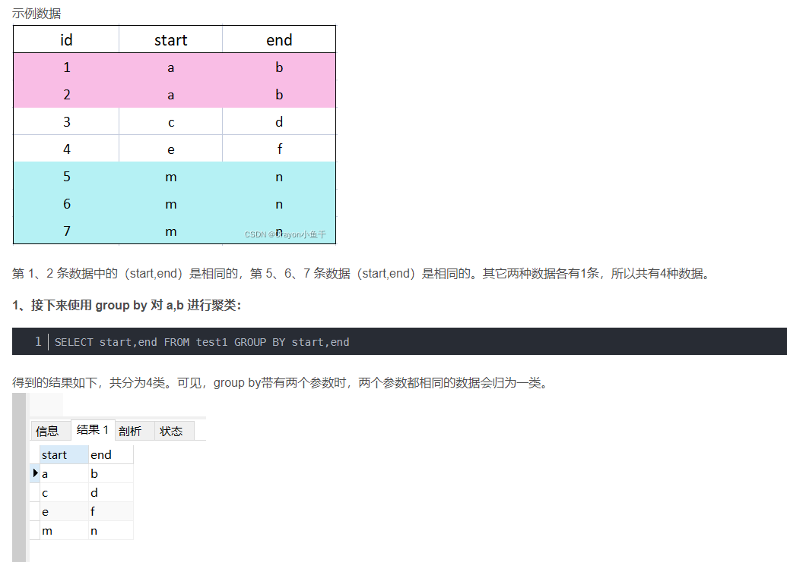

# mysql 远程登录
```
use mysql;
select user,host from user;
update user set host ='%' where host ='root';
flush privileges;
```


# sql

'heima'@'%'

%不限制

```sql
service mysql start
service mysql stop

mysql -u root -p
mysql -u root
mysql -uroot

show databases;

use mysql;
show tables;


create database mysql_test;
use mysql_test;

create table employee(
	id int(10),
    name char(20),
    phone int(12)
);

create table department(
	dpt_name char(20),
	dpr_phone int(12)
);

insert into employee(id,name,phone)
values(01,'Tom',110110110);

insert into employee values(02,'jack',119119119);
insert into employee(id,name) values (03,'Rose');
insert into employee values(4,'maya',00099),(5,'kali',889);

select * from employee;

drop database mysql_shiyan;


```


.sql

```shell
wget https://labfile.oss-internal.aliyuncs.com/courses/9/MySQL-03-01.sql
```


```sql
加载sql文件
.sql
mysql> source /home/shiyanlou/Desktop/MySQL-03-01.sql
可以加载数据库
show databases;

```

文件中有主键

```
id int(10) primary key
```

也可以这样定义主键

```
constraint dpt_pk primary key(dpt_name)
```


```

desc

create schema db01;
==
create database db01;


select gender count(*) from emp group by gender;


```

查询前两个数据

```
select * from emp limit 0,2
```


字符和字符串忘记加双引号

```
select * from emp where gender="male"
```


支持运算符优先级


通配符

%

_

[] 

不在

[^]


group by



例题

题目：现在运营想查看每个学校用户的平均发贴和回帖情况，寻找低活跃度学校进行重点运营，请取出平均发贴数低于5的学校或平均回帖数小于20的学校。

示例：user_profile

| id   | device_id | gender | age  | university | gpa  | active_days_within_30 | question_cnt | answer_cnt |
| ---- | --------- | ------ | ---- | ---------- | ---- | --------------------- | ------------ | ---------- |
| 1    | 2138      | male   | 21   | 北京大学   | 3.4  | 7                     | 2            | 12         |
| 2    | 3214      | male   |      | 复旦大学   | 4.0  | 15                    | 5            | 25         |
| 3    | 6543      | female | 20   | 北京大学   | 3.2  | 12                    | 3            | 30         |
| 4    | 2315      | female | 23   | 浙江大学   | 3.6  | 5                     | 1            | 2          |
| 5    | 5432      | male   | 25   | 山东大学   | 3.8  | 20                    | 15           | 70         |
| 6    | 2131      | male   | 28   | 山东大学   | 3.3  | 15                    | 7            | 13         |
| 7    | 4321      | female | 26   | 复旦大学   | 3.6  | 9                     | 6            | 52         |

第一行表示:id为1的用户的常用信息为使用的设备id为2138，性别为男，年龄21岁，北京大学，gpa为3.4在过去的30天里面活跃了7天，发帖数量为2，回答数量为12
。。。
最后一行表示:id为7的用户的常用信息为使用的设备id为4321，性别为男，年龄26岁，复旦大学，gpa为3.6在过去的30天里面活跃了9天，发帖数量为6，回答数量为52


根据示例，你的查询应返回以下结果，请你保留3位小数(系统后台也会自动校正)，3位之后四舍五入：

| university | avg_question_cnt | avg_answer_cnt |
| ---------- | ---------------- | -------------- |
| 北京大学   | 2.5000           | 21.000         |
| 浙江大学   | 1.000            | 2.000          |


答案：

```sql
select university,avg(question_cnt) avg_question_cnt,avg(answer_cnt) avg_answer_cnt from user_profile 
group by university
having avg_question_cnt<5 or avg_answer_cnt<20
```


先是group by之后是 order by

```sql
select university,
  avg(question_cnt) as avg_question_cnt
from user_profile
group by university
order by avg_question_cnt
```


对group by 后面所跟的数的顺序的 理解

```sql
select p1.university,difficult_level,count(p3.question_id)/count(distinct p2.device_id) avg_answer_cnt
from user_profile p1,
     question_practice_detail p2,
     question_detail p3
where p1.device_id=p2.device_id and p2.question_id=p3.question_id
group by difficult_level,university;


select p1.university,difficult_level,count(p3.question_id)/count(distinct p2.device_id) avg_answer_cnt
from user_profile p1,
     question_practice_detail p2,
     question_detail p3
where p1.device_id=p2.device_id and p2.question_id=p3.question_id
group by university,difficult_level;
```


查询前两个数据

```
select * from emp limit 0,2
```


字符和字符串忘记加双引号

```
select * from emp where gender="male"
```


支持运算符优先级


通配符

%

_

[] 

不在

[^]


group by


例题

题目：现在运营想查看每个学校用户的平均发贴和回帖情况，寻找低活跃度学校进行重点运营，请取出平均发贴数低于5的学校或平均回帖数小于20的学校。

示例：user_profile

| id   | device_id | gender | age  | university | gpa  | active_days_within_30 | question_cnt | answer_cnt |
| ---- | --------- | ------ | ---- | ---------- | ---- | --------------------- | ------------ | ---------- |
| 1    | 2138      | male   | 21   | 北京大学   | 3.4  | 7                     | 2            | 12         |
| 2    | 3214      | male   |      | 复旦大学   | 4.0  | 15                    | 5            | 25         |
| 3    | 6543      | female | 20   | 北京大学   | 3.2  | 12                    | 3            | 30         |
| 4    | 2315      | female | 23   | 浙江大学   | 3.6  | 5                     | 1            | 2          |
| 5    | 5432      | male   | 25   | 山东大学   | 3.8  | 20                    | 15           | 70         |
| 6    | 2131      | male   | 28   | 山东大学   | 3.3  | 15                    | 7            | 13         |
| 7    | 4321      | female | 26   | 复旦大学   | 3.6  | 9                     | 6            | 52         |

第一行表示:id为1的用户的常用信息为使用的设备id为2138，性别为男，年龄21岁，北京大学，gpa为3.4在过去的30天里面活跃了7天，发帖数量为2，回答数量为12
。。。
最后一行表示:id为7的用户的常用信息为使用的设备id为4321，性别为男，年龄26岁，复旦大学，gpa为3.6在过去的30天里面活跃了9天，发帖数量为6，回答数量为52


根据示例，你的查询应返回以下结果，请你保留3位小数(系统后台也会自动校正)，3位之后四舍五入：

| university | avg_question_cnt | avg_answer_cnt |
| ---------- | ---------------- | -------------- |
| 北京大学   | 2.5000           | 21.000         |
| 浙江大学   | 1.000            | 2.000          |


答案：

```sql
select university,avg(question_cnt) avg_question_cnt,avg(answer_cnt) avg_answer_cnt from user_profile 
group by university
having avg_question_cnt<5 or avg_answer_cnt<20
```


先是group by之后是 order by

```sql
select university,
  avg(question_cnt) as avg_question_cnt
from user_profile
group by university
order by avg_question_cnt
```


对group by 后面所跟的数的顺序的 理解

```sql
select p1.university,difficult_level,count(p3.question_id)/count(distinct p2.device_id) avg_answer_cnt
from user_profile p1,
     question_practice_detail p2,
     question_detail p3
where p1.device_id=p2.device_id and p2.question_id=p3.question_id
group by difficult_level,university;


select p1.university,difficult_level,count(p3.question_id)/count(distinct p2.device_id) avg_answer_cnt
from user_profile p1,
     question_practice_detail p2,
     question_detail p3
where p1.device_id=p2.device_id and p2.question_id=p3.question_id
group by university,difficult_level;
```


