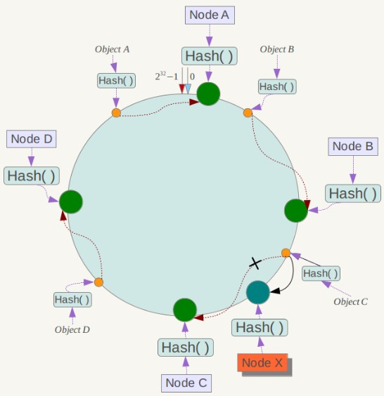

# 分布式

分布式锁 为分布式事务提供服务


## 分布式锁

在单机场景下，可以使用语言的内置锁来实现进程同步。 但是在分布式场景下，需要使用分布式锁。

阻塞锁
阻塞锁 通常使用互斥量来实现：
阻塞锁 不是乐观锁也不是悲观锁
是一种同步机制，用于控制对共享资源的访问。 当一个线程获取了锁时，其他线程如果想要获取同一把锁，就会被阻塞，直到持有锁的线程释放锁为止。

可以用0.1 存在不存在 作为互斥量


简单数据库实现锁
获得锁时向表中插入一条记录，释放锁时删除这条记录。 唯一索引可以保证该记录只被插入一次，那么就可以用这个记录是否存在来判断是否处于锁定状态。 
存在以下几个问题：
锁没有失效时间，解锁失败的话其它进程无法再获得该锁；
只能是非阻塞锁，插入失败直接就报错了，无法重试；
不可重入，已经获得锁的进程也必须重新获取锁。


Redis中实现
Redis 的 SETNX 指令
使用 SETNX（set if not exist）指令插入一个键值对，如果 Key 已经存在，那么会返回 False， 否则插入成功并返回 True。
SETNX 指令和数据库的唯一索引类似，保证了只存在一个 Key 的键值对，那么可以用一个 Key 的键值对是否存在来判断是否存于锁定状态。
EXPIRE设置过期时间, 从而保证锁的释放


Redis的分布式锁
RedLock 是 Redis 实现分布式锁的一种方式
使用了`多个 Redis 实例来实现分布式锁`，这是为了保证在发生单点故障时仍然可用。
尝试从 N 个互相独立 Redis 实例获取锁；
计算获取锁消耗的时间，只有时间小于锁的过期时间，并且从大多数（N / 2 + 1）实例上获取了锁，才认为获取锁成功；
如果获取锁失败，就到每个实例上释放锁。


## 分布式事务


指事务的操作位于不同的节点上，需要保证事务的正确执行
ACID 特性
原子性（Atomicity）： 事务是一个不可再分割的最小执行单元
一致性（Consistency）： 一致性指数据库在执行事务前后，数据的状态必须保持一致性 即使在发生错误的情况下，数据库也必须保持一致性. 
隔离性（Isolation）： 支持事务并发, 并发事务之间不影响
持久性（Durability）： 持久性指一旦事务被提交，其对数据库的修改将永久性的. 


2PC

两阶段提交（Two-phase Commit，2PC），通过引入协调者（Coordinator）来协调参与者的行为，并最终决定这些参与者是否要真正执行事务。
运行过程
询问和准备->提交/回滚
提交事务的意思就是事务成功结束了 在准备阶段，参与者执行了事务
协调者询问参与者事务是否执行成功，参与者发回事务执行结果。询问可以看成一种投票，需要参与者都同意才能执行。
如果事务在每个参与者上都执行成功，事务协调者发送通知让参与者提交事务；否则，协调者发送通知让参与者回滚事务。

存在的问题

任意一个节点失败就会导致整个事务失败，没有完善的容错机制

同步阻塞
所有事务参与者在等待其它参与者响应的时候都处于同步阻塞等待状态，无法进行其它操作

单点问题
协调者在 2PC 中起到非常大的作用 发生故障将会造成很大影响 

数据不一致
在提交阶段，如果协调者发送了 Commit 消息，此时网络发生异常，那么只有部分参与者接收到 Commit 消息 使得系统数据不一致


本地消息表

将需要发送的消息先存储在本地数据库中（本地消息表）中，然后再异步地将消息发送到消息队列或远程服务。
通过这种方式，即使消息发送失败或系统出现故障，消息仍然可以在本地消息表中保留，等待重新发送或处理。

本地消息表与业务数据表处于同一个数据库中，这样就能利用本地事务来保证在对这两个表的操作满足事务特性，并且使用了**消息队列来保证最终一致性**。

发送方将需要发送的消息写入本地消息表。
发送方尝试将消息发送到消息队列或远程服务。
如果消息成功发送，则发送方从本地消息表中删除该消息；如果发送失败，则保留在本地消息表中。
定时任务或其他机制会定期检查本地消息表中未发送成功的消息，并进行重试发送。


## CAP BASE

一致性C 一个数据更新成功之后，所有节点都能够读取到最新的值
可用性A 所有的节点都可用
分区容错性P 分布式系统出现**网络分区**的时候，仍然能够对外提供服务。

网络分区
部分节点的网络出现了问题, 导致网络成了几块区域

允许损失部分可用性呢
响应时间上的损失: 正常情况下，处理用户请求需要 0.5s 返回结果，但是由于系统出现故障，处理用户请求的时间变为 3 s。
系统功能上的损失：正常情况下，用户可以使用系统的全部功能，但是由于系统访问量突然剧增，系统的部分非核心功能无法使用。


在分布式系统中，分区容忍性必不可少，因为需要总是假设**网络是不可靠的**。
因此，CAP 理论实际上是要在CA之间做权衡。
可用性和一致是冲突的
为了**保证一致性**（CP），**不能访问未同步完成的节点**，也就失去了部分可用性；
为了**保证可用性**（AP），**允许读取所有节点的数据**，但是数据可能不一致。


BASE

BA
基本可用
指分布式系统出现不可预知的故障的时候,允许损失部分可用性.但是不等价于不可用

S
软状态
允许存在中间状态

E
最终一致性
系统中所有的副本 在经过一段时间的同步后,最终可以达到一个一致的状态


## 分布式ID

UUID
UUID.randomUUID()

速度快
简单

消耗空间大
MAC地址泄露
无序
没有业务含义


当机器时间不对的时候会产生重复ID

为何不使用UUID作为Myslq的主键
数据库主键要求越短越好,而uuid占32位
uuid无序,`InnoDB`下影响数据库的性能


雪花算法 snowflake

优点
生成速度快
生成的`id有序递增`
灵活

需要解决id重复问题


## 一致性HASH

Distributed Hash Table（DHT） 是一种哈希分布方式， 其目的是为了克服传统哈希分布在服务器节点数量变化时大量数据迁移的问题。

基本原理

<video controls src="src/一致性hash 算法_高1920.mp4" title="Title"></video>



将哈希空间 [0, 2n-1] 看成一个哈希环，每个服务器节点都配置到哈希环上。每个数据对象通过哈希取模得到哈希值之后，存放到哈希环中顺时针方向第一个大于等于该哈希值的节点上。
一致性哈希在增加或者删除节点时只会影响到哈希环中相邻的节点，例如图中新增节点 X，只需要将它前一个节点 C 上的数据重新进行分布即可，对于节点 A、B、D 都没有影响. 

虚拟节点
比如三台服务器hash之后靠的十分近
上面描述的一致性哈希存在数据分布不均匀的问题，节点存储的数据量有可能会存在很大的不同。
数据不均匀主要是因为节点在哈希环上分布的不均匀，这种情况在节点数量很少的情况下尤其明显。
解决方式是通过增加虚拟节点，然后将虚拟节点映射到真实节点上。虚拟节点的数量比真实节点来得多，那么虚拟节点在哈希环上分布的均匀性就会比原来的真实节点好，从而使得数据分布也更加均匀。


# 高可用

注重代码质量
使用集群
限流 超时 重试和熔断机制
异步调用
使用缓存
冗余设计


## 冗余设计

搭建集群
同城灾备
异地灾备
同城多活
异地多活

灾备和多活的区别: 多活仍然提供服务,而灾备不提供服务


## 限流
固定窗口计数器 算法
滑动窗口计数器 算法
漏桶算法
令牌桶算法


针对什么来限流
IP
用户ID
个性化 VIP 不限流


单机限流
RateLimiter


分布式限流
借助中间件 比如 Sentinel 或者 Redis 实现限流逻辑
网关 SpringGateway


## 降级 熔断


## 超时 重试机制
超时 连接超时 读取超时
1500ms

重试机制 多次发送相同的请求
固定时间重试 梯度区间重试

重试次数 最多三次


重试幂等
避免一个请求被多次执行


## 性能

性能的一些指标
响应时间 指某个**请求从发**出到**接收到响应**消耗的时间。
吞吐量
并发用户数

IO 多路复用
使用 IO 多路复用等方式，系统在**等待一个 IO 操作完成**的这段时间内不需要被阻塞，可以去处理其它请求。通过将这个等待时间利用起来，使得 CPU 利用率大大提高。


性能优化
集群
缓存
异步


## 伸缩性
如何判断瓶颈是在 伸缩性 还是 性能
如果系统存在性能问题，那么单个用户的请求总是很慢的；
如果系统存在伸缩性问题，那么单个用户的请求是快的，但是在并发数很高的情况下系统会很慢。


实现伸缩性
无状态服务器容易实现
关系型数据库的伸缩性通过 Sharding(分片) 来实现  将数据按一定的规则分布到不同的节点上，从而解决单台存储服务器的存储空间限制。
关系型数据库非常容易
主从复制
redis Cluster
分片
哨兵


## 扩展性
添加新功能
低耦合要求

解耦:
使用消息队列
使用微服务
注册中心


## 服务降级
应对大量的请求，主动关闭部分功能，从而保证核心功能可用
给出一个服务降级的例子
一个电子商务网站在双十一促销期间可能会面临巨大的流量压力，为了避免系统崩溃，可以采取以下服务降级策略：限制用户访问频率，例如延长页面缓存时间或设置访问限制，以减轻服务器压力
引入队列机制，将部分请求加入队列中进行排队处理，避免同时处理大量请求导致系统崩溃. 提供简化版本的页面，只包含核心功能，以确保用户可以继续购物和下单。


# 高性能

## CDN
优化体验
减轻源服务器负载


内容分发网络
图片 视频 文档 js css html
多个地区 多个机房 存储并分发这些内容

一般使用云服务器厂商的现成的产品


预热 回源
预热: 将要原站点的资源同步到 CDN节点 中
回源: 资源的缓存过期的时候,重新从源站点获取内容


如何找到最合适的CDN节点
GSLB global server load balance 全局负载均衡
是CDN的大脑,负责多个CDN之间的节点的相互协作

CDN 会通过 GSLB 找到最合适的节点

1. 浏览器像DNS服务器发送域名请求
2. DNS 服务器向GSLB发送请求
3. GSLB 返回性能最好的CDN节点
4. 浏览器直接访问指定的CDN节点


如何防止资源盗刷
防盗链 使用一次就失效
更高级的还有 时间戳防盗链

配置IP白名单 黑名单 IP访问限额


## 负载均衡
服务端负载均衡
nginx
4层负载均衡和7层负载均衡
工作在第四层  工作在第七层

客户端负载均衡
客户端会维护一份服务器地址列表,发送请求之前,客户端会根据负载均衡算法来选择某一台服务器处理请求

大部分微服务框架 提供开箱即用的客户端负载均衡功能
Ribben


七层负载均衡
nginx 反向代理
DNS 解析 域名后端中进行配置


负载均衡算法

随机发
轮询法
两次轮询 一次随机两个,选择最合适的一个
哈希法 服务器数量不变的情况下,相同参数的请求总是发送到同一台服务器
一致性hash 解决了哈希发 数量变化导致的落在不同服务器的问题
最少连接
最少活跃
最快响应


## 数据库优化
读写分离
一主多从
主从复制

加一个中间件, mysql router 可以实现 读写分离

主从复制的原理
mysql binlog 记录了mysql数据库中数据的所有变化.

主从延迟
强制将读请求路由到主库
延迟读取


mysql router
将客户端应用程序连接到一个或多个 MySQL 后端数据库服务器


分库分表带来的问题
分布式事务
分布式ID
需要查询多个数据库获取结果
使用聚合查询 复杂


确定各分库分表,如何进行迁移
双写方案 对老库的操作要写入新库
有现成的工具
a


数据库冷热分离
时间维度划分
访问频率划分

优点: 使热数据的性能得到优化 节约成本 优化总体性能
缺点: 系统的复杂性增加


## 消息队列
常见的消息队列
Kafka RabbitMQ

存放消息的容器
生产者储存消息 消费者拿消息
中间件实现

作用
通过异步处理 提高系统性能
限流
解耦


MQ RabbitMQ
顺序保证
延时 定时处理
数据流处理


缺点
系统复杂度提高
一致性问题


消息模型

点对点
消息生产者向消息队列中发送了一个消息之后，只能被一个消费者消费一次。

发布/订阅
消息生产者向频道发送一个消息之后，多个消费者可以从该频道订阅到这条消息并消费。

发布与订阅模式和观察者模式有以下不同：
观察者模式中，观察者和主题都知道对方的存在；而在发布与订阅模式中，生产者与消费者不知道对方的存在，它们之间通过频道进行通信。
观察者模式是同步的，当事件触发时，主题会调用观察者的方法，然后等待方法返回；而发布与订阅模式是异步的，生产者向频道发送一个消息之后，就不需要关心消费者何时去订阅这个消息，可以立即返回。


可靠性

发送端的可靠性
重试 确认 超时 机制
持久化操作
借助分布式事务

接收端的可靠性 接收端能够从消息队列成功消费一次消息
接收端的消息具有：**幂等性**，消费多少次消息，最后处理的结果都是一样的。
保证消息具有唯一编号， 并使用一张日志表来记录已经消费的消息编号。利用 Redis


## JMS 
Java 平台上用于消息通信的 API


JMS两种消息类型
P2P 1对1
发布订阅模式 使用主题 Topic 作为消息通信载体，类似于广播模式；发布者发布一条消息，该消息通过主题传递给所有的订阅者


AMQP
Advanced Message Queuing Protocol
RabbitMQ 基于他
跨语言 跨平台 支持更多的消息类型


# 缓存


## 缓存

缓解服务器压力
降低客户端获取资源的延迟： 缓存通常位于内存中，读取缓存的速度更快。并且缓存服务器在地理位置上也有可能比源服务器来得近，例如浏览器缓存。


请求通过缓存得到响应 而无需访问数据库

缓存淘汰
当缓存存放的数据量超过最大空间时，就需要淘汰部分数据来存放新到达的数据。

算法
FIFO（First In First Out）：先进先出策略，在实时性的场景下，需要经常访问最新的数据，那么就可以使用 FIFO，使得最先进入的数据（最晚的数据）被淘汰。
LRU（Least Recently Used）：最久未使用策略，优先淘汰最久未使用的数据，也就是上次被访问时间距离现在最久的数据。该策略可以保证内存中的数据都是热点数据，也就是经常被访问的数据，从而保证缓存命中率。
LFU（Least Frequently Used）：最不经常使用策略，优先淘汰一段时间内使用次数最少的数据。


缓存位置

浏览器
当 HTTP 响应允许进行缓存时，浏览器会将 HTML、CSS、JavaScript、图片等静态资源 进行缓存。

ISP
网络服务提供商（ISP）是网络访问的第一跳，通过将数据缓存在 ISP 中能够大大提高用户的访问速度。

反向代理
反向代理位于服务器之前，请求与响应都需要经过反向代理。通过将数据缓存在反向代理，在用户请求反向代理时就可以直接使用缓存进行响应。
nginx支持
需要手动开启

分布式缓存
使用 Redis、Memcache 等分布式缓存将数据缓存在分布式缓存系统中。

数据库缓存
MySQL 等数据库管理系统具有自己的查询缓存机制来提高查询效率。

Java 内部的缓存
字符串常量池 和 `Byte、Short、Integer、Long、Boolean、Character` 这六种包装类缓冲池。
使用 `Guava Cache `将数据缓存在服务器本地内存中，服务器代码可以直接读取本地内存中的缓存，速度非常快。


## redis


## 数据分布
哈希分布

顺序分布
能保持数据原有的顺序
并且能够准确控制每台服务器存储的数据量，从而使得存储空间的利用率最大

一致性hash


# 集群


## 负载均衡
高可用
伸缩性
根据负载均衡算法得出ip之后转发


负载均衡算法
1. 随机
2. 轮询
3. 最少连接
4. 最少活跃
5. 哈希
6. 一致性hash

## 代理

缓存
负载均衡
网络访问控制
访问日志记录

正向代理和反向代理

## 网关

与代理服务器不同的是，网关服务器会将 HTTP 转化为其它协议进行通信，从而请求其它非 HTTP 服务器的服务。


## 转发实现
HTTP 重定向
HTTP 重定向负载均衡服务器使用某种负载均衡算法计算得到服务器的 IP 地址之后，将该`地址写入 HTTP 重定向报文中`，状态码为` 302`。
客户端收到重定向报文之后，需要重新向服务器发起请求。

缺点：
需要两次请求
请求的时候依赖负载均衡服务器 
该负载均衡转发的缺点比较明显，实际场景中很少使用它。

DNS 域名解析
在 DNS 解析域名的同时使用负载均衡算法计算服务器 IP 地址。

反向代理服务器
用户的请求需要先经过反向代理服务器再到达目标服务器。
反向代理可以用来进行缓存、日志记录等，同时也可以用来做为负载均衡服务器。
优点：
与其它功能集成在一起，部署简单
隐藏真实ip

缺点：
请求和响应的时候依赖反向代服务器

网络层
在网络层进行负载均衡
优点：
在内核进程中进行处理，性能比较高。
缺点：
所有的请求和响应都经过负载均衡服务器 会成为性能瓶颈。

链路层
MAC 地址
根据源mac进行负载均衡, 修改目的mac
通过配置源服务器的虚拟 IP 地址和负载均衡服务器的 IP 地址一致，从而不需要修改 IP 地址就可以进行转发。也正因为 IP 地址一样，所以源服务器的响应不需要转发回负载均衡服务器，可以直接转发给客户端
避免了负载均衡服务器的成为瓶颈
这是一种三角传输模式，被称为直接路由。
对于提供下载和视频服务的网站来说，直接路由避免了大量的网络传输数据经过负载均衡服务器。


## 集群下的sessions

Sticky Session
使用一致性hash, 或者是转发表, 将一个用户的所有请求都路由到同一个服务器
缺点：
当服务器宕机时，将丢失该服务器上的所有 Session。

Session 同步
在服务器之间进行 Session 同步操作，每个服务器都有所有用户的 Session 信息，因此用户可以向任何一个服务器进行请求。
缺点：
占用内存
占用网络资源

使用一个单独的服务器存储 Session 数据，使用 Redis
优点：
可以保证微服务架构中节点的 无状态性
缺点：
耗费带宽
较麻烦


# store


## 手写LRU
以下是基于 双向链表 + HashMap 的 LRU 算法实现，对算法的解释如下：
- 访问某个节点时，将其从原来的位置删除，并重新插入到链表头部。这样就能保证链表尾部存储的就是最近最久未使用的节点，当节点数量大于缓存最大空间时就淘汰链表尾部的节点。
- 为了使删除操作时间复杂度为 O(1)，就不能采用遍历的方式找到某个节点。HashMap 存储着 Key 到节点的映射，通过 Key 就能以 O(1) 的时间`得到节点`，然后再以 O(1) 的时间将其从双向队列中删除。
    此hashmap的作用为存储节点
手写LRU
```java
public class LRU<K, V> implements Iterable<K> {

    private Node head;
    private Node tail;
    private HashMap<K, Node> map;
    private int maxSize;

    private class Node {

        Node pre;
        Node next;
        K k;
        V v;

        public Node(K k, V v) {
            this.k = k;
            this.v = v;
        }
    }


    public LRU(int maxSize) {

        this.maxSize = maxSize;
        this.map = new HashMap<>(maxSize * 4 / 3);

        head = new Node(null, null);
        tail = new Node(null, null);

        head.next = tail;
        tail.pre = head;
    }


    public V get(K key) {

        if (!map.containsKey(key)) {
            return null;
        }

        Node node = map.get(key);
        unlink(node);
        appendHead(node);

        return node.v;
    }


    public void put(K key, V value) {

        if (map.containsKey(key)) {
            Node node = map.get(key);
            unlink(node);
        }

        Node node = new Node(key, value);
        map.put(key, node);
        appendHead(node);

        if (map.size() > maxSize) {
            Node toRemove = removeTail();
            map.remove(toRemove.k);
        }
    }


    private void unlink(Node node) {

        Node pre = node.pre;
        Node next = node.next;

        pre.next = next;
        next.pre = pre;

        node.pre = null;
        node.next = null;
    }


    private void appendHead(Node node) {
        Node next = head.next;
        node.next = next;
        next.pre = node;
        node.pre = head;
        head.next = node;
    }


    private Node removeTail() {

        Node node = tail.pre;

        Node pre = node.pre;
        tail.pre = pre;
        pre.next = tail;

        node.pre = null;
        node.next = null;

        return node;
    }


    @Override
    public Iterator<K> iterator() {

        return new Iterator<K>() {
            private Node cur = head.next;

            @Override
            public boolean hasNext() {
                return cur != tail;
            }

            @Override
            public K next() {
                Node node = cur;
                cur = cur.next;
                return node.k;
            }
        };
    }
}
```


## Zookeeper
```
### Zookeeper 的有序节点

Zookeeper 抽象模型
Zookeeper 提供了一种树形结构的命名空间，/app1/p_1 节点的父节点为 /app1。

<div align="center">  </div><br>

节点类型
- 永久节点：不会因为会话结束或者超时而消失；
- 临时节点：如果会话结束或者超时就会消失；
- 有序节点：会在节点名的后面加一个数字后缀，并且是有序的，例如生成的有序节点为 /lock/node-0000000000，它的下一个有序节点则为 /lock/node-0000000001，以此类推。

监听器
为一个节点注册监听器，在节点状态发生改变时，会给客户端发送消息。


分布式锁实现

- 创建一个锁目录 /lock；
- 当一个客户端需要获取锁时，在 /lock 下创建临时的且有序的子节点；
-  客户端获取 /lock 下的子节点列表，判断自己创建的子节点是否为当前子节点列表中序号最小的子节点，如果是则认为获得锁；否则监听自己的前一个子节点，获得子节点的变更通知后重复此步骤直至获得锁；
- 执行业务代码，完成后，删除对应的子节点。


会话超时

如果一个已经获得锁的会话超时了，因为创建的是临时节点，所以该会话对应的临时节点会被删除，其它会话就可以获得锁了。可以看到，这种实现方式不会出现数据库的唯一索引实现方式释放锁失败的问题。


羊群效应

一个节点未获得锁，只需要监听自己的前一个子节点，这是因为如果监听所有的子节点，那么任意一个子节点状态改变，其它所有子节点都会收到通知（羊群效应，一只羊动起来，其它羊也会一哄而上），而我们只希望它的后一个子节点收到通知。


## 五、Paxos
用于达成共识性问题，即对多个节点产生的值，该算法能保证只选出唯一一个值。

主要有三类节点：

- 提议者（Proposer）：提议一个值；
- 接受者（Acceptor）：对每个提议进行投票；
- 告知者（Learner）：被告知投票的结果，不参与投票过程。

<div align="center">  </div><br>

### 执行过程

规定一个提议包含两个字段：[n, v]，其中 n 为序号（具有唯一性），v 为提议值。

#### 1. Prepare 阶段

下图演示了两个 Proposer 和三个 Acceptor 的系统中运行该算法的初始过程，每个 Proposer 都会向所有 Acceptor 发送 Prepare 请求。

<div align="center">  </div><br>

当 Acceptor 接收到一个 Prepare 请求，包含的提议为 [n1, v1]，并且之前还未接收过 Prepare 请求，那么发送一个 Prepare 响应，设置当前接收到的提议为 [n1, v1]，并且保证以后不会再接受序号小于 n1 的提议。

如下图，Acceptor X 在收到 [n=2, v=8] 的 Prepare 请求时，由于之前没有接收过提议，因此就发送一个 [no previous] 的 Prepare 响应，设置当前接收到的提议为 [n=2, v=8]，并且保证以后不会再接受序号小于 2 的提议。其它的 Acceptor 类似。

<div align="center">  </div><br>

如果 Acceptor 接收到一个 Prepare 请求，包含的提议为 [n2, v2]，并且之前已经接收过提议 [n1, v1]。如果 n1 \> n2，那么就丢弃该提议请求；否则，发送 Prepare 响应，该 Prepare 响应包含之前已经接收过的提议 [n1, v1]，设置当前接收到的提议为 [n2, v2]，并且保证以后不会再接受序号小于 n2 的提议。

如下图，Acceptor Z 收到 Proposer A 发来的 [n=2, v=8] 的 Prepare 请求，由于之前已经接收过 [n=4, v=5] 的提议，并且 n \> 2，因此就抛弃该提议请求；Acceptor X 收到 Proposer B 发来的 [n=4, v=5] 的 Prepare 请求，因为之前接收到的提议为 [n=2, v=8]，并且 2 \<= 4，因此就发送 [n=2, v=8] 的 Prepare 响应，设置当前接收到的提议为 [n=4, v=5]，并且保证以后不会再接受序号小于 4 的提议。Acceptor Y 类似。

<div align="center">  </div><br>

#### 2. Accept 阶段

当一个 Proposer 接收到超过一半 Acceptor 的 Prepare 响应时，就可以发送 Accept 请求。

Proposer A 接收到两个 Prepare 响应之后，就发送 [n=2, v=8] Accept 请求。该 Accept 请求会被所有 Acceptor 丢弃，因为此时所有 Acceptor 都保证不接受序号小于 4 的提议。

Proposer B 过后也收到了两个 Prepare 响应，因此也开始发送 Accept 请求。需要注意的是，Accept 请求的 v 需要取它收到的最大提议编号对应的 v 值，也就是 8。因此它发送 [n=4, v=8] 的 Accept 请求。

<div align="center">  </div><br>

#### 3. Learn 阶段

Acceptor 接收到 Accept 请求时，如果序号大于等于该 Acceptor 承诺的最小序号，那么就发送 Learn 提议给所有的 Learner。当 Learner 发现有大多数的 Acceptor 接收了某个提议，那么该提议的提议值就被 Paxos 选择出来。

<div align="center">  </div><br>

### 约束条件

#### 1\. 正确性

指只有一个提议值会生效。

因为 Paxos 协议要求每个生效的提议被多数 Acceptor 接收，并且 Acceptor 不会接受两个不同的提议，因此可以保证正确性。

#### 2\. 可终止性

指最后总会有一个提议生效。

Paxos 协议能够让 Proposer 发送的提议朝着能被大多数 Acceptor 接受的那个提议靠拢，因此能够保证可终止性。

## 六、Raft

Raft 也是分布式一致性协议，主要是用来竞选主节点。

- [Raft: Understandable Distributed Consensus](http://thesecretlivesofdata.com/raft)

### 单个 Candidate 的竞选

有三种节点：Follower、Candidate 和 Leader。Leader 会周期性的发送心跳包给 Follower。每个 Follower 都设置了一个随机的竞选超时时间，一般为 150ms\~300ms，如果在这个时间内没有收到 Leader 的心跳包，就会变成 Candidate，进入竞选阶段。

- 下图展示一个分布式系统的最初阶段，此时只有 Follower 没有 Leader。Node A 等待一个随机的竞选超时时间之后，没收到 Leader 发来的心跳包，因此进入竞选阶段。

<div align="center">  </div><br>

- 此时 Node A 发送投票请求给其它所有节点。

<div align="center">  </div><br>

- 其它节点会对请求进行回复，如果超过一半的节点回复了，那么该 Candidate 就会变成 Leader。

<div align="center">  </div><br>

- 之后 Leader 会周期性地发送心跳包给 Follower，Follower 接收到心跳包，会重新开始计时。

<div align="center">  </div><br>

### 多个 Candidate 竞选

- 如果有多个 Follower 成为 Candidate，并且所获得票数相同，那么就需要重新开始投票。例如下图中 Node B 和 Node D 都获得两票，需要重新开始投票。

<div align="center">  </div><br>

- 由于每个节点设置的随机竞选超时时间不同，因此下一次再次出现多个 Candidate 并获得同样票数的概率很低。

<div align="center">  </div><br>

### 数据同步

- 来自客户端的修改都会被传入 Leader。注意该修改还未被提交，只是写入日志中。

<div align="center">  </div><br>

- Leader 会把修改复制到所有 Follower。

<div align="center">  </div><br>

- Leader 会等待大多数的 Follower 也进行了修改，然后才将修改提交。

<div align="center">  </div><br>

- 此时 Leader 会通知的所有 Follower 让它们也提交修改，此时所有节点的值达成一致。

<div align="center">  </div><br>


```
