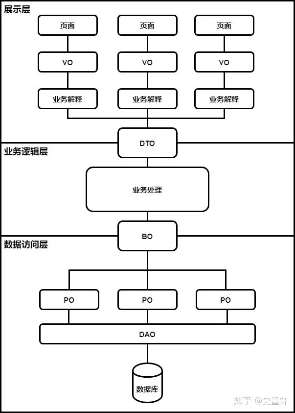

## 宏观
如何回答问题
总分结构
1. 重复简化扩充问题, 为思考答案流出更多时间
2. 总
3. 分
4. 拓展 尽量拓展会的方面

介绍一个东西
1. 是什么
2. 优点
3. 缺点
4. 拓展


介绍一下linux的文件系统
Linux使用 树状结构组织文件 根目录是所有目录和文件的起点
Ext4是Linux上最常用的文件系统
支持权限控制


@RequestParam 和 @PathVariable
RequestParam
从HTTP请求中获取参数的值 
```java
@GetMapping("/example")
public String exampleMethod(@RequestParam String param) {
}
```
`/example?param=value`

@PathVariable
从URI路径中获取参数的值
```java
@GetMapping("/example/{id}")
public String exampleMethod(@PathVariable Long id) {
}
```


多态
一个类可以有不同的状态
如何达到: 
重载
重写
实现接口


## 权限控制
Cookie Session Token 鉴权
为啥能用Session作为登录验证的一种方式，因为每个用户的请求都会有一个Session，这个对象是Servlet给我们创建的，不需要我们手动创建，并且这个对象的作用域为整个Web页面，也就是在整个项目中，这个Session可以存储一些内容，相当于全局缓存，并且这个Session有默认的过期时间，默认为30分钟，使得保存到Session对象中的值，可以在各个Web页面中共享。因此，我们可以利用这个特性保存用户的登录信息。
我们可以编写一个拦截器，
在拦截器中通过request对象获取Session对象，
然后根据Key值获取到Value值，类似于Map集合，
获取到值后和数据库进行比对，如果用户名和密码一致就放行，否则拦截。
```java
@RestController
@RequestMapping("/user")
public class UserController {
    @Autowired
    private UserService userService;
    @PostMapping("/login")
    public BaseResponse login(HttpServletRequest request, @RequestBody User user) {
        if (user != null && StringUtils.isNotBlank(user.getName()) && StringUtils.isNotBlank(user.getPassword())) {
            String name = user.getName();
            String password = user.getPassword();
            User tempUser = userService.login(name, SecureUtil.md5(password));
            if (tempUser != null) {
                Map<String, String> map = new HashMap<>();
                map.put("id", String.valueOf(tempUser.getId()));
                map.put("name", tempUser.getName());
                map.put("email", tempUser.getEmail());
                map.put("phone", tempUser.getPhone());
                // 保存用户的登录状态
                HttpSession session = request.getSession();
                session.setAttribute("user", tempUser);
                return BaseResponse.success(map);
            } else {
                return BaseResponse.error(ErrorCode.USERNAME_PASSWORD_ERROR);
            }
        }
        return BaseResponse.error(ErrorCode.MISS_PARAMS);
    }
}
```

拦截器
```java
public class LoginInterceptor implements HandlerInterceptor {
    @Override
    public boolean preHandle(HttpServletRequest request, HttpServletResponse response, Object handler) throws Exception {
        HttpSession session = request.getSession();
        Object user = session.getAttribute("user");
        if (user != null) {
            return true;
        }
        request.getRequestDispatcher("/error/login").forward(request, response);
        return false;
    }
}
```
```java
@Configuration
public class WebConfig implements WebMvcConfigurer {
    @Override
    public void addInterceptors(InterceptorRegistry registry) {
        registry.addInterceptor(new LoginInterceptor()).addPathPatterns("/**").excludePathPatterns("/user/login", "/error/**");
    }
}
```


Session超时管理
Session对象默认存活时间是30分钟
session域对象：作用范围一次完整的会话（包含多个请求）
```html
<web-app>
    <session-config>
        <!-- 设置会话超时时间为30分钟 -->
        <session-timeout>30</session-timeout>
    </session-config>
</web-app>
```


Cookie
```
获得Cookie对象：Cookie cookie = new Cookie(String name, String value);
回写（响应）cookie到浏览器端：response.addCookie(cookie);
得到cookie的名称：String key = cookie.getName();
得到cookie的值：String value = cookie.getValue();
给cookie设置生命时长：setMaxAge(int s);
比如：cookie.setMaxAge(60*60*24)//说明cookie有效时间为1天
cookie分类：
    第一类：会话级别cookie，浏览器关闭，cookie对象就销毁
    第二类：持久化cookie，通过setMaxAge这个方法来设置
给cookie设置路径：设置域名：
setPath(路径url);setDomain(域名);
得到cookie：Cookie[] cookies = request.getCookies();
```


例子
```java
//@WebServlet(name = "LastAccessServlet")
public class LastAccessServlet extends HttpServlet {
    private static final long serialVersionUID = 1L;
    protected void doPost(HttpServletRequest request, HttpServletResponse response) throws ServletException, IOException {
        //处理中文乱码问题
        response.setContentType("text/html;charset=utf-8");
        String lastAccessTime = null;
        //获取所有Cookie，放到数组中
        Cookie[] cookies = request.getCookies();
        //遍历数组
        for (int i = 0; cookies !=null && i < cookies.length; i++) { //cookies !=null 注意判断是否为空
            //判断cookie中是否有名字是lastAccessTime
            String name = cookies[i].getName();
            if ("lastAccessTime".equals(name)) {
                lastAccessTime = cookies[i].getValue(); //获取cookie的值
                break; //如果找到了，就立刻结束
            }
        }
        //判断是否是第一次访问
        if (lastAccessTime == null) {//第一次访问
            response.getWriter().print("你是首次访问本网站！");
        }else {//不是第一次访问
            response.getWriter().print("你上次访问本网站的时间是：" + lastAccessTime);
        }
        //获取每次访问的时间
        String currentTime = new SimpleDateFormat("yyyy-MM-dd-hh:mm:ss").format(new Date());
        //把currentTime作为cookie的值存到cookie中
        Cookie cookie = new Cookie("lastAccessTime", currentTime);
        //设置cookie保存时间
        cookie.setMaxAge(60*60*24); //单位为秒
        //把cookie响应到客户端浏览器中
        response.addCookie(cookie);
    }
    protected void doGet(HttpServletRequest request, HttpServletResponse response) throws ServletException, IOException {
        this.doPost(request, response);
    }
}
```


总结域对象：request域对象 session域对象 servletContext域对象，作用范围依次变大
request域对象：作用范围一次请求，通常和转发操作配合使用
session域对象：作用范围一次会话，通常和重定向操作配合使用
servletContext域对象：作用范围整个项目，和重定向，转发操作都可以配合使用

JWT
可以使用uuid作为token，也可以使用jwt作为token，其中使用jwt实现的方案是最流行的

Session原理
服务端记录客户端的行为,储存在Session中
并将Sessionid存储在客户端浏览器的Cookies中
进而可以跟踪用户

tooken
也是需要借助cookie的
后来又引入了tooken,可以用来验证身份,跟踪用户,安全,减少了敏感信息传输,并且适用于微服务架构
微服务架构中 服务器是无状态的,无法跟踪用户的行为.
因而可以将用户信息存储在一个独立的服务器中. 而无需利用Session


会话技术
会话技术指的是在用户再不同HTTP请求之间保持用户状态的技术

客户端会话管理技术 Cookies
​它是把要共享的数据保存到了客户端（也就是浏览器端）。每次请求时，把会话信息带到服务器，从而实现多次请求的数据共享。

服务端会话管理技术 Session
也依赖客户端
它本质仍是采用客户端会话管理技术，只不过保存到客户端的是一个特殊的标识，并且把要共享的数据保存到了服务端的内存对象中。每次请求时，把这个标识带到服务器端，然后使用这个标识，找到对应的内存空间，从而实现数据共享。


## 验证码
hutool 库 生成验证码

验证码存入Session
```java
@Controller  
public class CommonController {  
    @GetMapping("/common/kaptcha")  
    // kaptcha hutool 验证码  
    public void defaultKaptcha(HttpServletRequest httpServletRequest, HttpServletResponse httpServletResponse) throws Exception {  
        httpServletResponse.setHeader("Cache-Control", "no-store");  
        httpServletResponse.setHeader("Pragma", "no-cache");  
        httpServletResponse.setDateHeader("Expires", 0);  
        httpServletResponse.setContentType("image/png");  
        ShearCaptcha shearCaptcha= CaptchaUtil.createShearCaptcha(150, 30, 4, 2);  
        // 验证码存入session  
        httpServletRequest.getSession().setAttribute("verifyCode", shearCaptcha);  
        // 输出图片流  
        shearCaptcha.write(httpServletResponse.getOutputStream());  
    }  
}
```


## VO PO DAO DTO

VO : View Object 展示对象
用于不同界面的展示,比如手机端 和 电脑端 需要的值是不一样的
PO（Persistant Object）持久对象 数据库  Entity
Entity
数据库一对一
DAO DTO
DAO 从数据源获取数据, 通常包含增删改查
DTO 在应用程序和前端后端之间传输的对象 json


## 拦截器 放行资源
```java
//**重写** Spring框架中的 HandlerInterceptor 口,实现了一个拦截类  
@Component
public class AdminLoginInterceptor implements HandlerInterceptor {  
    @Override  
    public boolean preHandle(HttpServletRequest request, HttpServletResponse response, Object o) throws Exception {  
        // 获取请求的Servlet路径  
        String requestServletPath = request.getServletPath();  
        // 如果请求的路径以"/admin"开头并且当前会话中没有名为"loginUser"的属性  
        if (requestServletPath.startsWith("/admin") && null == request.getSession().getAttribute("loginUser")) {  
            // 将错误信息设置到会话中  
            request.getSession().setAttribute("errorMsg", "请重新登陆");  
            // 重定向到登录页面  
            response.sendRedirect(request.getContextPath() + "/admin/login");  
            // 返回false，表示拦截请求  
            return false;  
        } else {  
            // 如果不需要拦截，移除错误信息属性  
            request.getSession().removeAttribute("errorMsg");  
            // 返回true，放行请求  
            return true;  
        }  
    }  
}
```

配置类
```java
@Configuration  
public class MyBlogWebMvcConfigurer implements WebMvcConfigurer {  
    @Autowired  
    private AdminLoginInterceptor adminLoginInterceptor;  
    public void addInterceptors(InterceptorRegistry registry) {  
        // 添加一个拦截器，拦截以/admin为前缀的url路径  
        registry.addInterceptor(adminLoginInterceptor).addPathPatterns("/admin/**").excludePathPatterns("/admin/login").excludePathPatterns("/admin/dist/**").excludePathPatterns("/admin/plugins/**");  
    }  
}
```
```Java
public class LoginInterceptor implements HandlerInterceptor {

    @Override
    public boolean preHandle(HttpServletRequest request, HttpServletResponse response, Object handler) throws Exception {
       //1.获取session
        HttpSession session = request.getSession();
        //2.获取session中的用户
        Object user = session.getAttribute("user");
        //3.判断用户是否存在
        if(user == null){
              //4.不存在，拦截，返回401状态码
              response.setStatus(401);
              return false;
        }
        //5.存在，保存用户信息到Threadlocal
        UserHolder.saveUser((User)user);
        //6.放行
        return true;
    }
}
```
```java
@Configuration
public class MvcConfig implements WebMvcConfigurer {
    @Resource
    private StringRedisTemplate stringRedisTemplate;
    @Override
    public void addInterceptors(InterceptorRegistry registry) {
        // 登录拦截器
        registry.addInterceptor(new LoginInterceptor())
                .excludePathPatterns(
                        "/shop/**",
                        "/voucher/**",
                        "/shop-type/**",
                        "/upload/**",
                        "/blog/hot",
                        "/user/code",
                        "/user/login"
                ).order(1);
        // token刷新的拦截器
        registry.addInterceptor(new RefreshTokenInterceptor(stringRedisTemplate)).addPathPatterns("/**").order(0);
    }
}
```

放行资源
```java
@Configuration  
public class MyBlogWebMvcConfigurer implements WebMvcConfigurer {  
	public void addResourceHandlers(ResourceHandlerRegistry registry) {  
	    registry.addResourceHandler("/upload/**").addResourceLocations("file:" + Constants.FILE_UPLOAD_DIC);  
        registry.addResourceHandler("front/**").addResourceLocations("classpath:/front/");
	}
}
```

拦截器（Interceptor）或过滤器（Filter）
实现方式不同：Interceptor 使用 SpringMVC 的拦截器 而 Filter 使用 Servlet 规范的过滤器 
```java
@Slf4j
//@Component
public class LoginCheckInterceptor implements HandlerInterceptor {
    @Override
    public boolean preHandle(HttpServletRequest request, HttpServletResponse response, Object handler) throws Exception {
        String requestURI = request.getRequestURI();
        //如果未登录，则返回未登录结果，通过输出流的方式向客户段页面响应数据
        if (request.getSession().getAttribute("employee") == null) {
            log.info("本次请求" + requestURI + "需要处理");
            response.getWriter().write(JSON.toJSONString(Result.error("NOTLOGIN")));
            return false;
        } else {
            //如果已经登录，则放行
            log.info("本次请求" + requestURI + "不需要处理");
            return true;
        }
    }
}
```
```java
@WebFilter(filterName = "loginCheckFilter", urlPatterns = "/*")
@Slf4j
public class LoginCheckFilter implements Filter {
    private static final AntPathMatcher PATH_MATCHER = new AntPathMatcher();
    @Override
    public void doFilter(ServletRequest servletRequest, ServletResponse servletResponse, FilterChain filterChain) throws IOException, ServletException {
        HttpServletRequest request = (HttpServletRequest) servletRequest;
        HttpServletResponse response = (HttpServletResponse) servletResponse;
        log.info("当前线程：" + Thread.currentThread().getId());
        String requestURI = request.getRequestURI();
        log.info("拦截到请求：" + requestURI + ", 请求方式：" + request.getMethod());
        String[] excludeURLs = new String[]{
                "/employee/login",
                "/employee/logout",
                "/backend/**",
                "/front/**",
                "/user/sendMsg",
                "/user/login"
        };
        if (check(excludeURLs, requestURI)) {
            log.info("本次请求不需处理" + requestURI);
            filterChain.doFilter(request, response);
            return;
        }
        Long empId = (Long) request.getSession().getAttribute("employee");
        if (empId != null) {
            log.info("员工用户已登录，用户id：" + empId);
            //使用ThreadLocal设置当前线程的局部变量id
            BaseContext.setCurrentId(empId);

            filterChain.doFilter(request, response);
            return;
        }
        Long userId = (Long) request.getSession().getAttribute("user");
        if (userId != null) {
            log.info("普通用户已登录，用户id：" + userId);
            //使用ThreadLocal设置当前线程的局部变量id
            BaseContext.setCurrentId(userId);

            filterChain.doFilter(request, response);
            return;
        }
        log.info("用户未登录");
        response.getWriter().write(JSON.toJSONString(Result.error("NOTLOGIN")));
    }
    public boolean check(String[] urlPatterns, String requestURI) {
        for (String urlPattern : urlPatterns) {
            boolean match = PATH_MATCHER.match(urlPattern, requestURI);
            if (match) {
                return true;
            }
        }
        return false;
    }
}
```


使用 UUID 作为 tooken 或者是使用 JWT 作为 tooken
使用UUID的话 还需要使用额外的数据库 保存用户的信息
使用JWT的话 JWT内置用户的ID 名称等


## @Autowired  @Resource
都可以对对象进行注入
Autowired依据类型进行注入
Resource依据名称来注入

Autowired是Spring提供的注解
Resource是JDK提供的注解

一个接口存在多个实现类，@Autowired和@Resource都是需要指定Bean的名称才能完成注入, @Autowired可通过@Qualifier来只能Bean的名称进行注入，@Resource则可通过name来完成Bean的注入。


## 有哪些优化数据库性能的方法
建表的时候:
    规范高效的sql语句
    合理的模型
    合理的索引配置
    合理的数据库配置
    使用合适的数据库引擎

优化数据库: 
    分库分表
    使用缓存
    定时维护和清理


## MySQL 支持行级锁和表级锁
InnoDB
行级锁
复杂，会占用更多的内存和存储空间
占用系统资源
支持行级别的并发

MyISA
表级锁
简单 开销小
支持表级别的并发


## IOC 和 AOP
IOC 控制反转,将创建对象的权力交给spring,简化开发
AOP 面向切面编程 增加代码复用, 增强代码的可维护性和拓展性


## Spring 框架用到了哪些设计模式
1. **工厂模式（Factory Pattern）**：Spring使用工厂模式来创建和管理Bean对象，通过工厂方法或者抽象工厂来实现对象的创建和解耦。
2. **单例模式（Singleton Pattern）**：Spring容器默认情况下会将Bean定义为单例对象，确保整个应用程序中只有一个实例存在。
3. **代理模式（Proxy Pattern）**：Spring AOP中使用了代理模式来实现横切关注点的功能，通过动态代理来控制和管理对象的访问。
4. **观察者模式（Observer Pattern）**：Spring事件驱动模型中使用了观察者模式，通过事件监听器和发布者来实现对象之间的解耦。
5. **模板方法模式（Template Method Pattern）**：Spring的JdbcTemplate等模块使用了模板方法模式，将通用的操作封装在模板方法中，具体实现由子类来完成。
6. **策略模式（Strategy Pattern）**：Spring的核心容器使用了策略模式，通过不同的策略来实现不同的功能，比如Bean的创建和销毁策略等。
7. **装饰者模式（Decorator Pattern）**：Spring的AOP实现中，使用了装饰者模式来动态地为对象添加额外的功能，而不改变原有对象的结构。
这些设计模式的应用使得Spring框架更加灵活、可扩展和易于维护。


## Spring Bean的生命周期包括以下阶段
1. **实例化（Instantiation）**：容器根据Bean的定义信息（如配置文件或注解）创建Bean实例。这一阶段涉及Bean的实例化和依赖注入。
2. **设值注入（Population）**：容器将Bean的属性值或依赖注入到Bean实例中，可以通过构造器注入、设值注入或注解方式进行。
3. **初始化（Initialization）**：在Bean实例化和属性注入完成后，容器会调用Bean的初始化方法，可以通过配置初始化方法或实现InitializingBean接口来定义初始化逻辑。
4. **使用（In Use）**：Bean实例化、属性注入和初始化完成后，Bean处于可用状态，可以被其他Bean或应用程序使用。
5. **销毁（Destruction）**：当Bean不再需要时，容器会调用Bean的销毁方法，可以通过配置销毁方法或实现DisposableBean接口来定义销毁逻辑。
在整个生命周期中，Spring容器负责管理Bean的创建、初始化和销毁等过程，开发者可以通过配置和编码来控制Bean的生命周期。


## MyBatis实现 延迟加载 的方式主要是通过两种机制：
基于代理和基于结果集嵌套查询。
1. **基于代理的延迟加载**：MyBatis会在执行查询时，返回一个代理对象而不是真正的结果对象。当应用程序首次访问代理对象的某个属性或方法时，MyBatis会根据需要执行额外的查询来加载该属性或方法对应的数据。这种方式可以延迟加载关联对象或集合属性，避免在一次查询中获取大量数据。
    
2. **基于结果集嵌套查询的延迟加载**：在配置MyBatis的映射文件时，可以通过嵌套查询的方式实现延迟加载。当查询主对象时，不会立即加载关联对象的数据，而是在需要访问关联对象数据时，才执行额外的查询来获取关联对象的数据。这种方式适用于一对一或一对多的关联关系。
    

通过这两种机制，MyBatis实现了延迟加载的功能，可以帮助减少不必要的数据库查询，提高查询性能，并且在需要时动态地加载关联对象的数据。


## MyBatis的多级缓存机制包括三级缓存：一级缓存（Local Cache）、二级缓存（SessionFactory Cache）和三级缓存（Mapper XML Cache）。
1. **一级缓存（Local Cache）**：
    
    - 一级缓存是SqlSession级别的缓存，即在同一个SqlSession中执行的多次查询可以共享缓存数据。
    - 默认情况下，一级缓存是开启的，可以提高查询效率。
    - 一级缓存是默认开启的，当SqlSession关闭时，一级缓存也会被清空。
2. **二级缓存（SessionFactory Cache）**：
    
    - 二级缓存是SessionFactory级别的缓存，可以跨SqlSession共享缓存数据。
    - 需要在MyBatis配置文件中进行配置启用，并在对应的Mapper映射文件中指定使用二级缓存。
    - 二级缓存可以减少数据库访问次数，适用于跨会话共享数据的场景。
3. **三级缓存（Mapper XML Cache）**：
    
    - 三级缓存是Mapper级别的缓存，即每个Mapper都有自己的缓存。
    - 三级缓存默认是开启的，可以在Mapper XML文件中手动配置缓存的使用。
    - 通过指定缓存的类型和缓存的范围，可以灵活地控制每个Mapper的缓存策略。

通过这三级缓存机制，MyBatis可以灵活地控制缓存的级别和范围，提高数据查询的效率，并且可以根据具体的业务需求来配置和使用缓存。

## 要查看Linux系统中某个进程的运行状态，可以使用以下命令：

1. **ps命令**：
    - 使用`ps`命令可以列出当前系统中所有进程的信息。
    - 通过`ps -aux | grep <进程名>`可以查看特定进程的详细信息，包括进程ID（PID）、CPU利用率、内存占用等。
2. **top命令**：
    - `top`命令可以实时查看系统中进程的运行情况。
    - 在top命令的交互界面中，可以按`p`键输入进程号查看特定进程的详细信息。


## 如何在 Linux 上查看 2 G 的大文件
在Linux上查看大文件时，可以使用以下命令：
1. head命令：
默认情况下，head命令显示文件的前10行。
-n可以指定行数
2. tail命令：
默认情况下，tail命令显示文件的前10行。
-n可以指定行数


## Redis 为什么快
内存存储
单线程模型
非阻塞IO

非阻塞I/O是一种I/O模型，其主要特点是在进行I/O操作时不会阻塞当前线程或进程的执行，而是立即返回结果，如果操作无法立即完成，则返回一个错误码而不是等待结果。这种模型可以使程序在进行I/O操作时继续执行其他任务，提高了系统的并发性能和响应速度。


redis的其他优点
数据结构丰富
持久化机制
支持集群


## tomcat  和 nginx 对比
Tomcat主要用于运行Java Web应用程序，支持Java Servlet和JSP技术
Nginx主要用于静态文件服务、反向代理、负载均衡等

nginx处理静态资源和高并发的时候性能好
Tomcat在处理动态内容和Java应用方面表现出色


## Nginx 为什么支持高并发
Nginx之所以能够支持高并发，主要有以下几个原因：
1. **事件驱动架构**：Nginx采用了事件驱动的架构，使用单线程（或少量线程）处理大量并发连接。通过使用事件模型和非阻塞I/O，Nginx能够高效地处理并发请求，避免线程阻塞和上下文切换带来的性能损失。
2. **异步非阻塞**：Nginx使用异步非阻塞的方式处理请求，一个工作进程可以同时处理多个客户端连接，不必为每个连接创建一个新的线程或进程，减少资源占用和系统开销。
3. **内存管理**：Nginx在内存管理方面表现出色，采用基于内存池的内存管理机制，减少内存碎片化和频繁的内存分配操作，提高了内存利用率和性能。
4. **高效的数据结构**：Nginx使用高效的数据结构来存储和管理请求数据，例如哈希表、红黑树等，这些数据结构在查找、插入和删除等操作上都具有较高的效率。
5. **事件模块**：Nginx的事件模块支持多种事件模型，如epoll、kqueue等，这些事件模型能够有效地处理大量并发连接，并且能够适应不同操作系统的特性，提高了性能和稳定性。
综合以上因素，Nginx通过其优秀的设计和实现，能够高效地处理大量并发请求，提供高性能的Web服务，成为许多高负载网站和应用的首选服务器之一。


## Nginx 有哪些负载均衡策略
随机
轮询
hash
一致性hash
最小连接数
最小活跃数

## 什么是 Nginx 惊群问题，如何解决它


## 什么是微服务
微服务是一种架构风格
将应用拆分为 小型,独立的服务
每个服务都围绕着特定的`业务功能构建`
这些服务独立部署,已于拓展维护

优点：
灵活
可拓展
已于维护
容错性高

缺点：
复杂
部署和运维成本高
有通信开销
事务复杂


## 什么是注册中心，能解决什么问题
Eureka
用于管理和维护各个微服务的注册信息
使用了注册中心,微服务节点的ip就可以不用写死了

服务注册和发现
负载均衡
服务路由


## 什么是容器
轻量级,可移植的软件打包技术
用于封装程序
对微服务中的 CD 和 CI 十分重要
Docker是其一种产品


## 使用 Docker 有哪些好处
轻量化
跨平台
DockerCompose
Dockerfile 镜像丰富,无需从零构建
易于部署


## 如何快速启动多个 Docker 节点
DockerCompose
自己编写脚本


## InputStream返回的-1
在Java中，`InputStream` 类的 `read()` 方法用于从输入流中读取下一个字节的数据，如果已经到达输入流的末尾，则 `read()` 方法会返回-1
-1通常被用作输入流结束的标志,这是一个约定


## 变量提升
无论代码在哪个位置声明,都会被提到最前面. 这样有时候会产生一些错误
java中不会出现, js中会出现


## 如何适应手机端和电脑
写两套逻辑, 登录的时候用js判断一下是手机还是电脑, 从而进行不同的展示
使用响应式设计, 完善的前端框架, 一般都是支持三端的.
手机端优先


## @Value注入配置文件
```java
@Configuration
@Data
public class MailConfig {
// 这行代码使用了Spring框架的@Value注解来从配置文件中读取名为spring.mail.enable的属性的值。如果在配置文件中找不到对应的属性，它会使用默认值false。
    @Value("${spring.mail.enable:false}")
    private Boolean enable;
    @Value("${spring.mail.host}")
    private String host;
    @Value("${spring.mail.username}")
    private String username;
    @Value("${spring.mail.password}")
    private String password;
    @Value("${spring.mail.target}")
    private String target;
    private final String title = "剩余可用Key库存提醒";
}
```


## 跨域
```java
@Configuration
public class WebConfig implements WebMvcConfigurer {
    @Override
    public void addCorsMappings(CorsRegistry registry) {
        // 设置允许跨域的路径
        registry.addMapping("/**")
                // 设置允许跨域请求的域名
                .allowedOriginPatterns("*")
                // 是否允许cookie
                .allowCredentials(true)
                // 设置允许的请求方式
                .allowedMethods("GET", "POST", "DELETE", "PUT")
                // 设置允许的header属性
                .allowedHeaders("*")
                // 跨域允许时间
                .maxAge(3600);
    }
}
```


## 进程和线程
进程是程序的一次执行过程
一个进程包括多个现线程
线程是最小的执行单位
**同类的多个线程共享进程**的**堆**和**方法区**(字符串常量池)
每个线程有自己的**程序计数器**、**虚拟机栈**和**本地方法栈**，所以系统在产生一个线程，或是在各个线程之间做切换工作时，负担要比进程小得多，也正因为如此，线程也被称为轻量级进程


## 内存泄漏
未正确释放不需要的内存空间,导致内存空间不断减小


## 线程不安全
多个线程同时访问共享的资源而导致的数据出错的问题


## 值传递详解
```java
String hello = "Hello!";
// hello 为实参
sayHello(hello);
// str 为形参
void sayHello(String str) {
    System.out.println(str);
}
```

值传递：方法接收的是实参值的拷贝，会创建副本。
引用传递：方法接收的直接是实参所引用的对象在堆中的地址，不会创建副本，对形参的修改将影响到实参。

很多程序设计语言比如 C++、 Pascal提供了两种参数传递的方式，不过，在 Java 中只有值传递。


##  序列化
JDK 自带的序列化方式
只需实现 java.io.Serializable接口即可。
```java
@AllArgsConstructor
@NoArgsConstructor
@Getter
@Builder
@ToString
public class RpcRequest implements Serializable {
    private static final long serialVersionUID = 1905122041950251207L;
    private String requestId;
    private String interfaceName;
    private String methodName;
    private Object[] parameters;
    private Class<?>[] paramTypes;
    private RpcMessageTypeEnum rpcMessageTypeEnum;
}
```


## reids

事务
mutil 开启事务
执行代码
exec 执行事务


持久化策略
AOF 持续对文件进行追加
RDB 开启一个子进程,后台进行快照


redis中如何配置主从复制
在配置文件中,指定主节点


redis中哨兵是什么, 如何配置哨兵
redis中哨兵是一个单独的进程,用来监视主节点

配置文件中指定,之后启动, redis-sentinel 启动


## List和ArrayList
List是一个接口（interface），它定义了一组操作列表的方法，包括添加元素、访问元素、删除元素、查找元素等。
ArrayList是List接口的一个实现类


# stroe

```
### 手写AOP
使用Spring AOP，你可以通过以下步骤实现这个功能：
1. 创建一个切面（Aspect），用于定义日志记录的逻辑。
2. 在切面中定义一个通知（Advice），指定在调用addUser()方法前后执行的逻辑。
3. 配置Spring容器，告诉Spring在调用addUser()方法时应用这个切面。
下面是一个简单的例子代码：
```java
// UserService.java
public class UserService {
    public void addUser(String username) {
        // 添加用户的逻辑
        System.out.println("User added: " + username);
    }
}
// LoggingAspect.java
@Aspect
@Component
public class LoggingAspect {

    @Before("execution(* UserService.addUser(String)) && args(username)")
    public void logBeforeAddUser(String username) {
        System.out.println("Before adding user: " + username);
    }

    @AfterReturning("execution(* UserService.addUser(String)) && args(username)")
    public void logAfterAddUser(String username) {
        System.out.println("After adding user: " + username);
    }
}

// AppConfig.java
@Configuration
@EnableAspectJAutoProxy
@ComponentScan(basePackages = "your.package.name")
public class AppConfig {
}

// Main.java
public class Main {
    public static void main(String[] args) {
        ApplicationContext context = new AnnotationConfigApplicationContext(AppConfig.class);
        UserService userService = context.getBean(UserService.class);
        userService.addUser("Alice");
    }
}

```
```