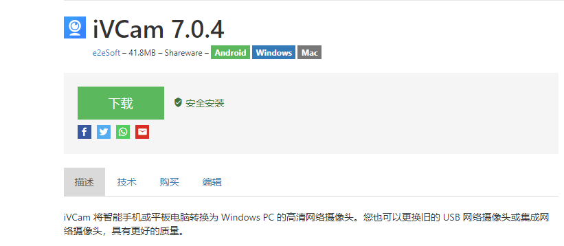
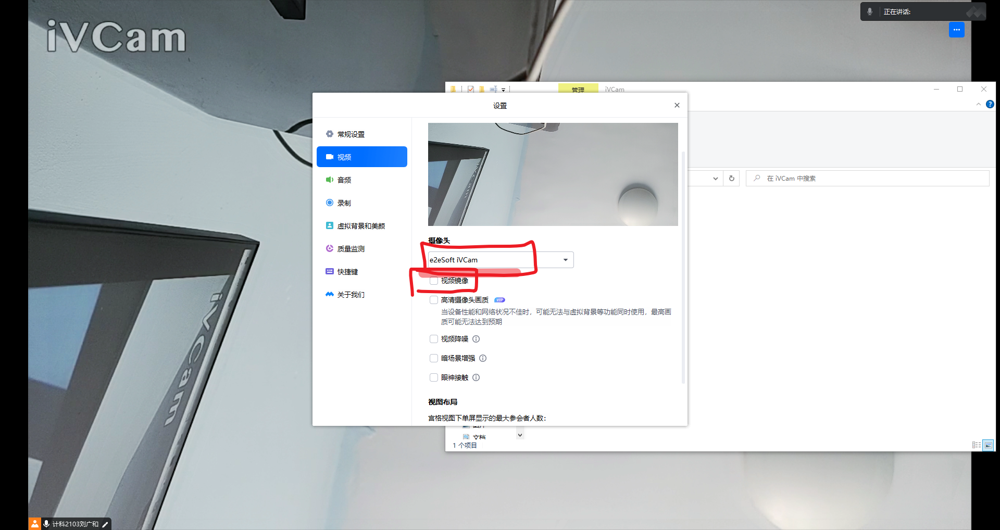

# 软件


## intel idea调试

绿色左上下: 一步一步的向下运行代码，不会走入任何方法中。
绿色下: 一步一步的向下运行代码，不会走入系统类库的方法中，但是会走入自定义的方法中。
红色下: 一步一步的向下运行代码，会走入系统类库的方法中，也会走入自定义的方法中。
绿色上: 跳出方法


在断点处`右击`调出条件断点。可以在满足某个条件下，实施断点。

	比如设置for循环i等于67的时候


## termux

```sh
pkg install openssh
sshd
passwd
whoami

pkg install vim
termux-setup-storage

vim ~/.bashrc


/storage
~/storage 是两个不同的文件夹

~ $ ls
storage
~ $ cd storage/
~/storage $ pwd
/data/data/com.termux/files/home/storage


/storage/emulated/0/nas_redmi

```


## nas面板
windows

sun-panel_v1.3.0_windows_amd64.zip

## 腾讯会议 使用手机的摄像头


所使用的软件



### 手机安装软件

直接安装即可


### 电脑安装软件

一直点击下一步,安装即可


### 最后打开电脑和手机端软件,  插入usb数据线    即可链接


# 腾讯会议配置





## scrcpy手机投屏

    下载adb和scrcpy
    手机打开调试

    有线
    Scrcpy
    连接成功


    无线
    有线
    adb tcpip 5555
    adb connect 192.168.101.12:5555
    Scrcpy


## 罗技m590鼠标 两个都是蓝牙,接收器失效

下载软件,操作一下就好

[下载链接](./assets/unifying250.zip)


## windows终端使用clash的代理


启动脚本
set http_proxy=http://127.0.0.1:7890
set https_proxy=socks://127.0.0.1:7890
curl google.com
@echo off
echo !!!!!!!!!!!!!!!!!!!!!!!!! proxy start success !!!!!!!!!!!!!!!!!!!!!!!!! 
echo !!!!!!!!!!!!!!!!!!!!!!!!! proxy start success !!!!!!!!!!!!!!!!!!!!!!!!! 
echo !!!!!!!!!!!!!!!!!!!!!!!!! proxy start success !!!!!!!!!!!!!!!!!!!!!!!!! 

禁用脚本
set http_proxy=
set https_proxy=
@echo off
echo !!!!!!!!!!!!!!!!!!!!!!!!! proxy off success !!!!!!!!!!!!!!!!!!!!!!!!! 
echo !!!!!!!!!!!!!!!!!!!!!!!!! proxy off success !!!!!!!!!!!!!!!!!!!!!!!!! 
echo !!!!!!!!!!!!!!!!!!!!!!!!! proxy off success !!!!!!!!!!!!!!!!!!!!!!!!! 


# 硬件


## esp8266

### esp8266+DHT11温湿传感器 制作web室内温度计

    DHT和Adafruit Unified Sensor
    DHT 1.3.9
    Adafruit Unified Sensor 1.1.2


代码如下

> 修改代码中得到wifi名称和密码

```c++
#include <ESP8266WiFi.h>
#include <ESP8266WebServer.h>
#include "DHT.h"
// Uncomment one of the lines below for whatever DHT sensor type you're using!
#define DHTTYPE DHT11   // DHT 11
//#define DHTTYPE DHT21   // DHT 21 (AM2301)
//#define DHTTYPE DHT22   // DHT 22  (AM2302), AM2321
/*Put your SSID & Password*/
const char* ssid = "end";  // Enter SSID here
const char* password = "12345678";  //Enter Password here
ESP8266WebServer server(80);
// DHT Sensor
uint8_t DHTPin = D4; 
// Initialize DHT sensor.
DHT dht(DHTPin, DHTTYPE);                
float Temperature;
float Humidity;
void setup() {
  Serial.begin(115200);
  delay(100);
  pinMode(DHTPin, INPUT);
  dht.begin();              
  Serial.println("Connecting to ");
  Serial.println(ssid);
  //connect to your local wi-fi network
  WiFi.begin(ssid, password);
  //check wi-fi is connected to wi-fi network
  while (WiFi.status() != WL_CONNECTED) {
  delay(1000);
  Serial.print(".");
  }
  Serial.println("");
  Serial.println("WiFi connected..!");
  Serial.print("Got IP: ");  Serial.println(WiFi.localIP());
  server.on("/", handle_OnConnect);
  server.onNotFound(handle_NotFound);
  server.begin();
  Serial.println("HTTP server started");
}
void loop() {
  server.handleClient();
}
void handle_OnConnect() {
 Temperature = dht.readTemperature(); // Gets the values of the temperature
  Humidity = dht.readHumidity(); // Gets the values of the humidity 
  server.send(200, "text/html", SendHTML(Temperature,Humidity)); 
}
void handle_NotFound(){
  server.send(404, "text/plain", "Not found");
}
String SendHTML(float Temperaturestat,float Humiditystat){
  String ptr = "<!DOCTYPE html> <html>\n";
  ptr +="<head> <meta name=\"viewport\" content=\"width=device-width,  initial-scale=1.0, user-scalable=no\">\n";
  ptr +="<link href=\"https://fonts.googleapis.com/css?family=Open+Sans:300,400,600\" rel=\"stylesheet\">\n";
  ptr +="<meta charset=\"UTF-8\">\n";
  ptr +="<title>智能温湿计</title>\n";
  ptr +="<style>html { font-family: 'Open Sans', sans-serif; display: block; margin: 0px auto; text-align: center;color: #333333;}\n";
  ptr +="body{margin-top: 50px;}\n";
  ptr +="h1 {margin: 50px auto 30px;}\n";
  ptr +=" .wd {margin: 50px auto 30px;width: auto;color: #f39c12}\n";
  ptr +=" .wd1 {margin: 50px auto 30px;width: auto;color: #3498db}\n";
  ptr +=".side-by-side{display: inline-block;vertical-align: middle;position: relative;}\n";
  ptr +=".humidity-icon{background-color: #3498db;width: 30px;height: 30px;border-radius: 50%;line-height: 36px;}\n";
  ptr +=".humidity-text{font-weight: 600;padding-left: 15px;font-size: 19px;width: 160px;text-align: left;}\n";
  ptr +=".humidity{font-weight: 300;font-size: 60px;color: #3498db;}\n";
  ptr +=".temperature-icon{background-color: #f39c12;width: 30px;height: 30px;border-radius: 50%;line-height: 40px;}\n";
  ptr +=".temperature-text{font-weight: 600;padding-left: 15px;font-size: 19px;width: 160px;text-align: left;}\n";
  ptr +=".temperature{font-weight: 300;font-size: 60px;color: #f39c12;}\n";
  ptr +=".superscript{font-size: 17px;font-weight: 600;position: absolute;right: -20px;top: 15px;}\n";
  ptr +=".data{padding: 10px;}\n";
  ptr +="</style>\n";
  ptr +="</head>\n";
  ptr +="<body>\n";
   ptr +="<div id=\"webpage\">\n";
   ptr +="<h1>室内温室检测系统</h1>\n";
   ptr +="<div class=\"data\">\n";
   ptr +="<div class=\"side-by-side temperature-icon\">\n";
   ptr +="<svg version=\"1.1\" id=\"Layer_1\" xmlns=\"http://www.w3.org/2000/svg\" xmlns:xlink=\"http://www.w3.org/1999/xlink\" x=\"0px\" y=\"0px\"\n";
   ptr +="width=\"9.915px\" height=\"22px\" viewBox=\"0 0 9.915 22\" enable-background=\"new 0 0 9.915 22\" xml:space=\"preserve\">\n";
   ptr +="<path fill=\"#FFFFFF\" d=\"M3.498,0.53c0.377-0.331,0.877-0.501,1.374-0.527C5.697-0.04,6.522,0.421,6.924,1.142\n";
   ptr +="c0.237,0.399,0.315,0.871,0.311,1.33C7.229,5.856,7.245,9.24,7.227,12.625c1.019,0.539,1.855,1.424,2.301,2.491\n";
   ptr +="c0.491,1.163,0.518,2.514,0.062,3.693c-0.414,1.102-1.24,2.038-2.276,2.594c-1.056,0.583-2.331,0.743-3.501,0.463\n";
   ptr +="c-1.417-0.323-2.659-1.314-3.3-2.617C0.014,18.26-0.115,17.104,0.1,16.022c0.296-1.443,1.274-2.717,2.58-3.394\n";
   ptr +="c0.013-3.44,0-6.881,0.007-10.322C2.674,1.634,2.974,0.955,3.498,0.53z\"/>\n";
   ptr +="</svg>\n";
   ptr +="</div>\n";
   ptr +="<div class=\"side-by-side temperature-text\">室内温度：</div>\n";
   ptr +="<div class=\"side-by-side temperature\">";
   ptr +=(int)Temperaturestat;
   ptr +="<span class=\"superscript\">°C</span></div>\n";
   ptr +="</div>\n";
   ptr +="<div class=\"data\">\n";
   ptr +="<div class=\"side-by-side humidity-icon\">\n";
   ptr +="<svg version=\"1.1\" id=\"Layer_2\" xmlns=\"http://www.w3.org/2000/svg\" xmlns:xlink=\"http://www.w3.org/1999/xlink\" x=\"0px\" y=\"0px\"\n\"; width=\"12px\" height=\"17.955px\" viewBox=\"0 0 13 17.955\" enable-background=\"new 0 0 13 17.955\" xml:space=\"preserve\">\n";
   ptr +="<path fill=\"#FFFFFF\" d=\"M1.819,6.217C3.139,4.064,6.5,0,6.5,0s3.363,4.064,4.681,6.217c1.793,2.926,2.133,5.05,1.571,7.057\n";
   ptr +="c-0.438,1.574-2.264,4.681-6.252,4.681c-3.988,0-5.813-3.107-6.252-4.681C-0.313,11.267,0.026,9.143,1.819,6.217\"></path>\n";
   ptr +="</svg>\n";
   ptr +="</div>\n";
   ptr +="<div class=\"side-by-side humidity-text\">室内湿度：</div>\n";
   ptr +="<div class=\"side-by-side humidity\">";
   ptr +=(int)Humiditystat;
   ptr +="<span class=\"superscript\">%</span></div>\n";
   ptr +="</div>\n";
   //定义温度变量，并且赋值，用于逻辑判断。
    int wd = Temperaturestat ;
   if (wd>=30){
    ptr +="<div class=\"wd\">今天天气热，注意防暑哦</div>\n";
   }
   if (29>=wd&&wd>20){
    ptr +="<div class=\"wd1\">今天天气不错吆，尽情的玩耍吧</div>\n";
   }
   if (wd<10){
    ptr +="<div class=\"side-by-side humidity-text\">今天天气比较冷，多穿点衣服，小心着凉</div>\n";
   }
   ptr +="</div>\n";
   ptr +="</body>\n";
   ptr +="</html>\n";
   return ptr;
  }
```

打开 工具>串口监视器

`设置为115200波特率` 按一下espp8266上面的的`RST`就可查看获取的ip地址


## 玩客云刷机

> 写入emmc

类似于安装系统,有的需要从u盘进去之后,自己安装, 线刷是直接就安装好了.

> 路由器中不显示ip

网线的问题,我的网线坏掉了(但是表面是正常的).切换网线之后正常了.

> 好几次短接不成功

物品是否导电,贴合是不是紧.

    第一次找的一个小博客的,自制的一个镜像,出现了docker异常等等,源也有问题,我在网上换源也不对.
    第二次找的一个up主的,有成功的评论,之后就成功了
    网线异常,导致我判断错误
    杂乱的文档,导致我出错,有的包中会自己写入emmc,有的需要手动,有的是线刷,有的插入u盘,导致我晕了

###  docker适配镜像

> 玩客云-casaos之下载服务器 
 
> 下载工具1 aria2
 
```
docker run -d \
    --name aria2-pro \
    --restart unless-stopped \
    --log-opt max-size=1m \
    --network host \
    -e PUID=1000 \
    -e PGID=1000 \
    -e RPC_SECRET=12345 \
    -e RPC_PORT=6800 \
    -e LISTEN_PORT=6888 \
    -v /mnt/aria2/config:/config \
    -v /mnt/downloads:/downloads \
    p3terx/aria2-pro
 
webui -ariang
 
docker run -d     --name ariang     --restart unless-stopped     --log-opt max-size=1m     -p 6880:6880     p3terx/ariang
```
 
> 玩客云-casaos之下载工具2  transmission

 
```
docker run -d \
   --name=transmission \
   -e USERNAME=admin \
   -e PASSWORD=admin \
   -e TRANSMISSION_WEB_HOME=/transmission-web-control \
   -e TZ=Asia/ShangHai \
   -e PUID=1000 \
   -e PGID=1000 \
   -p 9091:9091 \
   -p 51413:51413 \
   -p 51413:51413/udp \
   -v /mnt/docker/transmission/config:/config \
   -v /mnt/downloads:/downloads \
   -v /mnt/docker/transmission/watch:/watch \
   --restart unless-stopped \
lscr.io/linuxserver/transmission:version-3.00-r5
 
图标拉取：https://cdn.jsdelivr.net/gh/IceWhaleTech/CasaOS-AppStore@main/Apps/Transmission/icon.png
 
transmission安装中文界面
到docker的shell中
 
试试吧，我是先安装好，
 
wget https://github.com/ronggang/transmission-web-control/raw/master/release/install-tr-control-cn.sh
bash install-tr-control-cn.sh
 
export TRANSMISSION_WEB_HOME=/transmission-web-control
 
```
> 玩客云-Casaos之影音服务器

> 个人影视库jellyfin

 
```
docker run -d \
  --name jellyfin \
  -p 8096:8096 \
  --restart always \
  -v /mnt/docker/jellyfin/config:/config \
  -v /mnt/docker/jellyfin/cache:/cache \
  -v /opt/vc/lib:/opt/vc/lib \
  -v /mnt/downloads:/media \
  -v /mnt/tv:/tvshows \
  --net=host \
 jellyfin/jellyfin:latest
```

> 个人电子书库

```
docker run -d \
   --name=calibre-web \
   -e PUID=0 \
   -e PGID=0  \
   -e TZ=Asia/ShangHai \
   -p 8083:8083 \
   -v /mnt/docker/calibre/config:/config \
   -v /mnt/docker/calibre/library:/books \
   --restart unless-stopped \
   lscr.io/linuxserver/calibre-web:nightly-version-c0675497
```

有bug,需要一个db数据库文件

 

 
> 同步神器syncthing
 
```
 docker run -d \
      --name syncthing \
      --restart unless-stopped \
      --network host \
      -e PUID=1000 \
      -e PGID=1000 \
      -p 8384:8384 \
      -p 22000:22000/tcp \
      -p 22000:22000/udp \
      -p 21027:21027/udp \
      -v /mnt/sync-thing/config:/var/syncthing/config  #注意目录修改一下
      -v /mnt/sync-thing:/var/syncthing \
     syncthing/syncthing:latest
```
 
 
 
> 智能家居控制系统
 
```
docker run \
   -d \
   --restart=always \
   --name="home-assistants" \
   -v /mnt/docker/homeassistant/config:/config \
   --net=host \
homeassistant/home-assistant:latest
 
```
 
 
运行有点吃力了

> 安装HACS

```
cd /usr/share/hassio/homeassistant/custom_components/hacs
wget https://github.com/hacs/integration/releases/latest/download/hacs.zip
apt install unzip
unzip hacs.zip
 
 
HA可以和node-red ESPMome MQTT组合
 
```
 
 
 
> 云笔记工具

```
docker run -d --name trilium -p 0.0.0.0:8080:8080 -v /mnt/trilium:/home/node/trilium-data zadam/trilium
```
 
> Navidrome


个人音乐服务器

```sh
docker run -d \
   --name navidrome \
   --restart=unless-stopped \
   --user $(id -u):$(id -g) \
   -v /root/music:/music \
   -v /root/music/data:/data \
   -p 4533:4533 \
   -e ND_LOGLEVEL=info \
   deluan/navidrome:latest
```
 


## 刷机和装机


###  无u盘安装系统思路

单硬盘双系统

1. 首先分两个空的区，一个用烧录软件烧入系统的u盘镜像
2. 之后启动刷入u盘镜像的分区
3. 安装到最后一个空盘

装机有风险，注意备份


###  windows C盘满了D盘空余,扩容方案
> 在一个硬盘分了好几个区的情况下

```
压缩D
创建E
copy all files from D to E
del D
expansion C
copy all files from E to C
del E
expansion C
```


# windows

## windows启动目录

一共有两个,一个系统的,一个用户的,都会加载
C:\ProgramData\Microsoft\Windows\Start Menu\Programs\StartUp
C:\Users\lgh\AppData\Roaming\Microsoft\Windows\Start Menu\Programs\Startup

## 电源管理

### 笔记本电源管理中没有处理器电源管理的解决办法

regedit进入注册表，路径：`HKEY_LOCAL_MACHINE\SYSTEM\CurrentControlSet\Control\Power\PowerSettings\54533251-82be-4824-96c1-47b60b740d00\bc5038f7-23e0-4960-96da-33abaf5935ec`，在右侧新建一个DWORD(32)，命名为Attributes，值为2，然后再进去电源管理，就有处理器电源选项了。


### 使用代码更改windows电源计划

1. 列出可用的电源计划

`powercfg -LIST`


```
Existing Power Schemes (* Active)

Power Scheme GUID: {guidPlan1}  (Balanced) *
Power Scheme GUID: {guidPlan2}  (Power saver)
```

请注意要更改的电源计划旁边列出的 GUID。 你将会需要这些 GUID 来手动更新设置并捕获电源计划。

2. 修改

```
powercfg -SETACTIVE {guidPlan2}
```

## wsl

### 每次打开以root用户运行

`C:\Users\lgh\AppData\Local\Microsoft\WindowsApps\ubuntu.exe config --default-user root`


### linux局域网代理使用

	转发是否可以达到公网使用的目的?

```
export http_proxy="http://172.23.32.1:7890"
export https_proxy="https://172.23.32.1:7890"
curl --proxy 172.23.32.1:7890 www.google.com
```


```
主机的代理软件使用的是clash for windows，需要开启LAN连接，默认端口为7890，下面为一些常用命令：

# 查看DNS服务器
cat /etc/resolv.conf
# 查看WSL2的ip地址
ifconfig
# 查看代理地址
env|grep -i proxy
只需要把鼠标放到clash for windows的Allow LAN这一栏，查看本机ip地址和虚拟机ip地址，这两个ip地址的7890端口都可以作为代理地址使用，如果仅本次使用，可以设置临时代理：

# 将ip地址换为本机ip或者虚拟机ip
export http_proxy="<http://172.31.128.1:7890>"
export https_proxy="<https://172.31.128.1:7890>"
也可以新建一个.proxy文件，用的时候source ~/.proxy一下即可。

# 永久代理
vim ~/.proxy
# 粘贴这段，ip是本机ip或者虚拟机ip
export https_proxy="<http://10.242.173.77:7890>";
export http_proxy="<http://10.242.173.77:7890>";

# 开启代理
source ~/.proxy
# 关闭代理
unset https_proxy
unset http_proxy
如果仅单次使用，或者为了测试，可以使用如下命令：

# 将ip地址换为本机ip或者虚拟机ip
curl --proxy 172.20.224.1:7890 www.google.com
curl --proxy 10.242.173.77:7890 www.google.com
如果你是其他不支持LAN的代理软件，可以通过端口转发命令实现该功能。

建议开启wsl2后重启一下clash代理软件。
```


# 苹果

## 给ipad9刷台前调度

1. 用来安装软件: 巨魔/爱思助手

安装巨魔需要用到爱思助手安装另一个软件,之后一步步的安装. 也许可以直接用爱思助手安装,但是爱思助手安装的最多可以使用7天.

    不可以用爱思直接安装巨魔,官方的安装教程也不是这个,原因可能是爱思助手直接安装的权限不够


2. 安装用来管理苹果系统资源文件 filza

这个软件可以修改苹果的系统代码,之后就可以通过修改代码,开启台前调度,类似修改windows注册表


> 各个软件各种版本之间会有依赖,和操作系统之间也有依赖,所以要抄作业,找一套适合的版本.

此处使用的版本
iso16.6.1
ipad9
filza4.0


## wsl


## win10没有休眠
1.关机选项里没有休眠，但是电源选项里有. 解决办法：右键右下角电源选择 电源选项 ， 选择电源按钮的功能 ，然后 更改当前不可用的设置， 勾选快速启动和休眠即可. 2.关机选项里没有休眠，电源选项里也没有. 解决办法：以管理员身份运行命令提示符，运行命令： powercfg -h on。. 启用休眠以后，你再重新进入 更改当前不可用的设置 ，就可以看到"启用快速启动"和"休眠"选项了

 

下面是官网的方法：

1按键盘上的Windows按钮以打开“开始”菜单或“开始”屏幕。
2搜索 cmd。 在搜索结果列表中，右键单击命令提示符，然后单击以管理员身份运行。
3显示“用户帐户控制”提示时，请单击继续。
4在命令提示符处，键入 powercfg.exe /hibernate on，然后按 Enter。
5键入 exit，然后按 Enter 以关闭命令提示符窗口。


## 运用命令行格式化 硬盘或者分区
先点开始→所有程序→附件→右键点击命令提示符→以管理员身份运行。

2、然后在CMD命令行输入diskpart后回车。

3、然后输入list volume查看分区信息。list disk

4、输入命令选择U盘的盘符，如U盘为F盘则输入命令>select volume F，回车即选择U盘。 select disk1

5、选中后输入格式化命令format quick fs=fat32，回车即格式化成功，U盘被格式化为Fat32。完成效果图。 Clean 之后 打开磁盘管理 分一下区即可


## windows cmd操作

md newdir
echo 11>>a.cpp
type test.txt 查看


## 快捷键

右键+shift 打开

win+x+u 关机

win+x+r 重启

alt+空格+c 关闭当前窗口

win+r 运行

ctrl+t 增加一个窗口

ctrl+n重开一个窗口

ctrl+123456 切换浏览器标签

ctrl+9 最后一个标签页

ctrl+shift+t

win+x
 

Windows+s 搜索

Windows+shift+s 截图

Windows+V 剪切板

Windows+h 听写 hear

Windows+D 窗口最小化

Windows+l 锁定屏幕

Windows+箭头 对齐

Windows+a 常用设置


## bat

### 批量修改后缀名的bat程序
ren *.mp4 *.mp

cmd /k 运行完毕之后不关闭cmd 窗口
cmd /c 运行完之后关闭cmd窗口
cmd /k "c/windows/kali&&rdial.exe 19811111111 123123"
cmd /k "radial.exe 19821111111 123123"

cmd /k "cd /d F:\"

链接服务器的脚本
cmd /k "ssh root@8.134.64.48"


开机启动bat
C:\ProgramData\Microsoft\Windows\Start Menu\Programs\StartUp


##  win10系统，找不到gpedit.msc文件怎么办？组策略编辑器添加方法
新建一个bat程序

随后在记事本中复制以下代码。

@echo off

pushd "%~dp0"

dir /b %systemroot%\Windows\servicing\Packages\Microsoft-Windows-GroupPolicy-ClientExtensions-Package~3*.mum >gp.txt

dir /b %systemroot%\servicing\Packages\Microsoft-Windows-GroupPolicy-ClientTools-Package~3*.mum >>gp.txt

`for /f %%i in ('findstr /i . gp.txt 2^>nul') do dism /online /norestart /add-package:"%systemroot%\servicing\Packages\%%i"``

pause

随后在保存的gpedit.bat上右键选择“以管理员真实身份运行”。


## 调节开始菜单 位置
路径
C:\Users\kali\AppData\Roaming\Microsoft\Windows\Start Menu\Programs


## 装机

装机记录 安装windows操作系统 安装linux kali ubuntu 操作系统
微pe 制作开机启动u盘 winpe
软碟通 烧录(linux)等 只能通过这种方法安装
微软官方提供镜像下载

windows
进入winpe后如果无法安装 用工具直接还原磁盘 (制作工具winpe)

linux
安装旧版本, 新版本不兼容情况我遇到过两次

注意:
笔记本电脑bios安全启动需要关闭


## vscode编译的exe程序运行缓慢

原因:开启了windows defender安全中心 会对exe可执行文件进行安全扫描

解决方案:关闭windows defender安全中心 或者是将该文件夹排除扫描

具体位置:
病毒和威胁防护设置:排除项


## 使用cmd命令查看WiFi密码
netsh wlan show profiles
netsh wlan show profiles A key=clear (A替换成你的WiFi名称)


## powershell cmd中使用ssh 连接 服务器

连接
ssh 用户名@ip

### 服务器配置

参数配置
修改 sshd_config 文件，命令为： vim /etc/ssh/sshd_config
将 #PubkeyAuthentication no 的注释去掉，并且将 NO 修改为 YES //kali中默认是yes
将 PermitRootLogin without-password 修改为 PermitRootLogin yes
保存退出

 启动 ssh 服务
启动
service ssh start 或者 /etc/init.d/ssh start

检测 ssh 服务状态：
service ssh status 或者 /etc/init.d/ssh status

设置自启动
update-rc.d ssh enable //系统自动启动SSH服务
update-rc.d ssh disabled // 关闭系统自动启动SSH服务

检测端口是否启动成功
netstat -lnt


### 文件传输
从主机下载文件
scp root@8.134.64.48:/root/a.mp4 D:\
scp -r root@8.134.64.48:/root/nginx D:\aa\
上传文件到服务器

就是上述的反过来写
scp  D:\ root@8.134.64.48:/root/a.mp4


## 配置SSH免密登录

windows
cmd 输入 `ssh-keygen -t rsa `
打开生成的秘钥保存路径，拷贝 `id_rsa.pub `内容，添加到到云服务器的` ~/.ssh/authorized_keys` 文件后面。

